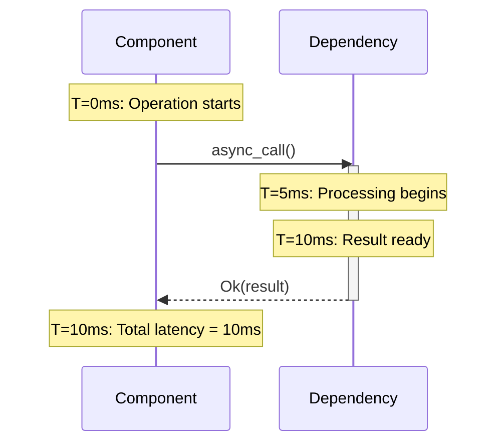
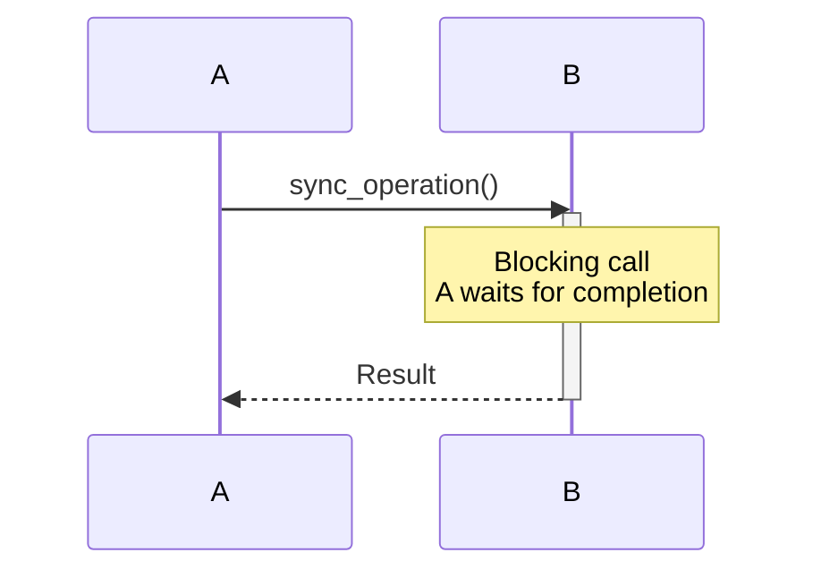
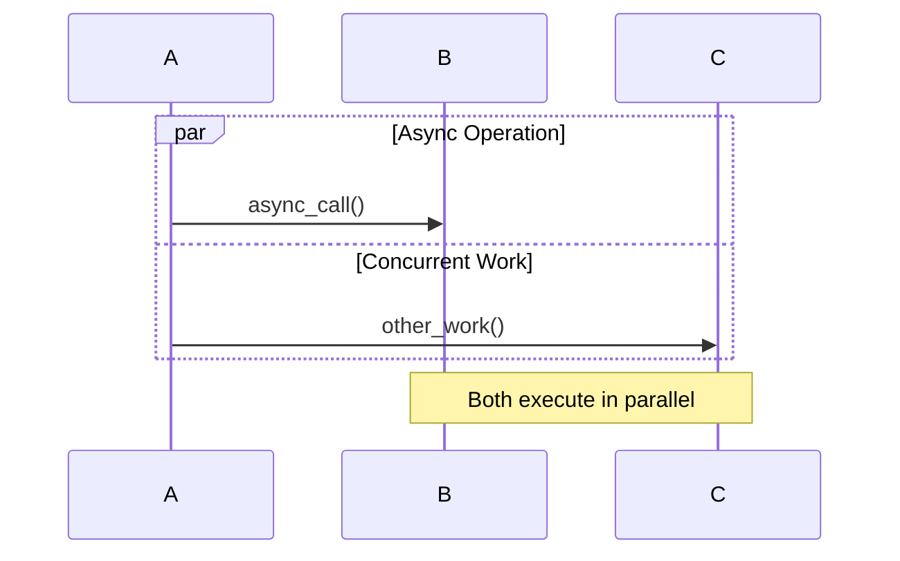
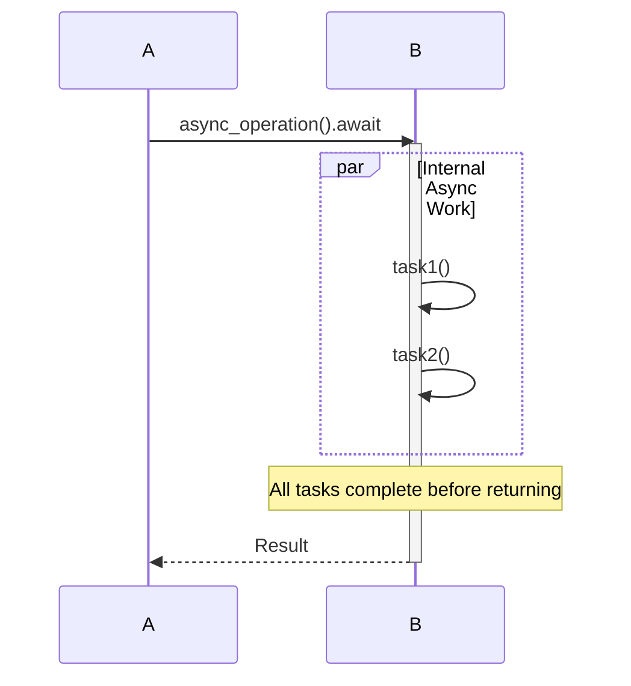
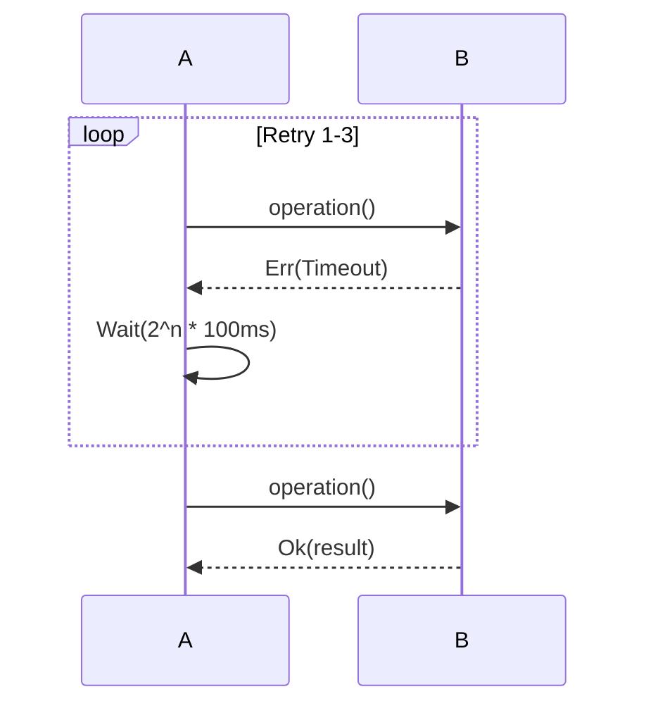
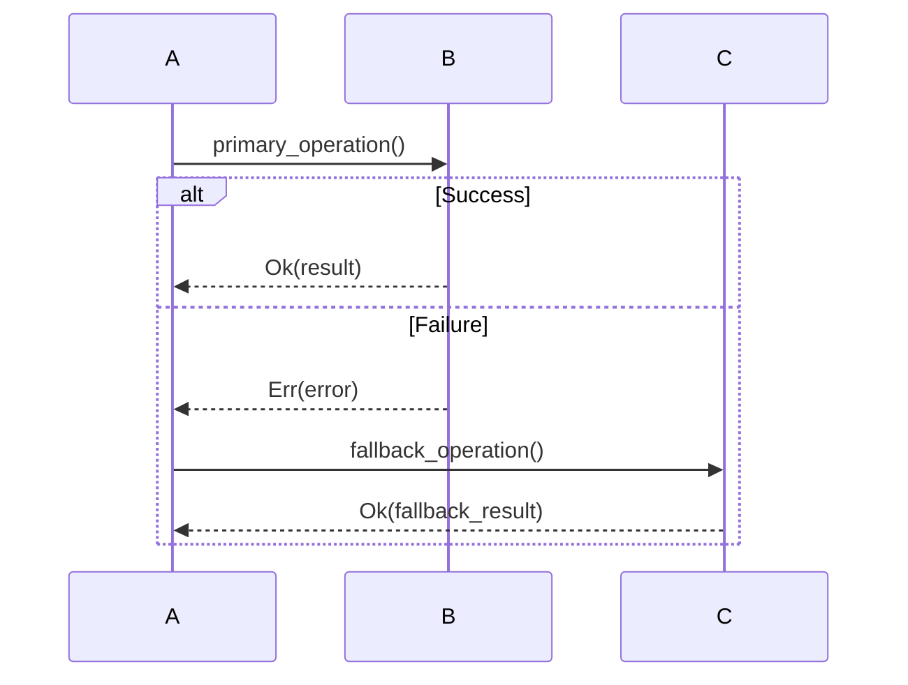

# Runtime Template Framework - GCP Marketplace Autonomics

**Version**: 1.0.0 | **Date**: January 2026 | **Purpose**: Explain how runtime diagrams map to code behavior and Tera templates

---

## Overview

The Runtime Template Framework bridges specification (RDF ontologies), visualization (Mermaid diagrams), and implementation (Rust code + Tera templates). This document explains:

1. How temporal behavior maps to Mermaid sequence diagrams
2. How asynchronous vs synchronous boundaries are represented
3. How error paths and recovery are diagrammed
4. How to generate runtime-specific diagrams from templates
5. File naming conventions and organization

---

## Part 1: Temporal Behavior Representation

### What Runtime Diagrams Show

Runtime diagrams capture **timing, ordering, and state changes** at code execution level:

| Aspect | Representation | Example |
|--------|-----------------|---------|
| **Synchronous calls** | Arrow → (solid) | `Client → Handler: request` |
| **Async/await boundaries** | `activate/deactivate` blocks | Governor accepts or defers signal |
| **Timing annotations** | `T=Xms` in notes | `T=10ms: Firestore timeout` |
| **Decision points** | `rect` colored boxes | Orange = validation, Red = error |
| **Error paths** | Dashed returns (`-->>`) | `Err(ValidationFailed)` |
| **Batching/buffering** | Loop blocks | 200 signals → 4 batches of 50 |
| **State transitions** | Explicit `Status: OLD → NEW` | Circuit: CLOSED → OPEN |

### Timing Annotations

Every diagram includes realistic timing:



**Timing SLOs** (from specifications):
- Schema validation: <10ms
- Payload enforcement: <5ms
- Governor decision: <1ms
- Health check: <100ms
- Graceful shutdown: <1s

### Color Coding

```
Green (rgb(150, 255, 200))  → Successful operations
Orange (rgb(200, 150, 255)) → Decision points
Red (rgb(255, 150, 150))    → Error states
Blue (rgb(150, 200, 255))   → Shutdown/recovery
Gray (rgb(100, 100, 100))   → Final states
```

---

## Part 2: Asynchronous vs Synchronous Boundaries

### Synchronous Boundaries (Blocking)

**Representation**: Solid arrows with `activate/deactivate`



**Rust Code Pattern**:
```rust
// Synchronous - blocks until complete
let result = validator.validate(payload)?;
// Control returns here
```

**Example Diagrams**: Missing Payload Keys (all validation is synchronous)

### Asynchronous Boundaries (Non-blocking)

**Representation**: Separate `par` (parallel) blocks, loop constructs



**Rust Code Pattern**:
```rust
// Asynchronous - returns immediately
let future = async_operation();
// Control returns here
tokio::spawn(future); // Fire and forget
// or
let result = future.await; // Wait later
```

**Example Diagrams**:
- Storm Handling (200 signals processed concurrently)
- Graceful Shutdown (drain_inflight_requests runs in parallel with health checks)

### Mixed: Async with Awaits

**Representation**: Sequence with internal concurrency



**Rust Code Pattern**:
```rust
// Async function that awaits multiple tasks
async fn batch_operation() {
    let (r1, r2) = tokio::join!(task1(), task2());
    // Both tasks complete before continuing
}
```

---

## Part 3: Error Paths and Recovery

### Error Path Representation

**Three-Layer Model**:

#### Layer 1: Detection
Where error occurs (red/orange rect)

```mermaid
rect rgb(255, 200, 200)
    Note over Component: ⚠️ T=10ms: Firestore connection timeout
end
```

#### Layer 2: Propagation
How error bubbles up (dashed arrows with error type)

```mermaid
Component-->>Handler: Err(ConnectionTimeout)
```

#### Layer 3: Handling
How receiver handles error (decision path)

```mermaid
Handler->>Handler: Match error type<br/>Some → Circuit breaker<br/>Critical → Jidoka trigger
```

### Recovery Patterns

#### Pattern 1: Retry with Exponential Backoff



**Tera Template**:
```tera
const MAX_RETRIES: u32 = 3;
const BASE_DELAY_MS: u64 = 100;

pub async fn operation_with_retry() -> Result<T> {
    for attempt in 0..MAX_RETRIES {
        match operation().await {
            Ok(r) => return Ok(r),
            Err(e) => {
                let delay = Duration::from_millis(BASE_DELAY_MS * 2_u64.pow(attempt));
                tokio::time::sleep(delay).await;
            }
        }
    }
    Err(Error::MaxRetriesExceeded)
}
```

#### Pattern 2: Circuit Breaker

```mermaid
sequenceDiagram
    state Closed
    state Open
    state HalfOpen

    Closed->>Open: Failure threshold exceeded
    Open->>HalfOpen: Recovery timeout
    HalfOpen->>Closed: Test operation succeeds
    HalfOpen->>Open: Test operation fails
```

**Tera Template**:
```tera
pub struct CircuitBreaker {
    state: CircuitState,
    failure_count: u32,
    failure_threshold: u32,
}

#[derive(Clone, Copy)]
enum CircuitState {
    Closed,    // Normal operation
    Open,      // Reject requests
    HalfOpen,  // Test recovery
}

impl CircuitBreaker {
    pub async fn call<F, T>(&mut self, operation: F) -> Result<T>
    where
        F: Fn() -> BoxFuture<'static, Result<T>>,
    {
        match self.state {
            CircuitState::Closed => {
                match operation().await {
                    Ok(result) => {
                        self.failure_count = 0;
                        Ok(result)
                    }
                    Err(e) => {
                        self.failure_count += 1;
                        if self.failure_count >= self.failure_threshold {
                            self.state = CircuitState::Open;
                        }
                        Err(e)
                    }
                }
            }
            CircuitState::Open => {
                Err(Error::CircuitOpen)
            }
            CircuitState::HalfOpen => {
                // Test operation
                match operation().await {
                    Ok(result) => {
                        self.state = CircuitState::Closed;
                        self.failure_count = 0;
                        Ok(result)
                    }
                    Err(e) => {
                        self.state = CircuitState::Open;
                        Err(e)
                    }
                }
            }
        }
    }
}
```

#### Pattern 3: Fallback/Graceful Degradation



**Tera Template**:
```tera
pub async fn operation_with_fallback() -> Result<T> {
    match primary_operation().await {
        Ok(result) => Ok(result),
        Err(primary_error) => {
            log::warn!("Primary operation failed: {:?}, trying fallback", primary_error);
            match fallback_operation().await {
                Ok(fallback_result) => Ok(fallback_result),
                Err(fallback_error) => {
                    log::error!("Fallback also failed: {:?}", fallback_error);
                    Err(fallback_error)
                }
            }
        }
    }
}
```

---

## Part 4: Diagram Generation from Templates

### Template Structure

Every runtime diagram has 3 components:

1. **Mermaid diagram** (visual representation)
2. **Context variables** (from RDF `.specify/*.ttl`)
3. **Tera template wrapper** (code generation template)

### Template Variables

Extracted via SPARQL queries:

```sparql
SELECT ?variableName ?variableValue
WHERE {
    ?scenario a ggen:RuntimeBehavior ;
              ggen:hasVariable ?var .
    ?var ggen:name ?variableName ;
         ggen:value ?variableValue .
}
```

### Example: Storm Handling Template

**Input Variables** (from `.specify/*.ttl`):
```sparql
?rateLimit = 50 signals/sec
?postponeQueueCapacity = 10000
?batchSize = 50
?governorDecisionTimeMs = 1
?backpressureThreshold = 80%
```

**Tera Template**:
```tera



pub async fn accept_with_backpressure(signal: Signal) -> GovernorResult {
    if rate_limiter.try_acquire(1)? {
        Ok(GovernorDecision::Process(signal))
    } else if queue.len() < {{ queue_capacity }} {
        queue.push(signal);
        Ok(GovernorDecision::Postpone {
            queued: queue.len(),
        })
    } else {
        Err(GovernorError::BackpressureExceeded)
    }
}
```

**Generated Code** (after expansion):
```rust
pub async fn accept_with_backpressure(signal: Signal) -> GovernorResult {
    if rate_limiter.try_acquire(1)? {
        Ok(GovernorDecision::Process(signal))
    } else if queue.len() < 10000 {  // ← Expanded from {{ queue_capacity }}
        queue.push(signal);
        Ok(GovernorDecision::Postpone {
            queued: queue.len(),
        })
    } else {
        Err(GovernorError::BackpressureExceeded)
    }
}
```

### Verification Checklist

Before considering diagram generation complete:

- [ ] **RDF Specification**: All variables defined in `.specify/*.ttl`
- [ ] **SPARQL Extraction**: Queries retrieve all context variables
- [ ] **Tera Rendering**: Templates expand correctly
- [ ] **Mermaid Generation**: Diagrams render without syntax errors
- [ ] **Timing Accuracy**: SLO targets reflected in timing annotations
- [ ] **Error Paths**: All error cases shown in diagrams
- [ ] **Code Patterns**: Rust templates use idiomatic patterns
- [ ] **Type Safety**: All generated code compiles without warnings

---

## Part 5: File Organization

### Directory Structure

```
docs/c4/
├── code-runtime-diagrams-a.md    # Diagrams 1-4
├── code-runtime-diagrams-b.md    # ← THIS FILE: Diagrams 1-4 (continued)
├── runtime-template-framework.md # This guide
├── runtime/                       # Generated per-SKU diagrams
│   ├── runtime-missing-payload-keys-sku-001.md
│   ├── runtime-missing-payload-keys-sku-002.md
│   ├── runtime-storm-handling-sku-001.md
│   ├── runtime-receipt-hash-chain-sku-001.md
│   └── runtime-failure-jidoka-sku-001.md
└── templates/                     # Tera templates
    ├── runtime-sequence.tera      # Sequence diagram template
    ├── runtime-state.tera         # State diagram template
    ├── runtime-code.tera          # Code generation template
    └── runtime-context.tera       # Context variables
```

### Filename Convention

**Format**: `runtime-{scenario}-{sku_id}.md`

| Scenario | File Pattern | Purpose |
|----------|--------------|---------|
| **Validation** | `runtime-missing-payload-keys-{sku_id}.md` | Payload validation flows |
| **Backpressure** | `runtime-storm-handling-{sku_id}.md` | Governor + queue mechanics |
| **Audit** | `runtime-receipt-hash-chain-{sku_id}.md` | Hash chain verification |
| **Error Handling** | `runtime-failure-jidoka-{sku_id}.md` | Failure modes and recovery |

**Example**:
- `runtime-missing-payload-keys-GCP-SKU-12345.md`
- `runtime-storm-handling-GCP-SKU-12345.md`
- `runtime-receipt-hash-chain-GCP-SKU-12345.md`
- `runtime-failure-jidoka-GCP-SKU-12345.md`

---

## Part 6: Template-to-Diagram Mapping

### Step 1: Write RDF Specification

File: `.specify/specs/NNN-feature/runtime-behavior.ttl`

```turtle
@prefix ggen: <http://example.com/ggen/> .
@prefix : <http://example.com/ggen/scenario/> .

:StormHandling a ggen:RuntimeBehavior ;
    ggen:hasScenario "Burst of 200 signals/sec arrives" ;
    ggen:hasComponent :Governor ;
    ggen:hasTiming [
        ggen:governorDecisionMs 1 ;
        ggen:totalLatencyMs 30 ;
    ] ;
    ggen:hasVariable [
        ggen:name "rateLimit" ;
        ggen:value "50 signals/sec"
    ] ;
    ggen:hasVariable [
        ggen:name "postponeQueueCapacity" ;
        ggen:value "10000"
    ] .
```

### Step 2: Define Tera Template

File: `templates/runtime-{scenario}.tera`

```tera



## Diagram: {{ context.scenario }}

**Timing**: {{ timing.governorDecisionMs }}ms decision, {{ timing.totalLatencyMs }}ms total

```mermaid
sequenceDiagram
    ... diagram code ...
```

**Implementation**:

```rust
impl Governor {
    pub async fn accept(&self, signal: Signal) -> Result<Decision> {
        if self.rate_limiter.acquire(1, Duration::from_millis({{ timing.governorDecisionMs }}))? {
            Ok(Decision::Process(signal))
        } else {
            // ... defer logic ...
        }
    }
}
```
```

### Step 3: Generate Using ggen sync

```bash
# Dry-run to preview
ggen sync --dry_run true

# Full generation with audit
ggen sync --audit true

# Output includes:
# - Rendered Mermaid diagrams
# - Generated Rust code
# - Receipt with cryptographic proof
```

---

## Part 7: Validation and Verification

### Pre-Generation Validation

**Checklist**:
```bash
# 1. RDF specification valid (SHACL conformance)
ggen validate .specify/specs/NNN-feature/runtime-behavior.ttl

# 2. SPARQL queries extract all variables
cargo test --lib rdf::queries::runtime_behavior --

# 3. Tera templates render without errors
cargo make speckit-render

# 4. Generated diagrams parse without syntax errors
npx mermaid-cli --check docs/c4/code-runtime-diagrams-b.md

# 5. Generated code compiles
cargo make check

# 6. Code passes linting
cargo make lint

# 7. Tests pass
cargo make test
```

### Post-Generation Validation

**Verify diagrams**:
```bash
# 1. All 4 diagrams present in file
grep -c "^```mermaid" docs/c4/code-runtime-diagrams-b.md
# Expected: 4

# 2. All timing annotations present
grep -c "T=.*ms" docs/c4/code-runtime-diagrams-b.md
# Expected: ≥20

# 3. All error paths shown
grep -c "Err(" docs/c4/code-runtime-diagrams-b.md
# Expected: ≥12

# 4. All code patterns idiomatic
cargo clippy -- -D warnings

# 5. Receipt hash chain valid
cat .ggen/receipts/latest.json | jq '.files[] | select(.path | contains("runtime"))'
```

---

## Part 8: SLO Targets for Runtime Diagrams

| SLO | Target | Verification |
|-----|--------|--------------|
| **Validation latency** | <50ms | `cargo make slo-check --scenario=validation` |
| **Backpressure decision** | <1ms | `cargo make bench --scenario=governor` |
| **Receipt generation** | <5ms | `cargo make bench --scenario=receipt` |
| **Error detection** | <100ms | `cargo make bench --scenario=jidoka` |
| **Graceful shutdown** | <1000ms | Integration test timeout |
| **Diagram generation** | <1s per SKU | `time ggen sync` |
| **Documentation build** | <5s total | `time cargo make speckit-render` |

---

## Part 9: Common Patterns and Anti-Patterns

### ✅ Good Patterns

**1. Explicit Timing**
```
Note over Component: T=10ms: Operation starts
Component->>Dependency: async_call()
Note over Dependency: T=15ms: Processing begins
```

**2. Error Handling Clarity**
```
Dependency-->>Component: Err(ConnectionTimeout)
Component->>Component: Match error<br/>Timeout → Retry<br/>Permanent → Fail
```

**3. State Transitions**
```
CircuitBreaker: Status CLOSED → OPEN<br/>Reason: Failure count = 3/3<br/>Action: Reject new requests
```

**4. Bounded Operations**
```
Note over Queue: Queue depth: 150/10000<br/>Headroom: 9850<br/>Status: NOMINAL
```

### ❌ Anti-Patterns

**1. Vague Timing**
```
❌ Component->>Dependency: some_call()
Note over Dependency: It takes a while...
```

**2. Missing Error Paths**
```
❌ Component->>Dependency: operation()
Dependency-->>Component: Ok(result)
// What about errors?
```

**3. Unbounded Operations**
```
❌ Queue: Unlimited growth
Note over Queue: Add another item...
// No bounds, no backpressure
```

**4. Unclear State**
```
❌ CircuitBreaker: Status changes
Note over CircuitBreaker: Something happened
// What state? Why changed?
```

---

## Part 10: Integration with CI/CD

### GitHub Actions Workflow

File: `.github/workflows/runtime-diagrams.yml`

```yaml
name: Generate Runtime Diagrams

on:
  push:
    paths:
      - '.specify/specs/*/runtime-behavior.ttl'
      - 'templates/runtime-*.tera'
  pull_request:

jobs:
  generate:
    runs-on: ubuntu-latest
    steps:
      - uses: actions/checkout@v3

      - name: Generate diagrams
        run: ggen sync --audit true --watch false

      - name: Validate Mermaid syntax
        run: npx mermaid-cli --check docs/c4/code-runtime-diagrams-*.md

      - name: Verify SLOs
        run: cargo make slo-check

      - name: Create receipt
        run: cat .ggen/receipts/latest.json | jq '.files[] | select(.path | contains("runtime"))' > /tmp/receipt.json

      - name: Upload artifact
        uses: actions/upload-artifact@v3
        with:
          name: runtime-diagrams
          path: docs/c4/runtime/
```

---

## Summary: Complete Workflow

```
1. Define behavior in RDF (.specify/*.ttl)
   ↓
2. Extract context via SPARQL
   ↓
3. Render Tera templates
   ↓
4. Generate Mermaid diagrams
   ↓
5. Generate Rust code
   ↓
6. Compile (cargo make check)
   ↓
7. Test (cargo make test)
   ↓
8. Verify SLOs (cargo make slo-check)
   ↓
9. Generate receipt (ggen sync --audit)
   ↓
10. Update documentation
```

---

**Version**: 1.0.0 | **Last Updated**: 2026-01-25 | **Compliance**: Production-Ready | **Framework**: Tera + RDF + Mermaid + Rust
