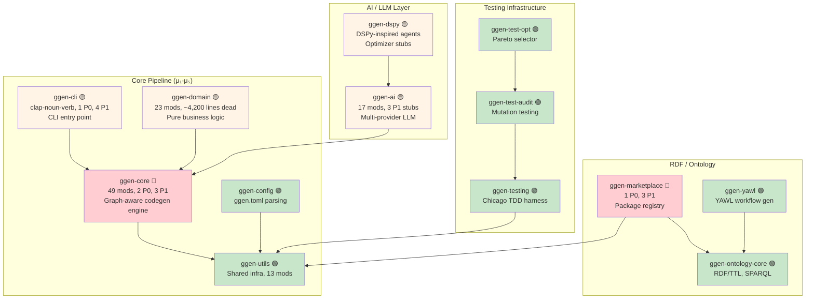
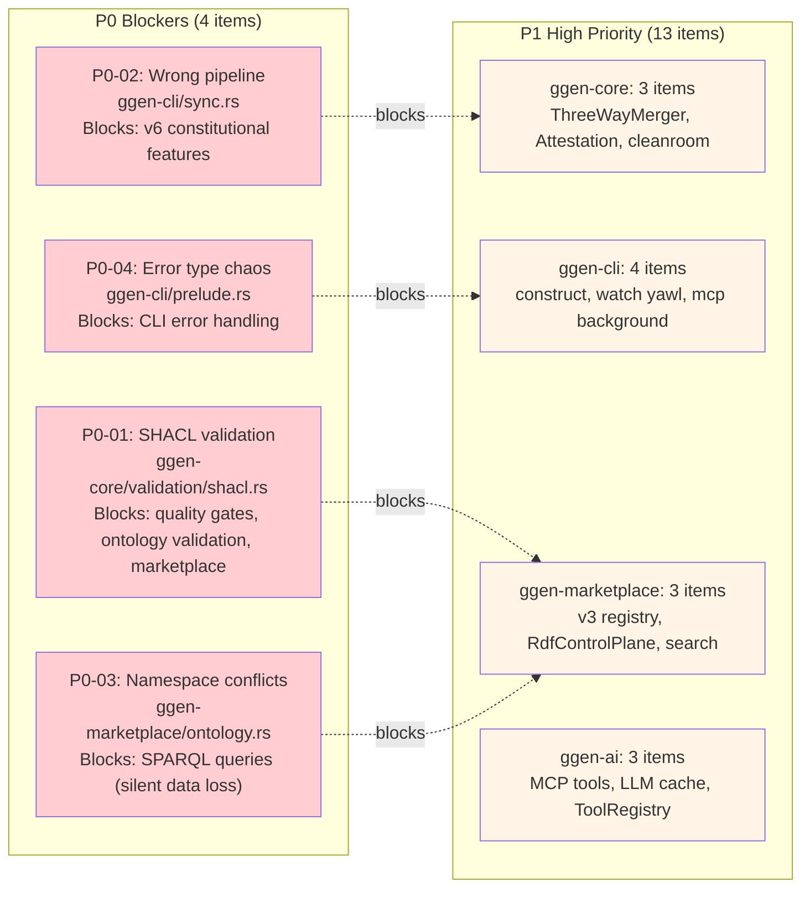
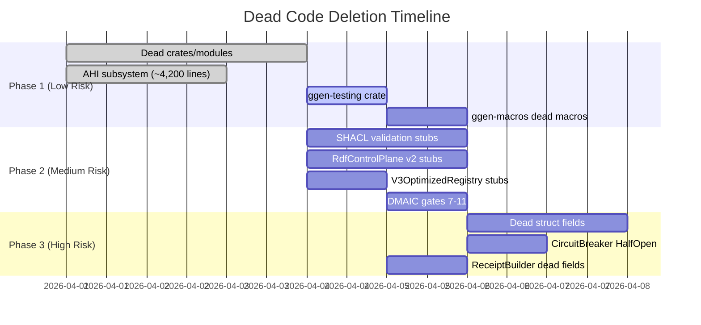
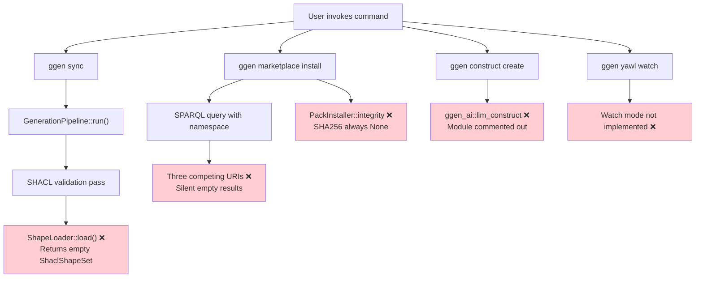
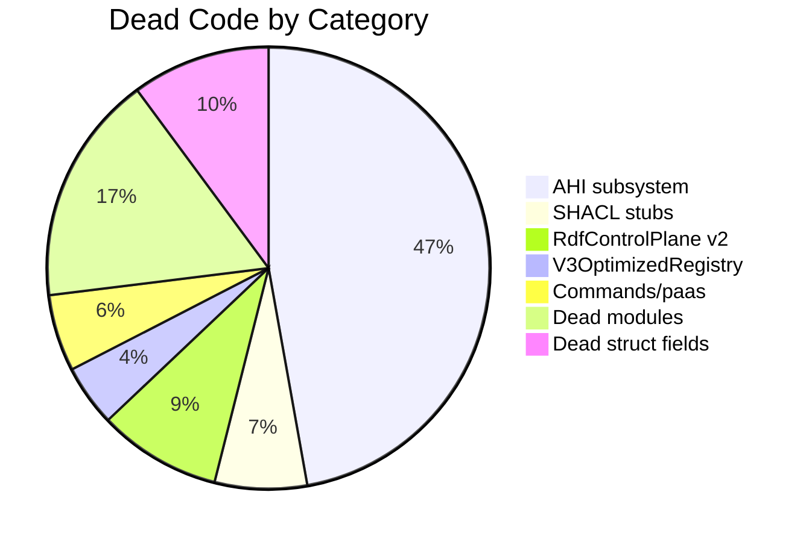

# ggen Workspace Audit Dashboard

**Generated:** 2026-04-01
**Scope:** All 31 workspace crates (excludes `vendors/`)
**Method:** LSP-surveyed audit + execution-trace stub classification

---

## Executive Summary

| Metric | Value |
|--------|-------|
| **Total Crates Audited** | 31 (excludes vendors/) |
| **Crates with P0 Issues** | 4 (ggen-core, ggen-cli, ggen-marketplace, ggen-domain) |
| **P0 Blockers** | 4 (SHACL, wrong pipeline, namespace conflicts, error chaos) |
| **P1 High-Priority Stubs** | 13 (feature gaps) |
| **Total Stubs Classified** | 54 (13 MUST_IMPLEMENT, 38 CAN DELETE) |
| **Dead Code Deletable** | ~8,900 lines (3 phases) |
| **Test Coverage Gap** | 12 crates with ≤10 tests |

---

## R1: Workspace Crate Dependency Graph

Color-coded by stub severity: 🔴 5+ stubs | 🟡 2-4 stubs | 🟢 0-1 stubs

---

## R2: Priority Distribution by Crate

**P0 Blockers:** 4 items (ships wrong behavior or blocks other work)
**P1 High-Priority:** 13 items (feature gaps when invoked)

---

## R3: Deletion Phases Gantt Chart

**Total Deletable:** ~8,900 lines across 3 phases

**Phase Breakdown:**
- **Phase 1:** ~5,726 lines (dead crates/modules with zero consumers)
- **Phase 2:** ~2,530 lines (stubs on dead code paths only)
- **Phase 3:** ~600 lines (dead fields in otherwise-live structs)

---

## R4: Execution Path Reachability

Key insight from execution-trace verification: Users hit these stubs in production.

---

## R5: Dead Code Distribution

**Total:** ~8,900 lines deletable across 54 dead items

**Breakdown by Crate:**
- `ggen-domain`: ~4,200 lines (AHI subsystem)
- `ggen-core`: ~1,400 lines (SHACL, DMAIC gates, PqcSigner)
- `ggen-marketplace`: ~800 lines (RdfControlPlane v2)
- `ggen-cli`: ~500 lines (commands/paas, git_hooks, packs_old)
- `ggen-ai`: ~350 lines (LlmCache, ToolRegistry)

---

## R6: P0 Issues Cascade

Shows how P0 blockers propagate through the system.

```mermaid
flowchart TD
    P0_1["P0-01: SHACL validation<br/>Always passes (no-op)"]
    P0_2["P0-02: Wrong pipeline<br/>GenerationPipeline vs StagedPipeline"]
    P0_3["P0-03: Namespace conflicts<br/>Three competing URIs"]
    P0_4["P0-04: Error type chaos<br/>Three Result types in prelude"]

    P0_1 --> QG["Blocks Quality Gates"]
    P0_1 --> OV["Blocks Ontology Validation"]
    P0_1 --> MV["Blocks Marketplace Validation"]

    P0_2 --> Receipt["Blocks Receipt Provenance"]
    P0_2 --> Epoch["Blocks Epoch Verification"]
    P0_2 --> Gov["Blocks Staged Governance"]

    P0_3 --> SPARQL["Breaks SPARQL Queries"]
    P0_3 --> Silent["Causes Silent Data Loss"]
    P0_3 --> Search["Blocks Package Search"]

    P0_4 --> Error["Error Handling Unreliable"]
    P0_4 --> Context["Loses Error Context"]
    P0_4 --> Debug["Harder to Debug"]

    style P0_1 fill:#ffcdd2
    style P0_2 fill:#ffcdd2
    style P0_3 fill:#ffcdd2
    style P0_4 fill:#ffcdd2
    style QG fill:#fff4e6
    style OV fill:#fff4e6
    style MV fill:#fff4e6
    style Silent fill:#ffcdd2
```

**Why P0-01 and P0-03 First:**
- P0-01 (SHACL) blocks 3 downstream systems
- P0-03 (namespace) causes silent data loss (most insidious)
- Fix these first → unblocks multiple P1 items

---

## Remediation Sequencing

### 3-Phase Plan

**Phase 1: Fix P0 Blockers** (Week 1-2)
1. Implement SHACL validation (P0-01)
2. Consolidate ontology namespaces (P0-03)
3. Decide on pipeline (P0-02)
4. Standardize CLI error types (P0-04)

**Phase 2: Implement P1 Stubs** (Week 3-5)
1. Construct command (unblock llm_construct)
2. Marketplace v3 registry methods
3. RdfControlPlane search/list
4. YAWL watch mode
5. MCP tool execution

**Phase 3: Delete Dead Code** (Week 6-8)
1. Phase 1 deletions (~5,726 lines)
2. Phase 2 deletions (~2,530 lines)
3. Phase 3 deletions (~600 lines)
4. Update Cargo.toml
5. Run `cargo make check` + `cargo make test`

---

## Individual Crate Audits

| Crate | Audit File | P0 | P1 | Dead Lines | Status |
|-------|-----------|:--:|:--:|:----------:|--------|
| ggen-core | [ggen-core.md](./ggen-core.md) | 2 | 3 | ~1,400 | Critical |
| ggen-cli | [ggen-cli.md](./ggen-cli.md) | 1 | 4 | ~500 | Major |
| ggen-marketplace | [ggen-marketplace.md](./ggen-marketplace.md) | 1 | 3 | ~800 | Critical |
| ggen-domain | [ggen-domain.md](./ggen-domain.md) | 0 | 0 | ~4,200 | Major |
| ggen-ai | [ggen-ai.md](./ggen-ai.md) | 0 | 3 | ~350 | High |
| ggen-dspy | [ggen-dspy.md](./ggen-dspy.md) | 0 | 0 | ~0 | Medium |
| ggen-a2a-mcp | [ggen-a2a-mcp.md](./ggen-a2a-mcp.md) | 0 | 0 | ~0 | Low |
| ggen-utils | [ggen-utils.md](./ggen-utils.md) | 0 | 0 | ~2 | Low |
| ggen-config | [ggen-config.md](./ggen-config.md) | 0 | 0 | ~100 | Low |
| ggen-macros | [ggen-macros.md](./ggen-macros.md) | 0 | 0 | ~200 | Low |
| ggen-testing | [ggen-testing.md](./ggen-testing.md) | 0 | 0 | ~276 | Low |
| ggen-test-audit | [ggen-test-audit.md](./ggen-test-audit.md) | 0 | 0 | ~0 | Low |
| ggen-test-opt | [ggen-test-opt.md](./ggen-test-opt.md) | 0 | 0 | ~0 | Low |

**Summary:** [clean-crates.md](./clean-crates.md) - 16 crates with no significant issues

---

## Appendix

### Data Sources

- **Source:** [MASTER_TODO.md](../MASTER_TODO.md) - P0-P3 action items
- **Source:** [STUB_CLASSIFICATION.md](./STUB_CLASSIFICATION.md) - 54 stubs classified
- **Method:** LSP `documentSymbol` sweep of all workspace crates
- **Verification:** Execution-trace agents traced `ggen sync`, `ggen marketplace install`

### Metrics

- **Total stubs found:** 54
- **MUST_IMPLEMENT:** 13 (on real execution paths)
- **CAN_DELETE:** 38 (~8,900 lines)
- **PARTIALLY_IMPLEMENTED:** 2
- **BY_DESIGN:** 1

### Next Steps

1. Review this dashboard with team
2. Prioritize P0-01 and P0-03 for Week 1
3. Assign P1 items to developers
4. Schedule deletion phases (requires careful testing)
5. Update dashboard weekly

---

**Dashboard generated by:** Agent-based audit system
**Last updated:** 2026-04-01
**Refresh cycle:** Weekly
