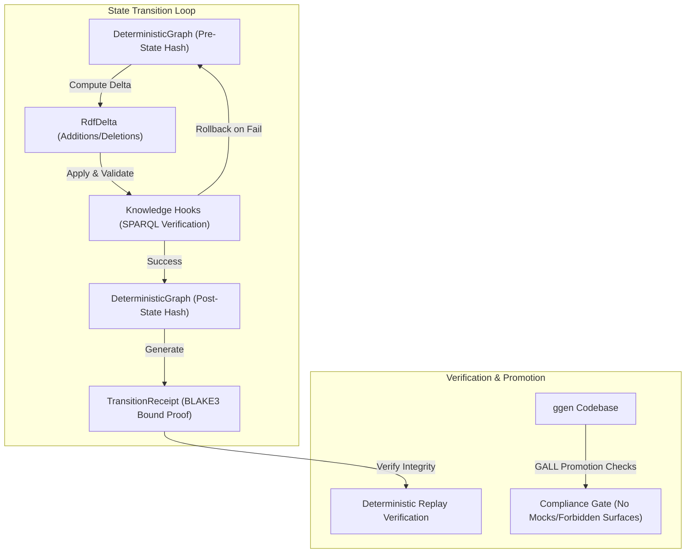

# Explanation: The `ggen-graph` Substrate and Semantic Verification

This document provides a conceptual explanation of the design philosophy, architectural components, and verification mechanics of `ggen-graph`, a Rust substrate for public-ontology-governed RDF graphs.

---

## 1. Architectural Blueprint

`ggen-graph` serves as the runtime core of the `ggen` semantic manufacturing engine. Rather than treating ontologies as static schemas or documentation artifacts, `ggen-graph` turns them into active, executable, and self-verifying programs.

---

## 2. Autonomic Knowledge Actuation

**Autonomic Knowledge Actuation** is the self-governing runtime mechanism where ontologies actuate state changes directly. In a traditional database system, validation rules are hardcoded in application logic. Under autonomic actuation:

1. **Self-Governing Constraints**: The system's rules are stored as RDF triples in the graph itself (using vocabularies like SHACL or custom ontologies).
2. **Dynamic Knowledge Hooks**: `KnowledgeHook` structures load SPARQL query logic directly into the graph. These hooks act as guards that execute automatically on any proposed state transformation.
3. **Actuation vs. Storage**: When a state change occurs, the graph executes the scheduled hooks. The system actuates the transition only if all SPARQL queries evaluate to a valid state, making the knowledge substrate self-correcting and autonomous.

---

## 3. Deterministic Deltas & State Conservation

For a distributed or audited system to prove its correctness, its state transitions must be completely reproducible. `ggen-graph` achieves this through **Deterministic Deltas**:

- **Canonical Quad Serialization**: Every RDF triple/quad is sorted lexicographically by subject, predicate, object, and graph name before hashing. This ensures that the same set of facts always produces the exact same BLAKE3 hash, regardless of insertion order.
- **Delta Conservation**: The `RdfDelta` structure tracks additions and deletions as discrete sets of canonicalized N-Quad strings. The mathematical transition from state $S_n$ to $S_{n+1}$ is expressed as:
  $$S_{n+1} = (S_n \setminus \text{Deletions}) \cup \text{Additions}$$
- **State Hashing**: The BLAKE3 state hash of the graph represents the root hash of all existing quads, creating a cryptographically secure snapshot of the entire ontology substrate.

---

## 4. Receipt-Bound Execution

**Receipt-Bound Execution** is a design pattern asserting that *no state transition can commit without generating a cryptographically verifiable proof of correctness*. 

The `TransitionReceipt` captures the complete boundary evidence of a state change:
- **`pre_state_hash`**: The BLAKE3 hash of the graph before the delta was applied.
- **`post_state_hash`**: The BLAKE3 hash of the graph after the delta was applied and verified.
- **`delta_hash`**: The BLAKE3 hash of the `RdfDelta` containing the exact N-Quads added or removed.
- **`timestamp`**: The UTC time of execution.
- **`signature_or_hash`**: A BLAKE3 hash binding the fields together.

This receipt can be replayed against a baseline graph. If a verifier applies the delta to the pre-state and does not arrive at the exact post-state hash, the transition is rejected. 

> [!IMPORTANT]
> **No Placeholder Laundering**: To maintain cryptographic truth, receipts must never contain placeholder hashes (`"hash_placeholder"`, `"TODO"`, etc.). Missing values must yield `None` and result in an explicit verification refusal.

---

## 5. The GALL Promotion Engine and Checks

The **GALL (Governance and Artifact Lawfulness Loop)** promotion engine acts as the gatekeeper for bringing code or artifacts from development into production. It enforces structural and cryptographic policies.

### Forbidden Surface Checks
The promotion engine uses static analysis tools (e.g., `scripts/gall/forbidden_surface.sh`) to ensure the codebase does not bypass the runtime sandbox:
- **No Hidden Subprocess Shells**: Code must not spawn unverified shell execution paths (like arbitrary `std::process::Command` executions) which could circumvent audit logs.
- **No Arbitrary Network Clients**: Arbitrary HTTP calls are forbidden within graph validation hooks to ensure execution remains local and deterministic.

### Anti-Fake Gates
The `scripts/gall/anti_fake_implementation.sh` script runs checks to ensure that the code contains:
- No placeholding mocks or stubs.
- No dummy success returns designed to bypass compliance logic.
- Verifiable proof gates that enforce policy instead of just asserting it in documentation.

---

## 6. Rejecting London TDD: Why We Avoid Mocks

In many development environments, **London TDD (Mockist TDD)** is standard: interfaces are mocked, and tests verify that specific mock methods were called. In `ggen-graph`, **mocking is strictly forbidden**. Instead, we follow **Chicago TDD (Classicist TDD)**, requiring real boundary crossings.

### Why Mocks Break Evidence
A mocked trace, span, or database client fabricates evidence. A passing test on a mock only proves that the mock was configured correctly, not that the system functions under real boundary conditions. In high-assurance environments, fake evidence is equivalent to falsified telemetry.

### The Chicago TDD Doctrine in `ggen-graph`
1. **Real Boundary Crossing**: Every test must cross actual physical boundaries—writing real files, executing real SPARQL queries on the Oxigraph engine, and generating cryptographically valid BLAKE3 receipts.
2. **Multi-Surface Corroboration**: Claims of success must be corroborated across at least three surfaces:
   - **Execution**: The function returns a successful result.
   - **Telemetry**: A real OTel span or event log is emitted.
   - **State**: The physical graph changes deterministically.
   - **Causality**: The output state is a direct result of the input delta.
3. **Anti-Cheating Resilience**: Tests must be designed so that faking the test results requires more work than actually implementing the correct execution logic.
