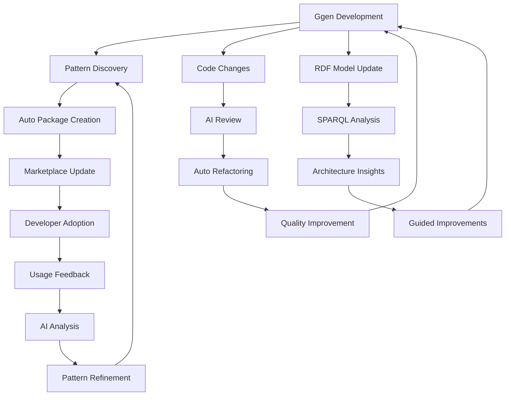

# Phase 3: Complete Dogfooding

> **Priority**: **Low** | **Timeline**: Months 4-6 | **Complexity**: High

Advanced dogfooding creating self-improving development loops where ggen evolves itself through automated pattern discovery, AI-driven optimization, and continuous marketplace enhancement.

## 🎯 Objectives

1. Create self-evolving marketplace with automated pattern discovery
2. Implement AI-assisted code review and refactoring
3. Build complete RDF codebase representation
4. Enable autonomous feature development
5. Establish continuous improvement loops

## 📋 Prerequisites

✅ Phase 1 completed:
- Lifecycle integration working
- Marketplace packages published
- CI/CD fully automated

✅ Phase 2 completed:
- RDF ontology operational
- AI documentation working
- Template-driven development established

## 🚀 Vision

**Ultimate Goal**: Ggen becomes self-improving - using its own tools to continuously evolve, optimize, and enhance itself based on usage patterns and emerging best practices.

## 📋 Implementation Tasks

### Task 1: Self-Evolving Marketplace (Months 4-5)

**Goal**: Marketplace automatically discovers patterns from ggen development and creates new packages.

#### 1.1 Pattern Discovery System

Create `ggen-core/src/discovery/pattern_analyzer.rs`:

```rust
use anyhow::Result;
use std::collections::HashMap;

/// Analyzes codebase to discover reusable patterns
pub struct PatternAnalyzer {
    codebase_path: PathBuf,
    discovered_patterns: Vec<Pattern>,
}

impl PatternAnalyzer {
    pub fn analyze(&mut self) -> Result<Vec<Pattern>> {
        // 1. Scan codebase for repeated structures
        let repeated_structures = self.find_repeated_code_structures()?;

        // 2. Identify common workflows in git history
        let common_workflows = self.analyze_git_history()?;

        // 3. Find frequently modified files together
        let cohesive_modules = self.find_cohesive_modules()?;

        // 4. Analyze developer workflows from logs
        let workflow_patterns = self.analyze_developer_workflows()?;

        // 5. Use AI to identify higher-level patterns
        let ai_patterns = self.ai_pattern_recognition()?;

        // 6. Validate patterns meet quality thresholds
        let validated_patterns = self.validate_patterns(
            repeated_structures,
            common_workflows,
            cohesive_modules,
            workflow_patterns,
            ai_patterns,
        )?;

        Ok(validated_patterns)
    }

    fn find_repeated_code_structures(&self) -> Result<Vec<Pattern>> {
        // Use AST analysis to find repeated code patterns
        // Example: Multiple CLI commands with similar structure
        Ok(vec![])
    }

    fn analyze_git_history(&self) -> Result<Vec<Pattern>> {
        // Analyze git commits to find common change patterns
        // Example: "When adding new command, always add tests + docs"
        Ok(vec![])
    }

    fn ai_pattern_recognition(&self) -> Result<Vec<Pattern>> {
        // Use ggen AI to identify semantic patterns
        let prompt = format!(
            "Analyze this codebase and identify reusable patterns that would benefit \
             other developers. Look for: common command structures, error handling \
             patterns, testing patterns, documentation patterns. \
             Return as JSON with pattern name, description, frequency, and template."
        );

        // Query AI for pattern analysis
        Ok(vec![])
    }
}

#[derive(Debug, Clone)]
pub struct Pattern {
    pub name: String,
    pub description: String,
    pub frequency: usize,
    pub quality_score: f64,
    pub template: String,
    pub examples: Vec<String>,
}
```

#### 1.2 Automatic Package Generation

Create `ggen-core/src/marketplace/auto_publisher.rs`:

```rust
/// Automatically creates and publishes marketplace packages from discovered patterns
pub struct AutoPublisher {
    pattern_analyzer: PatternAnalyzer,
    marketplace: MarketplaceRegistry,
}

impl AutoPublisher {
    pub async fn discover_and_publish(&mut self) -> Result<Vec<PackageInfo>> {
        // 1. Discover patterns
        let patterns = self.pattern_analyzer.analyze()?;

        // 2. Filter high-quality patterns
        let high_quality_patterns: Vec<_> = patterns
            .into_iter()
            .filter(|p| p.quality_score > 0.8 && p.frequency > 5)
            .collect();

        // 3. Generate marketplace packages
        let mut published_packages = Vec::new();
        for pattern in high_quality_patterns {
            let package = self.create_package_from_pattern(&pattern)?;

            // 4. Validate package
            if self.validate_package(&package)? {
                // 5. Publish to marketplace
                let package_info = self.marketplace.publish(package).await?;
                published_packages.push(package_info);

                println!("✓ Auto-published pattern: {}", pattern.name);
            }
        }

        Ok(published_packages)
    }

    fn create_package_from_pattern(&self, pattern: &Pattern) -> Result<Package> {
        // Generate complete package structure:
        // - package.toml
        // - template.tmpl
        // - README.md
        // - examples/
        // - tests/

        Ok(Package::default())
    }
}
```

#### 1.3 Continuous Pattern Discovery

Add to lifecycle (`make.toml`):

```toml
[tasks.discover-patterns]
description = "Discover and publish new patterns automatically"
script = '''
echo "Analyzing codebase for patterns..."
ggen discover patterns --analyze-commits 100

echo "Evaluating pattern quality..."
ggen discover validate --min-score 0.8

echo "Publishing high-quality patterns..."
ggen discover publish --auto-approve
'''

[tasks.scheduled-discovery]
description = "Run pattern discovery weekly"
script = '''
# Run every Monday at 2 AM
if [ "$(date +%u)" -eq 1 ]; then
    ggen lifecycle run discover-patterns
fi
'''
```

**Success Criteria**:
- [ ] Pattern discovery runs automatically
- [ ] 5+ new patterns discovered per month
- [ ] Auto-published packages meet quality standards
- [ ] External adoption of discovered patterns

---

### Task 2: AI-Assisted Code Review and Optimization (Month 5)

**Goal**: Automated code review, refactoring suggestions, and performance optimization.

#### 2.1 AI Code Reviewer

Create `ggen-core/src/ai/code_reviewer.rs`:

```rust
/// AI-powered code review system
pub struct AICodeReviewer {
    ai_engine: AIEngine,
    ontology: RDFGraph,
}

impl AICodeReviewer {
    pub async fn review_changes(&self, diff: &GitDiff) -> Result<ReviewReport> {
        let mut report = ReviewReport::new();

        // 1. Analyze code quality
        let quality_issues = self.analyze_code_quality(diff).await?;
        report.add_section("Code Quality", quality_issues);

        // 2. Check for anti-patterns
        let anti_patterns = self.detect_anti_patterns(diff).await?;
        report.add_section("Anti-Patterns", anti_patterns);

        // 3. Verify production readiness
        let production_issues = self.check_production_readiness(diff).await?;
        report.add_section("Production Readiness", production_issues);

        // 4. Suggest optimizations
        let optimizations = self.suggest_optimizations(diff).await?;
        report.add_section("Optimizations", optimizations);

        // 5. Check consistency with codebase patterns
        let consistency_issues = self.check_pattern_consistency(diff).await?;
        report.add_section("Consistency", consistency_issues);

        Ok(report)
    }

    async fn check_production_readiness(&self, diff: &GitDiff) -> Result<Vec<Issue>> {
        let prompt = format!(
            "Review this code diff for production readiness issues:\n\n{}\n\n\
             Check for:\n\
             - .expect() or .unwrap() calls\n\
             - Missing error handling\n\
             - Hardcoded values that should be configurable\n\
             - Security vulnerabilities\n\
             - Performance issues\n\
             Return as JSON array of issues with severity, description, and fix suggestion.",
            diff.content()
        );

        let response = self.ai_engine.query(&prompt).await?;
        let issues: Vec<Issue> = serde_json::from_str(&response)?;

        Ok(issues)
    }

    async fn suggest_optimizations(&self, diff: &GitDiff) -> Result<Vec<Optimization>> {
        // Use AI to suggest refactoring and performance improvements
        let prompt = format!(
            "Analyze this code and suggest optimizations:\n\n{}\n\n\
             Consider:\n\
             - Algorithm complexity\n\
             - Memory usage\n\
             - Concurrency opportunities\n\
             - Cache utilization\n\
             Return as JSON array with optimization type, rationale, and code example.",
            diff.content()
        );

        let response = self.ai_engine.query(&prompt).await?;
        let optimizations: Vec<Optimization> = serde_json::from_str(&response)?;

        Ok(optimizations)
    }
}
```

#### 2.2 Automated Refactoring

Create `ggen-core/src/refactoring/auto_refactor.rs`:

```rust
/// Automatically applies safe refactorings
pub struct AutoRefactor {
    reviewer: AICodeReviewer,
}

impl AutoRefactor {
    pub async fn auto_refactor(&self, module_path: &Path) -> Result<RefactorReport> {
        let mut report = RefactorReport::new();

        // 1. Analyze module
        let analysis = self.analyze_module(module_path).await?;

        // 2. Apply safe refactorings
        for refactoring in analysis.safe_refactorings {
            let result = self.apply_refactoring(&refactoring)?;
            report.add_refactoring(refactoring, result);
        }

        // 3. Run tests to verify
        let test_result = self.run_tests()?;
        if !test_result.passed {
            // Rollback if tests fail
            self.rollback_refactorings(&report)?;
            return Err(anyhow::anyhow!("Tests failed after refactoring"));
        }

        // 4. Create PR with changes
        self.create_refactoring_pr(&report)?;

        Ok(report)
    }

    async fn analyze_module(&self, path: &Path) -> Result<RefactorAnalysis> {
        let code = fs::read_to_string(path)?;

        let prompt = format!(
            "Analyze this code and suggest safe refactorings that:\n\
             - Reduce complexity\n\
             - Improve readability\n\
             - Extract reusable functions\n\
             - Remove code duplication\n\n\
             Code:\n{}\n\n\
             Only suggest refactorings that don't change behavior.\n\
             Return as JSON with refactoring type, description, and transformation.",
            code
        );

        let response = self.reviewer.ai_engine.query(&prompt).await?;
        let analysis: RefactorAnalysis = serde_json::from_str(&response)?;

        Ok(analysis)
    }
}
```

#### 2.3 Integrate into Git Workflow

Create `.githooks/pre-commit-review`:

```bash
#!/bin/bash
# AI-powered pre-commit review

set -e

echo "Running AI code review..."

# Get staged changes
git diff --cached > /tmp/staged-diff.patch

# Run AI review
ggen ai review /tmp/staged-diff.patch > /tmp/review-report.json

# Check for critical issues
CRITICAL_ISSUES=$(jq '[.issues[] | select(.severity == "critical")] | length' /tmp/review-report.json)

if [ "$CRITICAL_ISSUES" -gt 0 ]; then
    echo "❌ Critical issues found:"
    jq '.issues[] | select(.severity == "critical") | .description' /tmp/review-report.json
    echo ""
    echo "Fix these issues before committing."
    exit 1
fi

# Show warnings
WARNINGS=$(jq '[.issues[] | select(.severity == "warning")] | length' /tmp/review-report.json)
if [ "$WARNINGS" -gt 0 ]; then
    echo "⚠️  Warnings found:"
    jq '.issues[] | select(.severity == "warning") | .description' /tmp/review-report.json
fi

echo "✓ AI review passed"
```

**Success Criteria**:
- [ ] AI review catches production issues
- [ ] Auto-refactoring improves code quality
- [ ] No false positives in critical issues
- [ ] <2 minute review time for typical PR

---

### Task 3: Complete RDF Codebase Model (Month 6)

**Goal**: Entire codebase queryable via SPARQL for deep analysis and generation.

#### 3.1 Automated RDF Generation

Create `ggen-core/src/rdf/codebase_modeler.rs`:

```rust
/// Automatically generates RDF representation of entire codebase
pub struct CodebaseModeler {
    graph: RDFGraph,
}

impl CodebaseModeler {
    pub fn model_codebase(&mut self, root: &Path) -> Result<()> {
        // 1. Parse all Rust files
        let rust_files = self.find_rust_files(root)?;

        for file in rust_files {
            self.model_file(&file)?;
        }

        // 2. Extract relationships
        self.extract_module_dependencies()?;
        self.extract_function_calls()?;
        self.extract_type_relationships()?;

        // 3. Add metrics
        self.add_complexity_metrics()?;
        self.add_coverage_metrics()?;
        self.add_performance_metrics()?;

        // 4. Save to RDF
        self.save_to_ttl("data/codebase-model.ttl")?;

        Ok(())
    }

    fn model_file(&mut self, path: &Path) -> Result<()> {
        let content = fs::read_to_string(path)?;
        let syntax_tree = syn::parse_file(&content)?;

        // Extract modules, functions, structs, etc.
        for item in syntax_tree.items {
            match item {
                syn::Item::Fn(func) => self.add_function(&func, path)?,
                syn::Item::Struct(s) => self.add_struct(&s, path)?,
                syn::Item::Mod(m) => self.add_module(&m, path)?,
                _ => {}
            }
        }

        Ok(())
    }
}
```

#### 3.2 Advanced SPARQL Queries

Create query library in `queries/`:

```sparql
# queries/find-refactoring-opportunities.rq
PREFIX code: <http://ggen.io/code#>
PREFIX metrics: <http://ggen.io/metrics#>

SELECT ?module ?function ?complexity ?lines
WHERE {
    ?module a code:Module ;
            code:hasFunction ?function .

    ?function metrics:cyclomaticComplexity ?complexity ;
              metrics:linesOfCode ?lines .

    FILTER(?complexity > 15 || ?lines > 200)
}
ORDER BY DESC(?complexity)
```

```sparql
# queries/find-unused-code.rq
PREFIX code: <http://ggen.io/code#>

SELECT ?function ?module
WHERE {
    ?module code:hasFunction ?function .
    ?function code:visibility "pub" .

    FILTER NOT EXISTS {
        ?caller code:calls ?function .
    }
}
```

```sparql
# queries/find-missing-tests.rq
PREFIX code: <http://ggen.io/code#>
PREFIX test: <http://ggen.io/test#>

SELECT ?module (COUNT(?function) as ?untested_functions)
WHERE {
    ?module a code:Module ;
            code:hasFunction ?function .

    FILTER NOT EXISTS {
        ?test test:tests ?function .
    }
}
GROUP BY ?module
HAVING (COUNT(?function) > 0)
ORDER BY DESC(?untested_functions)
```

#### 3.3 Query-Driven Development

Add lifecycle phase:

```toml
[tasks.analyze-codebase]
description = "Analyze codebase with SPARQL queries"
script = '''
echo "Generating RDF model of codebase..."
ggen rdf model --output data/codebase-model.ttl

echo "Finding refactoring opportunities..."
ggen graph query --file queries/find-refactoring-opportunities.rq

echo "Finding unused code..."
ggen graph query --file queries/find-unused-code.rq

echo "Finding missing tests..."
ggen graph query --file queries/find-missing-tests.rq

echo "Generating analysis report..."
ggen graph analyze --report docs/codebase-analysis.md
'''
```

**Success Criteria**:
- [ ] Complete codebase modeled in RDF
- [ ] SPARQL queries answer architecture questions
- [ ] Query-driven refactoring reduces tech debt
- [ ] Model updates automatically on changes

---

## 📊 Phase 3 Success Metrics

### Self-Evolution
- [ ] 5+ new marketplace patterns/month discovered automatically
- [ ] Pattern quality score >0.8 consistently
- [ ] External adoption of auto-discovered patterns

### AI Assistance
- [ ] AI code review catches 90%+ of production issues
- [ ] Auto-refactoring improves quality scores by 20%+
- [ ] <2 minute review time
- [ ] Zero critical issues reach production

### RDF Completeness
- [ ] 100% of codebase modeled in RDF
- [ ] SPARQL queries used in daily development
- [ ] Architecture insights drive improvements
- [ ] Query-driven development adopted

### Overall Impact
- [ ] Development velocity increased 2x
- [ ] Bug escape rate decreased 50%
- [ ] Time to add features decreased 40%
- [ ] Code quality scores improved 30%

---

## 🎯 Long-Term Vision

### Self-Improving Cycle



### Ultimate Capabilities

1. **Autonomous Evolution**: Ggen improves itself based on usage patterns
2. **Predictive Development**: AI suggests features before developers request them
3. **Zero-Bug Releases**: AI review catches all production issues
4. **Instant Scaffolding**: Any feature generated in minutes
5. **Living Documentation**: Docs update themselves from code changes

---

## 🚀 Beyond Phase 3

### Future Possibilities

1. **Multi-Project Learning**: Learn patterns across all projects using ggen
2. **Collaborative Intelligence**: Share learnings across ggen community
3. **Autonomous Maintenance**: Auto-fix security issues and update dependencies
4. **Predictive Optimization**: Optimize before performance issues occur
5. **Natural Language Development**: Describe features in plain English, get implementations

---

## 📝 Conclusion

**Phase 3 represents the ultimate vision of dogfooding**: A tool that uses itself to continuously improve, creating a virtuous cycle of enhancement that benefits all users.

**Next**: Monitor Phase 3 metrics and iterate towards full autonomy.
