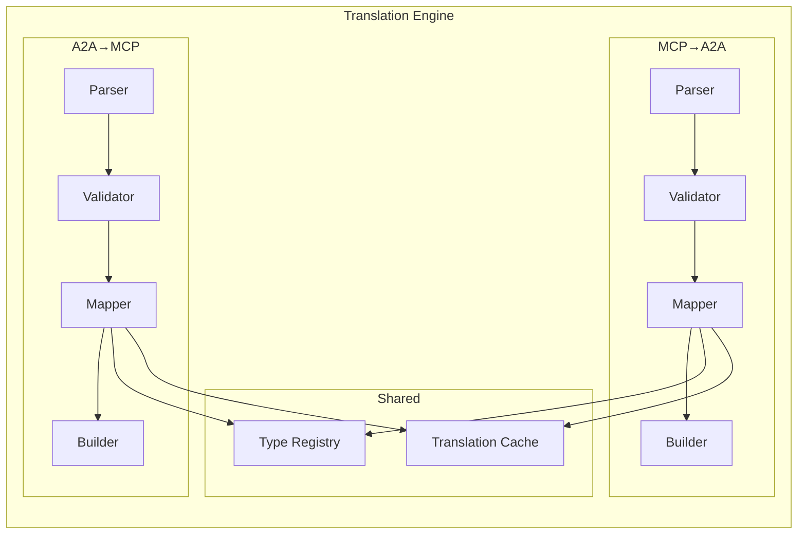
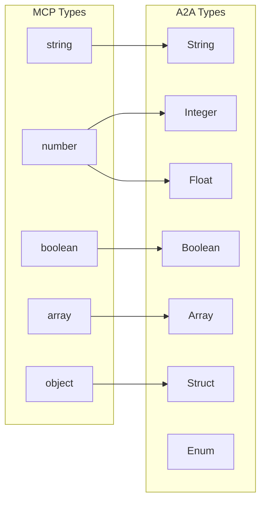
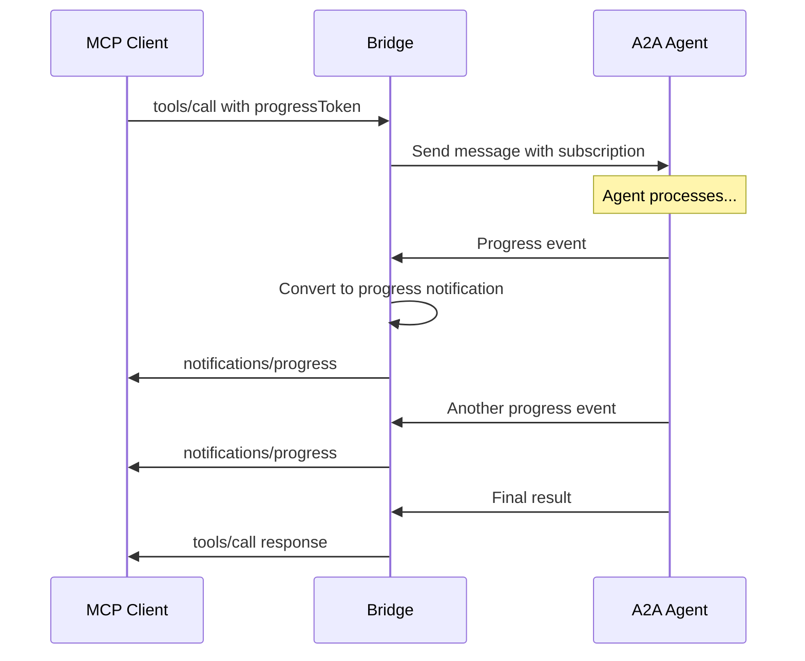
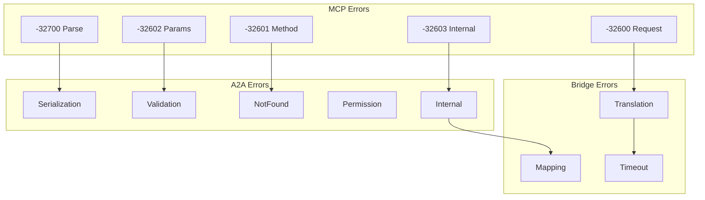
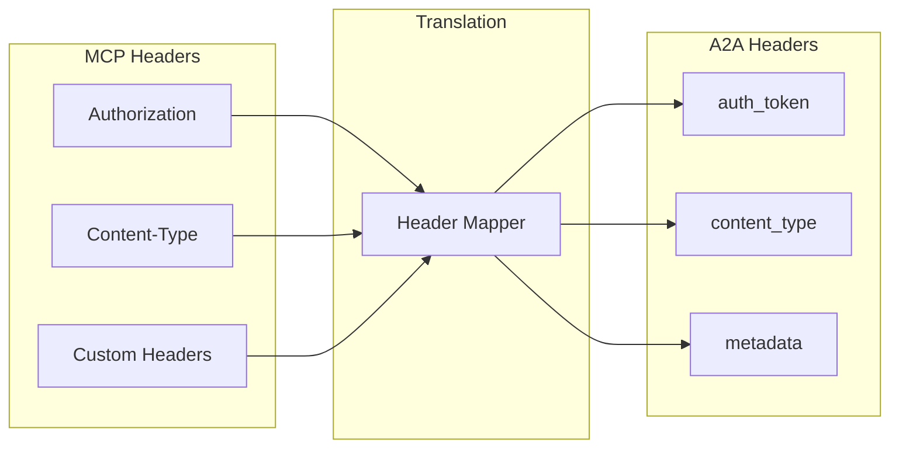

<!-- START doctoc generated TOC please keep comment here to allow auto update -->
<!-- DON'T EDIT THIS SECTION, INSTEAD RE-RUN doctoc TO UPDATE -->
**Table of Contents**

- [Protocol Translation](#protocol-translation)
  - [Translation Challenge](#translation-challenge)
    - [Conceptual Differences](#conceptual-differences)
    - [Structural Differences](#structural-differences)
  - [Translation Architecture](#translation-architecture)
    - [Translation Pipeline](#translation-pipeline)
  - [Message Format Translation](#message-format-translation)
    - [Tool Call to Message](#tool-call-to-message)
    - [Resource Read to Message](#resource-read-to-message)
    - [Prompt Get to Task](#prompt-get-to-task)
  - [Type System Mapping](#type-system-mapping)
    - [Schema Translation](#schema-translation)
    - [Type Mapping Table](#type-mapping-table)
    - [Complex Type Translation](#complex-type-translation)
  - [Stream Translation](#stream-translation)
    - [MCP Streaming](#mcp-streaming)
    - [A2A Streaming](#a2a-streaming)
    - [Stream Translation Layer](#stream-translation-layer)
    - [Stream Mapping Implementation](#stream-mapping-implementation)
  - [Error Translation](#error-translation)
    - [Error Code Mapping](#error-code-mapping)
    - [Error Translation Table](#error-translation-table)
    - [Error Translation Implementation](#error-translation-implementation)
  - [Metadata Translation](#metadata-translation)
    - [Header Mapping](#header-mapping)
  - [Performance Optimization](#performance-optimization)
    - [Translation Caching](#translation-caching)
    - [Batch Translation](#batch-translation)
    - [Performance Targets](#performance-targets)
  - [See Also](#see-also)

<!-- END doctoc generated TOC please keep comment here to allow auto update -->

# Protocol Translation

**Type: Explanation** | [← Back to Documentation](../../README.md)

---

Protocol translation enables communication between MCP and A2A by converting message formats, types, and semantics between the two protocols.

## Translation Challenge

MCP and A2A have similar foundations (both use JSON-RPC) but different conceptual models:

### Conceptual Differences

| Aspect | MCP | A2A |
|--------|-----|-----|
| **Primary Entity** | Server | Agent |
| **Communication** | Client-Server | Peer-to-Peer |
| **Operations** | Tools, Resources, Prompts | Messages, Tasks, Events |
| **Discovery** | Manual capability listing | Built-in discovery |
| **State** | Stateless (mostly) | Stateful agents |
| **Streaming** | Optional (via SSE) | Built-in event streaming |

### Structural Differences

```
MCP Request Structure:
┌─────────────────────────────────────────┐
│ jsonrpc: "2.0"                          │
│ id: 1                                   │
│ method: "tools/call"                    │
│ params: {                               │
│   name: "tool_name",                    │
│   arguments: { /* JSON Schema */ }      │
│ }                                       │
└─────────────────────────────────────────┘

A2A Message Structure:
┌─────────────────────────────────────────┐
│ jsonrpc: "2.0"                          │
│ id: "msg-uuid"                          │
│ method: "message/send"                  │
│ params: {                               │
│   from: "agent:id",                     │
│   to: "agent:id",                       │
│   payload: { /* A2A schema */ }         │
│   headers: { /* metadata */ }           │
│ }                                       │
└─────────────────────────────────────────┘
```

## Translation Architecture

The translation layer uses a **bidirectional mapping** approach:



### Translation Pipeline

```
Input Message
     │
     ▼
┌─────────────┐
│   Parse     │ ← Parse JSON into internal representation
└─────────────┘
     │
     ▼
┌─────────────┐
│  Validate   │ ← Validate against schema
└─────────────┘
     │
     ▼
┌─────────────┐
│    Map      │ ← Map concepts between protocols
└─────────────┘
     │
     ▼
┌─────────────┐
│   Build     │ ← Build output message
└─────────────┘
     │
     ▼
Output Message
```

## Message Format Translation

### Tool Call to Message

MCP tool calls translate to A2A messages:

```rust
// MCP Tool Call
pub struct McpToolCall {
    pub name: String,
    pub arguments: Value,
}

// A2A Message
pub struct A2AMessage {
    pub from: AgentId,
    pub to: AgentId,
    pub payload: MessagePayload,
}

// Translation
impl From<McpToolCall> for A2AMessage {
    fn from(mcp_call: McpToolCall) -> Self {
        let (agent_id, method) = parse_tool_name(&mcp_call.name);
        A2AMessage {
            from: AgentId::bridge(),
            to: agent_id,
            payload: MessagePayload::Request {
                method,
                params: mcp_call.arguments,
            },
            headers: default_headers(),
        }
    }
}

fn parse_tool_name(name: &str) -> (AgentId, String) {
    // "code-generator:generate" -> (code-generator agent, generate method)
    let parts: Vec<&str> = name.split(':').collect();
    match parts.as_slice() {
        [agent, method] => (
            AgentId::from_str(agent),
            method.to_string()
        ),
        [agent] => (
            AgentId::from_str(agent),
            "handle".to_string()
        ),
        _ => panic!("Invalid tool name"),
    }
}
```

### Resource Read to Message

MCP resource reads translate to A2A data requests:

```rust
// MCP Resource Read
pub struct McpResourceRead {
    pub uri: String,
}

// A2A Message
pub struct A2AMessage {
    pub payload: MessagePayload::DataRequest {
        uri: String,
        format: DataFormat,
    },
}

// Translation
impl From<McpResourceRead> for A2AMessage {
    fn from(mcp_read: McpResourceRead) -> Self {
        let agent_id = extract_agent_from_uri(&mcp_read.uri);
        A2AMessage {
            from: AgentId::bridge(),
            to: agent_id,
            payload: MessagePayload::DataRequest {
                uri: mcp_read.uri,
                format: infer_format(&mcp_read.uri),
            },
            headers: default_headers(),
        }
    }
}

fn extract_agent_from_uri(uri: &str) -> AgentId {
    // "agent://code-generator/file:///path" -> code-generator
    let parts: Vec<&str> = uri.split('/').collect();
    if parts.len() >= 2 && parts[0] == "agent:" {
        AgentId::from_str(parts[1])
    } else {
        AgentId::default() // System agent
    }
}
```

### Prompt Get to Task

MCP prompt retrieval translates to A2A task creation:

```rust
// MCP Prompt Get
pub struct McpPromptGet {
    pub name: String,
    pub arguments: Value,
}

// A2A Task
pub struct A2ATask {
    pub name: String,
    pub assigned_to: AgentId,
    pub input: Value,
}

// Translation
impl From<McpPromptGet> for A2ATask {
    fn from(mcp_prompt: McpPromptGet) -> Self {
        let agent_id = get_prompt_handler(&mcp_prompt.name);
        A2ATask {
            name: mcp_prompt.name,
            assigned_to: agent_id,
            input: mcp_prompt.arguments,
            status: TaskStatus::Pending,
            created_at: Utc::now(),
        }
    }
}
```

## Type System Mapping

### Schema Translation

MCP uses JSON Schema; A2A uses its own type system:



### Type Mapping Table

| JSON Schema Type | A2A Type | Notes |
|------------------|----------|-------|
| `string` | `String` | Direct mapping |
| `number` (integer) | `Integer` | `isInteger: true` |
| `number` | `Float` | Default for numbers |
| `boolean` | `Boolean` | Direct mapping |
| `array` | `Array<T>` | Preserve item type |
| `object` | `Struct` | Map fields to properties |
| `enum` | `Enum` | Preserve variants |
| `null` | `Option<T>` | Wrap in Optional |

### Complex Type Translation

```rust
// JSON Schema
let json_schema = json!({
    "type": "object",
    "properties": {
        "name": {"type": "string"},
        "age": {"type": "number"},
        "tags": {
            "type": "array",
            "items": {"type": "string"}
        },
        "role": {
            "type": "string",
            "enum": ["admin", "user", "guest"]
        }
    },
    "required": ["name", "role"]
});

// Translated to A2A type
let a2a_type = A2AType::Struct(StructType {
    name: "UserProfile".to_string(),
    fields: vec![
        Field {
            name: "name".to_string(),
            type_: A2AType::String,
            required: true,
        },
        Field {
            name: "age".to_string(),
            type_: A2AType::Integer,
            required: false,
        },
        Field {
            name: "tags".to_string(),
            type_: A2AType::Array(Box::new(A2AType::String)),
            required: false,
        },
        Field {
            name: "role".to_string(),
            type_: A2AType::Enum(vec![
                "admin".to_string(),
                "user".to_string(),
                "guest".to_string(),
            ]),
            required: true,
        },
    ],
});
```

## Stream Translation

Both protocols support streaming, but with different semantics:

### MCP Streaming

```typescript
// MCP Server-Sent Events
interface McpStream {
    method: "tools/call";
    params: {
        name: string;
        arguments: any;
        _meta?: {
            progressToken?: string | number;
        };
    };
}

// Server sends progress updates
interface ProgressNotification {
    method: "notifications/progress";
    params: {
        progressToken: string | number;
        progress: number;
        message?: string;
    };
}
```

### A2A Streaming

```rust
// A2A Event Streaming
pub struct A2AEvent {
    pub event_type: String,
    pub data: Value,
    pub timestamp: DateTime<Utc>,
}

// Agent publishes events
agent.event_bus.publish(A2AEvent {
    event_type: "progress".to_string(),
    data: json!({
        "task_id": "123",
        "progress": 0.5,
        "message": "Processing..."
    }),
    timestamp: Utc::now(),
}).await?;
```

### Stream Translation Layer



### Stream Mapping Implementation

```rust
pub struct StreamTranslator {
    mcp_client: McpClient,
    a2a_client: A2AClient,
    subscriptions: HashMap<ProgressToken, SubscriptionId>,
}

impl StreamTranslator {
    pub async fn translate_stream(
        &mut self,
        mcp_request: McpToolCall,
        progress_token: ProgressToken,
    ) -> Result<McpToolResult> {
        // Send A2A message
        let a2a_msg = self.translate_request(mcp_request)?;
        let subscription = self.a2a_client.send_and_subscribe(a2a_msg).await?;

        // Store subscription for progress updates
        let sub_id = subscription.id;
        self.subscriptions.insert(progress_token.clone(), sub_id);

        // Listen for events
        let mut final_result = None;
        let mut event_stream = subscription.stream();

        while let Some(event) = event_stream.next().await {
            match event.event_type.as_str() {
                "progress" => {
                    // Send progress to MCP
                    self.send_progress(progress_token.clone(), &event.data).await?;
                }
                "complete" => {
                    final_result = Some(event.data);
                    break;
                }
                "error" => {
                    return Err(event.data.into());
                }
                _ => {}
            }
        }

        // Clean up subscription
        self.subscriptions.remove(&progress_token);

        Ok(final_result.unwrap())
    }

    async fn send_progress(&self, token: ProgressToken, data: &Value) -> Result<()> {
        let notification = json!({
            "jsonrpc": "2.0",
            "method": "notifications/progress",
            "params": {
                "progressToken": token,
                "progress": data["progress"],
                "message": data["message"]
            }
        });
        self.mcp_client.send_notification(notification).await
    }
}
```

## Error Translation

### Error Code Mapping



### Error Translation Table

| MCP Error | A2A Error | Bridge Error | Translation |
|-----------|-----------|--------------|-------------|
| `-32700` Parse error | SerializationError | N/A | Invalid JSON |
| `-32600` Invalid request | ValidationError | N/A | Schema validation failed |
| `-32601` Method not found | NotFoundError | MappingError | Unknown tool/agent |
| `-32602` Invalid params | ValidationError | N/A | Parameter validation |
| `-32603` Internal error | InternalError | TranslationError | Unexpected error |
| N/A | TimeoutError | TimeoutError | Operation timed out |
| N/A | UnavailableError | UnavailableError | Agent/server down |

### Error Translation Implementation

```rust
pub trait TranslateError<T> {
    fn translate_mcp_error(err: McpError) -> T;
    fn translate_a2a_error(err: A2AError) -> McpError;
}

impl TranslateError<A2AError> for ProtocolTranslator {
    fn translate_mcp_error(err: McpError) -> A2AError {
        match err.code {
            -32700 => A2AError::Serialization(err.message),
            -32600 => A2AError::Validation(err.message),
            -32601 => A2AError::NotFound(err.message),
            -32602 => A2AError::Validation(err.message),
            -32603 => A2AError::Internal(err.message),
            _ => A2AError::Internal(err.message),
        }
    }

    fn translate_a2a_error(err: A2AError) -> McpError {
        match err {
            A2AError::Serialization(msg) => McpError {
                code: -32700,
                message: msg,
                data: None,
            },
            A2AError::Validation(msg) => McpError {
                code: -32602,
                message: msg,
                data: None,
            },
            A2AError::NotFound(msg) => McpError {
                code: -32601,
                message: msg,
                data: None,
            },
            A2AError::Timeout(msg) => McpError {
                code: -32603,
                message: format!("Timeout: {}", msg),
                data: None,
            },
            A2AError::Unavailable(msg) => McpError {
                code: -32002,
                message: format!("Unavailable: {}", msg),
                data: None,
            },
            _ => McpError {
                code: -32603,
                message: "Internal error".to_string(),
                data: None,
            },
        }
    }
}
```

## Metadata Translation

Headers and metadata require special handling:



### Header Mapping

```rust
pub struct HeaderTranslator {
    // Known header mappings
    mappings: HashMap<String, String>,
}

impl HeaderTranslator {
    pub fn translate_mcp_to_a2a(&self, mcp_headers: HashMap<String, String>) -> HashMap<String, String> {
        let mut a2a_headers = HashMap::new();

        for (key, value) in mcp_headers {
            let a2a_key = self.mappings.get(&key)
                .cloned()
                .unwrap_or_else(|| key.to_snake_case());
            a2a_headers.insert(a2a_key, value);
        }

        // Add protocol metadata
        a2a_headers.insert("protocol".to_string(), "mcp".to_string());
        a2a_headers.insert("translated_at".to_string(), Utc::now().to_rfc3339());

        a2a_headers
    }

    pub fn translate_a2a_to_mcp(&self, a2a_headers: HashMap<String, String>) -> HashMap<String, String> {
        let mut mcp_headers = HashMap::new();

        for (key, value) in a2a_headers {
            // Skip internal headers
            if key.starts_with('_') {
                continue;
            }

            let mcp_key = self.mappings.iter()
                .find(|(_, v)| v == &key)
                .map(|(k, _)| k.clone())
                .unwrap_or_else(|| key.to_camel_case());

            mcp_headers.insert(mcp_key, value);
        }

        mcp_headers
    }
}
```

## Performance Optimization

### Translation Caching

```rust
pub struct TranslationCache {
    schema_cache: LruCache<String, A2AType>,
    message_cache: LruCache<String, A2AMessage>,
}

impl TranslationCache {
    pub fn translate_schema_cached(&mut self, schema: &Value) -> A2AType {
        let key = schema.to_string();
        if let Some(cached) = self.schema_cache.get(&key) {
            return cached.clone();
        }

        let translated = self.translate_schema(schema);
        self.schema_cache.put(key, translated.clone());
        translated
    }
}
```

### Batch Translation

```rust
pub async fn translate_batch(
    &self,
    requests: Vec<McpRequest>,
) -> Result<Vec<A2AMessage>> {
    // Parse all requests
    let parsed: Result<Vec<_>> = requests
        .into_iter()
        .map(|r| self.translate_request(r))
        .collect();

    let messages = parsed?;

    // Batch validate
    self.validate_batch(&messages)?;

    Ok(messages)
}
```

### Performance Targets

| Operation | Target | Optimization |
|-----------|--------|--------------|
| Message translation | < 1ms | Pre-built templates |
| Schema translation | < 5ms | Cache compiled schemas |
| Batch translation (100) | < 50ms | Parallel processing |
| Error translation | < 100us | Lookup table |

## See Also

- [MCP Protocol](../fundamentals/mcp-protocol.md) - MCP concepts
- [A2A Protocol](../fundamentals/a2a-protocol.md) - A2A concepts
- [MCP-A2A Bridge](../fundamentals/mcp-a2a-bridge.md) - Bridge overview
- [Security Model](security-model.md) - Authentication in translation
