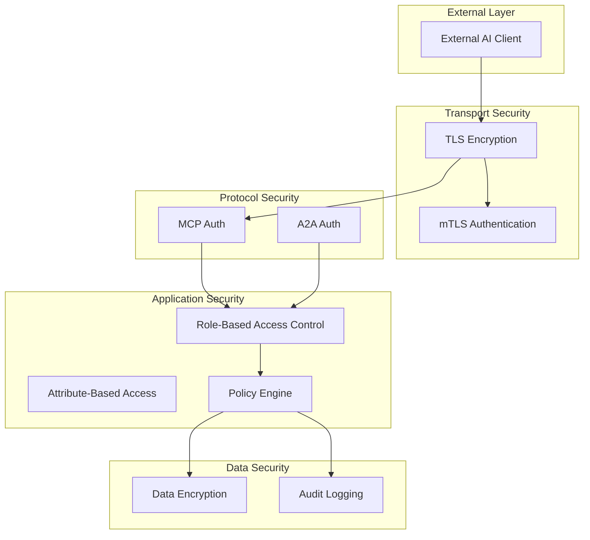
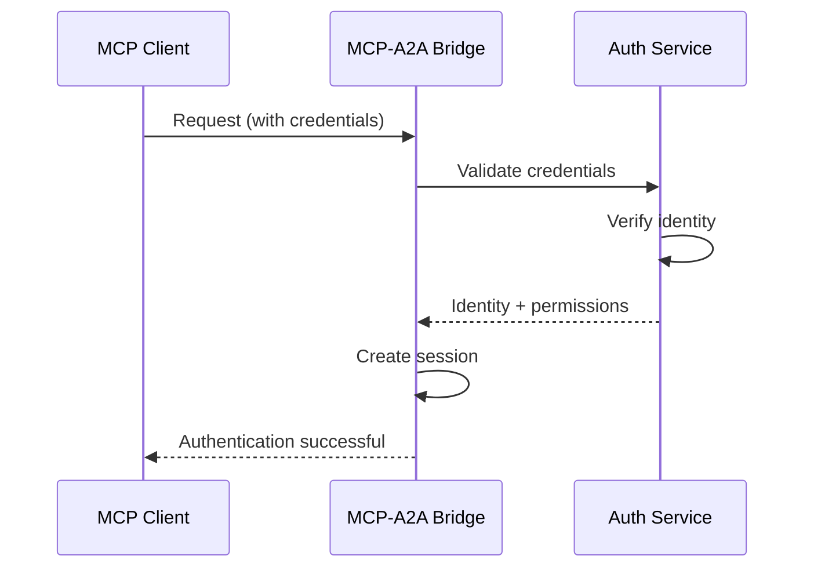
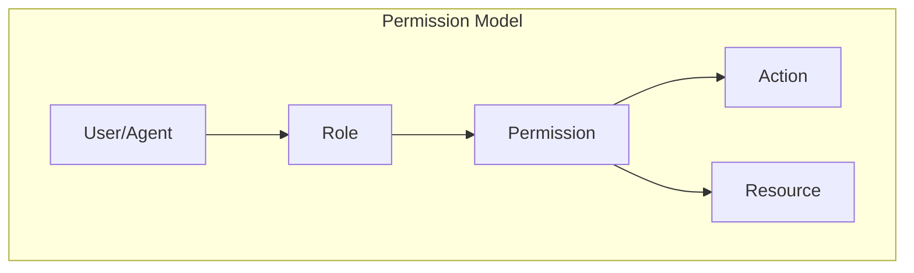
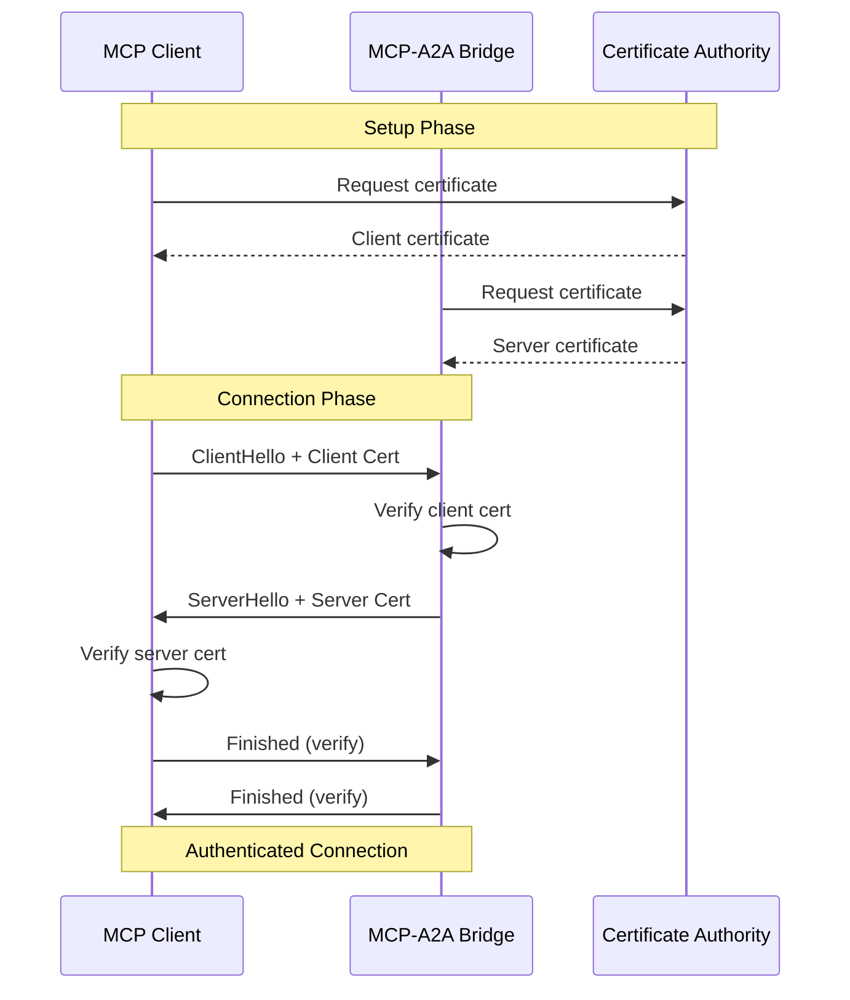

<!-- START doctoc generated TOC please keep comment here to allow auto update -->
<!-- DON'T EDIT THIS SECTION, INSTEAD RE-RUN doctoc TO UPDATE -->
**Table of Contents**

- [Security Model](#security-model)
  - [Security Architecture](#security-architecture)
  - [Authentication](#authentication)
  - [Authorization](#authorization)
  - [Transport Security](#transport-security)
  - [Message Security](#message-security)
  - [Credential Management](#credential-management)
  - [Security Policies](#security-policies)
  - [Threat Model](#threat-model)
  - [See Also](#see-also)

<!-- END doctoc generated TOC -->

# Security Model

**Type: Explanation** | [← Back to Documentation](../../README.md)

---

The MCP-A2A security model provides comprehensive authentication, authorization, and encryption for communication between external AI assistants and internal agents.

## Security Architecture

The security model follows a **defense-in-depth** approach with multiple layers:



### Security Layers

| Layer | Purpose | Mechanisms |
|-------|---------|------------|
| **Transport** | Secure communication | TLS 1.3, mTLS |
| **Protocol** | Identity verification | JWT, API keys, OAuth2 |
| **Application** | Access control | RBAC, ABAC, policies |
| **Data** | Protection at rest | Encryption, audit logs |

## Authentication

Authentication verifies the identity of clients and agents.

### MCP Authentication



### Authentication Methods

#### JWT Tokens

JSON Web Tokens provide stateless authentication:

```rust
// JWT token structure
pub struct JwtToken {
    pub header: JwtHeader,
    pub claims: JwtClaims,
    pub signature: String,
}

// Claims for MCP-A2A bridge
pub struct JwtClaims {
    // Standard claims
    pub iss: String,        // Issuer
    pub sub: String,        // Subject (user/agent ID)
    pub aud: String,        // Audience (bridge ID)
    pub exp: usize,         // Expiration time
    pub nbf: usize,         // Not before
    pub iat: usize,         // Issued at

    // Custom claims
    pub agent_id: Option<String>,   // Agent ID (if agent)
    pub permissions: Vec<String>,   // Granted permissions
    pub capabilities: Vec<String>,  // Allowed capabilities
}

// JWT validation
impl JwtValidator {
    pub fn validate(&self, token: &str) -> Result<JwtClaims> {
        let decoded = decode::<JwtClaims>(
            token,
            &self.decoding_key,
            &self.validation,
        )?;

        // Verify claims
        if decoded.claims.aud != self.expected_audience {
            return Err(Error::InvalidAudience);
        }

        if decoded.claims.exp < Utc::now().timestamp() as usize {
            return Err(Error::TokenExpired);
        }

        Ok(decoded.claims)
    }
}
```

#### API Keys

API keys provide simple authentication for service accounts:

```rust
// API key structure
pub struct ApiKey {
    pub key_id: String,          // Key identifier
    pub secret: String,           // Secret value (hashed)
    pub agent_id: String,         // Associated agent
    pub permissions: Vec<String>, // Granted permissions
    pub expires_at: Option<DateTime<Utc>>,
    pub created_at: DateTime<Utc>,
}

// API key validation
impl ApiKeyValidator {
    pub async fn validate(&self, key: &str) -> Result<ApiKeyClaims> {
        // Parse key format: key_id:secret
        let parts: Vec<&str> = key.split(':').collect();
        if parts.len() != 2 {
            return Err(Error::InvalidKeyFormat);
        }

        let (key_id, secret) = (parts[0], parts[1]);

        // Lookup key
        let api_key = self.storage.get_key(key_id).await?
            .ok_or(Error::KeyNotFound)?;

        // Verify secret
        if !self.verify_secret(secret, &api_key.secret) {
            return Err(Error::InvalidSecret);
        }

        // Check expiration
        if let Some(expires) = api_key.expires_at {
            if expires < Utc::now() {
                return Err(Error::KeyExpired);
            }
        }

        Ok(ApiKeyClaims {
            agent_id: api_key.agent_id,
            permissions: api_key.permissions,
        })
    }
}
```

#### OAuth2

OAuth2 provides delegated authentication:

```rust
// OAuth2 token response
pub struct OAuth2Token {
    pub access_token: String,
    pub token_type: String,
    pub expires_in: usize,
    pub refresh_token: Option<String>,
    pub scope: String,
}

// OAuth2 flow
impl OAuth2Client {
    pub async fn exchange_code(&self, code: &str) -> Result<OAuth2Token> {
        let response = self.http_client
            .post(&self.token_url)
            .form(&[
                ("grant_type", "authorization_code"),
                ("code", code),
                ("redirect_uri", &self.redirect_uri),
                ("client_id", &self.client_id),
                ("client_secret", &self.client_secret),
            ])
            .send()
            .await?;

        Ok(response.json().await?)
    }

    pub async fn introspect(&self, token: &str) -> Result<TokenInfo> {
        let response = self.http_client
            .post(&self.introspection_url)
            .form(&[
                ("token", token),
                ("client_id", &self.client_id),
                ("client_secret", &self.client_secret),
            ])
            .send()
            .await?;

        Ok(response.json().await?)
    }
}
```

### A2A Authentication

A2A agents authenticate using the same mechanisms:

```rust
// A2A authentication request
pub struct A2AAuthRequest {
    pub agent_id: AgentId,
    pub credentials: Credentials,
    pub capabilities: Vec<String>,
}

// Credentials types
pub enum Credentials {
    Jwt(String),
    ApiKey(String),
    Tls(ClientCertificate),
    OAuth2(String),
}

// A2A authentication service
impl A2AAuthService {
    pub async fn authenticate_agent(&self, request: A2AAuthRequest) -> Result<AgentSession> {
        // Verify credentials
        let identity = match request.credentials {
            Credentials::Jwt(token) => self.validate_jwt(token)?,
            Credentials::ApiKey(key) => self.validate_api_key(key).await?,
            Credentials::Tls(cert) => self.validate_certificate(cert)?,
            Credentials::OAuth2(token) => self.validate_oauth2(token).await?,
        };

        // Verify agent matches identity
        if identity.agent_id != request.agent_id {
            return Err(Error::IdentityMismatch);
        }

        // Check agent capabilities
        self.validate_capabilities(&request.agent_id, &request.capabilities)?;

        // Create session
        Ok(AgentSession {
            agent_id: request.agent_id,
            identity,
            capabilities: request.capabilities,
            expires_at: Utc::now() + Duration::hours(24),
        })
    }
}
```

## Authorization

Authorization determines what authenticated entities can do.

### Permission Model



### Permission Structure

```rust
// Permission definition
pub struct Permission {
    pub id: String,
    pub name: String,
    pub description: String,
    pub resource: String,      // e.g., "agent:*", "agent:code-generator"
    pub action: String,        // e.g., "read", "write", "execute"
    pub conditions: Option<Value>, // ABAC conditions
}

// Role definition
pub struct Role {
    pub id: String,
    pub name: String,
    pub permissions: Vec<Permission>,
}

// Permission check
impl PermissionChecker {
    pub fn check(&self, subject: &Subject, action: &str, resource: &str) -> bool {
        // Get subject's permissions
        let permissions = self.get_permissions(subject);

        // Check each permission
        permissions.iter().any(|perm| {
            self.matches_resource(&perm.resource, resource) &&
            self.matches_action(&perm.action, action) &&
            self.evaluate_conditions(&perm.conditions, subject, resource)
        })
    }

    fn matches_resource(&self, pattern: &str, resource: &str) -> bool {
        // Support wildcards: "agent:*" matches any agent
        if pattern.ends_with('*') {
            let prefix = &pattern[..pattern.len()-1];
            resource.starts_with(prefix)
        } else {
            pattern == resource
        }
    }
}
```

### Role-Based Access Control (RBAC)

```rust
// Built-in roles
pub mod roles {
    use super::*;

    pub fn admin() -> Role {
        Role {
            id: "role:admin".to_string(),
            name: "Administrator".to_string(),
            permissions: vec![
                Permission {
                    id: "perm:admin:all".to_string(),
                    name: "All permissions".to_string(),
                    resource: "*".to_string(),
                    action: "*".to_string(),
                    conditions: None,
                },
            ],
        }
    }

    pub fn agent_operator() -> Role {
        Role {
            id: "role:operator".to_string(),
            name: "Agent Operator".to_string(),
            permissions: vec![
                Permission {
                    id: "perm:agent:list".to_string(),
                    name: "List agents".to_string(),
                    resource: "agent:*".to_string(),
                    action: "list".to_string(),
                    conditions: None,
                },
                Permission {
                    id: "perm:agent:start".to_string(),
                    name: "Start agents".to_string(),
                    resource: "agent:*".to_string(),
                    action: "start".to_string(),
                    conditions: None,
                },
                Permission {
                    id: "perm:agent:stop".to_string(),
                    name: "Stop agents".to_string(),
                    resource: "agent:*".to_string(),
                    action: "stop".to_string(),
                    conditions: None,
                },
            ],
        }
    }

    pub fn agent_user() -> Role {
        Role {
            id: "role:user".to_string(),
            name: "Agent User".to_string(),
            permissions: vec![
                Permission {
                    id: "perm:agent:interact".to_string(),
                    name: "Interact with agents".to_string(),
                    resource: "agent:*".to_string(),
                    action: "interact".to_string(),
                    conditions: None,
                },
            ],
        }
    }
}
```

### Attribute-Based Access Control (ABAC)

```rust
// ABAC policy
pub struct Policy {
    pub id: String,
    pub name: String,
    pub effect: PolicyEffect,
    pub conditions: Vec<Condition>,
}

pub enum PolicyEffect {
    Allow,
    Deny,
}

pub struct Condition {
    pub field: String,       // e.g., "agent.status", "time.hour"
    pub operator: ConditionOperator,
    pub value: Value,
}

pub enum ConditionOperator {
    Equals,
    NotEquals,
    GreaterThan,
    LessThan,
    Contains,
    In,
}

// Policy evaluation
impl PolicyEngine {
    pub fn evaluate(&self, subject: &Subject, action: &str, resource: &Resource) -> PolicyEffect {
        // Check deny policies first
        for policy in self.deny_policies() {
            if self.matches_policy(policy, subject, action, resource) {
                return PolicyEffect::Deny;
            }
        }

        // Check allow policies
        for policy in self.allow_policies() {
            if self.matches_policy(policy, subject, action, resource) {
                return PolicyEffect::Allow;
            }
        }

        // Default deny
        PolicyEffect::Deny
    }

    fn matches_policy(&self, policy: &Policy, subject: &Subject, action: &str, resource: &Resource) -> bool {
        policy.conditions.iter().all(|condition| {
            self.evaluate_condition(condition, subject, action, resource)
        })
    }
}
```

## Transport Security

### TLS Configuration

```rust
// TLS configuration
pub struct TlsConfig {
    pub cert_path: String,
    pub key_path: String,
    pub ca_path: String,
    pub verify_client: bool,
    pub cipher_suites: Vec<String>,
    pub min_version: TlsVersion,
    pub max_version: TlsVersion,
}

// TLS acceptor
impl TlsAcceptor {
    pub fn new(config: TlsConfig) -> Result<Self> {
        let certs = load_certs(&config.cert_path)?;
        let key = load_key(&config.key_path)?;

        let mut builder = TlsAcceptor::builder();
        builder
            .min_tls_version(config.min_version)
            .max_tls_version(config.max_version)
            .cipher_suites(&config.cipher_suites);

        for cert in certs {
            builder.add_extra_root_cert(cert);
        }

        if config.verify_client {
            builder.client_auth(ClientAuthType::Require);
        }

        Ok(TlsAcceptor {
            acceptor: builder.build().unwrap(),
            config,
        })
    }
}
```

### Mutual TLS (mTLS)



## Message Security

### Message Signing

```rust
// Message signature
pub struct MessageSignature {
    pub key_id: String,
    pub signature: String,
    pub algorithm: SigningAlgorithm,
    pub timestamp: DateTime<Utc>,
}

pub enum SigningAlgorithm {
    Ed25519,
    ES256,  // ECDSA P-256
    ES384,  // ECDSA P-384,
    algorithm: SigningAlgorithm,
) -> Result<MessageSignature> {
    let signature = match algorithm {
        SigningAlgorithm::Ed25519 => {
            let key = self.get_ed25519_key(key_id)?;
            key.sign(message.as_bytes())
        }
        SigningAlgorithm::ES256 => {
            let key = self.get_p256_key(key_id)?;
            key.sign(message.as_bytes())
        }
        SigningAlgorithm::ES384 => {
            let key = self.get_p384_key(key_id)?;
            key.sign(message.as_bytes())
        }
    };

    Ok(MessageSignature {
        key_id: key_id.to_string(),
        signature: base64::encode(&signature),
        algorithm,
        timestamp: Utc::now(),
    })
}

pub fn verify_signature(&self, message: &str, signature: &MessageSignature) -> Result<bool> {
    let key = self.get_public_key(&signature.key_id)?;
    let signature_bytes = base64::decode(&signature.signature)?;

    let valid = match signature.algorithm {
        SigningAlgorithm::Ed25519 => {
            key.verify(message.as_bytes(), &signature_bytes)
        }
        SigningAlgorithm::ES256 => {
            key.verify(message.as_bytes(), &signature_bytes)
        }
        SigningAlgorithm::ES384 => {
            key.verify(message.as_bytes(), &signature_bytes)
        }
    };

    Ok(valid)
}
```

### Message Encryption

```rust
// Encrypted message
pub struct EncryptedMessage {
    pub key_id: String,
    pub ciphertext: Vec<u8>,
    pub nonce: Vec<u8>,
    pub algorithm: EncryptionAlgorithm,
}

pub enum EncryptionAlgorithm {
    Aes256Gcm,
    ChaCha20Poly1305,
}

// Encryption service
impl EncryptionService {
    pub fn encrypt(&self, plaintext: &[u8], key_id: &str) -> Result<EncryptedMessage> {
        let key = self.get_encryption_key(key_id)?;

        let (ciphertext, nonce) = match self.algorithm {
            EncryptionAlgorithm::Aes256Gcm => {
                let cipher = Aes256Gcm::new(&key);
                let nonce = Aes256Gcm::generate_nonce();
                let ciphertext = cipher.encrypt(&nonce, plaintext)?;
                (ciphertext, nonce.to_vec())
            }
            EncryptionAlgorithm::ChaCha20Poly1305 => {
                let cipher = ChaCha20Poly1305::new(&key);
                let nonce = ChaCha20Poly1305::generate_nonce();
                let ciphertext = cipher.encrypt(&nonce, plaintext)?;
                (ciphertext, nonce.to_vec())
            }
        };

        Ok(EncryptedMessage {
            key_id: key_id.to_string(),
            ciphertext,
            nonce,
            algorithm: self.algorithm,
        })
    }

    pub fn decrypt(&self, encrypted: &EncryptedMessage) -> Result<Vec<u8>> {
        let key = self.get_encryption_key(&encrypted.key_id)?;

        let plaintext = match encrypted.algorithm {
            EncryptionAlgorithm::Aes256Gcm => {
                let cipher = Aes256Gcm::new(&key);
                let nonce = Nonce::from_slice(&encrypted.nonce);
                cipher.decrypt(nonce, &encrypted.ciphertext)?
            }
            EncryptionAlgorithm::ChaCha20Poly1305 => {
                let cipher = ChaCha20Poly1305::new(&key);
                let nonce = Nonce::from_slice(&encrypted.nonce);
                cipher.decrypt(nonce, &encrypted.ciphertext)?
            }
        };

        Ok(plaintext)
    }
}
```

## Credential Management

### Credential Storage

```rust
// Credential store
pub trait CredentialStore: Send + Sync {
    async fn store(&self, key: &str, credential: &Credential) -> Result<()>;
    async fn get(&self, key: &str) -> Result<Option<Credential>>;
    async fn delete(&self, key: &str) -> Result<()>;
    async fn list(&self) -> Result<Vec<String>>;
}

// In-memory credential store (for development)
pub struct MemoryCredentialStore {
    credentials: RwLock<HashMap<String, Credential>>,
}

// Encrypted credential store (for production)
pub struct EncryptedCredentialStore {
    inner: Box<dyn CredentialStore>,
    encryption_key: Vec<u8>,
}

impl EncryptedCredentialStore {
    pub async fn store(&self, key: &str, credential: &Credential) -> Result<()> {
        // Serialize and encrypt
        let serialized = serde_json::to_vec(credential)?;
        let encrypted = self.encrypt(&serialized)?;

        // Store encrypted data
        let wrapped = Credential {
            data: encrypted,
            wrapped: true,
        };
        self.inner.store(key, &wrapped).await
    }

    pub async fn get(&self, key: &str) -> Result<Option<Credential>> {
        let wrapped = self.inner.get(key).await?;

        if let Some(cred) = wrapped {
            if cred.wrapped {
                let decrypted = self.decrypt(&cred.data)?;
                let credential = serde_json::from_slice(&decrypted)?;
                Ok(Some(credential))
            } else {
                Ok(Some(cred))
            }
        } else {
            Ok(None)
        }
    }
}
```

### Key Rotation

```rust
// Key rotation service
pub struct KeyRotationService {
    store: Arc<dyn CredentialStore>,
    rotation_interval: Duration,
}

impl KeyRotationService {
    pub async fn start(&self) {
        let mut interval = tokio::time::interval(self.rotation_interval);

        loop {
            interval.tick().await;

            if let Err(e) = self.rotate_keys().await {
                error!("Key rotation failed: {}", e);
            }
        }
    }

    async fn rotate_keys(&self) -> Result<()> {
        // List all keys
        let keys = self.store.list().await?;

        // Check each key's age
        for key_id in keys {
            if let Some(credential) = self.store.get(&key_id).await? {
                if self.should_rotate(&credential) {
                    self.rotate_key(&key_id, &credential).await?;
                }
            }
        }

        Ok(())
    }

    fn should_rotate(&self, credential: &Credential) -> bool {
        let age = Utc::now() - credential.created_at;
        age > Duration::days(90) // Rotate after 90 days
    }

    async fn rotate_key(&self, key_id: &str, old_credential: &Credential) -> Result<()> {
        // Generate new key
        let new_credential = self.generate_credential()?;

        // Store new key with version suffix
        let new_key_id = format!("{}-v2", key_id);
        self.store.store(&new_key_id, &new_credential).await?;

        // Update references
        self.update_references(key_id, &new_key_id).await?;

        // Mark old key for deletion
        self.mark_for_deletion(key_id).await?;

        Ok(())
    }
}
```

## Security Policies

### Rate Limiting

```rust
// Rate limiter
pub struct RateLimiter {
    buckets: Arc<RwLock<HashMap<String, TokenBucket>>>,
}

struct TokenBucket {
    tokens: f64,
    max_tokens: f64,
    refill_rate: f64,
    last_refill: Instant,
}

impl RateLimiter {
    pub async fn check_rate_limit(&self, key: &str) -> Result<()> {
        let mut buckets = self.buckets.write().await;
        let bucket = buckets.entry(key.to_string())
            .or_insert(TokenBucket::new(100, 10.0)); // 100 requests, 10/sec refill

        if bucket.try_consume(1.0) {
            Ok(())
        } else {
            Err(Error::RateLimitExceeded)
        }
    }
}
```

### IP Whitelisting

```rust
// IP whitelist
pub struct IpWhitelist {
    allowed: HashSet<IpAddr>,
    ranges: Vec<IpCidr>,
}

impl IpWhitelist {
    pub fn is_allowed(&self, ip: IpAddr) -> bool {
        // Check exact match
        if self.allowed.contains(&ip) {
            return true;
        }

        // Check ranges
        for range in &self.ranges {
            if range.contains(&ip) {
                return true;
            }
        }

        false
    }
}
```

### Audit Logging

```rust
// Audit event
pub struct AuditEvent {
    pub id: Uuid,
    pub timestamp: DateTime<Utc>,
    pub event_type: AuditEventType,
    pub subject: Subject,
    pub action: String,
    pub resource: String,
    pub result: AuditResult,
    pub metadata: HashMap<String, Value>,
}

pub enum AuditEventType {
    Authentication,
    Authorization,
    DataAccess,
    Configuration,
}

pub enum AuditResult {
    Allowed,
    Denied,
    Error,
}

// Audit logger
pub struct AuditLogger {
    sink: Arc<dyn AuditSink>,
}

impl AuditLogger {
    pub async fn log(&self, event: AuditEvent) -> Result<()> {
        self.sink.write(event).await
    }

    pub async fn query(&self, filter: AuditFilter) -> Result<Vec<AuditEvent>> {
        self.sink.query(filter).await
    }
}
```

## Threat Model

### Identified Threats

| Threat | Description | Mitigation |
|--------|-------------|------------|
| **Eavesdropping** | Intercepting communication | TLS encryption |
| **Impersonation** | Fake identity | mTLS, JWT validation |
| **Replay attacks** | Reusing valid messages | Nonces, timestamps |
| **Man-in-the-middle** | Intercepting and modifying | Certificate pinning |
| **DoS attacks** | Overwhelming the system | Rate limiting |
| **Credential theft** | Storing keys insecurely | Encrypted storage |
| **Privilege escalation** | Gaining unauthorized access | RBAC, ABAC |
| **Data exfiltration** | Stealing sensitive data | Audit logging |

### Security Checklist

- [ ] All connections use TLS 1.3
- [ ] mTLS enabled for production
- [ ] JWT tokens expire in < 1 hour
- [ ] API keys rotated every 90 days
- [ ] Rate limiting enabled
- [ ] Audit logging enabled
- [ ] Credentials encrypted at rest
- [ ] IP whitelisting configured
- [ ] Message signing enabled
- [ ] Regular security audits

## See Also

- [MCP Protocol](../fundamentals/mcp-protocol.md) - MCP security
- [A2A Protocol](../fundamentals/a2a-protocol.md) - A2A security
- [MCP-A2A Bridge](../fundamentals/mcp-a2a-bridge.md) - Bridge security
- [Protocol Translation](protocol-translation.md) - Translation security
- [MCP A2A Integration](../../MCP_A2A_INTEGRATION.md) - Security implementation
