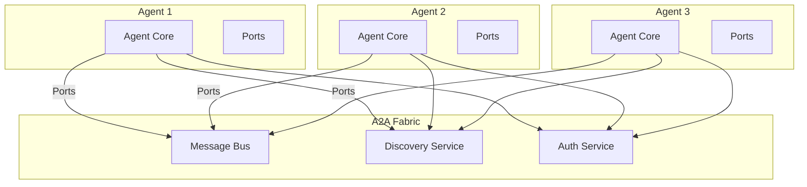
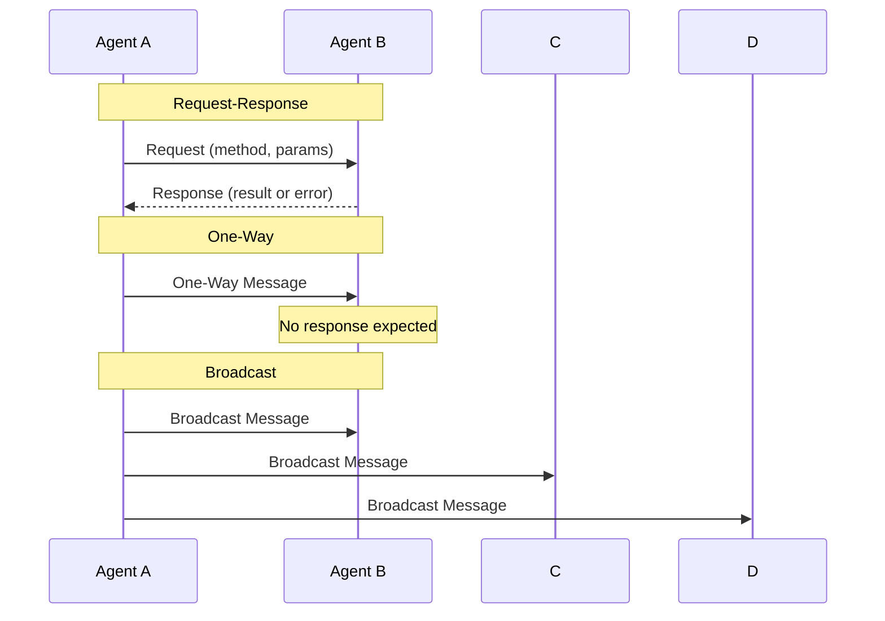
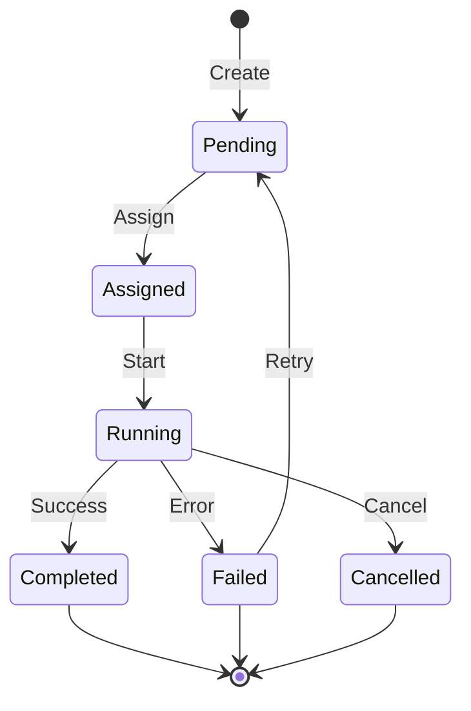
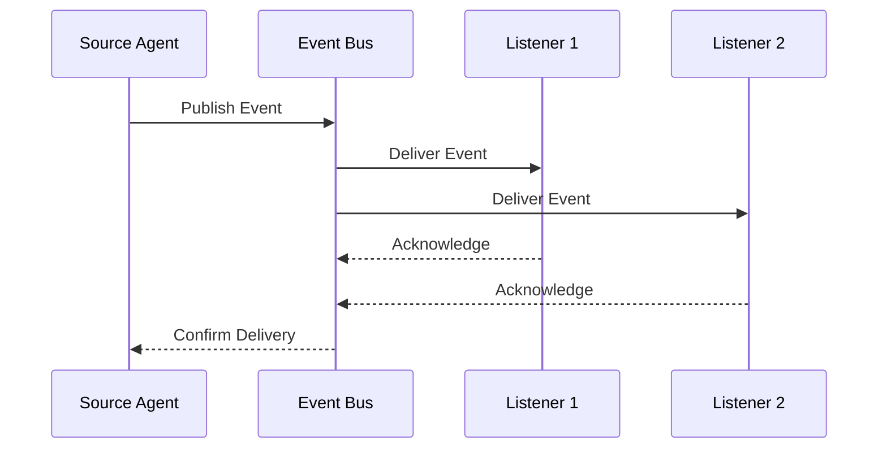
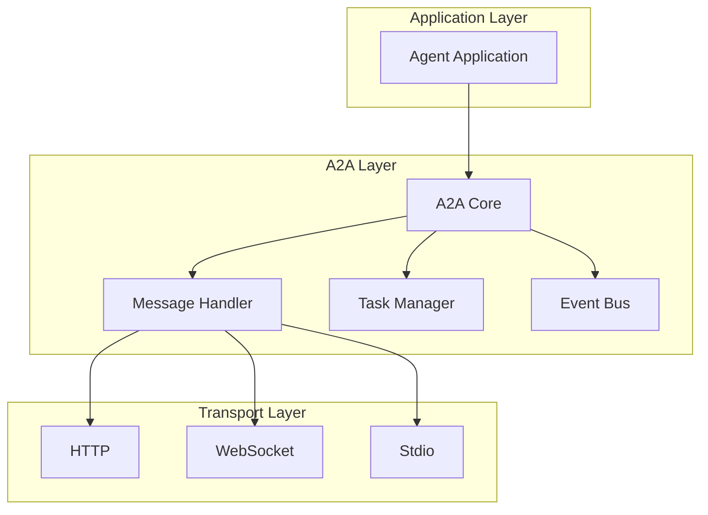
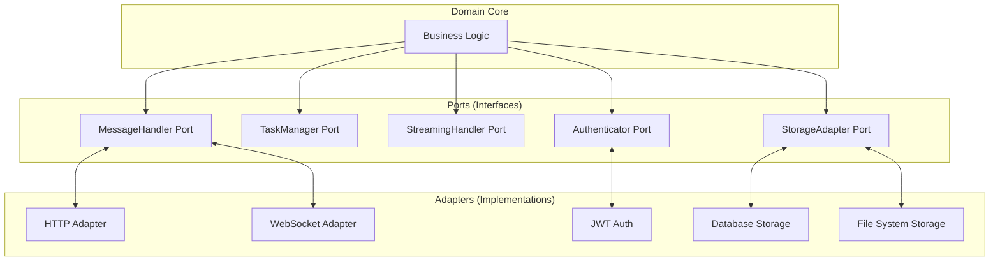
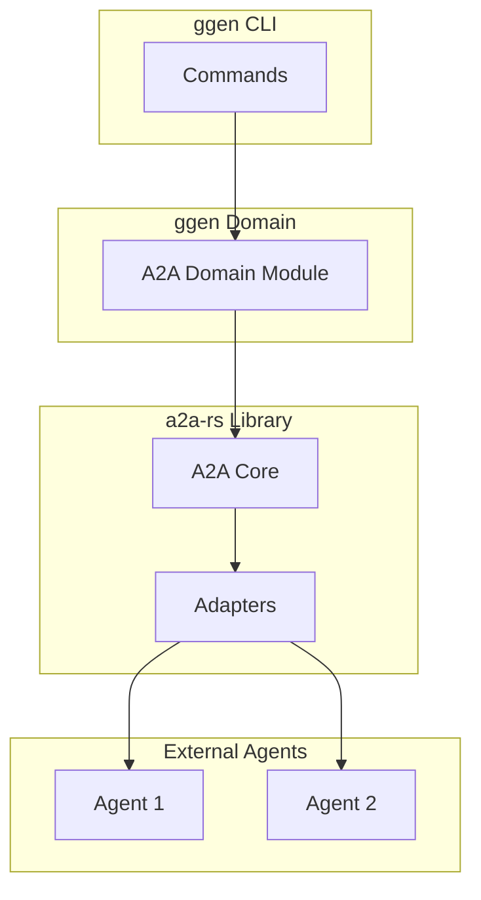

<!-- START doctoc generated TOC please keep comment here to allow auto update -->
<!-- DON'T EDIT THIS SECTION, INSTEAD RE-RUN doctoc TO UPDATE -->
**Table of Contents**

- [Agent-to-Agent (A2A) Protocol](#agent-to-agent-a2a-protocol)
  - [What is A2A?](#what-is-a2a)
  - [Why A2A Exists](#why-a2a-exists)
    - [The Challenge of Agent Communication](#the-challenge-of-agent-communication)
    - [Why Not Use Existing Protocols?](#why-not-use-existing-protocols)
  - [Core Concepts](#core-concepts)
    - [Agents and Identity](#agents-and-identity)
    - [Messages](#messages)
    - [Tasks](#tasks)
    - [Events](#events)
  - [Protocol Structure](#protocol-structure)
    - [JSON-RPC Methods](#json-rpc-methods)
  - [Communication Patterns](#communication-patterns)
    - [Request-Response](#request-response)
    - [Fire-and-Forget](#fire-and-forget)
    - [Publish-Subscribe](#publish-subscribe)
    - [Request Streaming](#request-streaming)
  - [Port and Adapter Architecture](#port-and-adapter-architecture)
    - [Port Traits (Rust)](#port-traits-rust)
    - [Adapter Implementations](#adapter-implementations)
  - [A2A in ggen](#a2a-in-ggen)
    - [Architecture](#architecture)
    - [Domain Modules](#domain-modules)
    - [Integration with MCP](#integration-with-mcp)
  - [Design Principles](#design-principles)
    - [1. Transport Independence](#1-transport-independence)
    - [2. Type Safety](#2-type-safety)
    - [3. Async by Default](#3-async-by-default)
    - [4. Error Handling](#4-error-handling)
  - [Comparison with Alternatives](#comparison-with-alternatives)
    - [A2A vs. Direct gRPC](#a2a-vs-direct-grpc)
    - [A2A vs. Message Queue](#a2a-vs-message-queue)
    - [A2A vs. Actor Frameworks](#a2a-vs-actor-frameworks)
  - [See Also](#see-also)

<!-- END doctoc generated TOC please keep comment here to allow auto update -->

# Agent-to-Agent (A2A) Protocol

**Type: Explanation** | [← Back to Documentation](../../README.md)

---

Agent-to-Agent (A2A) protocol is a communication framework that enables autonomous agents to discover, interact, and collaborate with each other. It provides the foundation for distributed multi-agent systems.

## What is A2A?

A2A is a **domain-specific protocol** designed for agent communication. Unlike generic messaging protocols, A2A includes:

1. **Agent lifecycle management** - Registration, discovery, health monitoring
2. **Message routing** - Point-to-point and broadcast messaging
3. **Task coordination** - Task creation, assignment, and monitoring
4. **Event streaming** - Real-time event propagation
5. **Authentication** - Secure agent identity verification



## Why A2A Exists

### The Challenge of Agent Communication

Building distributed agent systems presents unique challenges:

**Challenge 1: Agent Discovery**
```
Problem: How do agents find each other?
Solution: A2A provides a built-in discovery service where agents
          register their capabilities and can query for other agents.
```

**Challenge 2: Semantic Interoperability**
```
Problem: How do agents understand each other's messages?
Solution: A2A defines standard message types with schemas,
          ensuring consistent interpretation across implementations.
```

**Challenge 3: Coordination**
```
Problem: How do agents collaborate on complex tasks?
Solution: A2A includes task management with status tracking,
          assignment, and result aggregation.
```

**Challenge 4: Reliability**
```
Problem: What happens when agents fail?
Solution: A2A provides health monitoring, automatic retries,
          and graceful degradation.
```

### Why Not Use Existing Protocols?

| Existing Protocol | Why It's Insufficient |
|-------------------|----------------------|
| **HTTP/REST** | Too generic; no agent-specific concepts |
| **gRPC** | Tight coupling; lacks discovery and events |
| **AMQP** | Message-focused, not agent-focused |
| **WebSocket** | Transport only; no semantics |
| **Custom** | Reinventing the wheel; no interoperability |

A2A builds on proven protocols (HTTP, WebSocket) while adding agent-specific semantics.

## Core Concepts

### Agents and Identity

An **agent** is an autonomous software entity that can:

1. **Receive messages** from other agents
2. **Process messages** using internal logic
3. **Send messages** to other agents
4. **Publish events** about state changes
5. **Execute tasks** assigned to it

**Agent Identity:**

```rust
// Agent identifier (from a2a-rs)
pub struct AgentId {
    pub namespace: String,  // e.g., "ggen"
    pub name: String,       // e.g., "code-generator"
    pub instance: String,   // e.g., "a1b2c3d4"
}

// Full agent identifier: "ggen:code-generator:a1b2c3d4"
```

**Agent Types:**

| Type | Description | Example |
|------|-------------|---------|
| **Service Agent** | Provides specific capabilities | Database agent, file agent |
| **Task Agent** | Executes assigned tasks | Code generator, tester |
| **Coordinator Agent** | Orchestrates other agents | Workflow manager |
| **Gateway Agent** | Bridges to external systems | MCP gateway, API gateway |

### Messages

Messages are the primary communication mechanism in A2A:

```rust
// A2A Message structure
pub struct Message {
    pub id: MessageId,
    pub from: AgentId,
    pub to: AgentId,
    pub payload: MessagePayload,
    pub timestamp: DateTime<Utc>,
    pub headers: HashMap<String, String>,
}

// Message payload types
pub enum MessagePayload {
    Request { method: String, params: Value },
    Response { result: Value, error: Option<Error> },
    Event { event_type: String, data: Value },
    Notification { content: String },
}
```

**Message Patterns:**



### Tasks

Tasks represent **units of work** that agents can perform:

```rust
// Task structure
pub struct Task {
    pub id: TaskId,
    pub name: String,
    pub description: String,
    pub status: TaskStatus,
    pub assigned_to: Option<AgentId>,
    pub created_by: AgentId,
    pub created_at: DateTime<Utc>,
    pub started_at: Option<DateTime<Utc>>,
    pub completed_at: Option<DateTime<Utc>>,
    pub result: Option<TaskResult>,
}

// Task lifecycle
pub enum TaskStatus {
    Pending,      // Created, not assigned
    Assigned,     // Assigned to an agent
    Running,      // Agent is working on it
    Completed,    // Finished successfully
    Failed,       // Failed with error
    Cancelled,    // Cancelled before completion
}
```

**Task Flow:**



### Events

Events represent **state changes** and occurrences in the system:

```rust
// Event structure
pub struct Event {
    pub id: EventId,
    pub source: AgentId,
    pub event_type: String,
    pub data: Value,
    pub timestamp: DateTime<Utc>,
    pub headers: HashMap<String, String>,
}

// Common event types
pub enum EventType {
    AgentRegistered,
    AgentUnregistered,
    AgentStatusChanged,
    TaskCreated,
    TaskUpdated,
    TaskCompleted,
    MessageReceived,
    MessageSent,
    ErrorOccurred,
}
```

**Event Flow:**



## Protocol Structure

A2A is implemented as a **layered protocol**:



### JSON-RPC Methods

A2A exposes methods via JSON-RPC:

| Method | Description | Parameters |
|--------|-------------|------------|
| `agent/register` | Register a new agent | `agent_info` |
| `agent/unregister` | Unregister an agent | `agent_id` |
| `agent/list` | List all agents | `filter` |
| `agent/status` | Get agent status | `agent_id` |
| `message/send` | Send a message | `message` |
| `tasks/create` | Create a task | `task_spec` |
| `tasks/get` | Get task details | `task_id` |
| `tasks/list` | List tasks | `filter` |
| `tasks/cancel` | Cancel a task | `task_id` |
| `events/subscribe` | Subscribe to events | `subscription` |
| `events/unsubscribe` | Unsubscribe | `subscription_id` |

## Communication Patterns

### Request-Response

Synchronous communication where the sender awaits a response:

```rust
// Client sends request
let response = client.send_request(Request {
    to: agent_id,
    method: "generate_code".to_string(),
    params: json!({"prompt": "Create a REST API"}),
    timeout: Duration::from_secs(30),
}).await?;

// Server handles request
impl MessageHandler for MyAgent {
    async fn handle_request(&self, req: Request) -> Response {
        match req.method.as_str() {
            "generate_code" => self.generate_code(req.params).await,
            _ => Response::error("Unknown method"),
        }
    }
}
```

### Fire-and-Forget

Asynchronous communication where the sender doesn't await a response:

```rust
// Client sends one-way message
client.send_one_way(Message {
    to: agent_id,
    payload: MessagePayload::Notification {
        content: "Task completed".to_string(),
    },
}).await?;
// Continues immediately, doesn't wait for response
```

### Publish-Subscribe

Multiple agents receive the same message:

```rust
// Publisher
event_bus.publish(Event {
    event_type: "TaskCompleted".to_string(),
    data: json!({"task_id": "123"}),
}).await?;

// Subscriber 1
event_bus.subscribe("TaskCompleted", |event| {
    println!("Task completed: {}", event.data);
}).await?;

// Subscriber 2
event_bus.subscribe("TaskCompleted", |event| {
    update_metrics(event.data);
}).await?;
```

### Request Streaming

Continuous stream of responses:

```rust
// Client sends streaming request
let mut stream = client.send_streaming(Request {
    to: agent_id,
    method: "process_stream".to_string(),
    params: json!({"data": large_dataset}),
}).await?;

// Server streams responses
while let Some(chunk) = stream.next().await {
    println!("Received chunk: {}", chunk);
}
```

## Port and Adapter Architecture

A2A uses the **Port and Adapter pattern** (also known as Hexagonal Architecture):



### Port Traits (Rust)

Ports are defined as traits:

```rust
// MessageHandler port
#[async_trait]
pub trait MessageHandler: Send + Sync {
    async fn handle_message(&self, message: Message) -> Result<Response>;
    async fn can_handle(&self, message_type: &str) -> bool;
}

// TaskManager port
#[async_trait]
pub trait TaskManager: Send + Sync {
    async fn create_task(&self, spec: TaskSpec) -> Result<TaskId>;
    async fn get_task(&self, id: TaskId) -> Result<Task>;
    async fn list_tasks(&self, filter: TaskFilter) -> Result<Vec<Task>>;
    async fn cancel_task(&self, id: TaskId) -> Result<()>;
}

// Authenticator port
#[async_trait]
pub trait Authenticator: Send + Sync {
    async fn authenticate(&self, token: &str) -> Result<AgentId>;
    async fn authorize(&self, agent: AgentId, action: &str) -> Result<bool>;
}
```

### Adapter Implementations

Adapters implement ports for specific technologies:

```rust
// HTTP adapter for MessageHandler
pub struct HttpMessageHandler {
    client: HttpClient,
    base_url: String,
}

#[async_trait]
impl MessageHandler for HttpMessageHandler {
    async fn handle_message(&self, message: Message) -> Result<Response> {
        self.client
            .post(format!("{}/messages", self.base_url))
            .json(&message)
            .send()
            .await?
            .json()
            .await
            .map_err(Into::into)
    }

    async fn can_handle(&self, message_type: &str) -> bool {
        message_type == "http" || message_type == "rest"
    }
}

// JWT adapter for Authenticator
pub struct JwtAuthenticator {
    secret: String,
    issuer: String,
}

#[async_trait]
impl Authenticator for JwtAuthenticator {
    async fn authenticate(&self, token: &str) -> Result<AgentId> {
        let claims = decode_jwt(token, &self.secret)?;
        Ok(claims.agent_id)
    }

    async fn authorize(&self, agent: AgentId, action: &str) -> Result<bool> {
        // Check agent permissions
        Ok(true)
    }
}
```

## A2A in ggen

ggen uses the **a2a-rs** library as the foundation for agent communication:

### Architecture



### Domain Modules

| Module | Description |
|--------|-------------|
| `agent` | Agent registration, discovery, lifecycle |
| `message` | Message handling and routing |
| `task` | Task creation, assignment, monitoring |
| `error` | Error types and handling |
| `events` | Event publishing and subscription |
| `jsonrpc` | JSON-RPC method implementations |
| `protocols` | Protocol definitions and handlers |

### Integration with MCP

ggen bridges A2A and MCP, allowing external AI assistants to interact with ggen agents:

```rust
// A2A agent exposed as MCP tool
pub struct AgentMcpTool {
    agent_id: AgentId,
    a2a_client: A2aClient,
}

#[async_trait]
impl McpTool for AgentMcpTool {
    fn name(&self) -> &str {
        "agent-interaction"
    }

    fn description(&self) -> &str {
        "Interact with A2A agents"
    }

    async fn call(&self, args: Value) -> Result<Value> {
        let message = self.parse_args(args)?;
        let response = self.a2a_client.send(message).await?;
        Ok(response.to_json())
    }
}
```

## Design Principles

### 1. Transport Independence

A2A works over any transport that can transmit JSON:

```rust
// Transport trait
pub trait Transport: Send + Sync {
    async fn send(&self, data: Vec<u8>) -> Result<Vec<u8>>;
    async fn receive(&self) -> Result<Vec<u8>>;
}

// Implementations
impl Transport for HttpTransport { /* ... */ }
impl Transport for WebSocketTransport { /* ... */ }
impl Transport for StdioTransport { /* ... */ }
```

### 2. Type Safety

A2A uses Rust's type system to enforce correctness:

```rust
// Type-safe message builder
let message = Message::builder()
    .from(agent_id)
    .to(target_id)
    .request("generate_code", json!({"prompt": "..."}))
    .timeout(Duration::from_secs(30))
    .build()?;

// Compile-time validation
let response: CodeGenerationResponse = message.send().await?;
```

### 3. Async by Default

All operations are non-blocking:

```rust
// Async agent implementation
pub struct MyAgent {
    state: Arc<Mutex<State>>,
}

#[async_trait]
impl Agent for MyAgent {
    async fn start(&mut self) -> Result<()> {
        // Async initialization
    }

    async fn handle_message(&self, msg: Message) -> Result<Response> {
        // Async message handling
        let mut state = self.state.lock().await;
        // Process message...
    }
}
```

### 4. Error Handling

Comprehensive error types for all failure modes:

```rust
// A2A error types
pub enum A2aError {
    Connection(ConnectionError),
    Authentication(AuthError),
    Serialization(SerializationError),
    Validation(ValidationError),
    Timeout(TimeoutError),
    NotFound(NotFoundError),
    Permission(PermissionError),
}
```

## Comparison with Alternatives

### A2A vs. Direct gRPC

| Aspect | A2A | Direct gRPC |
|--------|-----|-------------|
| **Agent Concepts** | Built-in (agents, tasks, events) | Must implement yourself |
| **Discovery** | Built-in service discovery | Need external service |
| **Type Safety** | Rust + JSON Schema | Protocol Buffers |
| **Transport** | Pluggable (HTTP, WS, stdio) | HTTP/2 only |
| **Learning Curve** | Medium (agent concepts) | Low (standard RPC) |

### A2A vs. Message Queue

| Aspect | A2A | Message Queue (RabbitMQ, etc.) |
|--------|-----|-------------------------------|
| **Semantics** | Agent-specific | Generic messaging |
| **Request-Response** | Built-in | Requires correlation |
| **Task Management** | Built-in | Manual implementation |
| **Deployment** | Embedded | External dependency |
| **Scalability** | Medium | High |

### A2A vs. Actor Frameworks

| Aspect | A2A | Actor Framework (Akka, Actix) |
|--------|-----|-------------------------------|
| **Protocol** | Standardized | Framework-specific |
| **Interoperability** | Cross-language | Single language |
| **Transport** | Multiple | Framework-specific |
| **Task Focus** | First-class | Manual implementation |
| **Learning Curve** | Lower (simpler) | Higher (more concepts) |

## See Also

- [MCP Protocol Explanation](mcp-protocol.md) - Model Context Protocol
- [MCP-A2A Bridge](mcp-a2a-bridge.md) - How the protocols integrate
- [Protocol Translation](../advanced/protocol-translation.md) - Message format details
- [MCP A2A Integration](../../MCP_A2A_INTEGRATION.md) - Implementation guide
