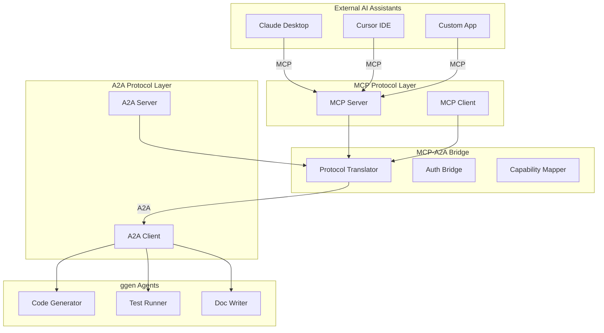
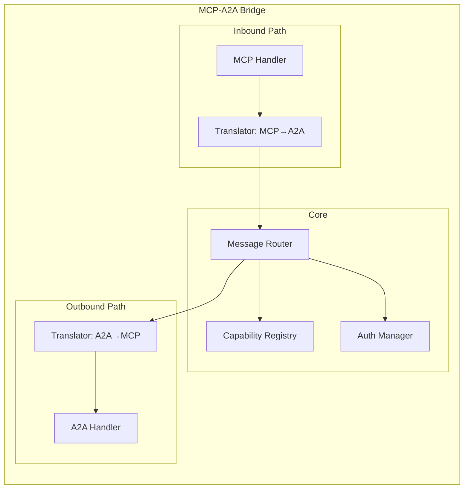
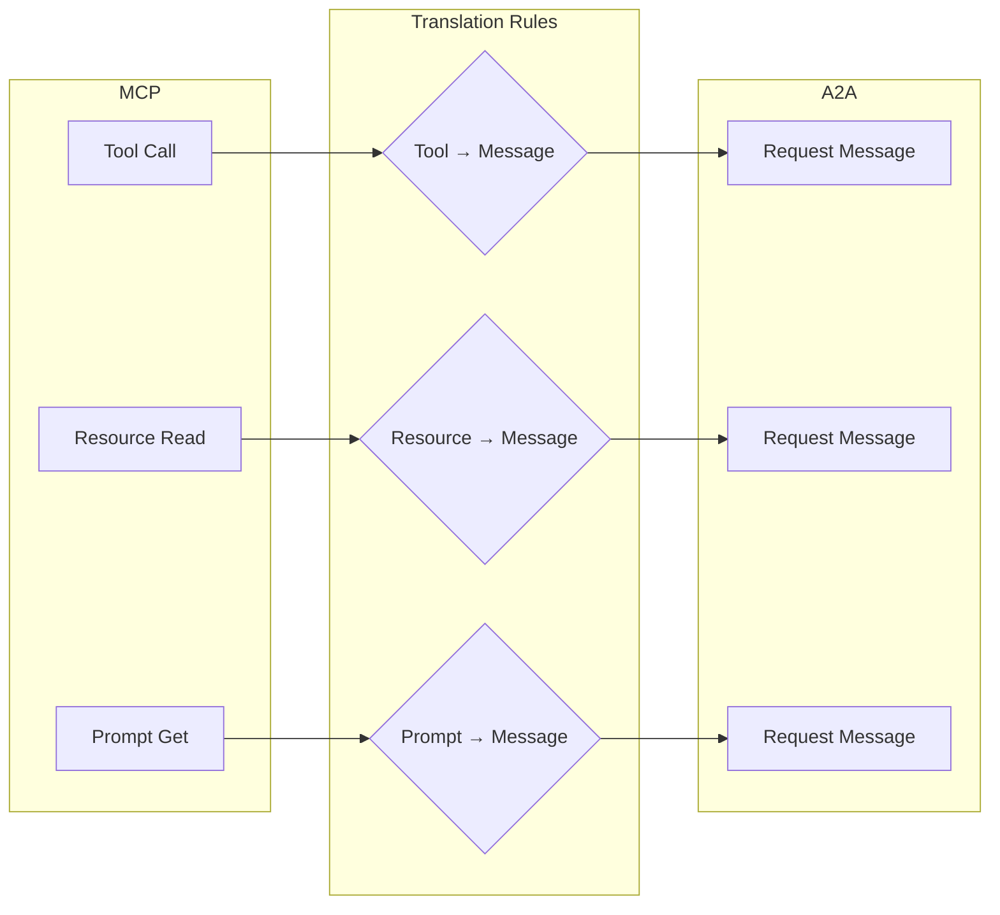
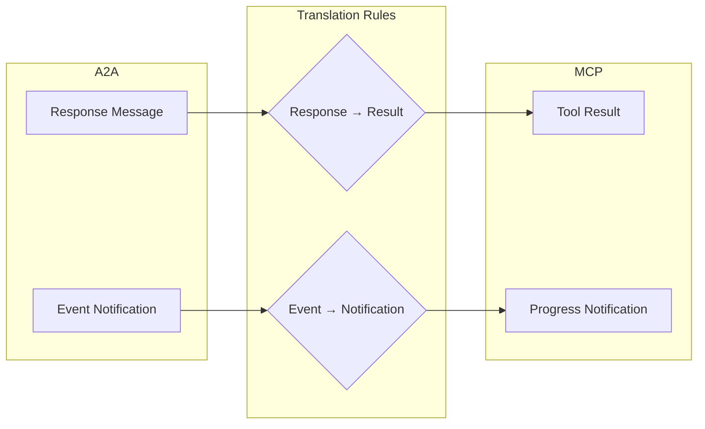
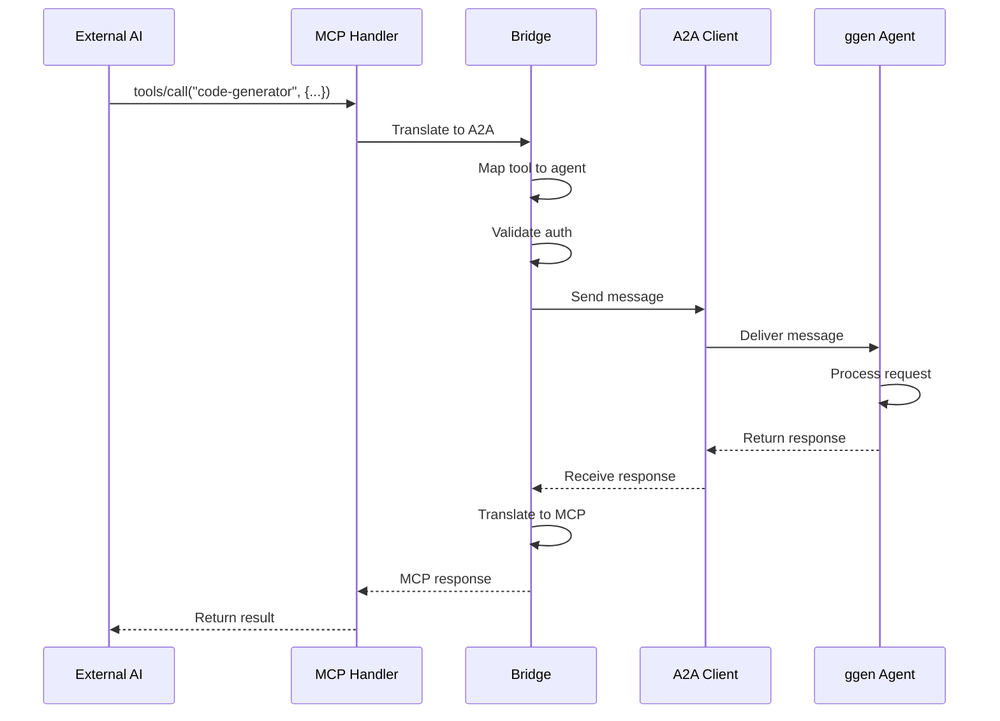
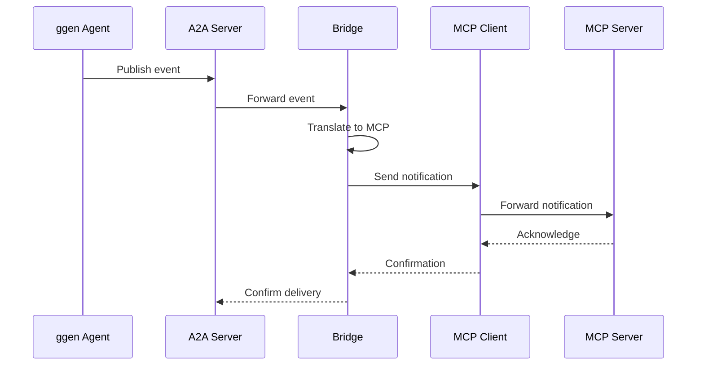
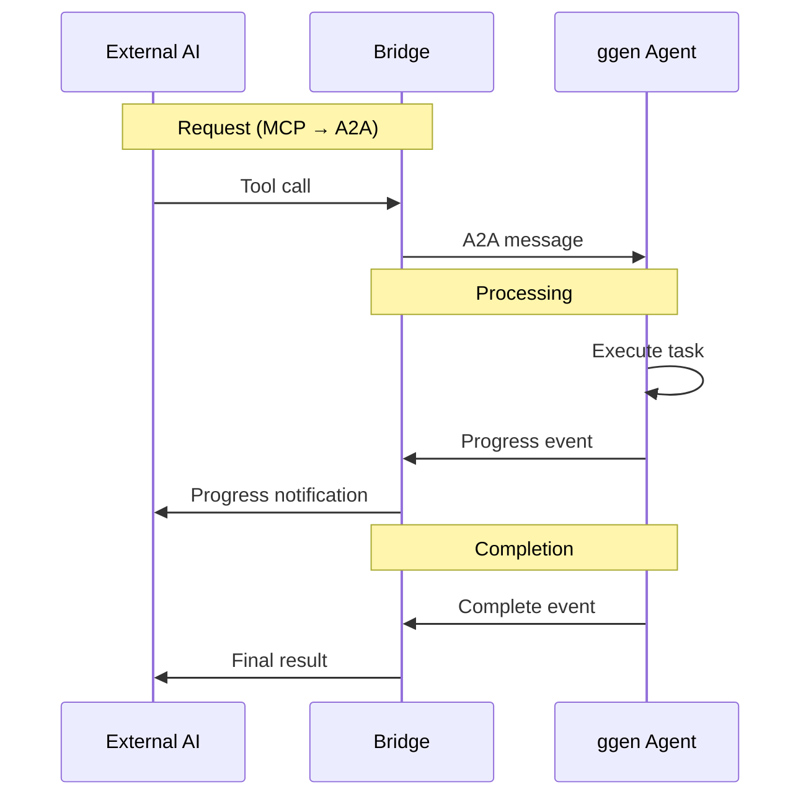
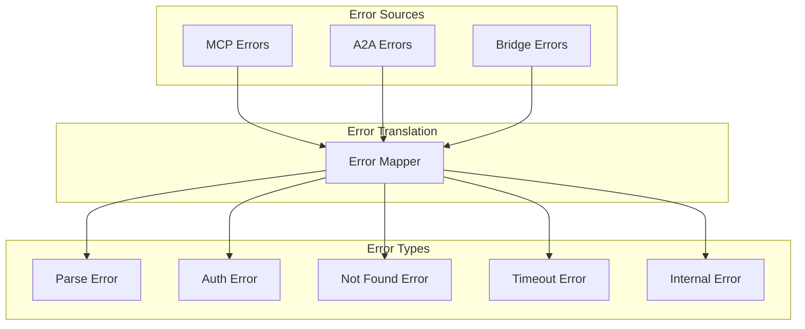
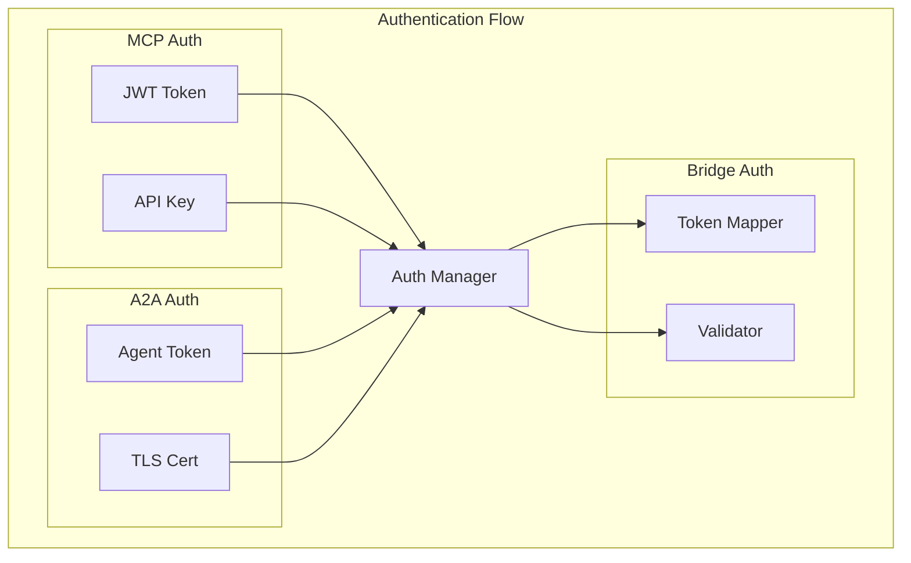

<!-- START doctoc generated TOC please keep comment here to allow auto update -->
<!-- DON'T EDIT THIS SECTION, INSTEAD RE-RUN doctoc TO UPDATE -->
**Table of Contents**

- [MCP-A2A Bridge](#mcp-a2a-bridge)
  - [What is the Bridge?](#what-is-the-bridge)
  - [Why the Bridge Exists](#why-the-bridge-exists)
  - [Bridge Architecture](#bridge-architecture)
  - [Translation Layer](#translation-layer)
  - [Message Flow](#message-flow)
  - [Capability Mapping](#capability-mapping)
  - [Error Handling](#error-handling)
  - [Security Integration](#security-integration)
  - [Performance Considerations](#performance-considerations)
  - [See Also](#see-also)

<!-- END doctoc generated TOC -->

# MCP-A2A Bridge

**Type: Explanation** | [← Back to Documentation](../../README.md)

---

The MCP-A2A Bridge enables communication between the Model Context Protocol (MCP) and the Agent-to-Agent (A2A) protocol, allowing external AI assistants to interact with ggen's agent ecosystem.

## What is the Bridge?

The MCP-A2A Bridge is a **bidirectional translator** that:

1. **Exposes A2A agents as MCP tools** - External AI assistants can call ggen agents
2. **Translates MCP requests to A2A messages** - Converts between protocols
3. **Maps MCP capabilities to A2A features** - Aligns concepts between systems
4. **Handles authentication for both protocols** - Unified security model



## Why the Bridge Exists

### The Integration Challenge

MCP and A2A serve different purposes:

| MCP | A2A |
|-----|-----|
| Connects AI to external systems | Connects agents to each other |
| Client-server model | Peer-to-peer model |
| Tools, resources, prompts | Agents, messages, tasks |
| JSON-RPC based | JSON-RPC based |
| External integration focus | Internal orchestration focus |

**Without the bridge**, these worlds remain separate:

```
External AI (MCP)    ×    Internal Agents (A2A)
     Claude                  Code Gen Agent
       |                          |
       |                          |
    (gap)                    (gap)
       |                          |
       |                          |
    No connection            No connection
```

**With the bridge**, they work together:

```
External AI (MCP)    →    Bridge    ←    Internal Agents (A2A)
     Claude                                  Code Gen Agent
       |                                       |
       └─────── MCP Protocol ─────────────────→
                    (Bridge)
       ←─────── A2A Protocol ──────────────────
```

### Key Benefits

1. **Unified Access** - Single interface for both external and internal agents
2. **Protocol Translation** - Seamless conversion between MCP and A2A
3. **Capability Mapping** - MCP tools map to A2A agent capabilities
4. **Shared Authentication** - Unified security model across protocols

## Bridge Architecture

The bridge consists of four main components:



### Component Responsibilities

| Component | Responsibility |
|-----------|----------------|
| **MCP Handler** | Receives MCP requests, validates format |
| **A2A Handler** | Sends A2A messages, handles responses |
| **Translator (MCP→A2A)** | Converts MCP requests to A2A messages |
| **Translator (A2A→MCP)** | Converts A2A responses to MCP responses |
| **Capability Registry** | Maps MCP tools to A2A agent capabilities |
| **Auth Manager** | Validates tokens for both protocols |
| **Message Router** | Routes messages to appropriate agents |

## Translation Layer

### MCP to A2A Translation

The bridge translates MCP concepts to A2A equivalents:



#### Translation Mapping

| MCP Concept | A2A Concept | Translation Rule |
|-------------|-------------|------------------|
| `tools/call` | `message/send` | Method name → A2A message type |
| Tool arguments | Message payload | JSON params → Message content |
| Tool result | Response payload | Result value → Response data |
| Resource URI | Target agent ID | Namespace extraction |
| Prompt arguments | Task parameters | Args → Task input |

#### Example: Tool Call to Message

```rust
// MCP Request
{
  "jsonrpc": "2.0",
  "id": 1,
  "method": "tools/call",
  "params": {
    "name": "code-generator",
    "arguments": {
      "prompt": "Create a REST API",
      "language": "rust"
    }
  }
}

// Translated to A2A Message
A2AMessage {
    id: "msg-001",
    from: "mcp-bridge",
    to: "ggen:code-generator:default",
    payload: MessagePayload::Request {
        method: "generate".to_string(),
        params: json!({
            "prompt": "Create a REST API",
            "language": "rust"
        }),
    },
    headers: headers,
}
```

### A2A to MCP Translation

The bridge translates A2A responses back to MCP format:



#### Response Translation

| A2A Concept | MCP Concept | Translation Rule |
|-------------|-------------|------------------|
| Response result | Tool result | Value → JSON result |
| Response error | JSON-RPC error | Error code mapping |
| Event data | Notification | Event → progress update |
| Task status | Progress token | Status → progress value |

#### Example: Response to Result

```rust
// A2A Response
A2AResponse {
    id: "msg-001",
    result: Ok(json!({
        "code": "fn main() { println!(\"Hello\"); }",
        "language": "rust"
    })),
}

// Translated to MCP Response
{
  "jsonrpc": "2.0",
  "id": 1,
  "result": {
    "content": [
      {
        "type": "text",
        "text": "```rust\nfn main() { println!(\"Hello\"); }\n```"
      }
    ]
  }
}
```

## Message Flow

### Inbound Flow (MCP → A2A)



### Outbound Flow (A2A → MCP)



### Bidirectional Flow



## Capability Mapping

The bridge maintains a registry that maps MCP tools to A2A agents:

```rust
// Capability mapping structure
pub struct CapabilityMapping {
    pub mcp_tool: McpToolDefinition,
    pub a2a_agent: AgentId,
    pub a2a_method: String,
    pub translation_rules: TranslationRules,
}

// Example mappings
const MAPPINGS: &[CapabilityMapping] = &[
    CapabilityMapping {
        mcp_tool: McpToolDefinition {
            name: "code-generator".to_string(),
            description: "Generate code from prompts".to_string(),
            input_schema: json!({
                "type": "object",
                "properties": {
                    "prompt": {"type": "string"},
                    "language": {"type": "string"}
                }
            }),
        },
        a2a_agent: AgentId::new("ggen", "code-generator", "default"),
        a2a_method: "generate".to_string(),
        translation_rules: TranslationRules::default(),
    },
    // ... more mappings
];
```

### Dynamic Discovery

The bridge can dynamically discover available agents:

```rust
impl McpA2aBridge {
    pub async fn discover_capabilities(&self) -> Result<Vec<CapabilityMapping>> {
        // Query A2A for available agents
        let agents = self.a2a_client.list_agents().await?;

        // Convert each agent to MCP tool
        let mappings = agents
            .into_iter()
            .map(|agent| self.agent_to_tool(agent))
            .collect();

        Ok(mappings)
    }

    fn agent_to_tool(&self, agent: AgentInfo) -> CapabilityMapping {
        CapabilityMapping {
            mcp_tool: McpToolDefinition {
                name: agent.name.clone(),
                description: agent.description.clone(),
                input_schema: agent.capabilities.to_json_schema(),
            },
            a2a_agent: agent.id.clone(),
            a2a_method: "handle_message".to_string(),
            translation_rules: TranslationRules::default(),
        }
    }
}
```

## Error Handling

The bridge handles errors from both protocols:



### Error Mapping

| MCP Error | A2A Error | Bridge Action |
|-----------|-----------|---------------|
| `-32700` Parse error | SerializationError | Return invalid request |
| `-32601` Method not found | NotFoundError | Return method not found |
| `-32602` Invalid params | ValidationError | Return invalid params |
| `-32603` Internal error | InternalError | Return internal error |
| `-32001` Agent not found | NotFoundError | Return agent not found |
| `-32002` Agent unavailable | UnavailableError | Return agent unavailable |

```rust
impl McpA2aBridge {
    fn translate_error(&self, error: A2aError) -> McpError {
        match error {
            A2aError::NotFound(_) => McpError {
                code: -32001,
                message: "Agent not found".to_string(),
                data: None,
            },
            A2aError::Unavailable(_) => McpError {
                code: -32002,
                message: "Agent unavailable".to_string(),
                data: None,
            },
            A2aError::Timeout(_) => McpError {
                code: -32003,
                message: "Request timeout".to_string(),
                data: None,
            },
            _ => McpError {
                code: -32603,
                message: "Internal error".to_string(),
                data: None,
            },
        }
    }
}
```

## Security Integration

The bridge provides unified authentication for both protocols:



### Authentication Strategies

| Strategy | MCP | A2A | Bridge |
|----------|-----|-----|--------|
| **JWT** | JWT token | JWT token | Validate and forward |
| **API Key** | API key | API key | Translate key to token |
| **mTLS** | Certificate | Certificate | Pass through |
| **OAuth2** | OAuth flow | OAuth flow | Handle translation |

```rust
impl AuthManager {
    pub async fn authenticate_mcp_request(&self, request: &McpRequest) -> Result<A2aCredentials> {
        // Extract MCP auth
        let mcp_auth = self.extract_mcp_auth(request)?;

        // Convert to A2A credentials
        let a2a_creds = match mcp_auth {
            McpAuth::Jwt(token) => {
                // Validate JWT
                let claims = self.validate_jwt(&token)?;
                A2aCredentials::Jwt(claims.a2a_token)
            }
            McpAuth::ApiKey(key) => {
                // Map API key to A2A token
                let token = self.api_key_to_token(&key).await?;
                A2aCredentials::Token(token)
            }
        };

        Ok(a2a_creds)
    }
}
```

## Performance Considerations

### Latency Sources

```
Total Latency = MCP Processing + Bridge Translation + A2A Processing
               ~1-5ms          ~1-3ms            ~5-50ms
```

### Optimization Strategies

1. **Connection Pooling**
   ```rust
   // Maintain pool of A2A connections
   let pool = ConnectionPool::new(10, Duration::from_secs(60));
   ```

2. **Message Batching**
   ```rust
   // Batch multiple MCP requests
   let batch = BatchRequest::new()
       .add(request1)
       .add(request2)
       .add(request3);
   ```

3. **Caching**
   ```rust
   // Cache capability mappings
   let cache = Cache::new(Duration::from_secs(300));
   ```

4. **Async Processing**
   ```rust
   // Process messages concurrently
   let results = futures::join_all(
       messages.into_iter()
           .map(|msg| self.process_message(msg))
   ).await;
   ```

### Performance Targets

| Metric | Target | Notes |
|--------|--------|-------|
| Translation latency | < 5ms | Per message |
| End-to-end latency | < 100ms | For simple requests |
| Throughput | > 1000 msg/s | Sustained rate |
| Memory overhead | < 100MB | Per bridge instance |

## See Also

- [MCP Protocol](mcp-protocol.md) - Understanding MCP
- [A2A Protocol](a2a-protocol.md) - Understanding A2A
- [Protocol Translation](../advanced/protocol-translation.md) - Deep dive on translation
- [Security Model](../advanced/security-model.md) - Authentication details
- [MCP A2A Integration](../../MCP_A2A_INTEGRATION.md) - Implementation guide
