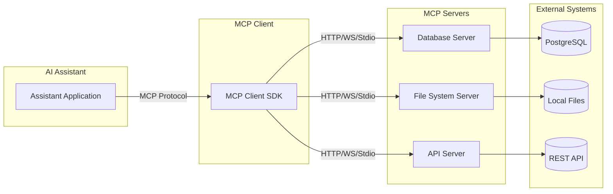
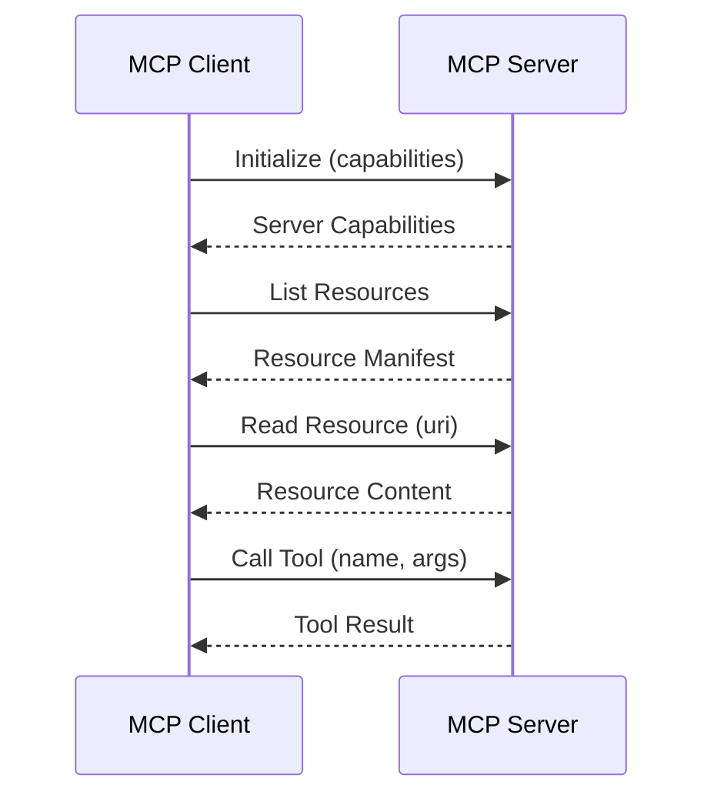
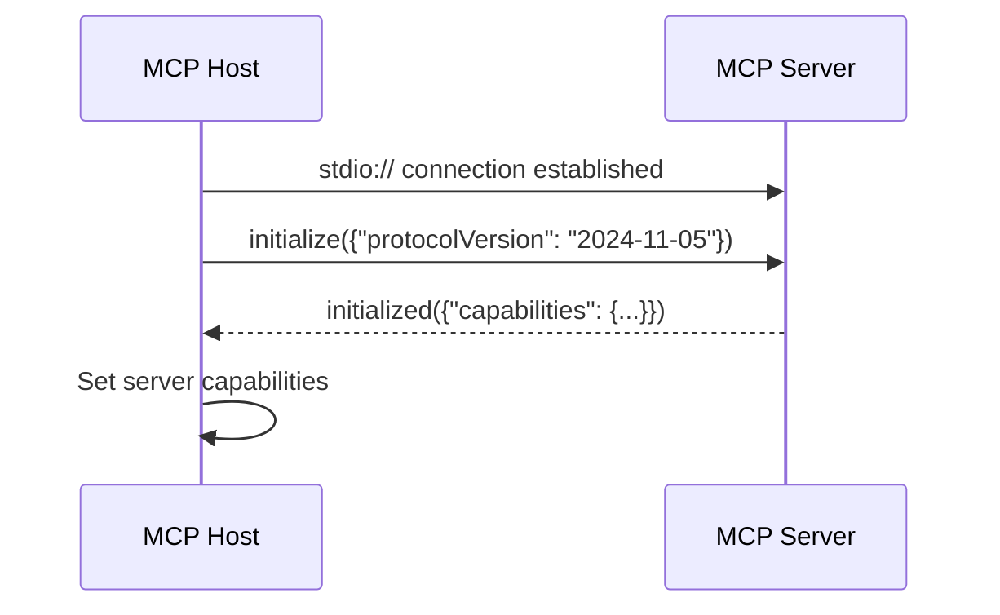
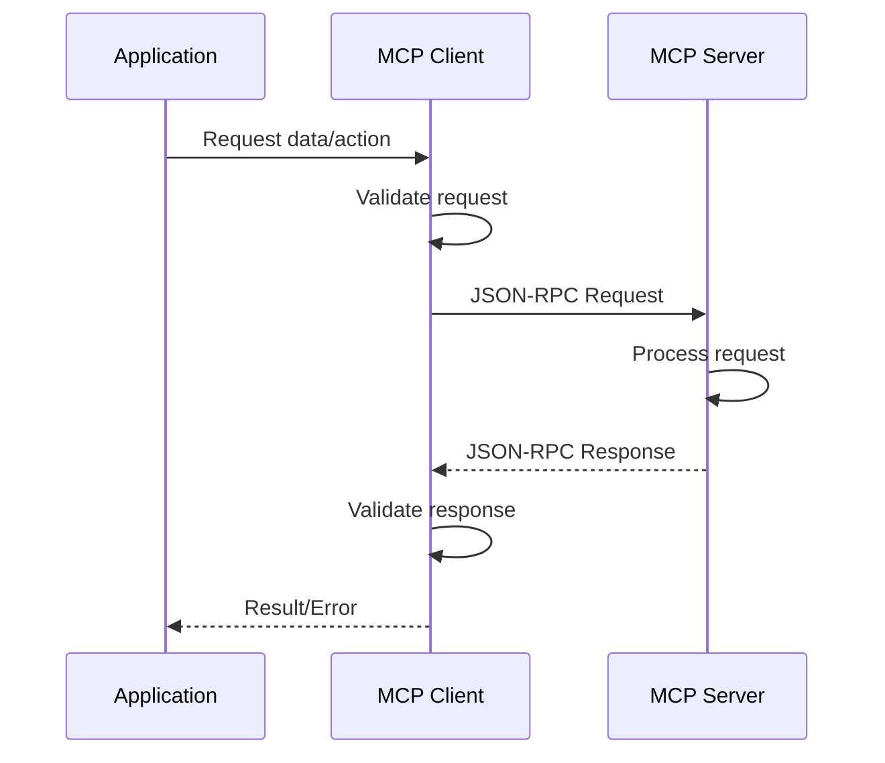
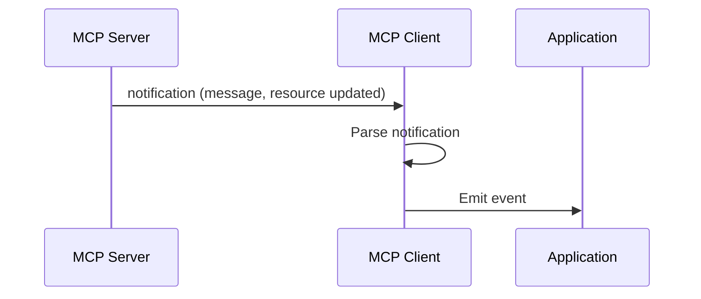
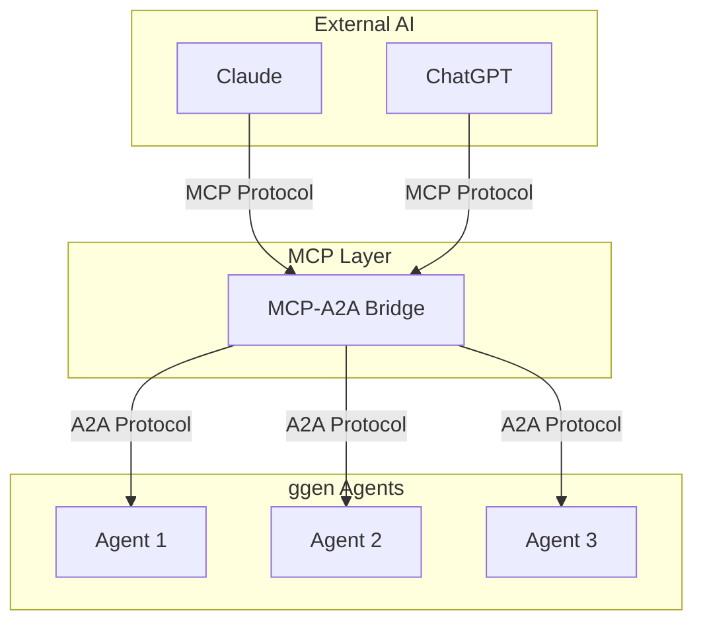

<!-- START doctoc generated TOC please keep comment here to allow auto update -->
<!-- DON'T EDIT THIS SECTION, INSTEAD RE-RUN doctoc TO UPDATE -->
**Table of Contents**

- [Model Context Protocol (MCP)](#model-context-protocol-mcp)
  - [What is MCP?](#what-is-mcp)
  - [Why MCP Exists](#why-mcp-exists)
    - [The Problem MCP Solves](#the-problem-mcp-solves)
    - [The MCP Solution](#the-mcp-solution)
    - [Key Benefits](#key-benefits)
  - [Core Concepts](#core-concepts)
    - [The Client-Server Model](#the-client-server-model)
    - [JSON-RPC Foundation](#json-rpc-foundation)
    - [Resources, Prompts, and Tools](#resources-prompts-and-tools)
      - [Resources (Data Access)](#resources-data-access)
      - [Prompts (Template Generation)](#prompts-template-generation)
      - [Tools (Executable Functions)](#tools-executable-functions)
  - [Message Flow](#message-flow)
    - [Initialization Flow](#initialization-flow)
    - [Request-Response Flow](#request-response-flow)
    - [Notification Flow](#notification-flow)
  - [Transport Layer](#transport-layer)
    - [stdio (Standard Input/Output)](#stdio-standard-inputoutput)
    - [HTTP (REST-like)](#http-rest-like)
    - [WebSocket (Bidirectional)](#websocket-bidirectional)
  - [MCP in ggen](#mcp-in-ggen)
    - [ggen's MCP Implementation](#ggens-mcp-implementation)
    - [Capabilities Exposed](#capabilities-exposed)
  - [Design Principles](#design-principles)
    - [1. Capability Discovery](#1-capability-discovery)
    - [2. Progress Cancellation](#2-progress-cancellation)
    - [3. Root URIs](#3-root-uris)
  - [Comparison with Alternatives](#comparison-with-alternatives)
    - [MCP vs. Function Calling](#mcp-vs-function-calling)
    - [MCP vs. Custom APIs](#mcp-vs-custom-apis)
    - [MCP vs. Plugins](#mcp-vs-plugins)
  - [See Also](#see-also)

<!-- END doctoc generated TOC please keep comment here to allow auto update -->

# Model Context Protocol (MCP)

**Type: Explanation** | [← Back to Documentation](../../README.md)

---

Model Context Protocol (MCP) is an open protocol that enables AI assistants to connect to external data sources and tools. It standardizes how AI applications interact with the outside world.

## What is MCP?

MCP is a **communication protocol** that defines:

1. **Standard interfaces** for accessing data and functionality
2. **Message formats** for requests and responses
3. **Transport mechanisms** for different communication patterns
4. **Security models** for authentication and authorization

Think of MCP as a universal translator between AI assistants and the vast ecosystem of external systems—databases, APIs, file systems, and services.



## Why MCP Exists

### The Problem MCP Solves

Before MCP, each AI assistant needed custom integrations for every external system:

```
Without MCP:
┌─────────────┐     ┌─────────────┐     ┌─────────────┐
 │   Claude   │────▶│ Custom API  │────▶│ PostgreSQL  │
 │   Client   │     │   Adapter   │     │             │
 └─────────────┘     └─────────────┘     └─────────────┘

 ┌─────────────┐     ┌─────────────┐     ┌─────────────┐
 │   Claude   │────▶│ Custom File │────▶│   Local FS  │
 │   Client   │     │  Adapter    │     │             │
 └─────────────┘     └─────────────┘     └─────────────┘

 ┌─────────────┐     ┌─────────────┐     ┌─────────────┐
 │   Claude   │────▶│ Custom HTTP │────▶│   REST API  │
 │   Client   │     │   Adapter   │     │             │
 └─────────────┘     └─────────────┘     └─────────────┘
```

Every integration required:
- Custom protocol design
- Duplicate authentication code
- Separate error handling
- Inconsistent interfaces

### The MCP Solution

With MCP, a single protocol handles all integrations:

```
With MCP:
┌─────────────┐
 │   Claude   │
 │   Client   │
 └──────┬──────┘
        │ MCP Protocol
        ▼
┌───────────────────────────────────────┐
│           MCP Client                  │
└───────────────────────────────────────┘
        │                   │                   │
        ▼                   ▼                   ▼
┌─────────────┐     ┌─────────────┐     ┌─────────────┐
 │   MCP DB    │     │  MCP Files  │     │   MCP API   │
 │   Server    │     │   Server    │     │   Server    │
 └──────┬──────┘     └──────┬──────┘     └──────┬──────┘
        │                   │                   │
        ▼                   ▼                   ▼
  ┌─────────┐          ┌─────────┐          ┌─────────┐
  │PostgreSQL│         │Local FS │          │REST API │
  └─────────┘          └─────────┘          └─────────┘
```

### Key Benefits

| Benefit | Description |
|---------|-------------|
| **Interoperability** | Any MCP client works with any MCP server |
| **Composability** | Combine multiple servers seamlessly |
| **Security** | Standardized authentication and authorization |
| **Extensibility** | Easy to add new capabilities |
| **Type Safety** | Schema validation for all operations |

## Core Concepts

### The Client-Server Model

MCP follows a classic client-server architecture:

**Client (MCP Host)**: The application that hosts the AI assistant
- Initiates connections to servers
- Sends requests for resources, prompts, or tools
- Processes responses from servers

**Server (MCP Server)**: Provides specific capabilities
- Exposes resources (data)
- Defines prompts (templates)
- Implements tools (functions)



### JSON-RPC Foundation

MCP is built on **JSON-RPC 2.0**, a lightweight remote procedure call protocol:

```json
// Request
{
  "jsonrpc": "2.0",
  "id": 1,
  "method": "tools/call",
  "params": {
    "name": "query_database",
    "arguments": {
      "query": "SELECT * FROM users"
    }
  }
}

// Response
{
  "jsonrpc": "2.0",
  "id": 1,
  "result": {
    "content": [
      {
        "type": "text",
        "text": "[{\"id\": 1, \"name\": \"Alice\"}]"
      }
    ]
  }
}
```

**Key JSON-RPC features used by MCP:**

| Feature | Description |
|---------|-------------|
| **Notifications** | One-way messages (no response expected) |
| **Batch Requests** | Multiple requests in single message |
| **Error Handling** | Structured error responses |
| **Request ID** | Correlate requests with responses |

### Resources, Prompts, and Tools

MCP defines three primary capability types:

#### Resources (Data Access)

Resources represent **data** that can be read:

```typescript
// Resource Definition
{
  "uri": "file:///project/README.md",
  "name": "readme",
  "description": "Project README file",
  "mimeType": "text/markdown"
}

// Reading a Resource
{
  "method": "resources/read",
  "params": {
    "uri": "file:///project/README.md"
  }
}
```

**Resource characteristics:**
- Identified by URI
- Have metadata (name, description, MIME type)
- Support reading (and optionally writing/subscribing)
- Can be static or dynamic

#### Prompts (Template Generation)

Prompts are **templates** that generate messages:

```typescript
// Prompt Definition
{
  "name": "code-review",
  "description": "Generate code review feedback",
  "arguments": [
    {
      "name": "file",
      "description": "File to review",
      "required": true
    },
    {
      "name": "focus",
      "description": "Review focus area",
      "required": false
    }
  ]
}

// Getting a Prompt
{
  "method": "prompts/get",
  "params": {
    "name": "code-review",
    "arguments": {
      "file": "src/main.rs",
      "focus": "security"
    }
  }
}
```

**Prompt characteristics:**
- Templated message generation
- Accept arguments for customization
- Return messages for AI consumption
- Support multi-turn conversations

#### Tools (Executable Functions)

Tools are **functions** that perform actions:

```typescript
// Tool Definition
{
  "name": "execute_query",
  "description": "Execute SQL query",
  "inputSchema": {
    "type": "object",
    "properties": {
      "query": {
        "type": "string",
        "description": "SQL query to execute"
      }
    },
    "required": ["query"]
  }
}

// Calling a Tool
{
  "method": "tools/call",
  "params": {
    "name": "execute_query",
    "arguments": {
      "query": "SELECT COUNT(*) FROM users"
    }
  }
}
```

**Tool characteristics:**
- JSON Schema for input validation
- Can have side effects
- Return structured results
- Support streaming responses

## Message Flow

### Initialization Flow



### Request-Response Flow



### Notification Flow



## Transport Layer

MCP is **transport-agnostic**—the same protocol works over different transports:

### stdio (Standard Input/Output)

**Use case:** Local servers spawned as child processes

```bash
# Start server via stdio
my-mcp-server

# Client communicates via stdin/stdout
echo '{"jsonrpc":"2.0","method":"initialize"}' | my-mcp-server
```

**Advantages:**
- Simple to implement
- Works with any language
- Automatic process lifecycle
- Built-in security (local only)

**Disadvantages:**
- Single client per server
- No remote access
- Process spawning overhead

### HTTP (REST-like)

**Use case:** Remote or long-running servers

```bash
# Server listens on HTTP port
my-mcp-server --port 3000

# Client makes HTTP requests
curl -X POST http://localhost:3000/mcp \
  -H "Content-Type: application/json" \
  -d '{"jsonrpc":"2.0","method":"initialize"}'
```

**Advantages:**
- Multiple concurrent clients
- Remote access
- Load balancing
- Existing infrastructure

**Disadvantages:**
- More complex deployment
- Requires server management
- Network latency

### WebSocket (Bidirectional)

**Use case:** Real-time updates and streaming

```javascript
// Client connects via WebSocket
const ws = new WebSocket('ws://localhost:3000/mcp');

// Server can push notifications
ws.onmessage = (event) => {
  const notification = JSON.parse(event.data);
  handleNotification(notification);
};
```

**Advantages:**
- Real-time communication
- Server push notifications
- Efficient for streaming
- Single connection for all messages

**Disadvantages:**
- More complex state management
- Connection reliability challenges
- Firewall/proxy issues

## MCP in ggen

ggen uses MCP to bridge the gap between **agent-to-agent (A2A) communication** and **external AI assistants**:



### ggen's MCP Implementation

1. **MCP Server** (`ggen-cli`): Exposes ggen agents as MCP tools
2. **MCP Client** (`ggen-domain`): Connects to external MCP servers
3. **Protocol Bridge** (`ggen-core`): Translates between MCP and A2A

### Capabilities Exposed

| Capability | Description |
|------------|-------------|
| `agent-list` | List all registered agents |
| `agent-start` | Start an agent |
| `agent-stop` | Stop an agent |
| `agent-status` | Get agent status |
| `agent-capabilities` | Query agent capabilities |
| `message-send` | Send message to agent |
| `task-create` | Create task for agent |
| `task-status` | Get task status |

## Design Principles

### 1. Capability Discovery

Servers declare capabilities; clients discover them:

```typescript
// Server declares capabilities
{
  "capabilities": {
    "resources": {},
    "prompts": {},
    "tools": {}
  }
}

// Client discovers what's available
const resources = await client.listResources();
const prompts = await client.listPrompts();
const tools = await client.listTools();
```

### 2. Progress Cancellation

Long-running operations support progress and cancellation:

```typescript
// Request with progress token
{
  "method": "tools/call",
  "params": {
    "name": "long_operation",
    "_meta": {
      "progressToken": 123
    }
  }
}

// Server sends progress updates
{
  "method": "notifications/progress",
  "params": {
    "progressToken": 123,
    "progress": 0.5,
    "message": "Processing..."
  }
}
```

### 3. Root URIs

Servers define a root URI for resource organization:

```typescript
{
  "capabilities": {
    "resources": {
      "subscribe": true,
      "listChanged": true
    }
  },
  "roots": [
    {
      "uri": "file:///project/"
    }
  ]
}
```

## Comparison with Alternatives

### MCP vs. Function Calling

| Aspect | MCP | Function Calling |
|--------|-----|------------------|
| **Scope** | General-purpose protocol | AI-specific feature |
| **Discovery** | Built-in capability discovery | Manual schema registration |
| **Transport** | Multiple (stdio, HTTP, WS) | Provider-specific |
| **Standardization** | Open standard | Vendor-specific |
| **Composability** | Combine multiple servers | Single provider |

### MCP vs. Custom APIs

| Aspect | MCP | Custom API |
|--------|-----|------------|
| **Development Time** | Fast (use existing SDK) | Slow (build everything) |
| **Maintenance** | Community support | You maintain it |
| **Interoperability** | Works with any MCP client | Works only with your app |
| **Type Safety** | JSON Schema validation | Manual validation |

### MCP vs. Plugins

| Aspect | MCP | Plugin System |
|--------|-----|---------------|
| **Distribution** | Independent servers | Package repository |
| **Sandboxing** | Process isolation | Depends on runtime |
| **Dependencies** | Server manages | Plugin host manages |
| **Updates** | Independent | Host controls |

## See Also

- [A2A Protocol Explanation](a2a-protocol.md) - Agent-to-agent communication
- [MCP-A2A Bridge](mcp-a2a-bridge.md) - How the protocols work together
- [Protocol Translation](../advanced/protocol-translation.md) - Message format details
- [Security Model](../advanced/security-model.md) - Authentication and authorization
- [MCP Integration Guide](../../MCP_A2A_INTEGRATION.md) - Implementation details
