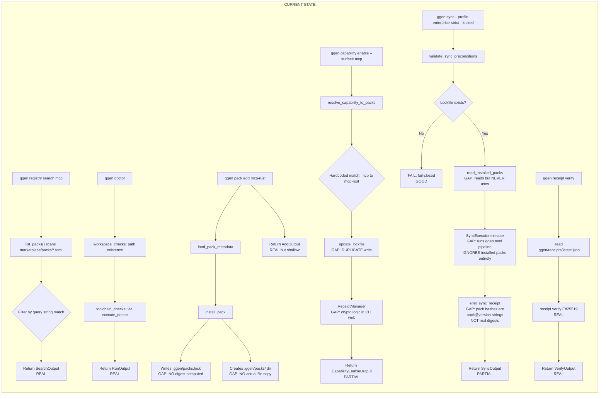

# Current State — Golden Path Trace

## Flow Diagram



## Step-by-Step Evidence

### Step 1: `ggen registry search mcp` — REAL

| What | Status | Evidence |
|------|--------|----------|
| Scan marketplace/packs/ | Works | `list_packs()` reads `GGEN_PACKS_DIR` or `marketplace/packs/` |
| Filter by query | Works | Case-insensitive match on id, name, description, tags |
| Return results | Works | `SearchOutput` with `packs`, `total` |

**Gaps:** None. This command is fully wired.

---

### Step 2: `ggen doctor` — REAL

| What | Status | Evidence |
|------|--------|----------|
| ggen.toml check | Works | `path_check("ggen.toml", ...)` |
| Cargo.toml check | Works | `path_check("Cargo.toml", ...)` |
| .specify dir check | Works | `path_check(".specify", ...)` |
| Toolchain checks | Works | Delegates to `ggen_domain::utils::execute_doctor()` |
| Healthy determination | Works | `is_healthy()` checks ggen.toml + Rust + Cargo |

**Gaps:**
- Missing `--check <name>` (only `run` and `check` exist, `check` doesn't accept a name)
- Missing `--env` flag
- Missing `--verbose` flag (only `run` has verbose output)
- Domain `execute_doctor` exists but domain module for lockfile/integrity checks missing

---

### Step 3: `ggen pack add mcp-rust` — REAL BUT SHALLOW

| What | Status | Evidence |
|------|--------|----------|
| Load pack metadata | Works | `load_pack_metadata("mcp-rust")` reads `marketplace/packs/mcp-rust.toml` |
| Write lockfile entry | Works | Writes `{ "installed": [...] }` to `.ggen/packs.lock` |
| Return output | Works | `AddOutput` with pack_name, status, message |

**Gaps:**
- **NO digest computed** — lockfile entry has `id`, `version`, `installed_at`, `packages` but NO `digest` field (violates lockfile invariant)
- **NO actual file copy** — `install_pack` creates `.ggen/packs/` dir but never copies pack contents (templates, queries, SPARQL files) from marketplace to install dir
- **NO signature verification** — no trust tier check, no signature on pack metadata
- `validate_pack_name()` helper exists in verb but is never called by `add()`
- Missing verbs: `list`, `show`, `verify`, `graph`, `update`

---

### Step 4: `ggen capability enable --surface mcp` — PARTIAL

| What | Status | Evidence |
|------|--------|----------|
| Resolve capability to packs | Works | `resolve_capability_to_packs("mcp")` returns `["mcp-rust"]` |
| Pack existence validation | Partial | Logs warning if pack not found but doesn't hard-fail |
| Update lockfile | Works | Writes `LockedPack` with `PackSource::Registry` |
| Generate receipt | Works | `ReceiptManager.generate_pack_install_receipt()` |

**Gaps:**
- **Capability registry is hardcoded** — `match surface { "mcp" => vec!["mcp-rust"] }` not derived from RDF ontology (epistemic bypass)
- **DUPLICATE lockfile writes** — `capability enable` writes lockfile AND `pack add` writes lockfile, two different lockfile schemas (JSON `{installed:[]}` vs `PackLockfile`)
- **Crypto logic in CLI verb** — `update_lockfile()` and `ReceiptManager` called directly from `capability.rs` (should be in domain)
- `runtime` parameter is ignored (`let _ = runtime;`)

---

### Step 5: `ggen sync --profile enterprise-strict --locked` — PARTIAL

| What | Status | Evidence |
|------|--------|----------|
| Profile validation | Works | `validate_sync_preconditions()` checks lockfile exists for enterprise-strict |
| Fail-closed on missing lockfile | Works | Returns `Err` if lockfile missing with `--locked` |
| Read installed packs | Partial | `read_installed_packs()` parses `.ggen/packs.lock` |
| Execute pipeline | Works | `SyncExecutor.execute()` runs full mu1-mu5 pipeline |
| Emit receipt | Partial | `emit_sync_receipt()` writes signed Ed25519 receipt |

**Critical Gaps:**
- **sync IGNORES installed packs** — `read_installed_packs()` reads the lockfile into a `Vec<String>` but the `SyncExecutor` pipeline runs `ggen.toml` manifest-driven pipeline. Installed pack contributions (templates, queries, SPARQL) are NEVER loaded into the pipeline.
- **Two lockfile schemas** — `pack add` writes `{ "installed": [...] }` JSON, `capability enable` writes `PackLockfile` struct. `read_installed_packs()` in sync.rs reads `packs` key but pack add writes `installed` key. They don't interop.
- **Receipt pack hashes are fake** — `input_hashes` contains `"pack:mcp-rust@1.0.0"` (just the version string), NOT a SHA-256 digest of pack content. Violates receipt invariant.
- **Profile enforcement only checks lockfile existence** — doesn't check trust tiers, allowed registries, or unsigned content
- **No CONSTRUCT-native derivation enforcement** — sync runs whatever ggen.toml says, no profile-based gating of semantic derivation paths

---

### Step 6: `ggen receipt verify` — REAL

| What | Status | Evidence |
|------|--------|----------|
| Read receipt file | Works | Reads `.ggen/receipts/latest.json` |
| Ed25519 verification | Works | `receipt.verify(&verifying_key)` with auto-discovery of `.ggen/keys/verifying.key` |
| Chain verification | Works | Supports `ReceiptChain` with genesis and chain integrity |
| Info display | Works | Shows operation_id, timestamp, hashes, signature presence |

**Gaps:**
- Receipt CONTENT is compromised by sync gaps (fake pack hashes), so verification passes but proves nothing meaningful
- No `receipt chain-verify` integration with pack provenance

---

## Summary: Current State

| Step | Command | Real? | Authority? | Proof? |
|------|---------|-------|-----------|--------|
| 1 | `registry search` | YES | N/A | N/A |
| 2 | `doctor` | YES | N/A | N/A |
| 3 | `pack add` | PARTIAL | NO | NO digest, NO file copy |
| 4 | `capability enable` | PARTIAL | NO | Hardcoded registry, dup lockfile |
| 5 | `sync --locked` | PARTIAL | NO | Ignores packs, fake receipt |
| 6 | `receipt verify` | YES | N/A | Receipt content is meaningless |

## Two Lockfile Schemas (BROKEN)

```json
// Schema A: Written by pack add (install.rs:85)
{
  "installed": [
    { "id": "mcp-rust", "version": "1.0.0", "installed_at": "...", "packages": [...] }
  ]
}

// Schema B: Written by capability enable (PackLockfile struct)
// and read by sync (read_installed_packs expects "packs" key)
{
  "packs": {
    "mcp-rust": { "version": "...", "source": "...", "integrity": null, "dependencies": [] }
  }
}
```

These are **incompatible**. `pack add` writes key `installed`, `sync` reads key `packs`.
