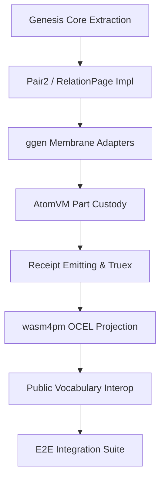

# 15 FINISH PLAN

The strategic finish plan to achieve Vision 2030 compliance for the Genesis-bearing interchangeable parts architecture.

## 4. Work Packages
See [14_AGENT_WORK_QUEUE.md](14_AGENT_WORK_QUEUE.md) for detailed descriptions.
- WP1: Genesis Core Extraction [MISSING]
- WP2: Pair2 / RelationPage Impl [PARTIAL]
- WP3: ggen Membrane Adapters [MISSING]
- WP4: AtomVM Part Custody [TEST_ONLY]
- WP5: Receipt Emitting & Truex [PARTIAL]
- WP6: wasm4pm OCEL Projection [MISSING]
- WP7: Public Vocabulary Interop [MISSING]
- WP8: E2E Integration Suite [MISSING]

## 5. Dependency Graph

## 6. Risk Register
1.  **Architecture conflation:** [AMBIGUOUS] Treating Genesis as an event bus (Strictly forbidden).
2.  **Mocking evidence:** [PARTIAL] `tests/receipt_validation.rs` using placeholder hashes instead of real BLAKE3.
3.  **Data mapping overhead:** [MISSING] ggen failing to strip complex structures into pure Pair2 tuples.
4.  **Index authority:** [AMBIGUOUS] Treating derived indices as the enterprise corpus.
5.  **Unenforced boundaries:** [PARTIAL] Rust discipline failing to prevent external IO inside Genesis.
6.  **WASM impedance mismatch:** [MISSING] AtomVM custody boundary passing complex data types.
7.  **Vocabulary drift:** [DOC_ONLY] Open-ontologies validation going out of sync with external repos.
8.  **Test cheating:** [PARTIAL] Chicago TDD laws violated by internal state assertion without OCEL evidence.

## 7. Observed-vs-Planned Matrix

| Component | Planned State | Observed State | Gap |
| :--- | :--- | :--- | :--- |
| **Genesis Core** | IO-free pure Rust crate | Entangled in `ggen` modules | Extraction required |
| **ggen Membrane** | Strict adapter layer | Bleeding into domain logic | Strict boundary enforcement |
| **AtomVM/WASM** | Immutable part custody | Partial WASM generation | Full `wasm32-wasi` support |
| **Truex Receipts** | BLAKE3 verifiable chains | Placeholder string tests | Implement real hashing |
| **wasm4pm Projections** | OCEL 2.0 compliant traces | Missing mapping logic | Implement `ocel.rs` |

## 8. Top 8 Missing Docs
1.  `docs/interop/16_WASM_ABI_SPEC.md` [MISSING]
2.  `docs/interop/17_BLAKE3_CHAIN_SPEC.md` [MISSING]
3.  `docs/interop/18_ATOMVM_CUSTODY_GUIDE.md` [MISSING]
4.  `docs/interop/19_SHACL_MAPPING_RULES.md` [MISSING]
5.  `docs/interop/20_GGGEN_ADAPTER_PATTERNS.md` [MISSING]
6.  `docs/interop/21_TRUEX_ACCOUNTING_LEDGER.md` [MISSING]
7.  `docs/interop/22_RELATIONPAGE_ALLOCATOR_DOCS.md` [MISSING]
8.  `docs/interop/23_CHICAGO_TDD_PRACTICES.md` [MISSING]

## 9. Top 8 Missing Tests
1.  `tests/core_algebra.rs` - Pair2 tuple behavior [MISSING]
2.  `tests/memory_layout.rs` - RelationPage allocations [MISSING]
3.  `tests/adapter_boundaries.rs` - ggen to Genesis isolation [MISSING]
4.  `tests/ocel_projection.rs` - wasm4pm output format [MISSING]
5.  `tests/shacl_compliance.rs` - Public vocab constraints [MISSING]
6.  `tests/atomvm_wasi.rs` - WASM environment checks [MISSING]
7.  `tests/receipt_tampering.rs` - Truex chain breakage detection [MISSING]
8.  `tests/e2e/manufacturing.rs` - Full lifecycle validation [MISSING]

## 10. Top 8 Implementation Gaps
1.  `src/genesis_core/` crate isolation [MISSING]
2.  `RelationPage` exact contiguous memory allocator [MISSING]
3.  `Construct8` packet serializer/deserializer (no JSON) [MISSING]
4.  `ggen` boundary adapter traits [MISSING]
5.  AtomVM integration bindings for Rust [MISSING]
6.  Real BLAKE3 receipt chain generation in `truex` [MISSING]
7.  OCEL 2.0 JSON projection generator [MISSING]
8.  Automated SHACL validation hook in `wasm4pm` [MISSING]

## 11. Top 8 Interop Gaps
1.  **ggen -> Genesis:** Missing strict Pair2 structural typing [MISSING]
2.  **Genesis -> AtomVM:** WASM ABI for `Construct8` passing [MISSING]
3.  **AtomVM -> Truex:** Lifecycle event trigger mechanism [MISSING]
4.  **Truex -> wasm4pm:** Receipt to trace conversion protocol [MISSING]
5.  **wasm4pm -> External (pm4py):** OCEL validation hook [MISSING]
6.  **open-ontologies -> ggen:** Vocabulary fetch/sync process [MISSING]
7.  **ggen -> External API:** Membrane boundary strict typing [MISSING]
8.  **Truex -> DuckDB:** Receipt analytics indexing projection [MISSING]

## 12. Top 8 Naming/Rename Risks
1.  `Pair2` vs `Tuple` [AMBIGUOUS]
2.  `RelationPage` vs `Table` [AMBIGUOUS]
3.  `Construct8` vs `Entity` [AMBIGUOUS]
4.  `Truex` vs `Ledger` [AMBIGUOUS]
5.  `wasm4pm` vs `process_miner` [AMBIGUOUS]
6.  `pictl` vs `process_cli` [AMBIGUOUS]
7.  `ggen` vs `foundry` [AMBIGUOUS]
8.  `AtomVM` vs `Runtime` [AMBIGUOUS]
