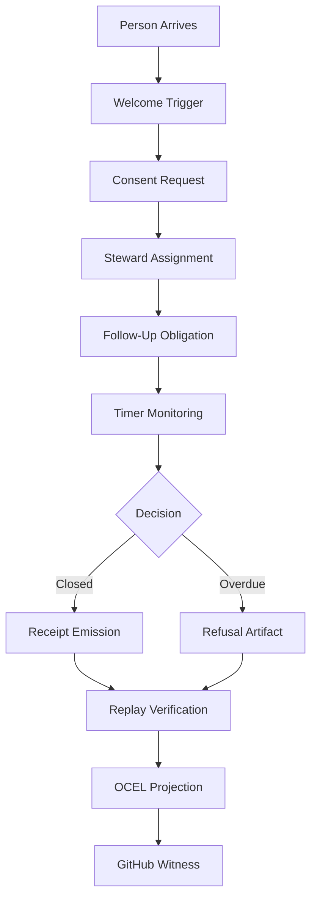

# CSC-1: The Canonical Stewardship Cell

## 1. Mission
CSC-1 is the first end-to-end operational nervous system cell. It proves the Vision 2035 architecture by manufacturing a self-contained unit of stewardship: a newcomer appears, is received, and their incorporation obligation is stewarded to lawful closure.

**The Singular Invariant:** A human being appears. The system must prove they were not silently lost.

## 2. The Operational Lifecycle

## 3. The Interchangeable Part Stack

| Layer | Implementation Component |
| :--- | :--- |
| **Canon Basis** | `canon/` Frozen Canon Registry (1 Cor 4:2, Romans 15:7) |
| **Custody** | AtomVM/Erlang Shell actor binding |
| **Portability** | WASM/Rust execution body |
| **Membrane** | ggen foundry/projection layer |
| **Logic** | `WelcomeOneAnotherPart`, `ConsentGatePart`, `AssignStewardPart` |
| **State** | RelationPage (Predicate-fixed binary relations) |
| **Proof** | BLAKE3 receipt chain, replay cursors, refusal evidence |
| **Witness** | GitHub issue ownership and governance surface |

## 4. The Exact Lifecycle Contracts

| Trigger | Obligation | Lawful Closure | Failure Mode |
| :--- | :--- | :--- | :--- |
| `VisitorArrival` | `WelcomeNewcomer` | `ReceivedAndRemembered` | Silent Loss |
| `ConsentRequest` | `ObtainAuthorization` | `ConsentAdmitted` | Consent Violation |
| `StewardAssign` | `BindResponsibility` | `StewardBound` | Orphaned Path |
| `FollowUp` | `FaithfulStewardship` | `SuccessfulIncorporate` | Overdue |

## 5. Artifacts & Receipts

CSC-1 must emit:
1. **Construction Receipt:** BLAKE3 binding of the arrival event, steward assignment, and incorporation state.
2. **Replay Manifest:** Deterministic script to reproduce the incorporation logic.
3. **Refusal Artifact:** Evidence surface if a newcomer arrives but is not incorporated (the definition of a plague).
4. **OCEL Log:** Object-centric process execution trace.

## 6. Definition of Done (Verification)

CSC-1 is complete only when:
- [ ] Scripture Basis is mapped (1 Cor 4:2, Romans 15:7).
- [ ] Every steward assignment is cryptographically receipted.
- [ ] No obligation path is orphaned; all paths reach a terminal state.
- [ ] Adversarial replay reproduces the exact same receipt.
- [ ] GitHub issues mirror the current obligation state for external witness.
- [ ] Silent Loss Rate (SLR) is measurable and proven zero for the test fixture.
- [ ] System passes the "Adversarial Substitution Test" (no central priest/admin bottleneck).

> **A system that cannot prove the newcomer was welcomed is not stewardship; it is administrative archaeology.**