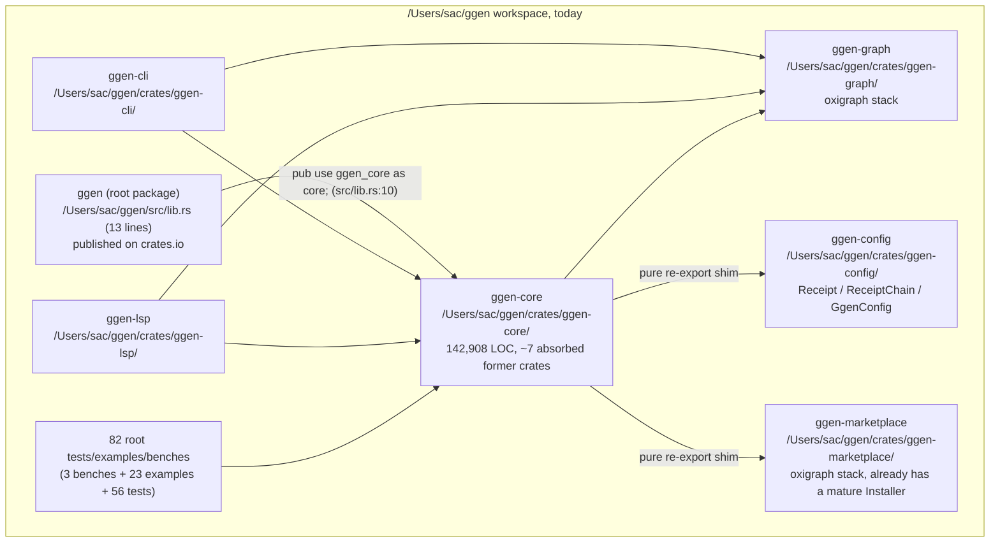
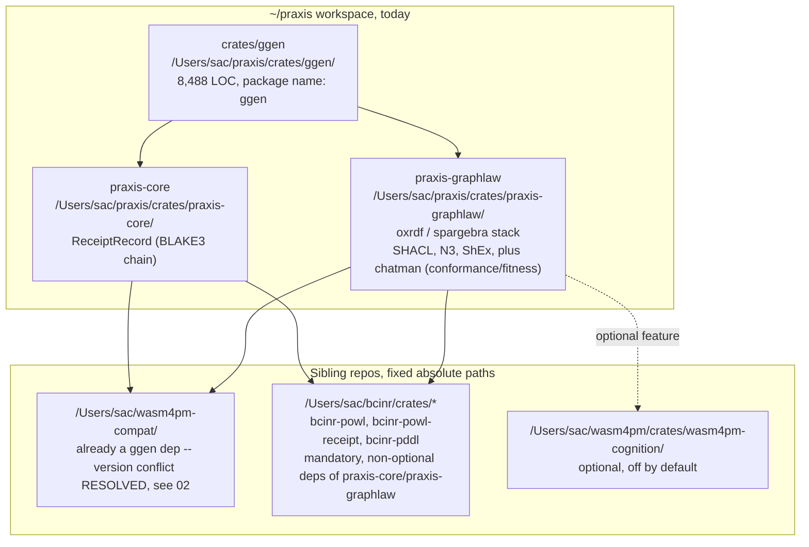
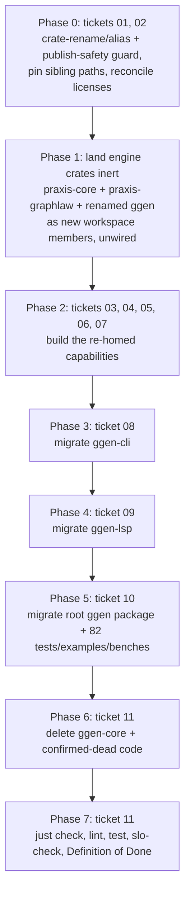

# GGEN-CORE → praxis/crates/ggen Replacement — Overview

This is the index ticket for a rip-and-replace of `/Users/sac/ggen/crates/ggen-core` in
favor of a first-principles engine built from `~/praxis/crates/ggen` plus its
`praxis-core`/`praxis-graphlaw` dependencies. The full scope was originally one document
(`GGEN-CORE-PRAXIS-REPLACEMENT.md`); it is split here into focused tickets so each phase/
concern can be assigned, reviewed, and closed independently. Every ticket below traces its
claims to full absolute file paths and exact `wc -l` line counts, re-verified against the
live filesystem in the same session that wrote them — nothing here is inferred from
documentation alone, and no path or line count is approximate.

## Crate root paths (referenced throughout this ticket set)

| Crate | Root path |
|---|---|
| `ggen-core` (retiring) | `/Users/sac/ggen/crates/ggen-core/` |
| `ggen-cli` | `/Users/sac/ggen/crates/ggen-cli/` |
| `ggen-lsp` | `/Users/sac/ggen/crates/ggen-lsp/` |
| `ggen-config` | `/Users/sac/ggen/crates/ggen-config/` |
| `ggen-graph` | `/Users/sac/ggen/crates/ggen-graph/` |
| `ggen-marketplace` | `/Users/sac/ggen/crates/ggen-marketplace/` |
| root `ggen` package | `/Users/sac/ggen/` (package root; `src/`, `tests/`, `examples/`, `benches/`) |
| `praxis/crates/ggen` | `/Users/sac/praxis/crates/ggen/` |
| `praxis-core` | `/Users/sac/praxis/crates/praxis-core/` |
| `praxis-graphlaw` | `/Users/sac/praxis/crates/praxis-graphlaw/` |

## Decision

Retire `/Users/sac/ggen/crates/ggen-core` (142,908 lines across `src/`) in favor of a
first-principles engine built from `/Users/sac/praxis/crates/ggen` (8,488 lines) plus its
`praxis-core`/`praxis-graphlaw` dependencies. This is a full replacement: `ggen-core` is
deleted once consumers are re-pointed, not kept running alongside the new engine long-term.
Capabilities that only exist in `ggen-core` today and are still load-bearing for
`ggen-cli`/`ggen-lsp` are re-homed into the new engine or an existing sibling crate — not
silently dropped, and not re-inflated into a second monolith either.

Praxis's own `/Users/sac/praxis/docs/jira/v26.7.12/PRD.md:33-34` already recorded a
2026-07-05 decision freezing `/Users/sac/ggen` and naming `crates/ggen` the only permitted
`ggen` target going forward — this ticket set operationalizes that decision from the
ggen-repo side.

## Scale reality check

| | `ggen-core` | `praxis/crates/ggen` |
|---|---:|---:|
| Total `src/` LOC | 142,908 | 8,488 |
| Ratio | 100% | ~6% |
| CLI surface | ~30 commands (31 files, 164 `ggen_core::` call sites — see [08](08-GGEN-CLI-MIGRATION.md)) | 5 nouns / 10 verbs |
| Test LOC | 49,527 (116 files) | 7,236 (20 files) — ~14.6%, roughly proportional |

`ggen-core` is not one cohesive engine — it is the graph/template/pipeline engine (~40-50K
lines) plus **six former crates absorbed verbatim and never re-architected**, each confirmed
via `find <dir> -name '*.rs' | xargs wc -l | tail -1`:

| Absorbed module | Full path | LOC |
|---|---|---:|
| `domain` | `/Users/sac/ggen/crates/ggen-core/src/domain/` | 22,499 |
| `utils` | `/Users/sac/ggen/crates/ggen-core/src/utils/` | 11,008 |
| `ontology_core` | `/Users/sac/ggen/crates/ggen-core/src/ontology_core/` | 1,778 |
| `transport` | `/Users/sac/ggen/crates/ggen-core/src/transport/` | 1,245 |
| `canonical` | `/Users/sac/ggen/crates/ggen-core/src/canonical/` | 722 |

All carry verbatim former-crate-root doc comments (`//! # ggen-domain`, etc.), undocumented
in `/Users/sac/ggen/crates/ggen-core/src/lib.rs`'s own module overview. It also contains
**three parallel pipeline implementations within ggen-core alone**:

| Implementation | Full path | LOC |
|---|---|---:|
| `Pipeline`/`PipelineBuilder` | `/Users/sac/ggen/crates/ggen-core/src/pipeline.rs` | 869 |
| `GenerationPipeline` | `/Users/sac/ggen/crates/ggen-core/src/codegen/pipeline.rs` | 2,076 |
| `StagedPipeline` | `/Users/sac/ggen/crates/ggen-core/src/pipeline_engine/pipeline.rs` | 777 |

— and consumer-side research found a **fourth** entry point consumed by `ggen-lsp`'s MCP
server (`codegen::pipeline::GenerationPipeline` plus `get_llm_service()`, used at
`/Users/sac/ggen/crates/ggen-lsp/src/a2a_mcp/mcp_server.rs:44-45,80`, 301 lines total — see
[09](09-GGEN-LSP-MIGRATION.md)). The existing crate audit
(`/Users/sac/ggen/docs/crate-audits/AUDIT_DASHBOARD.md`, dated 2026-04-01) only names two
and is measurably stale in other respects too (2 of its 3 headline SHACL P0 claims no longer
match the code; `v26.5.19/` and `config/hive_coordinator.rs`, both cited as current, have
been deleted/renamed since).

## What praxis/crates/ggen already does well (adopt as-is)

- **CLI surface**: `doctor run`, `graph validate`, `law {derive,explain,export,load,validate}`,
  `receipt {history,verify}`, `sync run [--dry-run] [--watch]` — small, `clap-noun-verb`
  auto-registered, JSON-by-default output.
- **Receipt chain**: BLAKE3 hash chain (`/Users/sac/praxis/crates/praxis-core/src/receipt_record.rs`,
  186 lines), genesis-rooted, refuses to extend a tampered head (`FM-CHAIN-009`),
  log-tail-is-truth (not the snapshot file), input closure binds template *source bytes* not
  just outputs (catches comment-only edits ggen-core's own contract-drift hole misses) —
  proven by 6 dedicated e2e tests in `/Users/sac/praxis/crates/ggen/tests/receipt_chain_e2e.rs`,
  all via the real CLI binary, no mocks.
- **Law engine**: real SHACL/N3-Datalog/ShEx/denial-rule evaluation via
  `/Users/sac/praxis/crates/praxis-graphlaw/`, proven load-bearing (not decorative) by
  `/Users/sac/praxis/crates/ggen/tests/graphlaw_e2e.rs`: the *same* fixture fails under plain
  oxigraph and succeeds once N3-derived facts satisfy a guard.
- **Lockfile**: idempotent writes, sorted deterministic BLAKE3 content-hash drift detection.
- **Watch mode**: debounced, self-trigger-loop-guarded, has a real background-thread test.
- **Chicago TDD**: confirmed genuinely mock-free (grepped clean for `mockall`/`struct
  Mock`/behavior-verification patterns).
- **Hygen-style templating**: frontmatter with freeze policies, a `determinism: true`
  self-check that re-renders and diffs, and a fix for a documented `ggen-core` bug (SPARQL
  row keys keyed by `?name` instead of bare `name`).

## Ticket index

| # | Ticket | Phase | Depends on |
|---|---|---|---|
| 01 | [Publish safety and crate rename](01-PUBLISH-SAFETY-AND-CRATE-RENAME.md) | 0 | — |
| 02 | [Cross-repo dependency risks](02-CROSS-REPO-DEPENDENCY-RISKS.md) | 0 | — |
| 03 | [RDF engine bridge design](03-RDF-ENGINE-BRIDGE-DESIGN.md) | 1–2 | 01 |
| 04 | [Receipt signing and OTEL](04-RECEIPT-SIGNING-AND-OTEL.md) | 2 | 01 |
| 05 | [Manifest/config port](05-MANIFEST-CONFIG-PORT.md) | 2 | 01 |
| 06 | [Marketplace/pack-registry merge](06-MARKETPLACE-PACK-REGISTRY-MERGE.md) | 2 | 01, 04 (receipt) |
| 07 | [Project scaffolding port](07-PROJECT-SCAFFOLDING-PORT.md) | 2 | 01 |
| 08 | [ggen-cli migration](08-GGEN-CLI-MIGRATION.md) | 3 | 01–07 |
| 09 | [ggen-lsp migration](09-GGEN-LSP-MIGRATION.md) | 4 | 05, 08 (agent-facade) |
| 10 | [Root package + test migration](10-ROOT-PACKAGE-TEST-MIGRATION.md) | 5 | 08, 09 |
| 11 | [Deletion and Definition of Done](11-DELETION-AND-DEFINITION-OF-DONE.md) | 6–7 | 08, 09, 10 |
| 12 | [Open questions for follow-up](12-OPEN-QUESTIONS.md) | — | — |
| 13 | [CLAUDE.md refactor (first principles)](13-CLAUDE-MD-REFACTOR.md) | — | scoping only, surfaces findings from 00–12 |

## Recommended phasing

