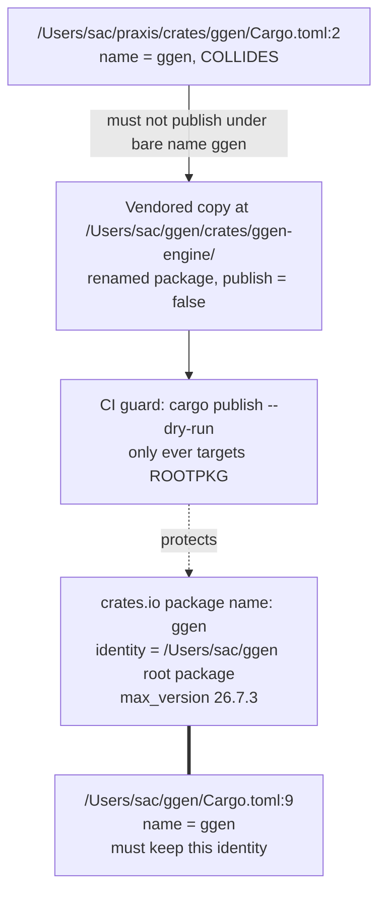

# Publish Safety and Crate Rename

Part of [00-OVERVIEW](00-OVERVIEW.md) — Phase 0, blocking everything else. Nothing in
[02](02-CROSS-REPO-DEPENDENCY-RISKS.md) through [11](11-DELETION-AND-DEFINITION-OF-DONE.md)
should land before this is resolved.

## File reference table

| Path | LOC | Relevant line(s) |
|---|---:|---|
| `/Users/sac/ggen/Cargo.toml` | — | `name = "ggen"` at line 9; `version.workspace = true` at line 10; `workspace.package.version = "26.7.4"` at line 2 |
| `/Users/sac/praxis/crates/ggen/Cargo.toml` | 122 | `name = "ggen"` at line 2 |
| `scripts/ci/guard-publish-target.sh` | — | new file, to be created under `/Users/sac/ggen/scripts/ci/` |

## Critical constraint: the published `ggen` crate must not break

`ggen` is live on crates.io (`max_version` **26.7.3**, confirmed via the crates.io API; the
local workspace is already ahead at **26.7.4** per `/Users/sac/ggen/Cargo.toml:2`,
unreleased). Any change that touches how the root package resolves, builds, or is published
must not disrupt that existing crates.io identity.

`/Users/sac/praxis/crates/ggen/Cargo.toml:2` declares `name = "ggen"` — a literal collision
with `/Users/sac/ggen/Cargo.toml:9`'s root package, same author, overlapping keyword space
(`code-generation`/`codegen`, `rdf`). Cargo crate identity is name-scoped, not path-scoped:
if the praxis crate were ever `cargo publish`-ed standalone under the bare name `ggen`, it
would land as a new version of the *existing, unrelated* published crate and silently
corrupt its version history. Neither Cargo.toml has a `publish = false` guard today
(confirmed via grep — no `publish` key present in either file).



## Resolving the collision — three options considered

- **(a) Git submodule of a renamed fork.** Requires maintaining a rebasing fork just for the
  rename. This repo has no `.gitmodules` (confirmed: `/Users/sac/ggen/.gitmodules` does not
  exist) and no submodule precedent to build on.
- **(b) Workspace-side path dependency with `package =` rename, no fork:**
  ```toml
  [dependencies]
  praxis-ggen-engine = { path = "../../../praxis/crates/ggen", package = "ggen" }
  ```
  This compiles for an **internal, unpublished** workspace member, but Cargo packages the
  *real* upstream name (`ggen`) into the manifest on `cargo publish`/`cargo package` — a live
  path-dependency-with-rename must never appear in anything that feeds the published root
  package, since publishing would either fail (path deps need a `version` to package at all)
  or ship a dependency requirement on crates.io package `ggen` pointing at itself.
- **(c) Vendor a physical copy** into `/Users/sac/ggen/crates/ggen-engine/` (proposed new
  crate directory; final name TBD in [03](03-RDF-ENGINE-BRIDGE-DESIGN.md)), with its own
  hand-written `Cargo.toml` (`name` changed from `ggen`, `publish = false` set explicitly),
  decoupled from any live path back to `/Users/sac/praxis`.

**Recommendation: (c).** It is the only option that structurally removes every live
dependency edge to a crate literally named `ggen` before anything is ever published,
matching this repo's fix-forward posture and its lack of existing submodule tooling. This
does not by itself resolve the sibling absolute-path problem
([02-CROSS-REPO-DEPENDENCY-RISKS](02-CROSS-REPO-DEPENDENCY-RISKS.md)) — the vendored copy's
own `Cargo.toml` still needs its `bcinr-*`/`wasm4pm-*` path dependencies rewritten or
vendored transitively.

## CI guard — publish target

New file: `/Users/sac/ggen/scripts/ci/guard-publish-target.sh`

```bash
#!/usr/bin/env bash
# scripts/ci/guard-publish-target.sh
set -euo pipefail
ALLOWED_PACKAGE="ggen"

cargo publish --dry-run --package "$ALLOWED_PACKAGE" || {
  echo "FAIL: dry-run publish of '$ALLOWED_PACKAGE' itself failed." >&2
  exit 1
}

status=0
for manifest in crates/*/Cargo.toml; do
  name=$(grep -m1 '^name *= *"' "$manifest" | sed -E 's/name *= *"([^"]+)"/\1/')
  if [ "$name" = "$ALLOWED_PACKAGE" ]; then
    echo "ERROR: $manifest declares name = \"$ALLOWED_PACKAGE\" -- collides with the root package." >&2
    status=1
  elif ! grep -q '^publish *= *false' "$manifest"; then
    echo "ERROR: $manifest (package '$name') has no 'publish = false' and is not the allowed target." >&2
    status=1
  fi
done
exit $status
```

Add to `/Users/sac/ggen/justfile`:

```just
guard-publish-target:
    ./scripts/ci/guard-publish-target.sh
```

## Definition of done for this ticket

- Praxis crate vendored to `/Users/sac/ggen/crates/ggen-engine/` (or the final name chosen
  in [03](03-RDF-ENGINE-BRIDGE-DESIGN.md)) under a non-colliding package name, `publish =
  false` set explicitly in its `Cargo.toml`.
- `/Users/sac/ggen/scripts/ci/guard-publish-target.sh` created, executable, wired into CI
  (or a `just` pre-commit hook in `/Users/sac/ggen/justfile`).
- `cargo publish --dry-run --package ggen` (the real root package at
  `/Users/sac/ggen/Cargo.toml:9`) still succeeds.
