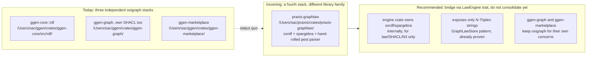
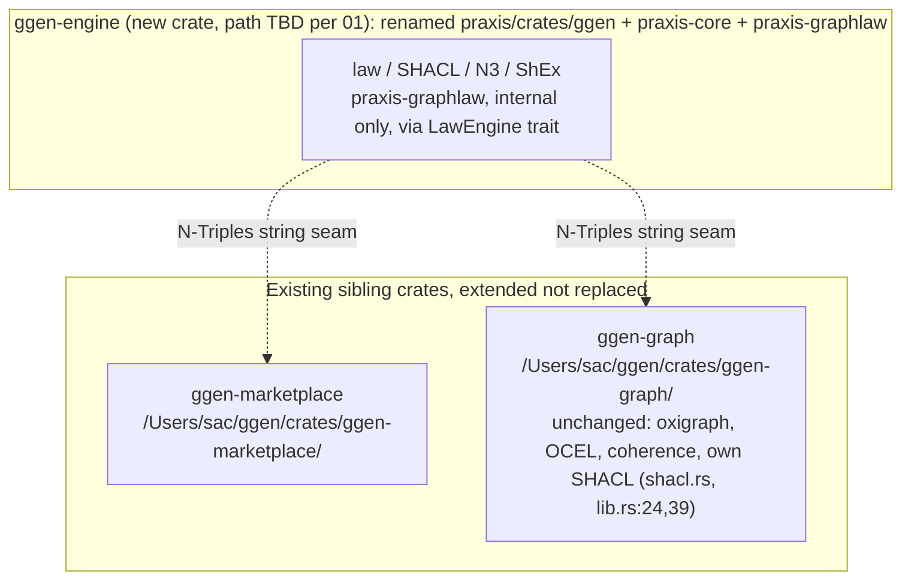

# RDF Engine Bridge Design

Part of [00-OVERVIEW](00-OVERVIEW.md) — Phase 1–2, depends on
[01-PUBLISH-SAFETY-AND-CRATE-RENAME](01-PUBLISH-SAFETY-AND-CRATE-RENAME.md). This is the
single biggest architectural question in the whole migration.

## File reference table

| Path | LOC | Relevant lines |
|---|---:|---|
| `/Users/sac/ggen/crates/ggen-core/src/rdf/` | — | one of three existing oxigraph stacks (see below) |
| `/Users/sac/ggen/crates/ggen-graph/src/lib.rs` | 149 | `pub mod shacl;` at line 24; `pub use shacl::{validate_shacl, ShaclSeverity, ShaclViolation};` at line 39 |
| `/Users/sac/ggen/crates/ggen-marketplace/src/lib.rs` | 17 | one of three existing oxigraph stacks |
| `/Users/sac/praxis/crates/ggen/src/graph.rs` | 1,016 | `GraphEngine` trait 166-234; doc comment 346-353; `GraphLawStore` struct 354-357; `mirror_ntriples` 396-399; `materialize()` 447-~493; "canonical door" comment 470-472; `insert_turtle` call at 477 |

## The problem

This repo already has **three independent oxigraph-based RDF stacks**:

| Stack | Path |
|---|---|
| `ggen-core::rdf` | `/Users/sac/ggen/crates/ggen-core/src/rdf/` |
| `ggen-graph` | `/Users/sac/ggen/crates/ggen-graph/` |
| `ggen-marketplace` | `/Users/sac/ggen/crates/ggen-marketplace/` |

Adopting `praxis-graphlaw` (`/Users/sac/praxis/crates/praxis-graphlaw/`) adds a **fourth,
built on an entirely different library family** (`oxrdf`/`spargebra` + a hand-rolled
`pest`-based parser, not oxigraph).



**Recommendation: bridge via a concrete `LawEngine` trait, don't consolidate**, within this
ticket's scope. Full consolidation of all four stacks is a separate, larger follow-up (see
[12-OPEN-QUESTIONS](12-OPEN-QUESTIONS.md), item 1).

## RDF bridge seam — concrete interface, not just a pattern reference

`/Users/sac/praxis/crates/ggen/src/graph.rs`'s `GraphLawStore` already implements the exact
bridge pattern needed. Its `GraphEngine` trait (lines 166-234) is engine-neutral — every
method takes/returns only `&str`/`String`/`Vec<String>`/`BTreeMap<String,String>`, never an
`oxrdf` or `oxigraph` model type. Per its own doc comment (lines 346-353): "model types
never cross the seam... facts flow between the two sides only as N-Triples strings."
`materialize()` (starts line 447, closes approximately line 491-493) builds a fresh oxrdf
`TripleStore` from the oxigraph mirror's N-Triples serialization (`mirror_ntriples()`, lines
396-399), runs the reasoner, and folds derived facts back via `insert_turtle` at line 477 —
"the one canonical door" (comment at lines 470-472).

Proposed seam for `ggen-graph`/`ggen-marketplace`, narrowed to law/SHACL/N3 only (the sync
pipeline's own graph load/SPARQL stays engine-internal, since the target design already gives
the engine that role):

```rust
/// Exposed by the engine crate. No oxrdf, no spargebra, no oxigraph model
/// type appears in this signature -- only plain strings.
pub trait LawEngine: Send + Sync {
    fn materialize(&self, facts_ntriples: &str, rules_n3: &str) -> Result<MaterializeOutcome>;
    fn validate_shacl(&self, facts_ntriples: &str, shapes_ttl: &str) -> Result<ShaclOutcome>;
    fn check_denials(&self, facts_ntriples: &str, rules_n3: &str) -> Result<Vec<String>>;
}
```

A caller in `ggen-graph`/`ggen-marketplace` gets back `MaterializeOutcome.derived:
Vec<String>` (N-Triples lines) and loads them into its *own* oxigraph `Store` — the same
fold-back-through-parse step `GraphLawStore::materialize` performs internally, just
performed by the consumer. This lets `ggen-graph` and `ggen-marketplace` keep their existing
oxigraph dependency untouched and never add `oxrdf`/`spargebra`.

Note: `/Users/sac/ggen/crates/ggen-graph/src/lib.rs` already has its own SHACL validation —
`pub mod shacl;` declared at line 24, re-exported (`validate_shacl`, `ShaclSeverity`,
`ShaclViolation`) at line 39 — independent of this bridge. The target design should be
explicit that `ggen-graph`'s own SHACL stays authoritative for its existing non-law use, and
`LawEngine::validate_shacl` is only for the μ-pipeline's law gate, so two SHACL validators
don't silently answer the same question differently.

## How this fits the target architecture



## Definition of done for this ticket

- `LawEngine` trait implemented on the new engine crate, backed internally by
  `/Users/sac/praxis/crates/praxis-graphlaw/`.
- At least one consumer (`/Users/sac/ggen/crates/ggen-graph/` or
  `/Users/sac/ggen/crates/ggen-marketplace/`) demonstrated calling
  `materialize`/`validate_shacl`/`check_denials` and folding the N-Triples result back into
  its own oxigraph store.
- No `oxrdf`/`spargebra` dependency added to `ggen-graph`'s or `ggen-marketplace`'s
  `Cargo.toml`.
- `ggen-graph/src/lib.rs:24,39`'s own `shacl` module documented as authoritative for its
  existing non-law callers.
