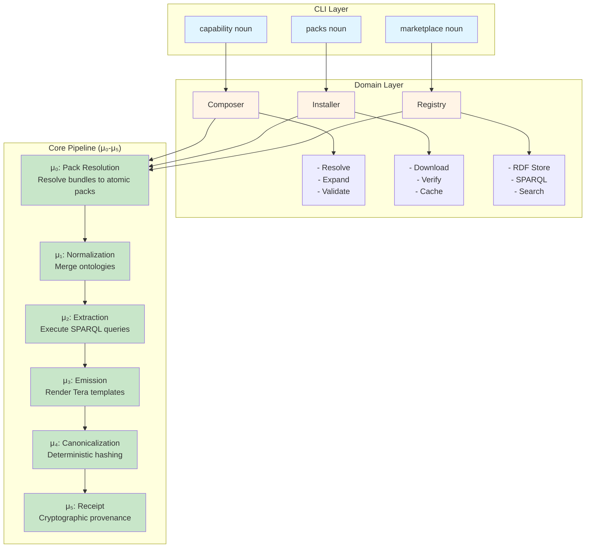

# Governed Marketplace Architecture

**Version:** 6.0.1
**Last Updated:** 2026-03-31
**Status:** Production

## Overview

The ggen marketplace is a **governed capability composition platform** implementing Fortune 5 CISO requirements for enterprise safety, determinism, provability, separation of authority, and operational governability.

### Core Principles

1. **Atomic Packs are Canonical** — All capability declarations expand to atomic packs deterministically
2. **Bundles are Only Aliases** — Ergonomic shortcuts that must expand before compile
3. **Ownership Maps Enforce Truth** — All emit targets and protocol fields must declare ownership
4. **Trust Tiers Bound Policy** — Enterprise, approved, quarantined, experimental, blocked
5. **Receipts Prove Everything** — Cryptographic signatures chain through composition

## Architecture Diagram



## Atomic Pack Taxonomy

### Pack Categories

Atomic packs are organized into **9 categories** reflecting their role in the composition:

| Category | Purpose | Examples |
|----------|---------|----------|
| **Surface** | Enterprise-visible interfaces | `surface-mcp`, `surface-a2a` |
| **Contract** | External API contracts | `contract-openapi`, `contract-graphql` |
| **Projection** | Implementation language | `projection-rust`, `projection-typescript` |
| **Runtime** | Deployment model | `runtime-stdio`, `runtime-axum` |
| **Policy** | Governance rules | `policy-no-defaults`, `policy-strict` |
| **Validator** | Quality gates | `validator-protocol-visible-values`, `validator-shacl` |
| **Receipt** | Proof formats | `receipt-enterprise-signed`, `receipt-chained` |
| **Consequence** | Migration behavior | `consequence-semver-migration`, `consequence-breaking-change` |
| **Core** | Foundation infrastructure | `core-ontology`, `core-hooks`, `core-receipts` |

### Atomic Pack ID Format

```
<category>-<name>

Examples:
- surface-mcp
- projection-rust
- runtime-axum
- policy-no-defaults
- core-ontology
```

### Foundation Packs

Six core packs own shared ontology and infrastructure:

```rust
core-ontology     // Base RDF vocabulary
core-hooks        // Lifecycle hooks
core-receipts     // Receipt formats
core-versioning   // Semver handling
core-validation   // Validation logic
core-policy       // Policy enforcement
```

**Rule:** No non-foundation pack may define core ontology terms.

## Bundle Expansion System

### Bundles as Ergonomic Aliases

Bundles are **deterministic aliases** that expand to atomic packs:

```toml
# ggen.toml
[packs]
mcp-rust = { version = "1.0" }  # Bundle

# Expands to:
# - surface-mcp
# - projection-rust
```

### Deterministic Expansion

All bundle expansion is **deterministic** and **visible before compile**:

```bash
$ ggen capability enable mcp --projection rust --runtime axum

Resolved capability:
  - surface-mcp
  - projection-rust
  - runtime-axum
  - core-ontology (foundation)
  - core-hooks (foundation)
  - core-receipts (foundation)

Profile: enterprise-strict
Lockfile: .ggen/packs.lock
```

### Predefined Bundles

| Bundle | Expands To | Runtime |
|--------|------------|---------|
| `mcp-rust` | `surface-mcp`, `projection-rust` | None (user must specify) |
| `mcp-rust-stdio` | `surface-mcp`, `projection-rust`, `runtime-stdio` | stdio |
| `mcp-rust-axum` | `surface-mcp`, `projection-rust`, `runtime-axum` | axum |
| `a2a-rust` | `surface-a2a`, `projection-rust` | None |
| `openapi-rust` | `contract-openapi`, `projection-rust` | None |

## Ownership Classes

### Ownership Declaration

Every pack must declare ownership for:

- **File paths** — Emitted artifacts (`src/main.rs`, `config.json`)
- **RDF namespaces** — Ontology terms (`http://example.com/schema#`)
- **Protocol fields** — API-visible fields (`api_version`, `request_id`)
- **Template variables** — Template bindings (`{{ package_name }}`)

### Ownership Classes

| Class | Behavior | Example |
|-------|----------|---------|
| **Exclusive** | Exactly one pack may own this target. Any overlap is a hard failure. | `src/main.rs` owned by `projection-rust` |
| **Mergeable** | Multiple packs may contribute with declared merge rules. | `config/` with `Concat` strategy |
| **Overlay** | Downstream refinement with explicit transfer policy. | `config/overrides.toml` |
| **ForbiddenOverlap** | Any overlap is a hard failure (default for undeclared). | Protocol field collisions |

### Conflict Detection

```bash
$ ggen packs conflicts

Conflicts detected:
  ✗ Exclusive overlap: src/main.rs
    Owned by: projection-rust, projection-typescript
    Resolution: Remove one projection or declare mergeable

  ✗ Incompatible merge strategies: config/routes.toml
    projection-rust wants: Concat
    surface-mcp wants: LastWriterWins
    Resolution: Align merge strategies or use exclusive ownership
```

## Trust Tiers and Registry Classes

### Trust Tiers

| Tier | Production | Regulated | Description |
|------|------------|-----------|-------------|
| **EnterpriseCertified** | ✅ | ✅ | Full audit, signed, approved |
| **EnterpriseApproved** | ✅ | ❌ | Reviewed, allowlisted |
| **Quarantined** | ❌ | ❌ | Restricted use, monitoring |
| **Experimental** | ❌ | ❌ | Dev/testing only |
| **Blocked** | ❌ | ❌ | Forbidden by policy |

### Registry Classes

| Class | Signature Required | Unlisted Allowed | Description |
|-------|-------------------|-------------------|-------------|
| **Public** | ❌ | ✅ | crates.io, npm, public registries |
| **PrivateEnterprise** | Configurable | Configurable | Internal registry with policies |
| **MirroredAirGapped** | ✅ | ❌ | Air-gapped mirror for regulated |

### Trust Verification

```bash
$ ggen packs install surface-mcp

Trust verification:
  Pack: surface-mcp
  Registry: PrivateEnterprise (registry.internal.com)
  Signature: ✅ Verified (Ed25519)
  Digest: ✅ SHA256 matches
  Trust Tier: EnterpriseCertified
  Policy: ✅ Allowed (enterprise-strict profile)
```

## Composition Receipts

### Receipt Structure

Every `ggen sync` generates a **composition receipt** proving:

```json
{
  "atomic_packs": ["surface-mcp", "projection-rust", "runtime-axum"],
  "bundle_expansions": [{
    "bundle_id": "mcp-rust-axum",
    "expanded_to": ["surface-mcp", "projection-rust", "runtime-axum"]
  }],
  "versions": {
    "surface-mcp": "1.2.3",
    "projection-rust": "2.1.0",
    "runtime-axum": "0.9.5"
  },
  "signatures": [
    {
      "pack_id": "surface-mcp",
      "signature": "ed25519:...",
      "key_id": "enterprise-signing-key-2024"
    }
  ],
  "ontology_fragments": [
    {
      "pack": "surface-mcp",
      "graph_hash": "sha256:..."
    }
  ],
  "queries_executed": [
    {
      "pack": "surface-mcp",
      "query": "SELECT ?tool WHERE { ?tool a mcp:Tool }",
      "result_count": 42
    }
  ],
  "templates_rendered": [
    {
      "pack": "projection-rust",
      "template": "src/main.rs.tera",
      "output": "src/main.rs"
    }
  ],
  "validators_applied": [
    {
      "validator": "validator-protocol-visible-values",
      "result": "pass"
    }
  ],
  "policies_enforced": [
    {
      "policy": "policy-no-defaults",
      "result": "pass"
    }
  ],
  "conflicts": [
    {
      "dimension": "EmittedFilePath",
      "pack_a": "projection-rust",
      "pack_b": "projection-typescript",
      "resolution": "PreferFirst"
    }
  ],
  "artifact_hashes": {
    "src/main.rs": "sha256:...",
    "Cargo.toml": "sha256:..."
  },
  "runtime_context": {
    "profile": "enterprise-strict",
    "trust_requirement": "EnterpriseCertified"
  },
  "receipt_chain": [
    {
      "epoch": "2024-03-31T12:00:00Z",
      "hash": "sha256:...",
      "parent_hash": null
    }
  ]
}
```

### Receipt Verification

```bash
$ ggen sync --audit

Receipt verification:
  ✅ All pack signatures valid (Ed25519)
  ✅ All pack digests match (SHA256)
  ✅ Bundle expansion deterministic
  ✅ No undeclared conflicts
  ✅ All policies enforced
  ✅ All validators passed
  ✅ Receipt chain intact (3 epochs)

Build receipt: .ggen/latest.json
```

## Pipeline Integration

### μ₀ Stage: Pack Resolution

New pipeline stage **before** μ₁:

```rust
pub struct PackResolver {
    registry: Arc<RdfRegistry>,
    lockfile: Lockfile,
}

impl PackResolver {
    pub async fn resolve_packs(&self) -> Result<ResolvedPacks> {
        // 1. Read lockfile
        let requested = self.lockfile.read()?;

        // 2. Expand bundles to atomic packs
        let atomic_packs = self.expand_bundles(&requested)?;

        // 3. Resolve dependencies
        let resolved = self.resolve_dependencies(&atomic_packs).await?;

        // 4. Check compatibility (multi-dimensional)
        self.check_compatibility(&resolved)?;

        // 5. Merge pack ontologies into project graph
        let merged_ontology = self.merge_ontologies(&resolved).await?;

        // 6. Detect conflicts (ownership map)
        let ownership_map = self.build_ownership_map(&resolved)?;

        Ok(ResolvedPacks {
            atomic_packs: resolved,
            merged_ontology,
            ownership_map,
        })
    }
}
```

### Pack Templates in μ₂/μ₃

Packs contribute:

- **SPARQL queries** (μ₂) — Extract data from merged ontology
- **Tera templates** (μ₃) — Render emitted files

```toml
# pack: surface-mcp/package.toml
[templates]
"src/mcp/server.rs" = "templates/server.rs.tera"
"src/mcp/tools.rs" = "templates/tools.rs.tera"

[queries]
tools = "queries/sparql/tools.rq"
```

### Pack Provenance in μ₅

Build receipts track pack contributions:

```json
{
  "packs": [
    {
      "pack_id": "surface-mcp",
      "version": "1.2.3",
      "signature": "ed25519:...",
      "digest": "sha256:...",
      "templates_contributed": ["src/mcp/server.rs", "src/mcp/tools.rs"],
      "queries_contributed": ["tools"],
      "files_generated": ["src/mcp/server.rs", "src/mcp/tools.rs", "src/mcp/mod.rs"]
    }
  ]
}
```

## Security Model

See [SECURITY_MODEL.md](SECURITY_MODEL.md) for complete details on:

- Ed25519 signing via `ggen-receipt`
- Trust tier enforcement
- Ownership map conflict detection
- Policy enforcement as packs
- Registry source validation

## Data Flow

```mermaid
flowchart LR
    UI["User Intent<br/>(ggen.toml)"]
    BE["Bundle Expansion<br/>(deterministic)"]
    PR["Pack Resolution<br/>(μ₀ stage)"]
    CM["Compatibility Check<br/>(multi-dimensional)"]
    PC["Policy Check<br/>(profile enforcement)"]
    OM["Ontology Merge<br/>(foundation + packs)"]
    QE["Query Execution<br/>(SPARQL)"]
    TR["Template Render<br/>(Tera)"]
    RE["Receipt Emit<br/>(cryptographic proof)"]

    UI --> BE --> PR --> CM --> PC --> OM --> QE --> TR --> RE

    style UI fill:#e1f5ff
    style BE fill:#fff4e6
    style PR fill:#fff4e6
    style CM fill:#fff4e6
    style PC fill:#c8e6c9
    style OM fill:#fff4e6
    style QE fill:#fff4e6
    style TR fill:#fff4e6
    style RE fill:#fce4ec
```



## Key Files

| Component | File | Purpose |
|-----------|------|---------|
| **Atomic packs** | `crates/ggen-marketplace/src/atomic.rs` | Pack taxonomy |
| **Bundles** | `crates/ggen-marketplace/src/bundle.rs` | Ergonomic aliases |
| **Ownership** | `crates/ggen-marketplace/src/ownership.rs` | Conflict detection |
| **Trust** | `crates/ggen-marketplace/src/trust.rs` | Trust tiers |
| **Composition receipt** | `crates/ggen-marketplace/src/composition_receipt.rs` | Provenance |
| **Pack resolver** | `crates/ggen-core/src/pack_resolver.rs` | μ₀ stage |
| **CLI commands** | `crates/ggen-cli/src/cmds/capability.rs` | Capability-first UX |
| **CLI commands** | `crates/ggen-cli/src/cmds/packs.rs` | Pack management |

## Further Reading

- [ATOMIC_PACKS.md](ATOMIC_PACKS.md) — Atomic pack reference
- [BUNDLES_AND_PROFILES.md](BUNDLES_AND_PROFILES.md) — Bundles and profiles
- [CLI_REFERENCE.md](CLI_REFERENCE.md) — Command-line reference
- [PIPELINE_INTEGRATION.md](PIPELINE_INTEGRATION.md) — Pipeline integration details
- [SECURITY_MODEL.md](SECURITY_MODEL.md) — Security and trust model
