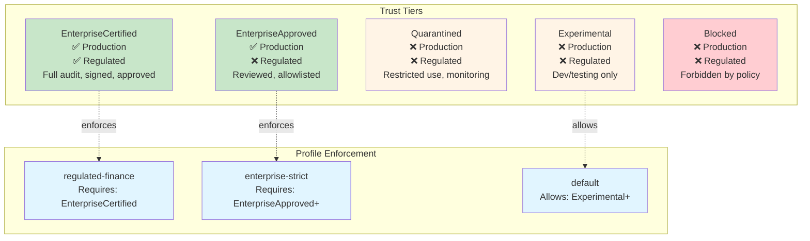
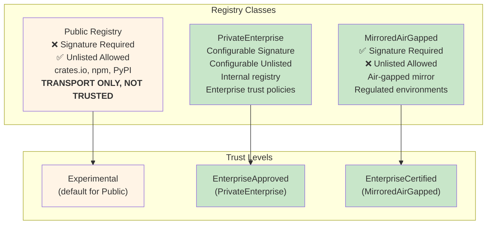

# Security Model

**Version:** 6.0.1
**Last Updated:** 2026-03-31
**Status:** Production

## Overview

The ggen marketplace implements a **cryptographically secure, governed trust model** meeting Fortune 5 CISO requirements for enterprise safety, determinism, provability, separation of authority, and operational governability.

### Core Security Principles

1. **Ed25519 Signatures** — All packs are signed with Ed25519 keys
2. **SHA-256 Digests** — All pack contents are hashed
3. **Trust Tiers** — Five-tier trust classification (EnterpriseCertified → Blocked)
4. **Registry Classes** — Three registry types (Public, PrivateEnterprise, MirroredAirGapped)
5. **Ownership Maps** — All targets must declare ownership (Exclusive, Mergeable, Overlay, ForbiddenOverlap)
6. **Policy Enforcement** — Policies as packs, enforced at install/sync time
7. **Receipt Chains** — Hash-linked receipts prove reproducibility

## Ed25519 Signing

### Key Generation Flow

```mermaid
sequenceDiagram
    participant User as Pack Author
    participant GR as ggen-receipt
    participant Store as Keystore

    User->>GR: generate_keypair()
    GR->>Store: Generate Ed25519 keypair
    Store-->>GR: (public_key, secret_key)
    GR-->>User: Keypair generated

    User->>GR: hash_data(pack_contents)
    GR-->>User: pack_hash (SHA-256)

    User->>GR: sign(pack_hash, secret_key)
    GR-->>User: signature (Ed25519)

    User->>GR: verify(pack_hash, signature, public_key)
    GR-->>User: verified (true/false)

    style User fill:#e1f5ff
    style GR fill:#fff4e6
    style Store fill:#fce4ec
```

Packs are signed with Ed25519 keys via `ggen-receipt`:

```rust
use ggen_receipt::{generate_keypair, sign, hash_data};

// Generate signing keypair
let (public_key, secret_key) = generate_keypair()?;

// Hash pack contents
let pack_hash = hash_data(&pack_contents)?;

// Sign hash
let signature = sign(&pack_hash, &secret_key)?;

// Verify signature
let verified = ggen_receipt::verify(&pack_hash, &signature, &public_key)?;
```

### Pack Signature Format

```toml
# marketplace/packages/surface-mcp/package.toml
[package]
name = "surface-mcp"
version = "1.2.3"

[security]
signature = "ed25519:3a4b5c6d7e8f..."
signing_key = "enterprise-signing-key-2024"
digest = "sha256:1a2b3c4d5e6f..."

[[security.signers]]
key_id = "enterprise-signing-key-2024"
public_key = "ed25519:1a2b3c4d..."
valid_from = "2024-01-01T00:00:00Z"
valid_until = "2025-01-01T00:00:00Z"
```

### Signature Verification

Signatures are verified at **install time** and **sync time**:

```bash
$ ggen packs install surface-mcp

Installing: surface-mcp
  Version: 1.2.3
  Downloading: 100% |████████████████████| 42 KiB

  Signature verification:
    Public key: enterprise-signing-key-2024
    Signature: ed25519:3a4b5c6d7e8f...
    Digest: sha256:1a2b3c4d5e6f...
    ✅ Signature valid
    ✅ Digest matches
    ✅ Key valid (2024-01-01 to 2025-01-01)

  Cache: ~/.cache/ggen/packs/surface-mcp/
  Lockfile: .ggen/packs.lock
```

```bash
$ ggen sync --audit

Signature verification:
  surface-mcp (v1.2.3)
    ✅ Signature: ed25519:3a4b5c6d7e8f...
    ✅ Digest: sha256:1a2b3c4d5e6f...
    ✅ Key: enterprise-signing-key-2024
    ✅ Key validity: 2024-01-01 to 2025-01-01

  projection-rust (v2.1.0)
    ✅ Signature: ed25519:7e8f9a0b1c2d...
    ✅ Digest: sha256:3e4f5a6b7c8d...
    ✅ Key: enterprise-signing-key-2024
    ✅ Key validity: 2024-01-01 to 2025-01-01

  All signatures verified ✅
```

### Key Rotation

Keys have validity periods for rotation:

```bash
# Check key expiry
$ ggen packs trust --check-expiry

Key expiry check:
  enterprise-signing-key-2024
    Expires: 2025-01-01T00:00:00Z
    Status: ⚠️ Expires in 276 days

  Rotation recommended: 2024-12-01
```

## Trust Tiers

### Five-Tier Model



| Tier | Production | Regulated | Description |
|------|------------|-----------|-------------|
| **EnterpriseCertified** | ✅ | ✅ | Full audit, signed, approved for enterprise production |
| **EnterpriseApproved** | ✅ | ❌ | Reviewed, allowlisted for enterprise use |
| **Quarantined** | ❌ | ❌ | Restricted use, under monitoring, not yet fully approved |
| **Experimental** | ❌ | ❌ | Development/testing only, not for production |
| **Blocked** | ❌ | ❌ | Forbidden by policy, blocked from installation |

### Tier Assignment

Packs are assigned trust tiers at **registration time**:

```toml
# marketplace/packages/surface-mcp/package.toml
[trust]
tier = "EnterpriseCertified"
approved_date = "2024-01-15"
auditor = "enterprise-security-team"
audit_report = "https://audit.internal.com/surface-mcp-2024-01"
next_audit = "2025-01-15"
```

### Tier Enforcement

Profiles enforce minimum trust tiers:

```bash
# Regulated finance profile requires EnterpriseCertified
$ ggen packs install experimental-pack --profile regulated-finance

Profile error: regulated-finance
  Trust tier violation:
    experimental-pack is Experimental
    Required: EnterpriseCertified

  Resolution:
    - Use EnterpriseCertified pack
    - Change profile to allow Experimental tier
```

### Tier Promotion

Packs can be promoted through tiers:

```bash
# Request tier promotion
$ ggen packs request-promotion surface-mcp --to EnterpriseCertified

Promotion request: surface-mcp
  Current tier: EnterpriseApproved
  Requested tier: EnterpriseCertified
  Requirements:
    - Full security audit ✅
    - Penetration testing ✅
    - Code review ✅
    - Documentation ✅
    - Signed receipts ✅
    - Chained receipts (min 3 epochs) ✅

  Submit request to: enterprise-security-team@internal.com
  Expected review time: 5-10 business days
```

## Registry Classes

### Three Registry Types



| Class | Signature Required | Unlisted Allowed | Description |
|-------|-------------------|------------------|-------------|
| **Public** | ❌ | ✅ | Public registries (crates.io, npm, PyPI) — **transport only, not trusted** |
| **PrivateEnterprise** | Configurable | Configurable | Internal registry with enterprise trust policies |
| **MirroredAirGapped** | ✅ | ❌ | Air-gapped mirror for regulated environments |

### Public Registries (Transport Only)

**CISO requirement:** Cargo is transport, not trust. Public registries are **not trusted by default**.

```bash
# Install from public registry (default profile allows Experimental)
$ ggen packs install surface-mcp --registry https://crates.io

Warning: Public registry (crates.io)
  Trust tier: Experimental (default for public)
  Signature verification: ⚠️ Not required
  Digest verification: ✅ Required

  This pack is NOT trusted for production use.
  Use --profile enterprise-strict to enforce trust requirements.
```

### Private Enterprise Registry

Internal registry with configurable trust policies:

```toml
# registry configuration
[registry]
url = "https://registry.internal.com"
class = "PrivateEnterprise"
require_signature = true
allow_unlisted = false
signing_keys = [
    "enterprise-signing-key-2024",
    "team-signing-key-2024"
]
```

```bash
# Install from private enterprise registry
$ ggen packs install surface-mcp --registry https://registry.internal.com \
    --profile enterprise-strict

Installing: surface-mcp
  Registry: PrivateEnterprise (registry.internal.com)
  Signature: ✅ Required and verified
  Signing key: enterprise-signing-key-2024
  Trust tier: EnterpriseApproved
  Profile: enterprise-strict
    ✅ Meets trust tier requirement (EnterpriseApproved+)
    ✅ Signature verified
    ✅ Registry allowed

Install successful.
```

### Mirrored Air-Gapped Registry

For regulated environments with no internet access:

```toml
# registry configuration
[registry]
url = "https://registry.internal.com"
class = "MirroredAirGapped"
mirror_path = "/mnt/airgap/registry"
sync_interval_seconds = 86400  # Daily sync
require_signature = true
allow_unlisted = false
```

```bash
# Install from air-gapped mirror
$ ggen packs install surface-mcp --registry /mnt/airgap/registry \
    --profile regulated-finance

Installing: surface-mcp
  Registry: MirroredAirGapped (/mnt/airgap/registry)
  Mirror status: ✅ Synced 2024-03-31T00:00:00Z
  Signature: ✅ Required and verified
  Signing key: enterprise-signing-key-2024
  Trust tier: EnterpriseCertified
  Profile: regulated-finance
    ✅ Meets trust tier requirement (EnterpriseCertified)
    ✅ Signature verified
    ✅ Registry allowed (air-gapped)

Install successful.
```

## Ownership Maps

### Ownership Declaration

Every pack must declare ownership for:

- **File paths** — Emitted artifacts
- **RDF namespaces** — Ontology terms
- **Protocol fields** — API-visible fields
- **Template variables** — Template bindings

```toml
# marketplace/packages/surface-mcp/package.toml
[ownership.files]
"src/mcp/" = { class = "Exclusive", owner = "surface-mcp" }
"src/mcp/server.rs" = { class = "Exclusive", owner = "surface-mcp" }
"src/mcp/tools.rs" = { class = "Exclusive", owner = "surface-mcp" }

[ownership.namespaces]
"http://ggen.dev/mcp#" = { class = "Exclusive", owner = "surface-mcp" }

[ownership.fields]
"mcp_version" = { class = "Exclusive", owner = "surface-mcp" }
"tool_id" = { class = "Exclusive", owner = "surface-mcp" }
```

### Ownership Classes

| Class | Behavior | Example |
|-------|----------|---------|
| **Exclusive** | Exactly one pack may own this target. Any overlap is a hard failure. | `src/main.rs` owned by `projection-rust` |
| **Mergeable** | Multiple packs may contribute with declared merge rules. | `config/routes.toml` with `Concat` strategy |
| **Overlay** | Downstream refinement with explicit transfer policy. | `config/overrides.toml` |
| **ForbiddenOverlap** | Any overlap is a hard failure (default for undeclared). | Protocol field collisions |

### Conflict Detection

```bash
$ ggen packs conflicts

Conflicts detected:
  ✗ Exclusive overlap: src/main.rs
    Owned by: projection-rust, projection-typescript
    Severity: Error
    Resolution: Remove one projection or declare mergeable

  ✗ Incompatible merge strategies: config/routes.toml
    projection-rust wants: Concat
    surface-mcp wants: LastWriterWins
    Severity: Error
    Resolution: Align merge strategies or use exclusive ownership

  ⚠ Undeclared target: src/config.rs
    No ownership declaration found
    Severity: Warning
    Resolution: Add ownership declaration or mark as ForbiddenOverlap
```

### Merge Strategies

```toml
# Mergeable ownership with merge strategy
[ownership.files]
"config/routes.toml" = {
    class = "Mergeable",
    owners = ["projection-rust", "surface-mcp"],
    merge_strategy = "Concat"
}
```

Available strategies:
- **Concat** — Concatenate arrays/sequences
- **LastWriterWins** — Later packs override earlier
- **FirstWriterWins** — Earlier packs take precedence
- **Recursive** — Merge objects/structs recursively
- **CustomSparql** — Custom merge logic with SPARQL query
- **FailOnConflict** — Fail if conflict detected

## Policy Enforcement

### Policy Packs

Policies are implemented as packs:

```toml
# marketplace/packages/policy-no-defaults/package.toml
[package]
name = "policy-no-defaults"
version = "1.0.0"
category = "Policy"

[policy]
rules = [
    "ForbidTemplateDefaults",
    "ForbidInferredCapabilities",
]

[enforcement]
check = "pre-install"
fail_on_violation = true
```

### Policy Rules

```rust
#[derive(Debug, Clone)]
pub enum PolicyRule {
    ForbidTemplateDefaults,
    ForbidInferredCapabilities,
    RequireSignedReceipts,
    RequireApprovedRuntime(Vec<RuntimeType>),
    ForbidPublicRegistryInRegulated,
    RequireTrustTier(TrustTier),
    RequireOwnershipClass(OwnershipClass),
    RequireExplicitRuntime,
    Custom { rule: String, check: String },
}
```

### Policy Enforcement

```bash
$ ggen packs install surface-mcp --profile regulated-finance

Policy enforcement: regulated-finance
  Checking policies: 4

  ✅ policy-no-defaults
     ForbidTemplateDefaults: ✅ No defaults found
     ForbidInferredCapabilities: ✅ All capabilities explicit

  ✅ policy-strict
     StrictValidation: ✅ All validations passed

  ✅ receipt-enterprise-signed
     RequireSignedReceipts: ✅ All receipts signed

  ✅ validator-shacl
     SHACLValidation: ✅ All shapes valid

  All policies enforced ✅

Install successful.
```

## Receipt Chains

### Hash-Linked Receipts

Every `ggen sync` generates a receipt linked to the previous epoch:

```json
{
  "epoch": "2024-03-31T12:00:00Z",
  "hash": "sha256:3a4b5c6d...",
  "parent_hash": "sha256:1a2b3c4d...",
  "packs": [
    {
      "pack_id": "surface-mcp",
      "version": "1.2.3",
      "signature": "ed25519:..."
    }
  ]
}
```

### Chain Verification

```bash
$ ggen sync --audit

Receipt chain verification:
  Epoch 3 (2024-03-31T12:00:00Z)
    Hash: sha256:3a4b5c6d...
    Parent: sha256:1a2b3c4d...
    ✅ Hash matches
    ✅ Parent hash valid

  Epoch 2 (2024-03-30T12:00:00Z)
    Hash: sha256:1a2b3c4d...
    Parent: sha256:9e8f7a6b...
    ✅ Hash matches
    ✅ Parent hash valid

  Epoch 1 (2024-03-29T12:00:00Z)
    Hash: sha256:9e8f7a6b...
    Parent: null (genesis)
    ✅ Hash matches

  Chain integrity: ✅ Valid (3 epochs)
```

## Security Best Practices

### For Users

1. **Use profiles** — Always specify a profile (`--profile enterprise-strict`)
2. **Verify signatures** — Check that packs are signed (`ggen packs trust`)
3. **Check conflicts** — Run `ggen packs conflicts` before sync
4. **Audit receipts** — Review `.ggen/latest.json` after sync
5. **Use air-gapped registries** — For regulated environments

### For Pack Authors

1. **Sign all releases** — Use Ed25519 keys (`ggen-receipt`)
2. **Declare ownership** — All files, namespaces, fields must be owned
3. **Test conflicts** — Run `ggen packs conflicts` before publishing
4. **Document policies** — Specify required policies in `package.toml`
5. **Use foundation packs** — Don't duplicate core ontology

### For Administrators

1. **Run private registry** — Use `PrivateEnterprise` or `MirroredAirGapped` registries
2. **Enforce profiles** — Require `enterprise-strict` or `regulated-finance`
3. **Rotate keys** — Review and rotate signing keys annually
4. **Audit packs** — Regular security audits for EnterpriseCertified packs
5. **Monitor chain** — Verify receipt chain integrity

## Threat Model

### Threats Mitigated

| Threat | Mitigation |
|--------|------------|
| **Pack tampering** | Ed25519 signatures, SHA-256 digests |
| **Undetected conflicts** | Ownership maps, multi-dimensional compatibility checks |
| **Supply chain attack** | Trust tiers, registry classes, profile enforcement |
| **Default inference** | `policy-no-defaults` forbids all inferred capabilities |
| **Runtime ambiguity** | Profiles require explicit runtime or bundle-provided runtime |
| **Signature fraud** | Key validity periods, regular rotation |
| **Registry compromise** | Air-gapped mirrors, private registries |
| **Reproducibility failure** | Receipt chains, deterministic bundle expansion |
| **Policy bypass** | Policies as packs, enforced at install/sync time |

### Assumptions

- **Signing keys are secure** — Private keys are stored securely (HSM, KMS)
- **Hash algorithm is secure** — SHA-256 is collision-resistant
- **Signature algorithm is secure** — Ed25519 is cryptographically secure
- **Registry is trusted** — PrivateEnterprise/MirroredAirGapped registries are operated by trusted parties
- **Profile is enforced** — Users cannot bypass profile requirements
- **Lockfile is intact** — Lockfile digest/signature is verified

## Further Reading

- [ARCHITECTURE.md](ARCHITECTURE.md) — System architecture
- [ATOMIC_PACKS.md](ATOMIC_PACKS.md) — Atomic pack reference
- [BUNDLES_AND_PROFILES.md](BUNDLES_AND_PROFILES.md) — Bundles and profiles
- [CLI_REFERENCE.md](CLI_REFERENCE.md) — Command-line reference
