<!-- START doctoc generated TOC please keep comment here to allow auto update -->
<!-- DON'T EDIT THIS SECTION, INSTEAD RE-RUN doctoc TO UPDATE -->
**Table of Contents**

- [Billing Contract](#billing-contract)
  - [Philosophy](#philosophy)
  - [Billing Chain](#billing-chain)
    - [The Flow](#the-flow)
    - [Archival in GCS + Firestore](#archival-in-gcs--firestore)
  - [Usage Events](#usage-events)
    - [Event Types](#event-types)
      - [1. signal_processed](#1-signal_processed)
      - [2. action_attempted](#2-action_attempted)
      - [3. action_completed](#3-action_completed)
  - [Usage Submission to Marketplace](#usage-submission-to-marketplace)
    - [Submission Endpoint](#submission-endpoint)
    - [Submission Rate](#submission-rate)
    - [Deduplication](#deduplication)
  - [Usage Metering](#usage-metering)
    - [Daily Aggregation](#daily-aggregation)
    - [Monthly Aggregation](#monthly-aggregation)
  - [Invoice Generation](#invoice-generation)
    - [Invoice Structure](#invoice-structure)
    - [Invoice Distribution](#invoice-distribution)
  - [Fraud Prevention & Anomaly Detection](#fraud-prevention--anomaly-detection)
    - [Anomaly Quarantine Receipt](#anomaly-quarantine-receipt)
    - [Detection Heuristics](#detection-heuristics)
    - [Recovery Workflow](#recovery-workflow)
  - [Billing Audit Export](#billing-audit-export)
    - [Daily Export to GCS](#daily-export-to-gcs)
    - [Daily Summary](#daily-summary)
    - [Firestore Export](#firestore-export)
  - [Revenue Safety Guarantees](#revenue-safety-guarantees)
    - [Guarantee 1: No Unmetered Usage](#guarantee-1-no-unmetered-usage)
    - [Guarantee 2: No Invoice Disputes](#guarantee-2-no-invoice-disputes)
    - [Guarantee 3: Fraud Detection](#guarantee-3-fraud-detection)
    - [Guarantee 4: Dispute Resolution](#guarantee-4-dispute-resolution)
  - [Billing Reconciliation](#billing-reconciliation)
    - [Weekly Reconciliation](#weekly-reconciliation)
    - [Monthly Reconciliation](#monthly-reconciliation)
  - [Definition of Done](#definition-of-done)
  - [Receipt Contract](#receipt-contract)

<!-- END doctoc generated TOC please keep comment here to allow auto update -->

# Billing Contract

> *The revenue chain: entitlement → usage → invoice. Every penny has a receipt.*

---

## Philosophy

Billing is not "send an invoice"—it's a **cryptographically-auditable chain of evidence** linking:
1. Customer entitlement (activated SKU)
2. Usage events (controls evaluated, evidence generated)
3. Aggregated metrics (daily/monthly)
4. Invoices (generated by Marketplace)

**Rule**: No customer escapes without paying. No invoice goes unaudited. Every transaction is receipted.

---

## Billing Chain

### The Flow

```mermaid
graph LR
    A["TAI 2030<br/>Governor"] -->|"emit signals"| B["Usage Events<br/>(signals_processed)"]
    B -->|"submit via API"| C["Marketplace<br/>Usage API"]
    C -->|"aggregate daily"| D["Usage Meter<br/>(Google-managed)"]
    D -->|"aggregate monthly"| E["Invoice<br/>(auto-generated)"]
    E -->|"export to GCS"| F["Billing Audit<br/>(customer receipt)"]
    F -->|"verify"| G["Customer Review<br/>(cryptographic proof)"]
```



### Archival in GCS + Firestore

All billing evidence is exported to the customer's GCS bucket and Firestore for audit trail.

---

## Usage Events

### Event Types

ggen emits three types of usage signals:

#### 1. signal_processed

Emitted when a compliance control is evaluated:

```json
{
  "event_type": "signal_processed",
  "timestamp": "2026-01-25T14:32:15.123Z",
  "sku_id": "sku_ato_guard_pack",
  "account_id": "customer_frb_ny_001",
  "customer_id": "customer_frb_ny_001",
  "governor_id": "gov_frb_ny_ato_001",
  "signal_source": "ontology_query",
  "signal_id": "signal_ac2_user_provisioning_001",
  "signal_name": "AC-2 Account Management Control Evaluation",
  "control_id": "AC-2",
  "control_name": "Account Management",
  "assessment_result": "PASSING",
  "evidence_files_generated": 1,
  "query_time_ms": 42,
  "metadata": {
    "infrastructure_region": "us-gov-west-1",
    "project_id": "customer-frb-ny",
    "resource_count": 127
  }
}
```

**Billing Metric**: 1 `signal_processed` = 1 control evaluation billable unit.

#### 2. action_attempted

Emitted when ggen attempts to fix a failing control:

```json
{
  "event_type": "action_attempted",
  "timestamp": "2026-01-25T14:32:30.456Z",
  "sku_id": "sku_ato_guard_pack",
  "account_id": "customer_frb_ny_001",
  "governor_id": "gov_frb_ny_ato_001",
  "action_id": "action_cm3_remediate_001",
  "action_name": "Enable Cloud Build Approval Gates",
  "control_id": "CM-3",
  "control_name": "Change Control",
  "action_status": "ATTEMPTED",
  "affected_resources": ["projects/customer-frb-ny"],
  "metadata": {
    "remediation_plan": "automated",
    "human_approval_required": false
  }
}
```

**Billing Metric**: 1 `action_attempted` = 1 remediation action billable unit.

#### 3. action_completed

Emitted when a remediation action succeeds:

```json
{
  "event_type": "action_completed",
  "timestamp": "2026-01-25T14:33:00.789Z",
  "sku_id": "sku_ato_guard_pack",
  "account_id": "customer_frb_ny_001",
  "governor_id": "gov_frb_ny_ato_001",
  "action_id": "action_cm3_remediate_001",
  "action_name": "Enable Cloud Build Approval Gates",
  "control_id": "CM-3",
  "action_status": "SUCCESS",
  "result_evidence": {
    "approval_rule_created": true,
    "approval_rule_id": "rule_frb_ny_build_001",
    "deployment_count_before": 450,
    "deployment_count_after": 0,
    "deployments_blocked": 0
  },
  "action_cost_estimate_dollars": 0.50,
  "metadata": {
    "infrastructure_change": true,
    "requires_rollback": true
  }
}
```

**Billing Metric**: 1 `action_completed` = 1 successful remediation billable unit.

---

## Usage Submission to Marketplace

### Submission Endpoint

ggen submits usage events to Google Cloud Marketplace's Usage API:

```bash
POST https://serviceusage.googleapis.com/v1beta1/{parent}/events

Header:
  Authorization: Bearer <SERVICE_ACCOUNT_TOKEN>
  Content-Type: application/json

Body:
{
  "events": [
    {
      "event_id": "signal_ac2_user_provisioning_001",
      "event_time": "2026-01-25T14:32:15.123Z",
      "service_name": "ggen-service-catalog",
      "operation_name": "ggen.control.evaluation",
      "labels": {
        "sku": "sku_ato_guard_pack",
        "account_id": "customer_frb_ny_001",
        "control_id": "AC-2",
        "assessment_result": "PASSING"
      },
      "metric_values": {
        "ggen/control_evaluations": {
          "int64_value": 1
        },
        "ggen/evidence_files": {
          "int64_value": 1
        }
      }
    }
  ]
}
```

### Submission Rate

ggen batches usage events and submits in configurable intervals:

```toml
# Default: submit every 1 minute or 100 events, whichever comes first
[billing]
submission_interval_seconds = 60
batch_size = 100
max_batch_wait_seconds = 300  # Force submission after 5 minutes even if <100 events
```

### Deduplication

Events are deduplicated using `event_id`. If the same `event_id` is submitted twice:

```json
{
  "event_id": "signal_ac2_001",  // ← Same ID
  "event_time": "2026-01-25T14:32:15Z",
  "metric_values": { "ggen/control_evaluations": { "int64_value": 1 } }
}
```

Marketplace counts it **once**, not twice.

---

## Usage Metering

### Daily Aggregation

Google Marketplace aggregates usage daily:

```json
{
  "date": "2026-01-25",
  "sku_id": "sku_ato_guard_pack",
  "account_id": "customer_frb_ny_001",
  "metrics": {
    "ggen/control_evaluations": 150,
    "ggen/evidence_files": 150,
    "ggen/remediation_actions_attempted": 5,
    "ggen/remediation_actions_completed": 4
  },
  "estimated_charge": {
    "currency": "USD",
    "amount": 150.00
  }
}
```

### Monthly Aggregation

At month end, Marketplace generates a cumulative summary:

```json
{
  "month": "2026-01",
  "sku_id": "sku_ato_guard_pack",
  "account_id": "customer_frb_ny_001",
  "cumulative_metrics": {
    "ggen/control_evaluations": 4250,
    "ggen/evidence_files": 4250,
    "ggen/remediation_actions_attempted": 127,
    "ggen/remediation_actions_completed": 119
  },
  "total_charge": {
    "currency": "USD",
    "amount": 4250.00
  },
  "invoice_number": "ggen-frb-ny-2026-01"
}
```

---

## Invoice Generation

### Invoice Structure

GCP Marketplace auto-generates invoices on the customer's billing date:

```json
{
  "invoice_id": "ggen-frb-ny-2026-01",
  "invoice_date": "2026-02-01T00:00:00Z",
  "billing_period_start": "2026-01-01T00:00:00Z",
  "billing_period_end": "2026-01-31T23:59:59Z",
  "customer_name": "Federal Reserve Bank of New York",
  "customer_id": "customer_frb_ny_001",
  "line_items": [
    {
      "sku_id": "sku_ato_guard_pack",
      "sku_name": "ATO Guard Pack",
      "quantity": 4250,
      "unit": "control_evaluation",
      "unit_price": 1.00,
      "line_total": 4250.00
    }
  ],
  "subtotal": 4250.00,
  "tax": 425.00,
  "total": 4675.00,
  "payment_terms": "NET 30",
  "payment_due_date": "2026-03-02T23:59:59Z"
}
```

### Invoice Distribution

The invoice is:
1. **Sent to customer** via email (Marketplace default)
2. **Exported to customer GCS bucket** for archival
3. **Exported to customer Firestore** for audit queries

---

## Fraud Prevention & Anomaly Detection

### Anomaly Quarantine Receipt

If usage spikes abnormally, ggen emits a quarantine receipt:

```json
{
  "execution_id": "anomaly_quarantine_2026_01_25_001",
  "timestamp": "2026-01-25T14:32:15Z",
  "sku_id": "sku_ato_guard_pack",
  "account_id": "customer_frb_ny_001",
  "action": "USAGE_ANOMALY_DETECTED",
  "decision": "QUARANTINE",
  "reason": "Usage spike detected: 10x normal baseline",
  "baseline_metrics": {
    "daily_control_evaluations_avg": 150,
    "daily_control_evaluations_max": 200
  },
  "current_metrics": {
    "daily_control_evaluations_current": 2000,
    "spike_factor": 10.0
  },
  "quarantine_actions": {
    "stop_billing": true,
    "alert_customer_security": true,
    "alert_ggen_fraud_team": true,
    "investigation_ticket": "FRAUD-2026-01-25-001"
  },
  "metadata": {
    "traffic_source": "single_ip_address",
    "request_pattern": "sequential_repeated_queries",
    "estimated_fraudulent_charges": 1500.00
  }
}
```

### Detection Heuristics

1. **10x Spike**: Daily usage > 10× rolling 30-day average → Quarantine
2. **Rapid Escalation**: Usage doubles in <1 hour → Alert
3. **Unusual Pattern**: Same control evaluated 1000+ times/hour → Block
4. **Geographic Anomaly**: Requests from multiple countries in <1 minute → Alert

### Recovery Workflow

```
1. Quarantine receipt generated
2. Billing paused (no new charges)
3. Customer notified via email + Pub/Sub signal
4. Investigation ticket created for ggen fraud team
5. Customer can whitelist spike or accept quarantine
6. ggen team investigates (24-hour SLA)
7. Quarantine lifted OR charges reversed
```

---

## Billing Audit Export

### Daily Export to GCS

Every night, ggen exports usage receipts to the customer's GCS bucket:

```bash
# Export path: gs://customer-{customer_id}-audits/billing/{date}/

gs://customer-frb-ny-001-audits/billing/2026-01-25/
  ├── daily-summary.json
  ├── events/
  │   ├── signal_ac2_user_provisioning_001.json
  │   ├── signal_ac3_access_001.json
  │   ├── action_cm3_remediate_001.json
  │   └── ...
  ├── aggregated-metrics.json
  └── audit-trail.json
```

### Daily Summary

```json
{
  "date": "2026-01-25",
  "sku_id": "sku_ato_guard_pack",
  "account_id": "customer_frb_ny_001",
  "daily_metrics": {
    "control_evaluations": 150,
    "evidence_files_generated": 150,
    "remediation_actions_attempted": 5,
    "remediation_actions_completed": 4
  },
  "daily_charge": 150.00,
  "cumulative_month_charge": 3750.00,
  "anomalies_detected": 0,
  "billing_status": "NORMAL",
  "export_time": "2026-01-26T01:00:00Z"
}
```

### Firestore Export

Billing receipts are also available in Firestore:

```javascript
// Firestore path: customers/{customer_id}/billing-receipts/{date}/daily-summary
{
  "date": "2026-01-25",
  "sku_id": "sku_ato_guard_pack",
  "account_id": "customer_frb_ny_001",
  "metrics": {...},
  "charge": 150.00,
  "exported_at": "2026-01-26T01:00:00Z"
}
```

---

## Revenue Safety Guarantees

### Guarantee 1: No Unmetered Usage

Every usage event is:
1. **Numbered** (sequential event_id)
2. **Timestamped** (ISO 8601)
3. **Signed** (SHA256 of event content)
4. **Stored** (Firestore + GCS backup)

If an event is lost in transmission, Firestore audit trail proves it was generated.

### Guarantee 2: No Invoice Disputes

Every invoice is backed by:
1. **Audit trail** (all individual events)
2. **Daily summaries** (aggregated metrics)
3. **Monthly summary** (final charge)
4. **Cryptographic signatures** (proof of integrity)

Customer can replay the audit trail to verify the invoice.

### Guarantee 3: Fraud Detection

Anomalies are detected and quarantined within 60 seconds. No fraudulent charges escape.

### Guarantee 4: Dispute Resolution

If customer disputes a charge:
1. Retrieve event_id from invoice
2. Find event in Firestore audit trail
3. Verify event signature
4. Show customer proof of the event
5. Reverse charge if invalid event found

---

## Billing Reconciliation

### Weekly Reconciliation

Every Friday, run reconciliation:

```bash
# Count events in Firestore
firestore_events=$(gcloud firestore documents list \
  --collection-path=customers/customer_frb_ny_001/billing-receipts \
  --filter="timestamp >= '2026-01-20T00:00:00Z' AND timestamp < '2026-01-27T00:00:00Z'" \
  | wc -l)

# Count events submitted to Marketplace
marketplace_events=$(gcloud service-usage list \
  --service=serviceusage.googleapis.com \
  --filter="timestamp >= '2026-01-20' AND timestamp < '2026-01-27'" \
  | grep "ggen/control_evaluations" \
  | awk '{sum+=$NF} END {print sum}')

# Reconciliation
if [ "$firestore_events" -eq "$marketplace_events" ]; then
    echo "✓ RECONCILED: $firestore_events events"
else
    echo "✗ MISMATCH: Firestore=$firestore_events, Marketplace=$marketplace_events"
    # Investigate and resubmit missing events
fi
```

### Monthly Reconciliation

At month end:
1. Sum all daily charges
2. Compare to invoice total
3. Verify tax calculation
4. Send proof to customer

---

## Definition of Done

- [ ] Usage event schema for all 3 types: signal_processed, action_attempted, action_completed
- [ ] Each event includes: timestamp, sku_id, account_id, action, event_id
- [ ] Marketplace Usage API endpoint documented with request/response examples
- [ ] Event submission rate configured (interval, batch size, max wait)
- [ ] Deduplication strategy using event_id documented
- [ ] Daily aggregation metrics defined (what gets counted)
- [ ] Monthly aggregation metrics defined (cumulative)
- [ ] Invoice structure with line items, tax, payment terms
- [ ] Invoice distribution: email + GCS export + Firestore export
- [ ] Anomaly detection heuristics documented (10x spike, rapid escalation, etc.)
- [ ] Quarantine receipt schema with investigation ticket
- [ ] Recovery workflow: quarantine → investigation → resolution
- [ ] Daily GCS export path structure documented
- [ ] Daily summary JSON format defined
- [ ] Firestore billing-receipts collection structure defined
- [ ] Revenue safety guarantees documented (no unmetered usage, no disputes)
- [ ] Fraud detection implemented with 60-second response time
- [ ] Dispute resolution workflow documented (4-5 steps)
- [ ] Weekly reconciliation script provided
- [ ] Monthly reconciliation checklist
- [ ] All receipts include: timestamp, sku_id, account_id, action, decision
- [ ] Links to entitlement-contract.md and sku-catalog-structure.md

---

## Receipt Contract

Every billing operation generates a receipt:

```json
{
  "execution_id": "billing_op_2026_01_25_001",
  "timestamp": "2026-01-25T14:32:15.123Z",
  "sku_id": "sku_ato_guard_pack",
  "account_id": "customer_frb_ny_001",
  "action": "USAGE_EVENT_SUBMITTED|DAILY_METRICS_AGGREGATED|INVOICE_GENERATED|ANOMALY_DETECTED|RECONCILIATION_RUN",
  "decision": "ACCEPT|REJECT|PENDING|QUARANTINE",
  "metric_count": 4250,
  "charge_amount_dollars": 4250.00,
  "audit_path_gcs": "gs://customer-frb-ny-001-audits/billing/2026-01-25/",
  "audit_path_firestore": "customers/customer_frb_ny_001/billing-receipts/2026-01-25",
  "signature": "sha256:hash_of_receipt"
}
```

---

**Last Updated**: 2026-01-25 | **Version**: 1.0 | **Status**: Production
