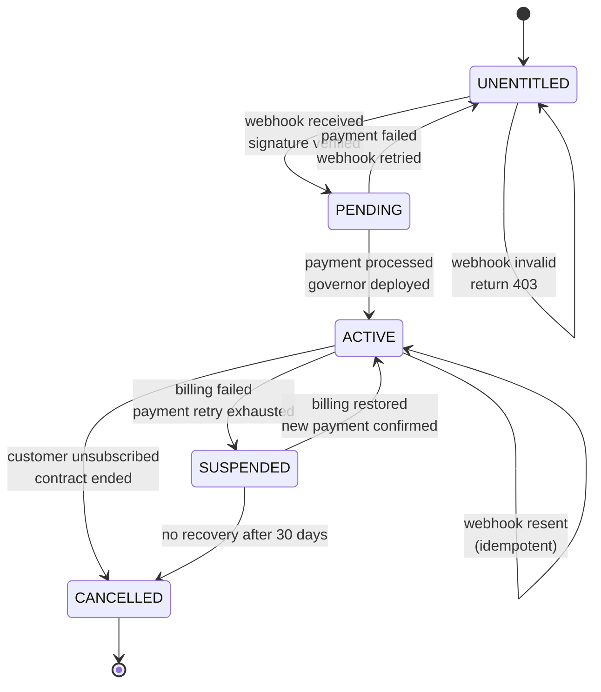

<!-- START doctoc generated TOC please keep comment here to allow auto update -->
<!-- DON'T EDIT THIS SECTION, INSTEAD RE-RUN doctoc TO UPDATE -->
**Table of Contents**

- [Entitlement Contract](#entitlement-contract)
  - [Philosophy](#philosophy)
  - [Webhook Structure](#webhook-structure)
    - [Entitlement Webhook Request](#entitlement-webhook-request)
    - [Webhook Headers](#webhook-headers)
  - [Webhook Verification](#webhook-verification)
    - [HMAC Signature Verification](#hmac-signature-verification)
    - [Verification Checklist](#verification-checklist)
  - [Entitlement FSM](#entitlement-fsm)
    - [State Diagram](#state-diagram)
    - [State Definitions](#state-definitions)
  - [Webhook Handlers](#webhook-handlers)
    - [Handler: ENTITLEMENT_ACTIVE](#handler-entitlement_active)
    - [Handler: ENTITLEMENT_CANCELLED](#handler-entitlement_cancelled)
  - [Idempotency](#idempotency)
    - [Guarantee](#guarantee)
    - [Implementation](#implementation)
  - [Failure Modes & Recovery](#failure-modes--recovery)
    - [Mode: Invalid Signature](#mode-invalid-signature)
    - [Mode: Unknown SKU](#mode-unknown-sku)
    - [Mode: Governor Deployment Failure](#mode-governor-deployment-failure)
    - [Mode: Duplicate Entitlement](#mode-duplicate-entitlement)
  - [Initialization Sequence](#initialization-sequence)
    - [1. Deploy Governor gen_statem Process](#1-deploy-governor-gen_statem-process)
    - [2. Create Tenant Registry Entry](#2-create-tenant-registry-entry)
    - [3. Allocate Pub/Sub Topic](#3-allocate-pubsub-topic)
    - [4. Create Firestore Collection](#4-create-firestore-collection)
    - [5. Emit entitlement_active Receipt](#5-emit-entitlement_active-receipt)
  - [Definition of Done](#definition-of-done)
  - [Receipt Contract](#receipt-contract)

<!-- END doctoc generated TOC please keep comment here to allow auto update -->

# Entitlement Contract

> *The webhook protocol that activates SKUs and the FSM that manages their lifecycle.*

---

## Philosophy

When a customer purchases a SKU on GCP Marketplace, Google sends an **entitlement webhook**. This document defines:
- The webhook structure and verification
- The FSM (Finite State Machine) that governs SKU lifetime
- How receipts prove state transitions
- Failure modes and recovery strategies

**Rule**: Every state transition is receipted. Every webhook is verified. Idempotency is guaranteed.

---

## Webhook Structure

### Entitlement Webhook Request

GCP Marketplace sends a POST to your webhook endpoint with this structure:

```json
{
  "name": "projects/ggen-vendor/locations/global/entitlements/entitlement-2026-01-25-abc123",
  "account": "accounts/1234567890",
  "service_account": "gcp-sa-gke-1234567890@gcp-gke-accounts.iam.gserviceaccount.com",
  "state": "ENTITLEMENT_ACTIVE",
  "product": "projects/ggen-vendor/catalogs/ggen-service-catalog/products/sku_ato_guard_pack",
  "create_time": "2026-01-25T14:30:00Z",
  "update_time": "2026-01-25T14:30:00Z",
  "contract": {
    "name": "projects/ggen-vendor/locations/global/contracts/contract-2026-01-25-xyz789",
    "start_time": "2026-01-25T14:30:00Z",
    "end_time": "2027-01-25T14:30:00Z",
    "auto_renew": true,
    "billing_plan": "ANNUAL"
  },
  "sku": "sku_ato_guard_pack",
  "customer_name": "Federal Reserve Bank of New York",
  "customer_id": "customer_frb_ny_001",
  "billing_account": "billing_acct_gcp_ny",
  "purchase_order": "PO-2026-001234",
  "entitlement_state": "ENTITLEMENT_ACTIVE"
}
```

### Webhook Headers

```http
POST /webhooks/marketplace/entitlement HTTP/1.1
Host: api.ggen.example.com
Content-Type: application/json
X-Goog-Signature: sha256=signature_here
X-Goog-Webhook-ID: webhook_id_12345
X-Goog-Webhook-Timestamp: 2026-01-25T14:30:00Z

{...webhook body...}
```

**Security**: Verify `X-Goog-Signature` using GCP Marketplace's public key (see [Webhook Verification](#webhook-verification)).

---

## Webhook Verification

### HMAC Signature Verification

```rust
// Pseudocode for signature verification
use hmac::{Hmac, Mac};
use sha2::Sha256;

fn verify_webhook_signature(
    payload: &[u8],
    signature_header: &str,
    gcp_public_key: &str,
) -> Result<bool, Error> {
    // 1. Extract signature from header
    let (algorithm, signature_b64) = signature_header.split_once('=')?;

    if algorithm != "sha256" {
        return Err("Unsupported algorithm".into());
    }

    let signature_bytes = base64::decode(signature_b64)?;

    // 2. Create HMAC with GCP's public key
    type HmacSha256 = Hmac<Sha256>;
    let mut mac = HmacSha256::new_from_slice(gcp_public_key.as_bytes())?;

    // 3. Compute HMAC over payload
    mac.update(payload);

    // 4. Compare with provided signature
    Ok(mac.verify_slice(&signature_bytes).is_ok())
}
```

### Verification Checklist

```javascript
// MANDATORY verification steps
function verify_entitlement_webhook(req) {
    const errors = [];

    // 1. Verify signature
    if (!verify_hmac_signature(req.body, req.headers['x-goog-signature'])) {
        errors.push("INVALID_SIGNATURE: Webhook signature verification failed");
        return { valid: false, errors };
    }

    // 2. Verify timestamp (prevent replay attacks)
    const webhook_time = new Date(req.headers['x-goog-webhook-timestamp']);
    const current_time = new Date();
    if (Math.abs(current_time - webhook_time) > 300000) { // 5 minute window
        errors.push("TIMESTAMP_INVALID: Webhook timestamp outside 5-minute window");
        return { valid: false, errors };
    }

    // 3. Verify required fields
    const required_fields = ['sku', 'account', 'state', 'customer_id', 'contract'];
    for (const field of required_fields) {
        if (!req.body[field]) {
            errors.push(`MISSING_FIELD: ${field}`);
        }
    }

    // 4. Verify SKU is known
    if (!SKU_REGISTRY[req.body.sku]) {
        errors.push(`UNKNOWN_SKU: ${req.body.sku}`);
        return { valid: false, errors };
    }

    return { valid: errors.length === 0, errors };
}
```

---

## Entitlement FSM

### State Diagram



### State Definitions

| State | Entry Condition | Exit Condition | Governor Status | Customer Access |
|-------|-----------------|----------------|-----------------|-----------------|
| **UNENTITLED** | Initial state | Valid webhook → PENDING | None | No access |
| **PENDING** | Webhook verified | Payment confirmed → ACTIVE | Creating | Read-only access |
| **ACTIVE** | Payment success | Billing failure OR unsubscribe | Running | Full access |
| **SUSPENDED** | Billing failure | Payment restored OR 30-day timeout | Paused | Read-only access |
| **CANCELLED** | Unsubscribe OR timeout | Final state | Deleted | No access |

---

## Webhook Handlers

### Handler: ENTITLEMENT_ACTIVE

When customer first activates the SKU:

```javascript
async function handle_entitlement_active(webhook) {
    const { sku, customer_id, account, contract } = webhook;

    // 1. Log receipt: webhook received
    const receipt_start = {
        timestamp: new Date().toISOString(),
        sku_id: sku,
        account_id: customer_id,
        action: "ENTITLEMENT_WEBHOOK_RECEIVED",
        webhook_id: webhook.name,
        state_transition: "UNENTITLED → PENDING"
    };

    // 2. Verify webhook signature
    if (!verify_signature(webhook)) {
        return {
            status: 403,
            error: "INVALID_SIGNATURE",
            receipt: {
                ...receipt_start,
                decision: "REJECT",
                reason: "Webhook signature verification failed"
            }
        };
    }

    // 3. Check for SKU configuration
    const sku_config = SKU_REGISTRY[sku];
    if (!sku_config) {
        return {
            status: 400,
            error: "UNKNOWN_SKU",
            receipt: {
                ...receipt_start,
                decision: "REJECT",
                reason: `SKU ${sku} not configured`
            }
        };
    }

    // 4. Check for duplicate entitlement (idempotency)
    const existing = await Entitlements.findOne({
        customer_id,
        sku,
        state: { $in: ["ACTIVE", "PENDING"] }
    });

    if (existing) {
        return {
            status: 200,
            message: "Already entitled (idempotent)",
            receipt: {
                ...receipt_start,
                decision: "ACCEPT",
                reason: "Duplicate webhook for existing entitlement",
                existing_entitlement_id: existing.id
            }
        };
    }

    // 5. Create entitlement record
    const entitlement = await Entitlements.create({
        sku,
        customer_id,
        account_id: account,
        state: "PENDING",
        contract_start: contract.start_time,
        contract_end: contract.end_time,
        created_at: new Date(),
        webhook_id: webhook.name
    });

    // 6. Deploy governor gen_statem process
    const governor_result = await deploy_governor(sku, customer_id, {
        ontology_path: sku_config.ontology_path,
        sku_config: sku_config,
        customer_config: {
            gcs_bucket: `gs://${customer_id}-audits`,
            firestore_collection: `customers/${customer_id}`,
            pubsub_topic: `projects/ggen-prod/topics/customer-${customer_id}`
        }
    });

    if (!governor_result.success) {
        return {
            status: 500,
            error: "GOVERNOR_DEPLOYMENT_FAILED",
            receipt: {
                ...receipt_start,
                decision: "PENDING",
                reason: "Governor deployment in progress, will retry",
                governor_id: governor_result.governor_id
            }
        };
    }

    // 7. Update entitlement to ACTIVE
    await Entitlements.updateOne(
        { _id: entitlement._id },
        {
            state: "ACTIVE",
            governor_id: governor_result.governor_id,
            activated_at: new Date(),
            pub_sub_topic: governor_result.pubsub_topic
        }
    );

    // 8. Allocate resources
    const resources = await allocate_resources(customer_id, sku_config);

    // 9. Emit entitlement_active receipt
    const receipt_complete = {
        timestamp: new Date().toISOString(),
        sku_id: sku,
        account_id: customer_id,
        action: "ENTITLEMENT_ACTIVE",
        decision: "ACCEPT",
        state_transition: "PENDING → ACTIVE",
        entitlement_id: entitlement._id,
        governor_id: governor_result.governor_id,
        resources_allocated: {
            gcs_bucket: resources.bucket,
            firestore_collection: resources.firestore_collection,
            pubsub_topic: resources.pubsub_topic
        },
        contract: {
            start_date: contract.start_time,
            end_date: contract.end_time,
            auto_renew: contract.auto_renew
        }
    };

    // 10. Store receipt in Firestore
    await Receipts.create(receipt_complete);

    return {
        status: 200,
        message: "Entitlement activated",
        receipt: receipt_complete
    };
}
```

### Handler: ENTITLEMENT_CANCELLED

When customer unsubscribes:

```javascript
async function handle_entitlement_cancelled(webhook) {
    const { sku, customer_id, account, contract } = webhook;

    const receipt_start = {
        timestamp: new Date().toISOString(),
        sku_id: sku,
        account_id: customer_id,
        action: "ENTITLEMENT_CANCELLED",
        state_transition: "ACTIVE → CANCELLED"
    };

    // 1. Find entitlement
    const entitlement = await Entitlements.findOne({ customer_id, sku });
    if (!entitlement) {
        return {
            status: 404,
            error: "ENTITLEMENT_NOT_FOUND",
            receipt: {
                ...receipt_start,
                decision: "REJECT",
                reason: "No active entitlement found"
            }
        };
    }

    // 2. Verify signature
    if (!verify_signature(webhook)) {
        return {
            status: 403,
            error: "INVALID_SIGNATURE",
            receipt: {
                ...receipt_start,
                decision: "REJECT"
            }
        };
    }

    // 3. Stop governor
    const stop_result = await stop_governor(entitlement.governor_id);

    // 4. Export audit trail to customer GCS bucket (backup)
    const audit_path = await export_audit_trail(
        customer_id,
        entitlement.governor_id,
        `gs://${customer_id}-audits/final-audit-${new Date().toISOString()}.json`
    );

    // 5. Update entitlement state
    await Entitlements.updateOne(
        { _id: entitlement._id },
        {
            state: "CANCELLED",
            cancelled_at: new Date(),
            final_audit_path: audit_path
        }
    );

    // 6. Emit cancellation receipt
    const receipt_complete = {
        timestamp: new Date().toISOString(),
        sku_id: sku,
        account_id: customer_id,
        action: "ENTITLEMENT_CANCELLED",
        decision: "ACCEPT",
        entitlement_id: entitlement._id,
        governor_id: entitlement.governor_id,
        final_audit_path: audit_path,
        data_retention: "Final audit exported, customer can request deletion"
    };

    await Receipts.create(receipt_complete);

    return {
        status: 200,
        message: "Entitlement cancelled",
        receipt: receipt_complete
    };
}
```

---

## Idempotency

### Guarantee

Sending the same webhook twice must NOT create two entitlements.

### Implementation

```javascript
async function create_entitlement_idempotent(webhook, sku_config) {
    // 1. Use webhook ID as idempotency key
    const idempotency_key = webhook.name; // e.g., "projects/ggen-vendor/locations/global/entitlements/..."

    // 2. Check if we've already processed this webhook
    const existing_receipt = await Receipts.findOne({
        idempotency_key,
        action: "ENTITLEMENT_ACTIVE"
    });

    if (existing_receipt) {
        // We've already processed this. Return the same response.
        return {
            status: 200,
            message: "Already processed (idempotent)",
            receipt: existing_receipt
        };
    }

    // 3. Check if entitlement already exists (case: webhook different ID, same customer+sku)
    const existing_entitlement = await Entitlements.findOne({
        customer_id: webhook.customer_id,
        sku: webhook.sku,
        state: { $in: ["ACTIVE", "PENDING"] }
    });

    if (existing_entitlement) {
        // This customer already has this SKU. Don't create another.
        return {
            status: 200,
            message: "Already entitled (new webhook, existing entitlement)",
            receipt: {
                timestamp: new Date().toISOString(),
                decision: "IDEMPOTENT_SKIP",
                existing_entitlement_id: existing_entitlement._id
            }
        };
    }

    // 4. Safe to create new entitlement
    return await create_entitlement_new(webhook, sku_config);
}
```

---

## Failure Modes & Recovery

### Mode: Invalid Signature

**What**: Webhook signature fails verification.
**Why**: Attacker tampering, key misconfiguration, or middleware corruption.
**Response**: Return 403 Forbidden.
**Receipt**: Reject receipt with reason.

```json
{
  "timestamp": "2026-01-25T14:30:00Z",
  "sku_id": "sku_ato_guard_pack",
  "account_id": "customer_frb_ny",
  "action": "ENTITLEMENT_WEBHOOK_RECEIVED",
  "decision": "REJECT",
  "reason": "Webhook signature verification failed",
  "webhook_signature_hash": "sha256:abc123..."
}
```

### Mode: Unknown SKU

**What**: Webhook references a SKU not configured in the system.
**Why**: New SKU not registered, typo in SKU ID, or Marketplace config mismatch.
**Response**: Return 400 Bad Request.
**Receipt**: Reject receipt with SKU ID.

```json
{
  "timestamp": "2026-01-25T14:30:00Z",
  "sku_id": "sku_unknown_pack",
  "account_id": "customer_frb_ny",
  "action": "ENTITLEMENT_WEBHOOK_RECEIVED",
  "decision": "REJECT",
  "reason": "SKU not configured in registry",
  "sku_requested": "sku_unknown_pack",
  "available_skus": ["sku_ato_guard_pack", "sku_permission_drift_guard"]
}
```

### Mode: Governor Deployment Failure

**What**: Governor gen_statem process fails to deploy.
**Why**: Kubernetes cluster down, insufficient quota, or corrupt state machine definition.
**Response**: Return 202 Accepted (async retry).
**Receipt**: Pending receipt with retry schedule.

```json
{
  "timestamp": "2026-01-25T14:30:00Z",
  "sku_id": "sku_ato_guard_pack",
  "account_id": "customer_frb_ny",
  "action": "GOVERNOR_DEPLOYMENT_INITIATED",
  "decision": "PENDING",
  "reason": "Governor deployment in progress",
  "governor_id": "gov_frb_ny_ato_001",
  "entitlement_state": "PENDING",
  "retry_schedule": {
    "next_attempt": "2026-01-25T14:35:00Z",
    "max_retries": 5,
    "backoff_seconds": [10, 30, 60, 300, 600]
  }
}
```

### Mode: Duplicate Entitlement

**What**: Webhook arrives for a customer who already has an active entitlement.
**Why**: Marketplace webhook retry, customer attempting to double-subscribe, or concurrent requests.
**Response**: Return 200 OK (idempotent).
**Receipt**: Idempotent receipt referencing existing entitlement.

```json
{
  "timestamp": "2026-01-25T14:32:00Z",
  "sku_id": "sku_ato_guard_pack",
  "account_id": "customer_frb_ny",
  "action": "ENTITLEMENT_WEBHOOK_RECEIVED",
  "decision": "IDEMPOTENT_SKIP",
  "reason": "Customer already has active entitlement",
  "existing_entitlement_id": "entl_frb_ny_ato_001",
  "existing_governor_id": "gov_frb_ny_ato_001",
  "webhook_duplicate_detection_key": "projects/ggen-vendor/locations/global/entitlements/..."
}
```

---

## Initialization Sequence

When entitlement becomes ACTIVE, ggen must:

### 1. Deploy Governor gen_statem Process

```erlang
% Pseudocode for Erlang gen_statem initialization
-module(sku_governor).
-behaviour(gen_statem).

init(#{sku := SKU, customer_id := CustomerID, sku_config := Config}) ->
    %% 1. Load compliance ontology
    OntologyPath = Config#{ontology_path},
    {ok, Ontology} = load_ontology(OntologyPath),

    %% 2. Create tenant registry entry
    ok = create_tenant_registry(CustomerID, #{sku => SKU, ontology => Ontology}),

    %% 3. Allocate Pub/Sub topic
    {ok, Topic} = allocate_pubsub_topic(CustomerID),

    %% 4. Create Firestore collection
    {ok, Collection} = create_firestore_collection(CustomerID),

    %% 5. Emit entitlement_active receipt
    emit_receipt(#{
        action => 'entitlement_active',
        customer_id => CustomerID,
        sku_id => SKU,
        governor_pid => self(),
        pubsub_topic => Topic,
        firestore_collection => Collection
    }),

    State = #{
        sku => SKU,
        customer_id => CustomerID,
        ontology => Ontology,
        pubsub_topic => Topic,
        firestore_collection => Collection
    },

    {ok, active, State}.
```

### 2. Create Tenant Registry Entry

```json
{
  "customer_id": "customer_frb_ny_001",
  "sku_id": "sku_ato_guard_pack",
  "governor_id": "gov_frb_ny_ato_001",
  "state": "ACTIVE",
  "created_at": "2026-01-25T14:30:00Z",
  "ontology_version": "fedRAMP-baseline-2024-01-01",
  "resources": {
    "gcs_bucket": "gs://customer_frb_ny_001-audits",
    "firestore_collection": "customers/customer_frb_ny_001",
    "pubsub_topic": "projects/ggen-prod/topics/customer-frb-ny-001"
  },
  "quotas": {
    "daily_control_evaluations": 1000,
    "monthly_evidence_files": 50000,
    "storage_gb": 100
  }
}
```

### 3. Allocate Pub/Sub Topic

```bash
# Create topic for customer signals
gcloud pubsub topics create customer-frb-ny-001 \
  --project=ggen-prod \
  --labels=customer=frb-ny,sku=ato-guard-pack

# Create subscription for ggen to listen
gcloud pubsub subscriptions create customer-frb-ny-001-sub \
  --topic=customer-frb-ny-001 \
  --project=ggen-prod
```

### 4. Create Firestore Collection

```json
// Firestore structure under customers/customer_frb_ny_001/
{
  "customers": {
    "customer_frb_ny_001": {
      "metadata": {
        "sku_id": "sku_ato_guard_pack",
        "governor_id": "gov_frb_ny_ato_001",
        "activated_at": "2026-01-25T14:30:00Z"
      },
      "receipts": {
        // Subcollection of all execution receipts
        "receipt_2026_01_25_ato_001": {...},
        "receipt_2026_01_25_ato_002": {...}
      },
      "controls": {
        // Subcollection of FedRAMP controls + status
        "AC-2": { "status": "PASSING", "last_check": "2026-01-25T14:35:00Z" },
        "AC-3": { "status": "PASSING", "last_check": "2026-01-25T14:35:00Z" },
        "CM-3": { "status": "FAILING", "last_check": "2026-01-25T14:35:00Z" }
      }
    }
  }
}
```

### 5. Emit entitlement_active Receipt

```json
{
  "execution_id": "entl_init_2026_01_25_ato_001",
  "timestamp": "2026-01-25T14:30:00Z",
  "sku_id": "sku_ato_guard_pack",
  "account_id": "customer_frb_ny_001",
  "action": "ENTITLEMENT_INITIALIZATION_COMPLETE",
  "decision": "ACCEPT",
  "governor_id": "gov_frb_ny_ato_001",
  "resources_allocated": {
    "gcs_bucket": "gs://customer_frb_ny_001-audits",
    "firestore_collection": "customers/customer_frb_ny_001",
    "pubsub_topic": "projects/ggen-prod/topics/customer-frb-ny-001"
  },
  "next_action": "await compliance control evaluation signals from Marketplace"
}
```

---

## Definition of Done

- [ ] Webhook request schema documented with all required fields
- [ ] Webhook header requirements specified (X-Goog-Signature, timestamp, webhook ID)
- [ ] HMAC signature verification code provided (or reference to GCP docs)
- [ ] Signature verification checklist implemented (timestamp, SKU validation, required fields)
- [ ] FSM state diagram complete with all transitions
- [ ] FSM state table defining entry/exit conditions
- [ ] Handler code for ENTITLEMENT_ACTIVE with all 10 steps
- [ ] Handler code for ENTITLEMENT_CANCELLED with cleanup
- [ ] Idempotency implementation using webhook ID as key
- [ ] Idempotency tested: same webhook twice → same response, no duplicates
- [ ] Failure modes documented: invalid signature, unknown SKU, deployment failure, duplicate
- [ ] Recovery strategy for each failure mode
- [ ] Governor initialization sequence (Erlang pseudocode)
- [ ] Tenant registry creation documented
- [ ] Pub/Sub topic allocation script provided
- [ ] Firestore collection structure defined
- [ ] entitlement_active receipt schema with all fields
- [ ] All receipts include: timestamp, sku_id, account_id, action, decision
- [ ] Links to related contracts: billing-contract.md, sku-catalog-structure.md
- [ ] References to Governor Contract and Evidence Plane

---

## Receipt Contract

Every entitlement operation generates a receipt:

```json
{
  "execution_id": "entl_op_2026_01_25_001",
  "timestamp": "2026-01-25T14:30:00Z",
  "sku_id": "sku_ato_guard_pack",
  "account_id": "customer_frb_ny_001",
  "action": "ENTITLEMENT_WEBHOOK_RECEIVED|ENTITLEMENT_ACTIVE|ENTITLEMENT_CANCELLED|ENTITLEMENT_SUSPENDED",
  "decision": "ACCEPT|REJECT|PENDING|IDEMPOTENT_SKIP",
  "reason": "string describing decision",
  "entitlement_id": "entl_frb_ny_ato_001",
  "governor_id": "gov_frb_ny_ato_001",
  "state_transition": "UNENTITLED → PENDING|PENDING → ACTIVE|ACTIVE → SUSPENDED|ACTIVE → CANCELLED",
  "resources_allocated": {
    "gcs_bucket": "gs://customer-audits",
    "firestore_collection": "customers/customer_id",
    "pubsub_topic": "projects/ggen-prod/topics/customer-id"
  },
  "signature": "sha256:hash_of_receipt"
}
```

---

**Last Updated**: 2026-01-25 | **Version**: 1.0 | **Status**: Production
