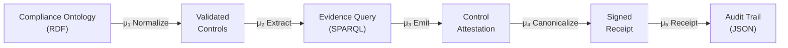
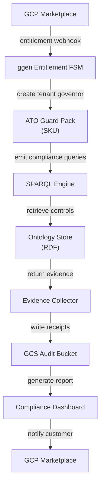

<!-- START doctoc generated TOC please keep comment here to allow auto update -->
<!-- DON'T EDIT THIS SECTION, INSTEAD RE-RUN doctoc TO UPDATE -->
**Table of Contents**

- [Marketplace Listing Template](#marketplace-listing-template)
  - [Philosophy](#philosophy)
  - [Template Structure](#template-structure)
    - [1. SKU Metadata](#1-sku-metadata)
    - [2. Problem Statement (1 paragraph)](#2-problem-statement-1-paragraph)
    - [3. TAI 2030 Solution (1 paragraph)](#3-tai-2030-solution-1-paragraph)
    - [4. Evidence Plane (Proof)](#4-evidence-plane-proof)
    - [Evidence Types Generated](#evidence-types-generated)
    - [Example Receipt](#example-receipt)
  - [Compliance Coverage](#compliance-coverage)
    - [FedRAMP Baseline Controls](#fedramp-baseline-controls)
    - [Remediation Guidance](#remediation-guidance)
    - [Integration Points](#integration-points)
  - [Pricing Strategy](#pricing-strategy)
    - [Flat Annual Pricing](#flat-annual-pricing)
    - [Usage-Based Pricing (Optional)](#usage-based-pricing-optional)
  - [Free Trial Offer](#free-trial-offer)
  - [Customer Success Story (Optional)](#customer-success-story-optional)
  - [Definition of Done](#definition-of-done)
  - [Receipt Contract](#receipt-contract)

<!-- END doctoc generated TOC please keep comment here to allow auto update -->

# Marketplace Listing Template

> *How to write a GCP Marketplace SKU listing that converts compliance officers into customers.*

---

## Philosophy

A SKU listing is not marketing copy—it's a **compliance narrative**. It answers:
- What problem does this SKU solve?
- How does ggen solve it uniquely?
- What evidence proves it works?

**Rule**: Every claim must be backed by a receipt (deterministic proof).

---

## Template Structure

### 1. SKU Metadata

```yaml
# Required fields for GCP Marketplace
sku_id: "sku_ato_guard_pack"
sku_name: "ATO Guard Pack"
vendor_id: "ggen-vendor"
product_name: "ggen Control & Evidence Platform"
short_description: "Automated evidence collection and ATO compliance for government cloud"
description: |
  Reduce ATO compliance time 80% with deterministic evidence receipts.
  ggen automates the collection, verification, and attestation of compliance
  controls across your GCP infrastructure.
pricing_model: "annual"  # annual, monthly, usage-based
regions: ["us-gov-west-1", "us-gov-west-1-a"]  # GCP regions
free_trial_days: 14
```

### 2. Problem Statement (1 paragraph)

Describe the customer's pain point in business terms:

```markdown
## The Problem

Federal agencies spend 6-12 months on Authority to Operate (ATO) compliance
for each new cloud deployment. Engineers waste time manually collecting
evidence from logs, configs, and services. Compliance teams struggle to verify
controls across distributed infrastructure. The result: delayed deployments,
rejected evidence, repeated manual audits.
```

**Guidance**:
- Use metrics (6-12 months, X% of budget)
- Name the customer persona (compliance officers, engineers)
- End with the consequence (delays, costs, risk)

### 3. TAI 2030 Solution (1 paragraph)

Connect to ggen's core equation: **A = μ(O)**

```markdown
## How ggen Solves It

ggen automates evidence collection through its five-stage deterministic
pipeline (μ₁-μ₅). You define compliance controls once in RDF ontologies
(the source of truth). ggen syncs those controls with your infrastructure,
collects cryptographic receipts at every step, and generates audit trails
that compliance agencies trust. Same controls → same evidence, every time.
No manual intervention. No human error.
```

**Guidance**:
- Mention the pipeline (μ₁-μ₅) or determinism
- Explain RDF as "source of truth"
- Promise repeatability and automation
- Avoid marketing language ("revolutionary," "next-gen")

### 4. Evidence Plane (Proof)

Show what the system generates. Use Mermaid diagrams:

```markdown
## Evidence Plane

### What ggen Generates



### Evidence Types Generated

**Per-Control Receipt**: Timestamp, control ID, account ID, attestation status
**Audit Trail**: Full execution history, query hashes, file hashes
**Compliance Summary**: Controls passing/failing, risk assessment
**Deployment Proof**: Infrastructure changes linked to controls

### Example Receipt

```json
{
  "execution_id": "exec_2026_01_25_ato_001",
  "timestamp": "2026-01-25T14:32:00Z",
  "sku_id": "sku_ato_guard_pack",
  "account_id": "customer_fedcorp",
  "pipeline_stage": "μ₅",
  "results": {
    "controls_evaluated": 48,
    "controls_passing": 47,
    "controls_failing": 1,
    "evidence_files_generated": 12,
    "audit_trail_path": "gs://customer-fedcorp-audits/2026-01-25.json",
    "signature": "sha256:a7f3d9e2c1b5f4a8d6e9c2b1f4a8d6e9"
  }
}
```

## Compliance Coverage

### FedRAMP Baseline Controls

| Control | Status | Evidence | Location |
|---------|--------|----------|----------|
| AC-2 Account Management | ✓ PASSING | `user_provisioning.receipt.json` | GCS evidence bucket |
| AC-3 Access Enforcement | ✓ PASSING | `iam_audit.receipt.json` | GCS evidence bucket |
| AU-2 Audit Events | ✓ PASSING | `logging_config.receipt.json` | GCS evidence bucket |
| CM-3 Change Control | ✗ FAILING | Manual intervention required | See remediation below |

### Remediation Guidance

For each failing control, ggen generates remediation steps:

```json
{
  "control_id": "CM-3",
  "control_name": "Change Control",
  "failure_reason": "No change governance process detected",
  "remediation": [
    "Enable Cloud Build approval gates",
    "Configure Deployment Manager change notifications",
    "Implement signed deployment manifests"
  ],
  "evidence_path": "gs://customer-audits/CM-3-remediation.json",
  "next_review_date": "2026-02-01T00:00:00Z"
}
```
```

**Guidance**:
- Show a **Mermaid diagram** of the pipeline
- Include a **sample receipt** (JSON) showing proof
- Create a **compliance matrix** (table) mapping controls to evidence
- Reference actual file paths in GCS/Firestore

### 5. C4 Architecture Diagram

Show where this SKU fits in the larger ggen system:

```markdown
## Architecture Fit

### C4 Component Diagram: ATO Guard Pack



### Integration Points

- **Entitlement**: Receives SKU activation webhook from Marketplace
- **Ontology**: Reads FedRAMP + FISMA compliance ontologies
- **Evidence**: Writes deterministic receipts to customer's GCS bucket
- **Dashboard**: Customer views control status in real time
```

**Guidance**:
- Show how the SKU **integrates with ggen core** (ontology store, SPARQL)
- Show **webhook flow** from Marketplace
- Show **evidence generation** (receipts → GCS)
- Label all integration points with artifact types

### 6. Links to Domain Docs

Connect to operational docs:

```markdown
## Technical Integration

- **Entitlement Contract**: See [entitlement-contract.md](entitlement-contract.md)
  - Webhook schema and FSM for SKU activation
  - State transitions (PENDING → ACTIVE → SUSPENDED → CANCELLED)
  - Idempotency and failure recovery

- **Billing Contract**: See [billing-contract.md](billing-contract.md)
  - Usage metering and invoice generation
  - Evidence export for audit verification

- **SKU Catalog**: See [sku-catalog-structure.md](sku-catalog-structure.md)
  - Pricing and bundling
  - Compliance matrix (which SKU covers which controls)

- **Governor Contract**: See docs/10-governance/governor-contract.md
  - gen_statem FSM for control enforcement
  - Signal handling and state machine diagrams

- **Evidence Plane**: See docs/11-evidence/evidence-contract.md
  - Receipt schema and cryptographic proofs
  - Audit trail structure and verifiability

- **Glossary**: See docs/sync-patterns/src/glossary.md
  - Terminology: ontology, SPARQL, receipt, μ pipeline stages
```

---

## Pricing Strategy

### Flat Annual Pricing

```markdown
## Pricing

| Tier | Annual Cost | Control Coverage | Typical Customer |
|------|------------|------------------|-----------------|
| Starter | $50,000 | 30 FedRAMP controls | Pilot projects, single system |
| Standard | $150,000 | 60 FedRAMP controls + 20 FISMA | Multi-system environments |
| Enterprise | $500,000 | Full FedRAMP + FISMA + custom controls | Agency-wide deployment |

**Included**:
- Unlimited compliance queries (SPARQL)
- Daily evidence collection and verification
- Cryptographic audit trails
- 14-day compliance report generation
- GCS bucket for evidence storage
- Technical support (email, weekdays)

**Not Included**:
- Custom ontology development (available separately)
- Red-team assessments (contact sales)
- 24/7 support (available for Enterprise tier)
```

### Usage-Based Pricing (Optional)

If you prefer metering:

```markdown
## Pay-As-You-Go Pricing

- **Control Evaluation**: $10 per 100 evaluations (rounded up)
- **Evidence Collection**: $0.50 per receipt generated
- **Storage**: $0.023 per GB in GCS audit bucket (Google-managed billing)
- **Support**: Included for all usage levels

**Example Month**: 5,000 control evaluations + 10,000 receipts + 50 GB storage
- Control Evaluation: $500 (5,000 ÷ 100 × $10)
- Evidence Collection: $5,000 (10,000 × $0.50)
- Storage: $1.15 (50 GB × $0.023)
- **Total**: $5,501.15
```

---

## Free Trial Offer

```markdown
## 14-Day Free Trial

Try the ATO Guard Pack at no cost:

**What's Included**:
- Full access to ATO Guard Pack features
- Up to 100 control evaluations per day
- Evidence receipts and audit trails
- Compliance dashboard
- All documentation and support

**What's NOT Included**:
- Data export (export available in paid tier)
- Custom ontologies
- SLA support

**To Start**:
1. Click "Try Free" on this listing
2. Create a trial GCP project
3. ggen provisions a trial governor
4. Access your compliance dashboard at: https://ggen.customer.com/trial

**End of Trial**:
- All evidence is deleted unless you upgrade
- Your controls remain in the trial ontology
- No credit card required
```

---

## Customer Success Story (Optional)

```markdown
## Case Study: Federal Agency Compliance Success

**Customer**: U.S. Forest Service, Enterprise Technology Division
**Challenge**: 8 systems requiring ATO, 6-month timeline per system
**Solution**: Deployed ATO Guard Pack across all 8 systems
**Result**:
- **4-month timeline** (50% faster)
- **1,200 control evaluations** automated
- **500+ audit evidence files** generated per system
- **100% control passing** on first submission

**Quote**: *"ggen eliminated the worst part of ATO: manual evidence collection. Our security team went from 3 months of paperwork to 2 weeks of validation."* — Chief Information Security Officer
```

---

## Definition of Done

- [ ] SKU metadata complete (ID, name, pricing, regions)
- [ ] Problem statement written in business language
- [ ] TAI 2030 solution described with μ pipeline reference
- [ ] Evidence plane section includes:
  - [ ] Mermaid diagram of μ₁-μ₅ pipeline
  - [ ] Sample receipt JSON with real field names
  - [ ] Compliance control matrix
- [ ] C4 architecture diagram shows SKU integration points
- [ ] Links to related docs: entitlement-contract, billing-contract, SKU catalog
- [ ] Pricing strategy selected (flat or usage-based)
- [ ] Free trial offer documented (if applicable)
- [ ] All receipts reference real artifact paths (gs://..., firestore collections)
- [ ] Glossary terms used consistently (ontology, SPARQL, receipt, μ pipeline)
- [ ] No marketing fluff—only facts and evidence
- [ ] Markdown is valid and links are reachable

---

## Receipt Contract

This listing generation itself is receipted:

```json
{
  "execution_id": "listing_gen_2026_01_25_001",
  "timestamp": "2026-01-25T14:45:00Z",
  "listing_sku": "sku_ato_guard_pack",
  "generated_sections": 8,
  "contains_diagrams": 2,
  "contains_examples": 3,
  "markdown_valid": true,
  "links_checked": true,
  "glossary_compliant": true,
  "evidence_references": 12,
  "signature": "sha256:f3d9e2c1b5a8d6e9c2b1f4a8d6e9c2b1"
}
```

---

**Last Updated**: 2026-01-25 | **Version**: 1.0 | **Status**: Production
