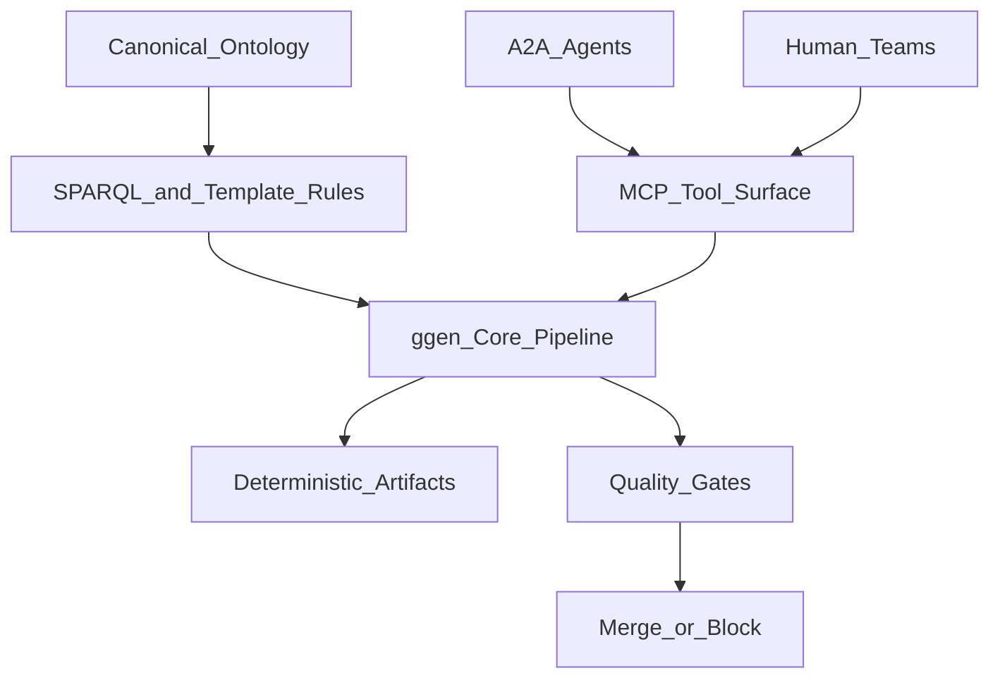

# Case Study: Meridian Global Industries (Synthetic Fortune 500)

## Scenario

Meridian Global Industries (MGI) is a synthetic, non-real enterprise used to model a large-scale adoption pattern for `ggen`.

MGI has:
- multi-region teams,
- regulated business domains,
- shared platform engineering,
- domain squads shipping independently.

The architecture office standardizes on ontology-driven generation and quality gates as a control-plane for software delivery.

## Actors

- EA / Solution Architecture: defines canonical ontology boundaries and contracts.
- Platform Engineering: owns CI templates, policy gates, and golden paths.
- Domain Squads: implement bounded-context rules, templates, and outputs.
- Agent Runtime Team: runs orchestrated agents for repetitive generation and validation tasks.

## MGI target outcomes

- deterministic, auditable artifacts from shared semantics,
- predictable pre-merge quality posture,
- fewer one-off generators and less tool drift,
- transparent handoffs between people and agents.

## Solution architecture pattern

## Phase model used by MGI

- Define: identify business capability and ontology boundary.
- Measure: baseline current generation lead time and gate failures.
- Analyze: identify recurring breakpoints (template mismatch, import cycles, invalid queries).
- Improve: move repeated operations behind MCP; orchestrate roles with A2A.
- Control: enforce pre-merge gate checks and observability traces.

This is a narrative operating model, not a claim of strict statistical DMAIC implementation.

## Anti-patterns MGI avoids

- Agent-specific private code-generation paths.
- Skipping gate validation for "urgent" merges.
- Copy-pasted project templates diverging from canonical ontology.
- Undocumented handoff semantics between architecture and implementation agents.

## Mapping to repository capabilities

- MCP tool surface and contracts:
  - [`crates/ggen-a2a-mcp/src/ggen_server.rs`](../../crates/ggen-a2a-mcp/src/ggen_server.rs)
- Quality gates:
  - [`crates/ggen-core/src/poka_yoke/quality_gates.rs`](../../crates/ggen-core/src/poka_yoke/quality_gates.rs)
- Cycle remediation:
  - [`crates/ggen-core/src/graph/cycle_fixer.rs`](../../crates/ggen-core/src/graph/cycle_fixer.rs)
