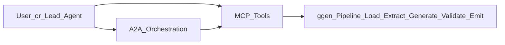

# JTBDs: ggen, MCP, and A2A

## Core jobs-to-be-done

At enterprise scale, teams adopt `ggen` to complete four recurring jobs:

1. Convert RDF ontology, SPARQL queries, and templates into deterministic outputs.
2. Validate project soundness before merge (manifest, ontology, SPARQL, templates, gates).
3. Expose generation and validation operations as stable automation interfaces.
4. Coordinate multi-role work without creating parallel code-generation logic.

## MCP vs A2A responsibilities

MCP and A2A are complementary, not interchangeable.

- MCP answers: "How do we call ggen capabilities consistently from tools and agents?"
- A2A answers: "How do multiple agents coordinate ownership, sequencing, and handoffs?"

## Practical decision rule

Use MCP when:
- one actor (human or agent) can run the required generate/validate/sync cycle.

Use A2A plus MCP when:
- multiple roles must collaborate (ontology curation, template ownership, validation ownership),
- phase gates and handoffs are required,
- a common execution surface must still be enforced.

## Why this matters in ggen specifically

The project already codifies tool-level operations and validation concepts in:
- [`crates/ggen-a2a-mcp/src/ggen_server.rs`](../../crates/ggen-a2a-mcp/src/ggen_server.rs)
- [`crates/ggen-core/src/poka_yoke/quality_gates.rs`](../../crates/ggen-core/src/poka_yoke/quality_gates.rs)
- [`crates/ggen-core/src/codegen/pipeline.rs`](../../crates/ggen-core/src/codegen/pipeline.rs)

The architectural intent is to prevent teams from implementing custom side-paths that bypass deterministic generation and quality gates.
