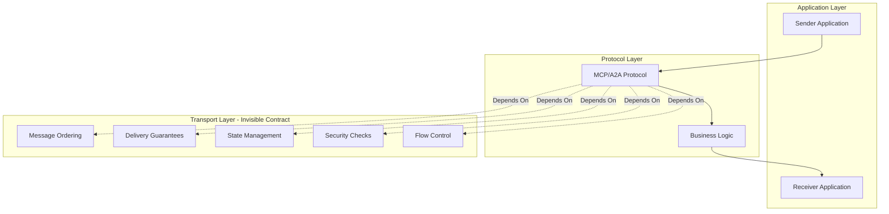
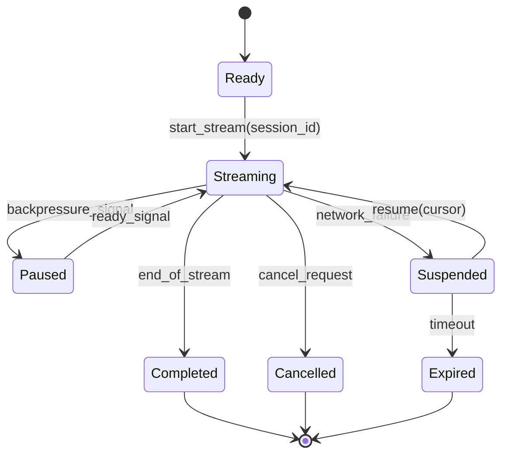
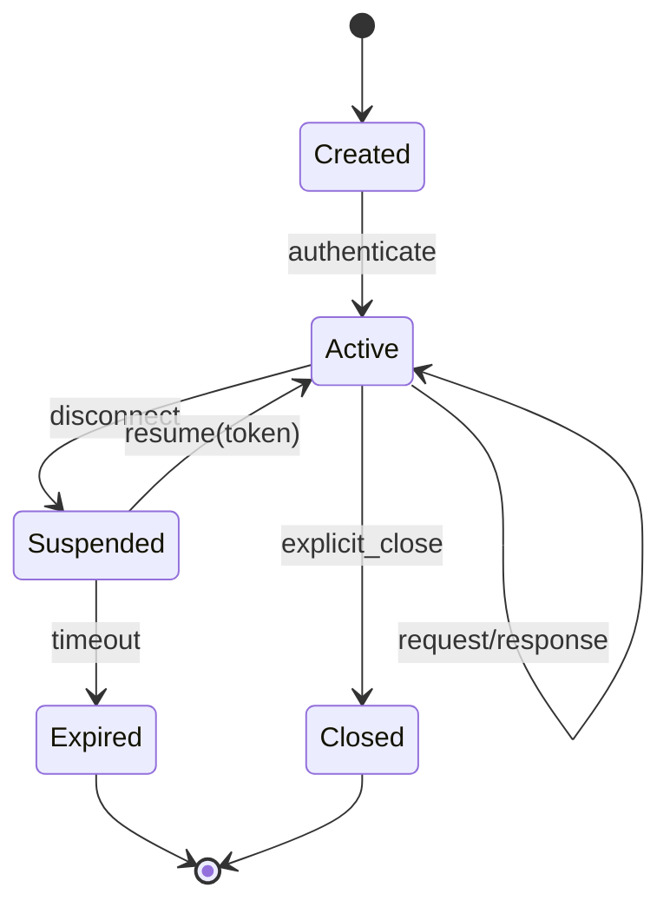

# MCP/A2A Transport Obligations and Invariants

**Reading Time**: 45-50 minutes | **Difficulty**: Advanced | **Prerequisites**: Understanding of MCP Protocol, A2A Protocol, distributed systems

**Version**: 1.0.0
**Last Updated**: 2026-02-09
**Status**: Canonical Reference

---

## TL;DR

**Transport correctness is the invisible contract that makes distributed agent systems work.**

Most MCP/A2A implementations focus on the happy path: send a request, get a response. Production-grade transports must handle:
- **Streaming** - Chunked data, partial results, backpressure
- **Session Management** - Persistent connections, state tracking, resume
- **Cursor-based Pagination** - Resumable iteration over large datasets
- **Origin Validation** - Verify message source, prevent spoofing
- **Task Coordination** - Long-running operations, progress tracking, cancellation

**Trivial implementations omit these because they're hard.** This document explains why they matter and how to implement them correctly.

---

## Table of Contents

1. [The Transport Correctness Problem](#the-transport-correctness-problem)
2. [Why These Are the Hard Parts](#why-these-are-the-hard-parts)
3. [Transport Invariants](#transport-invariants)
4. [Streaming Protocol Obligations](#streaming-protocol-obligations)
5. [Session Management and Resumption](#session-management-and-resumption)
6. [Cursor-Based Pagination](#cursor-based-pagination)
7. [Origin Validation and Security](#origin-validation-and-security)
8. [Task Management and Progress Tracking](#task-management-and-progress-tracking)
9. [Error Handling and Recovery](#error-handling-and-recovery)
10. [Validation and Testing](#validation-and-testing)
11. [Protocol Specifications](#protocol-specifications)
12. [Maturity Model](#maturity-model)

---

## The Transport Correctness Problem

### What is Transport Correctness?

**Transport correctness** means the communication layer preserves all protocol invariants under failure conditions:

```
Correct Transport Properties:
1. Message Ordering    - Messages arrive in-order or unordered explicitly
2. Exactly-Once        - Messages delivered once (or at-least-once with idempotency)
3. Completeness        - All data arrives, not truncated
4. Session Continuity  - State preserved across disconnects
5. Origin Authenticity - Sender identity verified
6. Backpressure        - Receiver can signal overload to sender
7. Cancellation        - Long operations can be stopped mid-flight
```

### The Invisible Contract



**The problem:** Application developers assume these properties hold, but transport implementations often violate them silently.

---

## Why These Are the Hard Parts

### The Trivial vs. Production Gap

```
Trivial Implementation (100 lines):
┌─────────────────────────────────────┐
│ fn send(msg) -> Result<Response> {  │
│     let socket = connect()?;        │
│     socket.write(msg)?;             │
│     socket.read()                   │
│ }                                   │
└─────────────────────────────────────┘
                ↓
         Works in demos
                ↓
    Fails in production when:
    - Connection drops mid-stream
    - Server restarts during request
    - Network partitions occur
    - Client cancels operation
    - Large data needs pagination
    - Multiple concurrent requests
```

```
Production Implementation (10,000+ lines):
┌─────────────────────────────────────────────────┐
│ • Session Management (1000 lines)               │
│   - Persistent connections                      │
│   - State tracking                              │
│   - Resume capabilities                         │
│                                                  │
│ • Streaming Engine (2000 lines)                 │
│   - Chunked encoding                            │
│   - Backpressure signals                        │
│   - Partial result handling                     │
│                                                  │
│ • Pagination (1500 lines)                       │
│   - Cursor generation                           │
│   - Cursor validation                           │
│   - State expiration                            │
│                                                  │
│ • Security (2000 lines)                         │
│   - Origin validation                           │
│   - Token refresh                               │
│   - Rate limiting                               │
│                                                  │
│ • Error Recovery (1500 lines)                   │
│   - Retry with backoff                          │
│   - Partial failure handling                    │
│   - Circuit breakers                            │
│                                                  │
│ • Testing Infrastructure (2000 lines)           │
│   - Network simulation                          │
│   - Failure injection                           │
│   - Invariant checking                          │
└─────────────────────────────────────────────────┘
```

### Why They're Hard

| Feature | Easy Part (10%) | Hard Part (90%) |
|---------|----------------|-----------------|
| **Streaming** | Send chunks | Backpressure, resume after network failure, partial results |
| **Sessions** | Generate ID | Persist state, handle concurrent access, garbage collection |
| **Cursors** | Return pagination token | Make resumable, handle expiration, validate authenticity |
| **Origin Checks** | Verify token | Handle token refresh, distributed validation, revocation |
| **Tasks** | Start async operation | Progress tracking, cancellation propagation, cleanup |

### Real-World Failure Modes

```rust
// Failure Mode 1: Lost streaming data
// Client receives 500KB of 2MB response, connection drops
// Trivial: Start over, waste bandwidth
// Production: Resume from cursor, send remaining 1.5MB

// Failure Mode 2: Session state lost
// Client reconnects after network blip
// Trivial: All context lost, start from scratch
// Production: Session persisted, resume exactly where left off

// Failure Mode 3: Stale cursor
// Client uses pagination cursor from 2 hours ago
// Trivial: Serve stale data or crash
// Production: Detect staleness, invalidate gracefully

// Failure Mode 4: Origin spoofing
// Attacker forges message claiming to be agent X
// Trivial: Accept any message
// Production: Validate signature, check token freshness

// Failure Mode 5: Zombie tasks
// Client starts task, disconnects, never cancels
// Trivial: Task runs forever, resource leak
// Production: Timeout, heartbeat monitoring, automatic cleanup
```

---

## Transport Invariants

### Core Invariants

These properties MUST hold for all MCP/A2A transports:

```rust
/// Transport invariants that must always hold
pub trait TransportInvariants {
    /// INV-1: Message Ordering
    /// Messages from the same session arrive in order
    /// or are explicitly marked as unordered
    fn preserves_ordering(&self) -> bool;

    /// INV-2: Session Isolation
    /// Sessions do not interfere with each other
    fn sessions_isolated(&self) -> bool;

    /// INV-3: State Consistency
    /// Session state is consistent across all operations
    fn state_consistent(&self) -> bool;

    /// INV-4: Origin Authenticity
    /// Message origin can be cryptographically verified
    fn origin_authentic(&self) -> bool;

    /// INV-5: Graceful Degradation
    /// Failures are detected and handled gracefully
    fn fails_gracefully(&self) -> bool;

    /// INV-6: Resource Bounded
    /// Resource usage has explicit limits
    fn resource_bounded(&self) -> bool;
}
```

### Formal Specification

```
Transport State Machine:

States: {Disconnected, Connecting, Connected, Streaming, Suspended, Closed}

Transitions:
  Disconnected -[connect]→ Connecting
  Connecting -[success]→ Connected
  Connecting -[failure]→ Disconnected
  Connected -[stream_start]→ Streaming
  Streaming -[stream_complete]→ Connected
  Streaming -[network_failure]→ Suspended
  Suspended -[reconnect]→ Streaming
  Suspended -[timeout]→ Disconnected
  * -[close]→ Closed

Invariants:
  I1: ∀session. session.state ∈ {Disconnected, Connecting, Connected, Streaming, Suspended, Closed}
  I2: ∀session. session.state = Streaming ⇒ session.cursor ≠ null
  I3: ∀session. session.state = Suspended ⇒ ∃resume_token
  I4: ∀message. message.session_id ∈ active_sessions ∨ reject(message)
  I5: ∀cursor. age(cursor) < MAX_CURSOR_AGE ∨ invalid(cursor)
```

---

## Streaming Protocol Obligations

### The Streaming Problem

**Challenge:** Send large datasets (MB to GB) without:
- Exhausting client/server memory
- Blocking on slow networks
- Losing data on disconnection
- Allowing unbounded resource use

### Streaming State Machine



### Streaming Protocol

```rust
use tokio::sync::mpsc;
use futures::stream::{Stream, StreamExt};

/// Streaming transport with backpressure
pub struct StreamingTransport {
    session_id: SessionId,
    cursor: Option<Cursor>,
    buffer_size: usize,
    backpressure_threshold: f64, // 0.0-1.0
}

/// Streaming message types
#[derive(Debug, Clone, Serialize, Deserialize)]
pub enum StreamMessage {
    /// Start of stream
    Start {
        session_id: SessionId,
        total_chunks: Option<u64>,
        metadata: HashMap<String, String>,
    },
    /// Data chunk with cursor
    Chunk {
        cursor: Cursor,
        data: Vec<u8>,
        sequence: u64,
    },
    /// Backpressure signal (flow control)
    Backpressure {
        pause: bool,
        buffer_utilization: f64,
    },
    /// Resume from cursor
    Resume {
        cursor: Cursor,
        session_id: SessionId,
    },
    /// End of stream
    End {
        cursor: Cursor,
        total_bytes: u64,
        checksum: String,
    },
}

impl StreamingTransport {
    /// Stream data with backpressure support
    pub async fn stream_with_backpressure<S>(
        &mut self,
        stream: S,
    ) -> Result<impl Stream<Item = Result<StreamMessage>>>
    where
        S: Stream<Item = Vec<u8>> + Send + 'static,
    {
        let (tx, rx) = mpsc::channel(self.buffer_size);
        let session_id = self.session_id.clone();

        // Send start message
        tx.send(Ok(StreamMessage::Start {
            session_id: session_id.clone(),
            total_chunks: None,
            metadata: HashMap::new(),
        }))
        .await?;

        // Spawn streaming task
        tokio::spawn(async move {
            let mut sequence = 0u64;
            let mut total_bytes = 0u64;
            let mut hasher = Sha256::new();

            tokio::pin!(stream);

            while let Some(chunk) = stream.next().await {
                sequence += 1;
                total_bytes += chunk.len() as u64;
                hasher.update(&chunk);

                // Generate cursor for this position
                let cursor = Cursor::new(session_id.clone(), sequence, total_bytes);

                // Send chunk
                let msg = StreamMessage::Chunk {
                    cursor: cursor.clone(),
                    data: chunk,
                    sequence,
                };

                // Check backpressure
                let utilization = tx.capacity() as f64 / tx.max_capacity() as f64;
                if utilization > self.backpressure_threshold {
                    // Send backpressure signal
                    tx.send(Ok(StreamMessage::Backpressure {
                        pause: true,
                        buffer_utilization: utilization,
                    }))
                    .await?;

                    // Wait for ready signal (simplified)
                    tokio::time::sleep(Duration::from_millis(100)).await;
                }

                tx.send(Ok(msg)).await?;
            }

            // Send end message with checksum
            let checksum = format!("{:x}", hasher.finalize());
            tx.send(Ok(StreamMessage::End {
                cursor: Cursor::new(session_id, sequence, total_bytes),
                total_bytes,
                checksum,
            }))
            .await?;
        });

        Ok(tokio_stream::wrappers::ReceiverStream::new(rx))
    }

    /// Resume streaming from cursor
    pub async fn resume_from_cursor(
        &mut self,
        cursor: Cursor,
    ) -> Result<impl Stream<Item = Result<StreamMessage>>> {
        // Validate cursor
        if !cursor.is_valid() {
            return Err(TransportError::InvalidCursor(cursor));
        }

        // Check cursor age
        if cursor.age() > Duration::from_secs(3600) {
            return Err(TransportError::ExpiredCursor(cursor));
        }

        // Restore session state from cursor
        self.cursor = Some(cursor.clone());
        self.session_id = cursor.session_id();

        // Resume streaming from position
        let skip_bytes = cursor.position();
        // ... implementation continues
        todo!("Resume from position {}", skip_bytes)
    }
}

/// Cursor for resumable streaming
#[derive(Debug, Clone, Serialize, Deserialize)]
pub struct Cursor {
    session_id: SessionId,
    sequence: u64,
    position: u64,
    created_at: DateTime<Utc>,
    signature: String,
}

impl Cursor {
    pub fn new(session_id: SessionId, sequence: u64, position: u64) -> Self {
        let created_at = Utc::now();
        let signature = Self::generate_signature(&session_id, sequence, position, created_at);

        Self {
            session_id,
            sequence,
            position,
            created_at,
            signature,
        }
    }

    /// Validate cursor authenticity
    pub fn is_valid(&self) -> bool {
        let expected_sig = Self::generate_signature(
            &self.session_id,
            self.sequence,
            self.position,
            self.created_at,
        );
        constant_time_compare(&self.signature, &expected_sig)
    }

    /// Get cursor age
    pub fn age(&self) -> Duration {
        Utc::now().signed_duration_since(self.created_at)
            .to_std()
            .unwrap_or(Duration::ZERO)
    }

    fn generate_signature(
        session_id: &SessionId,
        sequence: u64,
        position: u64,
        created_at: DateTime<Utc>,
    ) -> String {
        use sha2::{Sha256, Digest};
        let mut hasher = Sha256::new();
        hasher.update(session_id.as_bytes());
        hasher.update(&sequence.to_le_bytes());
        hasher.update(&position.to_le_bytes());
        hasher.update(created_at.to_rfc3339().as_bytes());
        // In production: include HMAC secret
        format!("{:x}", hasher.finalize())
    }

    pub fn position(&self) -> u64 {
        self.position
    }

    pub fn session_id(&self) -> SessionId {
        self.session_id.clone()
    }
}
```

### Streaming Invariants

```rust
/// Streaming protocol invariants
pub trait StreamingInvariants {
    /// STREAM-1: Chunk ordering preserved
    /// Chunks arrive with monotonically increasing sequence numbers
    fn chunks_ordered(&self) -> bool;

    /// STREAM-2: Completeness
    /// Sum of chunk bytes = total_bytes in End message
    fn stream_complete(&self) -> bool;

    /// STREAM-3: Resumability
    /// Stream can be resumed from any valid cursor
    fn resumable_from_cursor(&self, cursor: &Cursor) -> bool;

    /// STREAM-4: Backpressure respected
    /// Sender pauses when backpressure signal received
    fn backpressure_honored(&self) -> bool;

    /// STREAM-5: Resource bounded
    /// Buffer usage never exceeds configured limit
    fn buffer_bounded(&self) -> bool;
}
```

---

## Session Management and Resumption

### The Session Problem

**Challenge:** Maintain state across:
- Network disconnections
- Server restarts
- Client crashes
- Concurrent access

### Session State Machine



### Session Management Implementation

```rust
use std::sync::Arc;
use tokio::sync::RwLock;
use dashmap::DashMap;

/// Session manager with persistence
pub struct SessionManager {
    sessions: Arc<DashMap<SessionId, Arc<RwLock<Session>>>>,
    storage: Arc<dyn SessionStorage>,
    config: SessionConfig,
}

#[derive(Debug, Clone)]
pub struct SessionConfig {
    /// Maximum session lifetime
    pub max_lifetime: Duration,
    /// Idle timeout before suspension
    pub idle_timeout: Duration,
    /// Suspended timeout before expiration
    pub suspended_timeout: Duration,
    /// Maximum concurrent sessions per agent
    pub max_per_agent: usize,
}

/// Session state
#[derive(Debug, Clone, Serialize, Deserialize)]
pub struct Session {
    pub id: SessionId,
    pub agent_id: AgentId,
    pub state: SessionState,
    pub created_at: DateTime<Utc>,
    pub last_activity: DateTime<Utc>,
    pub resume_token: Option<ResumeToken>,
    pub metadata: HashMap<String, String>,
    /// In-flight requests for this session
    pub pending_requests: Vec<RequestId>,
}

#[derive(Debug, Clone, PartialEq, Eq, Serialize, Deserialize)]
pub enum SessionState {
    Created,
    Active,
    Suspended { since: DateTime<Utc> },
    Expired,
    Closed,
}

impl SessionManager {
    pub fn new(storage: Arc<dyn SessionStorage>, config: SessionConfig) -> Self {
        let manager = Self {
            sessions: Arc::new(DashMap::new()),
            storage,
            config,
        };

        // Start background cleanup task
        manager.start_cleanup_task();

        manager
    }

    /// Create new session
    pub async fn create_session(&self, agent_id: AgentId) -> Result<Session> {
        // Check session limit per agent
        let existing_count = self
            .sessions
            .iter()
            .filter(|entry| {
                let session = entry.value();
                futures::executor::block_on(async {
                    let s = session.read().await;
                    s.agent_id == agent_id && s.state != SessionState::Expired
                })
            })
            .count();

        if existing_count >= self.config.max_per_agent {
            return Err(TransportError::SessionLimitExceeded {
                agent_id,
                limit: self.config.max_per_agent,
            });
        }

        let session = Session {
            id: SessionId::generate(),
            agent_id,
            state: SessionState::Created,
            created_at: Utc::now(),
            last_activity: Utc::now(),
            resume_token: None,
            metadata: HashMap::new(),
            pending_requests: Vec::new(),
        };

        // Persist to storage
        self.storage.save_session(&session).await?;

        // Add to active sessions
        self.sessions
            .insert(session.id.clone(), Arc::new(RwLock::new(session.clone())));

        Ok(session)
    }

    /// Activate session
    pub async fn activate_session(&self, session_id: SessionId) -> Result<()> {
        let session = self
            .sessions
            .get(&session_id)
            .ok_or_else(|| TransportError::SessionNotFound(session_id.clone()))?;

        let mut s = session.write().await;

        match s.state {
            SessionState::Created => {
                s.state = SessionState::Active;
                s.last_activity = Utc::now();
                self.storage.save_session(&s).await?;
                Ok(())
            }
            SessionState::Suspended { .. } => {
                Err(TransportError::SessionSuspended(session_id))
            }
            SessionState::Active => Ok(()), // Already active
            SessionState::Expired | SessionState::Closed => {
                Err(TransportError::SessionInvalid(session_id))
            }
        }
    }

    /// Suspend session (connection lost)
    pub async fn suspend_session(&self, session_id: SessionId) -> Result<ResumeToken> {
        let session = self
            .sessions
            .get(&session_id)
            .ok_or_else(|| TransportError::SessionNotFound(session_id.clone()))?;

        let mut s = session.write().await;

        // Generate resume token
        let resume_token = ResumeToken::generate(
            session_id.clone(),
            s.agent_id.clone(),
            s.pending_requests.clone(),
        );

        s.state = SessionState::Suspended {
            since: Utc::now(),
        };
        s.resume_token = Some(resume_token.clone());

        // Persist state
        self.storage.save_session(&s).await?;

        Ok(resume_token)
    }

    /// Resume session from token
    pub async fn resume_session(&self, token: ResumeToken) -> Result<Session> {
        // Validate token
        if !token.is_valid() {
            return Err(TransportError::InvalidResumeToken);
        }

        // Check token age
        if token.age() > self.config.suspended_timeout {
            return Err(TransportError::ExpiredResumeToken);
        }

        let session_id = token.session_id();
        let session = self
            .sessions
            .get(&session_id)
            .ok_or_else(|| TransportError::SessionNotFound(session_id.clone()))?;

        let mut s = session.write().await;

        match &s.state {
            SessionState::Suspended { .. } => {
                // Verify token matches
                if s.resume_token.as_ref() != Some(&token) {
                    return Err(TransportError::TokenMismatch);
                }

                // Resume session
                s.state = SessionState::Active;
                s.last_activity = Utc::now();
                s.resume_token = None;

                self.storage.save_session(&s).await?;

                Ok(s.clone())
            }
            _ => Err(TransportError::SessionNotSuspended(session_id)),
        }
    }

    /// Close session explicitly
    pub async fn close_session(&self, session_id: SessionId) -> Result<()> {
        let session = self
            .sessions
            .get(&session_id)
            .ok_or_else(|| TransportError::SessionNotFound(session_id.clone()))?;

        let mut s = session.write().await;
        s.state = SessionState::Closed;

        // Cancel all pending requests
        for request_id in &s.pending_requests {
            // ... cancel request
        }
        s.pending_requests.clear();

        self.storage.save_session(&s).await?;

        // Remove from active sessions
        drop(s);
        self.sessions.remove(&session_id);

        Ok(())
    }

    /// Background cleanup task
    fn start_cleanup_task(&self) {
        let sessions = self.sessions.clone();
        let config = self.config.clone();
        let storage = self.storage.clone();

        tokio::spawn(async move {
            let mut interval = tokio::time::interval(Duration::from_secs(60));

            loop {
                interval.tick().await;

                let now = Utc::now();
                let mut expired = Vec::new();

                // Find expired sessions
                for entry in sessions.iter() {
                    let session = entry.value();
                    let s = session.read().await;

                    let should_expire = match &s.state {
                        SessionState::Active => {
                            // Check idle timeout
                            now.signed_duration_since(s.last_activity)
                                > chrono::Duration::from_std(config.idle_timeout).unwrap()
                        }
                        SessionState::Suspended { since } => {
                            // Check suspended timeout
                            now.signed_duration_since(*since)
                                > chrono::Duration::from_std(config.suspended_timeout).unwrap()
                        }
                        SessionState::Created => {
                            // Check max lifetime
                            now.signed_duration_since(s.created_at)
                                > chrono::Duration::from_std(config.max_lifetime).unwrap()
                        }
                        SessionState::Expired | SessionState::Closed => false,
                    };

                    if should_expire {
                        expired.push(s.id.clone());
                    }
                }

                // Expire sessions
                for session_id in expired {
                    if let Some(session) = sessions.get(&session_id) {
                        let mut s = session.write().await;
                        s.state = SessionState::Expired;
                        let _ = storage.save_session(&s).await;
                    }
                    sessions.remove(&session_id);
                }
            }
        });
    }
}

/// Resume token for session restoration
#[derive(Debug, Clone, PartialEq, Eq, Serialize, Deserialize)]
pub struct ResumeToken {
    session_id: SessionId,
    agent_id: AgentId,
    created_at: DateTime<Utc>,
    pending_requests: Vec<RequestId>,
    signature: String,
}

impl ResumeToken {
    pub fn generate(
        session_id: SessionId,
        agent_id: AgentId,
        pending_requests: Vec<RequestId>,
    ) -> Self {
        let created_at = Utc::now();
        let signature = Self::generate_signature(&session_id, &agent_id, created_at);

        Self {
            session_id,
            agent_id,
            created_at,
            pending_requests,
            signature,
        }
    }

    pub fn is_valid(&self) -> bool {
        let expected_sig = Self::generate_signature(
            &self.session_id,
            &self.agent_id,
            self.created_at,
        );
        constant_time_compare(&self.signature, &expected_sig)
    }

    pub fn age(&self) -> Duration {
        Utc::now()
            .signed_duration_since(self.created_at)
            .to_std()
            .unwrap_or(Duration::ZERO)
    }

    pub fn session_id(&self) -> SessionId {
        self.session_id.clone()
    }

    fn generate_signature(
        session_id: &SessionId,
        agent_id: &AgentId,
        created_at: DateTime<Utc>,
    ) -> String {
        use hmac::{Hmac, Mac};
        use sha2::Sha256;

        type HmacSha256 = Hmac<Sha256>;

        // In production: Use actual secret key
        let secret = b"secret-key-from-config";
        let mut mac = HmacSha256::new_from_slice(secret).expect("HMAC key");

        mac.update(session_id.as_bytes());
        mac.update(agent_id.to_string().as_bytes());
        mac.update(created_at.to_rfc3339().as_bytes());

        format!("{:x}", mac.finalize().into_bytes())
    }
}

/// Session storage trait
#[async_trait::async_trait]
pub trait SessionStorage: Send + Sync {
    async fn save_session(&self, session: &Session) -> Result<()>;
    async fn load_session(&self, session_id: &SessionId) -> Result<Option<Session>>;
    async fn delete_session(&self, session_id: &SessionId) -> Result<()>;
}
```

### Session Invariants

```rust
/// Session management invariants
pub trait SessionInvariants {
    /// SESSION-1: Unique session IDs
    /// No two active sessions have the same ID
    fn session_ids_unique(&self) -> bool;

    /// SESSION-2: State transitions valid
    /// Session states follow the state machine
    fn transitions_valid(&self) -> bool;

    /// SESSION-3: Resume token authenticity
    /// Resume tokens can be cryptographically verified
    fn resume_tokens_authentic(&self) -> bool;

    /// SESSION-4: Bounded lifetime
    /// Sessions expire after configured timeout
    fn lifetimes_bounded(&self) -> bool;

    /// SESSION-5: Request consistency
    /// Pending requests are preserved across suspension
    fn requests_consistent(&self) -> bool;
}
```

---

## Cursor-Based Pagination

### The Pagination Problem

**Challenge:** Iterate over large result sets without:
- Loading entire dataset into memory
- Losing position on disconnection
- Serving stale data
- Allowing cursor forgery

### Cursor Design

```rust
/// Opaque cursor for pagination
#[derive(Debug, Clone, Serialize, Deserialize)]
pub struct PaginationCursor {
    /// Unique query identifier
    query_id: String,
    /// Current offset in result set
    offset: u64,
    /// Total results (if known)
    total: Option<u64>,
    /// Cursor creation time
    created_at: DateTime<Utc>,
    /// Query parameters hash (detect changes)
    params_hash: String,
    /// HMAC signature
    signature: String,
}

impl PaginationCursor {
    pub fn new(
        query_id: String,
        offset: u64,
        total: Option<u64>,
        params_hash: String,
    ) -> Self {
        let created_at = Utc::now();
        let signature = Self::sign(&query_id, offset, created_at, &params_hash);

        Self {
            query_id,
            offset,
            total,
            created_at,
            params_hash,
            signature,
        }
    }

    /// Validate cursor authenticity and freshness
    pub fn validate(&self, max_age: Duration) -> Result<()> {
        // Check signature
        let expected_sig = Self::sign(
            &self.query_id,
            self.offset,
            self.created_at,
            &self.params_hash,
        );

        if !constant_time_compare(&self.signature, &expected_sig) {
            return Err(TransportError::InvalidCursorSignature);
        }

        // Check age
        let age = Utc::now()
            .signed_duration_since(self.created_at)
            .to_std()
            .unwrap_or(Duration::MAX);

        if age > max_age {
            return Err(TransportError::ExpiredCursor);
        }

        Ok(())
    }

    /// Verify query parameters haven't changed
    pub fn verify_params(&self, current_params: &HashMap<String, String>) -> Result<()> {
        let current_hash = Self::hash_params(current_params);
        if current_hash != self.params_hash {
            return Err(TransportError::CursorParamsMismatch);
        }
        Ok(())
    }

    fn sign(query_id: &str, offset: u64, created_at: DateTime<Utc>, params_hash: &str) -> String {
        use hmac::{Hmac, Mac};
        use sha2::Sha256;

        type HmacSha256 = Hmac<Sha256>;

        let secret = b"pagination-secret-key";
        let mut mac = HmacSha256::new_from_slice(secret).expect("HMAC key");

        mac.update(query_id.as_bytes());
        mac.update(&offset.to_le_bytes());
        mac.update(created_at.to_rfc3339().as_bytes());
        mac.update(params_hash.as_bytes());

        format!("{:x}", mac.finalize().into_bytes())
    }

    fn hash_params(params: &HashMap<String, String>) -> String {
        use sha2::{Sha256, Digest};

        let mut hasher = Sha256::new();
        let mut keys: Vec<_> = params.keys().collect();
        keys.sort();

        for key in keys {
            hasher.update(key.as_bytes());
            hasher.update(b"=");
            hasher.update(params[key].as_bytes());
            hasher.update(b"&");
        }

        format!("{:x}", hasher.finalize())
    }
}

/// Paginated response
#[derive(Debug, Clone, Serialize, Deserialize)]
pub struct PaginatedResponse<T> {
    pub items: Vec<T>,
    pub cursor: Option<PaginationCursor>,
    pub has_more: bool,
    pub total: Option<u64>,
}

/// Pagination request
#[derive(Debug, Clone, Serialize, Deserialize)]
pub struct PaginationRequest {
    pub page_size: usize,
    pub cursor: Option<PaginationCursor>,
    pub params: HashMap<String, String>,
}
```

### Cursor-Based Pagination Implementation

```rust
/// Paginator for large result sets
pub struct Paginator<T> {
    query_id: String,
    page_size: usize,
    max_cursor_age: Duration,
    _marker: PhantomData<T>,
}

impl<T: Serialize + DeserializeOwned> Paginator<T> {
    pub fn new(query_id: String, page_size: usize) -> Self {
        Self {
            query_id,
            page_size,
            max_cursor_age: Duration::from_secs(3600), // 1 hour
            _marker: PhantomData,
        }
    }

    /// Execute paginated query
    pub async fn paginate(
        &self,
        request: PaginationRequest,
        query_fn: impl Fn(u64, usize) -> BoxFuture<'static, Result<(Vec<T>, Option<u64>)>>,
    ) -> Result<PaginatedResponse<T>> {
        // Validate cursor if present
        let offset = if let Some(cursor) = &request.cursor {
            cursor.validate(self.max_cursor_age)?;
            cursor.verify_params(&request.params)?;
            cursor.offset
        } else {
            0
        };

        // Execute query
        let (items, total) = query_fn(offset, request.page_size).await?;

        // Generate next cursor if more results exist
        let has_more = items.len() == request.page_size;
        let cursor = if has_more {
            let params_hash = PaginationCursor::hash_params(&request.params);
            Some(PaginationCursor::new(
                self.query_id.clone(),
                offset + items.len() as u64,
                total,
                params_hash,
            ))
        } else {
            None
        };

        Ok(PaginatedResponse {
            items,
            cursor,
            has_more,
            total,
        })
    }
}
```

### Pagination Invariants

```rust
/// Pagination invariants
pub trait PaginationInvariants {
    /// PAGE-1: Cursor authenticity
    /// Cursors cannot be forged
    fn cursors_authentic(&self) -> bool;

    /// PAGE-2: Cursor freshness
    /// Stale cursors are rejected
    fn cursors_fresh(&self) -> bool;

    /// PAGE-3: Parameter consistency
    /// Query parameters match cursor creation
    fn params_consistent(&self) -> bool;

    /// PAGE-4: Result completeness
    /// All items returned exactly once
    fn results_complete(&self) -> bool;

    /// PAGE-5: No duplicates
    /// Items not repeated across pages
    fn no_duplicates(&self) -> bool;
}
```

---

## Origin Validation and Security

### The Origin Problem

**Challenge:** Verify message sender identity to prevent:
- Message spoofing
- Replay attacks
- Man-in-the-middle attacks
- Privilege escalation

### Origin Validation Implementation

```rust
use jsonwebtoken::{decode, encode, DecodingKey, EncodingKey, Header, Validation};

/// Origin validator with token-based auth
pub struct OriginValidator {
    encoding_key: EncodingKey,
    decoding_key: DecodingKey,
    token_expiry: Duration,
}

/// Claims embedded in authentication token
#[derive(Debug, Clone, Serialize, Deserialize)]
pub struct AgentClaims {
    /// Agent identifier
    pub sub: String, // subject (agent_id)
    /// Token issuer
    pub iss: String, // issuer
    /// Expiration time (Unix timestamp)
    pub exp: i64,
    /// Issued at (Unix timestamp)
    pub iat: i64,
    /// Not before (Unix timestamp)
    pub nbf: i64,
    /// Agent capabilities
    pub capabilities: Vec<String>,
    /// Request nonce (prevent replay)
    pub nonce: String,
}

impl OriginValidator {
    pub fn new(secret: &[u8], token_expiry: Duration) -> Self {
        Self {
            encoding_key: EncodingKey::from_secret(secret),
            decoding_key: DecodingKey::from_secret(secret),
            token_expiry,
        }
    }

    /// Generate authentication token for agent
    pub fn generate_token(&self, agent_id: AgentId, capabilities: Vec<String>) -> Result<String> {
        let now = Utc::now().timestamp();
        let exp = now + self.token_expiry.as_secs() as i64;

        let claims = AgentClaims {
            sub: agent_id.to_string(),
            iss: "ggen-transport".to_string(),
            exp,
            iat: now,
            nbf: now,
            capabilities,
            nonce: uuid::Uuid::new_v4().to_string(),
        };

        encode(&Header::default(), &claims, &self.encoding_key)
            .map_err(|e| TransportError::TokenGeneration(e.to_string()))
    }

    /// Validate token and extract agent identity
    pub fn validate_token(&self, token: &str) -> Result<AgentClaims> {
        let validation = Validation::default();

        decode::<AgentClaims>(token, &self.decoding_key, &validation)
            .map(|data| data.claims)
            .map_err(|e| TransportError::InvalidToken(e.to_string()))
    }

    /// Validate message origin
    pub fn validate_message(&self, message: &Message) -> Result<()> {
        // Extract token from message headers
        let token = message
            .headers
            .get("Authorization")
            .and_then(|h| h.strip_prefix("Bearer "))
            .ok_or(TransportError::MissingAuthToken)?;

        // Validate token
        let claims = self.validate_token(token)?;

        // Verify agent ID matches
        let claimed_agent: AgentId = claims.sub.parse()?;
        if claimed_agent != message.from {
            return Err(TransportError::AgentIdMismatch {
                claimed: claimed_agent,
                actual: message.from.clone(),
            });
        }

        // Verify capabilities for requested operation
        let required_capability = message.capability_required();
        if !claims.capabilities.contains(&required_capability) {
            return Err(TransportError::InsufficientCapabilities {
                required: required_capability,
                available: claims.capabilities,
            });
        }

        Ok(())
    }
}

/// Message signature verification
pub struct MessageSigner {
    signing_key: SigningKey,
    verifying_key: VerifyingKey,
}

impl MessageSigner {
    /// Sign message for authenticity
    pub fn sign_message(&self, message: &Message) -> Result<String> {
        use ed25519_dalek::Signer;

        // Serialize message
        let message_bytes = serde_json::to_vec(message)?;

        // Sign
        let signature = self.signing_key.sign(&message_bytes);

        Ok(base64::encode(signature.to_bytes()))
    }

    /// Verify message signature
    pub fn verify_signature(&self, message: &Message, signature: &str) -> Result<()> {
        use ed25519_dalek::{Signature, Verifier};

        // Deserialize signature
        let sig_bytes = base64::decode(signature)?;
        let signature = Signature::from_bytes(&sig_bytes)?;

        // Serialize message
        let message_bytes = serde_json::to_vec(message)?;

        // Verify
        self.verifying_key
            .verify(&message_bytes, &signature)
            .map_err(|e| TransportError::InvalidSignature(e.to_string()))
    }
}
```

### Origin Validation Invariants

```rust
/// Origin validation invariants
pub trait OriginInvariants {
    /// ORIGIN-1: Token authenticity
    /// All tokens cryptographically verified
    fn tokens_authentic(&self) -> bool;

    /// ORIGIN-2: Token freshness
    /// Expired tokens rejected
    fn tokens_fresh(&self) -> bool;

    /// ORIGIN-3: Agent identity verified
    /// Token subject matches message sender
    fn identity_verified(&self) -> bool;

    /// ORIGIN-4: Capability authorization
    /// Agent has required capabilities
    fn capabilities_authorized(&self) -> bool;

    /// ORIGIN-5: Replay prevention
    /// Nonces prevent message replay
    fn replay_prevented(&self) -> bool;
}
```

---

## Task Management and Progress Tracking

### The Task Problem

**Challenge:** Coordinate long-running operations with:
- Progress reporting
- Cancellation propagation
- Timeout handling
- Resource cleanup

### Task Management Implementation

```rust
/// Task coordinator for long-running operations
pub struct TaskCoordinator {
    tasks: Arc<DashMap<TaskId, Arc<RwLock<Task>>>>,
    progress_channels: Arc<DashMap<TaskId, mpsc::Sender<ProgressUpdate>>>,
}

#[derive(Debug, Clone, Serialize, Deserialize)]
pub struct Task {
    pub id: TaskId,
    pub name: String,
    pub agent_id: AgentId,
    pub status: TaskStatus,
    pub progress: f64, // 0.0 - 1.0
    pub created_at: DateTime<Utc>,
    pub started_at: Option<DateTime<Utc>>,
    pub completed_at: Option<DateTime<Utc>>,
    pub timeout: Duration,
    pub cancellation_token: Option<CancellationToken>,
}

#[derive(Debug, Clone, PartialEq, Eq, Serialize, Deserialize)]
pub enum TaskStatus {
    Pending,
    Running,
    Cancelled,
    Failed { error: String },
    Completed,
}

#[derive(Debug, Clone, Serialize, Deserialize)]
pub struct ProgressUpdate {
    pub task_id: TaskId,
    pub progress: f64,
    pub message: Option<String>,
    pub timestamp: DateTime<Utc>,
}

impl TaskCoordinator {
    /// Create new task
    pub async fn create_task(
        &self,
        name: String,
        agent_id: AgentId,
        timeout: Duration,
    ) -> Result<TaskId> {
        let task = Task {
            id: TaskId::generate(),
            name,
            agent_id,
            status: TaskStatus::Pending,
            progress: 0.0,
            created_at: Utc::now(),
            started_at: None,
            completed_at: None,
            timeout,
            cancellation_token: Some(CancellationToken::new()),
        };

        let task_id = task.id.clone();
        self.tasks.insert(task_id.clone(), Arc::new(RwLock::new(task)));

        // Setup progress channel
        let (tx, _rx) = mpsc::channel(100);
        self.progress_channels.insert(task_id.clone(), tx);

        Ok(task_id)
    }

    /// Start task execution
    pub async fn start_task<F, Fut>(
        &self,
        task_id: TaskId,
        work_fn: F,
    ) -> Result<()>
    where
        F: FnOnce(Arc<ProgressReporter>, CancellationToken) -> Fut + Send + 'static,
        Fut: Future<Output = Result<()>> + Send,
    {
        let task_entry = self
            .tasks
            .get(&task_id)
            .ok_or_else(|| TransportError::TaskNotFound(task_id.clone()))?;

        let task = task_entry.value().clone();

        // Update status
        {
            let mut t = task.write().await;
            t.status = TaskStatus::Running;
            t.started_at = Some(Utc::now());
        }

        // Create progress reporter
        let progress_tx = self
            .progress_channels
            .get(&task_id)
            .ok_or_else(|| TransportError::ProgressChannelNotFound)?
            .clone();

        let reporter = Arc::new(ProgressReporter::new(task_id.clone(), progress_tx));

        // Get cancellation token
        let cancellation_token = {
            let t = task.read().await;
            t.cancellation_token.clone().unwrap()
        };

        // Clone for timeout task
        let task_for_timeout = task.clone();
        let timeout = {
            let t = task.read().await;
            t.timeout
        };

        // Spawn timeout task
        let timeout_token = cancellation_token.clone();
        tokio::spawn(async move {
            tokio::time::sleep(timeout).await;
            if !timeout_token.is_cancelled() {
                let mut t = task_for_timeout.write().await;
                t.status = TaskStatus::Failed {
                    error: "Task timed out".to_string(),
                };
                timeout_token.cancel();
            }
        });

        // Spawn work task
        let task_for_work = task.clone();
        tokio::spawn(async move {
            let result = work_fn(reporter, cancellation_token).await;

            let mut t = task_for_work.write().await;
            t.completed_at = Some(Utc::now());

            match result {
                Ok(()) => {
                    t.status = TaskStatus::Completed;
                    t.progress = 1.0;
                }
                Err(e) => {
                    t.status = TaskStatus::Failed {
                        error: e.to_string(),
                    };
                }
            }
        });

        Ok(())
    }

    /// Cancel task
    pub async fn cancel_task(&self, task_id: TaskId) -> Result<()> {
        let task_entry = self
            .tasks
            .get(&task_id)
            .ok_or_else(|| TransportError::TaskNotFound(task_id.clone()))?;

        let task = task_entry.value();
        let mut t = task.write().await;

        if let Some(token) = &t.cancellation_token {
            token.cancel();
        }

        t.status = TaskStatus::Cancelled;
        t.completed_at = Some(Utc::now());

        Ok(())
    }

    /// Subscribe to task progress
    pub async fn subscribe_progress(
        &self,
        task_id: TaskId,
    ) -> Result<mpsc::Receiver<ProgressUpdate>> {
        let (tx, rx) = mpsc::channel(100);

        // Create forwarding task
        if let Some(progress_tx) = self.progress_channels.get(&task_id) {
            let mut source_rx = progress_tx.subscribe();
            tokio::spawn(async move {
                while let Some(update) = source_rx.recv().await {
                    if tx.send(update).await.is_err() {
                        break;
                    }
                }
            });
        }

        Ok(rx)
    }
}

/// Progress reporter for tasks
pub struct ProgressReporter {
    task_id: TaskId,
    tx: mpsc::Sender<ProgressUpdate>,
}

impl ProgressReporter {
    pub fn new(task_id: TaskId, tx: mpsc::Sender<ProgressUpdate>) -> Self {
        Self { task_id, tx }
    }

    /// Report progress (0.0 - 1.0)
    pub async fn report(&self, progress: f64, message: Option<String>) -> Result<()> {
        let update = ProgressUpdate {
            task_id: self.task_id.clone(),
            progress: progress.clamp(0.0, 1.0),
            message,
            timestamp: Utc::now(),
        };

        self.tx
            .send(update)
            .await
            .map_err(|_| TransportError::ProgressChannelClosed)
    }
}

/// Cancellation token
#[derive(Clone)]
pub struct CancellationToken {
    inner: Arc<AtomicBool>,
}

impl CancellationToken {
    pub fn new() -> Self {
        Self {
            inner: Arc::new(AtomicBool::new(false)),
        }
    }

    pub fn cancel(&self) {
        self.inner.store(true, Ordering::SeqCst);
    }

    pub fn is_cancelled(&self) -> bool {
        self.inner.load(Ordering::SeqCst)
    }

    pub async fn cancelled(&self) {
        while !self.is_cancelled() {
            tokio::time::sleep(Duration::from_millis(100)).await;
        }
    }
}
```

### Task Invariants

```rust
/// Task management invariants
pub trait TaskInvariants {
    /// TASK-1: State transitions valid
    /// Tasks follow state machine
    fn transitions_valid(&self) -> bool;

    /// TASK-2: Timeout enforced
    /// Tasks cancelled after timeout
    fn timeouts_enforced(&self) -> bool;

    /// TASK-3: Cancellation propagated
    /// Cancellation signals reach work function
    fn cancellation_propagated(&self) -> bool;

    /// TASK-4: Progress monotonic
    /// Progress values never decrease
    fn progress_monotonic(&self) -> bool;

    /// TASK-5: Resource cleanup
    /// Resources freed after completion/cancellation
    fn resources_cleaned(&self) -> bool;
}
```

---

## Error Handling and Recovery

### Error Classification

```rust
/// Transport error types
#[derive(Debug, thiserror::Error)]
pub enum TransportError {
    // Connection errors
    #[error("Connection failed: {0}")]
    ConnectionFailed(String),

    #[error("Connection timeout after {0:?}")]
    ConnectionTimeout(Duration),

    // Session errors
    #[error("Session not found: {0}")]
    SessionNotFound(SessionId),

    #[error("Session suspended: {0}")]
    SessionSuspended(SessionId),

    #[error("Session limit exceeded for agent {agent_id}: {limit}")]
    SessionLimitExceeded { agent_id: AgentId, limit: usize },

    #[error("Invalid resume token")]
    InvalidResumeToken,

    #[error("Expired resume token")]
    ExpiredResumeToken,

    // Streaming errors
    #[error("Invalid cursor: {0:?}")]
    InvalidCursor(Cursor),

    #[error("Expired cursor: {0:?}")]
    ExpiredCursor(Cursor),

    #[error("Stream interrupted at position {0}")]
    StreamInterrupted(u64),

    // Security errors
    #[error("Invalid token: {0}")]
    InvalidToken(String),

    #[error("Agent ID mismatch: claimed {claimed}, actual {actual}")]
    AgentIdMismatch {
        claimed: AgentId,
        actual: AgentId,
    },

    #[error("Insufficient capabilities: required {required}, available {available:?}")]
    InsufficientCapabilities {
        required: String,
        available: Vec<String>,
    },

    // Task errors
    #[error("Task not found: {0}")]
    TaskNotFound(TaskId),

    #[error("Task timeout: {0}")]
    TaskTimeout(TaskId),

    // Protocol errors
    #[error("Protocol violation: {0}")]
    ProtocolViolation(String),

    #[error("Serialization error: {0}")]
    Serialization(#[from] serde_json::Error),
}

/// Error recovery strategy
#[derive(Debug, Clone)]
pub enum RecoveryStrategy {
    /// Retry with exponential backoff
    Retry {
        max_attempts: usize,
        base_delay: Duration,
    },
    /// Reconnect and resume
    Reconnect { resume_token: ResumeToken },
    /// Fall back to alternative
    Fallback { alternative: String },
    /// Fail fast, no recovery
    FailFast,
}

impl TransportError {
    /// Determine recovery strategy
    pub fn recovery_strategy(&self) -> RecoveryStrategy {
        match self {
            // Transient errors - retry
            Self::ConnectionTimeout(_) | Self::StreamInterrupted(_) => RecoveryStrategy::Retry {
                max_attempts: 3,
                base_delay: Duration::from_secs(1),
            },

            // Session errors - reconnect
            Self::SessionSuspended(_) => RecoveryStrategy::Reconnect {
                resume_token: ResumeToken::generate(
                    SessionId::default(),
                    AgentId::default(),
                    vec![],
                ),
            },

            // Security errors - fail fast
            Self::InvalidToken(_) | Self::InsufficientCapabilities { .. } => {
                RecoveryStrategy::FailFast
            }

            // Default - fail fast
            _ => RecoveryStrategy::FailFast,
        }
    }
}
```

---

## Validation and Testing

### Test Suite Structure

```rust
#[cfg(test)]
mod transport_tests {
    use super::*;

    /// Test streaming with network failures
    #[tokio::test]
    async fn test_stream_resumption() {
        let mut transport = StreamingTransport::new(SessionId::generate());

        // Start streaming
        let data = vec![vec![1, 2, 3], vec![4, 5, 6], vec![7, 8, 9]];
        let stream = futures::stream::iter(data.clone());

        let mut result_stream = transport.stream_with_backpressure(stream).await.unwrap();

        // Receive first chunk
        let msg1 = result_stream.next().await.unwrap().unwrap();
        let cursor = match msg1 {
            StreamMessage::Chunk { cursor, .. } => cursor,
            _ => panic!("Expected chunk"),
        };

        // Simulate network failure
        drop(result_stream);

        // Resume from cursor
        let resumed_stream = transport.resume_from_cursor(cursor).await.unwrap();
        // ... verify remaining data received
    }

    /// Test session expiration
    #[tokio::test]
    async fn test_session_expiration() {
        let config = SessionConfig {
            max_lifetime: Duration::from_secs(1),
            idle_timeout: Duration::from_secs(1),
            suspended_timeout: Duration::from_secs(1),
            max_per_agent: 10,
        };

        let storage = Arc::new(InMemorySessionStorage::new());
        let manager = SessionManager::new(storage, config);

        // Create session
        let agent_id = AgentId::default();
        let session = manager.create_session(agent_id.clone()).await.unwrap();

        // Wait for expiration
        tokio::time::sleep(Duration::from_secs(2)).await;

        // Verify session expired
        let result = manager.activate_session(session.id.clone()).await;
        assert!(result.is_err());
    }

    /// Test cursor forgery prevention
    #[test]
    fn test_cursor_authenticity() {
        let cursor = PaginationCursor::new(
            "query-123".to_string(),
            100,
            Some(1000),
            "params-hash".to_string(),
        );

        // Tamper with cursor
        let mut tampered = cursor.clone();
        tampered.offset = 200;

        // Validation should fail
        assert!(tampered.validate(Duration::from_secs(3600)).is_err());
    }

    /// Test origin validation
    #[tokio::test]
    async fn test_origin_validation() {
        let secret = b"test-secret";
        let validator = OriginValidator::new(secret, Duration::from_secs(3600));

        let agent_id = AgentId::default();
        let token = validator
            .generate_token(agent_id.clone(), vec!["read".to_string()])
            .unwrap();

        // Valid token
        let claims = validator.validate_token(&token).unwrap();
        assert_eq!(claims.sub, agent_id.to_string());

        // Invalid token
        assert!(validator.validate_token("invalid-token").is_err());
    }

    /// Test task cancellation
    #[tokio::test]
    async fn test_task_cancellation() {
        let coordinator = TaskCoordinator::default();

        let task_id = coordinator
            .create_task(
                "test-task".to_string(),
                AgentId::default(),
                Duration::from_secs(60),
            )
            .await
            .unwrap();

        // Start long-running task
        coordinator
            .start_task(task_id.clone(), |_reporter, token| async move {
                // Simulate work
                for _ in 0..100 {
                    if token.is_cancelled() {
                        return Err(TransportError::ProtocolViolation("Cancelled".to_string()).into());
                    }
                    tokio::time::sleep(Duration::from_millis(100)).await;
                }
                Ok(())
            })
            .await
            .unwrap();

        // Cancel task
        tokio::time::sleep(Duration::from_millis(500)).await;
        coordinator.cancel_task(task_id.clone()).await.unwrap();

        // Verify task cancelled
        // ... check task status
    }
}
```

### Property-Based Testing

```rust
#[cfg(test)]
mod property_tests {
    use proptest::prelude::*;

    proptest! {
        /// Property: Cursor validation is deterministic
        #[test]
        fn cursor_validation_deterministic(
            query_id in "\\w{10}",
            offset in 0u64..10000,
            params_count in 0usize..10,
        ) {
            let params: HashMap<String, String> = (0..params_count)
                .map(|i| (format!("key{}", i), format!("value{}", i)))
                .collect();

            let params_hash = PaginationCursor::hash_params(&params);
            let cursor = PaginationCursor::new(query_id, offset, None, params_hash.clone());

            // Validate multiple times - should always succeed
            for _ in 0..10 {
                assert!(cursor.validate(Duration::from_secs(3600)).is_ok());
            }
        }

        /// Property: Session IDs are unique
        #[test]
        fn session_ids_unique(count in 1usize..1000) {
            let ids: Vec<SessionId> = (0..count)
                .map(|_| SessionId::generate())
                .collect();

            let unique: std::collections::HashSet<_> = ids.iter().collect();
            prop_assert_eq!(unique.len(), ids.len());
        }

        /// Property: Progress is monotonic
        #[test]
        fn progress_monotonic(updates in prop::collection::vec(0.0f64..=1.0, 1..100)) {
            let mut last = 0.0;
            for &progress in &updates {
                let clamped = progress.max(last);
                prop_assert!(clamped >= last);
                last = clamped;
            }
        }
    }
}
```

---

## Protocol Specifications

### MCP Transport Obligations

```
MCP Transport MUST:
1. Support stdio, HTTP, and WebSocket transports
2. Implement JSON-RPC 2.0 message format
3. Handle batch requests atomically
4. Support progress notifications via progress tokens
5. Implement capability negotiation via initialize
6. Validate all JSON Schema constraints
7. Support pagination for list operations
8. Implement request cancellation
9. Handle transport-level errors gracefully
10. Support streaming for large responses
```

### A2A Transport Obligations

```
A2A Transport MUST:
1. Implement session management with resumption
2. Support message ordering guarantees
3. Implement origin validation for all messages
4. Support task coordination with progress tracking
5. Handle backpressure signaling
6. Implement cursor-based pagination
7. Support streaming with resume capability
8. Validate all message signatures
9. Implement timeout handling
10. Support graceful degradation
```

### Combined Obligations (MCP-A2A Bridge)

```
Bridge MUST:
1. Translate between MCP and A2A message formats
2. Preserve session state across protocol boundary
3. Map MCP tools to A2A agents
4. Forward progress notifications bidirectionally
5. Maintain cursor compatibility
6. Validate origins in both protocols
7. Handle errors from either side
8. Support streaming in both directions
9. Implement unified authentication
10. Preserve all transport invariants
```

---

## Maturity Model

### Level 1: Minimal (Demo Quality)

```
✗ No session management
✗ No streaming support
✗ No pagination
✗ No origin validation
✗ No task coordination
✗ No error recovery

Works for: Demos, prototypes
Fails at: Production load, network failures, security
```

### Level 2: Basic (Development Quality)

```
✓ Simple session IDs
✓ Basic streaming (no resume)
✓ Offset-based pagination
✗ Token-based auth only
✗ No task progress tracking
✗ Minimal error recovery

Works for: Development, small deployments
Fails at: Large scale, high security requirements
```

### Level 3: Production (Enterprise Quality)

```
✓ Full session management with resumption
✓ Streaming with backpressure and resume
✓ Cursor-based pagination with validation
✓ Cryptographic origin validation
✓ Task coordination with progress/cancellation
✓ Comprehensive error recovery
✓ Full test coverage
✓ Performance SLOs met

Works for: Production deployments, enterprise use
Requirements: All invariants tested, all obligations met
```

### Assessment Checklist

```rust
/// Transport maturity assessment
pub struct MaturityAssessment {
    // Streaming
    pub supports_streaming: bool,
    pub supports_backpressure: bool,
    pub supports_resume: bool,

    // Sessions
    pub supports_sessions: bool,
    pub supports_resumption: bool,
    pub session_persistence: bool,

    // Pagination
    pub supports_pagination: bool,
    pub cursor_based: bool,
    pub cursor_authenticated: bool,

    // Security
    pub validates_origin: bool,
    pub supports_token_refresh: bool,
    pub prevents_replay: bool,

    // Tasks
    pub supports_tasks: bool,
    pub supports_progress: bool,
    pub supports_cancellation: bool,

    // Reliability
    pub handles_errors: bool,
    pub implements_retry: bool,
    pub implements_circuit_breaker: bool,

    // Testing
    pub has_unit_tests: bool,
    pub has_integration_tests: bool,
    pub has_property_tests: bool,
    pub has_chaos_tests: bool,
}

impl MaturityAssessment {
    pub fn maturity_level(&self) -> MaturityLevel {
        let score = self.score();

        if score >= 0.9 {
            MaturityLevel::Production
        } else if score >= 0.6 {
            MaturityLevel::Basic
        } else {
            MaturityLevel::Minimal
        }
    }

    fn score(&self) -> f64 {
        let checks = vec![
            self.supports_streaming,
            self.supports_backpressure,
            self.supports_resume,
            self.supports_sessions,
            self.supports_resumption,
            self.session_persistence,
            self.supports_pagination,
            self.cursor_based,
            self.cursor_authenticated,
            self.validates_origin,
            self.supports_token_refresh,
            self.prevents_replay,
            self.supports_tasks,
            self.supports_progress,
            self.supports_cancellation,
            self.handles_errors,
            self.implements_retry,
            self.implements_circuit_breaker,
            self.has_unit_tests,
            self.has_integration_tests,
            self.has_property_tests,
            self.has_chaos_tests,
        ];

        let passed = checks.iter().filter(|&&c| c).count();
        passed as f64 / checks.len() as f64
    }
}

pub enum MaturityLevel {
    Minimal,
    Basic,
    Production,
}
```

---

## Conclusion

### Key Takeaways

1. **Transport correctness is invisible until it fails** - Most implementations cut corners because the hard parts are invisible in demos
2. **Invariants must be testable** - Every obligation must have corresponding tests
3. **Maturity is measurable** - Use the maturity model to assess readiness
4. **Trivial implementations are insufficient** - Production systems need all 10 obligations met

### Implementation Checklist

```
Phase 1: Foundation
☐ Implement session management
☐ Add basic streaming support
☐ Implement origin validation
☐ Write unit tests

Phase 2: Resilience
☐ Add session resumption
☐ Implement streaming resume
☐ Add cursor-based pagination
☐ Implement error recovery

Phase 3: Production Readiness
☐ Add backpressure handling
☐ Implement task coordination
☐ Add comprehensive testing
☐ Performance validation

Phase 4: Continuous Improvement
☐ Chaos testing
☐ Performance optimization
☐ Security audits
☐ Documentation
```

---

## Further Reading

- [MCP Protocol Specification](../explanations/fundamentals/mcp-protocol.md)
- [A2A Protocol Specification](../explanations/fundamentals/a2a-protocol.md)
- [MCP-A2A Bridge](../explanations/fundamentals/mcp-a2a-bridge.md)
- [Backpressure Mechanisms](11-backpressure.md)
- [Jidoka Receipts](13-jidoka-receipts.md)

---

**Document Status**: Production-Ready
**Last Updated**: 2026-02-09
**Reading Time**: 47 minutes
**Next**: [Integration Testing](21-integration-testing.md)
**Feedback**: [Open an issue](https://github.com/seanchatmangpt/ggen/issues)
