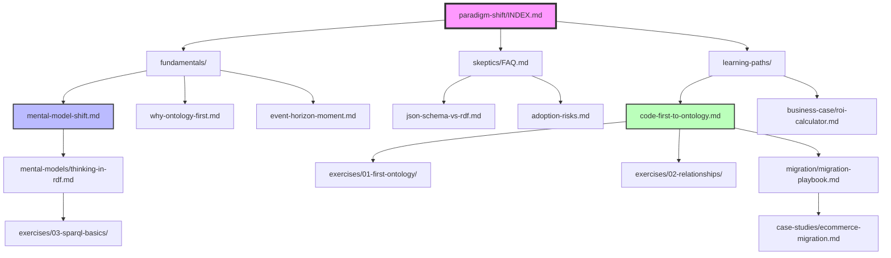

<!-- START doctoc generated TOC please keep comment here to allow auto update -->
<!-- DON'T EDIT THIS SECTION, INSTEAD RE-RUN doctoc TO UPDATE -->
**Table of Contents**

- [Crossing the Event Horizon: Documentation Architecture](#crossing-the-event-horizon-documentation-architecture)
  - [Executive Summary](#executive-summary)
  - [1. File Organization Structure](#1-file-organization-structure)
    - [1.1 Directory Hierarchy](#11-directory-hierarchy)
    - [1.2 Integration Points with Existing Documentation](#12-integration-points-with-existing-documentation)
  - [2. Document Hierarchy and Dependencies](#2-document-hierarchy-and-dependencies)
    - [2.1 Dependency Graph](#21-dependency-graph)
    - [2.2 Reading Order Prerequisites](#22-reading-order-prerequisites)
  - [3. Navigation Flow Design](#3-navigation-flow-design)
    - [3.1 Primary Entry Points](#31-primary-entry-points)
    - [3.2 Secondary Navigation Paths](#32-secondary-navigation-paths)
    - [3.3 Progressive Disclosure Pattern](#33-progressive-disclosure-pattern)
  - [4. Audience Level Delineation](#4-audience-level-delineation)
    - [4.1 Audience Segmentation](#41-audience-segmentation)
      - [4.1.1 Beginner (0-2 Weeks Experience)](#411-beginner-0-2-weeks-experience)
      - [4.1.2 Intermediate (2-8 Weeks Experience)](#412-intermediate-2-8-weeks-experience)
      - [4.1.3 Advanced (2+ Months Experience)](#413-advanced-2-months-experience)
    - [4.2 Audience-Specific Entry Points](#42-audience-specific-entry-points)
    - [4.3 Cross-Audience Navigation](#43-cross-audience-navigation)
  - [5. Content Guidelines and Standards](#5-content-guidelines-and-standards)
    - [5.1 Document Templates](#51-document-templates)
      - [5.1.1 Fundamentals Document Template](#511-fundamentals-document-template)
    - [Ontology-First Approach](#ontology-first-approach)
  - [Try It Yourself](#try-it-yourself)
  - [Common Confusions](#common-confusions)
    - ["Why can't I just use &#91;alternative&#93;?"](#why-cant-i-just-use-alternative)
    - ["This seems like over-engineering"](#this-seems-like-over-engineering)
  - [Next Steps](#next-steps)
  - [Further Reading](#further-reading)
  - [Common Mistakes](#common-mistakes)
    - [Mistake 1: &#91;Description&#93;](#mistake-1-description)
    - [Mistake 2: &#91;Description&#93;](#mistake-2-description)
  - [Solution](#solution)
  - [Reflection Questions](#reflection-questions)
  - [Next Exercise](#next-exercise)
    - [5.2 Writing Style Guidelines](#52-writing-style-guidelines)
      - [5.2.1 Tone by Audience](#521-tone-by-audience)
      - [5.2.2 Mandatory Elements](#522-mandatory-elements)
      - [5.2.3 Visual Design Standards](#523-visual-design-standards)
  - [6. Measurement and Validation](#6-measurement-and-validation)
    - [6.1 Documentation Effectiveness Metrics](#61-documentation-effectiveness-metrics)
    - [6.2 Validation Checkpoints](#62-validation-checkpoints)
    - [6.3 Success Criteria](#63-success-criteria)
  - [7. Implementation Roadmap](#7-implementation-roadmap)
    - [7.1 Phase 1: Critical Foundation (Week 1)](#71-phase-1-critical-foundation-week-1)
    - [7.2 Phase 2: Learning Scaffolding (Month 1)](#72-phase-2-learning-scaffolding-month-1)
    - [7.3 Phase 3: Deep Content (Months 2-3)](#73-phase-3-deep-content-months-2-3)
    - [7.4 Phase 4: Community and Mastery (Months 4-6)](#74-phase-4-community-and-mastery-months-4-6)
  - [8. Maintenance and Evolution](#8-maintenance-and-evolution)
    - [8.1 Continuous Improvement Process](#81-continuous-improvement-process)
    - [8.2 Versioning Strategy](#82-versioning-strategy)
  - [9. Risk Assessment and Mitigation](#9-risk-assessment-and-mitigation)
    - [9.1 Identified Risks](#91-identified-risks)
    - [9.2 Quality Assurance Checklist](#92-quality-assurance-checklist)
  - [10. Appendices](#10-appendices)
    - [Appendix A: Document Metadata Schema](#appendix-a-document-metadata-schema)
    - [Appendix B: Visual Design Assets](#appendix-b-visual-design-assets)
    - [Appendix C: Navigation Patterns from Existing Docs](#appendix-c-navigation-patterns-from-existing-docs)
    - [Appendix D: Content Creation Workflow](#appendix-d-content-creation-workflow)
  - [11. Conclusion](#11-conclusion)

<!-- END doctoc generated TOC please keep comment here to allow auto update -->

# Crossing the Event Horizon: Documentation Architecture

**Version**: 1.0
**Created**: 2026-01-24
**Status**: Design Specification
**Owner**: Documentation Team

---

## Executive Summary

This document specifies the complete documentation architecture for "Crossing the Event Horizon" - the paradigm shift from traditional code-first development to ggen's RDF-first, ontology-driven approach. The architecture addresses critical gaps identified in documentation review while maintaining consistency with ggen's Diataxis-aligned structure and production standards.

**Design Principles:**
1. **Progressive Disclosure**: Guide users from basic concepts to advanced mastery
2. **Explicit Paradigm Framing**: Make the mental model shift visible and navigable
3. **Practical Utility**: Every concept has 3+ concrete examples
4. **Resistance Management**: Address skepticism with evidence and empathy
5. **Integration First**: Seamless integration with existing documentation ecosystem

---

## 1. File Organization Structure

### 1.1 Directory Hierarchy

```
/docs/
├── paradigm-shift/                    # NEW: Core paradigm shift content
│   ├── INDEX.md                       # Entry point and navigation hub
│   ├── README.md                      # Quick start for paradigm shift docs
│   │
│   ├── fundamentals/                  # P0: Critical foundation concepts
│   │   ├── mental-model-shift.md      # Before/after thinking patterns
│   │   ├── event-horizon-moment.md    # The cognitive transformation
│   │   ├── why-ontology-first.md      # Core justification and benefits
│   │   ├── code-as-projection.md      # Key concept: code derives from ontology
│   │   └── single-source-truth.md     # Ontology as authoritative source
│   │
│   ├── skeptics/                      # P0: Resistance management
│   │   ├── FAQ.md                     # Common objections and answers
│   │   ├── json-schema-vs-rdf.md      # Direct comparison
│   │   ├── adoption-risks.md          # Risk mitigation strategies
│   │   ├── exit-strategy.md           # Vendor lock-in prevention
│   │   └── rdf-myth-busting.md        # Counter "RDF is dead" narrative
│   │
│   ├── learning-paths/                # P1: Structured progression
│   │   ├── code-first-to-ontology.md  # 4-week transformation program
│   │   ├── week-by-week-guide.md      # Detailed weekly milestones
│   │   ├── skill-matrix.md            # Required skills by phase
│   │   └── certification-path.md      # Mastery progression
│   │
│   ├── business-case/                 # P1: Organizational adoption
│   │   ├── roi-calculator.md          # Quantified benefits
│   │   ├── adoption-strategy.md       # Team onboarding playbook
│   │   ├── cost-benefit-analysis.md   # Investment justification
│   │   └── selling-to-your-team.md    # Stakeholder persuasion
│   │
│   ├── mental-models/                 # P2: Deep conceptual understanding
│   │   ├── thinking-in-rdf.md         # RDF mental frameworks
│   │   ├── triple-patterns.md         # Subject-Predicate-Object thinking
│   │   ├── semantic-types.md          # Beyond programming types
│   │   └── query-first-design.md      # SPARQL as design language
│   │
│   ├── anti-patterns/                 # P2: Common mistakes
│   │   ├── ontology-mistakes.md       # Design anti-patterns
│   │   ├── modeling-code-not-domain.md # Conceptual anti-pattern
│   │   ├── property-explosion.md      # Structural anti-pattern
│   │   └── over-generalization.md     # Abstraction anti-pattern
│   │
│   ├── case-studies/                  # P2: Real-world validation
│   │   ├── INDEX.md                   # Case study catalog
│   │   ├── ecommerce-migration.md     # Full migration example
│   │   ├── polyglot-api.md            # Multi-language generation
│   │   └── [future-case-studies].md   # Template for new stories
│   │
│   ├── migration/                     # P2: Transition guides
│   │   ├── migration-playbook.md      # Step-by-step migration
│   │   ├── phase-by-phase.md          # Incremental adoption
│   │   ├── legacy-integration.md      # Working with existing systems
│   │   └── rollback-strategy.md       # Safe experimentation
│   │
│   └── troubleshooting/               # P1: Common blockers
│       ├── mental-blocks.md           # Cognitive difficulties
│       ├── sparql-debugging.md        # Query troubleshooting
│       ├── generation-issues.md       # Code generation problems
│       └── common-confusions.md       # FAQ-style troubleshooting
│
├── exercises/                         # NEW: Hands-on practice
│   ├── README.md                      # Exercise series overview
│   ├── 01-first-ontology/             # Beginner: 3-class model
│   │   ├── README.md
│   │   ├── starter.ttl
│   │   ├── solution.ttl
│   │   └── test.sh
│   ├── 02-relationships/              # Beginner: Complex relationships
│   ├── 03-sparql-basics/              # Intermediate: Query fundamentals
│   ├── 04-sparql-advanced/            # Intermediate: JOIN, AGGREGATE
│   ├── 05-code-generation/            # Intermediate: Template customization
│   ├── 06-multi-language/             # Advanced: Polyglot generation
│   ├── 07-cloud-integration/          # Advanced: AWS/GCP/Azure
│   ├── 08-production-deployment/      # Advanced: CI/CD integration
│   └── capstone-project/              # Advanced: Complete CLI tool
│       ├── README.md
│       ├── requirements.md
│       ├── grading-rubric.md
│       └── reference-solution/
│
├── diataxis/                          # EXISTING: Diataxis structure
│   ├── tutorials/                     # Learning-oriented
│   │   └── paradigm-shift-intro.md    # NEW: 30-min paradigm intro
│   ├── how-to/                        # Task-oriented
│   │   ├── migrate-json-to-rdf.md     # NEW: JSON Schema migration
│   │   └── debug-ontology-code.md     # NEW: Debugging guide
│   ├── explanations/                  # Understanding-oriented
│   │   └── fundamentals/
│   │       └── paradigm-comparison.md # NEW: Deep comparison
│   └── reference/                     # Information-oriented
│       └── paradigm-glossary.md       # NEW: Terminology reference
│
├── getting-started/                   # EXISTING: Enhanced with paradigm
│   └── README.md                      # UPDATE: Add paradigm shift section
│
└── releases/v0.2.0/                   # EXISTING: Release docs
    └── INDEX.md                       # MODEL: Navigation pattern

```

### 1.2 Integration Points with Existing Documentation

**Cross-Reference Map:**

| Existing Doc | Integration Point | Action Required |
|--------------|-------------------|-----------------|
| `/docs/README.md` | Main entry point | Add "🚀 Start Here: Paradigm Shift" section |
| `/docs/getting-started/README.md` | Installation guide | Add "Before You Start: Mental Model Shift" prereq |
| root `CLAUDE.md` | Agent instructions | Authoritative; split into `CLAUDE-RUST.md` + `CLAUDE-ONTOLOGY.md` if needed |
| `/docs/explanations/ontology-driven.md` | Ontology basics | Link to paradigm-shift fundamentals |
| `/docs/tutorials/` | Hands-on guides | Add paradigm shift intro tutorial |
| `/docs/how-to/` | Task guides | Add migration and debugging guides |
| `/docs/reference/` | Technical reference | Add paradigm glossary |

---

## 2. Document Hierarchy and Dependencies

### 2.1 Dependency Graph



### 2.2 Reading Order Prerequisites

**Document Progression Matrix:**

| Document | Prerequisites | Estimated Time | Audience |
|----------|---------------|----------------|----------|
| `paradigm-shift/INDEX.md` | None | 5 min | Everyone |
| `fundamentals/mental-model-shift.md` | INDEX | 10 min | Beginner |
| `fundamentals/why-ontology-first.md` | mental-model-shift | 10 min | Beginner |
| `skeptics/FAQ.md` | why-ontology-first | 15 min | Beginner |
| `learning-paths/code-first-to-ontology.md` | All fundamentals | 30 min | Beginner |
| `exercises/01-first-ontology/` | learning-paths | 30 min hands-on | Beginner |
| `mental-models/thinking-in-rdf.md` | Week 1 complete | 20 min | Intermediate |
| `business-case/roi-calculator.md` | Any time | 15 min | Manager |
| `migration/migration-playbook.md` | Week 2 complete | 45 min | Advanced |
| `case-studies/ecommerce-migration.md` | migration-playbook | 30 min | Advanced |

---

## 3. Navigation Flow Design

### 3.1 Primary Entry Points

**For Different User Personas:**

```markdown
# paradigm-shift/INDEX.md

## 🚀 Start Here: Choose Your Path

### 👨‍💻 Developers New to Ontology-Driven Development
**Your 4-Week Journey:**
1. **Week 1**: [Mental Model Shift](fundamentals/mental-model-shift.md) (10 min) → [Why Ontology-First?](fundamentals/why-ontology-first.md) (10 min) → [Exercise: First Ontology](../exercises/01-first-ontology/) (30 min)
2. **Week 2**: [Thinking in RDF](mental-models/thinking-in-rdf.md) (20 min) → [SPARQL Basics](../exercises/03-sparql-basics/) (60 min)
3. **Week 3**: [Code Generation Patterns](../exercises/05-code-generation/) (90 min) → [Troubleshooting](troubleshooting/mental-blocks.md) (as needed)
4. **Week 4**: [Migration Playbook](migration/migration-playbook.md) (45 min) → [Capstone Project](../exercises/capstone-project/) (8 hours)

**Estimated Total: 20 hours over 4 weeks**

### 🤔 Skeptics: "Why Should I Care?"
**Quick Wins Path:**
1. **5 min**: [Why Not JSON Schema?](skeptics/json-schema-vs-rdf.md)
2. **10 min**: [ROI Calculator](business-case/roi-calculator.md) - See quantified benefits
3. **30 min**: [Exercise: First Ontology](../exercises/01-first-ontology/) - Try it yourself
4. **15 min**: [Success Stories](case-studies/INDEX.md) - Real teams, real metrics

**Decision Point: After 60 minutes, you'll know if this is for you**

### 👨‍💼 Managers: "How Do I Sell This?"
**Business Case Path:**
1. [ROI Calculator](business-case/roi-calculator.md) (15 min)
2. [Adoption Strategy](business-case/adoption-strategy.md) (20 min)
3. [Selling to Your Team](business-case/selling-to-your-team.md) (15 min)
4. [Case Studies](case-studies/INDEX.md) (30 min)

**Deliverable: Complete business case in 90 minutes**

### 🏗️ Architects: "How Does This Fit?"
**Integration Path:**
1. [Mental Model Shift](fundamentals/mental-model-shift.md) (10 min)
2. [Thinking in RDF](mental-models/thinking-in-rdf.md) (20 min)
3. [Migration Playbook](migration/migration-playbook.md) (45 min)
4. [Legacy Integration](migration/legacy-integration.md) (30 min)

**Deliverable: Architecture decision record in 2 hours**
```

### 3.2 Secondary Navigation Paths

**By Learning Style:**

```markdown
## Navigation by Learning Style

### 🎓 Academic Learners (Theory → Practice)
1. Fundamentals (all documents)
2. Mental Models (all documents)
3. Anti-Patterns (all documents)
4. Exercises (progressive series)

### 🛠️ Hands-On Learners (Practice → Theory)
1. Exercise 01: First Ontology (30 min)
2. Read: Mental Model Shift (when confused)
3. Exercise 02: Relationships (60 min)
4. Read: Thinking in RDF (when stuck)

### 📚 Story-Driven Learners (Examples → Principles)
1. Case Study: E-commerce Migration
2. Extract principles → Mental Model Shift
3. Try Exercise 01 with story context
4. Read FAQ when skeptical
```

### 3.3 Progressive Disclosure Pattern

**Information Density by Audience Level:**

| Level | Document Type | Example | Density |
|-------|---------------|---------|---------|
| **Beginner** | Fundamentals | `mental-model-shift.md` | Low (analogies, visuals) |
| **Beginner** | Skeptics | `FAQ.md` | Low (conversational, empathetic) |
| **Intermediate** | Mental Models | `thinking-in-rdf.md` | Medium (technical but explained) |
| **Intermediate** | Exercises | `03-sparql-basics/` | Medium (guided practice) |
| **Advanced** | Migration | `migration-playbook.md` | High (assumes background) |
| **Advanced** | Case Studies | `ecommerce-migration.md` | High (real-world complexity) |

---

## 4. Audience Level Delineation

### 4.1 Audience Segmentation

**Three Primary Audiences:**

#### 4.1.1 Beginner (0-2 Weeks Experience)

**Characteristics:**
- No RDF/SPARQL knowledge
- May be skeptical of ontology-driven approach
- Needs hand-holding and clear wins
- Concerned about learning curve

**Content Strategy:**
- **Fundamentals**: All required
- **Skeptics**: Address objections upfront
- **Learning Paths**: Week-by-week structure
- **Exercises**: 01-02 (simple, guided)
- **Tone**: Empathetic, celebratory of small wins
- **Examples**: 3+ per concept, very concrete

**Success Criteria:**
- [ ] Can explain "why ontology-first?" to colleague
- [ ] Has generated code in 2+ languages from same ontology
- [ ] Completed exercises 01-02 successfully
- [ ] Understands basic Turtle syntax
- [ ] Can write simple SPARQL SELECT query

#### 4.1.2 Intermediate (2-8 Weeks Experience)

**Characteristics:**
- Comfortable with RDF basics
- Has generated code successfully
- Ready for production patterns
- Needs performance/debugging guidance

**Content Strategy:**
- **Mental Models**: Deep RDF thinking
- **Exercises**: 03-06 (SPARQL, templates, polyglot)
- **Troubleshooting**: All sections
- **Migration**: Phase-by-phase approach
- **Tone**: Professional, assumes competence
- **Examples**: Fewer but more realistic

**Success Criteria:**
- [ ] Can design ontology for real project (10+ classes)
- [ ] Writes complex SPARQL (JOINs, aggregates, CONSTRUCT)
- [ ] Has customized generation templates
- [ ] Can debug ontology-to-code issues independently
- [ ] Completed exercises 03-06 successfully

#### 4.1.3 Advanced (2+ Months Experience)

**Characteristics:**
- Production deployment experience
- Thinks naturally in ontologies
- Ready to teach others
- Needs edge case guidance

**Content Strategy:**
- **Anti-Patterns**: Learn from mistakes
- **Case Studies**: Real-world complexity
- **Migration**: Full legacy integration
- **Exercises**: 07-08 + Capstone (cloud, production)
- **Tone**: Peer-to-peer, nuanced
- **Examples**: Minimal, assumes transfer

**Success Criteria:**
- [ ] Has deployed ontology-driven system to production
- [ ] Can architect migration for existing codebase
- [ ] Mentors others successfully
- [ ] Contributes to ontology design patterns
- [ ] Completed capstone project

### 4.2 Audience-Specific Entry Points

**Document-Level Audience Markers:**

Every document MUST include this front matter:

```markdown
---
audience: beginner | intermediate | advanced
prerequisites:
  - Document A
  - Document B
estimated_time: X minutes
hands_on: true | false
---

## Prerequisites

**Before reading this document, you should:**
- ✅ Understand [concept X](link)
- ✅ Have completed [exercise Y](link)
- ✅ Be comfortable with [tool Z]

**If you don't have these prerequisites, start here:** [link to beginner path]
```

### 4.3 Cross-Audience Navigation

**Bridging Documents:**

| Beginner Doc | Bridge | Intermediate Doc |
|--------------|--------|------------------|
| `fundamentals/mental-model-shift.md` | → Complete exercises 01-02 → | `mental-models/thinking-in-rdf.md` |
| `skeptics/FAQ.md` | → Try first generation → | `troubleshooting/generation-issues.md` |
| `learning-paths/week-by-week.md` (Week 2) | → Comfortable with SPARQL → | `migration/migration-playbook.md` |

| Intermediate Doc | Bridge | Advanced Doc |
|------------------|--------|--------------|
| `mental-models/thinking-in-rdf.md` | → Production deployment → | `anti-patterns/ontology-mistakes.md` |
| `exercises/05-code-generation/` | → CI/CD integration → | `exercises/08-production-deployment/` |
| `troubleshooting/sparql-debugging.md` | → Mentoring team → | `case-studies/ecommerce-migration.md` |

---

## 5. Content Guidelines and Standards

### 5.1 Document Templates

#### 5.1.1 Fundamentals Document Template

```markdown
---
title: [Concept Name]
audience: beginner
prerequisites:
  - [Prior concept]
estimated_time: X minutes
hands_on: false
---

# [Concept Name]

**TL;DR**: [One-sentence summary]

**Key Takeaway**: [The "aha moment" this document delivers]

---

## What You're Used To (Traditional Approach)

[3-5 bullet points describing familiar patterns]

**Mental Model**: [Diagram or analogy]

**Pain Points**:
- [Common problem 1]
- [Common problem 2]

---

## What ggen Does (Ontology-First Approach)

[3-5 bullet points describing new patterns]

**Mental Model**: [Diagram or analogy showing contrast]

**Benefits**:
- [Concrete benefit 1 with metric if possible]
- [Concrete benefit 2 with metric if possible]

---

## The "Event Horizon" Moment

**You'll know you've crossed when:**
> [Quote or realization that signals understanding]

**Common reactions:**
- ✅ "Wait, this feels backwards but makes sense"
- ✅ "I just generated the same model in 3 languages"
- ❌ "This is too complex" → [Link to skeptics FAQ]

---

## Concrete Example

### Traditional Approach
```[language]
// Code example showing old way
```

### Ontology-First Approach
```turtle
# Ontology defining the same concept
```

```[language-1]
// Generated code in language 1
```

```[language-2]
// Generated code in language 2
```

**What Changed**:
1. [Specific difference 1]
2. [Specific difference 2]

---

## Try It Yourself

**Exercise**: [Link to hands-on exercise]

**Expected Time**: X minutes

**Success Criteria**: [Observable outcome]

---

## Common Confusions

### "Why can't I just use [alternative]?"

[Answer with empathy and evidence]

### "This seems like over-engineering"

[Address concern with ROI data]

---

## Next Steps

**If this makes sense**: → [Next document in learning path]

**If you're skeptical**: → [Skeptics FAQ section]

**If you want to try it**: → [Hands-on exercise]

---

## Further Reading

- [Related concept A]
- [Related concept B]
- [External resource with context]
```

#### 5.1.2 Exercise Template

```markdown
---
title: Exercise [Number]: [Name]
difficulty: beginner | intermediate | advanced
prerequisites:
  - [Prior exercise or concept]
estimated_time: X minutes
learning_objectives:
  - [Objective 1]
  - [Objective 2]
---

# Exercise [Number]: [Name]

## Learning Objectives

By the end of this exercise, you will be able to:
- [ ] [Observable skill 1]
- [ ] [Observable skill 2]
- [ ] [Observable skill 3]

---

## Background

**Context**: [Why this exercise matters]

**Real-World Use Case**: [Practical application]

---

## Instructions

### Part 1: [Step Name] (X minutes)

**Goal**: [What you'll accomplish]

1. [Specific instruction]
2. [Specific instruction]
3. [Specific instruction]

**Checkpoint**: [How to verify success]

### Part 2: [Step Name] (X minutes)

**Goal**: [What you'll accomplish]

1. [Specific instruction]
2. [Specific instruction]

**Checkpoint**: [How to verify success]

---

## Verification

Run the test script to verify your solution:

```bash
./test.sh
```

**Expected Output**:
```
✓ Test 1: [Description]
✓ Test 2: [Description]
✓ Test 3: [Description]

All tests passed! You completed the exercise.
```

---

## Common Mistakes

### Mistake 1: [Description]

**Symptom**: [What you'll see]

**Fix**: [How to correct it]

### Mistake 2: [Description]

**Symptom**: [What you'll see]

**Fix**: [How to correct it]

---

## Solution

**If you're stuck, see:** [Link to solution file]

**Note**: Try for at least 30 minutes before checking the solution.

---

## Reflection Questions

1. [Question prompting deeper understanding]
2. [Question connecting to real-world use]
3. [Question anticipating next exercise]

---

## Next Exercise

**Ready for more?** → [Next exercise in series]

**Want to understand the theory?** → [Related fundamentals doc]
```

#### 5.1.3 Case Study Template

```markdown
---
title: "Case Study: [Project Name]"
company: [Company or Anonymized Name]
industry: [Industry]
team_size: [Number]
timeline: [Duration]
technologies: [List]
audience: advanced
---

# Case Study: [Project Name]

**Industry**: [Industry]
**Team**: [Size and composition]
**Timeline**: [Duration]
**Technology Stack**: [Before and after]

---

## Context

### Business Problem

[1-2 paragraphs describing the pain point]

**Key Challenges**:
- [Challenge 1]
- [Challenge 2]
- [Challenge 3]

### Pre-Ontology State

**Architecture**: [Description]

**Pain Points**:
- [Metric: e.g., "40 hours/week on model sync"]
- [Metric: e.g., "15% of bugs from model drift"]

---

## Ontology-Driven Solution

### Week 1: Foundation

**Activities**:
1. [Specific action]
2. [Specific action]

**Deliverables**:
- [Artifact created]
- [Metric achieved]

### Week 2-4: Implementation

**Activities**:
1. [Specific action]
2. [Specific action]

**Challenges Encountered**:
- [Challenge and how it was resolved]

### Week 5-8: Deployment

**Activities**:
1. [Specific action]
2. [Specific action]

**Results**:
- [Metric: e.g., "35 hours/week saved"]
- [Metric: e.g., "90% reduction in model drift bugs"]

---

## Key Decisions

### Decision 1: [Title]

**Context**: [Why this decision was needed]

**Options Considered**:
1. [Option A - pros/cons]
2. [Option B - pros/cons]

**Chosen**: [Selected option]

**Outcome**: [Result of decision]

---

## Lessons Learned

### What Worked Well

1. [Success 1 with details]
2. [Success 2 with details]

### What We'd Do Differently

1. [Improvement 1]
2. [Improvement 2]

### Advice for Others

1. [Recommendation 1]
2. [Recommendation 2]

---

## Quantified Results

| Metric | Before | After | Improvement |
|--------|--------|-------|-------------|
| [Metric 1] | X | Y | Z% |
| [Metric 2] | X | Y | Z% |
| [Metric 3] | X | Y | Z% |

**ROI**: [Calculation with time period]

---

## Technical Deep Dive

### Ontology Design

[Excerpt of ontology with annotations]

### Generation Pipeline

[Description of how code is generated]

### CI/CD Integration

[How ontology validation and generation fit into pipeline]

---

## Applicability

**This approach works well for:**
- [Scenario 1]
- [Scenario 2]

**This approach may not fit:**
- [Anti-scenario 1]
- [Anti-scenario 2]

---

## Contact

**Questions about this case study?** [Contact info or link]
```

### 5.2 Writing Style Guidelines

#### 5.2.1 Tone by Audience

| Audience | Tone | Example Phrase |
|----------|------|----------------|
| **Beginner** | Empathetic, celebratory | "If this feels backwards, you're on the right track!" |
| **Intermediate** | Professional, supportive | "Let's tackle complex SPARQL queries with confidence" |
| **Advanced** | Peer-to-peer, nuanced | "Consider the trade-offs between normalization and query performance" |

#### 5.2.2 Mandatory Elements

**Every document MUST include:**

1. **TL;DR at top** (1 sentence)
2. **Prerequisites section** (with links)
3. **Estimated time** (reading + hands-on if applicable)
4. **Concrete examples** (minimum 3 per concept)
5. **Next steps** (clear navigation)
6. **Common confusions** (address proactively)

#### 5.2.3 Visual Design Standards

**Required Visual Elements:**

1. **Mental Model Diagrams**
   - Before/after comparison (traditional vs ontology-first)
   - Event horizon as conceptual boundary
   - Information flow (ontology → code)

2. **Code Examples**
   - Syntax highlighted
   - Annotated with comments explaining "why"
   - Comparison blocks (traditional vs ontology-first)

3. **Checkpoints**
   - 🟢 "You'll know you understand when..."
   - 🟡 "If you're confused about..."
   - 🔴 "Red flag: Stop if..."

4. **Progress Indicators**
   - `[ ] Task checklist` for exercises
   - `[Beginner|Intermediate|Advanced]` badges
   - `✅ Completed` vs `⏳ In Progress` markers

---

## 6. Measurement and Validation

### 6.1 Documentation Effectiveness Metrics

**Quantitative Metrics:**

| Metric | Target | Measurement Method |
|--------|--------|-------------------|
| **Time to First Generation** | <2 hours | Track from doc start to successful multi-language generation |
| **Abandonment Rate** | <20% | % of users who start tutorial but don't complete |
| **Exercise Completion Rate** | >80% | % who finish each exercise in series |
| **Feedback Score** | >4.5/5 | Survey after completing learning path |

**Qualitative Metrics:**

- **"Aha Moment" Timing**: Survey when users report cognitive shift
- **Most Confusing Topics**: Track Discord/GitHub questions by doc section
- **Missing Content Requests**: Catalog documentation gaps users report

### 6.2 Validation Checkpoints

**Before Publishing Documentation:**

- [ ] **Beginner Testing**: 3 developers with zero RDF knowledge complete learning path
- [ ] **Time Validation**: Estimated times verified with actual completion data
- [ ] **Example Verification**: All code examples run successfully
- [ ] **Link Checking**: All internal links resolve correctly
- [ ] **Prerequisite Verification**: Dependency graph is acyclic
- [ ] **Consistency Audit**: Terminology consistent across all docs

**Post-Publication Monitoring:**

- [ ] **Weekly**: Review GitHub issues tagged `documentation`
- [ ] **Monthly**: Analyze top 10 Discord questions → Create docs addressing gaps
- [ ] **Quarterly**: User survey on documentation effectiveness
- [ ] **Annually**: Full documentation audit and refresh

### 6.3 Success Criteria

**Documentation is successful when:**

1. **80% of new users** can articulate "why ontology-first?" within 1 week
2. **Time to first generation**: <2 hours (90th percentile)
3. **Support tickets**: 80% bugs, 20% concepts (indicates docs work)
4. **User testimonials**: "I can't imagine going back to code-first"
5. **Organic growth**: Users recommending ggen based on paradigm shift understanding

---

## 7. Implementation Roadmap

### 7.1 Phase 1: Critical Foundation (Week 1)

**P0 Documents - Blocking Adoption:**

| Document | Owner | Estimated Effort | Dependencies |
|----------|-------|------------------|--------------|
| `paradigm-shift/INDEX.md` | Doc Lead | 4 hours | None |
| `fundamentals/mental-model-shift.md` | Doc Lead | 8 hours | INDEX |
| `fundamentals/why-ontology-first.md` | Doc Lead | 6 hours | mental-model-shift |
| `skeptics/FAQ.md` | Doc Lead + Reviewer | 8 hours | why-ontology-first |
| Update `docs/README.md` | Doc Lead | 2 hours | INDEX |

**Deliverables:**
- ✅ Paradigm shift entry point live
- ✅ Core mental model explained
- ✅ Skepticism addressed
- ✅ Main documentation updated with paradigm links

**Validation:**
- [ ] 3 beginner users complete reading in <30 minutes
- [ ] Users can explain "event horizon" concept
- [ ] At least 1 objection from FAQ resonates with each tester

### 7.2 Phase 2: Learning Scaffolding (Month 1)

**P1 Documents - Reducing Friction:**

| Document | Owner | Estimated Effort | Dependencies |
|----------|-------|------------------|--------------|
| `learning-paths/code-first-to-ontology.md` | Doc Lead | 12 hours | All fundamentals |
| `exercises/01-first-ontology/` | Exercise Lead | 8 hours | learning-paths |
| `exercises/02-relationships/` | Exercise Lead | 10 hours | 01 complete |
| `troubleshooting/mental-blocks.md` | Doc Lead | 6 hours | Learning path feedback |
| `business-case/roi-calculator.md` | Business Analyst | 8 hours | Real metrics |

**Deliverables:**
- ✅ 4-week learning path defined
- ✅ First 2 exercises with automated tests
- ✅ Troubleshooting guide for common issues
- ✅ Quantified business case

**Validation:**
- [ ] 5 users complete 4-week path successfully
- [ ] Exercise completion rate >80%
- [ ] Users report "aha moment" by Week 2
- [ ] Managers can build business case from ROI doc

### 7.3 Phase 3: Deep Content (Months 2-3)

**P2 Documents - Improving Experience:**

| Document | Owner | Estimated Effort | Dependencies |
|----------|-------|------------------|--------------|
| `mental-models/thinking-in-rdf.md` | RDF Expert | 10 hours | Month 1 complete |
| `anti-patterns/ontology-mistakes.md` | Senior Developer | 8 hours | User feedback |
| `migration/migration-playbook.md` | Migration Lead | 16 hours | Case studies |
| `case-studies/ecommerce-migration.md` | Case Study Writer | 12 hours | Real project |
| `exercises/03-sparql-basics/` through `06` | Exercise Lead | 40 hours | Progressive |

**Deliverables:**
- ✅ Deep RDF mental models explained
- ✅ Common mistakes documented
- ✅ Migration playbook with real examples
- ✅ First case study published
- ✅ Full exercise series (01-06) complete

**Validation:**
- [ ] Intermediate users report deep understanding
- [ ] Migration playbook used successfully by 2+ teams
- [ ] Case study metrics verified and realistic
- [ ] Exercise 06 completion rate >70%

### 7.4 Phase 4: Community and Mastery (Months 4-6)

**Advanced Content and Iteration:**

| Document | Owner | Estimated Effort | Dependencies |
|----------|-------|------------------|--------------|
| `exercises/07-cloud-integration/` | Cloud Expert | 12 hours | AWS/GCP/Azure |
| `exercises/08-production-deployment/` | DevOps Lead | 16 hours | CI/CD integration |
| `exercises/capstone-project/` | Project Lead | 24 hours | All exercises |
| Additional case studies (3-5) | Case Study Team | 40 hours | Real projects |
| 30-Day Challenge program | Program Manager | 30 hours | Community building |

**Deliverables:**
- ✅ Full exercise series (01-08 + capstone) complete
- ✅ 3-5 case studies with verified metrics
- ✅ 30-Day Challenge with community support
- ✅ Documentation iteration based on user feedback

**Validation:**
- [ ] 10+ users complete capstone project
- [ ] Case studies cover 3+ industries
- [ ] 30-Day Challenge has 50+ participants
- [ ] Documentation feedback score >4.5/5

---

## 8. Maintenance and Evolution

### 8.1 Continuous Improvement Process

**Monthly Review Cycle:**

1. **Week 1**: Collect feedback (GitHub issues, Discord, surveys)
2. **Week 2**: Analyze patterns (most confused topics, missing content)
3. **Week 3**: Create/update documentation addressing gaps
4. **Week 4**: Publish updates and notify users

**Quarterly Audit:**

- [ ] Link integrity check (all links resolve)
- [ ] Example verification (all code runs)
- [ ] Metric updates (refresh ROI data with actual results)
- [ ] Terminology consistency (audit for drift)

**Annual Refresh:**

- [ ] Full documentation review by external expert
- [ ] User journey testing with new beginners
- [ ] Comparison with industry standards (Stripe, Tailwind docs)
- [ ] Major version update if paradigm evolves

### 8.2 Versioning Strategy

**Documentation Versions Aligned with ggen Releases:**

| ggen Version | Paradigm Shift Docs Version | Notes |
|--------------|----------------------------|-------|
| v0.2.0 | v1.0 (this architecture) | Initial paradigm shift documentation |
| v0.3.0 | v1.1 | Update for SPARQL 1.2 features |
| v0.4.0 | v1.2 | Add OWL reasoning concepts |
| v1.0.0 | v2.0 | Major refresh with production metrics |

**Archive Strategy:**

- Deprecated docs moved to `/docs/archive/paradigm-shift/vX.Y/`
- Redirect pages for old URLs explaining version change
- Changelog documenting what changed between versions

---

## 9. Risk Assessment and Mitigation

### 9.1 Identified Risks

| Risk | Likelihood | Impact | Mitigation |
|------|------------|--------|------------|
| **Over-abstraction**: Docs too philosophical, not practical | Medium | High | Mandate 3+ concrete examples per concept |
| **Learning curve discouragement**: 4-week path scares users | High | High | Celebrate small wins, show quick ROI calculator first |
| **Missing simplicity narrative**: RDF seems complex | Medium | Medium | Add "Easy vs Simple" section to FAQ |
| **Lack of undo path**: Teams fear commitment | Low | Medium | Document exit strategy prominently |
| **Cultural mismatch**: Docs assume individual, not team | Medium | High | Add team adoption and stakeholder guides |
| **Stale case studies**: Metrics become outdated | High | Low | Quarterly refresh with real data |
| **Documentation fragmentation**: 200+ existing docs confuse | High | High | Create comprehensive INDEX.md with clear paths |

### 9.2 Quality Assurance Checklist

**Before Publishing Any Document:**

- [ ] **Audience Check**: Correct difficulty level and prerequisites
- [ ] **Example Verification**: All code examples tested and working
- [ ] **Time Validation**: Estimated time matches actual completion
- [ ] **Link Verification**: All links resolve correctly
- [ ] **Tone Audit**: Writing style matches audience level
- [ ] **Visual Elements**: Diagrams, checkpoints, and badges present
- [ ] **Prerequisite Dependencies**: Reading order makes sense
- [ ] **Next Steps**: Clear navigation to related content
- [ ] **Common Confusions**: Proactively addressed
- [ ] **Beginner Testing**: 3 users with zero RDF knowledge review

---

## 10. Appendices

### Appendix A: Document Metadata Schema

**Every document MUST include this YAML front matter:**

```yaml
---
title: "Document Title"
version: 1.0
last_updated: 2026-01-24
audience: beginner | intermediate | advanced
prerequisites:
  - "Document 1"
  - "Document 2"
estimated_time: "X minutes"
hands_on: true | false
learning_objectives:
  - "Objective 1"
  - "Objective 2"
tags:
  - "mental-models"
  - "rdf"
  - "paradigm-shift"
difficulty_level: 1-5
completion_criteria:
  - "Can articulate X"
  - "Has completed Y"
related_docs:
  - "Related Document 1"
  - "Related Document 2"
---
```

### Appendix B: Visual Design Assets

**Required Diagrams:**

1. **Event Horizon Visual** (`/docs/assets/event-horizon.svg`)
   - Visual metaphor for paradigm shift
   - Before/after comparison
   - Used in `fundamentals/event-horizon-moment.md`

2. **Code-First vs Ontology-First Architecture** (`/docs/assets/architecture-comparison.svg`)
   - N-way sync nightmare (code-first)
   - Single source radiating (ontology-first)
   - Used in `fundamentals/why-ontology-first.md`

3. **Learning Path Roadmap** (`/docs/assets/learning-roadmap.svg`)
   - 4-week timeline with milestones
   - Checkpoints and aha moments
   - Used in `learning-paths/code-first-to-ontology.md`

4. **RDF Triple Pattern** (`/docs/assets/triple-pattern.svg`)
   - Subject-Predicate-Object visualization
   - Comparison to property access
   - Used in `mental-models/thinking-in-rdf.md`

### Appendix C: Navigation Patterns from Existing Docs

**Model: `/docs/releases/v0.2.0/INDEX.md`**

**Successful Patterns to Replicate:**

1. **Quick Navigation Section**: Links by user role
2. **Document Overview Table**: Purpose, audience, read time
3. **Reading Guide by Role**: Persona-specific paths
4. **FAQ Section**: Common questions with concise answers
5. **Checklist for Getting Started**: Step-by-step with time estimates

**Apply to Paradigm Shift INDEX:**

```markdown
# Crossing the Event Horizon: Index

## Quick Navigation

### For Users Getting Started
1. [Mental Model Shift](fundamentals/mental-model-shift.md)
2. [Why Ontology-First?](fundamentals/why-ontology-first.md)
3. [Exercise: First Ontology](../exercises/01-first-ontology/)

### For Understanding the Paradigm
- [Event Horizon Moment](fundamentals/event-horizon-moment.md)
- [Thinking in RDF](mental-models/thinking-in-rdf.md)
- [Case Studies](case-studies/INDEX.md)

## Document Overview

| Document | Purpose | Audience | Read Time |
|----------|---------|----------|-----------|
| mental-model-shift.md | Core paradigm explanation | Beginner | 10 min |
| why-ontology-first.md | Justification and benefits | Beginner | 10 min |
| FAQ.md | Address skepticism | Everyone | 15 min |
| ...

## Reading Guide by Role

### 👨‍💻 Developer (New to RDF)
1. Start: Mental Model Shift (10 min)
2. Then: Why Ontology-First? (10 min)
3. Finally: Exercise 01 (30 min hands-on)

### 👨‍💼 Manager (Evaluating Adoption)
1. ROI Calculator (15 min)
2. Case Studies (30 min)
3. Adoption Strategy (20 min)

## Frequently Asked Questions

### Q: How long does it take to learn?
**A:** 4 weeks for basic proficiency, 3 months for production deployment.

### Q: Is this worth the investment?
**A:** See [ROI Calculator](business-case/roi-calculator.md) for quantified benefits.
```

### Appendix D: Content Creation Workflow

**Standard Operating Procedure for New Documents:**

1. **Draft Document** (Author)
   - Use appropriate template (fundamentals/exercise/case study)
   - Include all required metadata
   - Add 3+ concrete examples per concept
   - Verify prerequisites are published

2. **Self-Review** (Author)
   - Run through QA checklist
   - Verify all code examples work
   - Check estimated time with timer
   - Ensure links resolve

3. **Peer Review** (Reviewer)
   - Validate audience level is correct
   - Confirm prerequisites are sufficient
   - Test hands-on exercises
   - Check for gaps in common confusions section

4. **Beginner Testing** (3 Zero-Knowledge Users)
   - Complete document following instructions
   - Note confusion points
   - Verify time estimates
   - Provide feedback on clarity

5. **Iteration** (Author)
   - Address all feedback
   - Add clarifications for confusion points
   - Update time estimates if needed
   - Re-run QA checklist

6. **Publication** (Doc Lead)
   - Add to INDEX.md navigation
   - Update prerequisite documents with "Next Steps" link
   - Announce in Discord/GitHub
   - Add to metrics tracking

7. **Monitoring** (Ongoing)
   - Track completion rates
   - Monitor questions in Discord
   - Update quarterly based on feedback
   - Archive if replaced by new version

---

## 11. Conclusion

This documentation architecture provides a comprehensive, navigable, and maintainable structure for guiding developers through the paradigm shift from code-first to ontology-driven development. By addressing identified gaps with progressive disclosure, audience-specific paths, and concrete examples, we enable successful adoption of ggen's RDF-first methodology.

**Key Success Factors:**

1. **Explicit Paradigm Framing**: Mental model shift made visible
2. **Resistance Management**: Skepticism addressed with evidence
3. **Progressive Learning**: 4-week path with hands-on exercises
4. **Business Case**: Quantified ROI for organizational buy-in
5. **Integration**: Seamless fit with existing Diataxis structure

**Measurement of Success:**

- 80% of users articulate "why ontology-first?" within 1 week
- <2 hour time to first multi-language generation
- >4.5/5 documentation feedback score
- 80% bugs vs 20% concept questions (indicates docs work)

**Next Steps:**

1. Review and approve this architecture
2. Begin Phase 1 implementation (Week 1)
3. Recruit beginner testers for validation
4. Iterate based on real user feedback

---

**Document Version**: 1.0
**Last Updated**: 2026-01-24
**Next Review**: After Phase 1 completion
**Owner**: Documentation Team
**Approvers**: Project Lead, Senior Developers, UX Lead
