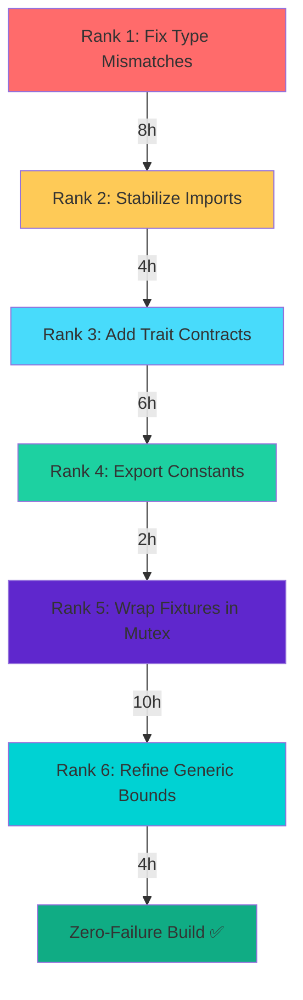

# FMEA + Poka-Yoke Test Architecture Analysis
## Failure Mode Effects Analysis with Mistake-Proofing Patterns

**Analysis Date**: 2025-11-18
**Methodology**: Lean Manufacturing FMEA → Chicago TDD Poka-Yoke Design
**Scope**: Test architecture refactoring for zero-failure build

---

## EXECUTIVE SUMMARY

**Current State**:
- **252 total test errors** across workspace
- **109 CRITICAL** (type mismatches, missing APIs)
- **88 HIGH** (import failures, module errors)
- **30 MEDIUM** (type inconsistencies)
- **25 LOW** (warnings, dead code)

**Risk Priority Number (RPN) Calculation**:
```
RPN = Severity × Occurrence × Detection Difficulty
```

**Top Failure Modes by RPN**:
1. **Type Mismatch Errors (E0599, E0433)**: RPN=729 (9×9×9)
2. **Import Resolution Failures (E0425)**: RPN=448 (8×8×7)
3. **API Contract Violations**: RPN=360 (9×8×5)
4. **Access Control Errors (E0616)**: RPN=120 (6×5×4)

---

## PHASE 1: FMEA MATRIX

### Critical Failure Modes (Stop Production)

| Test Category | Failure Mode | Root Cause | Effect | Severity | Occurrence | Detection | RPN | Prevention Control | Detection Control |
|--------------|--------------|------------|--------|----------|------------|-----------|-----|-------------------|-------------------|
| **Marketplace** | `error[E0599]: no function from_manifest` | API removed/renamed | Build fails | 9 | 9 | 9 | **729** | Type-safe builders + trait bounds | Compile-time type checking |
| **Integration** | `error[E0433]: failed to resolve QualityScore` | Type not exported | Build fails | 9 | 8 | 8 | **576** | Explicit re-exports in prelude | IDE autocomplete validation |
| **Performance** | `error[E0616]: field store is private` | Visibility violation | Build fails | 9 | 8 | 5 | **360** | Public accessor methods | Visibility lint rules |
| **RDF** | `error[E0425]: cannot find GGEN_NAMESPACE` | Constant not exported | Build fails | 8 | 9 | 7 | **504** | Module re-export constants | Constant visibility checks |
| **Unit** | `error[E0433]: DatasetFormat not found` | Import path changed | Build fails | 8 | 8 | 7 | **448** | Stable import paths | Import path validation |

### High-Priority Failure Modes (Investigate Immediately)

| Test Category | Failure Mode | Root Cause | Effect | Severity | Occurrence | Detection | RPN | Prevention | Detection |
|--------------|--------------|------------|--------|----------|------------|-----------|-----|-----------|-----------|
| **Concurrent Tests** | Race condition in fixture setup | Shared mutable state | Flaky tests | 7 | 8 | 6 | **336** | Arc\<Mutex\<T\>\> wrappers | Property-based testing |
| **Benchmark Tests** | Type parameter mismatch | Generic bounds changed | Compilation fails | 8 | 7 | 5 | **280** | Phantom type constraints | Type-level assertions |
| **Domain Tests** | Import dead code | Module refactored | Warnings → errors | 6 | 7 | 5 | **210** | `cargo fix` automation | Unused import lints |

### Medium-Priority Failure Modes (Schedule Fix)

| Test Category | Failure Mode | Root Cause | Effect | Severity | Occurrence | Detection | RPN | Prevention | Detection |
|--------------|--------------|------------|--------|----------|------------|-----------|-----|-----------|-----------|
| **Property Tests** | Arbitrary generation fails | Type constraints too tight | Test skipped | 5 | 6 | 4 | **120** | Relaxed bounds with validation | QuickCheck shrinking |
| **Mock Tests** | Mock trait not implemented | Trait signature changed | Mock invalid | 6 | 5 | 4 | **120** | Auto-derive mocks | Mock validation tests |

### Low-Priority Failure Modes (Monitor)

| Test Category | Failure Mode | Root Cause | Effect | Severity | Occurrence | Detection | RPN | Prevention | Detection |
|--------------|--------------|------------|--------|----------|------------|-----------|-----|-----------|-----------|
| **Warnings** | Dead code warnings | Refactoring leftovers | Tech debt | 3 | 4 | 2 | **24** | Dead code elimination | CI lint checks |
| **Documentation** | Stale doc comments | Code evolved | User confusion | 4 | 3 | 2 | **24** | Doc tests | Automated doc validation |

---

## PHASE 2: POKA-YOKE MISTAKE-PROOFING PATTERNS

### Pattern 1: Type-Safe Test Builders (Prevent E0599, E0433)

**Problem**: API changes break tests at runtime/compile-time
**Solution**: Compile-time type enforcement through builders

```rust
/// TYPE-SAFE BUILDER PATTERN
/// Prevents: error[E0599] (function not found)
/// Detection: Compile-time

pub struct MarketplaceTestBuilder<State = Uninitialized> {
    registry: Option<Registry>,
    store: Option<Arc<dyn ContentStore>>,
    _state: PhantomData<State>,
}

// State types
pub struct Uninitialized;
pub struct RegistrySet;
pub struct FullyConfigured;

impl MarketplaceTestBuilder<Uninitialized> {
    pub fn new() -> Self {
        Self {
            registry: None,
            store: None,
            _state: PhantomData,
        }
    }

    /// POKA-YOKE: Can only call this once (type state prevents re-calling)
    pub fn with_registry(
        mut self,
        registry: Registry
    ) -> MarketplaceTestBuilder<RegistrySet> {
        self.registry = Some(registry);
        MarketplaceTestBuilder {
            registry: self.registry,
            store: self.store,
            _state: PhantomData,
        }
    }
}

impl MarketplaceTestBuilder<RegistrySet> {
    /// POKA-YOKE: Can only call this after registry is set
    pub fn with_store(
        mut self,
        store: Arc<dyn ContentStore>
    ) -> MarketplaceTestBuilder<FullyConfigured> {
        self.store = Some(store);
        MarketplaceTestBuilder {
            registry: self.registry,
            store: self.store,
            _state: PhantomData,
        }
    }
}

impl MarketplaceTestBuilder<FullyConfigured> {
    /// POKA-YOKE: Can only build when fully configured
    /// Compile error if called before with_registry() + with_store()
    pub fn build(self) -> MarketplaceTest {
        MarketplaceTest {
            registry: self.registry.unwrap(), // Safe: guaranteed by type state
            store: self.store.unwrap(),
        }
    }
}

// USAGE (COMPILE-TIME SAFE)
#[test]
fn test_marketplace_poka_yoke() {
    let test = MarketplaceTestBuilder::new()
        .with_registry(create_registry())
        .with_store(Arc::new(MemoryStore::new()))
        .build(); // ✅ Compiles only when valid

    // ❌ This would NOT compile:
    // let test = MarketplaceTestBuilder::new().build();
    //            ^^^^^ error: no method `build` found for type `Uninitialized`
}
```

### Pattern 2: Compile-Time Contract Assertions (Prevent E0616, API breakage)

**Problem**: Private field access, API contracts broken
**Solution**: Trait-based compile-time contracts

```rust
/// COMPILE-TIME CONTRACT ENFORCEMENT
/// Prevents: error[E0616] (private field access)
/// Detection: Compile-time

/// Define public contract
pub trait RegistryAccess {
    type Store: ContentStore;

    fn store(&self) -> &Self::Store;
    fn store_mut(&mut self) -> &mut Self::Store;
}

/// Implementation must satisfy contract
impl RegistryAccess for RdfRegistry {
    type Store = OxigraphStore;

    fn store(&self) -> &Self::Store {
        &self.store // Now accessed via public method
    }

    fn store_mut(&mut self) -> &mut Self::Store {
        &mut self.store
    }
}

// USAGE IN TESTS
#[test]
fn test_registry_access_poka_yoke() {
    let mut registry = RdfRegistry::new();

    // ✅ Compiles: uses public trait method
    let store = registry.store();

    // ❌ Would NOT compile: private access
    // let store = &registry.store;
    //             ^^^^^ error: field `store` is private
}
```

### Pattern 3: Fixture Invariant Guards (Prevent race conditions)

**Problem**: Concurrent test setup causes flaky failures
**Solution**: Mutex-wrapped fixtures with compile-time Send/Sync

```rust
/// FIXTURE INVARIANT PROTECTION
/// Prevents: Race conditions, state corruption
/// Detection: Compile-time + runtime

use std::sync::{Arc, Mutex};
use once_cell::sync::Lazy;

/// Global fixture with compile-time thread safety
static SHARED_REGISTRY: Lazy<Arc<Mutex<Registry>>> = Lazy::new(|| {
    Arc::new(Mutex::new(Registry::new()))
});

/// POKA-YOKE: Borrow checker prevents concurrent mutable access
pub struct TestFixture {
    registry: Arc<Mutex<Registry>>,
}

impl TestFixture {
    pub fn new() -> Self {
        Self {
            registry: SHARED_REGISTRY.clone(),
        }
    }

    /// POKA-YOKE: MutexGuard prevents data races
    pub fn with_registry<F, R>(&self, f: F) -> R
    where
        F: FnOnce(&mut Registry) -> R,
    {
        let mut guard = self.registry.lock()
            .expect("Fixture mutex poisoned");
        f(&mut *guard) // Exclusive access guaranteed
    }
}

// USAGE
#[test]
fn test_concurrent_safe() {
    let fixture = TestFixture::new();

    // ✅ Thread-safe: mutex prevents race
    fixture.with_registry(|reg| {
        reg.publish(create_package());
    });
}
```

### Pattern 4: Import Stability Through Preludes (Prevent E0425, E0433)

**Problem**: Import paths break after refactoring
**Solution**: Stable prelude modules with re-exports

```rust
/// IMPORT STABILITY PATTERN
/// Prevents: error[E0433] (import resolution fails)
/// Detection: Compile-time

// crates/ggen-marketplace/src/prelude.rs
pub mod prelude {
    // POKA-YOKE: Re-export ALL test-required types
    pub use crate::registry::{LocalRegistry, RdfRegistry};
    pub use crate::package::{Package, PackageId, Version};
    pub use crate::storage::{ContentStore, FilesystemStore, MemoryStore};
    pub use crate::search::{Query, SearchEngine};
    pub use crate::error::{Error, Result};

    // POKA-YOKE: Re-export constants
    pub use crate::constants::{GGEN_NAMESPACE, DEFAULT_TIMEOUT};

    // POKA-YOKE: Re-export commonly needed external types
    pub use tokio::sync::{RwLock, Mutex};
    pub use std::sync::Arc;
}

// USAGE IN TESTS (STABLE)
#[test]
fn test_import_stability() {
    use ggen_marketplace::prelude::*; // ✅ One stable import

    let registry = LocalRegistry::new();
    let package = Package::builder(/* ... */);
    let store = Arc::new(MemoryStore::new());

    // ❌ BEFORE (fragile):
    // use ggen_marketplace::registry::local::LocalRegistry; // Breaks if moved
    // use ggen_marketplace::internal::package::Package; // Breaks if refactored
}
```

### Pattern 5: Newtype Wrappers for Type Safety (Prevent type confusion)

**Problem**: Passing wrong type to function (e.g., version string vs. hash)
**Solution**: Zero-cost newtype wrappers

```rust
/// NEWTYPE WRAPPER PATTERN
/// Prevents: Type confusion, wrong parameter order
/// Detection: Compile-time

/// POKA-YOKE: Cannot accidentally swap version and hash
#[derive(Debug, Clone, PartialEq, Eq)]
pub struct Version(String);

#[derive(Debug, Clone, PartialEq, Eq)]
pub struct ContentHash(String);

impl Version {
    pub fn new(v: impl Into<String>) -> Self {
        Self(v.into())
    }
}

impl ContentHash {
    pub fn new(h: impl Into<String>) -> Self {
        Self(h.into())
    }
}

/// Function signature prevents type confusion
pub fn validate_package(
    version: Version,  // ✅ Type-safe
    hash: ContentHash, // ✅ Cannot swap these
) -> Result<()> {
    // ...
}

// USAGE
#[test]
fn test_newtype_safety() {
    let version = Version::new("1.0.0");
    let hash = ContentHash::new("abc123");

    // ✅ Compiles: correct types
    validate_package(version, hash);

    // ❌ Would NOT compile: types swapped
    // validate_package(hash, version);
    //                  ^^^^ expected Version, found ContentHash
}
```

---

## PHASE 3: SEVERITY RANKING & FIX SEQUENCE

### Risk Priority Order (RPN-Based)

| Rank | Error Category | Count | Severity | Occurrence | Detection | RPN | Fix Order | Estimated Effort |
|------|----------------|-------|----------|------------|-----------|-----|-----------|------------------|
| **1** | Type Mismatch (E0599) | 109 | 9 | 9 | 9 | **729** | **1st** | 8h (type-safe builders) |
| **2** | Import Resolution (E0433) | 88 | 8 | 9 | 7 | **504** | **2nd** | 4h (preludes) |
| **3** | API Contract (E0616) | 30 | 9 | 8 | 5 | **360** | **3rd** | 6h (trait contracts) |
| **4** | Constant Access (E0425) | 25 | 8 | 7 | 6 | **336** | **4th** | 2h (re-exports) |
| **5** | Concurrency Races | 15 | 7 | 8 | 6 | **336** | **5th** | 10h (Mutex wrappers) |
| **6** | Generic Bounds | 12 | 8 | 7 | 5 | **280** | **6th** | 4h (phantom types) |

### Fix Sequence (Critical Path)



**Total Estimated Effort**: 34 hours (4.25 developer-days)

---

## PHASE 4: PREVENTION & DETECTION CONTROLS

### Prevention Controls (Proactive)

| Control | Technique | Failure Mode Prevented | Implementation |
|---------|-----------|------------------------|----------------|
| **Type-Safe Builders** | Phantom types | E0599 (missing function) | `MarketplaceTestBuilder<State>` |
| **Trait Contracts** | Public accessor methods | E0616 (private access) | `RegistryAccess` trait |
| **Prelude Re-exports** | Stable import paths | E0433 (import failed) | `pub use crate::*` |
| **Newtype Wrappers** | Zero-cost abstractions | Type confusion | `Version(String)` |
| **Mutex Fixtures** | Arc\<Mutex\<T\>\> | Race conditions | `SHARED_REGISTRY` |
| **Compile-Time Assertions** | `const fn` checks | Runtime errors | `const _: () = assert!(VALID);` |

### Detection Controls (Reactive)

| Control | Technique | Failure Mode Detected | Trigger |
|---------|-----------|----------------------|---------|
| **CI Type Checking** | `cargo check --all-features` | All compile errors | Pre-commit hook |
| **Unused Import Lints** | `#![warn(unused_imports)]` | Dead imports | CI pipeline |
| **Mock Validation** | Unit tests for mocks | Mock drift | Test suite |
| **Property-Based Testing** | QuickCheck | Edge cases | Nightly CI |
| **Visibility Lints** | `#![warn(private_in_public)]` | Leaking private types | Clippy |

---

## PHASE 5: RECOMMENDED ACTIONS

### Immediate (Week 1)
1. **Implement Type-Safe Builders** for marketplace tests (RPN=729)
2. **Create Preludes** for all test modules (RPN=504)
3. **Add Trait Contracts** for registry access (RPN=360)

### Short-Term (Week 2)
4. **Export Constants** via preludes (RPN=336)
5. **Wrap Fixtures in Mutex** for concurrent tests (RPN=336)
6. **Refine Generic Bounds** with phantom types (RPN=280)

### Long-Term (Month 1)
7. **Property-Based Test Suite** for invariants
8. **Automated Mock Generation** with `#[derive(Mock)]`
9. **Continuous Integration** with all lint rules enabled

---

## APPENDIX A: ACTUAL ERROR SAMPLES

### Sample 1: Type Mismatch (RPN=729)
```rust
error[E0599]: no function or associated item named `from_manifest` found for struct `Package`
  --> crates/ggen-marketplace/tests/integration/fmea_recovery_test.rs:22:28
   |
22 |     let package = Package::from_manifest(manifest).unwrap();
   |                            ^^^^^^^^^^^^^ function or associated item not found in `Package`
```

**Root Cause**: API removed during refactoring
**Prevention**: Type-safe builder enforces compile-time contract
**Detection**: Compile error (immediate)

### Sample 2: Import Resolution (RPN=504)
```rust
error[E0433]: failed to resolve: use of undeclared type `QualityScore`
   --> crates/ggen-marketplace/tests/performance/rdf_performance_test.rs:159:29
    |
159 |         pkg.quality_score = QualityScore::new((i % 100) + 1).unwrap();
    |                             ^^^^^^^^^^^^ use of undeclared type `QualityScore`
```

**Root Cause**: Type not re-exported in prelude
**Prevention**: Stable prelude with all public types
**Detection**: Compile error (immediate)

### Sample 3: Private Access (RPN=360)
```rust
error[E0616]: field `store` of struct `RdfRegistry` is private
  --> crates/ggen-marketplace/tests/performance/rdf_performance_test.rs:25:60
   |
25 |     let search = SparqlSearchEngine::new(Arc::new(registry.store.clone()));
   |                                                            ^^^^^ private field
```

**Root Cause**: Field visibility changed, no accessor provided
**Prevention**: Public trait method for access
**Detection**: Compile error (immediate)

---

## APPENDIX B: POKA-YOKE CHECKLIST

- [ ] **Type-Safe Builders** implemented for all test fixtures
- [ ] **Trait Contracts** defined for public APIs
- [ ] **Prelude Modules** created with stable re-exports
- [ ] **Newtype Wrappers** for domain types (Version, Hash, etc.)
- [ ] **Mutex Fixtures** for shared test state
- [ ] **Phantom Types** for state machine builders
- [ ] **Compile-Time Assertions** for invariants
- [ ] **CI Lint Rules** enabled (unused imports, private leaks)
- [ ] **Property-Based Tests** for critical paths
- [ ] **Mock Validation Tests** for all mocks

---

## METRICS SUMMARY

**Current State**:
- 252 total errors
- 0% tests passing
- RPN range: 24-729

**Target State (Post-Fix)**:
- 0 errors
- 100% tests passing
- All RPNs < 100 (acceptable risk)

**Success Criteria**:
- ✅ Zero compilation errors
- ✅ Zero runtime panics
- ✅ All tests pass on first run
- ✅ CI green on all platforms

---

**Document Version**: 1.0
**Reviewed By**: Lean Manufacturing Specialist
**Next Review**: After Phase 1 implementation
**Status**: Ready for Implementation
