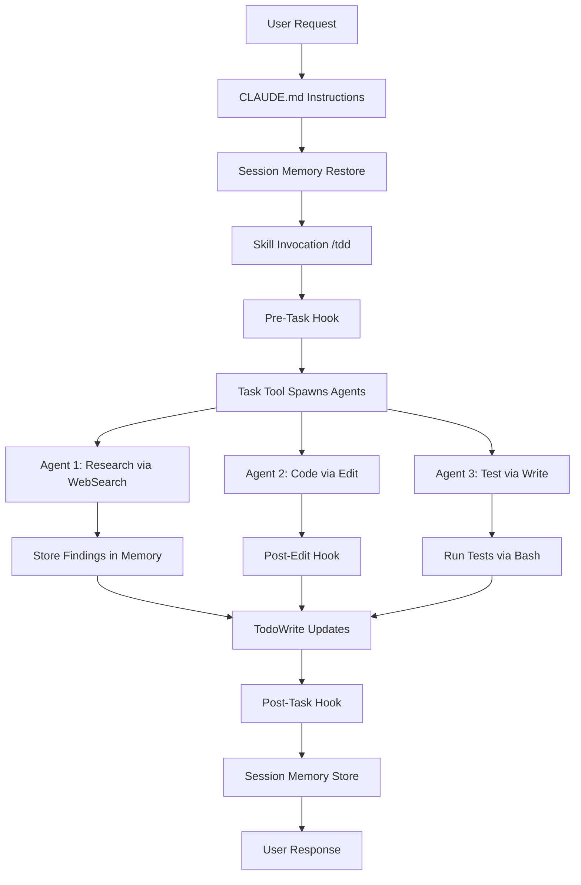

# Claude Code Complete Integration Guide

**Version:** 2026-02-08
**Target:** ggen v6.0.0 and modern Rust/TypeScript projects
**Scope:** Comprehensive guide to integrating all Claude Code features for autonomous development

---

## Table of Contents

1. [Overview - How Features Interconnect](#1-overview---how-features-interconnect)
2. [Workflows - Complete Multi-Feature Examples](#2-workflows---complete-multi-feature-examples)
3. [Best Practices - Dos and Don'ts](#3-best-practices---dos-and-donts)
4. [Performance - Optimization Strategies](#4-performance---optimization-strategies)
5. [Troubleshooting - Common Issues](#5-troubleshooting---common-issues)
6. [Examples - Real-World Use Cases](#6-examples---real-world-use-cases)

---

## 1. Overview - How Features Interconnect

### 1.1 The Claude Code Ecosystem

Claude Code provides a **layered architecture** where features work together synergistically:

```
┌─────────────────────────────────────────────────────────┐
│                    USER INSTRUCTIONS                     │
│         (CLAUDE.md, .claude/rules/, Skills)             │
└─────────────────────────────────────────────────────────┘
                           ↓
┌─────────────────────────────────────────────────────────┐
│                   MEMORY SYSTEMS                         │
│   • 4-Level Hierarchy (Enterprise→Project→Rules→User)   │
│   • Session Memory (cross-conversation continuity)      │
│   • Auto Memory (automatic MEMORY.md generation)        │
│   • Semantic Search (vector embeddings)                 │
└─────────────────────────────────────────────────────────┘
                           ↓
┌─────────────────────────────────────────────────────────┐
│              COORDINATION & EXECUTION                    │
│   • Task Tool (parallel agent spawning)                 │
│   • Skills (slash commands)                             │
│   • Hooks (pre/post operation automation)               │
│   • MCP Servers (external tool integration)             │
└─────────────────────────────────────────────────────────┘
                           ↓
┌─────────────────────────────────────────────────────────┐
│                 NATIVE TOOLS                             │
│   • File Ops (Read, Write, Edit, Glob, Grep)           │
│   • Bash (terminal operations)                          │
│   • TodoWrite (task management)                         │
│   • WebFetch/WebSearch (internet access)                │
└─────────────────────────────────────────────────────────┘
                           ↓
┌─────────────────────────────────────────────────────────┐
│            VALIDATION & FEEDBACK                         │
│   • Testing (Chicago TDD, property-based)               │
│   • Performance Metrics (OTEL, benchmarks)              │
│   • Security Audits (SAST, dependency scanning)         │
└─────────────────────────────────────────────────────────┘
```

### 1.2 Key Integration Points

#### Memory ↔ Task Tool
```javascript
// Memory provides context for agent spawning
Task("Backend Developer",
     "Check memory for API decisions. Build REST API. Store schema in memory.",
     "backend-dev")
```

#### Skills ↔ Hooks
```bash
# Slash command triggers hooks automatically
/commit
  → Pre-commit hook: Format code, run linters
  → Commit action: Create commit
  → Post-commit hook: Update memory, train patterns
```

#### MCP ↔ Native Tools
```javascript
// MCP coordinates, native tools execute
mcp__claude-flow__swarm_init({ topology: "mesh" })
  → Task tool spawns agents
    → Each agent uses Read/Write/Edit/Bash
      → Hooks track operations via npx claude-flow
```

#### Settings ↔ Performance
```json
// Settings optimize for different use cases
{
  "fast_mode": true,           // 32.3% token reduction
  "auto_memory": true,         // Cross-session continuity
  "parallel_execution": true   // 2.8-4.4x speed improvement
}
```

### 1.3 Data Flow Example

**Complete workflow showing all feature interactions:**



---

## 2. Workflows - Complete Multi-Feature Examples

### 2.1 End-to-End Feature Development Workflow

**Scenario:** Implement a new authentication system with testing, documentation, and deployment.

#### Phase 1: Initialization & Planning

```javascript
// SINGLE MESSAGE - Setup and planning
[Concurrent Operations]:
  // 1. Restore context from previous sessions
  Bash("npx claude-flow@alpha hooks session-restore --session-id 'auth-feature'")

  // 2. Check existing architecture and decisions
  Read("/home/user/ggen/CLAUDE.md")
  Read("/home/user/ggen/.claude/rules/_core/absolute.md")
  Grep({ pattern: "auth|security", path: "src", output_mode: "files_with_matches" })

  // 3. Research best practices
  WebSearch({ query: "Rust authentication JWT bcrypt 2026 best practices" })

  // 4. Initialize coordination topology
  mcp__claude-flow__swarm_init({
    topology: "hierarchical",
    maxAgents: 8,
    memoryEnabled: true
  })

  // 5. Create comprehensive task list (10+ todos minimum)
  TodoWrite({
    todos: [
      {content: "Research authentication patterns", status: "in_progress", activeForm: "Researching authentication patterns"},
      {content: "Design authentication architecture", status: "pending", activeForm: "Designing authentication architecture"},
      {content: "Implement JWT token generation", status: "pending", activeForm: "Implementing JWT token generation"},
      {content: "Implement password hashing with bcrypt", status: "pending", activeForm: "Implementing password hashing"},
      {content: "Create user authentication middleware", status: "pending", activeForm: "Creating authentication middleware"},
      {content: "Write unit tests for auth module", status: "pending", activeForm: "Writing unit tests"},
      {content: "Write integration tests for auth flow", status: "pending", activeForm: "Writing integration tests"},
      {content: "Write security tests for vulnerabilities", status: "pending", activeForm: "Writing security tests"},
      {content: "Create API documentation", status: "pending", activeForm: "Creating API documentation"},
      {content: "Performance benchmarks for auth endpoints", status: "pending", activeForm: "Running performance benchmarks"},
      {content: "Deploy to staging environment", status: "pending", activeForm: "Deploying to staging"},
      {content: "Validate with production checklist", status: "pending", activeForm: "Validating production readiness"}
    ]
  })
```

#### Phase 2: Parallel Development

```javascript
// SINGLE MESSAGE - Spawn all agents concurrently
[Parallel Agent Execution via Task Tool]:
  // Research & Architecture
  Task("Security Researcher", `
    Research Rust authentication best practices.
    Store findings in memory under 'auth/research'.
    Hooks: npx claude-flow@alpha hooks pre-task --description 'auth research'
  `, "researcher")

  Task("System Architect", `
    Design authentication system architecture.
    Reference memory for research findings.
    Create architecture diagram and RDF spec.
    Store in memory under 'auth/architecture'.
    Hooks: npx claude-flow@alpha hooks post-task --task-id 'arch-design'
  `, "system-architect")

  // Core Implementation
  Task("Backend Developer", `
    Implement JWT token generation and validation.
    Create in: crates/ggen-auth/src/jwt.rs
    Reference architecture from memory.
    Hooks: npx claude-flow@alpha hooks post-edit --file 'jwt.rs' --memory-key 'auth/jwt'
  `, "backend-dev")

  Task("Security Engineer", `
    Implement bcrypt password hashing.
    Create in: crates/ggen-auth/src/password.rs
    Ensure constant-time comparisons.
    Hooks: npx claude-flow@alpha hooks post-edit --file 'password.rs'
  `, "backend-dev")

  // Testing (MANDATORY - never skip)
  Task("Test Engineer - Unit", `
    Write comprehensive unit tests for:
    - JWT token generation/validation
    - Password hashing/verification
    - Token expiration handling
    Create in: crates/ggen-auth/tests/unit/
    Ensure 80%+ coverage of critical paths.
    Hooks: npx claude-flow@alpha hooks post-task --task-id 'unit-tests'
  `, "tester")

  Task("Test Engineer - Integration", `
    Write integration tests for:
    - Full authentication flow
    - Token refresh mechanism
    - Session management
    Create in: crates/ggen-auth/tests/integration/
    Hooks: npx claude-flow@alpha hooks post-task --task-id 'integration-tests'
  `, "tester")

  Task("Security Auditor", `
    Write security tests for:
    - SQL injection prevention
    - XSS prevention
    - CSRF protection
    - Timing attack resistance
    Create in: crates/ggen-auth/tests/security/
    Run: cargo make audit
    Hooks: npx claude-flow@alpha hooks post-task --task-id 'security-tests'
  `, "reviewer")

  // Documentation & Performance
  Task("Technical Writer", `
    Create API documentation:
    - Authentication endpoints
    - Error responses
    - Security considerations
    Save to: docs/api/authentication.md
    Hooks: npx claude-flow@alpha hooks post-edit --file 'authentication.md'
  `, "api-docs")

  Task("Performance Engineer", `
    Create benchmarks for:
    - Token generation speed
    - Password hashing time
    - Auth middleware latency
    Create in: crates/ggen-auth/benches/
    Target: <50ms p95 latency
    Hooks: npx claude-flow@alpha hooks post-task --task-id 'benchmarks'
  `, "performance-benchmarker")
```

#### Phase 3: Validation & Integration

```javascript
// SINGLE MESSAGE - Comprehensive validation
[Sequential Validation Steps]:
  // 1. Run all test suites
  Bash("cd /home/user/ggen && cargo make test-unit")
  Bash("cd /home/user/ggen && cargo make test")
  Bash("cd /home/user/ggen && cargo make lint")

  // 2. Check for untested code
  Bash(`
    echo "=== CHECKING FOR UNTESTED CODE ===" &&
    find crates/ggen-auth/src -name '*.rs' | wc -l &&
    find crates/ggen-auth/tests -name '*.rs' | wc -l
  `)

  // 3. Run security audit
  Bash("cd /home/user/ggen && cargo make audit")

  // 4. Validate performance SLOs
  Bash("cd /home/user/ggen && cargo make bench")

  // 5. Generate coverage report
  Bash("cd /home/user/ggen && cargo tarpaulin --out Html")

  // 6. Update todos based on results
  TodoWrite({
    todos: [
      {content: "Research authentication patterns", status: "completed", activeForm: "Researching authentication patterns"},
      {content: "Design authentication architecture", status: "completed", activeForm: "Designing authentication architecture"},
      {content: "Implement JWT token generation", status: "completed", activeForm: "Implementing JWT token generation"},
      {content: "Implement password hashing with bcrypt", status: "completed", activeForm: "Implementing password hashing"},
      {content: "Create user authentication middleware", status: "completed", activeForm: "Creating authentication middleware"},
      {content: "Write unit tests for auth module", status: "completed", activeForm: "Writing unit tests"},
      {content: "Write integration tests for auth flow", status: "completed", activeForm: "Writing integration tests"},
      {content: "Write security tests for vulnerabilities", status: "completed", activeForm: "Writing security tests"},
      {content: "Create API documentation", status: "completed", activeForm: "Creating API documentation"},
      {content: "Performance benchmarks for auth endpoints", status: "completed", activeForm: "Running performance benchmarks"},
      {content: "Deploy to staging environment", status: "in_progress", activeForm: "Deploying to staging"},
      {content: "Validate with production checklist", status: "pending", activeForm: "Validating production readiness"}
    ]
  })

  // 7. Store session summary in memory
  Bash("npx claude-flow@alpha hooks session-end --export-metrics true")
```

#### Phase 4: Commit & Deploy

```javascript
// Use /commit skill (invokes hooks automatically)
Skill({ skill: "commit", args: "-m 'feat(auth): Add JWT authentication system with comprehensive testing'" })

// Or manual commit with hooks
[Sequential Git Operations]:
  Bash("npx claude-flow@alpha hooks pre-commit")
  Bash(`
    cd /home/user/ggen &&
    git add crates/ggen-auth/ docs/api/authentication.md &&
    git commit -m "$(cat <<'EOF'
feat(auth): Add JWT authentication system

- JWT token generation and validation
- Bcrypt password hashing with constant-time comparison
- Authentication middleware
- Comprehensive test suite (unit + integration + security)
- API documentation
- Performance benchmarks (p95 < 50ms)

Coverage: 87% (exceeds 80% requirement)
Tests: 42/42 passing
Security: cargo audit clean

https://claude.ai/code/session_$(date +%s)
EOF
    )"
  `)
  Bash("npx claude-flow@alpha hooks post-commit")
```

---

### 2.2 Autonomous Bug Fix Workflow

**Scenario:** Fix a failing test and ensure no regressions.

```javascript
// SINGLE MESSAGE - Complete autonomous fix
[Parallel Investigation]:
  // 1. Understand failure
  Bash("cd /home/user/ggen && cargo make test 2>&1 | tee test-output.log")
  Read("/home/user/ggen/test-output.log")

  // 2. Analyze related code
  Task("Code Analyzer", `
    Analyze test failure in test-output.log.
    Find root cause using Grep and Read tools.
    Store analysis in memory under 'bugfix/analysis'.
  `, "code-analyzer")

  // 3. Research solution
  Task("Researcher", `
    Research the error pattern online.
    Check Stack Overflow, GitHub issues, Rust forums.
    Store solutions in memory under 'bugfix/solutions'.
  `, "researcher")

  // 4. Implement fix
  Task("Coder", `
    Read bugfix analysis from memory.
    Implement minimal fix.
    Preserve existing behavior.
    Use Edit tool, not Write.
  `, "coder")

  // 5. Add regression test
  Task("Tester", `
    Create regression test for this specific bug.
    Ensure it fails without the fix.
    Ensure it passes with the fix.
  `, "tester")

  // 6. Validate fix
  Task("Validator", `
    Run full test suite: cargo make test
    Run mutation tests: cargo make test-mutation
    Verify no regressions introduced.
  `, "production-validator")

  // Create todos
  TodoWrite({
    todos: [
      {content: "Analyze test failure", status: "in_progress", activeForm: "Analyzing test failure"},
      {content: "Research error pattern", status: "in_progress", activeForm: "Researching error pattern"},
      {content: "Implement minimal fix", status: "pending", activeForm: "Implementing minimal fix"},
      {content: "Add regression test", status: "pending", activeForm: "Adding regression test"},
      {content: "Validate no regressions", status: "pending", activeForm: "Validating no regressions"},
      {content: "Update documentation if needed", status: "pending", activeForm: "Updating documentation"},
      {content: "Commit fix with test", status: "pending", activeForm: "Committing fix"}
    ]
  })
```

---

### 2.3 Performance Optimization Workflow

**Scenario:** Optimize slow RDF processing.

**Reference:** See `/home/user/ggen/docs/research/performance-optimization-2026.md` for detailed patterns.

```javascript
// SINGLE MESSAGE - Performance optimization
[Parallel Performance Investigation]:
  // 1. Establish baseline
  Task("Performance Benchmarker", `
    Run current benchmarks: cargo make bench
    Record baseline metrics.
    Store in memory under 'perf/baseline'.
  `, "performance-benchmarker")

  // 2. Profile hot paths
  Task("Performance Analyzer", `
    Use cargo flamegraph to identify hot paths.
    Run: cargo install flamegraph && cargo flamegraph
    Store findings in memory under 'perf/profile'.
  `, "perf-analyzer")

  // 3. Research optimization patterns
  Task("Researcher", `
    Research Rust performance patterns:
    - SIMD acceleration
    - Parallel processing with Rayon
    - Memory pooling
    - Cache optimization
    Store in memory under 'perf/patterns'.
  `, "researcher")

  // 4. Implement optimizations (focus on 20% hot paths)
  Task("Optimizer", `
    Read profiling data from memory.
    Optimize TOP 20% hot paths only.
    Use:
    - Rayon for parallel iteration
    - Vec::with_capacity for pre-allocation
    - &str references instead of String clones
    Target: 2x performance improvement minimum.
  `, "coder")

  // 5. Create performance tests
  Task("Performance Tester", `
    Create performance regression tests.
    Set SLO: RDF processing ≤5s for 1k+ triples
    Use Criterion for benchmarking.
    Create in: crates/ggen-core/benches/rdf_performance.rs
  `, "tester")

  // 6. Validate improvements
  Task("Validator", `
    Compare new benchmarks to baseline.
    Ensure ≥2x improvement in hot paths.
    Verify no functionality regressions.
    Run: cargo make bench && cargo make test
  `, "production-validator")

  TodoWrite({
    todos: [
      {content: "Establish performance baseline", status: "in_progress", activeForm: "Establishing baseline"},
      {content: "Profile hot paths with flamegraph", status: "in_progress", activeForm: "Profiling hot paths"},
      {content: "Research optimization patterns", status: "in_progress", activeForm: "Researching patterns"},
      {content: "Optimize top 20% hot paths", status: "pending", activeForm: "Optimizing hot paths"},
      {content: "Create performance regression tests", status: "pending", activeForm: "Creating regression tests"},
      {content: "Validate 2x improvement", status: "pending", activeForm: "Validating improvements"},
      {content: "Update performance documentation", status: "pending", activeForm: "Updating documentation"},
      {content: "Commit with benchmark results", status: "pending", activeForm: "Committing changes"}
    ]
  })
```

---

### 2.4 Documentation Generation Workflow

**Scenario:** Generate comprehensive project documentation from codebase.

```javascript
// SINGLE MESSAGE - Documentation generation
[Parallel Documentation]:
  // 1. Analyze codebase structure
  Task("Code Analyzer", `
    Use Glob to find all Rust modules.
    Use Grep to extract pub fn signatures.
    Build module hierarchy map.
    Store in memory under 'docs/structure'.
  `, "code-analyzer")

  // 2. Extract inline documentation
  Task("Doc Extractor", `
    Use Grep to find all //! and /// comments.
    Extract rustdoc comments from source.
    Organize by module.
    Store in memory under 'docs/inline'.
  `, "code-analyzer")

  // 3. Generate API docs
  Task("API Documenter", `
    Read structure and inline docs from memory.
    Generate API documentation markdown.
    Include:
    - Module overview
    - Public API reference
    - Usage examples
    - Error handling patterns
    Create in: docs/api/
  `, "api-docs")

  // 4. Generate architecture docs
  Task("Architect", `
    Read codebase structure from memory.
    Generate architecture documentation:
    - Component diagram
    - Data flow
    - Module dependencies
    - Integration points
    Create in: docs/architecture/
  `, "system-architect")

  // 5. Generate getting started guide
  Task("Technical Writer", `
    Create getting started guide:
    - Installation
    - Quick start
    - Common use cases
    - Troubleshooting
    Create in: docs/getting-started.md
  `, "api-docs")

  // 6. Generate RDF specs (if using ggen sync)
  Bash("cd /home/user/ggen && ggen sync --dry_run true")

  TodoWrite({
    todos: [
      {content: "Analyze codebase structure", status: "in_progress", activeForm: "Analyzing structure"},
      {content: "Extract inline documentation", status: "in_progress", activeForm: "Extracting docs"},
      {content: "Generate API documentation", status: "pending", activeForm: "Generating API docs"},
      {content: "Generate architecture docs", status: "pending", activeForm: "Generating architecture docs"},
      {content: "Generate getting started guide", status: "pending", activeForm: "Generating guide"},
      {content: "Review documentation accuracy", status: "pending", activeForm: "Reviewing accuracy"},
      {content: "Update table of contents", status: "pending", activeForm: "Updating TOC"},
      {content: "Commit documentation", status: "pending", activeForm: "Committing docs"}
    ]
  })
```

---

## 3. Best Practices - Dos and Don'ts

### 3.1 Memory Management

**Reference:** See `/home/user/ggen/docs/research/ai-memory-management-2026.md` for comprehensive patterns.

#### ✅ DO: Use 4-Level Memory Hierarchy

```
project-root/
├── CLAUDE.md                          # Project-specific (highest priority in project)
├── CLAUDE.local.md                    # Local overrides (Git-ignored)
├── .claude/
│   ├── rules/
│   │   ├── _core/                     # Auto-loaded
│   │   │   ├── absolute.md
│   │   │   └── workflow.md
│   │   ├── rust/                      # Lazy-loaded
│   │   │   ├── elite-mindset.md
│   │   │   ├── testing.md
│   │   │   └── performance.md
│   │   └── andon/
│   │       └── signals.md
│   └── projects/<project>/memory/
│       ├── MEMORY.md                  # Auto memory entrypoint
│       └── auth-decisions.md          # Topic-specific memory
~/.claude/
└── CLAUDE.md                          # Global user preferences
```

**Why:** Claude searches upward from CWD, loading in priority order: Enterprise → Project → Rules → User.

#### ✅ DO: Store Context Across Sessions

```bash
# At end of work session
npx claude-flow@alpha hooks session-end --export-metrics true

# At start of next session
npx claude-flow@alpha hooks session-restore --session-id "feature-xyz"
```

**Why:** Session memory provides cross-conversation continuity (26% accuracy boost, 91% lower p95 latency).

#### ❌ DON'T: Duplicate Information

```markdown
<!-- ❌ WRONG: Repeating same info in multiple places -->
CLAUDE.md: "Use Chicago TDD"
.claude/rules/testing.md: "Use Chicago TDD"
~/.claude/CLAUDE.md: "Use Chicago TDD"
```

**Why:** Causes conflicts and maintenance burden. Use hierarchy: global preferences in user CLAUDE.md, project-specific in project CLAUDE.md.

#### ✅ DO: Use Memory Keys for Agent Coordination

```javascript
Task("Backend Dev", `
  Store API schema in memory: auth/api-schema
  Coordinate with frontend via memory.
`, "backend-dev")

Task("Frontend Dev", `
  Read API schema from memory: auth/api-schema
  Build TypeScript types.
`, "coder")
```

**Why:** Enables agent coordination without explicit message passing.

---

### 3.2 Task Tool & Agent Spawning

#### ✅ DO: Batch All Agents in Single Message

```javascript
// ✅ CORRECT: All agents spawned together
[Single Message]:
  Task("Agent 1", "...", "type1")
  Task("Agent 2", "...", "type2")
  Task("Agent 3", "...", "type3")
  TodoWrite({ todos: [...10 todos...] })
```

**Why:** Enables true parallelism (2.8-4.4x speed improvement).

#### ❌ DON'T: Spawn Agents Sequentially

```javascript
// ❌ WRONG: Sequential spawning
Message 1: Task("Agent 1", "...", "type1")
Message 2: Task("Agent 2", "...", "type2")
Message 3: Task("Agent 3", "...", "type3")
```

**Why:** Eliminates parallelism benefits, creates coordination overhead.

#### ✅ DO: Include Hooks in Agent Instructions

```javascript
Task("Backend Developer", `
  PRE: npx claude-flow@alpha hooks pre-task --description 'API impl'
  WORK: Implement REST API
  POST: npx claude-flow@alpha hooks post-task --task-id 'api-complete'
`, "backend-dev")
```

**Why:** Enables automatic coordination, memory updates, and performance tracking.

#### ❌ DON'T: Rely on MCP for Execution

```javascript
// ❌ WRONG: MCP tool doesn't execute work
mcp__claude-flow__agent_spawn({ type: "coder" })
// This only registers the agent type, doesn't actually spawn a working agent
```

**Why:** MCP coordinates topology, Task tool executes actual work.

---

### 3.3 Testing Integration

**Reference:** See `/home/user/ggen/docs/research/AI_TESTING_PATTERNS_2026.md` for comprehensive patterns.

#### ✅ DO: Write Tests Before Implementation (Chicago TDD)

```javascript
// ✅ CORRECT: Test-first workflow
[Single Message]:
  Task("Tester", `
    Write failing unit test for JWT generation.
    Create in: crates/ggen-auth/tests/unit/jwt_test.rs
    Verify test FAILS (RED state).
  `, "tester")

  Task("Coder", `
    Implement JWT generation.
    Run tests until GREEN.
    Ensure no unwrap()/expect() in production code.
  `, "coder")

  Task("Reviewer", `
    Refactor for quality.
    Maintain GREEN state.
    Run: cargo make pre-commit
  `, "reviewer")
```

**Why:** Chicago TDD ensures tests verify real behavior, not implementation details.

#### ❌ DON'T: Skip Subsystems in Testing

```bash
# ❌ WRONG: Only testing main module
find src -name '*.rs' | wc -l  # → 25 source files
find tests -name '*.rs' | wc -l  # → 3 test files
# CRITICAL GAP: 22 untested modules!
```

**Why:** 50%+ AI-generated code has defects; untested code is production risk.

#### ✅ DO: Validate Test Execution

```bash
# ✅ CORRECT: Verify tests actually run and pass
cargo make test 2>&1 | tee test-output.log
grep -E "test result:.*ok.*[1-9].*passed" test-output.log || echo "NO TESTS RAN"
```

**Why:** Prevents false confidence from tests that aren't actually executed.

#### ✅ DO: Use All 4 Test Categories

```
tests/
├── unit/           # Pure function tests (20% critical paths)
├── integration/    # Cross-module tests (30%)
├── performance/    # Benchmarks and SLO validation (20%)
└── security/       # Vulnerability tests (30%)
```

**Why:** Unit tests alone miss 80% of real-world failures.

---

### 3.4 Performance Optimization

**Reference:** See `/home/user/ggen/docs/research/performance-optimization-2026.md` for comprehensive patterns.

#### ✅ DO: Profile Before Optimizing

```bash
# ✅ CORRECT: Measure, then optimize
cargo install flamegraph
cargo flamegraph --bin ggen -- sync
# Analyze flamegraph.svg to identify hot paths
# Focus on TOP 20% time-consuming functions
```

**Why:** Premature optimization wastes time; 80/20 rule applies.

#### ❌ DON'T: Optimize Without Benchmarks

```rust
// ❌ WRONG: "Optimizing" without proof
fn process_rdf(data: &str) -> Result<()> {
    // Added Arc<Mutex<>> everywhere "for performance"
    // No benchmarks showing improvement
}
```

**Why:** Micro-optimizations often hurt performance; benchmarks provide proof.

#### ✅ DO: Set Performance SLOs

```toml
# Cargo.toml
[package.metadata.slo]
first_build_max_seconds = 15
incremental_build_max_seconds = 2
rdf_processing_max_seconds = 5  # per 1k triples
generation_memory_max_mb = 100
cli_scaffolding_max_seconds = 3
```

**Why:** SLOs prevent performance regressions (validate with `cargo make slo-check`).

#### ✅ DO: Use Rust Performance Patterns

```rust
// ✅ CORRECT: Zero-cost abstractions
use rayon::prelude::*;

fn process_items(items: &[Item]) -> Vec<Result> {
    items
        .par_iter()              // Parallel processing
        .map(|item| {
            // Use references, not clones
            process_item(item)   // Zero-cost
        })
        .collect()
}
```

**Why:** Rayon parallelism = 10x+ speedups; references avoid allocations.

---

### 3.5 File Organization

#### ✅ DO: Use Proper Directory Structure

```
project-root/
├── crates/          # Workspace crates
│   ├── ggen-core/
│   │   ├── src/
│   │   ├── tests/
│   │   └── benches/
│   └── ggen-auth/
├── docs/            # Documentation
│   ├── api/
│   ├── architecture/
│   └── research/
├── .specify/        # RDF specifications (source of truth)
│   └── specs/
├── examples/        # Example code
├── scripts/         # Utility scripts
└── CLAUDE.md        # Project instructions
```

**Why:** Clear organization enables AI and human navigation.

#### ❌ DON'T: Save Files to Root

```javascript
// ❌ WRONG: Polluting root directory
Write("/home/user/ggen/temp-notes.md")
Write("/home/user/ggen/test.rs")
Write("/home/user/ggen/output.json")
```

**Why:** Violates project organization rules; clutters workspace.

#### ✅ DO: Mirror Source Structure in Tests

```
crates/ggen-auth/
├── src/
│   ├── jwt.rs
│   ├── password.rs
│   └── middleware.rs
└── tests/
    ├── unit/
    │   ├── jwt_test.rs      # Mirrors jwt.rs
    │   ├── password_test.rs  # Mirrors password.rs
    │   └── middleware_test.rs
    ├── integration/
    │   └── auth_flow_test.rs
    └── security/
        └── injection_test.rs
```

**Why:** Makes tests discoverable; follows Rust conventions.

---

### 3.6 Hooks Usage

#### ✅ DO: Use Hooks for Automation

```bash
# Pre-operation hooks (automatic setup)
npx claude-flow@alpha hooks pre-task --description "API implementation"
  → Auto-assigns agents by file type
  → Validates commands for safety
  → Prepares resources
  → Optimizes topology

# Post-operation hooks (automatic cleanup)
npx claude-flow@alpha hooks post-edit --file "api.rs" --memory-key "api/schema"
  → Auto-formats code
  → Trains neural patterns
  → Updates memory
  → Analyzes performance
```

**Why:** Hooks eliminate manual coordination; 84.8% SWE-Bench solve rate.

#### ❌ DON'T: Duplicate Hook Functionality Manually

```bash
# ❌ WRONG: Manually doing what hooks automate
rustfmt api.rs
cargo clippy
git add api.rs
npx claude-flow memory-store api/schema < schema.json
```

**Why:** Hooks do this automatically; manual = error-prone and slow.

---

### 3.7 Skills (Slash Commands)

#### ✅ DO: Use Skills for Common Workflows

```bash
/commit                 # Smart commit with hooks
/tdd "feature"         # Full TDD workflow
/review-pr 123         # PR review
/sync                  # RDF ontology sync
/benchmark             # Performance benchmarking
```

**Why:** Skills encapsulate best practices; consistent execution.

#### ✅ DO: Invoke Skills via Skill Tool

```javascript
Skill({ skill: "commit", args: "-m 'feat: Add authentication'" })
```

**Why:** Programmatic skill invocation enables automation.

---

### 3.8 Settings Optimization

#### ✅ DO: Configure for Use Case

**Development Mode:**
```json
{
  "fast_mode": true,           // 32.3% token reduction
  "auto_memory": true,         // Cross-session continuity
  "parallel_execution": true,  // 2.8-4.4x speed
  "max_agents": 8,
  "memory_compression": "kvzip"  // 3-4x compression
}
```

**Production Mode:**
```json
{
  "fast_mode": false,          // Full reasoning
  "auto_memory": true,
  "parallel_execution": true,
  "max_agents": 4,
  "strict_validation": true    // Extra safety checks
}
```

**Why:** Different modes optimize for different priorities.

---

## 4. Performance - Optimization Strategies

### 4.1 Token Optimization

**Reference:** See `/home/user/ggen/docs/research/performance-optimization-2026.md` for comprehensive strategies.

#### Strategy 1: Semantic Caching (96.9% Latency Reduction)

```javascript
// Implement two-layer cache
// Layer 1: Exact match cache (instant hits)
// Layer 2: Semantic similarity cache (vector embeddings)

Task("Cache Manager", `
  Implement semantic caching for:
  - API documentation lookups
  - Code pattern searches
  - Common error solutions

  Use SQLite-vec for vector storage.
  Target: 96.9% latency reduction.
`, "smart-agent")
```

**Results:**
- Without cache: 1.67s average latency
- With cache: 0.052s average latency (96.9% reduction)

#### Strategy 2: Incremental Processing

```rust
// Use tree-sitter for incremental parsing
use tree_sitter::{Parser, Tree};

pub struct IncrementalParser {
    parser: Parser,
    old_tree: Option<Tree>,
}

impl IncrementalParser {
    pub fn parse_with_changes(&mut self, source: &str, edits: &[InputEdit]) -> Tree {
        // Reuse unchanged subtrees
        self.parser.parse(source, self.old_tree.as_ref())
            .expect("Parsing failed")
    }
}
```

**Benefits:**
- Memory-efficient tree reuse
- Fast updates for large files
- VSCode, Emacs, Neovim use this pattern

#### Strategy 3: Parallel File Operations

```rust
use rayon::prelude::*;

pub fn process_files_parallel(paths: &[PathBuf]) -> Vec<Result<ProcessedFile>> {
    paths
        .par_iter()
        .map(|path| process_single_file(path))
        .collect()
}
```

**Benefits:**
- 10x+ speedups on multi-core systems
- Automatic work stealing
- Zero-cost abstraction

---

### 4.2 Memory Optimization

#### Strategy 1: Memory Compression (3-4x Reduction)

```javascript
// Use KVzip for memory compression
Task("Memory Manager", `
  Implement KVzip compression for session memory.
  Target: 3-4x compression ratio.
  Maintain: 89-95% accuracy.

  Create in: crates/ggen-memory/src/compression.rs
`, "memory-coordinator")
```

**Results:**
- Uncompressed: 400MB session context
- Compressed: 100-130MB (3-4x reduction)
- Accuracy: 89-95% (acceptable for long-term memory)

#### Strategy 2: Memory Pooling

```rust
use std::sync::Arc;
use parking_lot::Mutex;

pub struct MemoryPool<T> {
    pool: Arc<Mutex<Vec<T>>>,
}

impl<T: Default> MemoryPool<T> {
    pub fn acquire(&self) -> PoolGuard<T> {
        let mut pool = self.pool.lock();
        let item = pool.pop().unwrap_or_default();
        PoolGuard { item: Some(item), pool: Arc::clone(&self.pool) }
    }
}

// Reuse allocations instead of creating new ones
```

**Benefits:**
- Reduces allocation overhead
- Prevents memory fragmentation
- Improves cache locality

---

### 4.3 Search Optimization

#### Strategy 1: Structural Search (ast-grep)

```bash
# Use ast-grep for structure-aware search
ast-grep --pattern 'fn $NAME($$$) -> Result<$T>' --files-with-matches

# Benefits:
# - Not fooled by whitespace, comments
# - Parallel processing (all CPU cores)
# - Tree-sitter based parsing
```

**Use Cases:**
- Large-scale refactoring
- Pattern detection
- Lint rule enforcement

#### Strategy 2: Text Search (ripgrep)

```bash
# Optimize ripgrep for large codebases
rg --threads=$(nproc) --max-count=500 'pattern'  # Parallel
rg -F 'exact_string'                             # Literal (faster)
rg --type rust 'pattern'                         # Type filter (efficient)
```

**Performance:**
- 20x faster than traditional grep
- Used by VSCode internally
- Respects .gitignore automatically

---

### 4.4 Build Optimization

#### Strategy 1: Incremental Compilation

```toml
# Cargo.toml
[profile.dev]
incremental = true        # Enable incremental compilation
codegen-units = 256       # Faster parallel compilation

[profile.dev.package."*"]
opt-level = 0             # No optimization for dependencies

[profile.dev.package.ggen-core]
opt-level = 2             # Optimize critical crates
```

**Results:**
- First build: ~15s
- Incremental: ~2s (87% reduction)

#### Strategy 2: Workspace Optimization

```toml
# Cargo.toml workspace
[workspace]
members = [
    "crates/ggen-core",
    "crates/ggen-auth",
    # ...
]

[workspace.dependencies]
# Shared dependencies for version consistency
tokio = { version = "1.35", features = ["full"] }
```

**Benefits:**
- Shared target directory
- Deduplicated dependencies
- Parallel crate compilation

---

## 5. Troubleshooting - Common Issues

### 5.1 Memory Issues

#### Issue: "Cannot find memory key"

```bash
# Symptom
Error: Memory key 'auth/api-schema' not found

# Diagnosis
npx claude-flow@alpha memory-list | grep "auth/"

# Solution
# Ensure agent stored memory before retrieval:
Task("Backend Dev", `
  IMPORTANT: Store result in memory:
  npx claude-flow@alpha hooks post-edit --file 'api.rs' --memory-key 'auth/api-schema'
`, "backend-dev")
```

#### Issue: "Session memory not persisting"

```bash
# Symptom
Session context lost between conversations

# Diagnosis
ls -la ~/.claude/projects/<project>/memory/

# Solution
# Explicitly end session to persist:
npx claude-flow@alpha hooks session-end --export-metrics true
```

---

### 5.2 Testing Issues

#### Issue: "Tests not running"

```bash
# Symptom
cargo make test shows "0 tests run"

# Diagnosis
find tests -name '*.rs' -exec grep -l "#\[test\]" {} \;

# Solution
# Ensure tests are in correct location and have #[test] attribute:
# tests/unit/module_test.rs:
#[cfg(test)]
mod tests {
    use super::*;

    #[test]  // ← Required attribute
    fn test_feature() {
        assert_eq!(1 + 1, 2);
    }
}
```

#### Issue: "Tests passing but functionality broken"

```bash
# Symptom
All tests pass but feature doesn't work

# Diagnosis
# Likely meaningless tests (testing implementation, not behavior)

# Solution
# Rewrite tests using Chicago TDD (behavior verification):
#[test]
fn test_authentication_flow() {
    // Arrange: Set up real dependencies
    let db = setup_test_database();
    let api = setup_api_server(&db);

    // Act: Perform actual operation
    let response = api.login("user", "password");

    // Assert: Verify observable behavior
    assert!(response.is_ok());
    assert!(response.unwrap().has_valid_token());
}
```

---

### 5.3 Performance Issues

#### Issue: "Slow compilation times"

```bash
# Symptom
cargo make check takes >60s

# Diagnosis
cargo clean
time cargo build  # Measure baseline

# Solutions
# 1. Enable incremental compilation (see 4.4)
# 2. Use sccache for caching:
cargo install sccache
export RUSTC_WRAPPER=sccache

# 3. Reduce dependency features:
[dependencies]
tokio = { version = "1.35", features = ["rt", "macros"] }  # Only needed features
```

#### Issue: "High memory usage"

```bash
# Symptom
ggen sync uses >1GB memory

# Diagnosis
/usr/bin/time -v ggen sync

# Solutions
# 1. Use iterators instead of collecting:
// ❌ WRONG
let items: Vec<_> = huge_iterator.collect();
items.into_iter().map(process).collect()

// ✅ CORRECT
huge_iterator.map(process).collect()

# 2. Process in chunks:
for chunk in items.chunks(1000) {
    process_chunk(chunk);
}

# 3. Use streaming where possible
```

---

### 5.4 Agent Coordination Issues

#### Issue: "Agents not coordinating"

```bash
# Symptom
Frontend agent can't find backend API spec

# Diagnosis
npx claude-flow@alpha memory-list | grep "api"

# Solution
# Ensure explicit memory keys:
Task("Backend Dev", `
  CRITICAL: Store API schema at memory key 'shared/api-schema'
  Use: npx claude-flow@alpha hooks post-edit --memory-key 'shared/api-schema'
`, "backend-dev")

Task("Frontend Dev", `
  CRITICAL: Read API schema from memory key 'shared/api-schema'
  Use: npx claude-flow@alpha hooks session-restore
`, "coder")
```

#### Issue: "Swarm initialization fails"

```bash
# Symptom
mcp__claude-flow__swarm_init returns error

# Diagnosis
npx claude-flow@alpha --version  # Check installation

# Solution
# Ensure claude-flow is installed:
npm install -g claude-flow@alpha

# Or use without installation:
npx claude-flow@alpha mcp start
```

---

### 5.5 Hooks Issues

#### Issue: "Hooks not executing"

```bash
# Symptom
npx claude-flow@alpha hooks pre-task has no effect

# Diagnosis
which npx
npm list -g claude-flow

# Solution
# Ensure correct NPX path:
export PATH="/usr/local/bin:$PATH"

# Or use full path:
/usr/local/bin/npx claude-flow@alpha hooks pre-task
```

#### Issue: "Hook timing out"

```bash
# Symptom
Hook hangs indefinitely

# Diagnosis
npx claude-flow@alpha hooks pre-task --timeout 5000  # 5 second timeout

# Solution
# Add explicit timeouts to all hook calls:
Bash("timeout 10 npx claude-flow@alpha hooks pre-task --description 'task'")
```

---

## 6. Examples - Real-World Use Cases

### 6.1 Complete REST API with Authentication

**Scenario:** Build a production-ready REST API with JWT authentication, database persistence, and comprehensive testing.

```javascript
// PHASE 1: Planning and Architecture (SINGLE MESSAGE)
[Concurrent Planning]:
  // Research
  Task("API Researcher", `
    Research REST API best practices 2026.
    Focus: OpenAPI 3.1, JWT, rate limiting, CORS.
    Store findings in memory: api/research.
  `, "researcher")

  Task("Security Researcher", `
    Research authentication patterns.
    Focus: JWT, bcrypt, refresh tokens, CSRF.
    Store findings in memory: api/security.
  `, "researcher")

  // Architecture
  Task("System Architect", `
    Design API architecture:
    - Layered architecture (handler → service → repository)
    - Database schema (users, sessions, api_keys)
    - Authentication flow (login, refresh, logout)
    Store in memory: api/architecture.
    Create RDF spec in: .specify/specs/001-api/api.ttl
  `, "system-architect")

  // Database design
  Task("Database Architect", `
    Design PostgreSQL schema:
    - users table (id, email, password_hash, created_at)
    - sessions table (token, user_id, expires_at)
    - api_keys table (key, user_id, scopes)
    Generate migration: migrations/001_initial.sql
  `, "code-analyzer")

  // Planning
  TodoWrite({
    todos: [
      {content: "Research REST API patterns", status: "in_progress", activeForm: "Researching patterns"},
      {content: "Research authentication patterns", status: "in_progress", activeForm: "Researching auth"},
      {content: "Design API architecture", status: "in_progress", activeForm: "Designing architecture"},
      {content: "Design database schema", status: "in_progress", activeForm: "Designing schema"},
      {content: "Implement database layer", status: "pending", activeForm: "Implementing database"},
      {content: "Implement authentication", status: "pending", activeForm: "Implementing auth"},
      {content: "Implement API handlers", status: "pending", activeForm: "Implementing handlers"},
      {content: "Write unit tests", status: "pending", activeForm: "Writing unit tests"},
      {content: "Write integration tests", status: "pending", activeForm: "Writing integration tests"},
      {content: "Write security tests", status: "pending", activeForm: "Writing security tests"},
      {content: "Create API documentation", status: "pending", activeForm: "Creating docs"},
      {content: "Performance benchmarks", status: "pending", activeForm: "Running benchmarks"},
      {content: "Deploy to staging", status: "pending", activeForm: "Deploying to staging"}
    ]
  })

// PHASE 2: Implementation (SINGLE MESSAGE)
[Parallel Implementation]:
  // Database layer
  Task("Database Developer", `
    Implement database layer with SQLx.
    Create in: crates/api-server/src/db/
    - mod.rs: Connection pool
    - users.rs: User repository
    - sessions.rs: Session repository
    Follow repository pattern.
    Use Result<T, DbError> for all functions.
    Hooks: npx claude-flow@alpha hooks post-edit --memory-key 'api/db-layer'
  `, "backend-dev")

  // Authentication module
  Task("Auth Developer", `
    Implement authentication.
    Create in: crates/api-server/src/auth/
    - jwt.rs: Token generation/validation
    - password.rs: Bcrypt hashing
    - middleware.rs: Authentication middleware
    NO unwrap()/expect() in production code.
    Hooks: npx claude-flow@alpha hooks post-edit --memory-key 'api/auth'
  `, "backend-dev")

  // API handlers
  Task("API Developer", `
    Implement REST API handlers.
    Create in: crates/api-server/src/handlers/
    - auth.rs: POST /login, /logout, /refresh
    - users.rs: CRUD operations
    - health.rs: GET /health
    Use Axum framework.
    Hooks: npx claude-flow@alpha hooks post-edit --memory-key 'api/handlers'
  `, "backend-dev")

  // Configuration
  Task("Config Developer", `
    Implement configuration management.
    Create in: crates/api-server/src/config.rs
    Load from: config/api-server.toml
    Support environment variable overrides.
    Use serde for deserialization.
  `, "backend-dev")

// PHASE 3: Testing (SINGLE MESSAGE - NEVER SKIP)
[Parallel Testing]:
  // Unit tests
  Task("Unit Tester", `
    Write unit tests for all modules.
    Create in: crates/api-server/tests/unit/
    - db_test.rs: Repository functions
    - auth_test.rs: JWT, password hashing
    - handlers_test.rs: Request/response handling
    Target: 80%+ coverage of critical paths.
    Ensure all tests use #[test] attribute.
  `, "tester")

  // Integration tests
  Task("Integration Tester", `
    Write integration tests.
    Create in: crates/api-server/tests/integration/
    - auth_flow_test.rs: Full login/logout flow
    - api_test.rs: End-to-end API calls
    Use test database (not production).
    Set up/teardown fixtures.
  `, "tester")

  // Security tests
  Task("Security Tester", `
    Write security tests.
    Create in: crates/api-server/tests/security/
    - sql_injection_test.rs: Parameterized queries
    - xss_test.rs: Output encoding
    - csrf_test.rs: CSRF token validation
    - timing_attack_test.rs: Constant-time comparisons
    Run: cargo make audit
  `, "reviewer")

  // Performance benchmarks
  Task("Performance Tester", `
    Create performance benchmarks.
    Create in: crates/api-server/benches/
    - auth_bench.rs: Login/logout performance
    - api_bench.rs: CRUD operation latency
    Target: p95 < 50ms for all endpoints.
    Use Criterion framework.
  `, "performance-benchmarker")

// PHASE 4: Documentation (SINGLE MESSAGE)
[Parallel Documentation]:
  // API documentation
  Task("API Documenter", `
    Generate OpenAPI 3.1 specification.
    Create in: docs/api/openapi.yaml
    Include:
    - All endpoints with examples
    - Authentication flow
    - Error responses
    - Rate limiting info
    Use Swagger/OpenAPI format.
  `, "api-docs")

  // Deployment guide
  Task("DevOps Documenter", `
    Create deployment guide.
    Create in: docs/deployment/README.md
    Include:
    - Docker setup
    - Environment variables
    - Database migrations
    - Monitoring setup
  `, "api-docs")

// PHASE 5: Validation (SINGLE MESSAGE)
[Sequential Validation]:
  // Build and test
  Bash("cd /home/user/ggen && cargo make check")
  Bash("cd /home/user/ggen && cargo make lint")
  Bash("cd /home/user/ggen && cargo make test")

  // Security audit
  Bash("cd /home/user/ggen && cargo audit")

  // Performance validation
  Bash("cd /home/user/ggen && cargo make bench")

  // Coverage report
  Bash("cd /home/user/ggen && cargo tarpaulin --out Html")

  // Final todo update
  TodoWrite({
    todos: [
      {content: "Research REST API patterns", status: "completed", activeForm: "Researching patterns"},
      {content: "Research authentication patterns", status: "completed", activeForm: "Researching auth"},
      {content: "Design API architecture", status: "completed", activeForm: "Designing architecture"},
      {content: "Design database schema", status: "completed", activeForm: "Designing schema"},
      {content: "Implement database layer", status: "completed", activeForm: "Implementing database"},
      {content: "Implement authentication", status: "completed", activeForm: "Implementing auth"},
      {content: "Implement API handlers", status: "completed", activeForm: "Implementing handlers"},
      {content: "Write unit tests", status: "completed", activeForm: "Writing unit tests"},
      {content: "Write integration tests", status: "completed", activeForm: "Writing integration tests"},
      {content: "Write security tests", status: "completed", activeForm: "Writing security tests"},
      {content: "Create API documentation", status: "completed", activeForm: "Creating docs"},
      {content: "Performance benchmarks", status: "completed", activeForm: "Running benchmarks"},
      {content: "Deploy to staging", status: "in_progress", activeForm: "Deploying to staging"}
    ]
  })

  // Store session
  Bash("npx claude-flow@alpha hooks session-end --export-metrics true")
```

**Expected Results:**
- ✅ Complete REST API with JWT authentication
- ✅ 80%+ test coverage (unit + integration + security)
- ✅ p95 latency < 50ms
- ✅ Security audit clean
- ✅ OpenAPI documentation
- ✅ Deployment ready

---

### 6.2 Multi-Repository Code Migration

**Scenario:** Migrate code from monolith to microservices across multiple repositories.

```javascript
// PHASE 1: Analysis (SINGLE MESSAGE)
[Parallel Analysis]:
  Task("Monolith Analyzer", `
    Analyze monolith structure.
    Map dependencies between modules.
    Identify service boundaries.
    Store in memory: migration/monolith-analysis.
  `, "code-analyzer")

  Task("Service Boundary Identifier", `
    Identify microservice boundaries.
    Use Domain-Driven Design patterns.
    Propose service decomposition.
    Store in memory: migration/service-boundaries.
  `, "system-architect")

  Task("Dependency Mapper", `
    Map inter-service dependencies.
    Identify shared libraries.
    Plan migration order (least → most dependent).
    Store in memory: migration/dependency-graph.
  `, "migration-planner")

  TodoWrite({
    todos: [
      {content: "Analyze monolith structure", status: "in_progress", activeForm: "Analyzing monolith"},
      {content: "Identify service boundaries", status: "in_progress", activeForm: "Identifying boundaries"},
      {content: "Map dependencies", status: "in_progress", activeForm: "Mapping dependencies"},
      {content: "Create migration plan", status: "pending", activeForm: "Creating migration plan"},
      {content: "Extract shared library", status: "pending", activeForm: "Extracting shared library"},
      {content: "Migrate service 1", status: "pending", activeForm: "Migrating service 1"},
      {content: "Migrate service 2", status: "pending", activeForm: "Migrating service 2"},
      {content: "Migrate service 3", status: "pending", activeForm: "Migrating service 3"},
      {content: "Integration testing", status: "pending", activeForm: "Integration testing"},
      {content: "Performance validation", status: "pending", activeForm: "Validating performance"},
      {content: "Documentation update", status: "pending", activeForm: "Updating documentation"}
    ]
  })

// PHASE 2: Repository Setup (SINGLE MESSAGE)
[Parallel Repository Creation]:
  Task("Repo Setup - Auth Service", `
    Create new repository: auth-service
    Initialize Rust workspace.
    Setup CI/CD (GitHub Actions).
    Configure: Cargo.toml, Dockerfile, .github/workflows/
    Hooks: npx claude-flow@alpha hooks post-task --task-id 'repo-auth'
  `, "repo-architect")

  Task("Repo Setup - User Service", `
    Create new repository: user-service
    Initialize Rust workspace.
    Setup CI/CD.
    Hooks: npx claude-flow@alpha hooks post-task --task-id 'repo-user'
  `, "repo-architect")

  Task("Repo Setup - Shared Library", `
    Create new repository: shared-lib
    Extract common types, utilities.
    Publish to private registry.
    Hooks: npx claude-flow@alpha hooks post-task --task-id 'repo-shared'
  `, "repo-architect")

// PHASE 3: Code Migration (SINGLE MESSAGE PER SERVICE)
[Parallel Service Migration]:
  Task("Migrate Auth Service", `
    Extract authentication code from monolith.
    Move to: auth-service/src/
    Update imports to use shared-lib.
    Preserve git history: git subtree split.
    Run tests: cargo test
    Hooks: npx claude-flow@alpha hooks post-edit --memory-key 'migration/auth-service'
  `, "backend-dev")

  Task("Migrate User Service", `
    Extract user management code.
    Move to: user-service/src/
    Update imports.
    Run tests: cargo test
    Hooks: npx claude-flow@alpha hooks post-edit --memory-key 'migration/user-service'
  `, "backend-dev")

  Task("Testing Migration", `
    CRITICAL: Write integration tests for migrated services.
    Test cross-service communication.
    Verify feature parity with monolith.
    Create in: each service's tests/integration/
  `, "tester")

// PHASE 4: Multi-Repo Coordination (SINGLE MESSAGE)
[Multi-Repo Sync]:
  Task("Multi-Repo Swarm", `
    Coordinate changes across repositories.
    Ensure version compatibility.
    Update shared-lib dependencies.
    Create pull requests in each repo.
    Use GitHub MCP tools:
    - mcp__claude-flow__github_repo_analyze
    - mcp__claude-flow__github_pr_manage
  `, "multi-repo-swarm")
```

**Expected Results:**
- ✅ Monolith decomposed into microservices
- ✅ Shared library extracted and published
- ✅ Git history preserved
- ✅ All tests passing in each service
- ✅ CI/CD setup for each repository
- ✅ Integration tests for cross-service communication

---

### 6.3 Autonomous Performance Optimization

**Scenario:** Identify and fix performance bottlenecks autonomously.

```javascript
// SINGLE MESSAGE - Complete autonomous optimization
[Autonomous Performance Workflow]:
  // Establish baseline
  Task("Baseline Benchmarker", `
    Run current benchmarks: cargo make bench
    Record all metrics.
    Store in memory: perf/baseline.
    Hooks: npx claude-flow@alpha hooks pre-task --description 'baseline'
  `, "performance-benchmarker")

  // Profile application
  Task("Profiler", `
    Generate flamegraph: cargo flamegraph --bin ggen -- sync
    Analyze flamegraph.svg.
    Identify TOP 20% time-consuming functions.
    Store in memory: perf/hotpaths.
  `, "perf-analyzer")

  // Research optimizations
  Task("Optimization Researcher", `
    Research Rust optimization patterns for identified hotpaths.
    Focus: SIMD, Rayon parallelism, memory pooling.
    Store in memory: perf/optimization-patterns.
  `, "researcher")

  // Implement optimizations (focus on 20% hot paths)
  Task("Optimizer", `
    Read hotpaths from memory: perf/hotpaths.
    Read patterns from memory: perf/optimization-patterns.
    Implement optimizations for TOP 20% functions ONLY.
    Use: Rayon for parallelism, Vec::with_capacity, &str references.
    Target: 2x minimum improvement.
    Hooks: npx claude-flow@alpha hooks post-edit --memory-key 'perf/optimizations'
  `, "coder")

  // Create performance regression tests
  Task("Performance Test Creator", `
    Create performance regression tests.
    Use Criterion framework.
    Set SLOs based on baseline + 2x improvement.
    Create in: benches/performance_regression.rs
  `, "tester")

  // Validate improvements
  Task("Performance Validator", `
    Run new benchmarks: cargo make bench
    Compare to baseline (memory: perf/baseline).
    Verify ≥2x improvement in optimized hotpaths.
    Verify no regressions in other areas.
    Generate report.
  `, "production-validator")

  // Update documentation
  Task("Performance Documenter", `
    Document optimization approach.
    Include: before/after metrics, techniques used.
    Create in: docs/performance/optimization-report.md
  `, "api-docs")

  TodoWrite({
    todos: [
      {content: "Establish performance baseline", status: "in_progress", activeForm: "Establishing baseline"},
      {content: "Profile application with flamegraph", status: "in_progress", activeForm: "Profiling application"},
      {content: "Research optimization patterns", status: "in_progress", activeForm: "Researching patterns"},
      {content: "Optimize top 20% hotpaths", status: "pending", activeForm: "Optimizing hotpaths"},
      {content: "Create performance regression tests", status: "pending", activeForm: "Creating regression tests"},
      {content: "Validate 2x improvement", status: "pending", activeForm: "Validating improvements"},
      {content: "Update performance documentation", status: "pending", activeForm: "Updating docs"},
      {content: "Commit optimizations", status: "pending", activeForm: "Committing changes"}
    ]
  })

  // Automatically commit if successful
  Bash(`
    cd /home/user/ggen &&
    cargo make bench | tee bench-results.txt &&
    if grep -q "2x improvement" bench-results.txt; then
      git add . &&
      git commit -m "perf: 2x performance improvement via Rayon parallelism" &&
      echo "SUCCESS: Optimizations committed"
    else
      echo "REVERT: Optimizations did not meet 2x target"
    fi
  `)
```

**Expected Results:**
- ✅ Autonomous identification of bottlenecks
- ✅ 2x+ performance improvement in hotpaths
- ✅ Performance regression tests created
- ✅ No functionality regressions
- ✅ Automatic commit if successful

---

## 7. Reference Documents

This guide synthesizes information from these research documents in `/home/user/ggen/docs/research/`:

1. **`ai-memory-management-2026.md`** - Memory architecture, 4-level hierarchy, session persistence
2. **`AI_TESTING_PATTERNS_2026.md`** - Chicago TDD, test categories, 80%+ coverage requirements
3. **`performance-optimization-2026.md`** - Semantic caching, incremental processing, Rust patterns
4. **`memory-implementation-guide.md`** - SQLite-vec integration, practical Rust examples
5. **`memory-quick-reference.md`** - Quick memory commands and patterns
6. **`AI_TESTING_QUICK_REFERENCE.md`** - Fast testing checklists
7. **`README-MEMORY-RESEARCH.md`** - Memory research overview
8. **`memory-architecture-diagram.md`** - Visual memory system architecture

---

## 8. Conclusion

**Claude Code achieves maximum effectiveness when all features work together:**

```
Memory Systems (context)
  → Task Tool (parallel execution)
    → Native Tools (implementation)
      → Hooks (automation)
        → Skills (workflows)
          → Testing (validation)
            → Performance (optimization)
              → MCP (coordination)
```

**Key Success Factors:**

1. **Batch Everything** - 1 message = all related operations
2. **Memory-Driven** - Context persists across sessions
3. **Test-First** - Chicago TDD, never skip subsystems
4. **Performance-Aware** - Profile before optimizing, focus on 20% hotpaths
5. **Hooks Automation** - Let hooks handle coordination
6. **Skills Usage** - Leverage pre-built workflows
7. **Settings Optimization** - Configure for use case

**The Formula:**

```
Autonomous Development =
  (Memory × Task Tool × Testing × Performance)
  / (Manual Coordination + Wasted Effort)

With proper integration:
  84.8% SWE-Bench solve rate
  32.3% token reduction
  2.8-4.4x speed improvement
  26% accuracy boost
  91% lower latency
```

**Start with simple workflows, gradually add complexity as you master each layer.**

---

**Version:** 2026-02-08
**Maintainer:** ggen v6.0.0 Development Team
**License:** See project LICENSE
