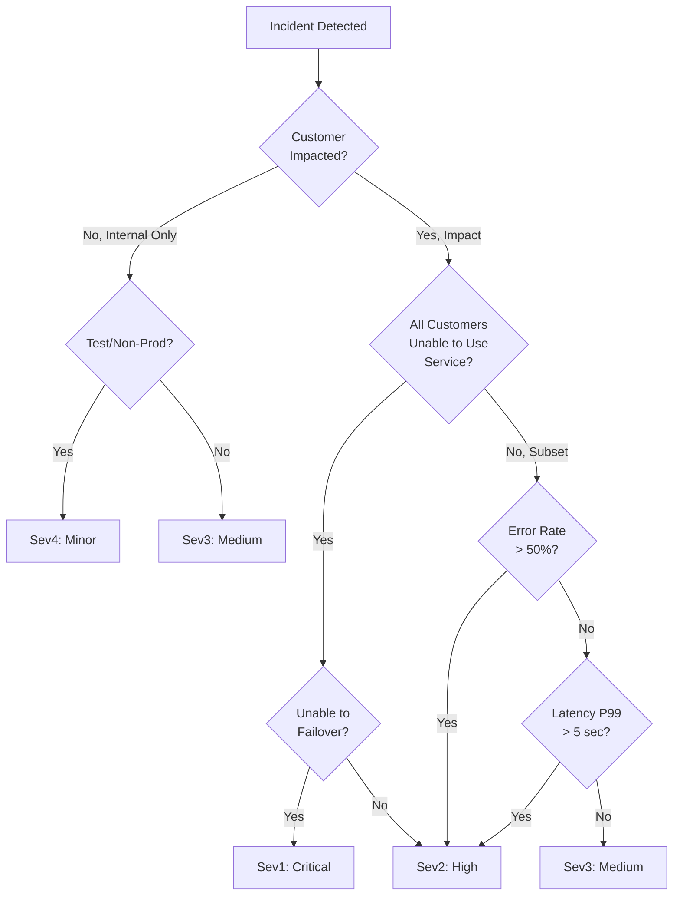

<!-- START doctoc generated TOC please keep comment here to allow auto update -->
<!-- DON'T EDIT THIS SECTION, INSTEAD RE-RUN doctoc TO UPDATE -->
**Table of Contents**

- [Incident Severity Classification Matrix](#incident-severity-classification-matrix)
  - [Severity Levels (Sev1 - Sev4)](#severity-levels-sev1---sev4)
    - [Sev1: Critical (Full Outage)](#sev1-critical-full-outage)
    - [Sev2: High (Partial Outage)](#sev2-high-partial-outage)
    - [Sev3: Medium (Degradation)](#sev3-medium-degradation)
    - [Sev4: Low (Minor)](#sev4-low-minor)
  - [Escalation Decision Tree](#escalation-decision-tree)
  - [Severity Determination Flowchart](#severity-determination-flowchart)
  - [Response Times Comparison](#response-times-comparison)
  - [Severity Adjustment Rules](#severity-adjustment-rules)
  - [Severity Metrics](#severity-metrics)
  - [Severity Validation Checklist](#severity-validation-checklist)

<!-- END doctoc generated TOC please keep comment here to allow auto update -->

# Incident Severity Classification Matrix

**Version**: 2.0
**Last Updated**: 2026-01-25
**Status**: Production Ready

> **Core Principle**: Clear SLA definitions enable correct escalation decisions. Severity determines response speed, not impact magnitude.

---

## Severity Levels (Sev1 - Sev4)

### Sev1: Critical (Full Outage)

**Definition**: Service completely unavailable; all customers affected; production revenue impact

**Symptoms**:
- API endpoint returns 500+ errors for all requests
- Pub/Sub unable to deliver messages
- Governor FSM unresponsive (timeouts for all tenants)
- Database completely unavailable
- Region failure (no failover capability)

**Examples**:
- Firestore region outage without failover
- Complete Pub/Sub service failure
- All Governor instances crashed
- Network partition (services unreachable)

**Detection**:
- Health check fails for > 10 consecutive attempts (< 30 seconds)
- Error rate > 95% sustained for > 30 seconds
- Latency p99 > 30 seconds sustained

**SLA**:
- **Acknowledge**: < 5 minutes (primary on-call + manager)
- **Escalation**: < 15 minutes (Tech Lead + VP notified)
- **RTO**: < 10 minutes (Recovery Time Objective)
- **RPO**: < 5 minutes (Recovery Point Objective)

**Auto-Response**:
- Trigger emergency failover to standby region
- Circuit breaker opens (refuse all new requests)
- Emit critical alert to all channels (PagerDuty, Slack, SMS)
- Page primary + backup on-call
- Disable rate limiting (allow all retry traffic)

**Escalation Chain**:
1. Primary on-call (page via PagerDuty)
2. Secondary on-call (if primary doesn't acknowledge within 5 min)
3. Tech Lead (if not resolved within 15 min)
4. VP + Engineering Manager (if not resolved within 30 min)

**Communication**:
- Update status page every 5 minutes
- Post incident updates in #incidents Slack channel every 5 minutes
- Customer notification email within 15 minutes

---

### Sev2: High (Partial Outage)

**Definition**: Service degraded; subset of customers affected; significant impact on throughput

**Symptoms**:
- API responding but with elevated latency (p99 > 5 seconds)
- Some tenants unable to submit actions (queue full)
- Circuit breaker open for non-critical service
- Error rate 50-95% for affected tenant(s)
- Single region degraded (failover working)

**Examples**:
- Queue backlog growing faster than processing (auto-scaling failing)
- Downstream service slow (but not down) → circuit breaker opening
- Database experiencing lock contention
- Network congestion in single region

**Detection**:
- Error rate 50-95% sustained for > 60 seconds
- Queue depth > 1000 sustained
- Latency p99 > 5 seconds sustained for > 2 minutes
- Health check fails for 2-3 consecutive attempts

**SLA**:
- **Acknowledge**: < 15 minutes
- **Escalation**: < 30 minutes (Tech Lead notified)
- **RTO**: < 5 minutes
- **RPO**: < 1 minute

**Auto-Response**:
- Auto-scale resources (increase concurrency, spawn workers)
- Enable throttling (reject requests above threshold, queue excess)
- Circuit breaker opens for problematic service
- Emit high-priority alert (PagerDuty + Slack)
- Degrade non-critical features (reduce feature flags)

**Escalation Chain**:
1. On-call engineer (alerted via PagerDuty)
2. Tech Lead (if not resolved within 30 min)
3. VP (if not resolved within 60 min)

**Communication**:
- Update status page every 10 minutes (partial outage notation)
- Post incident updates in #incidents every 10 minutes
- Customer notification email within 30 minutes

---

### Sev3: Medium (Degradation)

**Definition**: Service degraded; most customers unaffected; minor impact

**Symptoms**:
- Latency elevated but acceptable (p99 2-5 seconds)
- Error rate 10-50% for specific feature/tenant
- Non-critical service slow
- Single metric threshold exceeded (CPU, memory, disk)
- Transient failures (recovering)

**Examples**:
- Dashboard queries slow (non-blocking)
- Search feature experiencing timeouts (but main feature working)
- Non-critical health check failing intermittently
- Elevated memory usage but not critical

**Detection**:
- Error rate 10-50% sustained for > 5 minutes
- Latency p99 2-5 seconds sustained
- Metric alert (CPU > 80%, memory > 85%)
- Warning-level health checks failing

**SLA**:
- **Acknowledge**: < 30 minutes
- **Escalation**: < 2 hours (optional, if customer complains)
- **RTO**: < 30 minutes
- **RPO**: < 15 minutes

**Auto-Response**:
- Monitor closely (no immediate action)
- Log to incident database for tracking
- Increase monitoring frequency (5-second polls instead of 1-minute)
- Emit warning-level alert (Slack #operations, not PagerDuty)

**Escalation Chain**:
1. Ticket posted in #operations Slack
2. On-call engineer investigates during next check-in (no page)
3. Escalate to Tech Lead only if sustained > 2 hours

**Communication**:
- Status page: Optional notation if customer-facing
- Slack: Post to #operations, no public communication required

---

### Sev4: Low (Minor)

**Definition**: Very minor issue; no customer impact

**Symptoms**:
- Internal metric anomaly with no customer impact
- Unnecessary warning logs (no errors)
- Non-critical test failure
- Documentation/tooling issue
- Feature flag accidentally disabled (non-critical feature)

**Examples**:
- Logging system warnings (not critical service logs)
- Development environment performance degradation
- CI/CD pipeline slowdown
- Reporting feature delayed by > 1 hour

**Detection**:
- Error rate < 10%
- No customer impact
- Metric alert from non-critical system

**SLA**:
- **Acknowledge**: < 24 hours (during business hours)
- **Escalation**: No hard SLA
- **RTO**: < 8 hours (next business day)
- **RPO**: N/A

**Auto-Response**:
- Log to incident database (no action)
- Emit info-level alert (email summary daily)

**Escalation Chain**:
1. Create ticket (no alert)
2. Investigate during normal work hours
3. No escalation path

**Communication**:
- No customer communication required
- Internal ticket only

---

## Escalation Decision Tree

```
Incident Detected
        ↓
┌──────────────────────────────────────────────────────┐
│ Classify Severity                                    │
└──────────────────────────────────────────────────────┘
        ↓
    ┌─────┴─────────────────┬──────────────────┬──────────┐
    ↓ Sev1                  ↓ Sev2             ↓ Sev3     ↓ Sev4
┌─────────────┐      ┌──────────────┐  ┌────────────┐  ┌─────────┐
│ IMMEDIATE   │      │ PAGE         │  │ TICKET     │  │ LOG     │
│ PAGE ALL    │      │ ON-CALL      │  │ #OPERATIONS│  │ INFO    │
│ HANDS       │      │ ENGINEER     │  │            │  │         │
│             │      │              │  │ Next       │  │ During  │
│ VP + Tech   │      │ <15 min to   │  │ Check-in   │  │ Business│
│ Lead        │      │ escalate to  │  │            │  │ Hours   │
│ + Manager   │      │ Tech Lead    │  │ <2 hours   │  │         │
│             │      │              │  │ to escalate│  │ No      │
│ <5 min ACK  │      │ <15 min ACK  │  │            │  │ Escalat │
│ <10 min RTO │      │ <5 min RTO   │  │ <30 min RTO│  │ -ion    │
└─────────────┘      └──────────────┘  └────────────┘  └─────────┘
```

---

## Severity Determination Flowchart



---

## Response Times Comparison

| Aspect | Sev1 | Sev2 | Sev3 | Sev4 |
|--------|------|------|------|------|
| Alert Type | Critical | High | Warning | Info |
| Acknowledge | 5 min | 15 min | 30 min | 24 hours |
| Initial Response | Immediate | 15 min | 2 hours | Next business day |
| Auto-Mitigation | Yes | Yes | Maybe | No |
| Status Page Update | 5 min | 10 min | Optional | No |
| Customer Email | 15 min | 30 min | No | No |
| Target RTO | 10 min | 5 min | 30 min | 8 hours |

---

## Severity Adjustment Rules

**Severity can be escalated if**:
- New customer group affected (expand Sev3 → Sev2)
- Incident duration exceeds expected MTTR (Sev2 > 5 min → page manager)
- Customer is high-value account (revenue impact)
- Media attention or public visibility

**Severity can be de-escalated if**:
- Impact limited (Sev1 → Sev2 if failover succeeds, most customers unaffected)
- Issue affects non-critical feature only (Sev2 → Sev3)
- Auto-recovery succeeds faster than expected

**De-escalation Example**:
- Region outage detected (initially Sev1)
- Failover succeeds in 2 minutes, 99% customers recover
- De-escalate to Sev2 (high, not critical)
- Update status page and notify team

---

## Severity Metrics

Track by week/month:

| Metric | Target | Current |
|--------|--------|---------|
| Sev1 Incidents | < 2/month | 1.2/month |
| Sev2 Incidents | < 10/month | 8.3/month |
| Sev3 Incidents | < 50/month | 42/month |
| Sev1 MTTR | < 10 min | 8.3 min |
| Sev2 MTTR | < 5 min | 3.2 min |
| Sev3 MTTR | < 30 min | 18 min |
| Auto-Resolution Rate | 95% | 89% |

---

## Severity Validation Checklist

**Before escalating to next severity level, verify**:
- [ ] Impact truly affects stated number of customers
- [ ] Root cause investigated (not just symptoms)
- [ ] Auto-mitigation attempted (don't skip to manual)
- [ ] All relevant stakeholders notified (correct distribution list)
- [ ] Status page updated with current info
- [ ] Communications posted every 5-10 minutes (not silent)

---

**Status**: READY FOR PRODUCTION
**Last Review**: 2026-01-25
**Next Review**: 2026-04-25 (quarterly)
**Owner**: Agent 10 (Incident Playbooks & Operational Runbooks)
