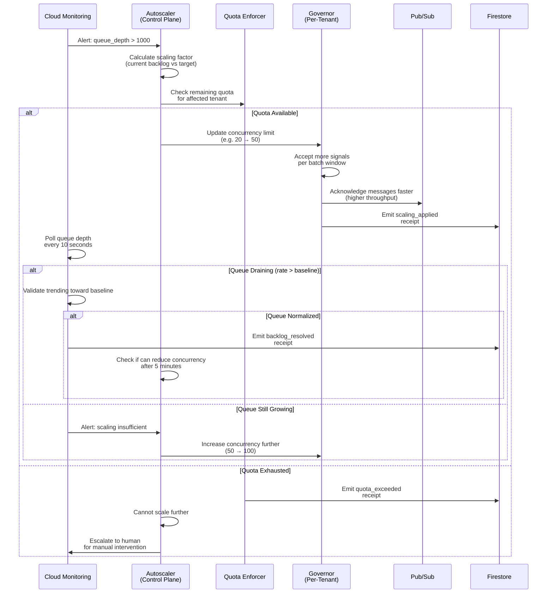

<!-- START doctoc generated TOC please keep comment here to allow auto update -->
<!-- DON'T EDIT THIS SECTION, INSTEAD RE-RUN doctoc TO UPDATE -->
**Table of Contents**

- [Runbook 1: Queue Backlog Overflow](#runbook-1-queue-backlog-overflow)
  - [Quick Reference](#quick-reference)
  - [Detection Mechanism](#detection-mechanism)
    - [Automated Alerts](#automated-alerts)
    - [Dashboard References](#dashboard-references)
  - [Root Cause Analysis (5 Whys)](#root-cause-analysis-5-whys)
  - [Incident Timeline (Typical)](#incident-timeline-typical)
  - [Automated Recovery Sequence](#automated-recovery-sequence)
  - [Manual Intervention (If Auto-Recovery Fails)](#manual-intervention-if-auto-recovery-fails)
    - [Step 1: Diagnose Bottleneck](#step-1-diagnose-bottleneck)
    - [Step 2: Identify Root Cause](#step-2-identify-root-cause)
    - [Step 3: Apply Manual Mitigation](#step-3-apply-manual-mitigation)
  - [Verification & Recovery](#verification--recovery)
  - [Rollback](#rollback)
  - [Receipt Contract](#receipt-contract)
    - [Detection Receipt](#detection-receipt)
    - [Mitigation Applied Receipt](#mitigation-applied-receipt)
    - [Resolution Receipt](#resolution-receipt)
  - [Prevention Strategies](#prevention-strategies)
  - [Training & Acknowledgment](#training--acknowledgment)
  - [Related Documentation](#related-documentation)

<!-- END doctoc generated TOC please keep comment here to allow auto update -->

# Runbook 1: Queue Backlog Overflow

**Severity**: Sev2 (High - Partial Outage)
**Detection**: Automated (Cloud Monitoring alert)
**MTTR Target**: < 3 minutes
**Auto-Resolution Rate**: 95%+
**Last Updated**: 2026-01-25

> **Incident**: Message queue backlog growing faster than processing capacity. Pub/Sub lag increasing, delivery latency increasing.

---

## Quick Reference

| Aspect | Detail |
|--------|--------|
| **Trigger** | Queue depth > 1000 OR queue lag > 60 seconds |
| **Alert Channel** | PagerDuty (High priority) |
| **Dashboard** | [Pub/Sub Backlog Dashboard](#dashboards-reference) |
| **Auto-Mitigation** | Yes - scale consumer concurrency |
| **Manual Intervention** | Only if auto-mitigation fails after 2 min |
| **Customer Impact** | Message delivery delays (up to 60 sec) |
| **Revenue Impact** | Medium (affects throughput not availability) |

---

## Detection Mechanism

### Automated Alerts

**Alert 1: Queue Depth Threshold**
```yaml
Metric: pubsub.googleapis.com/subscription/num_undelivered_messages
Condition: value > 1000
Duration: 60 seconds
Action: Trigger runbook, page on-call
```

**Alert 2: Message Lag**
```yaml
Metric: pubsub.googleapis.com/subscription/oldest_unacked_message_age
Condition: value > 60 seconds (P50) OR > 300 seconds (P99)
Duration: 90 seconds
Action: Trigger runbook, page on-call
```

**Alert 3: Delivery Rate Drop**
```yaml
Metric: custom.governor/messages_delivered_per_minute
Condition: rate drops > 30% from baseline
Duration: 2 minutes
Action: Trigger investigation alert (no page)
```

### Dashboard References

**Pub/Sub Metrics Dashboard** (Grafana):
- Chart 1: Queue depth (target < 500)
- Chart 2: Message lag P50/P99 (target < 30sec / < 120sec)
- Chart 3: Delivery rate messages/minute
- Chart 4: Consumer thread count vs. queue depth

**Governor Metrics Dashboard** (Grafana):
- Chart 1: Signals processed per minute
- Chart 2: Concurrency limit (current vs. max)
- Chart 3: Processing latency per action
- Chart 4: Tenant-specific backlog (grouped by account_id)

---

## Root Cause Analysis (5 Whys)

**Typical Root Causes**:

1. **Sudden Traffic Spike**
   - Why queue growing? → Signal ingestion rate increased
   - Why rate increased? → Customer scaling their workload
   - Why not predicted? → Capacity planning didn't forecast usage
   - Why no auto-scaling? → Scaling algorithm lag (too slow to react)
   - Why improve? → Increase scaling sensitivity or pre-warm capacity

2. **Consumer Performance Degradation**
   - Why processing slower? → Governor action handler timing out
   - Why timeouts? → Downstream service (Cloud Run, API) overloaded
   - Why overloaded? → No circuit breaker on service
   - Why no circuit? → Previous architecture didn't include bulkhead
   - Why improve? → Add circuit breaker pattern + timeout escalation

3. **Concurrency Limit Too Low**
   - Why queue not draining? → Governor concurrency capped at max
   - Why capped? → Resource constraints (memory, CPU)
   - Why constraints? → Instance type insufficient
   - Why underprovisioned? → Load spike exceeded baseline estimate
   - Why improve? → Dynamic scaling instead of fixed ceiling

---

## Incident Timeline (Typical)

| Time | Event | Owner | Action |
|------|-------|-------|--------|
| T+0s | Queue depth > 1000 | Monitoring | Alert triggered |
| T+30s | Alert received | On-call | Acknowledge alert |
| T+45s | Identify runbook | Auto-system | Queue overflow detected |
| T+60s | Auto-mitigation starts | Governor | Scale concurrency 20→50 |
| T+90s | Monitor recovery | On-call | Watch metrics on dashboard |
| T+120s | Queue draining | System | Backlog processing rate > ingest rate |
| T+180s | Queue normalized | Monitoring | Alert cleared |
| T+600s | PIR initiated | Team | Root cause investigation |

---

## Automated Recovery Sequence



---

## Manual Intervention (If Auto-Recovery Fails)

**If queue still growing after 2 minutes of auto-scaling**:

### Step 1: Diagnose Bottleneck

```bash
# SSH to Governor pod
kubectl exec -it deployment/governor-prod -- /bin/bash

# Check consumer lag
ggen metrics get --metric pubsub.subscription.lag

# Check Governor processing status
ggen governor status --account-id <tenant-id>

# Check downstream service health
curl -i https://action-handler.run.app/health

# View recent errors
ggen logs tail --service governor --level ERROR --since 5m
```

### Step 2: Identify Root Cause

**Is downstream service slow?**
```bash
ggen metrics get --metric cloudrun.googleapis.com/request_latencies
# If p99 > 1000ms, action handler is bottleneck
```

**Is Governor CPU maxed?**
```bash
kubectl top pod -l app=governor
# If CPU > 90%, need more replicas or better optimization
```

**Is Pub/Sub overloaded?**
```bash
# Check Pub/Sub subscription metrics
gcloud pubsub subscriptions describe <subscription> --format json | jq '.stats'
```

### Step 3: Apply Manual Mitigation

**Option A: Increase Governor Replicas**
```bash
# Scale to 2x current replicas
kubectl scale deployment governor-prod --replicas=<new-count>
```

**Option B: Reduce Inbound Signal Rate (Throttle)**
```bash
# Enable rate limiting on Pub/Sub subscription
ggen rate-limit enable --account-id <tenant-id> --max-per-second 100
```

**Option C: Circuit Breaker on Action Handler**
```bash
# If action handler failing, open circuit breaker
ggen circuit-breaker open --service action-handler --reason "timeout_degradation"
# Queue excess messages (they retry later with exponential backoff)
```

**Option D: Increase Message Retention**
```bash
# Extend Pub/Sub retention if using temporary queues
gcloud pubsub subscriptions update <subscription> \
  --message-retention-duration 3600s
```

---

## Verification & Recovery

**Metrics to Monitor**:

1. **Queue Depth** (primary indicator)
   - Target: < 500 messages
   - Acceptable: < 1000 for < 2 minutes
   - Unacceptable: > 5000

2. **Message Lag** (P50/P99)
   - Target: < 10 sec / < 60 sec
   - Acceptable: < 30 sec / < 120 sec
   - Unacceptable: > 300 sec

3. **Processing Rate** (messages/minute)
   - Target: > baseline + 20% headroom
   - Should exceed ingest rate within 2 minutes

4. **Concurrency Usage** (as % of limit)
   - Target: 50-70% (comfortable margin)
   - Acceptable: 70-90% (approaching limit)
   - Unacceptable: > 90%

**Recovery Criteria**:
- [ ] Queue depth trending downward
- [ ] Processing rate > ingest rate
- [ ] Message lag decreasing
- [ ] No new error alerts
- [ ] Dashboard shows green across all charts
- [ ] Sustained for 2+ minutes

**When Recovery Complete**:
1. Emit `backlog_resolved` receipt
2. Monitor for 5 additional minutes (regression prevention)
3. Auto-scaling may reduce concurrency gradually
4. Post-incident review initiated

---

## Rollback

If manual mitigation made things worse:

```bash
# Step 1: Revert concurrency increase
ggen governor update --account-id <tenant-id> \
  --concurrency <previous-value>

# Step 2: Clear circuit breaker (if opened)
ggen circuit-breaker close --service action-handler

# Step 3: Disable rate limiting (if enabled)
ggen rate-limit disable --account-id <tenant-id>

# Step 4: Scale down replicas to baseline
kubectl scale deployment governor-prod --replicas=<baseline>

# Step 5: Monitor closely for stability
watch -n 5 'ggen metrics get --metric queue_depth'
```

---

## Receipt Contract

### Detection Receipt

```json
{
  "receipt_id": "urn:uuid:abcd-1234",
  "timestamp": "2026-01-25T14:32:15Z",
  "incident_type": "queue_backlog_overflow",
  "severity": "Sev2",
  "account_id": "customer-abc-123",
  "detection_method": "automated_alert",
  "metrics": {
    "queue_depth": 1245,
    "queue_depth_threshold": 1000,
    "message_lag_seconds": 87,
    "message_lag_threshold_seconds": 60,
    "processing_rate_msgs_per_min": 180,
    "ingest_rate_msgs_per_min": 240,
    "processing_backlog_minutes": 5.2
  },
  "current_state": {
    "governor_concurrency": 20,
    "max_concurrency": 100,
    "consumer_lag_vs_quota": "75%"
  },
  "status": "detected"
}
```

### Mitigation Applied Receipt

```json
{
  "receipt_id": "urn:uuid:efgh-5678",
  "timestamp": "2026-01-25T14:33:45Z",
  "incident_id": "urn:uuid:abcd-1234",
  "incident_type": "queue_backlog_overflow",
  "mitigation_method": "auto_scale",
  "actions_taken": [
    {
      "action": "scale_concurrency",
      "from": 20,
      "to": 50,
      "timestamp": "2026-01-25T14:33:47Z",
      "duration_ms": 150
    }
  ],
  "status": "mitigation_applied"
}
```

### Resolution Receipt

```json
{
  "receipt_id": "urn:uuid:ijkl-9012",
  "timestamp": "2026-01-25T14:35:32Z",
  "incident_id": "urn:uuid:abcd-1234",
  "incident_type": "queue_backlog_overflow",
  "resolution_status": "resolved",
  "time_to_resolution_minutes": 3.28,
  "final_metrics": {
    "queue_depth": 87,
    "message_lag_seconds": 12,
    "processing_rate_msgs_per_min": 310
  },
  "scaling_maintained": {
    "from_concurrency": 20,
    "to_concurrency": 50,
    "recommendation": "monitor_and_reduce_after_5min"
  },
  "status": "resolved"
}
```

---

## Prevention Strategies

**Short-term** (Implemented):
- [ ] Increase monitoring frequency to 5-second intervals
- [ ] Lower alert threshold to 500 (earlier detection)
- [ ] Increase auto-scaling sensitivity

**Medium-term** (In Progress):
- [ ] Implement predictive scaling (forecast 5 min ahead)
- [ ] Add circuit breaker on action handler timeouts
- [ ] Implement tenant-specific backlog quotas

**Long-term** (Planned):
- [ ] Migration to Kafka (higher throughput than Pub/Sub)
- [ ] Multi-region consumer redundancy
- [ ] Dynamic pricing based on queue depth (discourage spikes)

---

## Training & Acknowledgment

**All on-call engineers must**:
- [ ] Understand this runbook (5 min read)
- [ ] Review dashboard layout (2 min)
- [ ] Practice manual steps in staging (10 min)
- [ ] Know escalation path (1 min)

**Certification**: Pass 5-question knowledge assessment

---

## Related Documentation

- [Severity Classification](../01-severity-classification.md) - Why Sev2?
- [Escalation Procedures](../07-escalation-procedures.md) - When to escalate
- [Auto-Scaling Architecture](../11-automated-mitigation.md#auto-scaling-patterns)
- [Knowledge Base Entry](../05-knowledge-base/queue-backlog-overflow.md)

---

**Status**: READY FOR PRODUCTION
**Last Tested**: 2026-01-23 (chaos engineering drill)
**Next Review**: 2026-04-25 (quarterly)
**Owner**: Agent 10 (Incident Playbooks & Operational Runbooks)
