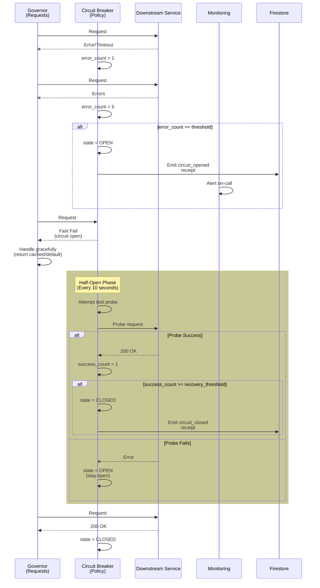

# Runbook 2: Circuit Breaker Opened (Downstream Service Failure)

**Severity**: Sev1/Sev2 (depends on service criticality)
**Detection**: Automated (Error rate threshold)
**MTTR Target**: < 2 minutes (auto-recovery when service recovers)
**Auto-Resolution Rate**: 98%+
**Last Updated**: 2026-01-25

> **Incident**: Downstream service (Action Handler, Cloud Run, API) failing. Circuit breaker opens to prevent cascading failures.

---

## Quick Reference

| Aspect | Detail |
|--------|--------|
| **Trigger** | Error rate > 50% for 30 sec OR timeout > 500ms consistently |
| **Alert Channel** | PagerDuty (High priority) |
| **Dashboard** | [Circuit Breaker Status Dashboard](#dashboards-reference) |
| **Auto-Mitigation** | Yes - circuit opens, fail-fast responses |
| **Manual Intervention** | Restore downstream service, circuit auto-resets |
| **Customer Impact** | Graceful degradation (explicit failures vs cascading) |
| **Revenue Impact** | Medium to High (depends on service) |

---

## Detection Mechanism

### Circuit Breaker States

**Closed** (Normal):
- Requests pass through
- Latency monitored
- Error rate monitored

**Open** (Failed):
- Requests rejected immediately (fail-fast)
- Error count > threshold
- Downstream service deemed unhealthy

**Half-Open** (Recovery):
- Limited requests allowed (test probe)
- If success rate > threshold → Close circuit
- If failure rate > threshold → Stay open

### Automated Alerts

**Alert 1: Circuit Breaker Opened**
```yaml
Condition: circuit_breaker.state == "OPEN"
Duration: Immediate (within 5 seconds)
Action: Page on-call, emit incident receipt
Dashboard: Show which circuit opened + timestamp
```

**Alert 2: High Error Rate**
```yaml
Metric: custom.governor/downstream_error_rate
Condition: value > 50% for 30 seconds
Action: Trigger circuit breaker evaluation
```

**Alert 3: Timeout Spike**
```yaml
Metric: custom.governor/downstream_latency_p99
Condition: value > 500ms sustained
Action: Trigger circuit breaker evaluation
```

---

## Circuit Breaker Configuration

### Service Circuits

**Action Handler Circuit**:
- Error threshold: 5 consecutive errors
- Timeout: 500ms
- Half-open probe rate: 1 request per 10 seconds
- Recovery threshold: 10 successful requests

**Cloud Run Upstream Circuit**:
- Error threshold: 50+ errors in 30 second window
- Timeout: 1000ms
- Half-open probe rate: 10% of traffic
- Recovery threshold: 99% success rate for 60 seconds

**External API Circuit**:
- Error threshold: 100+ errors in 60 second window
- Timeout: 2000ms
- Half-open probe rate: 5% of traffic
- Recovery threshold: 95% success rate for 120 seconds

---

## Root Cause Analysis (5 Whys)

**Typical Root Causes**:

1. **Downstream Service Crashed**
   - Why crashed? → Resource exhaustion (OOM, CPU spike)
   - Why exhaustion? → Leak in service code or dependency
   - Why not detected? → Health check lag (checks every 30 sec)
   - Why slow health checks? → Probes too expensive
   - Why improve? → Faster health checks + auto-restart policy

2. **Dependency Timeout**
   - Why timeout? → Service calling slow dependency
   - Why slow? → Dependency overloaded or network lag
   - Why not isolated? → No circuit breaker between layers
   - Why add circuit? → Prevent cascading failures (bulkhead pattern)
   - Why improve? → Explicit circuit breaker per dependency

3. **Database Connection Exhaustion**
   - Why exhausted? → All connection pool slots taken
   - Why taken? → Slow queries holding connections
   - Why slow? → Missing index or query optimization
   - Why not caught? → Query performance not monitored
   - Why improve? → Add query performance monitoring + auto-index

4. **Network Partition**
   - Why unreachable? → Network partition or firewall rule change
   - Why partition? → Infrastructure change or BGP route flapping
   - Why not recovered? → Circuit didn't auto-reset
   - Why didn't reset? → Half-open probes still failing
   - Why improve? → Health checks against healthier endpoint

---

## Incident Timeline (Typical)

| Time | Event | Owner | Action |
|------|-------|-------|--------|
| T+0s | Error spike detected | Monitoring | First 5 errors logged |
| T+10s | Error rate > 50% | Autoscaler | Evaluate circuit breaker threshold |
| T+30s | Circuit opens | Governor | Stop sending requests to service |
| T+35s | Alert emitted | On-call | Receive page in PagerDuty |
| T+45s | Dashboard viewed | On-call | Identify which service failed |
| T+60s | Diagnose issue | On-call | SSH to service, check logs |
| T+90s | Service restarted | On-call | Kubernetes pod restart or manual restart |
| T+100s | Half-open probes succeed | Governor | Circuit transitions to half-open |
| T+130s | Circuit closes | Governor | Resume normal traffic |
| T+300s | Alert cleared | Monitoring | Circuit stable, incident resolved |

---

## Automated Recovery Sequence



---

## Manual Intervention

### Step 1: Acknowledge Alert

```bash
# Acknowledge in PagerDuty
pagerduty incident acknowledge <incident-id>

# Join incident warroom
# Link provided in PagerDuty alert
```

### Step 2: Diagnose Service Health

```bash
# Check which circuit is open
ggen circuits status

# Get service pod status
kubectl get pods -l app=action-handler -o wide

# Check service logs
kubectl logs -f deployment/action-handler --tail=100

# Check service metrics
ggen metrics get --service action-handler \
  --metrics "errors,latency,cpu,memory" --since 5m

# Manual health check
curl -i https://action-handler.run.app/health
```

### Step 3: Determine Root Cause

**Is service resource-constrained?**
```bash
kubectl top pod -l app=action-handler
# High CPU/Memory = OOM or CPU spike
```

**Is service database unhealthy?**
```bash
# Check database connections
ggen db connections status
# Check for slow queries
ggen db queries slow --since 5m
```

**Is network unreachable?**
```bash
kubectl exec -it pod/action-handler -- ping <upstream-service>
kubectl exec -it pod/action-handler -- nslookup <upstream-service>
```

### Step 4: Apply Mitigation

**Option A: Restart Service Pod**
```bash
# If pod is stuck/zombie
kubectl delete pod -l app=action-handler --grace-period=5
# Kubernetes will auto-create new pod

# Monitor recovery
watch -n 2 'kubectl get pods -l app=action-handler'
```

**Option B: Scale Up Replicas (if OOM)**
```bash
# Increase memory limit
kubectl set resources deployment/action-handler \
  --limits=memory=2Gi,cpu=1000m

# Scale to more replicas
kubectl scale deployment/action-handler --replicas=5
```

**Option C: Drain Connections (if DB pool exhausted)**
```bash
# Restart all pods to reset connection pools
kubectl rollout restart deployment/action-handler
```

**Option D: Emergency Circuit Bypass**
```bash
# If circuit won't recover, temporarily bypass
# (Only if confident service is healthy!)
ggen circuit-breaker override --service action-handler \
  --state CLOSED --duration 5m

# Monitor closely during bypass
watch -n 2 'ggen metrics get --metric error_rate'
```

---

## Recovery Validation

**Metrics to Monitor**:

1. **Circuit State** (primary indicator)
   - Status: Should transition OPEN → HALF_OPEN → CLOSED
   - Half-open phase: 10-60 seconds typical

2. **Error Rate** (should drop to baseline)
   - Current: < 5% (acceptable)
   - Baseline: < 2% (normal)
   - Alert threshold: > 50% (would reopen circuit)

3. **Latency** (P50/P99)
   - P50: < 100ms (normal)
   - P99: < 500ms (normal)
   - Alert threshold: > 1000ms

4. **Service Health**
   - Health check: 200 OK
   - Pod status: Running (not Pending/CrashLoop)
   - Resource usage: Within limits

**Recovery Criteria**:
- [ ] Circuit state: CLOSED
- [ ] Error rate < 5% and decreasing
- [ ] Latency normalized
- [ ] Health checks passing
- [ ] Pod restart completed (if restarted)
- [ ] Sustained for 2+ minutes

**When Recovery Complete**:
1. Emit `circuit_recovered` receipt
2. Monitor for 5 additional minutes
3. Post-incident review initiated within 24 hours

---

## Rollback (If Wrong Mitigation Applied)

If manual fix made things worse:

```bash
# Revert to previous deployment
kubectl rollout undo deployment/action-handler

# Restore memory limits to baseline
kubectl set resources deployment/action-handler \
  --limits=memory=1Gi,cpu=500m

# Scale back to baseline replicas
kubectl scale deployment/action-handler --replicas=2

# Force circuit breaker re-evaluation
ggen circuit-breaker reset --service action-handler

# Monitor closely
watch -n 5 'ggen circuits status'
```

---

## Receipt Contract

### Circuit Opened Receipt

```json
{
  "receipt_id": "urn:uuid:cb01-0001",
  "timestamp": "2026-01-25T15:22:47Z",
  "incident_type": "circuit_breaker_opened",
  "severity": "Sev2",
  "affected_service": "action-handler",
  "circuit_state": "OPEN",
  "trigger_reason": "error_rate_threshold_exceeded",
  "metrics_at_trigger": {
    "error_rate_percent": 68,
    "error_threshold_percent": 50,
    "consecutive_errors": 7,
    "error_threshold_count": 5,
    "latency_p99_ms": 1250,
    "latency_threshold_ms": 500
  },
  "status": "open"
}
```

### Circuit Half-Open Receipt

```json
{
  "receipt_id": "urn:uuid:cb01-0002",
  "timestamp": "2026-01-25T15:23:15Z",
  "incident_id": "urn:uuid:cb01-0001",
  "incident_type": "circuit_breaker_recovery_attempt",
  "affected_service": "action-handler",
  "circuit_state": "HALF_OPEN",
  "recovery_reason": "attempting_probe",
  "probe_interval_seconds": 10,
  "success_threshold_for_recovery": 10,
  "status": "half_open_probing"
}
```

### Circuit Closed Receipt

```json
{
  "receipt_id": "urn:uuid:cb01-0003",
  "timestamp": "2026-01-25T15:24:32Z",
  "incident_id": "urn:uuid:cb01-0001",
  "incident_type": "circuit_breaker_recovered",
  "affected_service": "action-handler",
  "circuit_state": "CLOSED",
  "time_open_minutes": 1.75,
  "recovery_method": "service_restart",
  "actions_taken": [
    {
      "action": "pod_restart",
      "timestamp": "2026-01-25T15:23:45Z",
      "previous_pod": "action-handler-xyz"
    }
  ],
  "final_metrics": {
    "error_rate_percent": 0.8,
    "latency_p99_ms": 120
  },
  "status": "recovered"
}
```

---

## Prevention Strategies

**Short-term** (Implemented):
- [ ] Increase resource limits (memory buffer)
- [ ] Add pod restart policy
- [ ] Increase circuit breaker probe frequency

**Medium-term** (In Progress):
- [ ] Implement connection pooling for databases
- [ ] Add query performance monitoring
- [ ] Implement bulkhead pattern for all dependencies

**Long-term** (Planned):
- [ ] Migrate to mesh (Istio/Linkerd) for automatic circuit breaker
- [ ] Implement chaos engineering tests for circuit breaker
- [ ] Add distributed tracing for dependency latency visibility

---

## Related Documentation

- [Automated Mitigation Strategies](../11-automated-mitigation.md#circuit-breaker-patterns)
- [Escalation Procedures](../07-escalation-procedures.md)
- [Knowledge Base Entry](../05-knowledge-base/circuit-breaker-opened.md)

---

**Status**: READY FOR PRODUCTION
**Last Tested**: 2026-01-24 (chaos engineering drill)
**Next Review**: 2026-04-25 (quarterly)
**Owner**: Agent 10 (Incident Playbooks & Operational Runbooks)
