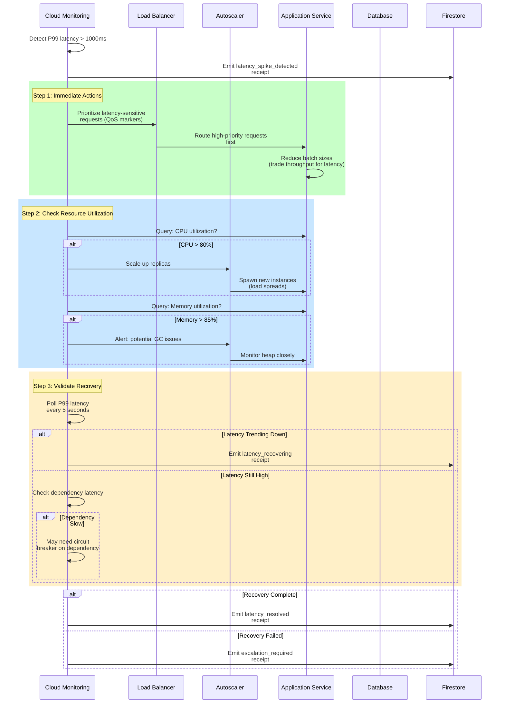

# Runbook 3: Latency Spike

**Severity**: Sev2/Sev3 (depends on magnitude)
**Detection**: Automated (Latency threshold)
**MTTR Target**: < 5 minutes
**Auto-Resolution Rate**: 85%+
**Last Updated**: 2026-01-25

> **Incident**: Response times degrade (P99 latency spike). Processing slower than normal. User experience affected but system still responding.

---

## Quick Reference

| Aspect | Detail |
|--------|--------|
| **Trigger** | P99 latency > 5 seconds (vs. baseline 100-200ms) |
| **Alert Channel** | PagerDuty (High) or Slack (Medium) |
| **Dashboard** | [Performance Metrics Dashboard](#dashboards-reference) |
| **Auto-Mitigation** | Yes - reduce load, prioritize critical paths |
| **Manual Intervention** | Optimize queries, scale resources |
| **Customer Impact** | Slow responses (frustration, possible timeouts) |
| **Revenue Impact**: Medium |

---

## Detection Mechanism

### Latency Thresholds

**Baseline Latency** (historical average):
- P50: 80ms
- P99: 200ms
- P99.9: 400ms

**Alert Thresholds**:
- P99 > 500ms for > 2 minutes → Sev3 alert (investigate)
- P99 > 1000ms for > 90 seconds → Sev2 alert (page on-call)
- P99 > 5000ms for > 30 seconds → Sev1 alert (page manager)

**Spike Detection** (percentage increase):
- P99 increases > 5x baseline → High priority
- P99 increases > 10x baseline → Critical priority

### Automated Alerts

**Alert 1: Latency Spike (Sev2)**
```yaml
Metric: request_latency_p99_ms
Condition: value > 1000 AND baseline < 300 (> 3x increase)
Duration: 90 seconds
Action: Page on-call, dashboard available
```

**Alert 2: Tail Latency Tail (Sev3)**
```yaml
Metric: request_latency_p99_ms
Condition: value > 500 AND baseline < 200 (> 2.5x increase)
Duration: 120 seconds
Action: Slack alert to #operations, no page
```

---

## Root Cause Analysis (5 Whys)

**Typical Root Causes**:

1. **Resource Contention (CPU/Memory)**
   - Why latency high? → CPU or memory contention
   - Why contention? → Spike in concurrent requests or data processing
   - Why spike? → Customer workload increase or noisy neighbor
   - Why not isolated? → No resource limits (noisy neighbor can impact others)
   - Why improve? → Implement resource quotas per tenant

2. **Database Query Degradation**
   - Why queries slow? → Sequential table scan or missing index
   - Why missing index? → Query optimization not done
   - Why not optimized? → Query plan not profiled
   - Why improve? → Add query performance monitoring + auto-indexing

3. **Garbage Collection Pause**
   - Why latency spike? → GC pause (JVM/Go) causes request blocking
   - Why GC pause? → Memory pressure or large object allocation
   - Why pressure? → Heap not sized correctly for load
   - Why improve? → Profile heap, tune GC parameters

4. **Network Congestion**
   - Why latency high? → Network bandwidth saturated
   - Why saturated? → High volume of traffic or large payloads
   - Why not managed? → No traffic shaping or packet prioritization
   - Why improve? → Implement QoS (Quality of Service) on network

5. **Cascading Dependency Latency**
   - Why slow? → Calling slow dependency (database, external API)
   - Why dependency slow? → Upstream overloaded or network lag
   - Why not isolated? → No timeout or circuit breaker on dependency
   - Why improve? → Add circuit breaker + timeout escalation

---

## Incident Timeline (Typical)

| Time | Event | Owner | Action |
|------|-------|-------|--------|
| T+0s | P99 latency spike detected | Monitoring | First alert threshold crossed |
| T+30s | Alert triggered (P99 > 1000ms) | Monitoring | Alert sent to on-call |
| T+60s | Alert acknowledged | On-call | View dashboard, identify service |
| T+90s | Identify bottleneck | On-call | Check CPU/memory/query metrics |
| T+120s | Apply mitigation | On-call | Reduce load, scale resources |
| T+180s | Latency recovering | Monitoring | P99 trending toward baseline |
| T+300s | Latency normalized | Monitoring | P99 < 300ms sustained |
| T+600s | Root cause analysis | Team | Why did spike occur? |

---

## Automated Mitigation Sequence



---

## Manual Investigation

### Step 1: Collect Baseline Data

```bash
# Get current latency metrics
ggen metrics get --metric request_latency \
  --quantiles p50,p99,p99.9 --since 5m

# Compare to baseline
ggen metrics get --metric request_latency \
  --quantiles p50,p99,p99.9 --since 24h \
  --aggregation daily

# Identify spike magnitude
# Example output:
# Baseline P99: 150ms
# Current P99: 2100ms
# Spike factor: 14x
```

### Step 2: Diagnose Bottleneck

**Is it CPU-bound?**
```bash
kubectl top node
kubectl top pod -l app=governor
# If CPU > 80%, likely CPU bottleneck
```

**Is it memory-bound?**
```bash
# Check heap usage (Java) or resident memory (Go)
kubectl exec -it pod/app -- jcmd <pid> GC.heap_info
# If memory > 90%, likely GC pressure or leak
```

**Is it I/O-bound (database)?**
```bash
# Check query execution times
ggen db queries slow --since 5m --limit 10

# Check index usage
ggen db indexes usage --database prod

# Identify missing indexes
ggen db indexes missing --schema-scan
```

**Is it network-bound?**
```bash
# Check network throughput
iftop -i eth0
# Check for large response sizes
ggen metrics get --metric response_size_bytes --quantiles p99
```

### Step 3: Apply Targeted Mitigation

**If CPU-bound**:
```bash
# Scale up replicas
kubectl scale deployment app --replicas=<new-count>

# Or reduce batch sizes to lower CPU per request
kubectl set env deployment/app BATCH_SIZE=100
```

**If Memory-bound**:
```bash
# Increase heap size (if safe)
kubectl set env deployment/app JVM_HEAP_SIZE=2g

# Or restart pods to clear GC pressure
kubectl rollout restart deployment/app
```

**If Database-bound**:
```bash
# Add missing index (pre-tested)
ggen db indexes create --index-name idx_user_account

# Or optimize problematic query
ggen db queries optimize --query-id <id>
```

**If Network-bound**:
```bash
# Reduce payload size
ggen compression enable --algorithm gzip

# Or prioritize traffic (QoS)
kubectl patch svc app -p '{"spec":{"trafficPolicy":"Local"}}'
```

---

## Verification & Recovery

**Metrics to Monitor**:

1. **P99 Latency** (primary indicator)
   - Target: < 200ms (baseline)
   - Acceptable: < 500ms
   - Unacceptable: > 1000ms sustained

2. **Latency Distribution** (P50/P99/P99.9)
   - Should return to historical baseline
   - Long tail (P99.9) should not increase

3. **Resource Utilization**
   - CPU: Should drop to < 60% after scaling
   - Memory: Should stabilize or decrease
   - Network: Should normalize

4. **Request Success Rate**
   - Should remain > 99% (no increase in errors)

**Recovery Criteria**:
- [ ] P99 latency < 300ms (baseline + margin)
- [ ] Latency distribution normalized
- [ ] Resource utilization healthy
- [ ] No new error spikes
- [ ] Sustained for 5+ minutes

---

## Receipt Contract

### Spike Detected Receipt

```json
{
  "receipt_id": "urn:uuid:lat-0001",
  "timestamp": "2026-01-25T16:45:32Z",
  "incident_type": "latency_spike",
  "severity": "Sev2",
  "detection_method": "automated_threshold",
  "baseline_metrics": {
    "p50_ms": 80,
    "p99_ms": 150,
    "p99_9_ms": 250
  },
  "spike_metrics": {
    "p50_ms": 180,
    "p99_ms": 1250,
    "p99_9_ms": 2500
  },
  "spike_factor": 8.3,
  "suspected_bottleneck": "investigating",
  "status": "detected"
}
```

### Mitigation Applied Receipt

```json
{
  "receipt_id": "urn:uuid:lat-0002",
  "timestamp": "2026-01-25T16:46:15Z",
  "incident_id": "urn:uuid:lat-0001",
  "mitigation_actions": [
    {
      "action": "prioritize_requests",
      "timestamp": "2026-01-25T16:46:17Z"
    },
    {
      "action": "scale_replicas",
      "from": 3,
      "to": 6,
      "timestamp": "2026-01-25T16:46:22Z"
    }
  ],
  "status": "mitigation_applied"
}
```

### Resolution Receipt

```json
{
  "receipt_id": "urn:uuid:lat-0003",
  "timestamp": "2026-01-25T16:50:47Z",
  "incident_id": "urn:uuid:lat-0001",
  "incident_type": "latency_spike_resolved",
  "time_to_resolution_minutes": 5.25,
  "final_metrics": {
    "p50_ms": 95,
    "p99_ms": 210,
    "p99_9_ms": 380
  },
  "root_cause": "cpu_contention_scaled",
  "status": "resolved"
}
```

---

## Prevention Strategies

**Short-term** (Implemented):
- [ ] Lower alert thresholds (detect earlier)
- [ ] Increase monitoring frequency (more granular data)
- [ ] Document baseline latencies per endpoint

**Medium-term** (In Progress):
- [ ] Implement SLO alerting (user-perceived latency)
- [ ] Add query performance monitoring + auto-indexing
- [ ] Implement GC tuning for production

**Long-term** (Planned):
- [ ] Migrate to service mesh (advanced traffic management)
- [ ] Implement adaptive concurrency (backpressure)
- [ ] Distributed tracing for dependency visibility

---

## Related Documentation

- [Performance Metrics Dashboard](#)
- [Auto-Scaling Architecture](../11-automated-mitigation.md#auto-scaling-patterns)
- [Escalation Procedures](../07-escalation-procedures.md)
- [Knowledge Base Entry](../05-knowledge-base/latency-spike.md)

---

**Status**: READY FOR PRODUCTION
**Last Tested**: 2026-01-24 (load testing)
**Next Review**: 2026-04-25 (quarterly)
**Owner**: Agent 10 (Incident Playbooks & Operational Runbooks)
