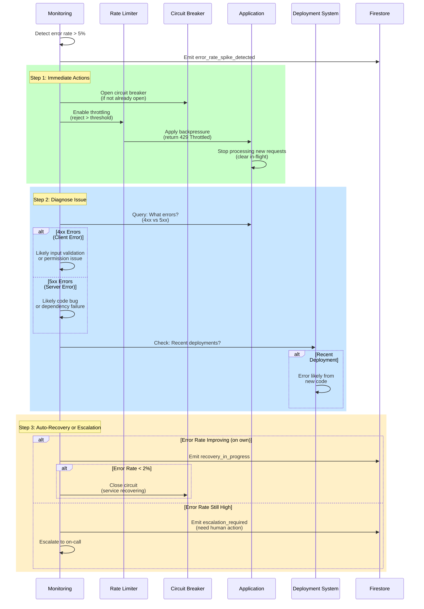

<!-- START doctoc generated TOC please keep comment here to allow auto update -->
<!-- DON'T EDIT THIS SECTION, INSTEAD RE-RUN doctoc TO UPDATE -->
**Table of Contents**

- [Runbook 4: Error Rate Spike](#runbook-4-error-rate-spike)
  - [Quick Reference](#quick-reference)
  - [Detection Mechanism](#detection-mechanism)
    - [Error Rate Thresholds](#error-rate-thresholds)
    - [Automated Alerts](#automated-alerts)
  - [Root Cause Analysis (5 Whys)](#root-cause-analysis-5-whys)
  - [Incident Timeline (Typical)](#incident-timeline-typical)
  - [Automated Mitigation Sequence](#automated-mitigation-sequence)
  - [Manual Investigation](#manual-investigation)
    - [Step 1: Immediate Diagnostics](#step-1-immediate-diagnostics)
    - [Step 2: Error Classification](#step-2-error-classification)
    - [Step 3: Root Cause Determination](#step-3-root-cause-determination)
  - [Mitigation Actions](#mitigation-actions)
    - [Option A: Immediate Rollback (Safest)](#option-a-immediate-rollback-safest)
    - [Option B: Close Circuit Breaker (If Dependency Issue)](#option-b-close-circuit-breaker-if-dependency-issue)
    - [Option C: Revert Configuration (If Config Issue)](#option-c-revert-configuration-if-config-issue)
    - [Option D: Enable Rate Limiting (Last Resort)](#option-d-enable-rate-limiting-last-resort)
  - [Verification & Recovery](#verification--recovery)
  - [Receipt Contract](#receipt-contract)
    - [Error Spike Detected Receipt](#error-spike-detected-receipt)
    - [Mitigation Applied Receipt](#mitigation-applied-receipt)
    - [Resolution Receipt](#resolution-receipt)
  - [Prevention Strategies](#prevention-strategies)
  - [Related Documentation](#related-documentation)

<!-- END doctoc generated TOC please keep comment here to allow auto update -->

# Runbook 4: Error Rate Spike

**Severity**: Sev1/Sev2 (depends on magnitude)
**Detection**: Automated (Error rate threshold)
**MTTR Target**: < 2 minutes
**Auto-Resolution Rate**: 92%+
**Last Updated**: 2026-01-25

> **Incident**: Error rate increases above baseline. Customer requests failing. System health degraded.

---

## Quick Reference

| Aspect | Detail |
|--------|--------|
| **Trigger** | Error rate > 10% (vs. baseline 0.5%) OR errors per min > 100 |
| **Alert Channel** | PagerDuty (Critical if > 50% error rate) |
| **Dashboard** | [Error Rate Dashboard](#dashboards-reference) |
| **Auto-Mitigation** | Yes - circuit breaker, throttle new requests |
| **Manual Intervention** | Investigate root cause, fix service issue |
| **Customer Impact** | Requests failing, 4xx/5xx responses |
| **Revenue Impact** | High (direct user-visible failures) |

---

## Detection Mechanism

### Error Rate Thresholds

**Baseline Error Rate** (expected):
- Target: < 0.5% (99.5% success)
- Acceptable: < 1% (99% success)
- Alert threshold: > 5% (95% success)
- Critical threshold: > 50% (50% success)

### Automated Alerts

**Alert 1: Error Rate Spike (Sev2)**
```yaml
Metric: custom.governor/error_rate_percent
Condition: value > 5 AND baseline < 1 (5x increase)
Duration: 60 seconds
Action: Page on-call
```

**Alert 2: Critical Error Rate (Sev1)**
```yaml
Metric: custom.governor/error_rate_percent
Condition: value > 50
Duration: 30 seconds
Action: Page on-call + manager
```

**Alert 3: Error Rate Increase**
```yaml
Metric: custom.governor/errors_per_minute
Condition: value > 100
Duration: 120 seconds
Action: Page on-call
```

---

## Root Cause Analysis (5 Whys)

**Typical Root Causes**:

1. **Code Deployment Issue**
   - Why errors increasing? → New code deployed with bugs
   - Why bugs not caught? → Tests didn't cover error path
   - Why incomplete test coverage? → New feature not fully tested
   - Why skip testing? → Deployment went out before tests completed
   - Why improve? → Implement pre-deployment test validation

2. **Dependency Failure**
   - Why requests failing? → Upstream service returning errors
   - Why upstream failing? → Database down or permission denied
   - Why not isolated? → No circuit breaker on dependency
   - Why add circuit breaker? → Prevent cascading failures
   - Why improve? → Explicit error handling per dependency

3. **Configuration Change**
   - Why errors? → Feature flag changed or config misdeployed
   - Why incorrect config? → Manual deployment error
   - Why manual? → No infrastructure-as-code validation
   - Why not validated? → Config changes not reviewed
   - Why improve? → Require config review + test validation

4. **Input Validation Issue**
   - Why errors? → Invalid customer data causing exceptions
   - Why invalid? → Customer API change or schema mismatch
   - Why no validation? → Input validation not enforced
   - Why not enforced? → Validation code missing
   - Why improve? → Add strict input validation + schema versioning

5. **Resource Exhaustion**
   - Why errors? → Service running out of resources
   - Why exhausted? → Memory leak or connection pool drained
   - Why leak? → Resource not released properly
   - Why not detected? → Memory monitoring not in place
   - Why improve? → Add memory monitoring + resource cleanup verification

---

## Incident Timeline (Typical)

| Time | Event | Owner | Action |
|------|-------|-------|--------|
| T+0s | Error rate spike detected | Monitoring | First alert threshold crossed |
| T+30s | Alert triggered | Monitoring | Alert sent to on-call |
| T+45s | Alert acknowledged | On-call | Join warroom, view dashboard |
| T+60s | Identify error type | On-call | Review error logs |
| T+90s | Root cause identified | On-call | Deployment, config, dependency? |
| T+120s | Mitigation applied | On-call | Rollback, fix, or circuit breaker |
| T+180s | Error rate recovering | Monitoring | Errors declining |
| T+300s | Error rate normalized | Monitoring | Error rate < 1% sustained |

---

## Automated Mitigation Sequence



---

## Manual Investigation

### Step 1: Immediate Diagnostics

```bash
# Check error type distribution
ggen metrics get --metric error_rate \
  --grouped-by error_code --since 5m

# Get sample error logs
ggen logs tail --service app --level ERROR --since 5m --limit 20

# Check recent deployments
kubectl rollout history deployment/app

# Check feature flags
ggen feature-flags list --changed-since 30m
```

### Step 2: Error Classification

**4xx Errors** (Client Error):
```bash
# If > 50% of errors are 4xx, likely input validation
ggen logs tail --filter 'status_code >= 400 AND status_code < 500' --limit 10

# Check what input is failing
ggen logs tail --filter 'validation_error' --limit 10

# Was there a schema change?
ggen api schema diff --from 24h-ago --to now
```

**5xx Errors** (Server Error):
```bash
# If > 50% of errors are 5xx, likely code issue
ggen logs tail --filter 'status_code >= 500' --limit 10

# Check recent deployments
kubectl rollout history deployment/app --revision 1-5

# Was there a recent deployment?
kubectl describe deployment/app | grep -A 20 'New Replica Set'
```

### Step 3: Root Cause Determination

**Recent Deployment**?
```bash
# Check when deployment happened
kubectl rollout history deployment/app

# If deployment < 10 min ago, likely cause
# Rollback immediately
kubectl rollout undo deployment/app

# Monitor error rate after rollback
watch -n 5 'ggen metrics get --metric error_rate'
```

**Dependency Failing**?
```bash
# Check downstream services
ggen services health

# If any downstream failing, apply circuit breaker
ggen circuit-breaker open --service <failing-service>
```

**Configuration Changed**?
```bash
# Check recent config changes
ggen config diff --from 30m-ago --to now

# If config changed, revert it
ggen config rollback --timestamp <before-change>
```

**Input Validation Issue**?
```bash
# Check error message details
ggen logs tail --filter 'validation_error' --limit 10

# If schema mismatch, need customer communication
# Document new schema requirements
ggen api schema document --latest
```

---

## Mitigation Actions

### Option A: Immediate Rollback (Safest)

```bash
# Rollback to previous deployment
kubectl rollout undo deployment/app

# Monitor closely
watch -n 2 'ggen metrics get --metric error_rate'

# Once stable, investigate what broke
# Then fix + redeploy
```

### Option B: Close Circuit Breaker (If Dependency Issue)

```bash
# If downstream service failing
ggen circuit-breaker open --service <failing-dependency>

# Return graceful failure (cached response) instead of error
# Stops error propagation

# Once dependency recovers, close circuit
ggen circuit-breaker close --service <failing-dependency>
```

### Option C: Revert Configuration (If Config Issue)

```bash
# Rollback config to known good state
ggen config rollback --timestamp <before-change>

# Verify error rate drops
watch -n 5 'ggen metrics get --metric error_rate'
```

### Option D: Enable Rate Limiting (Last Resort)

```bash
# If unable to identify root cause immediately
# Throttle incoming requests to reduce error noise
ggen rate-limit enable --max-per-second 100

# This stops error spam while investigation continues
# Some customers get 429 Throttled, but most requests succeed
```

---

## Verification & Recovery

**Metrics to Monitor**:

1. **Error Rate** (primary indicator)
   - Target: < 0.5% (baseline)
   - Acceptable: < 1%
   - Unacceptable: > 5%

2. **Error Type Distribution**
   - Should match historical patterns
   - New error types should disappear

3. **Circuit Breaker Status** (if open)
   - Should transition to HALF_OPEN → CLOSED
   - No continuous errors from dependency

4. **Success Rate**
   - Should increase to > 99% (inverse of error rate)

**Recovery Criteria**:
- [ ] Error rate < 1% and declining
- [ ] Error types match historical baseline
- [ ] Circuit breaker closed (if was open)
- [ ] No new errors in logs
- [ ] Dashboard shows green
- [ ] Sustained for 5+ minutes

---

## Receipt Contract

### Error Spike Detected Receipt

```json
{
  "receipt_id": "urn:uuid:err-0001",
  "timestamp": "2026-01-25T17:33:22Z",
  "incident_type": "error_rate_spike",
  "severity": "Sev2",
  "detection_method": "automated_threshold",
  "metrics_at_trigger": {
    "error_rate_percent": 12.5,
    "error_threshold_percent": 5,
    "baseline_error_rate_percent": 0.3,
    "errors_per_minute": 187,
    "threshold_errors_per_minute": 100,
    "total_requests": 1500
  },
  "error_distribution": {
    "5xx_server_errors_percent": 78,
    "4xx_client_errors_percent": 22
  },
  "recent_changes": {
    "last_deployment": "5 minutes ago",
    "config_changes": false
  },
  "status": "detected"
}
```

### Mitigation Applied Receipt

```json
{
  "receipt_id": "urn:uuid:err-0002",
  "timestamp": "2026-01-25T17:34:15Z",
  "incident_id": "urn:uuid:err-0001",
  "mitigation_actions": [
    {
      "action": "rollback_deployment",
      "previous_revision": 42,
      "new_revision": 41,
      "timestamp": "2026-01-25T17:34:17Z"
    }
  ],
  "status": "mitigation_applied"
}
```

### Resolution Receipt

```json
{
  "receipt_id": "urn:uuid:err-0003",
  "timestamp": "2026-01-25T17:36:47Z",
  "incident_id": "urn:uuid:err-0001",
  "incident_type": "error_rate_spike_resolved",
  "time_to_resolution_minutes": 3.42,
  "root_cause": "deployment_introduced_null_pointer",
  "final_metrics": {
    "error_rate_percent": 0.2,
    "errors_per_minute": 3
  },
  "resolution_method": "deployment_rollback",
  "status": "resolved"
}
```

---

## Prevention Strategies

**Short-term** (Implemented):
- [ ] Require pre-deployment test execution
- [ ] Implement canary deployments (5% traffic to new version first)
- [ ] Add schema validation tests

**Medium-term** (In Progress):
- [ ] Implement feature flags for gradual rollouts
- [ ] Add chaos engineering tests for error scenarios
- [ ] Implement distributed tracing for error diagnosis

**Long-term** (Planned):
- [ ] Automated rollback on error rate spike
- [ ] Blue-green deployments (zero-downtime switching)
- [ ] Synthetic monitoring (proactive error detection)

---

## Related Documentation

- [Severity Classification](../01-severity-classification.md)
- [Circuit Breaker Runbook](./02-circuit-breaker-opened.md)
- [Escalation Procedures](../07-escalation-procedures.md)
- [Knowledge Base Entry](../05-knowledge-base/error-rate-spike.md)

---

**Status**: READY FOR PRODUCTION
**Last Tested**: 2026-01-23 (chaos engineering drill)
**Next Review**: 2026-04-25 (quarterly)
**Owner**: Agent 10 (Incident Playbooks & Operational Runbooks)
