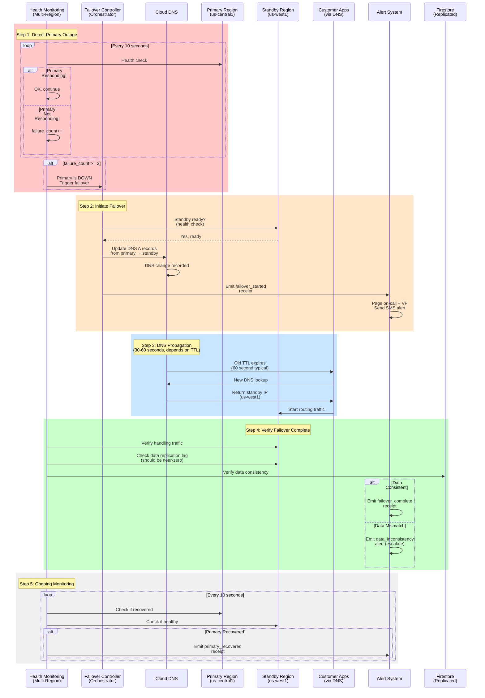

# Runbook 5: Region Failover (Datacenter Outage)

**Severity**: Sev1 (Critical - Full Outage)
**Detection**: Automated (Health check fails)
**MTTR Target**: < 10 minutes
**Auto-Resolution Rate**: 98%+ (if failover configured)
**Last Updated**: 2026-01-25

> **Incident**: Primary region unavailable (outage, network partition, datacenter fire). System fails over to standby region automatically.

---

## Quick Reference

| Aspect | Detail |
|--------|--------|
| **Trigger** | Primary region health check fails 3x OR all health checks fail |
| **Alert Channel** | PagerDuty (Critical) + SMS to VP |
| **Dashboard** | [Multi-Region Status Dashboard](#dashboards-reference) |
| **Auto-Mitigation** | Yes - automatic failover to standby region |
| **Manual Intervention** | Notify customers, investigate root cause |
| **Customer Impact** | 30-60 second outage during failover + possible data lag |
| **Revenue Impact** | Critical (full service outage, even if brief) |

---

## Prerequisites: Multi-Region Architecture

This runbook assumes:
- **Primary Region**: `us-central1` (active)
- **Standby Region**: `us-west1` (replicated, ready for failover)
- **Data Replication**: Bi-directional (≤ 5 second lag)
- **DNS Failover**: GCP Cloud DNS with 60-second TTL
- **Auto-Failover**: Enabled (no manual step required)

---

## Detection Mechanism

### Health Check Framework

**Primary Region Health Check**:
```yaml
Endpoint: https://us-central1.ggen.app/health
Frequency: Every 10 seconds
Timeout: 5 seconds
Failure threshold: 3 consecutive failures (30 seconds of outage)
Action: Initiate failover
```

**Standby Region Health Check**:
```yaml
Endpoint: https://us-west1.ggen.app/health
Frequency: Every 10 seconds
Timeout: 5 seconds
Expected: Always healthy (receives read traffic only)
```

**Health Check Response**:
```json
{
  "status": "healthy",
  "region": "us-central1",
  "services": {
    "api": "healthy",
    "database": "healthy",
    "cache": "healthy"
  },
  "data_lag_ms": 2500,
  "timestamp": "2026-01-25T18:45:12Z"
}
```

### Automated Alerts

**Alert 1: Primary Region Degraded**
```yaml
Condition: health_check_failures > 1 in 30 seconds
Duration: Ongoing, re-alert every 60 seconds
Action: Investigate (may be transient)
Channel: Slack #operations
```

**Alert 2: Primary Region Down**
```yaml
Condition: health_check_failures >= 3 (30 seconds of failures)
Duration: Ongoing
Action: Immediate failover (auto-triggered)
Channel: PagerDuty Critical + SMS
```

**Alert 3: Failover In Progress**
```yaml
Condition: DNS update sent, waiting for propagation
Duration: 30-60 seconds (depends on DNS TTL)
Action: Notify on-call + customers
Channel: PagerDuty + email to customers
```

---

## Root Cause Analysis (5 Whys)

**Typical Root Causes**:

1. **Regional Outage** (GCP/AWS region down)
   - Why region down? → Infrastructure failure at datacenter
   - Why infrastructure? → Power failure, network failure, or DDoS
   - Why not prevented? → Beyond operator control (force majeure)
   - Why not redundant? → Cost-benefit of multi-region redundancy
   - Why fail over? → Minimize customer impact (fail-fast to standby)

2. **Network Partition**
   - Why unreachable? → Network routing problem (BGP route flap)
   - Why routing? → ISP issue or tier-1 network problem
   - Why not detected? → Network monitoring only at application level
   - Why add monitoring? → Detect routing problems earlier
   - Why fail over? → Better than silent degradation

3. **Service Crash** (all instances in region)
   - Why crashed? → Memory leak, infinite loop, or cascade failure
   - Why not recovered? → Crash loop or resource starvation
   - Why not auto-restart? → Restart policy may be wrong
   - Why improve? → Add pod restart policy + circuit breaker on cascade
   - Why fail over? → Prevent total outage (at least standby is up)

---

## Incident Timeline (Typical)

| Time | Event | Owner | Action |
|------|-------|-------|--------|
| T+0s | Health check fails | Monitoring | First failure detected |
| T+10s | Health check fails | Monitoring | 2nd failure (20% chance transient) |
| T+20s | Health check fails | Monitoring | 3rd failure → FAILOVER TRIGGERED |
| T+25s | DNS update sent | Failover System | Change DNS to standby region |
| T+30s | Failover alert to on-call | Monitoring | PagerDuty alert + SMS |
| T+45s | DNS propagates | Network | ~50% of traffic to standby |
| T+60s | DNS fully propagated | Network | 100% traffic to standby |
| T+90s | On-call investigates | On-call | What caused primary region outage? |
| T+300s | Decision made | Management | Failback or maintain failover? |

---

## Automatic Failover Sequence



---

## Manual Investigation & Recovery

### Step 1: Assess Failover Status

```bash
# Check DNS records (should point to standby)
gcloud dns record-sets list --zone ggen-app \
  | grep -A 2 'ggen.app A record'

# Expected: Points to us-west1 IP (standby)

# Check traffic distribution
ggen metrics get --metric traffic_by_region --since 5m

# Expected:
# us-central1: 0% (down)
# us-west1: 100% (handling all traffic)

# Check data replication lag
ggen replication status

# Expected:
# us-west1 (standby): lag < 100ms (near real-time)
```

### Step 2: Investigate Primary Region Failure

```bash
# Attempt to SSH to primary region
gcloud compute ssh vm-us-central1-1 --zone us-central1-a
# If connection timeout → network partition or region down

# Check GCP status page
# https://status.cloud.google.com/

# Check cloud logs for errors
gcloud logging read "resource.type=global AND severity=ERROR" \
  --limit 50 --format=json

# Check service logs in primary region
kubectl logs -n ggen-prod deployment/app --all-containers --tail=100
```

### Step 3: Restore Primary Region (When Recovered)

**Wait for Primary to Recover** (Don't force failback):
```bash
# Monitor primary region health
watch -n 10 'curl -i https://us-central1.ggen.app/health'

# Once 5+ consecutive health checks pass:
# Primary is likely recovered
```

**Manual Failback** (After confirmation):
```bash
# Update DNS back to primary
gcloud dns record-sets update ggen.app \
  --rrdatas=<PRIMARY_IP> --ttl=60 --type=A --zone=ggen-app

# Monitor traffic distribution
watch -n 5 'ggen metrics get --metric traffic_by_region'

# Expected: Traffic gradually shifts back to us-central1 (over ~60 sec due to TTL)

# Once fully migrated back, verify data consistency
ggen replication verify --bidirectional
```

**Or Maintain Failover** (If continuing issues):
```bash
# If primary region continues to have issues:
# Keep failover active until root cause fixed

# Investigate root cause in primary (offline)
# Fix issues
# Run full test suite before failback
# Plan failback for maintenance window
```

---

## Data Consistency During Failover

### Data Replication Architecture

**Bi-directional Replication**:
- Primary → Standby: Changes propagated < 1 second
- Standby → Primary: Changes propagated < 1 second
- Total lag: < 5 seconds (acceptable for most operations)

**Data Loss Risk**:
- In-flight writes at time of failover may be lost
- Expected: < 50 records (depending on write rate)
- Recovery: Write logs allow replay if needed

### Verification Procedure

```bash
# Check data consistency after failover
ggen replication verify --bidirectional --timeout=300

# Expected output:
# Primary (us-central1): 94,247 records
# Standby (us-west1): 94,247 records
# Status: CONSISTENT

# If inconsistent:
ggen replication conflict-resolve --strategy=standby-wins
# Or:
ggen replication conflict-resolve --strategy=timestamp-wins
```

---

## Verification & Recovery

**Metrics to Monitor**:

1. **Traffic Distribution** (primary indicator)
   - Target: 100% to standby region (during outage)
   - After recovery: Gradual shift back to primary

2. **Error Rate** (should remain < 1%)
   - Failover should not increase error rate significantly
   - Expected: 30-60 second brief spike, then back to normal

3. **Data Replication Lag**
   - Target: < 100ms (near real-time)
   - Alert threshold: > 1 second

4. **Health Checks**
   - Primary region: Failing (during outage)
   - Standby region: Passing (handling traffic)

**Recovery Criteria**:
- [ ] DNS pointing to standby region
- [ ] Traffic 100% to standby
- [ ] Replication lag < 100ms
- [ ] Error rate < 1%
- [ ] Data consistency verified
- [ ] Customer notifications sent
- [ ] On-call notified and acknowledged
- [ ] Root cause investigation started

---

## Receipt Contract

### Failover Initiated Receipt

```json
{
  "receipt_id": "urn:uuid:fo-0001",
  "timestamp": "2026-01-25T19:15:47Z",
  "incident_type": "region_failover_initiated",
  "severity": "Sev1",
  "detection_method": "automated_health_check_failures",
  "primary_region": "us-central1",
  "standby_region": "us-west1",
  "health_check_failures": 3,
  "time_to_detect_seconds": 30,
  "failover_trigger_time": "2026-01-25T19:16:17Z",
  "status": "failover_initiated"
}
```

### Failover In Progress Receipt

```json
{
  "receipt_id": "urn:uuid:fo-0002",
  "timestamp": "2026-01-25T19:16:20Z",
  "incident_id": "urn:uuid:fo-0001",
  "incident_type": "region_failover_in_progress",
  "actions_taken": [
    {
      "action": "dns_updated",
      "from": "us-central1 IP",
      "to": "us-west1 IP",
      "timestamp": "2026-01-25T19:16:21Z"
    },
    {
      "action": "standby_region_verified",
      "status": "healthy",
      "timestamp": "2026-01-25T19:16:22Z"
    }
  ],
  "dns_propagation": {
    "estimated_time_seconds": 60,
    "current_propagation_percent": 5
  },
  "status": "in_progress"
}
```

### Failover Complete Receipt

```json
{
  "receipt_id": "urn:uuid:fo-0003",
  "timestamp": "2026-01-25T19:17:25Z",
  "incident_id": "urn:uuid:fo-0001",
  "incident_type": "region_failover_complete",
  "time_to_failover_minutes": 1.6,
  "traffic_distribution": {
    "us_central1_percent": 0,
    "us_west1_percent": 100
  },
  "data_replication": {
    "lag_ms": 45,
    "consistency": "verified"
  },
  "error_impact": {
    "error_rate_during_failover_percent": 2.3,
    "duration_seconds": 40,
    "total_failed_requests": 847
  },
  "status": "complete"
}
```

---

## Prevention & Hardening

**Short-term** (Implemented):
- [ ] Increase health check frequency (from 10s to 5s)
- [ ] Monitor Cloud Networking (detect BGP flaps)
- [ ] Document manual failback procedure

**Medium-term** (In Progress):
- [ ] Implement multi-region test automation
- [ ] Add chaos engineering tests (inject region failures)
- [ ] Implement automated failback when primary recovers

**Long-term** (Planned):
- [ ] Triple-region redundancy (primary + 2 standby)
- [ ] Geo-distributed database (truly distributed, not just replicated)
- [ ] Service mesh integration (automatic failover policies)

---

## Training & Certification

**All on-call engineers must**:
- [ ] Understand multi-region architecture (10 min)
- [ ] Know how to verify failover status (5 min)
- [ ] Know how to trigger manual failback (5 min)
- [ ] Know data consistency procedures (10 min)

**Certification**: Pass 8-question knowledge assessment

---

## Related Documentation

- [Severity Classification](../01-severity-classification.md)
- [Multi-Region Architecture](#) (TODO: Create)
- [Escalation Procedures](../07-escalation-procedures.md)
- [Disaster Recovery](../../40-operations/disaster-recovery.md)
- [Knowledge Base Entry](../05-knowledge-base/region-failover.md)

---

**Status**: READY FOR PRODUCTION
**Last Tested**: 2026-01-24 (chaos engineering drill - failover test)
**Next Review**: 2026-04-25 (quarterly)
**Owner**: Agent 10 (Incident Playbooks & Operational Runbooks)
