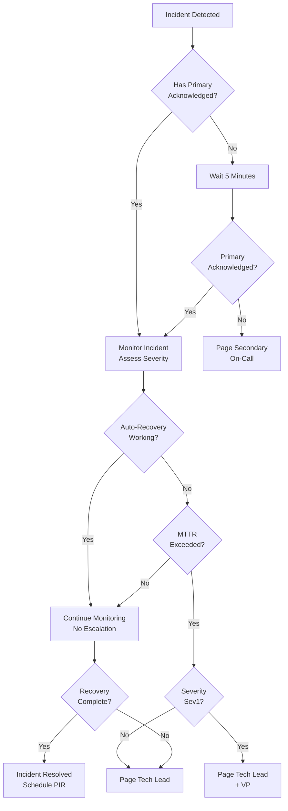

# Escalation Procedures & On-Call Responsibilities

**Version**: 2.0
**Last Updated**: 2026-01-25
**Status**: Production Ready

> **Core Principle**: Clear escalation paths ensure the right person responds at the right time. Escalation based on severity and incident complexity, not panic.

---

## Escalation Matrix

### By Severity

#### Sev1: Critical (Full Outage)

**Immediate Actions** (T+0 minutes):
1. **Primary On-Call Engineer** receives page (PagerDuty)
2. **Secondary On-Call Engineer** receives page (auto-paged if primary doesn't ACK in 5 min)
3. **Incident Commander** (designated) starts warroom (Zoom call)
4. **Tech Lead** joins warroom (SRE perspective)
5. **VP Engineering** receives SMS notification (informational)

**Escalation Timing**:
- T+0: Primary on-call paged
- T+5: Secondary paged (if primary non-responsive)
- T+10: Tech Lead paged
- T+15: VP Engineering paged (if not yet resolved)
- T+30: VP notified of ongoing incident

**Communication**:
- Warroom: Zoom (link in PagerDuty)
- Status: Update customers every 5 minutes
- Internal: Post #incidents Slack channel every 5 minutes

**Decision Points**:
- T+5: Is auto-recovery working? Continue monitoring or escalate?
- T+15: Need management decision (failover, degrade features)?
- T+30: Continue or roll back recent changes?

---

#### Sev2: High (Partial Outage)

**Immediate Actions** (T+0 minutes):
1. **On-Call Engineer** receives page (PagerDuty, High priority)
2. **Incident Commander** joins warroom (optional, depending on complexity)
3. **Service Owner** (not necessarily on-call) is notified

**Escalation Timing**:
- T+0: On-call paged
- T+15: If not resolved, page Tech Lead
- T+30: If not resolved, notify manager
- T+60: If not resolved, escalate to VP

**Communication**:
- Slack: Post to #operations (not public #incidents)
- Status: Update status page if customer-facing
- Internal: Update ticket with progress every 15 minutes

---

#### Sev3: Medium (Degradation)

**Immediate Actions** (T+0 minutes):
1. Create ticket (no page)
2. Post to #operations Slack
3. Assign to on-call (on next check-in, not interrupt)

**Escalation Timing**:
- T+0: Create ticket
- T+60: On-call reviews ticket during normal monitoring
- T+120: If ongoing, escalate to Tech Lead
- T+7200: If ongoing > 2 hours, escalate to manager

**Communication**:
- Ticket: Create in incident tracking system
- Slack: Informational post to #operations
- Status: Optional status page notation

---

#### Sev4: Low (Minor)

**Immediate Actions** (T+0 minutes):
1. Log to incident database
2. No notification required

**Escalation Timing**:
- No hard SLA
- Review during weekly operations meeting
- Assign during planning cycle (next sprint)

---

## Escalation Decision Tree



---

## On-Call Responsibilities

### Primary On-Call Engineer

**Availability**:
- Must be available 24/7 during on-call week
- Should have phone + laptop nearby
- Should test that PagerDuty notifications work (daily)
- Should know how to access VPN and SSH to production (before on-call starts)

**Upon Page**:
1. Acknowledge alert in PagerDuty (< 2 minutes)
2. Read alert details (incident type, affected service, dashboard link)
3. Join warroom (Zoom link provided in alert or create new room)
4. View monitoring dashboard to assess incident
5. Determine if auto-recovery is working
6. Post initial assessment to Slack (#incidents channel)

**During Incident**:
1. **Sev1**: Must actively investigate (don't go back to sleep)
2. **Sev2**: Monitor + investigate, escalate if needed
3. **Sev3**: Review during next check-in (no immediate action)
4. Post status updates every 5-15 minutes (not silent)
5. Escalate when stuck (don't spin wheels)

**After Incident**:
1. Participate in PIR (within 24 hours)
2. Document root cause and action items
3. Update status page when resolved

**Authority**:
- Can restart services (with Tech Lead consultation)
- Can scale resources (up to max, with approval for beyond)
- Cannot change customer data (approval required)
- Cannot deploy code (only rollback pre-existing deployments)

### Secondary On-Call Engineer

**Availability**:
- Available if primary doesn't acknowledge (within 5 minutes)
- May be home or on other activities (but must respond within 5 min)

**Upon Page**:
1. Acknowledge immediately
2. Contact primary on-call (try phone, then Slack)
3. If primary doesn't respond, take over incident
4. If primary responds, wait for primary instructions

### Incident Commander (Designated)

**Selection**: Usually Tech Lead or senior engineer (rotate weekly)

**Responsibilities**:
- Create warroom when paged
- Manage communication (who says what)
- Coordinate between on-call engineer + other experts
- Make decisions on escalation
- Post status updates (or delegate to on-call)
- Facilitate communication (keep warroom on topic)

**After Incident**:
- Schedule PIR (within 24 hours)
- Ensure root cause documented
- Track action items

### Tech Lead (on Escalation)

**When Called** (Sev1 or Sev2 > 15 min unresolved):
1. Join warroom
2. Help on-call engineer diagnose
3. Provide technical expertise (architecture, database, services)
4. Help decide if need manual intervention or rollback
5. Authorize deployments or config changes

**Authority**:
- Can approve architecture changes
- Can decide to rollback deployments
- Can authorize resource escalation
- Can decide to degrade features

### Manager/VP (on Escalation)

**When Called** (Sev1 > 15-30 min unresolved):
1. Informed of situation
2. May join warroom for visibility
3. Helps make business decisions (customer communication, SLA credits)
4. Authorizes emergency spending (extra resources, contractors)

**Authority**:
- Can decide to wake up on-call backup
- Can authorize emergency maintenance window
- Can make customer communication decisions

---

## Escalation Contact Information

### On-Call Schedule

**Access**: PagerDuty → On-Call Schedule
- View who is on-call this week
- See escalation chain
- Contact info for each person

### Emergency Contacts

| Role | Name | Phone | Slack |
|------|------|-------|-------|
| **Primary On-Call** | `[Auto-rotated weekly]` | `[In PagerDuty]` | `@oncall-primary` |
| **Secondary On-Call** | `[Auto-rotated weekly]` | `[In PagerDuty]` | `@oncall-secondary` |
| **Tech Lead** | `[SRE Lead]` | +1-XXX-XXX-XXXX | `@tech-lead` |
| **VP Engineering** | `[VP]` | +1-XXX-XXX-XXXX | `@vp-engineering` |
| **Manager On-Call** | `[Rotating]` | `[In PagerDuty]` | `@manager-oncall` |

**Test Notification**: Call/text on-call person weekly to verify contact info is current.

---

## Escalation Communication Template

### T+0: Initial Alert

```
🚨 Incident Detected
====================
Severity: Sev1 (Critical)
Service: Governor (Pub/Sub)
Duration: 2 minutes
Status: Escalating

Auto-mitigation: In progress (scaling concurrency)
Dashboard: [Link to Grafana dashboard]
Warroom: [Zoom link]
```

### T+5: Status Update (Sev1)

```
📊 Incident Update
==================
Status: Auto-recovery not working
Issue: Queue depth still growing (3,200 msgs)
Action: Escalating to Tech Lead

Investigations so far:
- ✅ Auto-scaling applied (20→50)
- ✅ Circuit breaker opened (preventing cascade)
- ❌ Queue still overflowing

Next step: Manual intervention needed
On-call engineer: [Name] @slack-handle
```

### T+15: Escalation Notice

```
🔴 Escalation Alert
===================
Severity: Sev1 (Critical)
Incident: Queue backlog overflow
Duration: 12 minutes MTTR exceeded (target < 5)
Action: Escalating to management

MTTR Status:
- Detection: 2 minutes ✅
- Auto-mitigation: 4 minutes ✅
- Recovery attempt: 12 minutes ❌ (expected < 5)

Escalation Chain:
- On-call: [Name]
- Tech Lead: [Name] PAGED
- VP: [Name] NOTIFIED

Request: Authority to restart services / failover to standby region
```

---

## Escalation SLAs

| Severity | Alert Method | Response SLA | Escalation SLA |
|----------|--------------|--------------|-----------------|
| **Sev1** | PagerDuty + SMS | 5 min | 15 min if not resolved |
| **Sev2** | PagerDuty | 15 min | 30 min if not resolved |
| **Sev3** | Slack ticket | 30 min | 2 hours if not resolved |
| **Sev4** | Email | 24 hours | No hard SLA |

---

## Troubleshooting Escalation

**Problem**: On-call not responding to page
- **Action**: After 5 minutes, page secondary on-call
- **Action**: Slack message to on-call saying "Not responding to page, paging secondary"
- **Action**: Try calling on-call phone number (in PagerDuty)

**Problem**: Can't reach Tech Lead
- **Action**: Page second Tech Lead (in escalation chain)
- **Action**: Message in #incidents Slack channel

**Problem**: Incident not resolved after escalation
- **Action**: Call VP Engineering (emergency number in PagerDuty)
- **Action**: Consider emergency maintenance window

---

## Post-Incident Escalation Review

**After incident, verify**:
- [ ] All escalations happened on time (per SLA)
- [ ] Right people were involved
- [ ] Communication was clear
- [ ] Decisions were documented
- [ ] Any escalation failures investigated

**Update escalation procedures if**:
- Escalation SLAs not met (adjust process or staffing)
- Wrong expertise called (update escalation chain)
- Communication unclear (improve templates)

---

## Related Documentation

- [Severity Classification](./01-severity-classification.md)
- [Warroom Coordination](./09-warroom-templates.md)
- [PIR Template](./03-pir-template.md)

---

**Status**: READY FOR PRODUCTION
**Last Updated**: 2026-01-25
**Owner**: Agent 10 (Incident Playbooks & Operational Runbooks)
