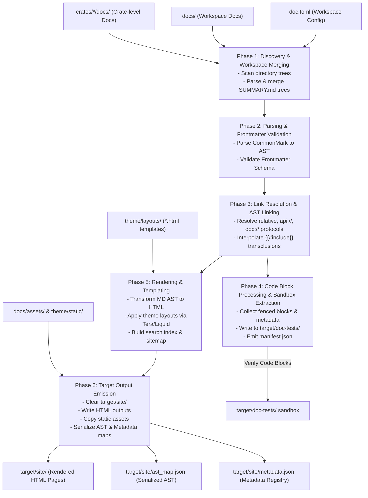
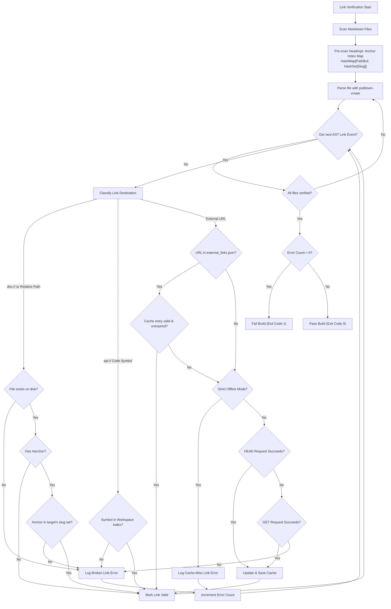
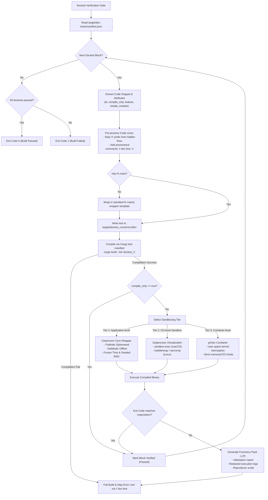

# RFC: Next-Generation Documentation System Architecture (`cargo-ggen-doc`)

- **Author**: Rust Core Team AGI Swarm
- **Status**: Proposed
- **Date**: 2026-07-03
- **Version**: 1.0.0

---

## 1. Introduction and Objectives

This RFC defines the system architecture, directory layouts, compilation pipeline, and verification gates for a next-generation documentation platform optimized for modular Rust workspaces and automated developer swarms. 

The primary thesis of this design is that **documentation is compiled codebase execution**. Traditional documentation tools treat documentation as static, unvalidated text. This results in documentation decay, dead links, outdated code examples, and security drift. `cargo-ggen-doc` treats markdown prose, code examples, and structural layouts as statically typed components of a compiler-checked codebase.

### 1.1 Core Principles
1. **Compilation Analogy**: Markdown files are parsed into abstract syntax trees (ASTs), checked against schema rules, and verified at compile time.
2. **Absolute Correctness**: Every link (internal relative, cross-page anchor, API code symbol, external URL) must be resolved and verified before a build can succeed.
3. **Executable Integrity**: Every code example must be compiled and run under strict isolation.
4. **Zero-Drift Telemetry**: Documentation and source code are cryptographically coupled using BLAKE3 hashing, AST alpha-equivalence matching, and signed verification receipts linked directly to OpenTelemetry traces.

---

## 2. Core Structural Patterns & Authoring Conventions

### 2.1 CommonMark with Strict Frontmatter
All documentation pages must be written in GitHub Flavored Markdown (CommonMark) and must begin with a structured frontmatter block delimited by `+++`. The frontmatter is written in TOML and validated against a strict schema.

```text
+++
title = "Custom Config Validation Guide"
slug = "custom-validation"
diataxis = "guide"
status = "active"
version = "1.2.0"
depends_on = ["doc://tutorials/getting-started.md"]
feature_gates = ["star-toml-validation"]
tags = ["config", "validation"]
+++
```

#### 2.1.1 Frontmatter JSON Schema Specification
The structural schema enforcing these frontmatter fields is defined below:

```json
{
  "$schema": "http://json-schema.org/draft-07/schema#",
  "title": "GgenDocFrontmatter",
  "type": "object",
  "properties": {
    "title": {
      "type": "string",
      "description": "The human-readable title of the document."
    },
    "slug": {
      "type": "string",
      "pattern": "^[a-z0-9]+(?:-[a-z0-9]+)*$",
      "description": "A URL-friendly, lowercase identifier for the document."
    },
    "diataxis": {
      "type": "string",
      "enum": ["tutorial", "guide", "reference", "explanation"],
      "description": "The Diátaxis documentation framework categorization."
    },
    "status": {
      "type": "string",
      "enum": ["draft", "active", "deprecated"],
      "description": "The lifecycle state of this document."
    },
    "version": {
      "type": "string",
      "pattern": "^(0|[1-9]\\d*)\\.(0|[1-9]\\d*)\\.(0|[1-9]\\d*)(?:-((?:0|[1-9]\\d*|\\d*[a-zA-Z-][0-9a-zA-Z-]*)(?:\\.(?:0|[1-9]\\d*|\\d*[a-zA-Z-][0-9a-zA-Z-]*))*))?(?:\\+([0-9a-zA-Z-]+(?:\\.[0-9a-zA-Z-]+)*))?$",
      "description": "The target SemVer version of the codebase this documentation describes."
    },
    "depends_on": {
      "type": "array",
      "items": {
        "type": "string",
        "pattern": "^doc://.+$"
      },
      "description": "Array of internal documentation URI dependencies."
    },
    "feature_gates": {
      "type": "array",
      "items": {
        "type": "string"
      },
      "description": "Rust crate features required to verify or execute code snippets in this document."
    },
    "tags": {
      "type": "array",
      "items": {
        "type": "string"
      },
      "description": "Taxonomy keywords for structural cataloging."
    }
  },
  "required": ["title", "slug", "diataxis", "status", "version"]
}
```

### 2.2 First-Class Code Block Attributes
Rust code blocks support rich compile-time attributes enclosed in curly braces following the language identifier:

```rust
```rust { id="custom-validator-fn", compile_only=false, feature="star-toml-validation", isolate_module=true }
use ggen_config::ConfigValidator;

fn main() {
    let validator = ConfigValidator::new();
    assert!(validator.is_valid_version("1.0.0"));
}
```
```

#### Attribute Directives:
- **`id`** *(string)*: Globally unique identifier within the workspace. Used to generate stable hashes and track block drift.
- **`compile_only`** *(boolean)*: If set to `true`, the code block is compiled and type-checked, but execution is skipped.
- **`feature`** *(string)*: A comma-separated list of crate features required to compile this specific block.
- **`isolate_module`** *(boolean)*: If `true`, the compiler wraps the code block in an isolated Rust module namespace within the temporary test harness to prevent symbol name collisions.
- **`ignore`** *(boolean)*: Suppresses compilation and execution (reserved for pseudocode or examples of invalid code).
- **`should_panic`** *(boolean)*: Asserts that the code block compiles successfully but must panic/exit with a non-zero code during execution.

### 2.3 Reference Syntax & Linking Conventions
All references are explicitly typed and validated at build time:
1. **Internal Docs (`doc://`)**: E.g., `[Get Started](doc://tutorials/getting-started.md#installation)`. Resolved relative to the documentation workspace root.
2. **API Paths (`api://`)**: E.g., `[Validator API](api://star_toml::validation::Validator)`. Resolves symbol paths to public modules, structs, traits, or functions using workspace metadata.
3. **Static Assets (`asset://`)**: E.g., ``. Resolves local binary files to copy into target web locations.

### 2.4 Modular Transclusions
Prose and source code reuse is achieved via inline macro elements expanded during the AST linking phase:
- **Source Transclusion**: `{{#include <file_path>:<start_line>-<end_line>}}`
  Imports code blocks from real workspace files (e.g. `crates/star-toml/src/validation.rs:45-80`), ensuring documented code matches production code.
- **Documentation Transclusion**: `{{#include_doc <relative_doc_path>}}`
  Imports written Markdown prose from another file, eliminating duplication. Recursion depth is capped at 5 levels; cycle detection is performed during compilation.

#### Security Boundaries:
To prevent directory traversal and secrets leakage:
1. **Canonicalization**: Both macro targets must be strictly canonicalized prior to file system operations.
2. **Workspace Lockdown**: The resolved paths must be validated to reside within the workspace root directory boundaries.
3. **Secrets Denylist**: Any attempt to read or transclude files matching a denylist (e.g., `.env`, `.pem`, `.git/`, `.receipts/`, or private key files) results in a hard compilation failure.

---

## 3. Directory Layout Conventions

The system integrates global project documentation with crate-specific documentation under a single unified workspace configuration.

### 3.1 Concrete Directory Hierarchy

```
workspace-root/
├── Cargo.toml                      # Workspace-level cargo manifest
├── doc.toml                        # Workspace-level documentation configuration
├── theme/                          # Custom template and layout assets
│   ├── layouts/
│   │   ├── base.html               # Shell HTML structure
│   │   ├── article.html            # Document layout
│   │   └── sidebar.html            # Navigation template
│   ├── static/
│   │   ├── css/
│   │   └── js/
│   └── templates/                  # Reusable HTML partials
├── docs/                           # Global workspace-level documentation
│   ├── SUMMARY.md                  # Table of Contents definition
│   ├── tutorials/                  # Diátaxis: Learning-oriented tutorials
│   │   └── getting-started.md
│   ├── guides/                     # Diátaxis: Task-oriented how-to guides
│   │   └── custom-validation.md
│   ├── reference/                  # Diátaxis: Information-oriented specs
│   │   └── config-schema.md
│   ├── explanation/                # Diátaxis: Understanding-oriented concepts
│   │   └── core-concepts.md
│   └── assets/                     # Media resources (images, diagrams)
│       └── system-architecture.svg
├── crates/                         # Codebase crates
│   ├── star-toml/
│   │   ├── Cargo.toml
│   │   ├── src/
│   │   └── docs/                   # Crate-level specific documentation modules
│   │       ├── SUMMARY.md
│   │       ├── guides/
│   │       └── reference/
│   └── ggen-config/
│       ├── Cargo.toml
│       ├── src/
│       └── docs/
│           ├── SUMMARY.md
│           └── reference/
├── locales/                        # Multi-lingual translation indexes
│   ├── es/                         # Spanish translation trees
│   └── zh/                         # Chinese translation trees
└── target/                         # Build directory (ignored by git)
    ├── doc-tests/                  # Extracted sandboxed doctests & runners
    └── site/                       # Compiled output destination
        ├── index.html
        ├── assets/
        └── api/                    # Integrated API documentation
```

### 3.2 Configuration File (`doc.toml`)
The configuration schema is declared in TOML. The following is a valid example of `doc.toml`:

```toml
[project]
title = "Next-Gen Rust Swarm Docs"
default_language = "en"
supported_languages = ["en", "es", "zh"]
workspace_crates = ["crates/star-toml", "crates/ggen-config"]

[rendering]
theme_dir = "theme"
output_dir = "target/site"
compile_doctests = true
strict_links = true
trust_old_receipts = false
receipt_ttl_days = 30

[sandbox]
memory_limit_mb = 128
cpu_timeout_ms = 1500
```

#### 3.2.1 Configuration JSON Schema
The configuration schema validates `doc.toml` options before starting the pipeline:

```json
{
  "$schema": "http://json-schema.org/draft-07/schema#",
  "title": "GgenDocConfig",
  "type": "object",
  "properties": {
    "project": {
      "type": "object",
      "properties": {
        "title": { "type": "string" },
        "default_language": { "type": "string", "minLength": 2, "maxLength": 5 },
        "supported_languages": {
          "type": "array",
          "items": { "type": "string", "minLength": 2, "maxLength": 5 }
        },
        "workspace_crates": {
          "type": "array",
          "items": { "type": "string" }
        }
      },
      "required": ["title", "default_language", "supported_languages", "workspace_crates"]
    },
    "rendering": {
      "type": "object",
      "properties": {
        "theme_dir": { "type": "string" },
        "output_dir": { "type": "string" },
        "compile_doctests": { "type": "boolean" },
        "strict_links": { "type": "boolean" },
        "trust_old_receipts": { "type": "boolean" },
        "receipt_ttl_days": { "type": "integer", "minimum": 1 }
      },
      "required": ["theme_dir", "output_dir", "compile_doctests", "strict_links", "trust_old_receipts", "receipt_ttl_days"]
    },
    "sandbox": {
      "type": "object",
      "properties": {
        "memory_limit_mb": { "type": "integer", "minimum": 1 },
        "cpu_timeout_ms": { "type": "integer", "minimum": 1 }
      },
      "required": ["memory_limit_mb", "cpu_timeout_ms"]
    }
  },
  "required": ["project", "rendering", "sandbox"]
}
```

### 3.3 Internationalization (i18n)
Translations are organized in parallel trees under the `/locales` folder. For translation targets, the compiler matches source page paths (e.g. `docs/tutorials/getting-started.md`) against locale paths (e.g. `locales/es/docs/tutorials/getting-started.md`). If a locale file exists, the parser replaces the source with the translation. Missing translation files default back to the source language.

---

## 4. The 6-Phase Compilation and Rendering Pipeline

`cargo-ggen-doc` transforms input markdown files, workspace code structures, and theme files into a statically generated output site through a structured 6-phase compilation process.

### 4.1 Detailed Phase Specifications



#### Phase 1: Discovery & Workspace Merging
1. **Config Evaluation**: Parse `doc.toml` into `GgenDocConfig`.
2. **Directory Scanning**: Walk `docs/` and `crates/*/docs/` to discover Markdown resource paths.
3. **SUMMARY Merging**: Read `docs/SUMMARY.md` and inline nested crate-level `SUMMARY.md` files, creating a global navigation hierarchy. To prevent routing and namespace collisions, crate-level documents are explicitly namespaced under their respective crate names (e.g. `/site/<crate_name>/guides/...`).

#### Phase 2: Parsing & Frontmatter Validation
1. **Markdown AST Generation**: Parse content using `pulldown-cmark` into an event stream mapped to an AST representation.
2. **Frontmatter Parsing**: Parse frontmatter TOML bytes bounded by `+++` using `toml::de::from_str`.
3. **Schema Enforcement**: Match parsed frontmatter objects against the JSON schema. Emit exit-code-1 errors for missing or invalid parameters.
4. **Registry Tracking**: Save valid document metadata (version, gates, tags) to the memory compilation registry.

#### Phase 3: Link Resolution & AST Linking
1. **Cross-Reference Resolution**: Traverse the AST to locate all links (`doc://`, `api://`, `asset://`).
2. **Reference Auditing**: Resolve targets against workspace paths and the generated symbol maps. Unresolved symbols fail the build.
3. **Macro Interpolation**: Find `{{#include ...}}` and `{{#include_doc ...}}` macro patterns. Recursively read lines from the target source files or docs, parsing them into AST branches and inserting them in place of the macro node. To prevent path traversal attacks and secrets leakage:
   - The compiler strictly canonicalizes all transcluded file paths.
   - The compiler verifies that the canonical paths reside within the workspace root directory boundaries.
   - The compiler enforces a hard denylist of prohibited files/directories, including `.env`, `.pem`, `.git/`, and `.receipts/`. Any attempt to transclude a denylisted path triggers an immediate compilation failure.
4. **Dependency Tree Graph**: Build document compilation nodes based on dependencies declared under `depends_on`.

#### Phase 4: Code Block Processing & Sandbox Extraction
1. **Extraction**: Identify all fenced code blocks. Filter out blocks tagged with non-executable markers (`ignore`, `pseudocode`).
2. **Attribute Mapping**: Parse attribute tags (`id`, `isolate_module`, `compile_only`, `feature`).
3. **Sandbox Generation**: Prepare source files under `target/doc-tests/`.
   - Wrap raw snippets in a standard wrapper containing `fn main()` if absent.
   - Insert `#line` directives or provenance comments (`// doc-line: X`) mapping compiler diagnostics back to raw markdown lines.
4. **Manifest Serialization**: Output a structural manifest of all tests to `target/doc-tests/manifest.json`.

#### Phase 5: Rendering & Templating
1. **HTML Translation**: Generate clean HTML representation from the normalized Markdown AST.
2. **Localization Interpolation**: Insert translated strings into layout templates.
3. **Layout Layering**: Use a Liquid/Tera template engine to load `theme/layouts/`, wrapper page structures, and sidebar navigation frames, passing page parameters (title, metadata).
4. **Search and Indexing Payload**: Extract plain text from paragraphs to build a global static client-side search index.

#### Phase 6: Target Output Emission
1. **Workspace Clear**: Wipe target directory `target/site/` to clean legacy layouts.
2. **File Serialization**: Write compiled HTML structures to target files using their custom slug paths.
3. **Asset Deployment**: Copy theme static CSS/JS files and image assets from `docs/assets/` into `target/site/assets/`.
4. **AST/Metadata Dump**: Serialize the final documentation AST mapping and metadata maps to `target/site/ast_map.json` and `target/site/metadata.json` for validation tools.

---

## 5. Verification Gates & Execution Isolation Sandboxing

### 5.1 Compile-Time Link Checking Gate
The Link Verification Gate runs during compile-time scanning to ensure complete integrity. The execution flow is shown in the following diagram:



#### 5.1.1 Anchor Slug Generation Algorithm
For any heading (e.g. `### Step 2: Create Product Ontology!`), the parser computes a normalized slug. The exact string transformation steps are:
1. Convert the entire heading string to lowercase.
2. Replace all sequences of whitespace (spaces, tabs, newlines) with a single hyphen (`-`).
3. Strip all non-alphanumeric characters except hyphens (`-`) and underscores (`_`).
4. Collapse multiple consecutive hyphens into a single hyphen.
5. Remove any leading or trailing hyphens from the string.
*Example output*: `step-2-create-product-ontology`.

##### Slug Collision Detection:
To ensure anchor resolution determinism, the compiler enforces duplicate heading slug detection:
- During slug extraction, a registry tracks all generated slugs within a single document.
- If a duplicate slug is detected (e.g., two headers normalize to the same slug), the compiler will either:
  1. Fail compilation immediately under strict validation mode.
  2. Auto-generate unique numbered suffixes (e.g., `-1`, `-2`) for subsequent occurrences and emit compile-time warnings to alert the author.

#### 5.1.2 Offline External Link Caching
Under the **CODE_ONLY (offline)** network constraint in CI, the compiler relies on `docs/external_links.json` mapping URLs to their state.
- **Cache Format**:
  ```json
  {
    "https://github.com/seanchatmangpt/ggen": {
      "status": "Valid",
      "last_checked": "2026-07-03T12:00:00Z",
      "http_status": 200,
      "sha256": "4bcf0882e56bf8f438a3915bc67417e4"
    }
  }
  ```
- **Resolution Strategy**:
  1. Check if the URL string exists in `external_links.json`.
  2. If the URL exists and is flagged as `Valid` within its age threshold (e.g., 30 days), check succeeds.
  3. If missing or expired, CI fails with an offline cache-miss error.
  4. Developers run the compiler locally in **Online Mode**, where the runner issues an async HTTP `HEAD` request (falling back to `GET` if `HEAD` fails with a `405`) with a 3-second timeout, updating the cache file on success.

##### Link Cache Bypass Prevention:
To prevent manual manipulation or tampering with `external_links.json` (such as declaring malicious/broken links as valid without checking them), the BLAKE3 cryptographic hash of `docs/external_links.json` must be locked directly into the document's verification receipt as a dependency. If the hash of `external_links.json` in the workspace does not match the hash in the verification receipt, the receipt verification fails.

#### 5.1.3 Intra-doc Code Symbol Resolution
For symbol links (e.g. `[Validator](api://star_toml::validation::Validator)`), the engine parses workspace exports from `cargo metadata` and the compiled rustdoc search index file `target/doc/search-index.js`. If the path is not exported or does not match a public item, the compile gate fails.

---

### 5.2 Doctest Extraction and Compilation Pipeline
1. **Extraction**: Code blocks tagged as `rust` are collected.
2. **Provenance**: Write comments in the extracted Rust files mapping positions back to source Markdown:
   ```rust
   // doc-line: 45
   ```
   If compilation fails, `cargo-ggen-doc` translates compiler line errors using this tag, reporting the precise line in the markdown source rather than the temporary file.
3. **Workspace Linking**: To avoid rebuild overhead, the tool creates a single workspace wrapper test crate at `target/doctest_runner/`. Its `Cargo.toml` points to local workspace crates via relative paths. Each doctest block is declared as a separate binary target inside this crate, compiling in parallel via `cargo build`.
4. **Code Wrapping**: If a snippet lacks `fn main()`, it is injected into a template structure:
   ```rust
   #![allow(unused_variables, dead_code, unused_imports)]
   use ggen_core::cleanroom::*;
   
   fn main() -> Result<(), Box<dyn std::error::Error>> {
       // --- EXTRACTED DOC CODE ---
       let validator = ConfigValidator::new();
       // --- END EXTRACTED DOC CODE ---
       Ok(())
   }
   ```

---

### 5.3 Multi-Tier Sandboxing Engine
Running execution verification requires isolating the binary. The system implements a three-tier sandbox selection model:



#### TOCTOU Sandbox Race Condition Mitigations:
To eliminate Time-of-Check to Time-of-Use (TOCTOU) race conditions in shared directories:
1. **Isolated Compilation Path**: The compiler does not compile doctest binaries in the shared workspace target directory. Instead, doctests are extracted, structured, and compiled inside unique, process-isolated temporary directories generated via the `tempfile` crate with strict `0700` user-only permissions.
2. **Binary Attestation**: Immediately after successful compilation and before execution, the compiler computes the BLAKE3 cryptographic hash of the compiled doctest binary. This hash is verified again immediately before executing the binary in the designated sandboxing tier to guarantee the executable has not been swapped or tampered with by concurrent processes.

#### Tier 1: Application-Level Virtualization (`CleanroomCore`)
- **Isolation Boundaries**: The block is analyzed within a `CleanroomCore` context configured with strict type-level policies.
- **Rules**:
  - Time mock set to fixed unix timestamp `1700000000`.
  - RNG seeded with deterministic seed `0xGG`.
  - File system mapped to `FsMode::Ephemeral` (restricted in-memory temp directory).
  - Socket calls intercepted; all TCP/UDP connections rejected.
- **Target Use**: `CleanroomCore` is strictly reserved for compile-time syntax check and static API check. It does not enforce system-level boundaries and must not serve as a security boundary. All executions of the compiled binary must run within Tier 2 (OS-level) or Tier 3 (container-level) sandboxes.

#### Tier 2: OS-Level Sandbox
- **macOS (`sandbox-exec`)**: Executes using Apple's Seatbelt kernel configuration:
  `sandbox-exec -f docs/sandbox_policy.sb ./doctest_bin`
  This profile denies default access, allowing read-only access to system frameworks and `/target`, read-write access to local `/tmp` directories, and blocks all networking.
- **Linux (`bubblewrap` / Namespaces)**: Runs the target binary under a restricted PID, mount, and network namespace. A strict `seccomp` profile drops socket creation and partition mounting syscalls.
- **Target Use**: Local development validation requiring system and network path safety boundaries without container overhead.

#### Tier 3: Container Sandbox (gVisor micro-VM)
- **Mechanism**: The doctest binary is compiled on the host and mounted read-only into a container operating the `gVisor runsc` runtime.
- **Isolation Boundaries**: gVisor's Sentry kernel virtualizes and filters all system calls in user-space, preventing direct host kernel interaction. Memory and CPU limits are configurable under `[sandbox]` in `doc.toml` (e.g. 128MB and 1.5 seconds by default).
- **Target Use**: High-integrity pre-merge CI runs, and validation of untrusted or auto-generated documentation code.

---

### 5.4 Fail-Safe Attestation & Forensics
On execution failure, the sandbox runner captures execution state into a `.crf` forensics archive file containing:
1. **Attestation Report**: Decoded sandbox configuration, memory use, CPU utilization, and determinism factors.
2. **Redacted Logs**: Captured stdout/stderr content. A pre-run filter regex removes patterns matching sensitive tokens, passwords, or credentials.
3. **Reproducer Script**: A standalone bash script configured with environmental mocks and sandboxing commands enabling developers to execute and debug the failure locally.

---

## 6. Observability and Cryptographic Drift Prevention

To prevent documentation from decaying when production APIs change, the system couples Markdown text blocks directly with source code nodes using cryptographic hashing, AST structure checks, and verification receipts.

### 6.1 Cryptographic Drift Prevention (BLAKE3 Hashing)
Each code block is indexed to calculate a content hash.

#### 6.1.1 Anchor Identification
Blocks are identified explicitly using comments or implicitly by document position:
- **Explicit comment anchor**:
  ```markdown
  <!-- ggen-doc-block: id="initialize_core" target="crates/ggen-core/src/genesis.rs::init" -->
  ```
- **Implicit fallback**:
  $$\text{Implicit ID} = \text{BLAKE3}(\text{RelativeDocPath} \mathbin{\Vert} \text{SequenceIndex})$$

#### 6.1.2 Normalization Rules
Before hashing, code text is normalized to prevent formatting or trailing space differences from triggering false positives:
1. Unified carriage returns: Replace `\r\n` with `\n`.
2. Strip trailing whitespaces: Truncate spaces from the end of all lines.
3. Trim surrounding lines: Remove leading and trailing empty lines from the text.
4. Indentation stripping: Calculate the minimum indentation level of non-empty lines and strip that exact space prefix from each line.

#### 6.1.3 Aggregate Hash Calculation
1. For each block $i$, compute $H_i = \text{BLAKE3}(B_i)$ where $B_i$ represents the normalized block bytes.
2. Pair the unique block ID $ID_i$ with $H_i$ to form $P_i = (ID_i, H_i)$.
3. Sort the array of pairs $\{P_1, P_2, \dots, P_n\}$ lexicographically by $ID_i$.
4. Calculate the document's aggregate hash:
   $$\text{aggregate\_hash} = \text{BLAKE3}\left( \bigoplus_{i=1}^n (ID_i \mathbin{\Vert} \text{0x00} \mathbin{\Vert} H_i \mathbin{\Vert} \text{0x00}) \right)$$

---

### 6.2 Semantic Drift Prevention: AST Comparison Rules
Text hashing verifies exact code block matches. However, documentation often omits boilerplate, error propagation, or uses alternate naming. To prevent false negatives while ensuring semantic correctness, the compiler uses an AST (Abstract Syntax Tree) comparison gate.

#### 6.2.1 Traversal Directives
Markdown blocks map code examples directly to source target nodes:
```markdown
<!-- ggen-ast-check: path="crates/ggen-core/src/genesis.rs", node="struct::GenesisContext" -->
```

#### 6.2.2 AST Comparison Algorithm
The compiler parses the doc block to an AST ($T_{doc}$) and compares it against the source file's parsed target node AST ($T_{src}$) using structural isomorphism verification rules:
1. **Trivia Elimination & Macro Expansion**: Comments, docstrings, formatting metadata, and attributes (`#[inline]`, `#[allow(...)]`) are stripped from both ASTs. The comparison engine runs macro expansion on both the source AST and the doc block AST prior to checking isomorphism to resolve macro-generated code blocks into concrete AST representations.
2. **Signature Conformity**:
   - *Functions*: Verify return type structural isomorphism and parameter types.
   - *Structs/Enums*: Verify public field definitions, field types, and names.
3. **Alpha-Equivalence**: Allow local variables to use alternate names, provided the binding scopes match. The comparison engine constructs a bijective identifier rename map $M: \text{Ident}_{src} \leftrightarrow \text{Ident}_{doc}$ during traversal.
4. **Relaxation Rules**:
   - *Error Propagation (Unidirectional)*: Allow simplified pathways (e.g., `.unwrap()` or `.expect()` in doc blocks) to map to error propagation structures (e.g., `?` or returning `Result`/`Option`) in the production source code. However, this relaxation is strictly unidirectional: doc blocks using `?` or propagating errors are explicitly prohibited from mapping to panicking or non-propagating source code to prevent misleading error-handling assumptions.
   - *Wildcard Matches*: Support wildcard blocks `/* ... */` in markdown snippets, matching any AST expression subtree structure in the source node. Wildcards are strictly limited to expression subtrees (they must not match function signatures, structures, traits, or module declarations). A compile-time warning must be logged for every wildcard match to track documentation coverage and prevent abuse.
5. **AST Diff Emission**: If verification fails, the engine outputs a semantic AST structural diff (e.g. "Parameter 2 expects `&Context`, doc block provides `Context`") instead of a raw text diff.

---

### 6.3 Cryptographic Verification Receipt Schema
Verification receipts are saved under `.ggen/receipts/`. These receipts prove that the checks have been run and verified. The payload conforms to `ReceiptEnvelope` structures:

```json
{
  "$schema": "http://json-schema.org/draft-07/schema#",
  "title": "ReceiptEnvelope",
  "type": "object",
  "properties": {
    "producer": {
      "type": "object",
      "properties": {
        "system": { "type": "string", "const": "ggen" },
        "kind": { "type": "string", "const": "doc-verification" }
      },
      "required": ["system", "kind"]
    },
    "payload": {
      "type": "object",
      "properties": {
        "schema": { "type": "string", "const": "chatmangpt.ggen.doc-verification.v1" },
        "hash": { "type": "string", "pattern": "^blake3:[a-f0-9]{64}$" },
        "content": {
          "$ref": "#/definitions/DocVerificationPayload"
        }
      },
      "required": ["schema", "hash", "content"]
    },
    "signature": {
      "type": "string",
      "description": "Ed25519 signature of the payload content"
    }
  },
  "required": ["producer", "payload", "signature"],
  "definitions": {
    "DocVerificationPayload": {
      "type": "object",
      "properties": {
        "schema": {
          "type": "string",
          "const": "chatmangpt.ggen.doc-verification.v1"
        },
        "document_path": {
          "type": "string"
        },
        "document_blake3": {
          "type": "string",
          "pattern": "^blake3:[a-f0-9]{64}$"
        },
        "timestamp": {
          "type": "string",
          "format": "date-time"
        },
        "compiler_version": {
          "type": "string"
        },
        "verified_blocks": {
          "type": "array",
          "items": {
            "type": "object",
            "properties": {
              "block_id": { "type": "string" },
              "block_hash": { "type": "string", "pattern": "^blake3:[a-f0-9]{64}$" },
              "source_reference": { "type": ["string", "null"] },
              "verification_method": {
                "type": "string",
                "enum": ["Doctest", "CompileOnly", "AstComparison"]
              },
              "ast_match_hash": { "type": ["string", "null"], "pattern": "^blake3:[a-f0-9]{64}$" },
              "status": { "type": "string", "const": "Passed" }
            },
            "required": ["block_id", "block_hash", "verification_method", "status"]
          }
        },
        "otel_trace_id": {
          "type": "string",
          "pattern": "^[a-f0-9]{32}$"
        },
        "otel_span_id": {
          "type": "string",
          "pattern": "^[a-f0-9]{16}$"
        },
        "external_links_hash": {
          "type": "string",
          "pattern": "^blake3:[a-f0-9]{64}$",
          "description": "Cryptographic BLAKE3 hash of external_links.json locked to prevent link validation bypass."
        },
        "draft": {
          "type": "boolean",
          "description": "Flag indicating if the receipt is local developer draft (true) or secure CI runner authoritative (false)."
        }
      },
      "required": [
        "schema",
        "document_path",
        "document_blake3",
        "timestamp",
        "compiler_version",
        "verified_blocks",
        "otel_trace_id",
        "otel_span_id",
        "external_links_hash",
        "draft"
      ]
    }
  }
}
```

#### Developer vs. CI Signing Restrictions:
To prevent developer key forgery and receipt tampering:
1. **Local Private Keys (Draft Only)**: Local developer machines are restricted to signing receipts marked as draft (with the `"draft"` property set to `true`). Draft receipts are useful for local incremental builds and developer feedback but are rejected by CI as authoritative proofs.
2. **CI Runners (Authoritative Proofs)**: Authoritative, non-draft signed receipts (with `"draft"` set to `false`) are signed solely by secure CI runners using Ed25519 private keys stored in protected CI secrets. The CI runner only generates and signs these receipts after executing full doctest and AST validation, and verifying that the corresponding OpenTelemetry trace was correctly generated in the CI environment itself.

---

### 6.4 Observability and Trace-Receipt Linkage
To comply with the `AGENTS.md` verification constitution, all documentation runs must be instrumented with OpenTelemetry.

#### 6.4.1 Span Layout and Hierarchy
The compiler spans trace hierarchies during verification checks:

```
ggen.doc_verification [Root Span]
  |-- ggen.document_verify (doc.path: "README.md", doc.hash: "blake3:8f43...")
  |     |-- ggen.block_verify (block.id: "initialize_core", verify.method: "AstComparison")
  |     |     |-- ggen.ast_compare (ast.target: "crates/ggen-core/src/genesis.rs::init")
  |     |-- ggen.block_verify (block.id: "config_example", verify.method: "Doctest")
  |           |-- ggen.doctest_run (doctest.command: "cargo run --bin doctest_X")
```

#### 6.4.2 Trace Binding and Anti-Cheating Telemetry Gate
- During execution, the root OTel `trace_id` and the child `span_id` of the document's verification span are injected directly into `DocVerificationPayload` under `otel_trace_id` and `otel_span_id`.
- The receipt envelope is signed with the developer's or runner's private key.
- In CI, the telemetry verification gate queries the OTel collector (e.g. Tempo) using the `otel_trace_id` provided in the receipt.
- The gate validates that:
  1. A trace matching the ID exists.
  2. The trace structure matches the expected hierarchy (contains genuine non-mocked execution spans `ggen.ast_compare` or `ggen.doctest_run`).
- If the telemetry is missing or does not align with the receipt block records, the compilation fails, preventing the injection of forged receipts.

##### OTel Trace Retention, Expiry & Ingestion Lag Mitigations:
To handle telemetry ingestion delays, remote database retention policies, and offline environments:
1. **Configurable Receipt Expiry (TTL)**: Documentation verification receipts are marked with an expiry timestamp based on a configurable TTL (defaulting to 30 days) set in the workspace `doc.toml`. Expired receipts are invalid and trigger automatic re-verification.
2. **`trust_old_receipts` Option**: The `doc.toml` configuration supports a `trust_old_receipts` boolean option. When enabled, this option instructs the compilation gate to accept valid signed receipts whose file hashes match even if their corresponding OTel traces are missing/pruned from the remote OTel collector (which standardly retains traces for only 7–14 days).
3. **In-Memory OTel Sidecar for CI**: To eliminate trace ingestion lag (which can cause build flakiness when Tempo has a 5-30 second index delay) and accommodate network-isolated runners, the CI pipeline spawns a lightweight in-memory OTel collector sidecar locally. Telemetry is exported directly to this local collector during execution, and the validation gate queries it synchronously in-memory before the test suite finishes, removing all ingestion latency.

---

## 7. Continuous Integration & Git Hook Enforcement

### 7.1 Pre-Commit Git Hook
Developers run documentation validation locally on commit. A git pre-commit hook (`.git/hooks/pre-commit`) isolates modified markdown files:

```bash
#!/usr/bin/env bash
set -euo pipefail

# 1. Identify staged Markdown files
staged_docs=$(git diff --cached --name-only --diff-filter=ACM | grep '\.md$' || true)

if [ -n "$staged_docs" ]; then
    echo "Verifying staged documentation files (isolated check)..."
    
    # Create secure temporary directory with 0700 permissions
    tmp_dir=$(mktemp -d -t 'ggen-doc-staged.XXXXXX')
    chmod 0700 "$tmp_dir"
    
    # Trap to ensure cleanup of the temporary folder
    cleanup() {
        rm -rf "$tmp_dir"
    }
    trap cleanup EXIT
    
    for doc in $staged_docs; do
        # Create directories mimicking original workspace structure
        mkdir -p "$tmp_dir/$(dirname "$doc")"
        
        # Checkout staged file blob to the isolated directory
        git show :"$doc" > "$tmp_dir/$doc"
        
        # Run verification tool against the isolated staged blob
        # Note: workspace files / doc.toml are referenced from workspace root
        cargo ggen-doc verify --path "$tmp_dir/$doc" --workspace-root "$(pwd)" --strict
    done
    
    # 3. Stage the generated cryptographic verification receipts
    staged_receipts=$(git diff --name-only | grep '\.receipt\.json$' || true)
    if [ -n "$staged_receipts" ]; then
        git add $staged_receipts
    fi
    echo "Documentation verification on staged content passed successfully."
fi
```

### 7.2 CI Verification Command (`--check-receipts`)
To keep build times fast, the CI runner does not rebuild and run all documentation tests from scratch on every commit. Instead, it performs an $O(1)$ cryptographic check using the signed receipts:

```bash
cargo ggen-doc verify --check-receipts
```

#### Execution Logic of `--check-receipts`:
1. Scan `.ggen/receipts/` to read all receipt JSON files.
2. For each receipt envelope:
   - Validate the Ed25519 signature of the `ReceiptEnvelope` wrapper against the public key repository (`.ggen/pubkey.pem`).
   - Extract the target Markdown file path.
   - Calculate the current BLAKE3 hash of the file and verify it matches the receipt's `document_blake3` value.
   - For each code block, verify its normalized text hash matches the recorded `block_hash`.
   - Resolve target source node paths (if `source_reference` is present), calculate their current AST hashes, and verify they match the recorded `ast_match_hash`.
3. If any signature fails, file content differs, or source code AST nodes have been modified without a corresponding local run updating the receipt, the tool exits with `Exit Code 1`, failing the build. This requires developers to run `cargo ggen-doc verify` locally to generate valid receipts before pushing code.
