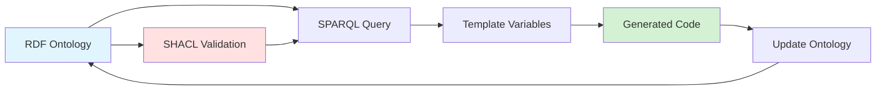

<!-- START doctoc generated TOC please keep comment here to allow auto update -->
<!-- DON'T EDIT THIS SECTION, INSTEAD RE-RUN doctoc TO UPDATE -->
**Table of Contents**

- [RDF, SHACL, and SPARQL](#rdf-shacl-and-sparql)
  - [Why RDF for Code Generation?](#why-rdf-for-code-generation)
  - [The Ontology-Driven Development Workflow](#the-ontology-driven-development-workflow)
  - [RDF Foundations](#rdf-foundations)
    - [What is RDF?](#what-is-rdf)
    - [Real Example: Product Ontology](#real-example-product-ontology)
  - [Oxigraph: Production RDF Triple Store](#oxigraph-production-rdf-triple-store)
    - [Why Oxigraph?](#why-oxigraph)
    - [How ggen Uses Oxigraph](#how-ggen-uses-oxigraph)
  - [SPARQL 1.1: Extracting Domain Knowledge](#sparql-11-extracting-domain-knowledge)
    - [Basic SPARQL Queries](#basic-sparql-queries)
    - [Matrix Queries for Code Generation](#matrix-queries-for-code-generation)
  - [The Ontology → Code Projection](#the-ontology--code-projection)
    - [Conceptual Model](#conceptual-model)
    - [From Product Ontology to Rust Struct](#from-product-ontology-to-rust-struct)
  - [SHACL Validation](#shacl-validation)
    - [Core SHACL Subset](#core-shacl-subset)
    - [Example: Validating Product Properties](#example-validating-product-properties)
  - [Supported RDF Formats](#supported-rdf-formats)
  - [The "Aha!" Moment](#the-aha-moment)

<!-- END doctoc generated TOC please keep comment here to allow auto update -->

# RDF, SHACL, and SPARQL

## Why RDF for Code Generation?

Traditional code generators use templating languages like Jinja or Mustache. You pass in variables and get code out. But this approach doesn't scale:

- **No semantic model**: Variables are just strings with no meaning or relationships
- **No validation**: Easy to pass invalid data that produces broken code
- **No querying**: Can't ask "give me all entities with a price field"
- **No evolution**: Changing the model requires updating every template

**RDF solves this** by giving your domain model a formal, queryable, validatable structure.

## The Ontology-Driven Development Workflow



1. **Define** your domain in RDF (Products, Categories, Properties)
2. **Validate** the ontology with SHACL shapes
3. **Query** the ontology with SPARQL to extract data
4. **Generate** code in any language from template variables
5. **Evolve** the ontology and regenerate automatically

## RDF Foundations

### What is RDF?

RDF (Resource Description Framework) represents knowledge as **triples**:

```
<subject> <predicate> <object>
```

Every statement is a triple. Examples:

```turtle
<Product> <has-property> <name>
<name> <has-datatype> <xsd:string>
<Product> <has-property> <price>
<price> <has-datatype> <xsd:decimal>
```

In Turtle syntax (the most readable RDF format):

```turtle
@prefix ex: <http://example.org/product#> .
@prefix xsd: <http://www.w3.org/2001/XMLSchema#> .

ex:Product a owl:Class ;
    rdfs:label "Product" ;
    rdfs:comment "A product in the catalog" .

ex:name a owl:DatatypeProperty ;
    rdfs:domain ex:Product ;
    rdfs:range xsd:string ;
    rdfs:label "name" .

ex:price a owl:DatatypeProperty ;
    rdfs:domain ex:Product ;
    rdfs:range xsd:decimal ;
    rdfs:label "price" .
```

### Real Example: Product Ontology

Let's define a product catalog domain in RDF:

```turtle
@prefix pc: <http://example.org/product_catalog#> .
@prefix rdfs: <http://www.w3.org/2000/01/rdf-schema#> .
@prefix xsd: <http://www.w3.org/2001/XMLSchema#> .

# Define the Product class
pc:Product a rdfs:Class ;
    rdfs:label "Product" ;
    rdfs:comment "A product in the e-commerce catalog" .

# Define Product properties
pc:name a rdf:Property ;
    rdfs:domain pc:Product ;
    rdfs:range xsd:string ;
    rdfs:label "name" ;
    rdfs:comment "Product display name" .

pc:description a rdf:Property ;
    rdfs:domain pc:Product ;
    rdfs:range xsd:string ;
    rdfs:label "description" .

pc:price a rdf:Property ;
    rdfs:domain pc:Product ;
    rdfs:range xsd:decimal ;
    rdfs:label "price" ;
    rdfs:comment "Product price in USD" .

pc:sku a rdf:Property ;
    rdfs:domain pc:Product ;
    rdfs:range xsd:string ;
    rdfs:label "sku" ;
    rdfs:comment "Stock keeping unit identifier" .
```

This ontology declares: "A Product has a name (string), description (string), price (decimal), and SKU (string)."

## Oxigraph: Production RDF Triple Store

### Why Oxigraph?

ggen uses **Oxigraph** as its RDF triple store. Oxigraph is:

- **Fast**: Written in Rust, optimized for in-memory graphs
- **Standards-compliant**: Full SPARQL 1.1 support
- **Production-ready**: Powers real semantic web applications
- **Embeddable**: No external database required

### How ggen Uses Oxigraph

```rust
use oxigraph::store::Store;
use oxigraph::model::*;

// 1. Create in-memory RDF store
let store = Store::new()?;

// 2. Load RDF ontology (Turtle format)
store.load_from_reader(
    GraphFormat::Turtle,
    file_reader,
    GraphNameRef::DefaultGraph,
    None
)?;

// 3. Execute SPARQL query
let query = "
    PREFIX pc: <http://example.org/product_catalog#>
    SELECT ?property ?datatype WHERE {
        ?property rdfs:domain pc:Product .
        ?property rdfs:range ?datatype .
    }
    ORDER BY ?property
";
let results = store.query(query)?;

// 4. Process results → template variables
for result in results {
    let property = result.get("property");
    let datatype = result.get("datatype");
    // → Generate struct fields
}
```

This is the **real implementation** in `ggen-domain/src/graph/load.rs`. No mocks, no simulations.

## SPARQL 1.1: Extracting Domain Knowledge

SPARQL is SQL for RDF graphs. It lets you query the ontology like a database.

### Basic SPARQL Queries

**Query 1: Find all classes**

```sparql
PREFIX rdfs: <http://www.w3.org/2000/01/rdf-schema#>

SELECT ?class ?label WHERE {
    ?class a rdfs:Class .
    ?class rdfs:label ?label .
}
ORDER BY ?label
```

Result:
```
?class               | ?label
---------------------|----------
pc:Product           | "Product"
pc:Category          | "Category"
pc:Supplier          | "Supplier"
```

**Query 2: Find all Product properties**

```sparql
PREFIX pc: <http://example.org/product_catalog#>
PREFIX rdfs: <http://www.w3.org/2000/01/rdf-schema#>

SELECT ?property ?datatype ?label WHERE {
    ?property rdfs:domain pc:Product .
    ?property rdfs:range ?datatype .
    ?property rdfs:label ?label .
}
ORDER BY ?label
```

Result:
```
?property    | ?datatype     | ?label
-------------|---------------|-------------
pc:name      | xsd:string    | "name"
pc:price     | xsd:decimal   | "price"
pc:sku       | xsd:string    | "sku"
```

### Matrix Queries for Code Generation

ggen templates use **matrix queries** to generate multiple code blocks from one ontology:

```yaml
---
to: src/models/{{ class_name }}.rs
matrix:
  query: |
    PREFIX pc: <http://example.org/product_catalog#>
    SELECT ?class ?label WHERE {
        ?class a rdfs:Class .
        ?class rdfs:label ?label .
    }
    ORDER BY ?label
  vars:
    class_name: "{{ ?label }}"
---
```

This generates **one file per class**: `Product.rs`, `Category.rs`, `Supplier.rs`.

Inside each file, another query extracts properties:

```handlebars
pub struct {{ class_name }} {
{{#each properties}}
    pub {{ name }}: {{ rust_type }},
{{/each}}
}
```

Where `properties` comes from:

```sparql
SELECT ?name ?datatype WHERE {
    ?property rdfs:domain ?class .
    ?property rdfs:range ?datatype .
    ?property rdfs:label ?name .
}
```

## The Ontology → Code Projection

### Conceptual Model

```
RDF Ontology (Domain Model)
    ↓ SPARQL Query
Template Variables (Data Structure)
    ↓ Handlebars Rendering
Generated Code (Language-Specific)
```

The ontology is **language-agnostic**. The same RDF can generate:

- Rust structs
- TypeScript interfaces
- Python dataclasses
- SQL table schemas
- GraphQL types
- OpenAPI specs

### From Product Ontology to Rust Struct

**Input: Product Ontology (RDF)**

```turtle
pc:Product a rdfs:Class ;
    rdfs:label "Product" .

pc:name rdfs:domain pc:Product ; rdfs:range xsd:string .
pc:price rdfs:domain pc:Product ; rdfs:range xsd:decimal .
pc:sku rdfs:domain pc:Product ; rdfs:range xsd:string .
```

**SPARQL Query:**

```sparql
SELECT ?class ?property ?datatype WHERE {
    ?class rdfs:label "Product" .
    ?property rdfs:domain ?class .
    ?property rdfs:range ?datatype .
}
```

**Template Variables:**

```json
{
  "class": "Product",
  "properties": [
    {"name": "name", "datatype": "xsd:string"},
    {"name": "price", "datatype": "xsd:decimal"},
    {"name": "sku", "datatype": "xsd:string"}
  ]
}
```

**Template (Handlebars):**

```handlebars
#[derive(Debug, Clone, Serialize, Deserialize)]
pub struct {{ class }} {
{{#each properties}}
    pub {{ name }}: {{ map_type datatype }},
{{/each}}
}
```

Where `map_type` is a Handlebars helper:

```
xsd:string  → String
xsd:decimal → f64
xsd:integer → i64
xsd:boolean → bool
```

**Output: Generated Rust Code**

```rust
#[derive(Debug, Clone, Serialize, Deserialize)]
pub struct Product {
    pub name: String,
    pub price: f64,
    pub sku: String,
}
```

**The Key Insight:** Change the ontology → re-run `ggen gen` → code updates automatically.

## SHACL Validation

SHACL (Shapes Constraint Language) validates RDF graphs before code generation.

### Core SHACL Subset

ggen supports:

- `sh:NodeShape` - Define shape for a class
- `sh:PropertyShape` - Define property constraints
- `sh:minCount` / `sh:maxCount` - Cardinality constraints
- `sh:datatype` - Datatype validation
- `sh:class` - Class constraints
- `sh:pattern` - Regex validation

### Example: Validating Product Properties

```turtle
@prefix sh: <http://www.w3.org/ns/shacl#> .
@prefix pc: <http://example.org/product_catalog#> .

pc:ProductShape a sh:NodeShape ;
    sh:targetClass pc:Product ;
    sh:property [
        sh:path pc:name ;
        sh:datatype xsd:string ;
        sh:minCount 1 ;
        sh:maxCount 1 ;
    ] ;
    sh:property [
        sh:path pc:price ;
        sh:datatype xsd:decimal ;
        sh:minCount 1 ;
        sh:pattern "^[0-9]+\\.[0-9]{2}$" ;  # Must have 2 decimal places
    ] ;
    sh:property [
        sh:path pc:sku ;
        sh:datatype xsd:string ;
        sh:pattern "^[A-Z]{3}-[0-9]{6}$" ;  # Format: ABC-123456
    ] .
```

**What this validates:**

- Every Product **must have** exactly one `name` (string)
- Every Product **must have** a `price` (decimal, 2 decimal places)
- If a Product has a `sku`, it must match pattern `ABC-123456`

**Invalid RDF will fail before code generation:**

```turtle
# INVALID: Price has wrong format
pc:product1 a pc:Product ;
    pc:name "Widget" ;
    pc:price "99.9" .  # ❌ Must be 99.90

# INVALID: Missing required name
pc:product2 a pc:Product ;
    pc:price 49.99 .  # ❌ No name provided
```

## Supported RDF Formats

ggen accepts multiple RDF serialization formats:

| Format      | Extension  | Example                                      |
|-------------|-----------|----------------------------------------------|
| Turtle      | `.ttl`    | `@prefix ex: <...> . ex:Product a owl:Class .` |
| N-Triples   | `.nt`     | `<http://ex.org/Product> <http://...> <...> .` |
| RDF/XML     | `.rdf`    | `<rdf:RDF>...</rdf:RDF>`                     |
| JSON-LD     | `.jsonld` | `{"@context": {...}, "@type": "Product"}`    |

**Auto-detection:** ggen detects the format from the file extension.

## The "Aha!" Moment

Traditional code generation:

```bash
$ codegen --template product.tmpl --var name=Widget --var price=99.99
# Generated: One Product struct with hardcoded values
```

**Problems:**

- Need to pass every variable manually
- No validation (can pass `price=banana`)
- Can't query relationships
- Can't generate multiple files from one model

**Ontology-driven generation:**

```bash
$ ggen gen product-model.tmpl --graph product_catalog.ttl
# Generated: Complete domain model with validation
```

**Benefits:**

- **One ontology** defines the entire domain
- **SPARQL queries** extract exactly what each template needs
- **SHACL validation** catches errors before generation
- **Evolution**: Update ontology → regenerate everything

**Example:** Add a `rating` field to Product:

```turtle
# Add one line to product_catalog.ttl
pc:rating rdfs:domain pc:Product ; rdfs:range xsd:decimal .
```

```bash
$ ggen gen product-model.tmpl --graph product_catalog.ttl
```

**Result:** All generated code now has `pub rating: f64`. No template changes required.

This is the power of **semantic code generation**.
