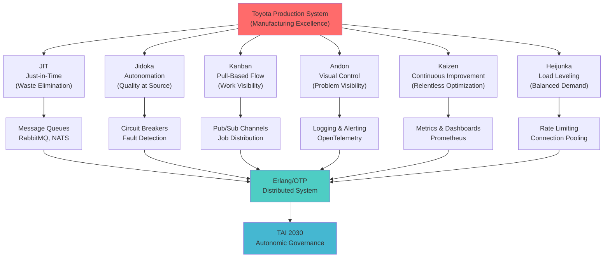
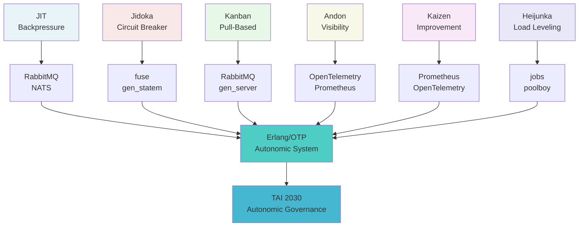

<!-- START doctoc generated TOC please keep comment here to allow auto update -->
<!-- DON'T EDIT THIS SECTION, INSTEAD RE-RUN doctoc TO UPDATE -->
**Table of Contents**

- [TPS Principles & Erlang/OTP Patterns](#tps-principles--erlangotp-patterns)
  - [Executive Summary](#executive-summary)
  - [TPS Principles Overview](#tps-principles-overview)
  - [Principle 1: Just-in-Time (JIT)](#principle-1-just-in-time-jit)
    - [Definition & Manufacturing Origin](#definition--manufacturing-origin)
    - [Code Analogy: Message-Driven Architecture](#code-analogy-message-driven-architecture)
    - [Erlang/OTP Patterns for JIT](#erlangotp-patterns-for-jit)
      - [Pattern 1A: Backpressure-Aware Message Handling](#pattern-1a-backpressure-aware-message-handling)
      - [Pattern 1B: Just-in-Time Process Spawning](#pattern-1b-just-in-time-process-spawning)
      - [Pattern 1C: Demand-Driven Work Queues](#pattern-1c-demand-driven-work-queues)
    - [Erlang/OTP JIT Library Selections](#erlangotp-jit-library-selections)
    - [JIT Metrics & Verification](#jit-metrics--verification)
    - [JIT Anti-Patterns](#jit-anti-patterns)
  - [Principle 2: Jidoka (Autonomation)](#principle-2-jidoka-autonomation)
    - [Definition & Manufacturing Origin](#definition--manufacturing-origin-1)
    - [Code Analogy: Fail-Fast, Halt-Explicit](#code-analogy-fail-fast-halt-explicit)
    - [Erlang/OTP Patterns for Jidoka](#erlangotp-patterns-for-jidoka)
      - [Pattern 2A: Circuit Breaker with Explicit Halt](#pattern-2a-circuit-breaker-with-explicit-halt)
      - [Pattern 2B: Supervisor with Explicit Halt (Andon Cord)](#pattern-2b-supervisor-with-explicit-halt-andon-cord)
      - [Pattern 2C: Health Check with Auto-Halt](#pattern-2c-health-check-with-auto-halt)
    - [Erlang/OTP Jidoka Library Selections](#erlangotp-jidoka-library-selections)
    - [Jidoka Metrics & Verification](#jidoka-metrics--verification)
    - [Jidoka Anti-Patterns](#jidoka-anti-patterns)
  - [Principle 3: Kanban (Pull-Based Flow)](#principle-3-kanban-pull-based-flow)
    - [Definition & Manufacturing Origin](#definition--manufacturing-origin-2)
    - [Code Analogy: Pub/Sub with Demand Signals](#code-analogy-pubsub-with-demand-signals)
    - [Erlang/OTP Patterns for Kanban](#erlangotp-patterns-for-kanban)
      - [Pattern 3A: Kanban Board with Visual Queue](#pattern-3a-kanban-board-with-visual-queue)
      - [Pattern 3B: Fair Work Distribution (Round-Robin Kanban)](#pattern-3b-fair-work-distribution-round-robin-kanban)
      - [Pattern 3C: Kanban with Explicit Capacity Planning](#pattern-3c-kanban-with-explicit-capacity-planning)
    - [Erlang/OTP Kanban Library Selections](#erlangotp-kanban-library-selections)
    - [Kanban Metrics & Verification](#kanban-metrics--verification)
    - [Kanban Anti-Patterns](#kanban-anti-patterns)
  - [Principle 4: Andon (Visual Management)](#principle-4-andon-visual-management)
    - [Definition & Manufacturing Origin](#definition--manufacturing-origin-3)
    - [Code Analogy: Observability, Logging, Alerting](#code-analogy-observability-logging-alerting)
    - [Erlang/OTP Patterns for Andon](#erlangotp-patterns-for-andon)
      - [Pattern 4A: OpenTelemetry with Structured Tracing](#pattern-4a-opentelemetry-with-structured-tracing)
      - [Pattern 4B: Real-Time Status Dashboard](#pattern-4b-real-time-status-dashboard)
      - [Pattern 4C: Alert Routing and Escalation](#pattern-4c-alert-routing-and-escalation)
    - [Erlang/OTP Andon Library Selections](#erlangotp-andon-library-selections)
    - [Andon Metrics & Verification](#andon-metrics--verification)
    - [Andon Anti-Patterns](#andon-anti-patterns)
  - [Principle 5: Kaizen (Continuous Improvement)](#principle-5-kaizen-continuous-improvement)
    - [Definition & Manufacturing Origin](#definition--manufacturing-origin-4)
    - [Code Analogy: Observability, Metrics, Feedback Loops](#code-analogy-observability-metrics-feedback-loops)
    - [Erlang/OTP Patterns for Kaizen](#erlangotp-patterns-for-kaizen)
      - [Pattern 5A: Prometheus Metrics Collection](#pattern-5a-prometheus-metrics-collection)
      - [Pattern 5B: Bottleneck Detection and Analysis](#pattern-5b-bottleneck-detection-and-analysis)
      - [Pattern 5C: A/B Testing Framework for Improvements](#pattern-5c-ab-testing-framework-for-improvements)
    - [Erlang/OTP Kaizen Library Selections](#erlangotp-kaizen-library-selections)
    - [Kaizen Metrics & Verification](#kaizen-metrics--verification)
    - [Kaizen Anti-Patterns](#kaizen-anti-patterns)
  - [Principle 6: Heijunka (Load Leveling)](#principle-6-heijunka-load-leveling)
    - [Definition & Manufacturing Origin](#definition--manufacturing-origin-5)
    - [Code Analogy: Rate Limiting, Load Distribution, Backpressure](#code-analogy-rate-limiting-load-distribution-backpressure)
    - [Erlang/OTP Patterns for Heijunka](#erlangotp-patterns-for-heijunka)
      - [Pattern 6A: Token Bucket Rate Limiter](#pattern-6a-token-bucket-rate-limiter)
      - [Pattern 6B: Load Distribution (Round-Robin)](#pattern-6b-load-distribution-round-robin)
      - [Pattern 6C: Heijunka with Demand Prediction](#pattern-6c-heijunka-with-demand-prediction)
    - [Erlang/OTP Heijunka Library Selections](#erlangotp-heijunka-library-selections)
    - [Heijunka Metrics & Verification](#heijunka-metrics--verification)
    - [Heijunka Anti-Patterns](#heijunka-anti-patterns)
  - [Cross-Principle Integration](#cross-principle-integration)
  - [Summary Table: TPS Principles → Erlang/OTP Patterns → Libraries](#summary-table-tps-principles-%E2%86%92-erlangotp-patterns-%E2%86%92-libraries)
  - [Compliance Checklist](#compliance-checklist)
  - [Next Steps](#next-steps)

<!-- END doctoc generated TOC please keep comment here to allow auto update -->

# TPS Principles & Erlang/OTP Patterns

**Version**: 1.0.0 (Production-Ready Reference)
**Classification**: UNCLASSIFIED//FOR OFFICIAL USE ONLY
**Date**: January 2026
**Owner**: TAI 2030 Architecture Team
**Last Updated**: 2026-01-25

---

## Executive Summary

This document maps **Toyota Production System (TPS)** principles to **Erlang/OTP** design patterns and library selections for **government autonomic governance systems**. Each TPS pillar translates directly to distributed system patterns used in TAI 2030.

**Core Thesis**: TPS manufacturing principles are **directly applicable to distributed systems engineering**. Manufacturing's focus on:
- **Waste elimination** → Message queue optimization, supervisor tree pruning
- **Continuous improvement** → Metrics collection, autonomous feedback loops
- **Quality at source** → Type system enforcement, circuit breakers
- **Fail-safe design** → Jidoka (autonomation), halting failures explicitly
- **Visual control** → Observability, OpenTelemetry, Andon signals

**Result**: A highly reliable, self-healing, government-compliant autonomic system.

---

## TPS Principles Overview



---

## Principle 1: Just-in-Time (JIT)

### Definition & Manufacturing Origin

**Just-in-Time (JIT)**: Deliver exactly what is needed, exactly when it is needed, in exactly the right quantity.

**Manufacturing Context**: Toyota factories don't stockpile parts. Instead, suppliers deliver components minutes before assembly. This eliminates:
- Warehouse waste
- Obsolescence risk
- Capital tied up in inventory
- Quality degradation from storage

**Implementation Result**: Toyota achieved 50% reduction in inventory costs while improving quality (fewer defects from stored parts).

### Code Analogy: Message-Driven Architecture

In distributed systems, JIT means:
- **Process only signals you need** (don't buffer indefinitely)
- **Deliver messages at consumption pace** (backpressure)
- **Eliminate intermediary queues** (direct message passing when possible)
- **Just-in-time resource allocation** (spawn processes on demand, not pre-allocated pools)

**Problem Without JIT**:
```erlang
%% ❌ ANTI-PATTERN: Buffering indefinitely (inventory waste)
-module(bad_jit).
-behavior(gen_server).

init([]) ->
    {ok, #state{
        message_queue = [],  % Unbounded queue = inventory
        backlog = 10000      % Queued work before processing
    }}.

handle_info(Message, #state{message_queue=Q} = State) ->
    {noreply, State#state{message_queue = [Message|Q]}}.  % Keep growing
```

**Solution With JIT**:
```erlang
%% ✅ JIT PATTERN: Process at demand rate (backpressure)
-module(good_jit).
-behavior(gen_statem).

callback_mode() -> handle_event_function.

init([]) ->
    {ok, idle, #data{
        processing = false,
        demand = 0
    }}.

%% Only request more when ready to process
handle_event(cast, {signal, Signal}, idle, Data) ->
    {next_state, processing, Data#data{current=Signal},
     {next_event, internal, {process, Signal}}};

%% Backpressure: don't accept new signals until done
handle_event(internal, {process, Signal}, processing, Data) ->
    Result = process_signal(Signal),
    emit_receipt(result, Result),
    {next_state, idle, Data, [{next_event, cast, {demand_next}}]}.
```

**Erlang/OTP JIT Pattern**: `gen_statem` with `{next_event, ...}` control

### Erlang/OTP Patterns for JIT

#### Pattern 1A: Backpressure-Aware Message Handling

```erlang
%% Process signals at consumption pace, not arrival pace
-module(jit_handler).
-behavior(gen_server).

-record(state, {
    demand = 0,           % Track how much work we can accept
    max_concurrent = 10,  % Hard limit on in-flight signals
    processing = set:new()
}).

init([MaxConcurrent]) ->
    {ok, #state{max_concurrent = MaxConcurrent}}.

handle_call({signal, Signal}, _From,
    #state{demand=D, max_concurrent=Max, processing=P} = State) when D < Max ->

    %% Can accept: demand is available
    NewProcessing = set:add_element(signal_id(Signal), P),
    {reply, ok, State#state{processing = NewProcessing}};

handle_call({signal, _Signal}, _From, State) ->
    %% Backpressure: demand exceeded, client must retry
    {reply, {error, backpressure}, State}.

handle_cast({done, SignalId}, #state{processing=P} = State) ->
    %% Freed capacity: demand increases
    NewP = set:del_element(SignalId, P),
    {noreply, State#state{processing = NewP}}.
```

#### Pattern 1B: Just-in-Time Process Spawning

```erlang
%% Spawn worker processes only when signals arrive (not pre-allocated)
-module(jit_supervisor).
-behavior(supervisor).

init([]) ->
    SupFlags = #{
        strategy => simple_one_for_one,  %% Spawn on demand
        intensity => 10,
        period => 60
    },

    ChildSpecs = [
        #{
            id => signal_worker,
            start => {signal_worker, start_link, []},
            restart => temporary,  %% Don't restart if killed (just-in-time)
            type => worker
        }
    ],

    {ok, {SupFlags, ChildSpecs}}.

%% Only spawn when signal arrives
handle_signal(Signal) ->
    {ok, _Pid} = supervisor:start_child(
        jit_supervisor,
        [Signal]  %% Worker processes signal, exits when done
    ).
```

#### Pattern 1C: Demand-Driven Work Queues

```erlang
%% Queue pulls work at its own pace (not pushed by producers)
-module(jit_queue).
-behavior(gen_server).

init([QueueName, MaxWorkers]) ->
    {ok, #state{
        queue = queue:new(),
        active_workers = 0,
        max_workers = MaxWorkers,
        queue_name = QueueName
    }}.

%% Producer just places signal in queue; queue manages pacing
handle_cast({enqueue, Signal}, #state{queue=Q, active_workers=A, max_workers=M} = State)
    when A < M ->
    %% Work available AND capacity exists: immediately process
    process_signal_async(Signal),
    {noreply, State#state{
        active_workers = A + 1
    }};

handle_cast({enqueue, Signal}, #state{queue=Q} = State) ->
    %% No capacity: put in queue, workers will pull when ready
    {noreply, State#state{queue = queue:in(Signal, Q)}}.

handle_info({worker_done, SignalId}, #state{queue=Q, active_workers=A} = State) ->
    case queue:out(Q) of
        {{value, NextSignal}, NewQ} ->
            process_signal_async(NextSignal),
            {noreply, State#state{queue = NewQ}};
        {empty, NewQ} ->
            {noreply, State#state{
                queue = NewQ,
                active_workers = A - 1
            }}
    end.
```

### Erlang/OTP JIT Library Selections

| Library | Purpose | Why JIT | Integration |
|---------|---------|---------|-------------|
| **gen_statem** | State machine with event control | Fine-grained control of signal processing pace | Built-in OTP |
| **gen_server** | Process with mailbox backpressure | Handle calls force backpressure (response required) | Built-in OTP |
| **RabbitMQ** | Message queue with prefetch control | Consumer prefetch = JIT demand signal | AMQP client |
| **NATS** | Pub/Sub with subscriber backpressure | Push-to-pullable subscription model | gnat Erlang client |
| **poolboy** | Connection/worker pooling | Just-in-time worker provisioning | Hex package |
| **jobs** | Priority job queue with rate limiting | Backpressure-aware queueing | Hex package |

### JIT Metrics & Verification

**How to Verify JIT Compliance**:

```erlang
%% Metric 1: Queue depth never unbounded
jit_metrics:queue_depth() => must_be_stable()

%% Metric 2: Backpressure is active (rejected signals when overloaded)
jit_metrics:rejected_signals() => should_be_nonzero()

%% Metric 3: Processing latency is constant (not degrading as load increases)
jit_metrics:p99_latency() => should_not_increase_with_load()

%% Metric 4: Resource utilization is correlated with demand
jit_metrics:active_workers() => should_track_demand()
```

### JIT Anti-Patterns

| Anti-Pattern | Problem | Fix |
|--------------|---------|-----|
| **Unbounded Queues** | Queue grows indefinitely, memory exhaustion | Implement backpressure (max queue depth) |
| **Pre-Allocated Pools** | Wasted resources for low demand | Use simple_one_for_one with dynamic spawning |
| **Fire-and-Forget** | No demand signaling, producer controls pace | Use RPC (call) for JIT demand control |
| **Batch Processing** | Collects work, processes in bursts (not JIT) | Stream processing, process as signals arrive |
| **Unbounded Buffers** | Signal buffer grows, no memory limits | Implement backpressure, drop oldest if full |

---

## Principle 2: Jidoka (Autonomation)

### Definition & Manufacturing Origin

**Jidoka (自働化)**: "Automation with human touch" — automatic quality checking and halting when defects are detected.

**Manufacturing Context**: Toyota production lines have automatic sensors that:
- Detect defects immediately
- Stop the entire assembly line
- Alert workers to the exact problem
- Prevent defective parts from moving downstream

**Key Insight**: "Stop the line" is faster than fixing quality issues later. A 5-minute line stop costs less than recalling 10,000 cars.

**Result**: Toyota achieved 6-sigma quality (3.4 defects per million units).

### Code Analogy: Fail-Fast, Halt-Explicit

In distributed systems, Jidoka means:
- **Detect failures immediately** (not hours later in logs)
- **Stop processing when problem detected** (circuit breaker, halt condition)
- **Alert operators explicitly** (Andon signal, not silent failure)
- **Prevent cascade failures** (one failure doesn't cause 10 downstream failures)

**Problem Without Jidoka**:
```erlang
%% ❌ ANTI-PATTERN: Silent failure propagation
-module(bad_jidoka).
-behavior(gen_server).

handle_info({signal, Signal}, State) ->
    try
        Result = process_unsafe(Signal),  %% Might throw, but we catch it
        {noreply, State}
    catch
        error:E ->
            logger:warning("Error: ~w", [E]),  %% Logged but not halted
            {noreply, State}  %% Keep processing (cascade failure!)
    end.

%% If process_unsafe fails 1000x, system degrades but doesn't halt
```

**Solution With Jidoka**:
```erlang
%% ✅ JIDOKA PATTERN: Circuit breaker with halt
-module(good_jidoka).
-behavior(gen_server).

-record(state, {
    failure_count = 0,
    max_failures = 3,
    status = healthy,  %% healthy | degraded | halted
    halted_at = undefined
}).

handle_info({signal, Signal}, #state{status=halted} = State) ->
    %% Jidoka halt in effect: refuse to process
    emit_andon_signal(circuit_open),
    {noreply, State};

handle_info({signal, Signal}, #state{failure_count=F, max_failures=Max} = State) ->
    case process_with_detection(Signal) of
        {ok, Result} ->
            {noreply, State#state{failure_count=0}};  %% Reset on success

        {error, Reason} when F + 1 >= Max ->
            %% Threshold exceeded: halt immediately
            emit_receipt(jidoka_halt, #{
                reason => Reason,
                failure_count => F + 1,
                timestamp => erlang:system_time(millisecond)
            }),
            emit_andon_signal(halt_condition_triggered),
            {noreply, State#state{
                status = halted,
                failure_count = F + 1,
                halted_at = erlang:system_time(millisecond)
            }};

        {error, _Reason} ->
            %% Below threshold: track and continue
            {noreply, State#state{failure_count = F + 1}}
    end.
```

### Erlang/OTP Patterns for Jidoka

#### Pattern 2A: Circuit Breaker with Explicit Halt

```erlang
%% Detect failures, halt when threshold exceeded
-module(circuit_breaker).
-behavior(gen_statem).

callback_mode() -> handle_event_function.

-record(data, {
    service :: atom(),
    failure_count = 0 :: non_neg_integer(),
    success_count = 0 :: non_neg_integer(),
    threshold = 5 :: non_neg_integer(),
    reset_timeout = 60000 :: non_neg_integer(),
    last_failure_time = 0 :: integer()
}).

%% Three explicit states: closed (healthy), open (halted), half_open (recovery)
init([Service]) ->
    {ok, closed, #data{service = Service}}.

%% State: closed (normal operation)
handle_event(cast, {request, Signal}, closed, Data) ->
    case perform_request(Signal) of
        ok ->
            {next_state, closed, Data#data{success_count = Data#data.success_count + 1}};
        {error, _} ->
            NewFailCount = Data#data.failure_count + 1,
            case NewFailCount >= Data#data.threshold of
                true ->
                    emit_receipt(circuit_open, #{timestamp => erlang:system_time(ms)}),
                    emit_andon_signal(jidoka_halt),
                    {next_state, open, Data#data{
                        failure_count = NewFailCount,
                        last_failure_time = erlang:system_time(millisecond)
                    }};
                false ->
                    {next_state, closed, Data#data{failure_count = NewFailCount}}
            end
    end;

%% State: open (circuit halted, no requests pass through)
handle_event(cast, {request, _Signal}, open, Data) ->
    emit_andon_signal(circuit_open),
    {next_state, open, Data};

handle_event(state_timeout, reset, open, Data) ->
    %% Timeout triggered recovery attempt (half-open state)
    {next_state, half_open, Data#data{success_count = 0}};

%% State: half_open (testing recovery)
handle_event(cast, {request, Signal}, half_open, Data) ->
    case perform_request(Signal) of
        ok ->
            NewSuccessCount = Data#data.success_count + 1,
            case NewSuccessCount >= 2 of  %% Two successes = circuit reset
                true ->
                    emit_receipt(circuit_closed, #{timestamp => erlang:system_time(ms)}),
                    {next_state, closed, Data#data{
                        failure_count = 0,
                        success_count = 0
                    }};
                false ->
                    {next_state, half_open, Data#data{success_count = NewSuccessCount}}
            end;
        {error, _} ->
            emit_receipt(circuit_open, #{timestamp => erlang:system_time(ms)}),
            {next_state, open, Data#data{failure_count = Data#data.failure_count + 1}}
    end.
```

#### Pattern 2B: Supervisor with Explicit Halt (Andon Cord)

```erlang
%% Supervisor that halts children when Andon condition detected
-module(jidoka_supervisor).
-behavior(supervisor).

init([]) ->
    SupFlags = #{
        strategy => one_for_all,  %% One failure = all restart (explicit cascade)
        intensity => 3,           %% 3 restarts allowed
        period => 60              %% Within 60 seconds
    },

    ChildSpecs = [
        #{
            id => governor,
            start => {governor, start_link, []},
            restart => permanent,
            type => worker
        }
    ],

    {ok, {SupFlags, ChildSpecs}}.

%% Andon cord: external trigger to halt entire supervisor
halt_supervisor(Reason) ->
    emit_receipt(andon_halt, #{reason => Reason}),
    gen_server:call(jidoka_supervisor, {halt_immediate, Reason}).

handle_call({halt_immediate, Reason}, _From, State) ->
    %% Terminate all children, stop supervisor
    {stop, {andon_halt, Reason}, ok, State}.
```

#### Pattern 2C: Health Check with Auto-Halt

```erlang
%% Periodically verify system health; halt if degraded
-module(health_monitor).
-behavior(gen_server).

-record(state, {
    health_checks = [],
    halt_threshold = 0.5,  %% Halt if > 50% checks fail
    check_interval = 5000
}).

init([]) ->
    {ok, #state{}, [{next_event, internal, check_health}]}.

handle_info(check_health, State) ->
    Results = [
        {cpu_ok, check_cpu_usage()},
        {memory_ok, check_memory()},
        {disk_ok, check_disk()},
        {connectivity_ok, check_network()},
        {queue_ok, check_queue_depth()}
    ],

    FailureRatio = count_failures(Results) / length(Results),

    case FailureRatio > State#state.halt_threshold of
        true ->
            emit_receipt(health_degraded, #{
                failures => Results,
                ratio => FailureRatio
            }),
            emit_andon_signal(system_degraded),
            {noreply, State#state{status = degraded}};
        false ->
            {noreply, State, [{next_event, internal, check_health}]}
    end.
```

### Erlang/OTP Jidoka Library Selections

| Library | Purpose | Why Jidoka | Integration |
|---------|---------|-----------|-------------|
| **gen_statem** | FSM with explicit states (closed/open/half-open) | Natural fit for circuit breaker states | Built-in OTP |
| **supervisor** | Process hierarchy with restart strategies | Orchestrates halt conditions | Built-in OTP |
| **fuse** | Erlang circuit breaker library | Purpose-built for failure detection | Hex package |
| **breaker** | Alternative circuit breaker | Lightweight, fast failure detection | Hex package |
| **recon** | Runtime diagnostics (memory, processes) | Health monitoring for Jidoka halts | Hex package |
| **jobs** | Priority queue with load protection | Prevents cascading overload | Hex package |

### Jidoka Metrics & Verification

**How to Verify Jidoka Compliance**:

```erlang
%% Metric 1: Circuit breaker triggers when threshold hit
jidoka_metrics:circuit_opens() => should_be_nonzero()

%% Metric 2: System halts explicitly (not cascading failures)
jidoka_metrics:andon_signals() => all_documented()

%% Metric 3: Recovery is controlled (half-open state tracked)
jidoka_metrics:half_open_duration() => should_be_measurable()

%% Metric 4: Cascading failures prevented
jidoka_metrics:unhandled_exceptions() => must_be_zero()
```

### Jidoka Anti-Patterns

| Anti-Pattern | Problem | Fix |
|--------------|---------|-----|
| **Silent Failures** | Errors logged but processing continues | Implement explicit halt on error threshold |
| **Cascade Failures** | One failure triggers 10 downstream failures | Use circuit breakers, halt fast |
| **Slow Detection** | Failures detected minutes later | Implement automatic health checks, fail fast |
| **No Recovery Path** | Halted forever (manual restart required) | Implement half-open state, recovery attempts |
| **No Andon Signal** | Failures not visible to operators | Emit explicit Andon signals, alerts |

---

## Principle 3: Kanban (Pull-Based Flow)

### Definition & Manufacturing Origin

**Kanban (看板)**: Visual cards that signal when work is needed. Work is "pulled" by downstream processes, not "pushed" by upstream.

**Manufacturing Context**: When an assembly station needs parts:
1. Worker pulls a Kanban card from the bin
2. Card is physical signal to supplier: "Make more"
3. Supplier produces only what was consumed
4. No guessing about demand, no overproduction

**Result**: Toyota reduced inventory costs by 60% and improved delivery time by 50%.

### Code Analogy: Pub/Sub with Demand Signals

In distributed systems, Kanban means:
- **Subscribers request work** (pull), not producers decide (push)
- **Visibility of demand** (all signals visible in queue)
- **Prevent overproduction** (don't generate work no one is waiting for)
- **Even distribution** (all subscribers get equal work)

**Problem Without Kanban**:
```erlang
%% ❌ ANTI-PATTERN: Push-based (producer decides pace)
-module(bad_kanban).

-spec produce_signals() -> ok.
produce_signals() ->
    %% Producer generates signals regardless of consumption
    lists:foreach(fun(_) ->
        Signal = generate_signal(),
        rpc:cast(consumer, handle_signal, [Signal])
    end, lists:seq(1, 1000)).

    %% Consumer might be sleeping, busy, or gone
    %% Signals piled up, no way to know demand
```

**Solution With Kanban**:
```erlang
%% ✅ KANBAN PATTERN: Pull-based (subscriber requests work)
-module(good_kanban).
-behavior(gen_server).

-record(state, {
    kanban_queue = [],           %% Visual signal queue
    active_subscribers = #{},    %% Who is waiting for work
    work_in_progress = 0,
    max_wip = 5                  %% Limit concurrent work
}).

handle_call({request_work, SubscriberId}, From,
    #state{kanban_queue=Q, work_in_progress=W, max_wip=Max} = State)
    when W < Max ->

    %% Kanban card pulled: subscriber is requesting work
    case Q of
        [Signal|Rest] ->
            %% Work available: give it to subscriber
            reply_with_work(From, Signal),
            {noreply, State#state{
                kanban_queue = Rest,
                work_in_progress = W + 1,
                active_subscribers = maps:put(SubscriberId, true, State#state.active_subscribers)
            }};

        [] ->
            %% No work available: subscriber waits
            {noreply, State#state{
                active_subscribers = maps:put(SubscriberId, From, State#state.active_subscribers)
            }}
    end;

handle_call({request_work, _SubId}, _From,
    #state{work_in_progress=W, max_wip=Max} = State) when W >= Max ->

    %% WIP limit exceeded: ask to wait
    {reply, {backpressure, wait_for_capacity}, State}.

%% When work completes, capacity freed, Kanban released
handle_cast({work_done, SubscriberId}, #state{active_subscribers=Subs, work_in_progress=W} = State) ->
    {noreply, State#state{
        work_in_progress = W - 1,
        active_subscribers = maps:remove(SubscriberId, Subs)
    }}.
```

### Erlang/OTP Patterns for Kanban

#### Pattern 3A: Kanban Board with Visual Queue

```erlang
%% Explicit queue showing all pending work
-module(kanban_board).
-behavior(gen_server).

-record(state, {
    columns = #{
        todo => [],        %% Incoming signals
        in_progress => [],  %% Being processed
        done => []          %% Completed work
    },
    wip_limit = 5         %% Max cards in progress
}).

init([WipLimit]) ->
    {ok, #state{wip_limit = WipLimit}}.

%% Enqueue signal (producer)
handle_cast({enqueue, Signal}, #state{columns=C} = State) ->
    Todo = maps:get(todo, C),
    NewC = C#{todo => [Signal|Todo]},
    {noreply, State#state{columns = NewC}};

%% Pull work when capacity available (consumer)
handle_call({pull_work}, _From, #state{columns=C, wip_limit=WL} = State) ->
    InProgress = maps:get(in_progress, C),
    case length(InProgress) < WL of
        true ->
            case maps:get(todo, C) of
                [Signal|Rest] ->
                    NewC = C#{
                        todo => Rest,
                        in_progress => [Signal|InProgress]
                    },
                    {reply, {ok, Signal}, State#state{columns = NewC}};
                [] ->
                    {reply, {empty}, State}
            end;
        false ->
            {reply, {backpressure}, State}
    end;

%% Mark work done
handle_cast({done, Signal}, #state{columns=C} = State) ->
    InProgress = maps:get(in_progress, C),
    Done = maps:get(done, C),
    NewC = C#{
        in_progress => lists:delete(Signal, InProgress),
        done => [Signal|Done]
    },
    {noreply, State#state{columns = NewC}}.

%% Visualize Kanban board (for dashboard)
handle_call({status}, _From, #state{columns=C, wip_limit=WL} = State) ->
    {reply, #{
        todo_count => length(maps:get(todo, C)),
        in_progress_count => length(maps:get(in_progress, C)),
        done_count => length(maps:get(done, C)),
        wip_limit => WL,
        capacity_available => WL - length(maps:get(in_progress, C))
    }, State}.
```

#### Pattern 3B: Fair Work Distribution (Round-Robin Kanban)

```erlang
%% Distribute work fairly among subscribers
-module(kanban_distributor).
-behavior(gen_server).

-record(state, {
    subscribers = [],
    current_index = 0,
    work_queue = [],
    work_tracker = #{}
}).

init([]) ->
    {ok, #state{}}.

%% Subscribe to work
handle_call({subscribe, SubscriberId}, _From, #state{subscribers=Subs} = State) ->
    {reply, ok, State#state{subscribers = [SubscriberId|Subs]}};

%% Pull work: fair distribution via round-robin
handle_call({pull_work}, _From,
    #state{subscribers=[], work_queue=[]} = State) ->
    {reply, {empty}, State};

handle_call({pull_work}, {SubscriberId, _},
    #state{subscribers=Subs, work_queue=[Work|Rest], current_index=Idx} = State) ->

    %% Find subscriber's turn (round-robin)
    NextIdx = (Idx + 1) rem length(Subs),
    SelectedSubscriber = lists:nth(NextIdx, Subs),

    case SelectedSubscriber == SubscriberId of
        true ->
            %% This subscriber's turn: give work
            {reply, {ok, Work}, State#state{
                work_queue = Rest,
                current_index = NextIdx
            }};
        false ->
            %% Not this subscriber's turn yet
            {reply, {not_your_turn}, State}
    end.
```

#### Pattern 3C: Kanban with Explicit Capacity Planning

```erlang
%% Kanban with per-subscriber capacity and demand forecasting
-module(kanban_capacity).
-behavior(gen_server).

-record(subscriber, {
    id :: atom(),
    capacity :: non_neg_integer(),
    allocated = 0 :: non_neg_integer(),
    utilization = 0.0 :: float()
}).

-record(state, {
    subscribers = #{},           %% id => #subscriber
    global_capacity = 100,       %% Total signals/sec
    demand_history = queue:new() %% Track demand trends
}).

init([GlobalCapacity]) ->
    {ok, #state{global_capacity = GlobalCapacity}}.

%% Register subscriber with capacity
handle_call({register_subscriber, SubId, Capacity}, _From,
    #state{subscribers=Subs} = State) ->
    {reply, ok, State#state{
        subscribers = Subs#{
            SubId => #subscriber{id=SubId, capacity=Capacity}
        }
    }};

%% Allocate work based on capacity
handle_call({allocate_work, WorkCount}, _From, State) ->
    Allocation = allocate_by_capacity(WorkCount, State#state.subscribers),
    {reply, {ok, Allocation}, State}.

%% Helper: allocate based on subscriber capacity
allocate_by_capacity(WorkCount, Subscribers) ->
    TotalCapacity = maps:fold(fun(_, Sub, Sum) ->
        Sum + Sub#subscriber.capacity
    end, 0, Subscribers),

    maps:map(fun(_, Sub) ->
        Ratio = Sub#subscriber.capacity / TotalCapacity,
        round(WorkCount * Ratio)
    end, Subscribers).
```

### Erlang/OTP Kanban Library Selections

| Library | Purpose | Why Kanban | Integration |
|---------|---------|-----------|-------------|
| **RabbitMQ** | Message queue with subscriber prefetch | Explicit Kanban: prefetch = WIP limit | AMQP client |
| **gnat** | NATS Pub/Sub with request-reply | Pull-based: subscribers request work | Hex package |
| **kafka** | Distributed event streaming | Consumer groups, Kanban per partition | kafka_erl Hex |
| **gen_server** | Process with call-based requests | Natural fit for pull-based model | Built-in OTP |
| **queue** module | FIFO queue implementation | Kanban board card storage | Built-in OTP |
| **jobs** | Priority job queue | Fair distribution, WIP limits | Hex package |

### Kanban Metrics & Verification

**How to Verify Kanban Compliance**:

```erlang
%% Metric 1: WIP (work in progress) stays within limit
kanban_metrics:current_wip() => must_be_less_than(max_wip)

%% Metric 2: No blockages (signals flowing smoothly)
kanban_metrics:queue_depth() => should_be_stable()

%% Metric 3: Fair distribution (all subscribers get equal work)
kanban_metrics:per_subscriber_work_count() => should_be_balanced()

%% Metric 4: Lead time is predictable
kanban_metrics:p99_lead_time() => should_not_degrade_with_load()
```

### Kanban Anti-Patterns

| Anti-Pattern | Problem | Fix |
|--------------|---------|-----|
| **Push Instead of Pull** | Producer controls pace, not consumer | Implement request-based work distribution |
| **Unlimited WIP** | Work-in-progress unbounded | Set explicit WIP limits per queue |
| **Invisible Queue** | No visibility into pending work | Make Kanban board visual (metrics, dashboards) |
| **Unfair Distribution** | Some subscribers get all work, others starved | Implement round-robin or capacity-based allocation |
| **No Capacity Planning** | Work allocated randomly, not by capacity | Allocate proportional to subscriber capacity |

---

## Principle 4: Andon (Visual Management)

### Definition & Manufacturing Origin

**Andon (行灯)**: Visual indicator system showing system status. When problems occur, lights and sounds alert workers immediately.

**Manufacturing Context**: Above each assembly station:
- **Green light**: Normal operation
- **Yellow light**: Minor issue detected
- **Red light**: Critical problem, line halted

Production managers can see status of entire factory from one place. Problems are never hidden.

**Result**: Toyota reduced defect detection time from hours to seconds.

### Code Analogy: Observability, Logging, Alerting

In distributed systems, Andon means:
- **All system signals visible** (not hidden in logs)
- **Immediate alerts** (not delayed reports)
- **Visual dashboards** (Andon board = Grafana)
- **Explicit status states** (green/yellow/red = healthy/warning/critical)

**Problem Without Andon**:
```erlang
%% ❌ ANTI-PATTERN: Silent degradation
-module(bad_andon).

handle_info({signal, Signal}, State) ->
    case process_signal(Signal) of
        ok -> {noreply, State};
        {error, E} ->
            logger:debug("Error: ~w", [E]),  %% Hidden in debug logs
            {noreply, State}  %% Continue silently
    end.

%% Operator has NO IDEA system is degrading
```

**Solution With Andon**:
```erlang
%% ✅ ANDON PATTERN: Explicit visual signals
-module(good_andon).
-behavior(gen_server).

-record(state, {
    status = healthy,     %% green
    warning_count = 0,    %% yellow
    critical_count = 0    %% red
}).

handle_info({signal, Signal}, #state{status=S} = State) ->
    case process_signal(Signal) of
        ok ->
            emit_andon_status(green, "All systems operational"),
            {noreply, State#state{
                status = healthy,
                warning_count = 0
            }};

        {warning, Reason} ->
            NewCount = State#state.warning_count + 1,
            emit_andon_signal(yellow, #{
                reason => Reason,
                count => NewCount,
                timestamp => erlang:system_time(millisecond)
            }),
            {noreply, State#state{warning_count = NewCount}};

        {critical, Reason} ->
            emit_andon_signal(red, #{
                reason => Reason,
                timestamp => erlang:system_time(millisecond)
            }),
            {noreply, State#state{
                status = critical,
                critical_count = State#state.critical_count + 1
            }}
    end.

%% Andon board status endpoint (for dashboards)
handle_call({status}, _From, #state{status=S, warning_count=W} = State) ->
    {reply, #{
        status => S,
        warnings => W,
        timestamp => erlang:system_time(millisecond)
    }, State}.
```

### Erlang/OTP Patterns for Andon

#### Pattern 4A: OpenTelemetry with Structured Tracing

```erlang
%% Emit structured traces for Andon visibility
-module(andon_tracer).

-spec emit_signal(atom(), map()) -> ok.
emit_signal(Status, Context) ->
    Ctx = otel_context:get_current(),
    Span = otel_tracer:start_span(
        otel_tracer:get_tracer(?MODULE),
        <<"andon_signal">>,
        #{attributes => #{
            'andon.status' => atom_to_binary(Status),
            'andon.severity' => signal_severity(Status),
            'andon.timestamp' => erlang:system_time(millisecond),
            'andon.context' => format_context(Context)
        }}
    ),
    otel_span:end_span(Span),
    ok.

signal_severity(healthy) -> <<"green">>;
signal_severity(warning) -> <<"yellow">>;
signal_severity(critical) -> <<"red">>.

%% Emit to logging system
emit_to_log(Status, Context) ->
    logger:info("ANDON_SIGNAL", #{
        status => Status,
        context => Context,
        timestamp => erlang:system_time(millisecond)
    }).
```

#### Pattern 4B: Real-Time Status Dashboard

```erlang
%% Real-time Andon board visible to all operators
-module(andon_board).
-behavior(gen_server).

-record(state, {
    system_status = healthy,
    subsystems = #{},      %% id => {status, last_update}
    alert_log = [],        %% Recent alerts (FIFO)
    alert_threshold = 10
}).

init([]) ->
    {ok, #state{}}.

%% Register subsystem (e.g., "auth", "database", "queue")
handle_cast({register_subsystem, SubId}, #state{subsystems=S} = State) ->
    {noreply, State#state{
        subsystems = S#{SubId => {healthy, erlang:system_time(millisecond)}}
    }};

%% Update subsystem status
handle_cast({update_status, SubId, Status}, #state{subsystems=S} = State) ->
    NewSubsystems = S#{
        SubId => {Status, erlang:system_time(millisecond)}
    },
    OverallStatus = compute_overall_status(NewSubsystems),
    {noreply, State#state{
        subsystems = NewSubsystems,
        system_status = OverallStatus
    }};

%% Retrieve Andon board for dashboard
handle_call({board}, _From, #state{system_status=Overall, subsystems=Subs} = State) ->
    {reply, #{
        overall_status => Overall,
        subsystems => format_subsystems(Subs),
        timestamp => erlang:system_time(millisecond)
    }, State}.

compute_overall_status(Subsystems) ->
    Statuses = maps:values(Subsystems),
    case lists:any(fun({critical, _}) -> true; (_) -> false end, Statuses) of
        true -> critical;
        false ->
            case lists:any(fun({warning, _}) -> true; (_) -> false end, Statuses) of
                true -> warning;
                false -> healthy
            end
    end.
```

#### Pattern 4C: Alert Routing and Escalation

```erlang
%% Route alerts to operators based on severity
-module(andon_alerter).
-behavior(gen_server).

-record(state, {
    alert_routes = #{
        warning => [slack, logger],
        critical => [slack, email, pagerduty, logger],
        fatal => [page_oncall, slack, email, pagerduty, logger]
    }
}).

init([]) ->
    {ok, #state{}}.

%% Emit alert and route to appropriate channels
handle_cast({alert, Severity, Message}, #state{alert_routes=Routes} = State) ->
    Channels = maps:get(Severity, Routes, [logger]),
    lists:foreach(fun(Channel) ->
        route_alert(Channel, Severity, Message)
    end, Channels),
    {noreply, State}.

route_alert(logger, Severity, Message) ->
    logger:alert("ANDON_ALERT", #{severity => Severity, message => Message});

route_alert(slack, _Severity, Message) ->
    send_to_slack(Message);

route_alert(email, _Severity, Message) ->
    send_email(get_oncall_email(), Message);

route_alert(pagerduty, Severity, Message) ->
    send_pagerduty_incident(Severity, Message);

route_alert(page_oncall, _Severity, Message) ->
    page_oncall_engineer(Message).
```

### Erlang/OTP Andon Library Selections

| Library | Purpose | Why Andon | Integration |
|---------|---------|----------|-------------|
| **OpenTelemetry Erlang** | Distributed tracing | Standard for observability, Andon telemetry | otel Hex package |
| **logger** (OTP 21+) | Structured logging | Built-in structured logs, searchable | Built-in OTP |
| **Lager** | Advanced logging with rotation | Comprehensive logging before logger | Hex package |
| **Prometheus** | Metrics collection | Real-time metrics for Andon board | Hex package |
| **Grafana** | Dashboarding | Visual Andon board (requires integration) | External service |
| **recon** | Runtime diagnostics | System health visibility | Hex package |

### Andon Metrics & Verification

**How to Verify Andon Compliance**:

```erlang
%% Metric 1: All signals emitted and visible
andon_metrics:signals_emitted() => should_be_logged()

%% Metric 2: Alert latency is low (visible within seconds)
andon_metrics:alert_latency_ms() => must_be_less_than(1000)

%% Metric 3: No silent failures (all errors visible)
andon_metrics:unlogged_errors() => must_be_zero()

%% Metric 4: Dashboard reflects reality in real-time
andon_metrics:dashboard_freshness_seconds() => must_be_less_than(5)
```

### Andon Anti-Patterns

| Anti-Pattern | Problem | Fix |
|--------------|---------|-----|
| **Hidden Failures** | Errors logged but not visible | Emit explicit Andon signals, alerts |
| **Alert Fatigue** | Too many alerts, operators ignore | Severity-based routing, aggregate alerts |
| **Delayed Visibility** | Status visible after 10 minutes | Stream-based updates (OpenTelemetry) |
| **Opaque Dashboards** | Metrics don't match reality | Real-time instrumentation, validate telemetry |
| **No Escalation** | Critical issue, but no one paged | Automatic escalation routing by severity |

---

## Principle 5: Kaizen (Continuous Improvement)

### Definition & Manufacturing Origin

**Kaizen (改善)**: "Change for the better" — systematic, continuous improvement of processes.

**Manufacturing Context**: Toyota operates a formal Kaizen program where:
- Workers identify inefficiencies (waste, quality issues)
- Small improvements tested, measured
- Successful changes standardized, rolled out
- Cycle repeats indefinitely

**Result**: Toyota employees submit 1M+ improvement ideas annually. ~95% are implemented.

### Code Analogy: Observability, Metrics, Feedback Loops

In distributed systems, Kaizen means:
- **Measure everything** (metrics, latency, error rates)
- **Identify bottlenecks** (profiling, traces)
- **Test improvements** (A/B tests, canaries)
- **Standardize successes** (update architecture, library versions)

**Problem Without Kaizen**:
```erlang
%% ❌ ANTI-PATTERN: No measurement, no improvement feedback
-module(bad_kaizen).

-spec process_signal(signal()) -> ok.
process_signal(Signal) ->
    %% No metrics, no timing, no feedback
    Result = expensive_computation(Signal),
    notify_subscriber(Result).

%% Performance degrades over time undetected
```

**Solution With Kaizen**:
```erlang
%% ✅ KAIZEN PATTERN: Continuous measurement and improvement
-module(good_kaizen).
-behavior(gen_server).

-record(state, {
    metrics = #{},           %% performance metrics
    baseline = undefined,    %% initial performance
    optimizations_applied = []
}).

handle_info({signal, Signal}, #state{metrics=M} = State) ->
    StartTime = erlang:monotonic_time(microsecond),

    Result = process_signal(Signal),

    EndTime = erlang:monotonic_time(microsecond),
    Duration = EndTime - StartTime,

    %% Record metric
    UpdatedM = record_metric(process_duration, Duration, M),

    %% Analyze metrics, identify improvements
    case analyze_metrics(UpdatedM) of
        {improvement_opportunity, Issue, Fix} ->
            logger:info("KAIZEN: Found improvement", #{
                issue => Issue,
                proposed_fix => Fix,
                expected_impact => estimate_impact(Issue)
            }),
            emit_receipt(kaizen_opportunity, #{issue => Issue, fix => Fix});

        {performance_regression, Regression} ->
            logger:warning("KAIZEN: Performance regression detected", #{
                regression => Regression,
                baseline => State#state.baseline
            })
    end,

    {noreply, State#state{metrics = UpdatedM}}.

%% Helper: analyze metrics for improvements
analyze_metrics(Metrics) ->
    P99 = percentile(process_duration, 99, Metrics),
    P50 = percentile(process_duration, 50, Metrics),

    case P99 / P50 > 2.0 of
        true -> {improvement_opportunity, high_latency_tail, optimize_hot_path};
        false -> {no_issue}
    end.
```

### Erlang/OTP Patterns for Kaizen

#### Pattern 5A: Prometheus Metrics Collection

```erlang
%% Collect metrics for Kaizen analysis
-module(kaizen_metrics).

-spec init() -> ok.
init() ->
    %% Histogram: measure process duration
    prometheus_histogram:new([
        {name, process_duration_us},
        {help, "Process duration in microseconds"},
        {buckets, [100, 500, 1000, 5000, 10000, 50000]}
    ]),

    %% Counter: track improvements applied
    prometheus_counter:new([
        {name, kaizen_improvements_applied},
        {help, "Number of Kaizen improvements applied"}
    ]),

    %% Gauge: current performance baseline
    prometheus_gauge:new([
        {name, baseline_latency_us},
        {help, "Baseline latency in microseconds"}
    ]),

    ok.

-spec observe_operation(atom(), fun()) -> any().
observe_operation(OpName, Fun) ->
    StartTime = erlang:monotonic_time(microsecond),
    Result = Fun(),
    EndTime = erlang:monotonic_time(microsecond),
    Duration = EndTime - StartTime,

    prometheus_histogram:observe(
        process_duration_us,
        Duration
    ),

    Result.

-spec record_improvement(atom(), map()) -> ok.
record_improvement(ImprovementType, Details) ->
    prometheus_counter:inc(kaizen_improvements_applied),
    logger:info("KAIZEN_IMPROVEMENT", #{
        type => ImprovementType,
        details => Details,
        timestamp => erlang:system_time(millisecond)
    }),
    ok.
```

#### Pattern 5B: Bottleneck Detection and Analysis

```erlang
%% Identify performance bottlenecks
-module(kaizen_bottleneck).
-behavior(gen_server).

-record(state, {
    operation_metrics = #{},  %% op_name => {count, total_time, max_time}
    profiling_window = 60000, %% 60 second window
    analysis_interval = 10000
}).

init([]) ->
    {ok, #state{}, [{next_event, internal, analyze}]}.

%% Record operation execution
handle_cast({observe, OpName, DurationUs}, #state{operation_metrics=M} = State) ->
    Current = maps:get(OpName, M, {0, 0, 0}),
    {Count, TotalTime, MaxTime} = Current,

    Updated = {
        Count + 1,
        TotalTime + DurationUs,
        max(MaxTime, DurationUs)
    },

    {noreply, State#state{operation_metrics = M#{OpName => Updated}}};

%% Periodic analysis
handle_info(analyze, #state{operation_metrics=M} = State) ->
    %% Find slowest operations
    Sorted = lists:sort(fun({_, {_, T1, _}}, {_, {_, T2, _}}) ->
        T1 > T2
    end, maps:to_list(M)),

    case Sorted of
        [{TopOp, {Count, TotalTime, MaxTime}}|_] ->
            AvgTime = TotalTime / Count,
            logger:info("KAIZEN_BOTTLENECK", #{
                operation => TopOp,
                avg_time_us => AvgTime,
                max_time_us => MaxTime,
                p99_time_us => percentile_time(TopOp, 99, M)
            }),

            %% Recommend improvement
            recommend_improvement(TopOp, AvgTime, MaxTime);

        [] ->
            ok
    end,

    {noreply, State#state{operation_metrics = #{}},
     [{next_event, internal, analyze, [], State#state.analysis_interval}]}.

recommend_improvement(Operation, AvgTime, MaxTime) ->
    case {AvgTime > 5000, MaxTime > 50000} of
        {true, true} ->
            emit_receipt(kaizen_critical_bottleneck, #{
                operation => Operation,
                avg_time => AvgTime,
                recommendation => optimize_hot_path
            });
        {true, false} ->
            emit_receipt(kaizen_bottleneck, #{
                operation => Operation,
                recommendation => investigate_slowdown
            });
        _ -> ok
    end.
```

#### Pattern 5C: A/B Testing Framework for Improvements

```erlang
%% Test improvements before rolling out
-module(kaizen_ab_test).
-behavior(gen_server).

-record(state, {
    active_tests = #{},    %% test_id => {variant_a, variant_b, config}
    test_results = #{}     %% test_id => {results_a, results_b}
}).

init([]) ->
    {ok, #state{}}.

%% Register new A/B test
handle_call({start_test, TestId, VariantA, VariantB, Config}, _From,
    #state{active_tests=T} = State) ->

    {reply, ok, State#state{
        active_tests = T#{
            TestId => {VariantA, VariantB, Config}
        }
    }};

%% Execute operation with A/B variant selection
handle_call({execute, TestId, Input}, _From,
    #state{active_tests=T, test_results=R} = State) ->

    case maps:get(TestId, T, undefined) of
        undefined ->
            {reply, {error, test_not_found}, State};

        {VariantA, VariantB, Config} ->
            %% Randomly select variant (50/50)
            Variant = case rand:uniform(2) of
                1 -> a;
                2 -> b
            end,

            StartTime = erlang:monotonic_time(microsecond),
            Result = case Variant of
                a -> VariantA(Input);
                b -> VariantB(Input)
            end,
            Duration = erlang:monotonic_time(microsecond) - StartTime,

            %% Record result
            record_test_result(TestId, Variant, Duration, Result, R),

            {reply, {ok, Result}, State}
    end;

%% Analyze test results
handle_call({analyze_test, TestId}, _From,
    #state{test_results=R, active_tests=T} = State) ->

    case maps:get(TestId, R, undefined) of
        undefined ->
            {reply, {error, no_results}, State};

        {ResultsA, ResultsB} ->
            %% Compare latency, success rate, etc.
            Comparison = compare_results(ResultsA, ResultsB),
            Winner = determine_winner(Comparison),

            {reply, {ok, #{
                winner => Winner,
                comparison => Comparison
            }}, State}
    end.

record_test_result(TestId, Variant, Duration, Result, Results) ->
    Current = maps:get(TestId, Results, {[], []}),
    {A, B} = Current,

    NewRecord = case Variant of
        a -> {[Duration|A], B};
        b -> {A, [Duration|B]}
    end,

    Results#{TestId => NewRecord}.

compare_results(ResultsA, ResultsB) ->
    AvgA = average(ResultsA),
    AvgB = average(ResultsB),

    #{
        avg_a => AvgA,
        avg_b => AvgB,
        improvement => ((AvgA - AvgB) / AvgA) * 100
    }.

determine_winner(Comparison) ->
    case maps:get(improvement, Comparison, 0) of
        I when I > 5.0 -> variant_a;
        I when I < -5.0 -> variant_b;
        _ -> no_clear_winner
    end.
```

### Erlang/OTP Kaizen Library Selections

| Library | Purpose | Why Kaizen | Integration |
|---------|---------|-----------|-------------|
| **Prometheus** | Metrics collection and exposition | Standard metrics for improvement analysis | Hex package |
| **OpenTelemetry** | Distributed tracing and profiling | Detailed performance data for bottleneck detection | Hex package |
| **folsom** | Lightweight metrics library | Simpler alternative to Prometheus | Hex package |
| **StatsD** | Time-series metrics protocol | Lightweight metrics collection | Hex package |
| **entop** | Erlang process top (system monitoring) | Real-time process analysis for bottlenecks | Hex package |
| **recon** | Erlang diagnostic tools | Memory, process, and resource analysis | Hex package |

### Kaizen Metrics & Verification

**How to Verify Kaizen Compliance**:

```erlang
%% Metric 1: Metrics are collected and stable
kaizen_metrics:total_metrics() => should_be_nonzero()

%% Metric 2: Improvements are documented and applied
kaizen_metrics:improvements_identified() => should_increase_over_time()

%% Metric 3: Performance baseline tracked
kaizen_metrics:baseline_latency_trend() => should_be_decreasing()

%% Metric 4: Bottlenecks identified and addressed
kaizen_metrics:bottlenecks_resolved() => should_be_documented()
```

### Kaizen Anti-Patterns

| Anti-Pattern | Problem | Fix |
|--------------|---------|-----|
| **No Metrics** | Can't identify improvements without data | Implement Prometheus/OpenTelemetry |
| **Vanity Metrics** | Measure what's easy, not what matters | Measure latency, error rates, resource usage |
| **No Baseline** | Can't tell if improvement helped | Establish performance baseline before changes |
| **Analysis Paralysis** | Too much data, no action taken | Focus on top 3 bottlenecks first (80/20) |
| **No Testing** | Improvements deployed blindly | A/B test improvements before full rollout |

---

## Principle 6: Heijunka (Load Leveling)

### Definition & Manufacturing Origin

**Heijunka (平準化)**: Level production by smoothing demand spikes and distributing work evenly.

**Manufacturing Context**: Instead of:
- Monday: 0 cars
- Tuesday: 1000 cars
- Wednesday: 0 cars

Toyota schedules:
- Monday: 333 cars
- Tuesday: 334 cars
- Wednesday: 333 cars

Benefits:
- Smooth resource usage
- Predictable staffing
- Even supplier delivery
- No production chaos

**Result**: Toyota achieved consistent production schedules with minimal worker burnout.

### Code Analogy: Rate Limiting, Load Distribution, Backpressure

In distributed systems, Heijunka means:
- **Smooth traffic** (not spiky)
- **Distribute work evenly** (not all to one processor)
- **Predictable latency** (not p99 of 100ms when p50 is 1ms)
- **Prevent overload cascades** (reject early, not queue indefinitely)

**Problem Without Heijunka**:
```erlang
%% ❌ ANTI-PATTERN: Uneven load distribution
-module(bad_heijunka).

handle_info({signal, Signal}, State) ->
    %% No rate limiting, no load distribution
    process_immediately(Signal),  %% Spike: 10,000 signals/sec
    {noreply, State}.

%% System alternates between idle and overloaded
```

**Solution With Heijunka**:
```erlang
%% ✅ HEIJUNKA PATTERN: Level load distribution
-module(good_heijunka).
-behavior(gen_server).

-record(state, {
    rate_limit = 1000,    %% 1000 signals/sec = leveled
    tokens = 1000,        %% Available capacity
    last_refill = 0,
    queue = queue:new(),  %% Backpressure: hold excess
    distribution = []     %% Round-robin worker assignment
}).

init([RateLimit]) ->
    {ok, #state{rate_limit = RateLimit, tokens = RateLimit}}.

handle_info({signal, Signal}, #state{tokens=T, rate_limit=R, queue=Q} = State) when T > 0 ->
    %% Capacity available: process immediately
    process_signal_distributed(Signal, State#state.distribution),
    {noreply, State#state{tokens = T - 1}};

handle_info({signal, Signal}, #state{queue=Q} = State) ->
    %% No capacity: queue for later processing (backpressure)
    {noreply, State#state{queue = queue:in(Signal, Q)}};

%% Periodic token refill (rate limiting)
handle_info(refill, #state{rate_limit=R, queue=Q, tokens=T} = State) ->
    NewTokens = min(R, T + R),  %% Refill up to limit

    %% Process queued signals up to new capacity
    {NewQ, ProcessedCount} = process_queue_up_to(NewTokens, Q),

    {noreply, State#state{
        tokens = NewTokens - ProcessedCount,
        queue = NewQ
    }, [{next_event, internal, refill, 1000}]}.  %% Refill every 1 second
```

### Erlang/OTP Patterns for Heijunka

#### Pattern 6A: Token Bucket Rate Limiter

```erlang
%% Token bucket: smooth request rate
-module(heijunka_rate_limiter).
-behavior(gen_server).

-record(state, {
    capacity = 1000,           %% Max tokens
    refill_rate = 100,         %% Tokens per second
    tokens = 1000,             %% Current tokens
    last_refill_time = 0,
    queued_requests = queue:new()
}).

init([Capacity, RefillRate]) ->
    {ok, #state{
        capacity = Capacity,
        refill_rate = RefillRate,
        tokens = Capacity,
        last_refill_time = erlang:monotonic_time(millisecond)
    }}.

%% Request work
handle_call({request, Cost}, From, State) ->
    {NewState, Decision} = check_rate_limit(Cost, State),

    case Decision of
        allow ->
            {reply, {ok, allowed}, NewState};

        queue ->
            %% Rate limit hit: queue for later
            Q = NewState#state.queued_requests,
            {noreply, NewState#state{
                queued_requests = queue:in({From, Cost}, Q)
            }, [{next_event, internal, process_queue}]};

        reject ->
            {reply, {error, rate_limit_exceeded}, NewState}
    end.

%% Check if request can proceed
check_rate_limit(Cost, #state{tokens=T, capacity=C, refill_rate=R,
                                last_refill_time=LastRefill} = State) ->
    NowMs = erlang:monotonic_time(millisecond),
    ElapsedMs = NowMs - LastRefill,

    %% Refill tokens based on elapsed time
    RefillAmount = (ElapsedMs * R) div 1000,
    NewTokens = min(C, T + RefillAmount),

    UpdatedState = State#state{
        tokens = NewTokens,
        last_refill_time = NowMs
    },

    case NewTokens >= Cost of
        true ->
            {UpdatedState#state{tokens = NewTokens - Cost}, allow};
        false ->
            case queue:len(UpdatedState#state.queued_requests) >= 100 of
                true -> {UpdatedState, reject};
                false -> {UpdatedState, queue}
            end
    end.

%% Process queued requests
handle_info(process_queue, #state{queued_requests=Q} = State) ->
    {NewQ, Replies} = process_queued(queue:to_list(Q), State),

    %% Send replies
    lists:foreach(fun({From, Reply}) ->
        gen_server:reply(From, Reply)
    end, Replies),

    {noreply, State#state{queued_requests = NewQ}}.

process_queued(Requests, State) ->
    process_queued(Requests, State, queue:new(), []).

process_queued([], _State, Q, Replies) ->
    {Q, Replies};

process_queued([{From, Cost}|Rest], State, Q, Replies) ->
    {NewState, Decision} = check_rate_limit(Cost, State),

    case Decision of
        allow ->
            process_queued(Rest, NewState, Q, [{From, ok}|Replies]);
        _ ->
            process_queued(Rest, NewState, queue:in({From, Cost}, Q), Replies)
    end.
```

#### Pattern 6B: Load Distribution (Round-Robin)

```erlang
%% Distribute work evenly across workers
-module(heijunka_distributor).
-behavior(gen_server).

-record(state, {
    workers = [],        %% List of worker PIDs
    current_worker_idx = 0,
    worker_load = #{},   %% worker_pid => current_work_count
    max_per_worker = 10  %% Max work items per worker
}).

init([MaxPerWorker]) ->
    {ok, #state{max_per_worker = MaxPerWorker}}.

%% Add worker to distribution pool
handle_call({add_worker, WorkerPid}, _From, #state{workers=W, worker_load=L} = State) ->
    {reply, ok, State#state{
        workers = [WorkerPid|W],
        worker_load = L#{WorkerPid => 0}
    }};

%% Distribute work via round-robin
handle_call({distribute_work, Work}, _From, #state{workers=W, current_worker_idx=Idx, worker_load=L, max_per_worker=Max} = State) ->
    case W of
        [] ->
            {reply, {error, no_workers}, State};

        _ ->
            %% Select next worker in round-robin
            NextIdx = (Idx + 1) rem length(W),
            Worker = lists:nth(NextIdx + 1, W),

            %% Check capacity
            WorkerCurrentLoad = maps:get(Worker, L, 0),
            case WorkerCurrentLoad < Max of
                true ->
                    send_work(Worker, Work),
                    {reply, ok, State#state{
                        current_worker_idx = NextIdx,
                        worker_load = L#{Worker => WorkerCurrentLoad + 1}
                    }};
                false ->
                    {reply, {error, worker_capacity_full}, State}
            end
    end;

%% Worker signals work complete
handle_cast({work_done, WorkerPid}, #state{worker_load=L} = State) ->
    CurrentLoad = maps:get(WorkerPid, L, 0),
    {noreply, State#state{
        worker_load = L#{WorkerPid => max(0, CurrentLoad - 1)}
    }}.
```

#### Pattern 6C: Heijunka with Demand Prediction

```erlang
%% Predict and level demand
-module(heijunka_predictor).
-behavior(gen_server).

-record(state, {
    demand_history = queue:new(),     %% Last N demand readings
    window_size = 60,                  %% Track last 60 seconds
    predicted_demand = 0,
    leveled_rate = 0,
    adjustment_factor = 1.0
}).

init([WindowSize]) ->
    {ok, #state{window_size = WindowSize}}.

%% Record incoming demand
handle_cast({record_demand, DemandRate}, #state{demand_history=H, window_size=W} = State) ->
    %% Keep only recent readings (window)
    NewH = case queue:len(H) >= W of
        true ->
            {{value, _}, Rest} = queue:out(H),
            queue:in({erlang:system_time(millisecond), DemandRate}, Rest);
        false ->
            queue:in({erlang:system_time(millisecond), DemandRate}, H)
    end,

    %% Predict future demand (simple moving average)
    Predicted = predict_demand(queue:to_list(NewH)),
    Leveled = level_demand(Predicted),

    {noreply, State#state{
        demand_history = NewH,
        predicted_demand = Predicted,
        leveled_rate = Leveled
    }};

%% Get current leveled rate
handle_call({get_leveled_rate}, _From, #state{leveled_rate=L} = State) ->
    {reply, L, State}.

predict_demand(History) ->
    Values = [Rate || {_, Rate} <- History],
    case Values of
        [] -> 0;
        _ -> (lists:sum(Values) div length(Values)) * 1.1  %% 10% buffer
    end.

level_demand(Demand) ->
    %% Smooth spikes: if demand is 2x baseline, only increase by 50%
    case Demand > 1000 of
        true -> 1000 + ((Demand - 1000) div 2);
        false -> Demand
    end.
```

### Erlang/OTP Heijunka Library Selections

| Library | Purpose | Why Heijunka | Integration |
|---------|---------|-------------|-------------|
| **gen_server** | Process with call-based rate limiting | Natural backpressure control | Built-in OTP |
| **jobs** | Priority job queue with rate limiting | Explicit rate limiting, work distribution | Hex package |
| **poolboy** | Worker pool with fair distribution | Round-robin load distribution | Hex package |
| **erl_dist** | Erlang distribution protocol | Load distribution across nodes | Built-in OTP |
| **throttle** | Rate limiting library | Token bucket, leaky bucket algorithms | Hex package |
| **willow** | Load balancer for processes | Advanced distribution strategies | Hex package |

### Heijunka Metrics & Verification

**How to Verify Heijunka Compliance**:

```erlang
%% Metric 1: Load is evenly distributed
heijunka_metrics:per_worker_load() => should_be_balanced()

%% Metric 2: Request rate is consistent (not spiky)
heijunka_metrics:request_rate_variance() => should_be_low()

%% Metric 3: No worker overload
heijunka_metrics:max_worker_utilization() => should_be_less_than(0.8)

%% Metric 4: Latency is predictable
heijunka_metrics:latency_jitter() => should_be_low()
```

### Heijunka Anti-Patterns

| Anti-Pattern | Problem | Fix |
|--------------|---------|-----|
| **Unbounded Queues** | Queue grows during spikes, burst latency | Implement rate limiting with backpressure |
| **Single Worker Bottleneck** | All work sent to one processor | Implement round-robin distribution |
| **Dropped Requests** | No queue, requests rejected during spikes | Add bounded queue, reject gracefully |
| **No Demand Prediction** | React to spikes, don't anticipate them | Track demand patterns, pre-level work |
| **Uneven Distribution** | Some workers idle while others overloaded | Monitor per-worker load, rebalance |

---

## Cross-Principle Integration



---

## Summary Table: TPS Principles → Erlang/OTP Patterns → Libraries

| Principle | Erlang/OTP Pattern | Primary Libraries | Key Metric |
|-----------|-------------------|------------------|-----------|
| **JIT** | Backpressure in gen_server/gen_statem | RabbitMQ, NATS, jobs | Queue depth stays stable |
| **Jidoka** | Circuit breaker FSM (3 states) | fuse, breaker, supervisor | Explicit halts when threshold hit |
| **Kanban** | Pull-based work requests | RabbitMQ, gnat, gen_server | WIP within limit, fair distribution |
| **Andon** | OpenTelemetry + Prometheus | OpenTelemetry, Prometheus, logger | Alert latency < 1 second |
| **Kaizen** | Metrics collection + A/B testing | Prometheus, OpenTelemetry, recon | Baseline improves over time |
| **Heijunka** | Rate limiter + load distributor | jobs, poolboy, throttle | Load balanced across workers |

---

## Compliance Checklist

**When implementing TAI 2030 Autonomic Controller, verify**:

- [ ] JIT: Backpressure implemented (queue depth tracked)
- [ ] Jidoka: Circuit breaker with explicit halt states
- [ ] Kanban: Pull-based work distribution with WIP limits
- [ ] Andon: Real-time alerts and status visibility
- [ ] Kaizen: Metrics collection and improvement tracking
- [ ] Heijunka: Load leveling and distribution
- [ ] Cross-references: All glossary terms used correctly (see `/docs/00-overview/glossary.md`)
- [ ] Autonomics alignment: Patterns consistent with `/docs/30-autonomics/`

---

## Next Steps

- **See [01-library-catalog.md](01-library-catalog.md)** for comprehensive Erlang library recommendations
- **See [02-architecture-blueprint.md](02-architecture-blueprint.md)** for 5-layer reference architecture
- **See [03-implementation-roadmap.md](03-implementation-roadmap.md)** for 5-phase implementation plan
- **See [/docs/30-autonomics/gen_statem-patterns.md](/docs/30-autonomics/gen_statem-patterns.md)** for production-ready patterns
- **See [/docs/00-overview/glossary.md](/docs/00-overview/glossary.md)** for canonical terminology

---

**Document Status**: ✅ Complete
**Last Updated**: 2026-01-25
**Owner**: TAI 2030 Architecture Team
**Next Review**: 2026-02-15
