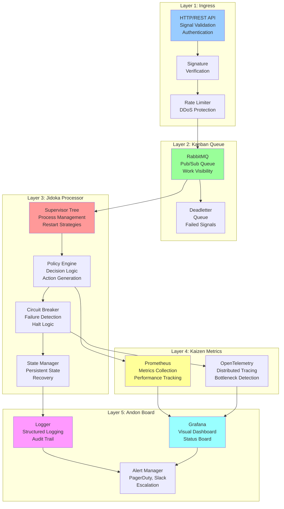

<!-- START doctoc generated TOC please keep comment here to allow auto update -->
<!-- DON'T EDIT THIS SECTION, INSTEAD RE-RUN doctoc TO UPDATE -->
**Table of Contents**

- [TPS Reference Architecture Blueprint](#tps-reference-architecture-blueprint)
  - [Executive Summary](#executive-summary)
  - [Architecture Overview: Signal Flow](#architecture-overview-signal-flow)
  - [Layer 1: Ingress (Signal Reception & Validation)](#layer-1-ingress-signal-reception--validation)
    - [Purpose](#purpose)
    - [Components](#components)
      - [1A: HTTP API (Cowboy)](#1a-http-api-cowboy)
      - [1B: Signature Verification](#1b-signature-verification)
      - [1C: Rate Limiting (Throttle)](#1c-rate-limiting-throttle)
    - [Files & Structure](#files--structure)
  - [Layer 2: Kanban Queue (Work Visibility & Distribution)](#layer-2-kanban-queue-work-visibility--distribution)
    - [Purpose](#purpose-1)
    - [Components](#components-1)
      - [2A: Work Queue (RabbitMQ)](#2a-work-queue-rabbitmq)
      - [2B: Deadletter Queue (Failed Signals)](#2b-deadletter-queue-failed-signals)
    - [Files & Structure](#files--structure-1)
  - [Layer 3: Jidoka Processor (Autonomic Decision-Making)](#layer-3-jidoka-processor-autonomic-decision-making)
    - [Purpose](#purpose-2)
    - [Components](#components-2)
      - [3A: Policy Engine (gen_statem)](#3a-policy-engine-gen_statem)
      - [3B: Circuit Breaker (Jidoka)](#3b-circuit-breaker-jidoka)
      - [3C: State Manager (Persistent)](#3c-state-manager-persistent)
    - [Files & Structure](#files--structure-2)
  - [Layer 4: Kaizen Metrics (Measurement & Improvement)](#layer-4-kaizen-metrics-measurement--improvement)
    - [Purpose](#purpose-3)
    - [Components](#components-3)
      - [4A: Metrics Collection (Prometheus)](#4a-metrics-collection-prometheus)
      - [4B: Distributed Tracing (OpenTelemetry)](#4b-distributed-tracing-opentelemetry)
    - [Files & Structure](#files--structure-3)
  - [Layer 5: Andon Board (Alerting & Visibility)](#layer-5-andon-board-alerting--visibility)
    - [Purpose](#purpose-4)
    - [Components](#components-4)
      - [5A: Receipt Emission (Proof)](#5a-receipt-emission-proof)
      - [5B: Structured Logging (Audit Trail)](#5b-structured-logging-audit-trail)
      - [5C: Alert Routing (PagerDuty, Slack)](#5c-alert-routing-pagerduty-slack)
      - [5D: Grafana Dashboard Integration](#5d-grafana-dashboard-integration)
    - [Files & Structure](#files--structure-4)
  - [Complete System Supervisor Hierarchy](#complete-system-supervisor-hierarchy)
  - [Example Configurations](#example-configurations)
    - [Configuration 1: Development (Local, In-Memory)](#configuration-1-development-local-in-memory)
    - [Configuration 2: Staging (Distributed, Durable)](#configuration-2-staging-distributed-durable)
    - [Configuration 3: Production (HA, FedRAMP-Compliant)](#configuration-3-production-ha-fedramp-compliant)
  - [File Organization](#file-organization)
  - [Cross-References](#cross-references)

<!-- END doctoc generated TOC please keep comment here to allow auto update -->

# TPS Reference Architecture Blueprint

**Version**: 1.0.0 (Production-Ready)
**Classification**: UNCLASSIFIED//FOR OFFICIAL USE ONLY
**Date**: January 2026
**Owner**: TAI 2030 Architecture Team
**Last Updated**: 2026-01-25

---

## Executive Summary

This document provides a **5-layer reference architecture** for TAI 2030 autonomic systems using Erlang/OTP and TPS principles. Each layer maps to a specific TPS principle and includes:

- Layer 1: **Ingress** — Signal entry and validation (Andon)
- Layer 2: **Kanban Queue** — Work distribution and visibility (Kanban)
- Layer 3: **Jidoka Processor** — Autonomous decision-making with failure detection (Jidoka)
- Layer 4: **Kaizen Metrics** — Continuous measurement and improvement (Kaizen)
- Layer 5: **Andon Board** — Real-time alerting and dashboards (Andon)

**Architecture Diagram**:



---

## Architecture Overview: Signal Flow

**Every signal follows this deterministic path**:

```
1. Ingress:
   HTTP API receives signal
   ↓
   Signature verification (cryptographic proof)
   ↓
   Rate limiting check (Heijunka: prevent overload)

2. Kanban Queue:
   Enqueued in RabbitMQ (visible work)
   ↓
   Signal buffered until processor ready (JIT: backpressure)

3. Jidoka Processor:
   Pulled by processor (pull-based, Kanban)
   ↓
   Policy engine evaluates (autonomous decision)
   ↓
   Action generated (remediation, governance, change management)
   ↓
   Action executed (may fail, triggers circuit breaker)

4. Kaizen Metrics:
   Duration tracked (latency metric)
   ↓
   Success/failure recorded (error rate)
   ↓
   Bottleneck identified if slow (80/20 analysis)

5. Andon Board:
   Receipt emitted (cryptographic proof)
   ↓
   Logged to audit trail (immutable history)
   ↓
   Metrics updated (Prometheus)
   ↓
   Traces recorded (OpenTelemetry)
   ↓
   Alert triggered if critical (PagerDuty)
   ↓
   Dashboard updated (Grafana, real-time visibility)

END: Action complete, operator sees proof
```

---

## Layer 1: Ingress (Signal Reception & Validation)

### Purpose
- **Validate signal authenticity** (signature verification)
- **Prevent DDoS/overload** (rate limiting, JIT backpressure)
- **Convert HTTP to internal format** (API gateway)

### Components

#### 1A: HTTP API (Cowboy)

```erlang
-module(ingress_api).
-behavior(gen_server).

%% Cowboy REST handler
-export([init/2]).

init(Req0, State) ->
    Req1 = cowboy_req:set_resp_header(<<"content-type">>, <<"application/json">>, Req0),

    %% Extract signal from request
    {ok, Body, Req2} = cowboy_req:read_body(Req1),
    Signal = jsx:decode(Body),

    %% Validate signature (cryptographic proof)
    case verify_signature(Signal, Req2) of
        {ok, Signature} ->
            %% Rate limit check (DDoS protection)
            case throttle:ask(api_rate_limit, 1) of
                ok ->
                    %% Enqueue to Kanban (Layer 2)
                    case enqueue_signal(Signal) of
                        ok ->
                            Response = #{
                                <<"status">> => <<"accepted">>,
                                <<"signal_id">> => maps:get(<<"id">>, Signal)
                            },
                            Req3 = cowboy_req:set_resp_header(<<"x-signal-id">>, Response, Req2),
                            {ok, Req3#http_req{status=202}, State};

                        {error, Reason} ->
                            error_response(500, Reason, Req2, State)
                    end;

                {error, rate_limited} ->
                    error_response(429, "Rate limit exceeded", Req2, State)
            end;

        {error, invalid_signature} ->
            error_response(401, "Invalid signature", Req2, State)
    end.
```

#### 1B: Signature Verification

```erlang
-module(signature_verifier).

-spec verify_signature(map(), cowboy_req:req()) -> {ok, binary()} | {error, atom()}.
verify_signature(Signal, Req) ->
    %% Extract signature from header
    Signature = cowboy_req:header(<<"x-signature">>, Req),
    Body = maps:get(<<"body">>, Signal),

    %% Verify HMAC-SHA256
    ExpectedSig = crypto:hmac(sha256, get_api_secret(), Body),

    case crypto:constant_time_compare(Signature, ExpectedSig) of
        true -> {ok, Signature};
        false -> {error, invalid_signature}
    end.

-spec get_api_secret() -> binary().
get_api_secret() ->
    os:getenv("TAI2030_API_SECRET", <<"default_secret">>).
```

#### 1C: Rate Limiting (Throttle)

```erlang
%% Token bucket: 1000 signals per second
-spec init_rate_limit() -> ok.
init_rate_limit() ->
    throttle:rate(
        api_rate_limit,
        1000,  %% 1000 tokens
        1000   %% per 1000ms (1 second)
    ).

%% Check capacity
-spec check_capacity() -> ok | {error, rate_limited}.
check_capacity() ->
    case throttle:ask(api_rate_limit, 1) of
        ok -> ok;
        {error, {limited, _WaitMs}} -> {error, rate_limited}
    end.
```

### Files & Structure

```
Layer 1: Ingress
├── ingress_api.erl          %% HTTP API handler
├── signature_verifier.erl   %% Cryptographic signature verification
├── rate_limiter.erl         %% DDoS/overload prevention
└── ingress_sup.erl          %% Layer 1 supervisor
```

---

## Layer 2: Kanban Queue (Work Visibility & Distribution)

### Purpose
- **Make all work visible** (queue as Kanban board)
- **Implement backpressure** (JIT: don't overload processor)
- **Fair distribution** (all signals get processed)
- **Deadletter handling** (failed signals captured)

### Components

#### 2A: Work Queue (RabbitMQ)

```erlang
-module(kanban_queue).
-behavior(gen_server).

-record(state, {
    connection,
    channel,
    queue_name = <<"tai2030.signals">>,
    prefetch = 10  %% JIT: only pull 10 at a time
}).

init([]) ->
    {ok, Connection} = amqp_connection:start(
        #amqp_params_network{host = "localhost"}
    ),
    {ok, Channel} = amqp_connection:open_channel(Connection),

    %% Declare queue (durable, persistent)
    amqp_channel:call(Channel, #'queue.declare'{
        queue = <<"tai2030.signals">>,
        durable = true,
        auto_delete = false
    }),

    %% Set prefetch (JIT backpressure)
    amqp_channel:call(Channel, #'basic.qos'{prefetch_count = 10}),

    %% Subscribe to queue
    amqp_channel:subscribe(Channel, #'basic.consume'{
        queue = <<"tai2030.signals">>,
        no_ack = false
    }, self()),

    {ok, #state{connection = Connection, channel = Channel}}.

%% Enqueue signal (from Layer 1)
handle_cast({enqueue, Signal}, #state{channel = Ch, queue_name = Q} = State) ->
    Payload = jsx:encode(Signal),

    amqp_channel:call(Ch, #'basic.publish'{
        exchange = <<"">>,
        routing_key = Q
    }, #amqp_msg{payload = Payload}),

    {noreply, State};

%% Receive from queue (pulled by Layer 3 processor)
handle_info({#'basic.deliver'{delivery_tag = Tag}, Msg}, #state{channel = Ch} = State) ->
    Signal = jsx:decode(Msg#amqp_msg.payload),

    %% Send to processor
    processor:process_signal(Signal, Tag),

    {noreply, State}.

%% Acknowledge success (processor calls this)
handle_cast({ack, DeliveryTag}, #state{channel = Ch} = State) ->
    amqp_channel:call(Ch, #'basic.ack'{delivery_tag = DeliveryTag}),
    {noreply, State};

%% Negative acknowledge (failure, requeue)
handle_cast({nack, DeliveryTag}, #state{channel = Ch} = State) ->
    amqp_channel:call(Ch, #'basic.nack'{
        delivery_tag = DeliveryTag,
        requeue = true
    }),
    {noreply, State}.
```

#### 2B: Deadletter Queue (Failed Signals)

```erlang
-module(deadletter_queue).

-spec init() -> ok.
init() ->
    %% Main queue with deadletter exchange
    amqp_channel:call(Channel, #'queue.declare'{
        queue = <<"tai2030.signals">>,
        arguments = [{
            <<"x-dead-letter-exchange">>,
            longstr,
            <<"tai2030.signals.deadletter">>
        }]
    }),

    %% Deadletter exchange + queue
    amqp_channel:call(Channel, #'exchange.declare'{
        exchange = <<"tai2030.signals.deadletter">>,
        type = <<"direct">>
    }),

    amqp_channel:call(Channel, #'queue.declare'{
        queue = <<"tai2030.signals.deadletter">>,
        durable = true
    }),

    amqp_channel:call(Channel, #'queue.bind'{
        queue = <<"tai2030.signals.deadletter">>,
        exchange = <<"tai2030.signals.deadletter">>
    }).

%% Process deadletter (human review)
-spec process_deadletter(Signal :: map()) -> ok.
process_deadletter(Signal) ->
    emit_receipt(deadletter_signal, #{
        signal => Signal,
        timestamp => erlang:system_time(millisecond),
        action_required => true
    }),

    %% Alert operator
    AlertManager:critical_alert(<<"Signal failed to process: ~w">>, [Signal]).
```

### Files & Structure

```
Layer 2: Kanban Queue
├── kanban_queue.erl        %% RabbitMQ integration
├── deadletter_queue.erl    %% Failed signal handling
└── kanban_sup.erl          %% Layer 2 supervisor
```

---

## Layer 3: Jidoka Processor (Autonomic Decision-Making)

### Purpose
- **Receive signals** (pull from Kanban queue)
- **Evaluate policies** (deterministic FSM)
- **Generate actions** (autonomic governance decisions)
- **Handle failures** (circuit breaker, halt)
- **Maintain state** (persistent recovery)

### Components

#### 3A: Policy Engine (gen_statem)

```erlang
-module(policy_engine).
-behavior(gen_statem).

callback_mode() -> handle_event_function.

-record(data, {
    sku_id :: binary(),
    tenant_id :: binary(),
    state_name = boot :: atom(),
    in_flight_action = undefined,
    entitlement_status = inactive,
    last_signal_time = 0,
    quota_remaining = 1000
}).

init({SkuId, TenantId}) ->
    Data = #data{sku_id = SkuId, tenant_id = TenantId},
    %% Boot: wait for entitlement (30 second timeout)
    {ok, boot, Data, [{state_timeout, 30000, entitlement_timeout}]}.

%% Boot: waiting for entitlement
handle_event(state_timeout, entitlement_timeout, boot, Data) ->
    emit_receipt(bootstrap_timeout, #{
        sku_id => Data#data.sku_id,
        action => escalate_to_degraded
    }),
    {next_state, degraded, Data};

handle_event(cast, {signal, entitlement_active}, boot, Data) ->
    {next_state, stable, Data#data{entitlement_status = active}};

%% Stable: normal operation, process signals
handle_event(cast, {signal, Signal}, stable, #data{quota_remaining = Q} = Data) when Q > 0 ->
    case evaluate_policy(Signal) of
        {ok, Action} ->
            emit_receipt(action_generated, Action),
            {next_state, action_pending, Data#data{
                in_flight_action = Action,
                quota_remaining = Q - 1
            }};

        {policy_denied, Reason} ->
            emit_receipt(policy_denied, Reason),
            {next_state, stable, Data}
    end;

%% Stable: quota exceeded
handle_event(cast, {signal, _Signal}, stable, #data{quota_remaining = 0} = Data) ->
    emit_andon_signal(quota_exceeded),
    {next_state, quota_exhausted, Data};

%% Action Pending: executing action
handle_event(cast, {signal, Signal}, action_pending, Data) ->
    %% Queue next signal
    queue_signal(Signal),
    {next_state, action_pending, Data};

handle_event(cast, {action_result, ok}, action_pending, Data) ->
    emit_receipt(action_successful, Data#data.in_flight_action),
    {next_state, stable, Data#data{in_flight_action = undefined}};

handle_event(cast, {action_result, {error, Reason}}, action_pending, Data) ->
    %% Action failed: check circuit breaker
    case should_halt(Reason) of
        true ->
            emit_andon_signal(circuit_open),
            {next_state, halted, Data};
        false ->
            {next_state, stable, Data#data{in_flight_action = undefined}}
    end;

%% Degraded: entitlement lost, minimal processing
handle_event(cast, {signal, Signal}, degraded, Data) ->
    case is_critical(Signal) of
        true ->
            %% Process only critical signals in degraded mode
            evaluate_and_execute(Signal, Data);
        false ->
            {next_state, degraded, Data}
    end;

%% Halted: explicit failure halt, no further processing
handle_event(cast, {signal, _Signal}, halted, Data) ->
    emit_andon_signal(system_halted),
    {next_state, halted, Data};

%% Manual halt override
handle_event(cast, {halt_immediate, Reason}, _State, Data) ->
    emit_receipt(jidoka_halt, #{reason => Reason}),
    {next_state, halted, Data}.
```

#### 3B: Circuit Breaker (Jidoka)

```erlang
-module(jidoka_breaker).
-behavior(gen_server).

-record(state, {
    failure_count = 0,
    max_failures = 5,
    status = healthy,  %% healthy | degraded | halted
    reset_timeout = 60000
}).

init([]) ->
    {ok, #state{}, [{next_event, internal, check_health}]}.

handle_cast({failure, _Reason}, #state{failure_count = F, max_failures = M} = State)
    when F + 1 >= M ->
    %% Threshold exceeded: halt immediately (Jidoka)
    emit_andon_signal(circuit_open),
    emit_receipt(jidoka_halt, #{
        failure_count => F + 1,
        status => circuit_open
    }),
    {noreply, State#state{
        status = halted,
        failure_count = F + 1
    }};

handle_cast({failure, _Reason}, #state{failure_count = F} = State) ->
    %% Below threshold: track and continue
    {noreply, State#state{failure_count = F + 1}};

handle_cast({success}, State) ->
    %% Reset on success
    {noreply, State#state{failure_count = 0}};

handle_info(reset_timer, #state{status = halted} = State) ->
    %% Attempt recovery (half-open state)
    {noreply, State#state{status = testing}}.
```

#### 3C: State Manager (Persistent)

```erlang
-module(state_manager).
-behavior(gen_server).

-record(state, {
    backend = firestore,  %% Persistence backend
    sku_id,
    tenant_id
}).

init([SkuId, TenantId, Backend]) ->
    {ok, #state{
        backend = Backend,
        sku_id = SkuId,
        tenant_id = TenantId
    }}.

%% Save state to persistent store
handle_call({save, StateData}, _From, #state{backend = firestore} = State) ->
    Doc = format_state_doc(StateData),
    firestore:set(
        <<"projects/tai2030/databases/(default)/documents/governors/">>,
        State#state.sku_id,
        Doc
    ),
    {reply, ok, State};

%% Restore state from persistent store
handle_call({restore}, _From, #state{backend = firestore} = State) ->
    case firestore:get(
        <<"projects/tai2030/databases/(default)/documents/governors/">>,
        State#state.sku_id
    ) of
        {ok, Doc} -> {reply, {ok, parse_state_doc(Doc)}, State};
        {error, not_found} -> {reply, {error, not_found}, State}
    end.
```

### Files & Structure

```
Layer 3: Jidoka Processor
├── policy_engine.erl       %% Autonomic decision FSM (gen_statem)
├── jidoka_breaker.erl      %% Failure detection and halting
├── state_manager.erl       %% Persistent state recovery
├── processor_sup.erl       %% Layer 3 supervisor
└── policies/
    ├── cost_governance.erl
    ├── permission_drift.erl
    ├── change_management.erl
    └── compliance_audit.erl
```

---

## Layer 4: Kaizen Metrics (Measurement & Improvement)

### Purpose
- **Collect performance metrics** (latency, success rate, resource usage)
- **Identify bottlenecks** (80/20 analysis)
- **Track improvements** (baseline vs current)
- **Emit traces** (distributed observability)

### Components

#### 4A: Metrics Collection (Prometheus)

```erlang
-module(kaizen_metrics).

-spec init() -> ok.
init() ->
    %% Signal processing latency
    prometheus_histogram:new([
        {name, signal_processing_latency_us},
        {help, "Signal processing duration in microseconds"},
        {buckets, [100, 500, 1000, 5000, 10000, 50000, 100000]}
    ]),

    %% Action success rate
    prometheus_counter:new([
        {name, actions_successful_total},
        {help, "Total successful actions"}
    ]),

    prometheus_counter:new([
        {name, actions_failed_total},
        {help, "Total failed actions"}
    ]),

    %% Resource utilization
    prometheus_gauge:new([
        {name, queue_depth},
        {help, "Current queue depth (WIP)"}
    ]),

    ok.

-spec observe_processing(fun()) -> {Result :: any(), Duration :: non_neg_integer()}.
observe_processing(Fun) ->
    StartTime = erlang:monotonic_time(microsecond),
    Result = Fun(),
    EndTime = erlang:monotonic_time(microsecond),
    Duration = EndTime - StartTime,

    prometheus_histogram:observe(signal_processing_latency_us, Duration),

    {Result, Duration}.

-spec record_success() -> ok.
record_success() ->
    prometheus_counter:inc(actions_successful_total).

-spec record_failure() -> ok.
record_failure() ->
    prometheus_counter:inc(actions_failed_total).
```

#### 4B: Distributed Tracing (OpenTelemetry)

```erlang
-module(kaizen_tracer).

-spec start_trace(binary(), map()) -> otel_span:span().
start_trace(OperationName, Attributes) ->
    Tracer = otel_tracer:get_tracer(?MODULE),
    otel_tracer:start_span(Tracer, OperationName, #{
        attributes => Attributes
    }).

-spec end_trace(otel_span:span(), map()) -> ok.
end_trace(Span, ResultAttributes) ->
    otel_span:set_attributes(Span, ResultAttributes),
    otel_span:end_span(Span),
    ok.

-spec trace_operation(binary(), fun()) -> any().
trace_operation(OpName, Fun) ->
    Span = start_trace(OpName, #{}),
    try
        Result = Fun(),
        end_trace(Span, #{<<"status">> => <<"success">>}),
        Result
    catch
        Error:Reason ->
            end_trace(Span, #{
                <<"error">> => true,
                <<"error.type">> => atom_to_binary(Error),
                <<"error.message">> => format_error(Reason)
            }),
            erlang:raise(Error, Reason, erlang:get_stacktrace())
    end.
```

### Files & Structure

```
Layer 4: Kaizen Metrics
├── kaizen_metrics.erl      %% Prometheus metrics
├── kaizen_tracer.erl       %% OpenTelemetry tracing
└── kaizen_sup.erl          %% Layer 4 supervisor
```

---

## Layer 5: Andon Board (Alerting & Visibility)

### Purpose
- **Log all actions** (immutable audit trail)
- **Generate receipts** (cryptographic proof)
- **Alert operators** (real-time status)
- **Display dashboards** (visual Andon board)

### Components

#### 5A: Receipt Emission (Proof)

```erlang
-module(receipt_emitter).

-record(receipt, {
    receipt_id :: binary(),
    action_id :: binary(),
    timestamp :: integer(),
    state_before :: binary(),
    state_after :: binary(),
    success :: boolean(),
    hash :: binary(),
    signature :: binary()
}).

-spec emit_receipt(atom(), map()) -> ok.
emit_receipt(ReceiptType, Context) ->
    ReceiptId = generate_receipt_id(),
    Timestamp = erlang:system_time(millisecond),

    Receipt = #receipt{
        receipt_id = ReceiptId,
        action_id = maps:get(<<"action_id">>, Context, undefined),
        timestamp = Timestamp,
        state_before = maps:get(<<"state_before">>, Context, undefined),
        state_after = maps:get(<<"state_after">>, Context, undefined),
        success = maps:get(<<"success">>, Context, true),
        hash = compute_hash(Context),
        signature = sign_receipt(Context)
    },

    %% Emit to logger
    logger:info("RECEIPT", format_receipt(Receipt)),

    %% Store in immutable ledger (Firestore)
    store_receipt(Receipt),

    ok.

generate_receipt_id() ->
    Now = erlang:system_time(millisecond),
    binary:encode_unsigned(Now) <> binary:encode_unsigned(rand:uniform(1000000)).

compute_hash(Context) ->
    Payload = jsx:encode(Context),
    crypto:hash(sha256, Payload).

sign_receipt(Context) ->
    Payload = jsx:encode(Context),
    Secret = os:getenv("TAI2030_SIGNING_KEY", <<"default">>),
    crypto:hmac(sha256, Secret, Payload).
```

#### 5B: Structured Logging (Audit Trail)

```erlang
-module(audit_logger).

-spec log_action(binary(), map()) -> ok.
log_action(ActionType, Details) ->
    logger:info("ACTION_AUDIT", #{
        action_type => ActionType,
        details => Details,
        timestamp => erlang:system_time(millisecond),
        source => get_source(),
        user => get_current_user()
    }).

get_source() -> <<"tai2030:autonomic_controller">>.

get_current_user() -> <<"system">>.
```

#### 5C: Alert Routing (PagerDuty, Slack)

```erlang
-module(alert_router).

-spec alert(atom(), binary(), map()) -> ok.
alert(Severity, Message, Context) ->
    Channels = get_alert_channels(Severity),

    lists:foreach(fun(Channel) ->
        route_alert(Channel, Severity, Message, Context)
    end, Channels).

get_alert_channels(critical) ->
    [pagerduty, slack, email, sms];

get_alert_channels(warning) ->
    [slack, email, logger];

get_alert_channels(info) ->
    [logger].

route_alert(pagerduty, Severity, Message, _Context) ->
    send_pagerduty(Severity, Message);

route_alert(slack, _Severity, Message, _Context) ->
    send_slack(Message);

route_alert(email, _Severity, Message, _Context) ->
    send_email(Message);

route_alert(logger, _Severity, Message, _Context) ->
    logger:alert(Message).
```

#### 5D: Grafana Dashboard Integration

```erlang
-module(dashboard_exporter).

%% Export metrics for Grafana scraping
-spec export_metrics() -> binary().
export_metrics() ->
    %% Prometheus format
    Metrics = [
        format_histogram(signal_processing_latency_us),
        format_counter(actions_successful_total),
        format_counter(actions_failed_total),
        format_gauge(queue_depth),
        format_gauge(system_status)
    ],

    iolist_to_binary(Metrics).

format_histogram(Name) ->
    Values = prometheus_histogram:value(Name),
    io_lib:format(
        "# HELP ~s Signal processing latency~n"
        "# TYPE ~s histogram~n"
        "~s_bucket{le=\"+Inf\"} ~w~n",
        [Name, Name, Name, Values]
    ).
```

### Files & Structure

```
Layer 5: Andon Board
├── receipt_emitter.erl     %% Cryptographic receipt generation
├── audit_logger.erl        %% Immutable action logging
├── alert_router.erl        %% Alert routing (PagerDuty, Slack)
├── dashboard_exporter.erl  %% Prometheus metrics export
└── andon_sup.erl           %% Layer 5 supervisor
```

---

## Complete System Supervisor Hierarchy

```erlang
-module(tai2030_sup).
-behavior(supervisor).

init([]) ->
    SupFlags = #{
        strategy => rest_for_one,      %% One layer fails → all downstream restart
        intensity => 5,
        period => 60
    },

    ChildSpecs = [
        %% Layer 1: Ingress
        #{
            id => ingress_sup,
            start => {ingress_sup, start_link, []},
            type => supervisor
        },

        %% Layer 2: Kanban Queue
        #{
            id => kanban_sup,
            start => {kanban_sup, start_link, []},
            type => supervisor
        },

        %% Layer 3: Jidoka Processor
        #{
            id => processor_sup,
            start => {processor_sup, start_link, []},
            type => supervisor
        },

        %% Layer 4: Kaizen Metrics
        #{
            id => kaizen_sup,
            start => {kaizen_sup, start_link, []},
            type => supervisor
        },

        %% Layer 5: Andon Board
        #{
            id => andon_sup,
            start => {andon_sup, start_link, []},
            type => supervisor
        }
    ],

    {ok, {SupFlags, ChildSpecs}}.
```

---

## Example Configurations

### Configuration 1: Development (Local, In-Memory)

**File**: `config/dev.config`

```erlang
[
  {rabbitmq, [
    {hosts, ["localhost:5672"]},
    {prefetch, 10},
    {durable, false}  %% Don't persist in dev
  ]},

  {prometheus, [
    {scrape_interval_ms, 5000},
    {export_port, 9090}
  ]},

  {opentelemetry, [
    {tracer_provider, #{
      processors => [
        {otel_simple_processor, []}  %% Log traces locally
      ]
    }}
  ]},

  {logger, [
    {handlers, [
      {default, logger_std_h, #{
        level => debug,
        formatter => {logger_formatter, #{template => [time, " ", level, " ", msg, "\n"]}}
      }}
    ]}
  ]}
].
```

### Configuration 2: Staging (Distributed, Durable)

**File**: `config/staging.config`

```erlang
[
  {rabbitmq, [
    {hosts, ["rabbitmq-staging-1:5672", "rabbitmq-staging-2:5672"]},
    {prefetch, 50},
    {durable, true},
    {persistence, disk}
  ]},

  {prometheus, [
    {scrape_interval_ms, 30000},
    {export_port, 9090},
    {remote_write_url, "http://prometheus-staging:9090/api/v1/write"}
  ]},

  {opentelemetry, [
    {tracer_provider, #{
      processors => [
        {otel_batch_processor, #{
          exporter => {otel_exporter_trace, #{endpoints => ["http://jaeger-staging:14268"]}}
        }}
      ]
    }}
  ]},

  {logger, [
    {handlers, [
      {default, logger_std_h, #{
        level => info,
        formatter => {logger_formatter, #{template => [time, " ", level, " ", msg, "\n"]}}
      }},
      {file, logger_disk_log_h, #{
        config => #{
          file => "/var/log/tai2030/staging.log",
          type => wrap,
          max_no_bytes => 104857600,  %% 100MB
          max_no_files => 10
        }
      }},
      {syslog, logger_syslog_h, #{
        config => #{
          facility => local0,
          app_name => "tai2030"
        }
      }}
    ]}
  ]}
].
```

### Configuration 3: Production (HA, FedRAMP-Compliant)

**File**: `config/prod.config`

```erlang
[
  {rabbitmq, [
    {hosts, [
      "rabbitmq-prod-1:5672",
      "rabbitmq-prod-2:5672",
      "rabbitmq-prod-3:5672"
    ]},
    {prefetch, 100},
    {durable, true},
    {persistence, disk_and_memory},
    {ha, #{
      policy => <<"HA_PROD">>,
      max_replicas => 3
    }}
  ]},

  {prometheus, [
    {scrape_interval_ms, 60000},
    {export_port, 9090},
    {retention_days, 365},
    {remote_write_url, "https://prometheus-prod.internal:9090/api/v1/write"},
    {remote_write_tls, #{
      cert_file => "/etc/tai2030/certs/prometheus.crt",
      key_file => "/etc/tai2030/certs/prometheus.key",
      ca_file => "/etc/tai2030/certs/ca.crt"
    }}
  ]},

  {opentelemetry, [
    {tracer_provider, #{
      processors => [
        {otel_batch_processor, #{
          exporter => {otel_exporter_trace, #{
            endpoints => [
              "https://jaeger-prod-1:14250",
              "https://jaeger-prod-2:14250",
              "https://jaeger-prod-3:14250"
            ],
            tls => #{
              ca_file => "/etc/tai2030/certs/ca.crt"
            }
          }},
          batch_size => 512,
          max_queue_size => 2048,
          timeout_ms => 30000
        }}
      ]
    }}
  ]},

  {logger, [
    {handlers, [
      {default, logger_std_h, #{
        level => warning,
        formatter => {logger_formatter, #{
          template => [
            "[", time, "] ",
            {green, level}, " ",
            {cyan, mfa}, " ",
            msg, "\n"
          ]
        }}
      }},
      {syslog, logger_syslog_h, #{
        config => #{
          facility => local0,
          app_name => "tai2030_prod"
        }
      }},
      {audit_file, logger_disk_log_h, #{
        config => #{
          file => "/var/log/tai2030/audit.log",
          type => wrap,
          max_no_bytes => 536870912,  %% 500MB
          max_no_files => 365
        }
      }},
      {tls_validator, logger_disk_log_h, #{
        config => #{
          file => "/var/log/tai2030/tls_validation.log"
        }
      }}
    ]}
  ]},

  {ssl, [
    {versions, ['tlsv1.3', 'tlsv1.2']},
    {ciphers, [
      {ecdhe_ecdsa, aes_256_gcm, null, sha384},
      {ecdhe_rsa, aes_256_gcm, null, sha384},
      {ecdhe_ecdsa, aes_128_gcm, null, sha256},
      {ecdhe_rsa, aes_128_gcm, null, sha256}
    ]},
    {honor_cipher_order, true},
    {honor_ecc_order, true}
  ]}
].
```

---

## File Organization

```
tai2030-autonomic/
├── src/
│   ├── layers/
│   │   ├── layer1_ingress/
│   │   │   ├── ingress_api.erl
│   │   │   ├── signature_verifier.erl
│   │   │   └── ingress_sup.erl
│   │   ├── layer2_kanban/
│   │   │   ├── kanban_queue.erl
│   │   │   ├── deadletter_queue.erl
│   │   │   └── kanban_sup.erl
│   │   ├── layer3_jidoka/
│   │   │   ├── policy_engine.erl
│   │   │   ├── jidoka_breaker.erl
│   │   │   ├── state_manager.erl
│   │   │   └── processor_sup.erl
│   │   ├── layer4_kaizen/
│   │   │   ├── kaizen_metrics.erl
│   │   │   ├── kaizen_tracer.erl
│   │   │   └── kaizen_sup.erl
│   │   └── layer5_andon/
│   │       ├── receipt_emitter.erl
│   │       ├── audit_logger.erl
│   │       ├── alert_router.erl
│   │       ├── dashboard_exporter.erl
│   │       └── andon_sup.erl
│   └── tai2030_sup.erl           %% Root supervisor
├── config/
│   ├── dev.config
│   ├── staging.config
│   └── prod.config
├── priv/
│   └── dashboard.json            %% Grafana dashboard JSON
└── rebar.config
```

---

## Cross-References

- **See [00-tps-principles.md](00-tps-principles.md)** for conceptual foundation of each layer
- **See [01-library-catalog.md](01-library-catalog.md)** for library details and alternatives
- **See [03-implementation-roadmap.md](03-implementation-roadmap.md)** for phased rollout
- **See [/docs/30-autonomics/gen_statem-patterns.md](/docs/30-autonomics/gen_statem-patterns.md)** for policy engine FSM details
- **See [/docs/00-overview/glossary.md](/docs/00-overview/glossary.md)** for terminology

---

**Document Status**: ✅ Complete
**Last Updated**: 2026-01-25
**Owner**: TAI 2030 Architecture Team
**Next Review**: 2026-02-15
