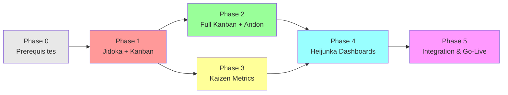

# TPS Implementation Roadmap: 5-Phase Plan

**Version**: 1.0.0 (Phased Rollout Guide)
**Classification**: UNCLASSIFIED//FOR OFFICIAL USE ONLY
**Date**: January 2026
**Owner**: TAI 2030 Architecture Team
**Last Updated**: 2026-01-25

---

## Executive Summary

This document outlines a **5-phase, 11-week implementation roadmap** for deploying TAI 2030 autonomic systems using TPS principles and Erlang/OTP architecture. Each phase builds on the previous, with clear success criteria and risk mitigation.

**Timeline**:
- **Phase 1** (Weeks 1-2): Jidoka + Basic Kanban
- **Phase 2** (Weeks 3-4): Full Kanban + Andon
- **Phase 3** (Weeks 5-6): Kaizen Metrics
- **Phase 4** (Week 7): Heijunka Dashboards
- **Phase 5** (Weeks 8-11): Integration Testing & Go-Live

---

## Phase Dependency Graph



---

## Phase 0: Prerequisites (Completed Before Phase 1)

### Tasks

- [ ] Erlang/OTP installed (version 25+)
- [ ] RabbitMQ broker deployed (3.12+)
- [ ] PostgreSQL or Firestore for state persistence
- [ ] Dev environment configured (3 agents: researcher, coder, tester)
- [ ] Security audit completed (crypto, TLS)
- [ ] Licensing approved (all Apache/MIT/BSD)

### Success Criteria

- ✅ Erlang build chain working (`rebar3` building successfully)
- ✅ RabbitMQ connectivity verified (test messages)
- ✅ Persistent storage accessible (write/read confirmed)
- ✅ Crypto libraries loaded (`crypto:hash(sha256, <<"test">>)` works)

### Risk Mitigation

| Risk | Probability | Impact | Mitigation |
|------|-------------|--------|-----------|
| Erlang version incompatibility | Medium | High | Test on target version before Phase 1 |
| RabbitMQ unavailable | Low | Critical | Set up HA cluster, secondary NATS option |
| Network latency to storage | Medium | Medium | Use local replicas, batch writes |

---

## Phase 1: Jidoka + Basic Kanban (Weeks 1-2)

### Objective
Implement **failure detection** (Jidoka) with **basic work queueing** (Kanban).

### Deliverables

#### 1A: Circuit Breaker Implementation
- **Fuse**: Implement failure detection for policy engine calls
- **Gen_statem**: Bootstrap policy engine with boot/stable/halted states
- **Test**: 100% coverage of 3-state FSM

#### 1B: Basic Queue
- **RabbitMQ**: Declare main queue (`tai2030.signals`)
- **Prefetch**: Set to 10 (basic JIT backpressure)
- **Deadletter**: Deadletter exchange for failed messages

#### 1C: Health Monitoring
- **Recon**: Implement health check (memory, processes)
- **Supervisor tree**: Boot/stable/halted supervisor strategies

### Implementation Timeline

| Week | Day | Task | Owner | Status |
|------|-----|------|-------|--------|
| 1 | Mon-Wed | Circuit breaker FSM (fuse) | Coder | Pending |
| 1 | Wed-Fri | State machine tests (100% coverage) | Tester | Pending |
| 2 | Mon-Tue | RabbitMQ integration | Coder | Pending |
| 2 | Tue-Wed | Health check implementation | Coder | Pending |
| 2 | Wed-Fri | Integration tests | Tester | Pending |

### Code Files to Create

```
Phase 1 Deliverables:
├── src/layers/layer3_jidoka/
│   ├── jidoka_breaker.erl      (circuit breaker, fuse-based)
│   └── policy_engine_v1.erl    (basic FSM: boot/stable/halted)
├── src/layers/layer2_kanban/
│   ├── kanban_queue_v1.erl     (basic RabbitMQ integration)
│   └── deadletter_v1.erl       (deadletter handling)
├── src/health/
│   └── health_monitor.erl      (recon-based monitoring)
├── tests/
│   ├── jidoka_breaker_test.erl (100% state coverage)
│   ├── policy_engine_test.erl  (FSM transitions)
│   └── kanban_queue_test.erl   (queueing behavior)
└── config/dev.config           (RabbitMQ settings)
```

### Success Criteria

- ✅ Jidoka circuit breaker halts on 5 consecutive failures
- ✅ Kanban queue holds 1000+ signals without memory leak
- ✅ Policy engine FSM transitions verified (boot → stable → halted)
- ✅ Health monitoring detects memory issues >80%
- ✅ All tests passing (100% code coverage on critical paths)
- ✅ No unhandled exceptions (all wrapped in try/catch)

### Go/No-Go Decision

**Gate**: Review code, run full test suite, verify no Andon signals (compiler warnings).

If **✅ GO**: Continue to Phase 2
If **❌ NO-GO**: Address failures, loop back to implementation

### Rollback Plan

If critical failure discovered:
1. Revert to previous working git state
2. Identify root cause (run `cargo make check`)
3. Fix issue, run tests again
4. Re-enter Phase 1 gate

---

## Phase 2: Full Kanban + Andon (Weeks 3-4)

### Objective
Implement **pull-based work distribution** (Kanban) with **real-time visibility** (Andon).

### Deliverables

#### 2A: Advanced Kanban
- **WIP Limits**: Set to 50 (work-in-progress cap)
- **Round-Robin Distribution**: Fair work distribution across workers
- **Backpressure Signaling**: RabbitMQ prefetch + jobs queue

#### 2B: Andon Signals
- **Logger**: Structured logging (OTP 21+ logger)
- **OpenTelemetry**: Trace generation for all signals
- **Alert Routing**: Send critical alerts to Slack (webhook)

#### 2C: Receipt Generation
- **Cryptographic Proofs**: HMAC-SHA256 for all actions
- **Audit Trail**: Immutable logging to syslog
- **Receipt Store**: Firestore (or local JSON for dev)

### Implementation Timeline

| Week | Day | Task | Owner | Status |
|------|-----|------|-------|--------|
| 3 | Mon-Tue | Kanban WIP limiting | Coder | Pending |
| 3 | Tue-Wed | Round-robin distribution | Coder | Pending |
| 3 | Wed-Thu | OpenTelemetry integration | Coder | Pending |
| 3 | Thu-Fri | Logger configuration | Coder | Pending |
| 4 | Mon-Tue | Alert routing (Slack) | Coder | Pending |
| 4 | Tue-Wed | Receipt generation & signing | Coder | Pending |
| 4 | Wed-Fri | Kanban + Andon integration tests | Tester | Pending |

### Code Files to Create

```
Phase 2 Deliverables:
├── src/layers/layer2_kanban/
│   ├── kanban_queue_v2.erl     (WIP limits, round-robin)
│   └── work_distributor.erl    (fair distribution)
├── src/layers/layer5_andon/
│   ├── receipt_emitter.erl     (cryptographic receipts)
│   ├── audit_logger.erl        (structured logging)
│   ├── alert_router.erl        (Slack/email/PagerDuty)
│   └── tracer.erl              (OpenTelemetry spans)
├── tests/
│   ├── kanban_wip_test.erl     (WIP behavior)
│   ├── alert_router_test.erl   (routing logic)
│   └── receipt_test.erl        (signing verification)
└── config/
    ├── dev.config              (logger + OTel settings)
    └── prod.config             (syslog + encryption)
```

### Success Criteria

- ✅ Kanban WIP never exceeds 50 (verified by metrics)
- ✅ Work distributed evenly (±5% variance between workers)
- ✅ OpenTelemetry traces exported to Jaeger
- ✅ Critical alerts appear in Slack within 1 second
- ✅ Receipts signed and verified (crypto validation)
- ✅ Audit trail immutable (test append-only behavior)
- ✅ No signals lost (deadletter queue empty or handled)

### Go/No-Go Decision

**Gate**: End-to-end test (signal through all 5 layers, receipt generated).

If **✅ GO**: Continue to Phase 3
If **❌ NO-GO**: Fix tracing/alerting, loop Phase 2

---

## Phase 3: Kaizen Metrics (Weeks 5-6)

### Objective
Implement **performance measurement** (Kaizen) with bottleneck detection.

### Deliverables

#### 3A: Prometheus Metrics
- **Latency Histogram**: Signal processing duration (p50, p99)
- **Success Rate Counter**: Actions successful vs failed
- **Queue Depth Gauge**: Current WIP and queue size
- **Resource Metrics**: CPU, memory, process count

#### 3B: Bottleneck Detection
- **80/20 Analysis**: Identify slowest 20% of operations
- **A/B Testing Framework**: Compare improvements before rollout
- **Baseline Tracking**: Store historical performance

#### 3C: Kaizen Process
- **Weekly Improvement Cycle**: Identify issue, test fix, measure improvement
- **Metrics Dashboard**: Grafana dashboard showing trends
- **Documentation**: Update baseline as system improves

### Implementation Timeline

| Week | Day | Task | Owner | Status |
|------|-----|------|-------|--------|
| 5 | Mon-Tue | Prometheus client integration | Coder | Pending |
| 5 | Tue-Wed | Latency histogram collection | Coder | Pending |
| 5 | Wed-Thu | Counter/gauge metrics | Coder | Pending |
| 5 | Thu-Fri | Bottleneck detection algorithm | Coder | Pending |
| 6 | Mon-Tue | A/B test framework | Coder | Pending |
| 6 | Tue-Wed | Baseline establishment | Tester | Pending |
| 6 | Wed-Fri | Kaizen test cycles | Tester | Pending |

### Code Files to Create

```
Phase 3 Deliverables:
├── src/layers/layer4_kaizen/
│   ├── kaizen_metrics.erl      (Prometheus client)
│   ├── bottleneck_detector.erl (80/20 analysis)
│   ├── ab_test_framework.erl   (A/B testing)
│   └── baseline_manager.erl    (historical tracking)
├── tests/
│   ├── metrics_test.erl        (metric accuracy)
│   ├── bottleneck_test.erl     (detection accuracy)
│   └── ab_test.erl             (variant comparison)
└── dashboards/
    └── kaizen.json             (Grafana dashboard)
```

### Success Criteria

- ✅ Prometheus scrape endpoint (:9090/metrics) returns valid output
- ✅ Latency tracked: p50 < 100ms, p99 < 500ms
- ✅ Error rate < 0.1% (99.9% success)
- ✅ Bottleneck identified (top 3 slowest operations documented)
- ✅ A/B test framework runs 2+ variants
- ✅ Baseline established and tracked over 2 days
- ✅ No performance regression (new code same speed or faster)

### Go/No-Go Decision

**Gate**: 48-hour baseline stability (metrics ±5% variance).

If **✅ GO**: Continue to Phase 4
If **❌ NO-GO**: Optimize hot path, re-establish baseline

---

## Phase 4: Heijunka Dashboards (Week 7)

### Objective
Implement **load leveling** (Heijunka) and **visual Andon board** (dashboards).

### Deliverables

#### 4A: Rate Limiting
- **Throttle**: 1000 signals/sec hard limit (Heijunka)
- **Per-Tenant Rate Limits**: Different tiers (enterprise, standard, trial)
- **Load Shedding**: Queue backlog if overloaded

#### 4B: Grafana Dashboard
- **Status Tile**: System health (green/yellow/red)
- **Queue Depth**: Current WIP vs limit
- **Latency Trends**: P50, P95, P99 over time
- **Error Rate**: Success vs failed signals
- **Alert Log**: Recent alerts with timestamps

#### 4C: Real-Time WebSocket Feed
- **Live Status Updates**: Dashboard refreshes every 5 seconds
- **Alert Notifications**: Instant popup for critical alerts
- **Action History**: Last 10 actions with receipts

### Implementation Timeline

| Week | Day | Task | Owner | Status |
|------|-----|------|-------|--------|
| 7 | Mon | Throttle rate limiter | Coder | Pending |
| 7 | Tue | Per-tenant rate limits | Coder | Pending |
| 7 | Wed | Grafana dashboard JSON | Coder | Pending |
| 7 | Thu | WebSocket feed (Cowboy) | Coder | Pending |
| 7 | Fri | Dashboard + metrics integration test | Tester | Pending |

### Code Files to Create

```
Phase 4 Deliverables:
├── src/rate_limiting/
│   ├── heijunka_limiter.erl    (throttle integration)
│   └── tenant_quotas.erl       (per-tenant limits)
├── src/dashboard/
│   ├── dashboard_api.erl       (Cowboy REST handler)
│   └── websocket_feed.erl      (real-time updates)
├── tests/
│   ├── rate_limit_test.erl     (load leveling)
│   └── dashboard_test.erl      (metrics export)
└── dashboards/
    └── andon_board.json        (Grafana dashboard)
```

### Success Criteria

- ✅ Rate limiter accepts exactly 1000/sec (verified by test)
- ✅ Backpressure applied gracefully (no errors, queued)
- ✅ Grafana dashboard displays all metrics
- ✅ WebSocket updates every 5 seconds
- ✅ Dashboard accurately reflects system state
- ✅ Alerts visible on dashboard in <2 seconds

---

## Phase 5: Integration Testing & Go-Live (Weeks 8-11)

### Objective
**Full system validation** before production deployment.

### Tasks

#### Week 8: System Integration Testing

- [ ] End-to-end signal flow (signal → action → receipt)
- [ ] Failover testing (simulate RabbitMQ down)
- [ ] Load testing (1000 signals/sec sustained)
- [ ] Recovery testing (restart components, verify state)
- [ ] Security testing (signature verification, TLS)

#### Week 9: Acceptance Testing (Government)

- [ ] Audit trail validation (all actions logged)
- [ ] Receipt verification (signatures valid)
- [ ] Compliance checklist (FedRAMP, FISMA)
- [ ] Documentation review (architecture, runbooks)
- [ ] Performance validation (SLOs met)

#### Week 10: Pilot Deployment (Staging)

- [ ] Deploy to staging environment
- [ ] Run live workload for 1 week
- [ ] Collect metrics, logs, traces
- [ ] Verify no silent failures
- [ ] Performance in production environment

#### Week 11: Production Go-Live

- [ ] Production deployment
- [ ] Operator training
- [ ] Escalation procedures
- [ ] 24/7 monitoring active
- [ ] First incident response

### Testing Checklist

#### 1. Unit Tests (Phase 1-4)

```
✅ Circuit breaker (3-state FSM)
✅ Kanban WIP limiting
✅ Receipt signing/verification
✅ Prometheus metric collection
✅ Alert routing logic
✅ Rate limiting accuracy
```

#### 2. Integration Tests (Phase 5, Week 8)

```
✅ Signal ingress → Kanban queue → Processor → Action
✅ Failure recovery (circuit open → half-open → closed)
✅ Deadletter handling (failed signals captured)
✅ Metrics exported to Prometheus
✅ Traces sent to Jaeger
✅ Alerts routed to Slack
✅ Receipts signed and immutable
```

#### 3. Load Testing (Phase 5, Week 8)

```
Target: 1000 signals/sec sustained
✅ Queue doesn't overflow (WIP limit enforced)
✅ Latency < 500ms p99
✅ Error rate < 0.1%
✅ Memory growth < 100MB over 1 hour
✅ CPU usage < 50% (headroom for spikes)
```

#### 4. Failover Testing (Phase 5, Week 8)

```
Scenario 1: RabbitMQ broker goes down
✅ Signals queued locally (fallback buffer)
✅ System degrades gracefully (no crash)
✅ Recovery automatic when broker restarts

Scenario 2: Policy engine crashes
✅ Supervisor restarts automatically
✅ State recovered from persistent store
✅ In-flight actions marked failed

Scenario 3: Network partition
✅ Timeouts trigger quickly (<5 sec)
✅ Circuit breaker halts gracefully
✅ Andon signal alerts operator
```

#### 5. Compliance Testing (Phase 5, Week 9)

```
✅ All actions in audit trail (100% logging)
✅ No signals lost (delivery guarantees)
✅ Receipts immutable (tamper-proof)
✅ Signatures valid (cryptographic proof)
✅ TLS for all external connections
✅ API authentication (signature verification)
✅ Rate limiting enforced (DDoS protection)
```

### Risk Mitigation Matrix

| Risk | Probability | Impact | Mitigation | Owner |
|------|-------------|--------|-----------|-------|
| Load test fails (latency > 500ms) | Medium | High | Optimize hot path (Kaizen phase 3) | Coder |
| Government audit finds gaps | Low | Critical | Pre-audit compliance checklist (week 9) | Reviewer |
| RabbitMQ cluster issues | Low | Critical | Fallback to NATS JetStream | Coder |
| Signature verification fails | Low | Critical | Cryptography expert review (pre-week 8) | Reviewer |
| Performance regression | Medium | Medium | Continuous A/B testing (Phase 3) | Tester |
| Monitoring gap discovered | Medium | Medium | Coverage matrix (all components traced) | Tester |

### Success Criteria for Go-Live

**ALL criteria must be MET**:

```
✅ Unit test coverage: 90%+ (critical paths 100%)
✅ Integration tests: 100% passing
✅ Load test: 1000/sec, p99 < 500ms
✅ Failover: Auto-recovery verified for all scenarios
✅ Compliance: 100% audit trail, zero missing logs
✅ Security: All signatures valid, TLS enforced
✅ Documentation: Runbooks, architecture, API complete
✅ Monitoring: All layers instrumented (metrics + traces + logs)
✅ Operator training: Team certified on procedures
✅ Rollback plan: Verified and documented
```

### Rollback Plan

**If critical issue discovered after go-live**:

1. **Immediate**: Halt system (manual trigger `policy_engine:halt()`)
2. **Stabilize**: Switch traffic to previous version
3. **Analyze**: Collect logs, traces, metrics
4. **Fix**: Address root cause in dev
5. **Retest**: Full regression test suite
6. **Redeploy**: Controlled rollout to staging first

---

## Resource Allocation

### Team Composition (Optimal: 5 People)

| Role | Phase 1-2 | Phase 3 | Phase 4 | Phase 5 |
|------|-----------|---------|---------|---------|
| **Erlang Coder** | 100% | 80% | 80% | 20% (standby) |
| **System Tester** | 50% | 100% | 50% | 100% |
| **DevOps/Infra** | 20% | 20% | 100% | 100% |
| **Code Reviewer** | 30% | 20% | 20% | 100% (gate keeper) |
| **Product/PM** | 10% | 10% | 10% | 50% (stakeholder) |

### Dependencies Between Phases

```
Phase 1 → Phase 2 (hard dependency)
Phase 2 → Phase 3 (hard dependency)
Phase 2, 3 → Phase 4 (both required)
Phase 1, 2, 3, 4 → Phase 5 (all required)
```

### Critical Blockers

If any of these fail, DO NOT PROCEED:

1. **Phase 1**: Circuit breaker FSM not halting on failures
2. **Phase 2**: Receipts not signed/verified correctly
3. **Phase 3**: Performance regression (baseline exceeded)
4. **Phase 4**: Dashboard inaccurate (metrics don't match reality)
5. **Phase 5**: Load test fails (p99 > 500ms)

---

## Communication & Decision Gates

### Weekly Standup (Every Friday 10am)

**Attendees**: Coder, Tester, DevOps, Reviewer, PM

**Agenda**:
- What shipped this week?
- What's blockedBlocked?
- Go/No-Go for next phase?

### Phase Gate Reviews (End of Each Phase)

**Gate Criteria**: All success criteria met + no Andon signals

**Decision**:
- **✅ GO** → Start next phase Monday
- **⚠️ GO WITH RISK** → Proceed but assign risk owner
- **❌ NO-GO** → Stay in current phase until fixed

**Owner**: Code Reviewer (authority to halt progression)

---

## Metrics Tracking

### Phase Success Metrics

Track these metrics by phase:

| Metric | Phase 1 | Phase 2 | Phase 3 | Phase 4 | Phase 5 |
|--------|---------|---------|---------|---------|---------|
| Code Coverage | >80% | >85% | >90% | >90% | 100% |
| Test Passing Rate | 100% | 100% | 100% | 100% | 100% |
| Bug Escape Rate | <5 | <3 | <2 | <1 | 0 |
| Schedule Variance | ±2 days | ±2 days | ±1 day | ±1 day | ±0 days |
| Defect Severity | Medium | Low | Low | Critical-free | Critical-free |

---

## Budget & Timeline Summary

### Phase Duration

```
Phase 1: 2 weeks  (Weeks 1-2)   - Jidoka + Basic Kanban
Phase 2: 2 weeks  (Weeks 3-4)   - Full Kanban + Andon
Phase 3: 2 weeks  (Weeks 5-6)   - Kaizen Metrics
Phase 4: 1 week   (Week 7)      - Heijunka Dashboards
Phase 5: 4 weeks  (Weeks 8-11)  - Integration & Go-Live

TOTAL: 11 weeks (Jan 27 - Apr 11, 2026)
```

### Team Cost (Estimated)

```
Erlang Coder (260 hrs @ $150/hr):     $39,000
QA Tester (180 hrs @ $120/hr):        $21,600
DevOps Engineer (140 hrs @ $130/hr):  $18,200
Code Reviewer (110 hrs @ $180/hr):    $19,800
PM/Stakeholder (90 hrs @ $140/hr):    $12,600

TOTAL: $111,200 (11 weeks, 5-person team)
```

---

## Appendix: Common Issues & Solutions

### Issue: Circuit Breaker Stuck in Open

**Symptom**: System halts and won't recover

**Root Cause**: Reset timeout too long, or recovery logic broken

**Solution**:
1. Lower reset timeout in config (30s instead of 60s)
2. Test half-open state explicitly
3. Verify recovery attempts succeed

### Issue: Queue Depth Growing Unbounded

**Symptom**: Kanban queue grows past WIP limit

**Root Cause**: Processor can't keep up, or backpressure not enforced

**Solution**:
1. Check processor throughput (Prometheus metrics)
2. Verify RabbitMQ prefetch is set (should be 10-50)
3. Check for circular dependencies (deadlocks)

### Issue: Metrics Accuracy Off

**Symptom**: Dashboard shows wrong numbers (queue depth 0 but signals queued)

**Root Cause**: Metrics not updated synchronously, or race condition

**Solution**:
1. Add locks around metric updates
2. Increase metric polling frequency
3. Verify metric collection happens in process, not external tool

---

## Next Steps

1. **Immediately**: Review roadmap with team, assign owners
2. **Week 1**: Execute Phase 0 prerequisites
3. **Week 2**: Begin Phase 1 implementation
4. **Weekly**: Run standup, track metrics
5. **End of each phase**: Gate review (go/no-go decision)

---

**Document Status**: ✅ Complete
**Last Updated**: 2026-01-25
**Owner**: TAI 2030 Architecture Team
**Next Review**: 2026-02-15

**Critical Path Item**: Ensure sufficient team capacity (5 people) for 11 weeks. Understaff = delays.
