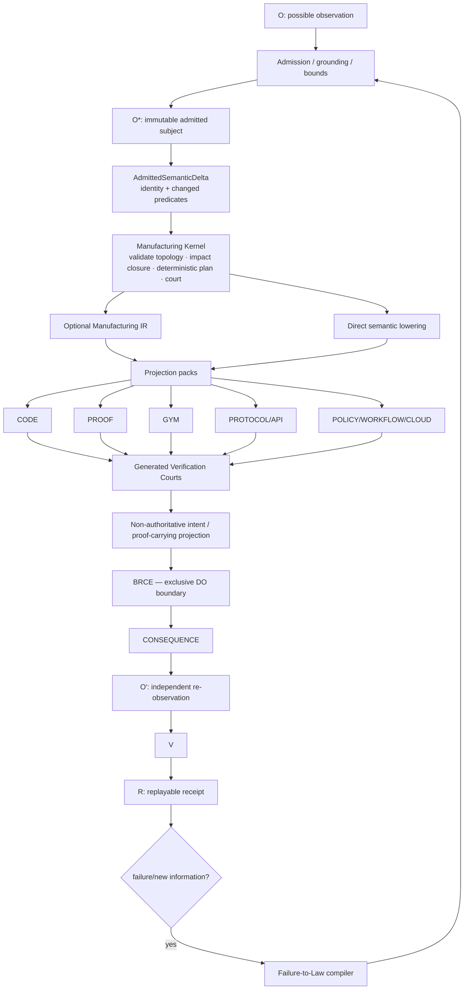
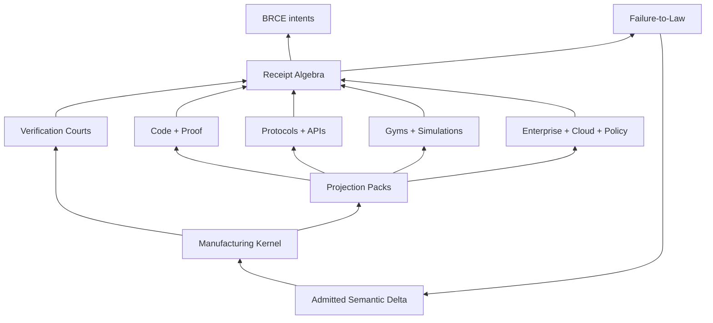

# ggen Vision 2030 — TRIZ Crown Architecture

Status: architecture constitution + 2026 executable frontier
Design horizon: 2030/post-AGI as an adversarial abundance scenario, not a prediction
Governing equation: `A = μ(O*)`, `R = receipt(A)`
Production loop: `O → O* → Π → μ → E → O' → V → R`

## A. Ideal Final Result

**IFR:** admitted reality changes once; ggen deterministically computes the minimum affected semantic/projection closure, manufactures only those projections and their falsification courts, admits proof and verification obligations, emits authority-bounded intents, observes authorized consequence, and closes a replayable receipt—while manual synchronization, duplicate semantics, unnecessary generated inventory, repeated cognition, and ambient agent authority approach zero.

The asymptote is not “generate more code.” It is:

`ΔO* → minimum lawful manufacture → verified consequence → receipt`

The ideal ggen becomes smaller as its lawful capability space grows. Intelligence remains at the unresolved frontier; solved patterns become ontology, constraints, deterministic transforms, verifiers, and receipts.

The 2026 implementation deliberately separates **carrier admission** from **manufacturing planning**. RDF/`ggen-graph` is one strong upstream carrier of semantic deltas, but the kernel consumes a carrier-independent `AdmittedSemanticDelta { identity, changed_predicates }`. This makes the Crown primitive reusable for RDF, process logs, protocols, cloud schemas, incident traces, or future admitted carriers without multiplying core dependencies.

## B. Contradiction Map — 50 constraints to resolve, not compromise

| # | Type | Improving parameter | Worsening parameter | Physical contradiction | Available resources | TRIZ principles | Candidate architecture | Falsifier |
|---|---|---|---|---|---|---|---|---|
| 1 | Technical | projection breadth | verification surface | kernel universal / kernel target-small | semantic graph, packs, tests | 1,3,24 | universal semantic kernel + specialized projection packs | new target requires core branching |
| 2 | Technical | generation speed | correctness | manufacture fast / verification exhaustive | deltas, receipts, caches | 10,15,25 | admission-time proof + affected court | full-system verification always required |
| 3 | Physical | canonical truth | native runtime fit | representation one / representation many | ontology, SPARQL, lowerings | 3,6,35 | one semantic source + native lowerings | target needs shadow canonical truth |
| 4 | Physical | flexibility | reproducibility | state dynamic / subject frozen | O*, hashes, receipts | 15,35 | adapt before admission, freeze after | same admitted subject yields different plan |
| 5 | Physical | self-modification | integrity | ggen changes itself / ggen cannot trust itself | Git, tests, proof, receipts | 13,22,25 | self-manufacture + independent court | self-generated change can self-admit |
| 6 | Physical | autonomy | bounded authority | agent acts / agent lacks ambient DO | BRCE, intents, policy | 2,24 | CONSTRUCT freely, BRCE-only DO | planner mutates external state |
| 7 | Technical | universality | specialization quality | abstraction general / output native | packs, target schemas | 3,17,40 | universal semantics + target-native lowering | target capability leaks into kernel |
| 8 | Technical | semantic reuse | coupling | semantics shared / domains independent | named graphs, public ontology | 1,7,24 | modular semantic namespaces + bridges | local schema change causes undeclared global cascade |
| 9 | Administrative | candidate abundance | epistemic WIP | explore many / admit few | ranking, Little's Law | 2,10,23 | bounded admission portfolio | admitted queue tracks candidate rate |
| 10 | Technical | zero manual code | inspectability | system automatic / artifact understandable | provenance, LSP, receipts | 10,32 | semantic explanations + source maps | operator reverse-engineers generated text |
| 11 | Technical | incremental regeneration | semantic closure | touch little / preserve all consequences | semantic delta, graph | 1,15,24 | minimum affected projection closure | unrelated work regenerates or affected work is missed |
| 12 | Technical | minimal verification | causal safety | verify little / detect all affected failures | dependency DAG, courts | 1,3,10 | affected-risk verification closure | skipped court catches diff-local failure |
| 13 | Physical | ephemeral manufacture | auditability | artifact disappears / evidence persists | hashes, receipts | 34,35 | zero-artifact execution + persistent receipt | audit needs persistent intermediate bytes |
| 14 | Technical | proof richness | latency | rigor high / cycle time low | Lean, SHACL, property tests | 3,10,25 | policy-selected tiered courts | low-risk change always pays maximum proof cost |
| 15 | Physical | adaptation | identity | configuration changes / identity stable | content hashes, O* | 15,35 | adaptation before subject identity | plan changes without admitted input change |
| 16 | Technical | protocol coverage | primitive count | support every protocol / avoid protocol zoo | MCP/A2A/LSP/OpenAPI schemas | 6,24,28 | universal interaction projection compiler | each protocol needs bespoke engine |
| 17 | Technical | gym diversity | maintenance | many environments / little hand authoring | specs, traces, ontologies | 6,25,28 | gym-as-projection compiler | each gym requires bespoke oracle plumbing |
| 18 | Technical | failure learning | false law risk | learn quickly / avoid overgeneralization | CI logs, incidents, fixtures | 22,25 | failure-to-law compiler + admission | single failure becomes unchecked universal law |
| 19 | Administrative | fast law promotion | governance | lesson promotes fast / evidence rigorous | receipts, review, proof | 10,23 | staged law standing | law promotes without falsifier/replay |
| 20 | Physical | decentralized packs | global correspondence | packs evolve locally / whole coherent | registry, semantic hashes | 1,5,24 | receipt-composed pack contracts | composition needs manual reconciliation |
| 21 | Technical | toolchain independence | native optimization | semantics stable / toolchains vary | capsules, receipts | 35,40 | toolchain identity in receipt DAG | replay depends on hidden host state |
| 22 | Technical | model interchangeability | model optimization | any model / exploit strongest model | candidate boundary | 2,3,24 | models construct only candidate semantics/laws | model identity changes production semantics |
| 23 | Physical | human removal | institutional legitimacy | work autonomous / authority accountable | ODRL, policy, receipts | 2,24 | explicit policy admission | undocumented human side channel required |
| 24 | Technical | primitive compression | expressive power | fewer primitives / richer domains | RDF, MIR, types | 5,6,17 | minimal orthogonal Manufacturing IR | new domain repeatedly adds core type |
| 25 | Technical | public ontology | enterprise specificity | standard semantics / proprietary nuance | PROV-O, SKOS, SHACL | 3,24,35 | public base + bounded extension graphs | customer requires forked canonical ontology |
| 26 | Technical | parallelism | deterministic output | execution unordered / bytes ordered | DAGs, canonicalization | 1,5,10 | deterministic scheduler/serialization | worker order changes plan or bytes |
| 27 | Technical | replay | environment drift | replay exact / world current | capsules, receipts | 10,34,35 | replay manufacture separately from live DO | old result needs current live state |
| 28 | Physical | fresh observation | stable admission | O changes / O* immutable | snapshots, event logs | 15,35 | content-addressed admitted snapshots | in-flight observation mutates O* |
| 29 | Technical | causal closure | telemetry cost | evidence rich / evidence minimal | OCEL, PROV-O | 3,32 | minimal causal evidence projection | standing requires all raw telemetry |
| 30 | Technical | verification reuse | stale-proof risk | proof reusable / proof invalidated by dependency change | receipt DAG | 10,34 | exact-identity proof cache | proof reused across changed dependency |
| 31 | Physical | receipt composition | authority isolation | evidence composes / authority does not leak | receipts, ODRL | 5,24 | receipt tensor + explicit authority meet | composition broadens authority implicitly |
| 32 | Technical | common IR | target power | IR common / IR not lowest-common-denominator | typed lowerings | 3,17,35 | small MIR + target extension laws | target requires lossy escape hatch |
| 33 | Technical | ontology evolution | historical replay | meaning evolves / old receipt remains interpretable | versioned ontology | 15,34 | versioned semantic identity + migration proof | ontology update invalidates history |
| 34 | Administrative | pack growth | discoverability | capability graph grows / cognitive search shrinks | registry metadata | 5,6,32 | semantic capability query | user must know pack names |
| 35 | Technical | generated documentation | truthfulness | docs automatic / claims evidence-bound | receipts, tests | 5,25 | docs projected from admitted evidence | docs claim unexecuted behavior |
| 36 | Technical | self-service tests | oracle independence | tests generated / tests not self-confirming | negative fixtures, independent constraints | 13,22,25 | separate implementation and falsifier derivations | same unchecked derivation owns both |
| 37 | Technical | graph expressiveness | bounded runtime | queries rich / planning predictable | SPARQL budgets, indexes | 1,10,23 | admitted bounded query plans | local delta causes unbounded query fanout |
| 38 | Technical | zero-artifact path | safety gates | no persistent file / pre-DO inspection retained | in-memory court, plan hash | 2,24,34 | ephemeral projection + court + BRCE | ephemeral path skips verification |
| 39 | Technical | migration speed | reversibility | schema changes fast / rollback exact | semantic deltas, receipts | 10,13,34 | bidirectional migration projection | rollback requires manual repair |
| 40 | Physical | continuous adaptation | release stability | candidate stream continuous / production release frozen | promotion cuts, hashes | 15,35 | continuous construction + admitted releases | production consumes unadmitted revision |
| 41 | Technical | enterprise scale | local reasoning | graph huge / planning local | indexes, Salsa-like incrementality | 1,17 | semantic partition + delta index | local change still O(system) |
| 42 | Technical | cross-language support | semantic unity | targets differ / law common | Tree-sitter, LSP, types | 3,6,24 | language lowerings over shared semantics | behavior diverges by language pack |
| 43 | Technical | observability | privacy | evidence detailed / payload minimized | commitments, PROV-O | 2,3,32 | selective evidence hashes | verification copies sensitive payloads |
| 44 | Technical | API adaptation | deterministic builds | API drifts / build repeats | admitted OpenAPI/MCP schema | 10,15 | pin content-addressed interface snapshot | live schema fetch changes same build |
| 45 | Administrative | ecosystem breadth | Conway pressure | teams independent / interfaces coherent | machine-readable contracts | 5,24 | graph-governed interfaces | org boundary creates semantic shadow copy |
| 46 | Technical | fast CI | confidence | fewer jobs / sufficient evidence | impact graph, receipts | 1,10 | impact-selected validation | skipped job was actually affected |
| 47 | Technical | local pack specialization | kernel upgrades | packs customize / platform evolves | semantic versions, adapters | 3,35 | compatibility laws + generated adapter | kernel upgrade requires manual pack rewrite |
| 48 | Physical | machine-generated policy | legitimate authority | policy compiles / policy not effective by generation | ODRL, BRCE | 2,24 | non-authoritative policy intent | generated policy silently becomes effective |
| 49 | Technical | abundant simulation | real standing | simulation cheap / reality distinguished | typed receipts, observation | 13,23 | simulation receipts distinct from consequence receipts | simulated success satisfies production standing |
| 50 | Physical | ggen capability | ggen size | capability grows / kernel shrinks | ontology, packs, courts | 1,2,6,24 | semantic manufacturing kernel; functionality moves outward | kernel size/branching scales with target count |

## C. Top 20 physical contradictions and separation strategy

1. **Universal / target-small** — whole/parts: universal semantic kernel, specialized packs.
2. **Adaptive / deterministic** — time: adapt `O → O*`; freeze `O* → μ`.
3. **Infinite candidates / finite admitted WIP** — condition: explore freely; admit under verification budget.
4. **Self-modifying / self-distrusting** — space: construction sandbox vs independent court.
5. **Autonomous / non-authoritative** — whole/parts: CONSTRUCT anywhere; DO only through BRCE.
6. **One semantic truth / many native representations** — whole/parts: canonical semantics, target lowerings.
7. **Ephemeral artifact / persistent audit** — substance vs information: discard carrier, preserve receipt.
8. **Complete verification / minimal work** — condition: verify exact affected-risk closure.
9. **Reusable proof / precise invalidation** — condition: reuse only exact receipt-DAG identity.
10. **Public ontology / domain specificity** — whole/parts: public base + explicit extensions.
11. **Common IR / full target expressiveness** — whole/parts: small MIR + typed extension laws.
12. **Continuous evolution / stable release** — time: continuous candidates, discrete admitted cuts.
13. **Generated tests / independent oracle** — space/source: separate falsifier derivation.
14. **Generated policy / legitimate authority** — condition: manufacture intent, not effect.
15. **Exact replay / current world** — time: replay manufacture; reobserve for new DO.
16. **Composable receipts / isolated authority** — condition: evidence tensor composes; authority re-admits.
17. **Parallel work / deterministic identity** — whole/parts: concurrent execution, canonical ordering.
18. **Huge graph / local planning** — space: partitions + indexes + semantic delta closure.
19. **More consequence classes / fewer persistent files** — condition: persist only when target policy requires.
20. **More capability / smaller ggen** — supersystem: move functionality into semantic data, packs, courts, laws.

## D. All 40 TRIZ inventive principles applied to ggen

| # | Principle | Aggressive ggen invention |
|---|---|---|
| 1 | Segmentation | `ΔO* → minimum affected projection + verification closure` |
| 2 | Taking out | remove carrier parsing, actuation, manual SDK/CI/docs glue from the kernel |
| 3 | Local quality | each projection has a specialized lowering and court over shared semantics |
| 4 | Asymmetry | exploration is permissive; consequential paths are narrow and receipted |
| 5 | Merging | spec, tests, proof obligations, docs, schemas become projections of one semantic source |
| 6 | Universality | one projection contract spans code, proof, protocol, gym, policy, workflow, docs |
| 7 | Nested doll | receipt DAG nests subject, plan, projection, court, toolchain, consequence receipts |
| 8 | Anti-weight | move repeated runtime reasoning into admission-time normalization |
| 9 | Preliminary anti-action | manufacture refusal guards, inverse migration, rollback/replay data before DO |
| 10 | Preliminary action | normalize semantics and impact once before any target lowering |
| 11 | Beforehand cushioning | generate negative fixtures/falsifiers alongside projection intent |
| 12 | Equipotentiality | keep candidate operations in reversible semantic space until BRCE |
| 13 | Other way round | architecture generates code; constraints generate implementation + falsifier; failures generate laws |
| 14 | Spheroidality/curvature | replace linear build chains with dependency/receipt DAGs |
| 15 | Dynamics | projection set changes with admitted semantic state while kernel law stays stable |
| 16 | Partial/excessive action | run the minimum court that closes affected risk instead of universal maximum rigor |
| 17 | Another dimension | files → AST → graph → process → causal system → semantic delta |
| 18 | Mechanical vibration | self-play/perturbation courts probe assumptions repeatedly |
| 19 | Periodic action | bounded validation epochs replace monolithic full rebuilds |
| 20 | Continuity of useful action | exact-subject proof/cache reuse until semantic invalidation |
| 21 | Skipping | skip persistent intermediates when ephemeral projection + receipt is sufficient |
| 22 | Blessing in disguise | failure → fixture → invariant → ontology/law → impossible recurrence |
| 23 | Feedback | `O' → V → R` and process evidence feed candidate laws into admission |
| 24 | Intermediary | carrier-independent semantic delta + Manufacturing IR bridge observation and targets |
| 25 | Self-service | projection manufactures its tests, falsifier, provenance, replay verifier, benchmark |
| 26 | Copying | simulate semantic subjects instead of mutating scarce real systems during exploration |
| 27 | Cheap short-lived objects | ephemeral projections exist only long enough for court/DO |
| 28 | Mechanics substitution | procedural glue becomes declarative graph constraints, queries, policies, packs |
| 29 | Pneumatics/hydraulics | software analogue: bounded semantic/event flows replace batch file rebuilds |
| 30 | Flexible shells/thin films | narrow adapters isolate unstable carriers/protocols/toolchains from stable kernel |
| 31 | Porous materials | explicit extension graphs admit domain semantics without contaminating core |
| 32 | Color changes | standing, provenance, authority, invalidation become visible machine-readable state |
| 33 | Homogeneity | public ontology + common receipt vocabulary reduce translation boundaries |
| 34 | Discarding/recovering | discard transient projections; reconstruct from subject + plan + capsule receipt |
| 35 | Parameter changes | choose lowering rigor/latency/security/persistence by admitted policy |
| 36 | Phase transitions | template engine → semantic generator → delta compiler → consequence compiler |
| 37 | Thermal expansion | capability graph expands through packs while core primitive count stays bounded |
| 38 | Strong oxidants | high-risk boundaries receive adversarial/negative/formal courts |
| 39 | Inert atmosphere | untrusted AI explores in non-authoritative construction domain |
| 40 | Composite materials | proof-carrying projection combines artifact/intent + provenance + policy + court + receipt |

## E. ARIZ — five highest-leverage contradictions

### ARIZ 1 — Universal capability vs smaller kernel

1. **Mini-problem:** target count grows; kernel complexity must not.
2. **Conflicting elements:** universal semantic meaning and target-native behavior.
3. **Operational zone:** admitted semantic delta → projection planning boundary.
4. **Operational time:** after O* identity exists, before rendering or actuation.
5. **Resources:** semantic predicates, packs, RDF/public ontology, existing ggen engine stages, receipts.
6. **IFR:** a new target appears by adding a projection pack/court, not a core branch.
7. **Physical contradiction:** kernel must know enough to manufacture every target; kernel must not know target mechanics.
8. **Separation:** whole/parts + space. Core knows semantic impact/dependencies/courts; packs know lowering mechanics.
9. **Candidate architectures:** target switch in core; plugin trait registry; semantic projection DAG; WASM lowering packs; generated lowering compilers. Reject target switch. Retain semantic DAG + pack contract; WASM is optional carrier, not ontology.
10. **Selection:** **carrier-independent Semantic Manufacturing Kernel** maximizes DfCM leverage while minimizing core dependency and branch growth.

### ARIZ 2 — Determinism vs adaptation

1. Mini-problem: reality, schemas, APIs, and policies change continuously.
2. Conflicting elements: freshness and replay.
3. Operational zone: observation/admission boundary.
4. Operational time: before subject identity is frozen.
5. Resources: content hashes, semantic snapshots, receipts, process logs.
6. IFR: adapt freely before admission; same O* always yields same plan.
7. Physical contradiction: semantic state must change / must not change.
8. Separation: **time** — dynamic `O → O*`; immutable `O* → μ`.
9. Candidates: live reads during render; cached live reads; admitted schema snapshots; event-sourced O*; content-addressed observation bundles. Select content-addressed admitted subject.
10. Selection: removes ambient nondeterminism from production manufacture.

### ARIZ 3 — Unlimited generation vs finite verification

1. Mini-problem: abundant models/agents generate candidates faster than courts can verify.
2. Conflicting elements: exploration breadth and proof throughput.
3. Operational zone: candidate → admission portfolio.
4. Operational time: before candidate creates production WIP.
5. Resources: risk, information gain, novelty, expected consequence, Little's Law.
6. IFR: candidate abundance does not inflate admitted WIP.
7. Physical contradiction: candidates must be numerous / admitted candidates must be few.
8. Separation: **condition** — exploration unbounded; admission bounded by evidence budget.
9. Candidates: FIFO; random sample; risk-only; information-gain priority; portfolio frontier. Select portfolio frontier with risk floor and WIP cap.
10. Selection: maximize verified information/consequence per verification minute.

### ARIZ 4 — Autonomous evolution vs governance

1. Mini-problem: ggen should learn and manufacture improvements without unrestricted authority.
2. Conflicting elements: self-improvement throughput and legitimacy.
3. Operational zone: candidate law/self-change promotion boundary.
4. Operational time: after construction, before adoption or DO.
5. Resources: Git, tests, negative fixtures, formal proof, BRCE, receipts.
6. IFR: ggen manufactures its own improvement and independent falsifier; only admitted evidence changes production law.
7. Physical contradiction: self-change must execute / self-change must not self-authorize.
8. Separation: **space + condition** — sandbox construction, independent court, explicit admission, BRCE DO.
9. Candidates: self-merge; human-only approval; N-version verification; theorem gate; receipt-backed multi-court. Select policy-selectable multi-court.
10. Selection: autonomy remains in CONSTRUCT; authority remains outside the generator.

### ARIZ 5 — Universal semantic substrate vs specialized native projections

1. Mini-problem: common abstraction can become lowest-common-denominator output.
2. Conflicting elements: semantic reuse and target fidelity.
3. Operational zone: semantic/MIR subject → target lowering.
4. Operational time: projection construction.
5. Resources: typed target schemas, Tree-sitter, LSP, protocol specs, target toolchains.
6. IFR: common invariant semantics compose globally; output remains target-native.
7. Physical contradiction: representation must be common / representation must be specialized.
8. Separation: **whole/parts** — kernel expresses intent/impact/invariants; packs own target representation.
9. Candidates: universal AST; strings/templates; target-specific IRs; small MIR + native lowerings; direct semantic-to-target for trivial projections. Select small MIR with lawful direct lowering where no intermediate adds value.
10. Selection: preserve semantic fidelity and DfCM without core target proliferation.

## F. TRIZ evolution analysis and S-curves

### Current and next technological systems

- **S1 — template generation:** text substitution. Saturation signal: template count and manual synchronization dominate.
- **S2 — semantic deterministic generation:** RDF/SPARQL/Tera + deterministic graph/receipts. Current mature curve.
- **S3 — multi-projection semantic manufacture:** one admitted subject projects code/tests/docs/proofs/protocols/gyms with correspondence courts.
- **S4 — self-manufacturing kernel:** failures/specs manufacture packs, verifiers, migrations, and law proposals.
- **S5 — autonomic consequence compiler:** semantic deltas manufacture minimum verified intents; BRCE authorizes DO; re-observation closes receipts.

**Transition primitive:** `AdmittedSemanticDelta → deterministic minimum projection closure + court`.

Do not optimize S2 by multiplying target-specific generators. The next curve reduces persistent generation machinery.

### Uneven subsystem development

The likely 2030 bottleneck is **verification/admission identity**, not text generation. Proof capacity, independent observation, authority, semantic correspondence, and causal evidence remain scarce after code becomes abundant. Therefore the kernel optimizes verification surface before output volume.

### Supersystem evolution

The deeper abstraction is a **Manufacturing Kernel** shared by ggen, AutoFDE, GymAct, mfact-facing proof adapters, BRCE-facing intents, LSP-MAX, Graphlaw, cloud systems, and enterprise systems. ggen is a principal interface/projection ecosystem over that kernel, not a giant central application.

### Micro-level evolution

`files → AST nodes → graph triples → semantic predicates → admitted deltas → receipt atoms`

The finest useful work unit is not a changed file but a changed admitted meaning plus its causal projection closure.

## G. Ten software Substance–Field models

| # | S1 | Field | S2 | Problem class | Standard solution |
|---|---|---|---|---|---|
| 1 | admitted semantic delta | trigger/closure field | projection pack | incomplete interaction | explicit semantic trigger + dependency graph |
| 2 | projection | court field | artifact/intent | insufficient verification | mandatory generated baseline court |
| 3 | AI candidate law | admission field | production law | harmful self-confirmation | independent court + typed standing |
| 4 | receipt A | composition field | receipt B | authority leakage | compose evidence; explicitly re-admit authority |
| 5 | semantic substrate | MIR/lowering field | native target | semantic loss | correspondence obligation + target law |
| 6 | failure trace | causal diagnosis field | invariant | insufficient learning | failure-to-law compiler |
| 7 | external API/schema | admission snapshot field | projection | nondeterministic drift | content-addressed admitted interface snapshot |
| 8 | semantic graph | delta/impact field | verification queue | excessive interaction | affected-risk closure only |
| 9 | ephemeral projection | BRCE field | external system | unsafe zero-artifact path | court + plan receipt before broker admission |
| 10 | observed consequence | process-mining field | candidate law | weak feedback | OCEL/PROV evidence → falsifiable law proposal |

## H. TRIZ resource inventory

Exploit existing resources before adding machinery:

- **RDF / public ontology:** canonical semantic identities and relations.
- **`ggen-graph` RDF deltas:** upstream RDF carrier capable of producing changed semantic predicates and content-addressed transition evidence.
- **SPARQL:** projection selection, impact, correspondence, and court queries—not only template extraction.
- **SHACL:** semantic admission/refusal gates.
- **PROV-O / OCEL:** causal manufacture and consequence evidence.
- **BLAKE3:** delta/plan/artifact/capsule identity.
- **packs:** target-specialized lowering/court modules rather than independent generator products.
- **Tree-sitter / LSP / LSIF:** semantic and symbol impact without manual code reading.
- **Salsa-like incrementality:** future exact dependency caching for semantic queries.
- **Oxigraph:** deterministic local semantic substrate.
- **Lean / mfact:** high-rigor court for formal laws.
- **Rust types:** encode admissible states and typed refusals.
- **Git history / CI logs / incident traces:** repeated failures waiting to become laws.
- **negative fixtures:** executable statements of forbidden recurrence.
- **protocol/cloud schemas:** direct sources for interaction and gym projections.
- **existing receipts:** reusable proof/invalidation atoms rather than prose status.

The most valuable repeatedly reconstructed information is **impact knowledge**: “which projections and courts are affected by this admitted semantic change?” The 2026 kernel makes that a first-class deterministic calculation.

## I. Primitive compression — minimal orthogonal set

After TRIZ compression, the Crown reduces to five primitives:

1. **Admitted Semantic Delta** — carrier-independent identity + changed semantic predicates; `ΔO*` is the work unit.
2. **Manufacturing Kernel** — admits projection topology, computes minimum affected closure, deterministic order, courts, and plan identity.
3. **Projection Pack** — target-native lowering from semantic/MIR subject to code/proof/protocol/gym/policy/workflow/docs; has no ambient authority.
4. **Verification Court + Receipt Algebra** — falsifier + correspondence + provenance + replay evidence; receipts compose under explicit dependency and authority laws.
5. **Failure-to-Law Compiler** — recurring verified failure becomes constraint, fixture, ontology refinement, verifier, or projection law.

Candidate names such as “MCP generator,” “REST generator,” “LSP generator,” “A2A generator,” and “GraphQL generator” compress into a **Universal Interaction Projection Compiler** built from Projection Pack + Court. Benchmark/simulation/test/gym generators similarly compress into **Gym Projection Packs**.

If an alleged new generator cannot be represented as a projection pack and court over these primitives, that is evidence the primitive set is incomplete.

## J. ggen 2030 formal architecture

### C4 context view


### Container view



### TRIZ improvement over an artifact-centric architecture

Persistent artifacts are not mandatory kernel outputs. Projection can be ephemeral:

`ΔO* → affected closure → ephemeral|persistent projection → court → intent → BRCE → O' → R`

Persistence is a target policy. The persistent invariant is the subject/plan/court/receipt identity needed for replay and standing.

### Formal kernel boundary

```text
K : (ΔO*, Gp) → M | REFUSED
```

Where:

- `ΔO*` is an admitted semantic delta identity plus changed predicates;
- `Gp` is an admitted projection dependency/trigger graph;
- `M` is a deterministic manufacturing plan containing affected topological order, courts, and plan hash;
- `K` has no filesystem/network/process/BRCE authority.

Desired indexed locality:

`cost(K) ≈ O(|Δ| + |affected closure|)`

rather than `O(|system|)`.

## K. DfCM capability lattice



Combinatorial multiplication arises because independently specialized packs share one semantic-delta/topology/court/receipt algebra. The target is `Capability(P) >> |P|`.

## L. Top 20 highest-leverage capabilities

1. Carrier-independent Semantic Delta Compiler
2. Minimum Projection Closure Planner
3. Universal Manufacturing IR where an intermediary adds value
4. Projection Pack Contract
5. Generated Verification Court
6. Proof-Carrying Projection
7. Receipt Algebra / precise invalidation DAG
8. Failure-to-Law Compiler
9. Universal Interaction Projection Compiler (MCP/A2A/LSP/OpenAPI/etc.)
10. Universal Gym Projection Compiler
11. Zero-Artifact Manufacture Path
12. BRCE Intent Projection
13. Semantic Correspondence Verifier
14. Ontology/Schema Evolution Compiler
15. Migration + Inverse-Migration Compiler
16. Causal Digital Twin Projection
17. Impact-Selected CI/Validation Compiler
18. Toolchain Capsule + Deterministic Replay Compiler
19. Self-Manufacturing Projection-Pack Factory
20. Verification-Budget Scheduler for abundant candidate generation

## M. Crown 10 systems

1. **Semantic Manufacturing Kernel**
2. **Manufacturing IR + Projection DAG**
3. **Generated Verification Courts**
4. **Receipt Algebra**
5. **Failure-to-Law Compiler**
6. **Universal Interaction Projection Compiler**
7. **Universal Gym Compiler**
8. **Zero-Artifact Consequence Compiler**
9. **Ontology Evolution/Migration Compiler**
10. **Self-Manufacturing Pack Factory**

## N. Crown 5 phase-change inventions

1. **Delta-Closed Semantic Manufacturing Kernel** — local admitted meaning replaces whole-project regeneration as the work unit.
2. **Court-Carrying Projections** — generation emits falsifier/correspondence/provenance/replay obligations by construction.
3. **Receipt Algebra** — exact reuse, invalidation, composition, and authority separation across manufactured ecosystems.
4. **Failure-to-Law Compiler** — cognition cost for a recurring failure class trends toward zero after admission.
5. **Projection Universality** — protocols, gyms, code, proofs, infrastructure, policies, migrations, and docs become target packs over one kernel.

## O. Crown 1 — Delta-Closed Semantic Manufacturing Kernel

The highest-leverage primitive is:

```text
admitted semantic delta identity + changed predicates
    + admitted projection dependency/trigger graph
    → minimum deterministic affected closure
    → generated verification courts
    → content-addressed manufacturing plan
```

The kernel is deliberately **not a carrier parser, renderer, or actuator**. This is the resolution of:

`ggen must become universal ∧ ggen must become smaller`.

### 2026 executable slice

`crates/ggen-engine/src/manufacturing_kernel.rs` implements the first Gall-compliant slice:

- introduces carrier-independent `AdmittedSemanticDelta { identity, changed_predicates }`;
- keeps RDF/`ggen-graph` ownership upstream rather than creating a new dependency edge;
- re-admits nonblank delta identity and semantic predicates at the kernel boundary;
- admits unique projection identities and all dependency references;
- refuses blank projection triggers, unknown dependencies, duplicate identities, and cyclic graphs;
- selects direct semantic trigger matches;
- computes transitive downstream projection closure;
- returns stable topological order independent of input insertion order;
- generates a baseline court: determinism, provenance, falsifier, semantic correspondence, receipt replay, authority boundary;
- binds delta identity + predicates + ordered courts into a BLAKE3 plan identity;
- exposes no filesystem, network, process, or actuation method.

The integration court falsifies over-generation, unstable ordering, incomplete transitive closure, missing baseline courts, unbound delta identity, blank semantic predicates/triggers, missing dependencies, cycles, and duplicate identities.

## P. 2026 implementation frontier — work backward from Crown

### Frontier 0 — this PR

Make:

`AdmittedSemanticDelta → affected projection closure + court + plan hash`

independently ALIVE before wiring it into sync.

Acceptance target:

```bash
cargo test -p ggen-engine --test manufacturing_kernel
```

### Frontier 1 — carrier adapters + semantic projection registry

Keep observation carriers outside the kernel. Manufacture adapters such as:

- `ggen-graph::RdfDelta → AdmittedSemanticDelta`;
- process/OCEL delta → `AdmittedSemanticDelta`;
- OpenAPI/MCP/A2A/LSP schema delta → `AdmittedSemanticDelta`;
- incident/failure-law delta → `AdmittedSemanticDelta`.

Represent `ProjectionSpec` as RDF/public ontology rather than hand-built Rust values. Packs declare semantic triggers, dependency edges, target lowering capability, court obligations, persistence policy, and authority class.

### Frontier 2 — sync integration

At sync admission:

1. compare prior admitted graph receipt with current graph;
2. derive carrier-specific semantic delta;
3. normalize to `AdmittedSemanticDelta`;
4. query projection registry;
5. call Manufacturing Kernel;
6. execute only selected projection packs;
7. run selected courts;
8. bind plan hash into sync receipt.

Whole-project regeneration occurs only when impact semantics prove whole-system closure.

### Frontier 3 — proof/receipt closure

Add exact dependency receipt DAG, court result receipts, toolchain/config identity, replay verifier, and precise cache invalidation.

### Frontier 4 — protocol + gym universality

Compile MCP/A2A/LSP/OpenAPI/cloud/process specifications into the same projection registry. Gym generation becomes a projection producing environment + tasks + oracle + adversary + score + replay.

### Frontier 5 — failure-to-law

Mine real failures/CI logs/incidents into candidate invariants; manufacture fixture + constraint + verifier; require independent admission before promotion into generation law.

### Frontier 6 — zero-artifact/BRCE bridge

Allow selected projections to remain ephemeral. Court them in a content-addressed capsule, emit only authority-bounded intent, and require BRCE for DO. Persist evidence, not accidental inventory.

## Q. ERRC after TRIZ

| Domain | Eliminate | Reduce | Raise | Create |
|---|---|---|---|---|
| Coding | hand-synchronized boilerplate | persistent generated source where accidental | semantic correspondence | native projection packs |
| Testing | separately synchronized happy-path suites | redundant full reruns | adversarial falsifiers | generated courts |
| CI | whole-system epistemic WIP | jobs per local delta | exact-head evidence | impact-selected validation |
| Integration | bespoke protocol glue | one-off adapters | interface semantics | universal interaction projections |
| Protocols | per-protocol core branches | manual schema transcription | conformance courts | protocol packs |
| Cloud | drift-prone imperative glue | orchestration surface | authority boundaries | semantic consequence intents |
| DevOps | file-centric synchronization | rebuild/redeploy scope | replay identity | delta-driven release manufacture |
| SRE | repeated diagnosis classes | duplicate telemetry | causal closure | failure-to-law pipeline |
| Enterprise architecture | manual model drift | shadow repositories | public semantic contracts | executable architecture projections |
| Formal methods | isolated proof islands | reproving unchanged subjects | proof dependency identity | proof-carrying projections |
| Benchmarks | handcrafted environments | maintenance | independent oracles | gym compiler |
| Simulation | bespoke scenario plumbing | persistent scenario inventory | distinction from real standing | content-addressed simulation projections |
| Agent systems | ambient execution authority | agentic WIP | admission/refusal rigor | construct-only candidate factories |
| Documentation | hand-synchronized claims | prose duplication | evidence-bound standing | receipt/semantic projections |
| Migration | irreversible scripts | full-system migration | inverse/replay proof | semantic migration compiler |

## R. Falsifiers

The Crown thesis is wrong or materially incomplete if any of these observations hold:

1. A materially important target cannot be represented as a specialized projection over a small common semantic kernel without moving target mechanics into core.
2. Carrier-independent changed semantics lose information needed for safe impact planning, forcing each carrier implementation into the kernel.
3. Semantic delta impact cannot select a substantially smaller safe manufacture/verification closure than whole-system regeneration in realistic systems.
4. Projection dependency metadata costs more to maintain than the synchronization work it removes.
5. Generated courts systematically share unchecked derivation failure with generated implementation and cannot be independently adversarial.
6. Exact receipt/toolchain identities fail to reproduce materially important projections across supported environments.
7. Zero-artifact manufacture cannot retain inspectability/auditability without persisting the intermediate artifact.
8. Receipt composition cannot avoid authority ambiguity or provenance explosion.
9. Public ontology + bounded extensions cannot model enterprise specificity without pervasive lossy escape hatches.
10. Failure-to-law promotion creates more false universal rules than repeated diagnosis cost it removes.
11. Incremental manufacture remains effectively `O(system)` because semantic dependencies are too dense or expensive to index.
12. Kernel primitive/branch count grows approximately linearly with target count.
13. Same admitted semantic delta + same projection graph + same kernel/toolchain identity yields different plan order/hash.
14. A manufacturing plan acquires external execution authority without explicit downstream BRCE/policy admission.
15. A generated artifact can reach ALIVE standing without observed execution against its named admitted subject.
16. Historical receipts become uninterpretable under ontology evolution despite versioned semantic identity.
17. A carrier-specific adapter must duplicate projection-planning laws instead of only manufacturing `AdmittedSemanticDelta`.

## Final test for every future capability

Delete any proposed capability that cannot answer these positively:

- **Ideality:** does useful function grow faster than complexity?
- **Contradiction:** which contradiction is eliminated rather than averaged away?
- **Resources:** does it exploit existing semantics/evidence first?
- **DfCM:** how many lawful future combinations does it unlock?
- **Cognition:** does it compile recurring reasoning into deterministic machinery?
- **Information:** does it remove semantic shadow copies?
- **Gall:** can it become independently ALIVE before supersystem composition?
- **TCPS:** does failure stop at the earliest causal boundary?
- **DFLSS:** is quality manufactured into the court?
- **BRCE:** is all DO authority external to the planner/generator?
- **Receipt:** can every consequential transition be replayed and audited?
- **Post-AGI:** does its value rise as reasoning and code generation become cheap?

## Governing thesis

By 2030 the scarce function is not source text. It is **conversion of admitted reality into the minimum necessary deterministic, falsifiable, authority-bounded, receipt-carrying consequence**.

TRIZ removes contradictions that would otherwise force compromise. DfCM expands the lawful composition space after those contradictions are removed. The Manufacturing Kernel therefore shrinks toward a few stable semantic/algebraic primitives while target capability migrates outward into composable projection packs, courts, receipts, and learned laws.

The strongest generator ultimately generates fewer accidental artifacts and more standing.
