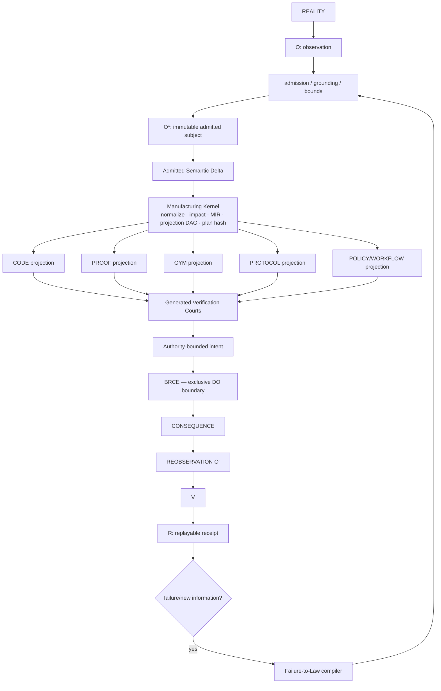
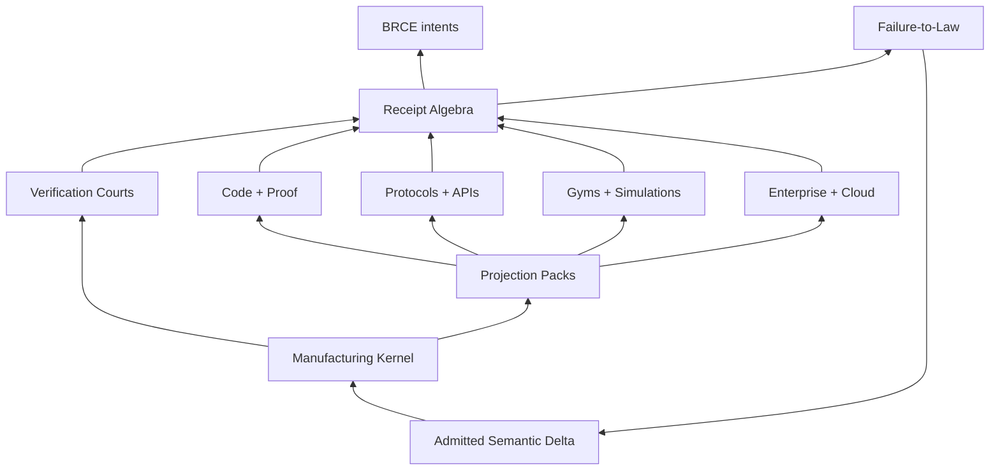

# ggen Vision 2030 — TRIZ Crown Architecture

Status: architecture constitution + 2026 executable frontier  
Design horizon: 2030/post-AGI as an adversarial abundance scenario, not a prediction  
Governing equation: `A = μ(O*)`, `R = receipt(A)`  
Production loop: `O → O* → Π → μ → E → O' → V → R`

## A. Ideal Final Result

**IFR:** admitted reality changes once; ggen deterministically computes the minimum affected semantic/projection closure, manufactures only those projections and their falsification courts, admits proof/verification obligations, emits authority-bounded intents, observes authorized consequence, and closes a replayable receipt—while manual synchronization, duplicate semantics, unnecessary generated inventory, repeated cognition, and ambient agent authority approach zero.

The asymptote is not “generate more code.” It is:

`ΔO* → minimum lawful manufacture → verified consequence → receipt`

The ideal ggen becomes smaller as its lawful capability space grows. Intelligence remains at the unresolved frontier; solved patterns become ontology, constraints, deterministic transforms, verifiers, and receipts.

## B. Contradiction Map — 50 constraints to resolve, not compromise

| # | Type | Improve | Worsens | Physical contradiction | Existing resources | TRIZ | Candidate architecture | Falsifier |
|---|---|---|---|---|---|---|---|---|
| 1 | Technical | projection breadth | verification surface | kernel must be universal / not contain target complexity | RDF, packs, tests | 1,3,24 | universal substrate + specialized projection packs | adding a target requires kernel branching |
| 2 | Technical | generation speed | correctness | manufacture must be fast / exhaustive | deltas, caches, tests | 10,15,25 | admission-time proof + delta verification | full-system verification remains mandatory per delta |
| 3 | Physical | canonical truth | native runtime fit | representation must be one / many | RDF, SPARQL, Tera | 3,6,35 | one semantic source, many lowerings | native targets require shadow source-of-truth |
| 4 | Physical | flexibility | reproducibility | system must be dynamic / frozen | O*, receipts | 15,35 | dynamic before admission, immutable after | same admitted subject yields different plan |
| 5 | Physical | self-modification | integrity | ggen must rewrite itself / not trust itself | Git, tests, CI, receipts | 13,22,25 | self-manufacture + independent court | self-generated change can self-admit |
| 6 | Physical | autonomy | bounded authority | system must act / not possess ambient DO | BRCE, intents | 2,24 | CONSTRUCT freely, BRCE-only DO | planner can mutate external state directly |
| 7 | Technical | universality | specialization quality | abstraction must generalize / stay native | packs, IR candidates | 3,17,40 | semantic universality + target-native lowerings | target-specific capability leaks into core |
| 8 | Technical | semantic reuse | coupling | meanings must compose / evolve independently | RDF named graphs | 1,7,24 | namespaced semantic modules + explicit bridges | local schema change cascades globally without declared edge |
| 9 | Administrative | candidate abundance | WIP | explore many / admit few | ranking, receipts | 2,10,23 | bounded admission queue by information gain/risk | queue size tracks candidate generation rate |
| 10 | Technical | zero manual code | inspectability | generated system must be automatic / understandable | provenance, LSP | 10,32 | source maps + semantic explanation + receipts | operators must reverse-engineer generated text |
| 11 | Technical | incremental regeneration | semantic closure | touch little / preserve dependency correctness | RDF delta, graph | 1,15,24 | semantic delta closure planner | unrelated projections regenerate or required ones are missed |
| 12 | Technical | minimal verification | causal safety | verify little / catch all affected failures | dependency graph | 1,3,10 | affected verification closure | a changed semantic atom breaks an unselected court |
| 13 | Physical | ephemeral manufacture | auditability | artifact should disappear / remain provable | receipts, hashes | 34,35 | zero-artifact execution + persistent receipt | audit requires persistent intermediate bytes |
| 14 | Technical | proof richness | build latency | more proof / less delay | Lean, tests, SHACL | 3,10,25 | tiered courts by risk | low-risk deltas pay full formal-proof cost |
| 15 | Physical | adaptation | identity | config must change / subject identity must not | hashes, O* | 15,35 | adaptation before subject hash | plan identity changes without subject/config change |
| 16 | Technical | protocol coverage | primitive count | support MCP/A2A/LSP/etc / no protocol zoo | schemas, packs | 6,24,28 | universal interaction projection compiler | each protocol requires bespoke engine code |
| 17 | Technical | gym diversity | benchmark maintenance | many environments / little hand work | specs, traces | 6,25,28 | gym-as-projection compiler | each gym needs hand-authored oracle/task plumbing |
| 18 | Technical | failure learning | rule quality | absorb failures quickly / avoid bad laws | incidents, fixtures | 22,25 | failure-to-law compiler + admission | one failure auto-promotes an invalid universal rule |
| 19 | Administrative | fast learning | governance | promote lessons / require evidence | receipts, reviews | 10,23 | staged law standing | rule promotion lacks falsifier/replay evidence |
| 20 | Physical | decentralized packs | global correspondence | packs evolve locally / whole remains coherent | pack registry, hashes | 1,5,24 | receipt-composed pack contracts | pack composition needs manual semantic reconciliation |
| 21 | Technical | toolchain independence | native optimization | stable semantics / target toolchains vary | containers, receipts | 35,40 | toolchain capsule identity in receipts | replay depends on unrecorded host state |
| 22 | Technical | model interchangeability | optimized reasoning | any model / exploit best model | model outputs are untrusted | 2,3,24 | models only construct candidate O*/laws | model identity changes deterministic production semantics |
| 23 | Physical | human removal | institutional legitimacy | no manual work / accountable approval exists | authority graph, receipts | 2,24 | policy-bound machine admission with explicit authority | compliance requires undocumented human side-channel |
| 24 | Technical | semantic compression | expressive power | fewer primitives / richer domains | RDF, public ontology | 5,6,17 | minimal orthogonal MIR | new domains repeatedly add new core primitive types |
| 25 | Technical | public ontology | enterprise specificity | standard semantics / proprietary nuance | RDF/OWL/SKOS | 3,24,35 | public base + bounded extensions | customer model requires forked canonical ontology |
| 26 | Technical | deterministic output | parallelism | order-independent / parallel execution | hashes, DAGs | 1,5,10 | deterministic DAG scheduler | worker ordering changes bytes or receipt |
| 27 | Technical | replay | live environment drift | exact re-execution / world changes | receipts, capsules | 10,34,35 | replay mode separates manufacture from live actuation | replay needs current external state to reconstruct old result |
| 28 | Physical | current observation | stable admission | O must be fresh / O* immutable | observation logs | 15,35 | immutable admitted snapshots | in-flight observation mutates admitted subject |
| 29 | Technical | causal closure | low observability cost | observe consequence / avoid telemetry explosion | OCEL, provenance | 3,32 | minimal causal evidence projection | standing needs full raw telemetry retention |
| 30 | Technical | verification reuse | stale-proof risk | reuse proof / reprove changes | hashes, dependency DAG | 10,34 | receipt algebra + precise invalidation | unchanged proof reused across changed dependency identity |
| 31 | Physical | composition | authority isolation | receipts compose / authority must not leak | receipts, ODRL | 5,24 | receipt tensor with explicit authority meet | composed artifact inherits broader authority accidentally |
| 32 | Technical | one IR | no lowest-common denominator | common core / preserve target power | RDF, typed lowerings | 3,17,35 | small MIR + opaque target extensions with laws | IR cannot express a target without lossy escape hatch |
| 33 | Technical | schema evolution | historical replay | semantics evolve / old receipts remain valid | versioned ontology | 15,34 | versioned semantic identities + migration proofs | ontology update invalidates historical receipt interpretation |
| 34 | Administrative | many packs | discoverability | capability grows / cognitive search shrinks | registry, metadata | 5,6,32 | capability graph query instead of pack browsing | users must know pack names to find functions |
| 35 | Technical | generated docs | truthfulness | docs auto-update / avoid false claims | tests, receipts | 5,25 | docs projected only from admitted evidence | docs can claim behavior absent execution receipt |
| 36 | Technical | self-service tests | oracle independence | generate tests / avoid self-confirmation | negative fixtures | 13,22,25 | generator emits adversarial court from independent constraints | implementation and oracle share same unchecked derivation |
| 37 | Technical | graph queries | bounded runtime | expressive query / predictable cost | SPARQL limits | 1,10,23 | admitted bounded query plans | a semantic delta can trigger unbounded query fan-out |
| 38 | Technical | zero-artifact execution | safety gates | remove files / retain pre-actuation inspection | BRCE, plan hash | 2,24,34 | ephemeral projection must pass court before broker | ephemeral path bypasses verifier due no persisted file |
| 39 | Technical | migration automation | reversibility | change schemas fast / rollback exactly | deltas, receipts | 10,13,34 | bidirectional migration projection + receipt | rollback requires bespoke manual repair |
| 40 | Physical | continuous operation | stable releases | adapt continuously / preserve release standing | channels, hashes | 15,35 | semantic delta stream + promotion boundaries | production consumes unadmitted projection revision |
| 41 | Technical | enterprise scale | local reasoning | huge graph / bounded planning | graph indexes, Salsa | 1,17 | semantic atom partitioning + incremental queries | planning complexity remains O(system) for local delta |
| 42 | Technical | cross-language generation | one law | many languages / same semantics | Tree-sitter, LSP | 3,6,24 | language lowerings certified against same MIR law | semantic behavior diverges by language pack |
| 43 | Technical | observability | privacy | evidence rich / data minimized | hashes, PROV | 2,3,32 | selective evidence commitments | verification requires copying sensitive payloads into receipts |
| 44 | Technical | external API adaptation | deterministic builds | APIs drift / builds repeat | OpenAPI, MCP schemas | 10,15 | pin admitted API schema snapshot | live schema fetch changes same build identity |
| 45 | Administrative | broad ecosystem | Conway pressure | decentralized teams / coherent architecture | ontology contracts | 5,24 | graph-governed interfaces + machine gates | org boundary creates undocumented semantic duplicate |
| 46 | Technical | fast CI | confidence | fewer jobs / enough evidence | impact graph, receipts | 1,10 | impact-selected validation capsule | skipped CI job would have caught affected boundary |
| 47 | Technical | local specialization | global upgrade | packs customize / kernel upgrades safely | semantic versions | 3,35 | compatibility laws + adapter projection | kernel release requires manual pack rewrites |
| 48 | Physical | machine-generated policy | human/legal accountability | policy compiles / authority must remain legitimate | ODRL, PROV | 2,24 | policy projection emits non-authoritative intent + proof | generated policy silently becomes effective policy |
| 49 | Technical | scarce physical consequence | abundant simulation | simulate freely / distinguish reality | receipts, observation | 13,23 | simulation receipts typed separately from consequence receipts | simulated success can satisfy production standing |
| 50 | Physical | ggen capability growth | ggen size | more capability / smaller kernel | packs, ontology, MIR | 1,2,6,24 | semantic manufacturing kernel; everything else projection | kernel LOC/branching grows roughly with target count |

## C. Top 20 physical contradictions

1. Kernel must be **universal** because every lawful target should be manufacturable; kernel must be **not universal in target logic** because target detail causes bloat. Separate whole/parts: universal semantics, specialized packs.
2. Manufacture must be **adaptive** because reality changes; it must be **deterministic** because admitted subjects require replay. Separate in time: adapt `O → O*`, freeze after admission.
3. Candidate production must be **unbounded** to exploit abundant cognition; admitted WIP must be **bounded** because verification is scarce. Separate by condition: explore freely, admit by information gain/risk budget.
4. ggen must **self-modify** to scale improvement; it must **not trust self-modification** to preserve integrity. Separate in space: construction sandbox vs independent court.
5. Agents must be **autonomous** for throughput; agents must be **non-authoritative** for safety. Separate whole/parts: CONSTRUCT anywhere, DO only through BRCE.
6. The semantic source must be **one** for integrity; target representations must be **many** for native fit. Separate whole/parts.
7. Generated artifacts must be **ephemeral** to reduce inventory; evidence must be **persistent** for audit. Separate substance from information: discard artifact, retain receipt/proof commitment.
8. Verification must be **complete** for trust; verification must be **minimal** for throughput. Separate by condition: affected-risk closure only.
9. Proof must be **reused** to reduce cost; proof must be **invalidated** when any dependency changes. Separate by identity: reuse only exact receipt DAG matches.
10. Semantics must be **public** for interoperability; semantics must be **domain-specific** for precision. Separate whole/parts: public base + explicit extensions.
11. One IR must be **common** for composition; it must be **non-limiting** for target power. Separate whole/parts: small MIR + typed target extension laws.
12. Systems must be **continuous** for adaptation; releases must be **stable** for standing. Separate in time: continuous candidate stream, admitted promotion cuts.
13. Tests must be **generated** for self-service; oracles must be **independent** to avoid self-confirmation. Separate in space/source: implementation projection and falsifier projection from independent constraints.
14. Policy must be **machine-generated** for scale; policy must be **non-effective** until legitimate authority admits it. Separate by condition.
15. Replay must be **exact**; external reality must be **current**. Separate in time: deterministic replay of manufacture, fresh observation only for new consequence.
16. Receipts must **compose**; authority must **not compose automatically**. Separate fields: evidence tensor composes, authority uses explicit meet/admission.
17. Generation must be **parallel** for speed; output must be **order-independent** for identity. Separate execution order from canonical serialization.
18. Enterprise graph must be **large**; planning must be **local**. Separate in space: semantic partitions + delta indexes.
19. ggen must generate **more classes of consequence**; it must persist **fewer artifacts**. Separate function from carrier: manufacture intent/proof directly where files are accidental.
20. ggen must become **more capable**; ggen itself must become **smaller**. Separate kernel from supersystem: capability moves into data, ontology, packs, laws, and generated courts.

## D. All 40 TRIZ inventive principles applied aggressively

| # | Principle | ggen invention |
|---|---|---|
| 1 | Segmentation | semantic delta → smallest affected projection and verification closure |
| 2 | Taking out | remove manual templates/SDK glue/docs/CI synchronization; remove actuation from planner |
| 3 | Local quality | per-projection specialized lowering and court over one shared semantic subject |
| 4 | Asymmetry | read/explore paths remain permissive; write/DO paths are narrow and receipted |
| 5 | Merging | spec, tests, proof obligations, docs, schemas become projections of one semantic structure |
| 6 | Universality | one projection primitive covers code/proof/protocol/gym/policy/document targets |
| 7 | Nested doll | receipt DAG contains plan identity, projection receipts, toolchain capsules, consequence receipt |
| 8 | Anti-weight | shift expensive runtime reasoning into admission-time semantic normalization |
| 9 | Preliminary anti-action | precompute refusal guards and rollback/replay data before any DO |
| 10 | Preliminary action | normalize ontology, resolve dependencies, rank verification budget once at admission |
| 11 | Beforehand cushioning | generate negative fixtures/falsifiers beside artifacts before deployment |
| 12 | Equipotentiality | keep candidate transformations in a reversible graph domain until irreversible DO |
| 13 | Other way round | architecture/constraints generate code and tests; failures generate laws |
| 14 | Spheroidality/curvature | replace linear pipelines with receipt/dependency DAGs supporting local recomposition |
| 15 | Dynamics | projection set changes with admitted semantic state without changing kernel semantics |
| 16 | Partial/excessive action | when full formal proof is unnecessary, run minimal court that still closes affected risk |
| 17 | Another dimension | files → ASTs → RDF graph → process/causal graph → semantic delta manufacture |
| 18 | Mechanical vibration | periodic/self-play perturbation of generated courts to expose brittle assumptions |
| 19 | Periodic action | incremental checkpoints and bounded validation epochs instead of monolithic rebuilds |
| 20 | Continuity of useful action | cache exact-subject proof/receipt results and reuse until invalidated |
| 21 | Skipping | zero-artifact path skips persisted intermediate files when audit can bind ephemeral projection |
| 22 | Blessing in disguise | failure → fixture → invariant → ontology/law → mechanically prevented recurrence |
| 23 | Feedback | `O' → V → R` feeds observed consequence and process mining back into admission laws |
| 24 | Intermediary | Manufacturing IR mediates ontology and arbitrary target-native lowerings |
| 25 | Self-service | each projection manufactures its own tests, falsifier, provenance, replay verifier |
| 26 | Copying | simulate/clone semantic subjects cheaply instead of mutating real systems during exploration |
| 27 | Cheap short-lived objects | ephemeral generated projections for one consequence; persistent truth stays semantic/receipted |
| 28 | Mechanics substitution | procedural glue becomes declarative graph constraints, SPARQL, SHACL, policy and packs |
| 29 | Pneumatics/hydraulics | software analogue: flow-controlled event/delta streams replace batch file rebuilds |
| 30 | Flexible shells/thin films | narrow adapter membranes isolate unstable protocols/toolchains from stable kernel |
| 31 | Porous materials | explicit extension points admit domain semantics without contaminating canonical core |
| 32 | Color changes | standing/provenance/authority/invalidations become visible machine-readable status surfaces |
| 33 | Homogeneity | use public ontology and common receipt vocabulary across packs to reduce translation boundaries |
| 34 | Discarding/recovering | delete transient projections after consequence; reconstruct from semantic subject + receipt/capsule |
| 35 | Parameter changes | choose lowering rigor/latency/security/toolchain by admitted policy without semantic duplication |
| 36 | Phase transitions | shift from file generator to delta compiler to consequence compiler; do not over-optimize templates |
| 37 | Thermal expansion | software analogue: allow capability graph to expand through packs while kernel remains fixed |
| 38 | Strong oxidants | software analogue: intensify verification with adversarial/negative courts at high-risk boundaries |
| 39 | Inert atmosphere | isolate untrusted AI exploration in non-authoritative construction sandboxes |
| 40 | Composite materials | proof-carrying artifact/intents combine code + policy + provenance + court + receipt identity |

## E. ARIZ — five highest-leverage contradictions

### ARIZ 1 — Universal capability vs smaller kernel

1. **Mini-problem:** target count grows; kernel complexity must not.
2. **Conflicting elements:** universal semantic meaning vs target-native behavior.
3. **Operational zone:** boundary between canonical graph and target lowering.
4. **Operational time:** after admission, before render/actuation.
5. **Resources:** RDF, SPARQL, packs, schemas, existing ggen-engine stages.
6. **IFR:** new targets appear by adding semantic projection data/compiler packs, not kernel branches.
7. **Physical contradiction:** kernel must know every target to manufacture it; kernel must not know target details to remain small.
8. **Separation:** whole/parts and space—universal Manufacturing IR in kernel, specialization in pack membrane.
9. **Five candidates:** target switch in core; plugin trait registry; RDF-described projection DAG; WASM lowering packs; generated lowering compilers. Reject core switch. Retain RDF DAG + typed pack compiler, with WASM as optional execution carrier.
10. **Selection:** **Semantic Manufacturing Kernel** because combinatorial capability grows with pack composition while core primitive count remains bounded.

### ARIZ 2 — Determinism vs adaptation

1. Mini-problem: reality and APIs change continuously.
2. Conflicts: freshness vs replay.
3. Zone: observation/admission boundary.
4. Time: before subject identity is fixed.
5. Resources: O*, hashes, versioned schemas, receipts.
6. IFR: system adapts freely until admission; same admitted subject always produces same plan.
7. Physical: semantic state must change / must not change.
8. Separation: **time**—dynamic `O → O*`; immutable `O* → μ`.
9. Candidates: live reads during render; cache live reads; snapshot external schemas; event-sourced O*; immutable content-addressed observation bundles. Select snapshot + content-addressed O*.
10. Selection criterion: replay fidelity and removal of ambient nondeterminism.

### ARIZ 3 — Unlimited generation vs finite verification

1. Mini-problem: abundant agents can generate candidates faster than courts can verify.
2. Conflicts: exploration breadth vs verification throughput.
3. Zone: candidate → admission queue.
4. Time: prior to manufacturing WIP creation.
5. Resources: information gain, novelty, risk, consequence, Little’s Law.
6. IFR: unlimited candidates exist without increasing admitted WIP unless expected evidence value justifies entry.
7. Physical: candidates must be numerous / admitted candidates must be few.
8. Separation: **condition**—candidate space unbounded; admitted queue bounded by verification budget.
9. Candidates: FIFO; random sample; risk-only; information-gain scheduler; portfolio frontier. Select portfolio frontier with risk floor.
10. Selection: maximizes lawful future knowledge per verification minute while bounding WIP.

### ARIZ 4 — Autonomous evolution vs governance

1. Mini-problem: ggen should learn and manufacture improvements without unrestricted authority.
2. Conflicts: adaptation speed vs institutional legitimacy.
3. Zone: failure-to-law/self-change promotion boundary.
4. Time: after candidate law construction, before adoption/DO.
5. Resources: Git, independent tests, formal proof, BRCE, receipts.
6. IFR: system constructs its own improvements and courts; only independently admitted changes become production law.
7. Physical: self-change must execute / self-change must not self-authorize.
8. Separation: **space + condition**—construction sandbox; independent court; BRCE/policy admission for consequence.
9. Candidates: self-merge; human-only approval; N-version verifier; formal theorem gate; receipt-backed multi-court admission. Select multi-court with policy-selectable rigor.
10. Selection: preserves autonomy in CONSTRUCT while zero ambient DO authority remains invariant.

### ARIZ 5 — Universal semantic substrate vs specialized native projections

1. Mini-problem: common abstraction risks lowest-common-denominator output.
2. Conflicts: semantic reuse vs target fidelity.
3. Zone: Manufacturing IR → lowering pack.
4. Time: projection planning/lowering.
5. Resources: typed Rust, target schemas, LSP/Tree-sitter, formal contracts.
6. IFR: common semantic invariants compose globally while each target emits idiomatic native representation.
7. Physical: representation must be common / target-specific.
8. Separation: **whole/parts**—common IR expresses intent/invariants; lowerings own syntax/toolchain optimizations.
9. Candidates: universal AST; string templates; target-specific IRs; small semantic MIR + lowering capabilities; direct RDF-to-target. Select small MIR + target-specific lowering capabilities, permitting direct RDF projection for trivial targets.
10. Selection: preserves DfCM while bounding semantic loss.

## F. TRIZ evolution / S-curves

### Current and next curves

- **S1 — templates:** text substitution; saturation signal is template count/manual synchronization.
- **S2 — semantic deterministic generation:** RDF/SPARQL/Tera + deterministic graph/receipts; this is the current mature curve.
- **S3 — multi-projection semantic manufacture:** one admitted subject projects code/tests/docs/proofs/protocols/gyms with correspondence courts.
- **S4 — self-manufacturing kernel:** failures/specs manufacture new packs, verifiers, migrations, and law proposals.
- **S5 — autonomic consequence compiler:** semantic deltas manufacture minimal verified intents; BRCE authorizes consequence; re-observation and receipts close causality.

**Do not optimize S2 by multiplying generators.** The transition primitive is `admitted semantic delta → deterministic minimum projection closure + court`.

### Uneven subsystem development

The likely bottleneck moves from generation to **verification/admission identity**. Code and projection manufacture become cheap; finite proof, independent observation, authority, and causal evidence dominate cycle time. The kernel therefore optimizes verification surface before output volume.

### Supersystem transition

ggen should not sit at the center as a giant application. The supersystem should share a **Manufacturing Kernel** consumed by AutoFDE, GymAct, mfact, BRCE-facing adapters, LSP-MAX, Graphlaw, cloud systems, and enterprise systems. “ggen” becomes one principal user/interface of that kernel.

## G. Ten software Substance–Field models

| # | S1 | Field | S2 | Defect | Standard solution |
|---|---|---|---|---|---|
| 1 | admitted RDF delta | predicate trigger/closure | projection pack | incomplete interaction | add explicit projection dependency graph |
| 2 | projection | verifier field | artifact | insufficient verification | generated mandatory court |
| 3 | AI candidate law | admission field | production law | harmful self-confirmation | independent court + typed standing |
| 4 | receipt A | composition field | receipt B | authority leakage | compose evidence; explicitly meet/re-admit authority |
| 5 | ontology | MIR field | target lowering | semantic loss | correspondence obligation + target law |
| 6 | failure trace | causal diagnosis field | invariant | weak learning | failure-to-law compilation pipeline |
| 7 | external API | snapshot/admission field | projection | nondeterministic drift | content-addressed admitted schema snapshot |
| 8 | semantic graph | delta field | verification queue | excessive interaction | affected-risk closure only |
| 9 | ephemeral projection | BRCE field | external system | unsafe zero-artifact path | court + plan receipt before broker admission |
| 10 | observed consequence | process-mining field | semantic law | insufficient feedback | OCEL/PROV evidence → candidate rule with falsifier |

## H. Underused resource inventory

- **RDF / public ontologies:** already carry semantic identity; stop reconstructing target-specific meaning by hand.
- **SPARQL:** use not only for rendering but for projection selection, correspondence, impact, and court queries.
- **SHACL:** turn many prose constraints into admission gates.
- **PROV-O / OCEL:** bind manufacture and observed consequence into causal evidence rather than CI prose.
- **ggen-graph `RdfDelta`:** canonical seed for incremental manufacture; this Crown slice reuses it directly.
- **BLAKE3 receipts:** content-address admitted delta and manufacturing plan so exact reuse/invalidation is mechanical.
- **packs:** treat them as target-specialized lowering/court modules, not independent generator products.
- **Tree-sitter/LSP/LSIF:** derive target correspondence and symbol impact without human code reading.
- **Salsa-style incrementality:** natural future cache for semantic delta dependency queries.
- **Oxigraph:** canonical semantic substrate and bounded local query engine.
- **Lean/mfact:** high-rigor court for laws requiring theorem standing.
- **Rust types:** encode admissible states/refusals before runtime.
- **Git history/CI logs/incidents:** mine recurring failures into law candidates instead of repeatedly diagnosing classes from scratch.
- **negative fixtures:** already represent “what must never recur”; lift them into generated court obligations.
- **cloud/API schemas:** generate interaction projections and gyms from admitted interface semantics.

The highest-value repeated reconstruction is **impact knowledge**: “which projections and courts are actually affected by this semantic change?” The manufacturing kernel makes that a first-class deterministic calculation.

## I. Primitive compression

Candidate capabilities compress to five orthogonal primitives:

1. **Admitted Semantic Delta** — content-addressed `ΔO*`; changed meaning, not changed files, is the unit of work.
2. **Manufacturing Kernel** — validates the projection DAG, computes minimum affected closure, orders manufacture deterministically, and emits plan identity.
3. **Projection Pack** — target-specialized lowering from semantic/MIR subject to code/proof/protocol/gym/policy/etc.; no ambient authority.
4. **Verification Court + Receipt Algebra** — artifact + falsifier + correspondence + provenance + replay evidence; receipts compose only under explicit dependency and authority laws.
5. **Failure-to-Law Compiler** — verified recurring failures become constraints, fixtures, ontology refinements, and projection laws.

Everything else should be expressible as composition of these primitives. If a “new generator” cannot be represented as a projection pack plus court over the same kernel, that is a falsifier for the compression thesis.

## J. ggen 2030 architecture



### Improved TRIZ form

The original architecture over-centers persistent artifacts. The improved architecture makes **projection** a potentially ephemeral phase and **receipt/court** persistent:

`ΔO* → affected closure → ephemeral or persistent projection → court → intent → BRCE → O' → R`

Persistent files are a target policy, not a kernel assumption.

### Formal kernel boundary

```text
K : (ΔO*, Gp, P) -> M | REFUSED
```

Where:

- `ΔO*` = admitted semantic delta;
- `Gp` = admitted projection dependency graph;
- `P` = admission/verification policy;
- `M` = deterministic manufacturing plan containing ordered projection closure + courts + plan hash;
- `K` has no DO authority.

Desired locality:

`cost(K) ≈ O(|Δ| + |affected closure|)`

rather than `O(|system|)` where indexes permit.

## K. DfCM capability lattice



Combinatorial multiplication comes from independent pack composition over one delta/plan/court algebra. `Capability(P) >> |P|` when packs share semantics and receipt composition rather than duplicating glue.

## L. Top 20 leverage capabilities

1. Semantic Delta Compiler
2. Minimum Projection Closure Planner
3. Universal Manufacturing IR
4. Projection Pack Contract
5. Generated Verification Court
6. Proof-Carrying Projection
7. Receipt Algebra / precise invalidation DAG
8. Failure-to-Law Compiler
9. Universal Interaction Projection Compiler (MCP/A2A/LSP/OpenAPI/etc.)
10. Universal Gym Projection Compiler
11. Zero-Artifact Manufacture path
12. BRCE intent projection
13. Semantic correspondence verifier
14. Ontology/schema evolution compiler
15. Migration + inverse-migration compiler
16. Causal digital-twin projection
17. Impact-selected CI/validation compiler
18. Toolchain capsule + deterministic replay compiler
19. Self-manufacturing projection-pack factory
20. Verification-budget scheduler for abundant candidate generation

## M. Crown 10 systems

1. **Semantic Manufacturing Kernel**
2. **Manufacturing IR + Projection DAG**
3. **Generated Verification Courts**
4. **Receipt Algebra**
5. **Failure-to-Law Compiler**
6. **Universal Interaction Projection Compiler**
7. **Universal Gym Compiler**
8. **Zero-Artifact Consequence Compiler**
9. **Ontology Evolution/Migration Compiler**
10. **Self-Manufacturing Pack Factory**

## N. Crown 5 phase-change inventions

1. **Delta-Closed Semantic Manufacturing Kernel** — replace whole-project generation with admitted semantic impact manufacture.
2. **Court-Carrying Projections** — generation always emits falsifier/correspondence/provenance/replay obligations.
3. **Receipt Algebra** — exact reuse, invalidation, composition, and authority separation across manufactured ecosystems.
4. **Failure-to-Law Compiler** — cognition cost for a recurring failure class trends toward zero after admission.
5. **Projection Universality** — protocols, gyms, code, proofs, infrastructure, policies, migrations and docs become target packs over the same semantic manufacturing substrate.

## O. Crown 1

### Delta-Closed Semantic Manufacturing Kernel

The single highest-leverage primitive is:

```text
admitted RDF delta
    + admitted projection dependency graph
    -> minimum deterministic affected closure
    -> generated verification courts
    -> content-addressed manufacturing plan
```

It is deliberately **not** a renderer and **not** an actuator. That small boundary allows ggen to become universal while the kernel becomes smaller.

### 2026 executable slice in this branch

`crates/ggen-engine/src/manufacturing_kernel.rs` implements the first Gall-compliant slice:

- consumes canonical `ggen_graph::RdfDelta` rather than inventing a second delta type;
- parses changed N-Quad predicates;
- admits unique projection identities and all dependency references;
- refuses cyclic projection graphs;
- selects direct semantic trigger matches;
- computes transitive downstream projection closure;
- returns stable topological order independent of input insertion order;
- generates a baseline court: determinism, provenance, falsifier, semantic correspondence, receipt replay, authority boundary;
- binds delta + predicates + ordered courts into BLAKE3 plan identity;
- exposes no actuation method.

Integration tests falsify over-generation, order nondeterminism, deletion blindness, missing courts, dependency gaps, cycles, duplicate identities, and malformed RDF.

## P. 2026 implementation frontier — work backward from Crown

### Frontier 0 — this PR

**Goal:** make `ΔO* → affected projection closure + court + plan hash` independently ALIVE before wiring it into sync.

Acceptance target:

```bash
cargo test -p ggen-engine --test manufacturing_kernel
```

### Frontier 1 — semantic projection registry

Represent `ProjectionSpec` as RDF/public ontology rather than hand-built Rust values. Projection packs declare:

- semantic trigger selectors;
- dependency edges;
- target lowering capability;
- court obligations;
- output persistence policy;
- authority class.

The registry must be queryable; generated files remain projections, never authority.

### Frontier 2 — sync integration

At sync admission:

1. compare prior admitted graph receipt with current graph;
2. obtain `RdfDelta`;
3. query projection registry;
4. call manufacturing kernel;
5. execute only selected projection packs;
6. run selected courts;
7. bind plan hash into sync receipt.

No full-project regeneration on a local semantic delta unless the registry proves whole-system impact.

### Frontier 3 — proof/receipt closure

Add:

- exact dependency receipt DAG;
- court result receipts;
- toolchain/config identity;
- replay verifier;
- precise cache invalidation.

### Frontier 4 — protocol + gym universality

Compile MCP/A2A/LSP/OpenAPI/cloud/process specifications into the same projection registry. Gym generation becomes a projection producing environment + tasks + oracle + adversary + score + replay.

### Frontier 5 — failure-to-law

Mine real failures/CI logs/incidents into candidate invariants; manufacture fixture + constraint + verifier; require independent admission before promotion into projection law.

### Frontier 6 — zero-artifact/BRCE bridge

Permit selected projections to remain ephemeral. Court them in memory/content-addressed capsule, emit only authority-bounded intent, and require BRCE for DO. Persist receipt, not accidental intermediate inventory.

## Q. ERRC after TRIZ

| Domain | Eliminate | Reduce | Raise | Create |
|---|---|---|---|---|
| Coding | hand-synchronized boilerplate | persistent generated source where accidental | semantic correspondence | target-native projection packs |
| Testing | separately designed happy-path suites | redundant full-suite reruns | adversarial falsifiers | court generation from constraints |
| CI | workflow zoo and whole-system WIP | jobs per local delta | exact-head evidence | impact-selected validation plans |
| Integration | bespoke protocol glue | one-off adapters | interface semantics | universal interaction compiler |
| Protocols | per-protocol core branches | manual schema transcription | conformance courts | protocol projection packs |
| Cloud | hand-authored drift-prone glue | imperative orchestration | authority boundaries | semantic consequence intents |
| DevOps | file-centric synchronization | rebuild/redeploy scope | replay identity | delta-driven release manufacture |
| SRE | repeated diagnosis classes | telemetry duplication | causal closure | failure-to-law pipeline |
| Enterprise architecture | diagram/manual model drift | shadow repositories | public semantic contracts | executable architecture projections |
| Formal methods | isolated proof islands | reproving unchanged subjects | proof dependency identity | proof-carrying projection courts |
| Benchmarks | handcrafted environments | benchmark maintenance | independent oracles | gym compiler from specs/traces |
| Simulation | bespoke scenario plumbing | persistent scenario artifacts | separation from real standing | content-addressed simulation projections |
| Agent systems | ambient execution authority | agentic WIP | admission/refusal rigor | construct-only candidate factories |
| Documentation | hand-synchronized claims | prose duplication | evidence-bound standing | docs projected from receipts/semantic source |
| Migration | irreversible scripts | full-system migration | inverse/replay proof | semantic delta migration compiler |

## R. Major falsifiers

The Crown thesis is wrong or materially incomplete if any of these observations hold:

1. A materially important target cannot be represented as a specialized projection over a small common semantic kernel without moving target logic into core.
2. Predicate/semantic delta impact cannot safely select a substantially smaller verification/manufacture closure than whole-system regeneration for realistic repositories.
3. Projection dependency metadata costs more to maintain than the synchronization work it removes.
4. Generated courts derived from semantic constraints systematically share failure modes with generated implementations and cannot be made independently adversarial.
5. Content-addressed receipts/toolchain capsules fail to reproduce materially important projections across supported environments.
6. Zero-artifact manufacture cannot preserve inspectability/auditability without retaining the intermediate artifact itself.
7. Receipt composition cannot be defined without unacceptable authority ambiguity or provenance explosion.
8. Public ontology + extensions cannot model enterprise specificity without pervasive lossy escape hatches.
9. Failure-to-law promotion creates more false universal rules than repeated diagnosis cost it removes.
10. Incremental manufacture remains effectively `O(system)` because semantic dependencies are too dense or too expensive to index.
11. The kernel’s branch/primitive count grows roughly linearly with projection target count.
12. Same admitted delta + same projection graph + same kernel/toolchain identity can yield different plan hash/order.
13. A plan can acquire external execution authority without an explicit downstream BRCE/policy admission.
14. A generated artifact can achieve ALIVE standing without independent execution against its named boundary.
15. Historical receipts become uninterpretable under ontology evolution despite versioned semantic identity.

## Governing thesis

By 2030 the valuable function is not “produce source text.” It is **convert admitted reality into the minimum necessary deterministic, falsifiable, authority-bounded, receipt-carrying consequence**.

TRIZ removes contradictions that otherwise force compromise. DfCM expands the lawful composition space after those contradictions are removed. The manufacturing kernel should therefore shrink toward a few stable semantic/algebraic primitives while target capability moves outward into composable projection packs and generated courts.

The test for every future addition is severe:

- Does it increase ideality faster than complexity?
- Which contradiction does it eliminate rather than average away?
- Does it exploit an existing semantic/evidence resource before adding machinery?
- Does it unlock multiple lawful future compositions?
- Does it compile recurring cognition into deterministic machinery?
- Does it reduce semantic duplication?
- Can it become independently ALIVE under Gall’s Law?
- Does it fail at the earliest causal boundary?
- Is quality designed into the court rather than inspected later?
- Does BRCE remain the only DO path?
- Can every consequential transition be replayed and audited?
- Does its value rise when intelligence and code generation become cheap?

If not, delete it from the Crown architecture.
