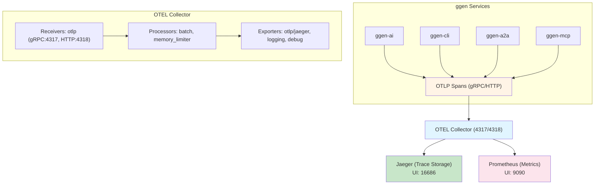
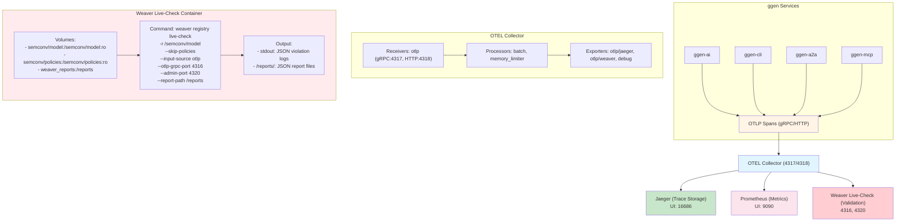
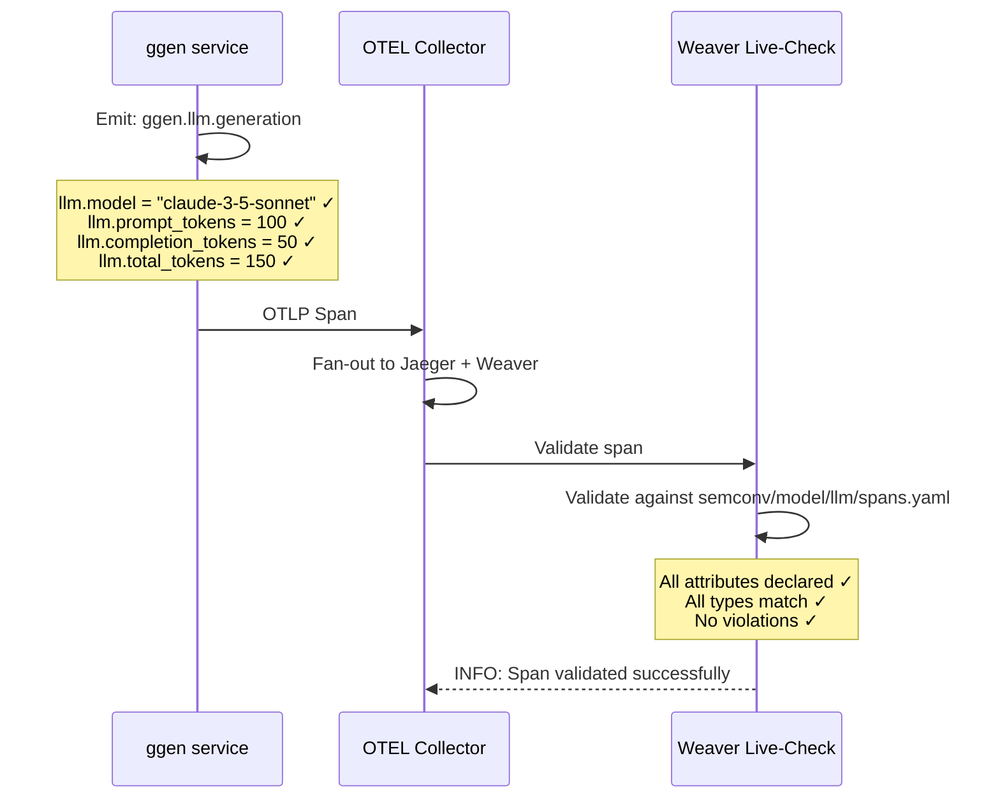
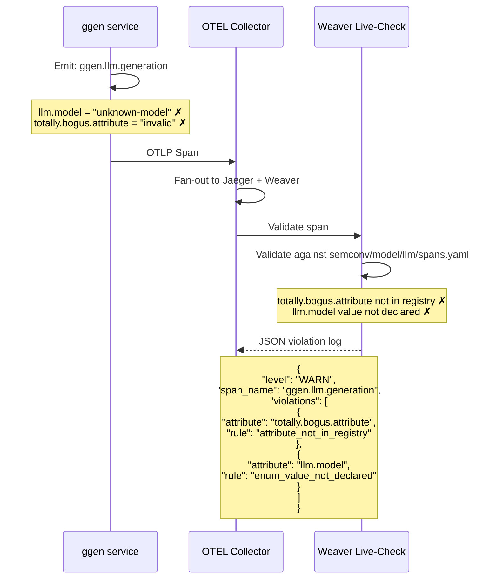
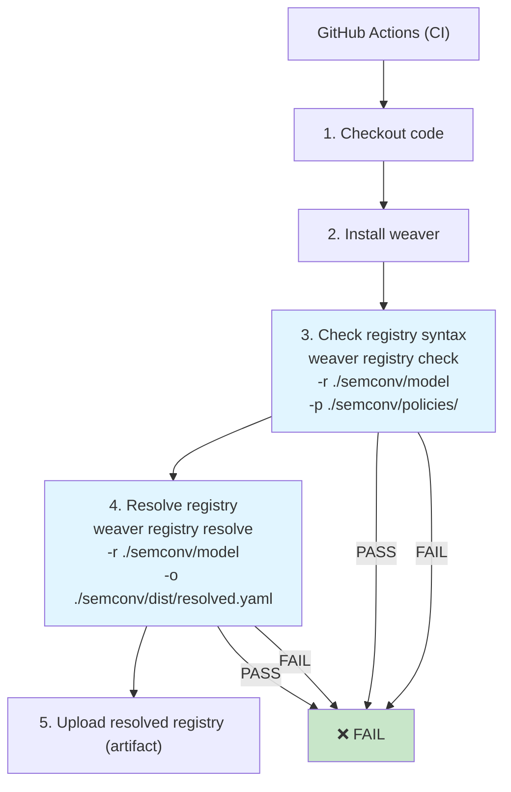
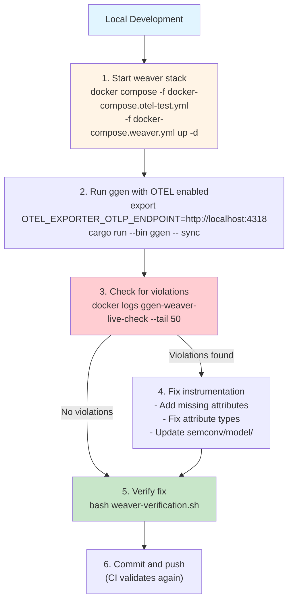
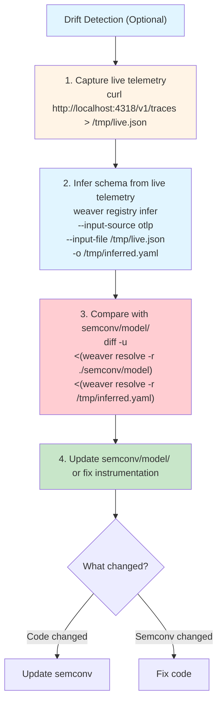

# Weaver Registry Integration - Architecture Diagrams

## Current State (ggen v6.0.1)



**Problem:** No validation of span attributes against schema.

---

## Target State (With Weaver Live-Check)



---

## Span Flow: Valid vs Invalid

### Valid Span (No Violations)



### Invalid Span (Violations)



---

## CI/CD Integration



---

## Development Workflow



---

## Drift Detection Workflow



---

## Key Integration Points

| Component | Port | Purpose | Health Check |
|-----------|------|---------|--------------|
| **OTEL Collector** | 4317 (gRPC), 4318 (HTTP) | Receive spans | `GET http://localhost:13133` |
| **Jaeger** | 16686 (UI) | Trace visualization | `GET http://localhost:16686` |
| **Weaver Live-Check** | 4316 (OTLP), 4320 (admin) | Validate spans | `GET http://localhost:4320/` |
| **Prometheus** | 9090 (UI) | Metrics | `GET http://localhost:9090/-/healthy` |

---

## File Structure

```
ggen/
├── docker/
│   └── weaver/
│       └── Dockerfile                 # NEW: Weaver container
│
├── semconv/
│   ├── model/
│   │   ├── manifest.yaml              # ✅ Already exists
│   │   ├── llm/                       # ✅ Already exists
│   │   ├── mcp/                       # ✅ Already exists
│   │   ├── pipeline/                  # ✅ Already exists
│   │   ├── yawl/                      # ✅ Already exists
│   │   ├── a2a/                       # ✅ Already exists
│   │   └── error/                     # ✅ Already exists
│   ├── policies/
│   │   └── ggen.rego                  # ✅ Already exists
│   └── dist/
│       └── resolved.yaml              # NEW: Generated by weaver
│
├── tests/integration/
│   ├── docker-compose.otel-test.yml   # ✅ Already exists
│   ├── docker-compose.weaver.yml      # NEW: Extend with weaver
│   ├── otel-collector-with-weaver.yaml # NEW: Collector config
│   └── weaver-verification.sh         # NEW: 12-test script
│
├── scripts/weaver/
│   ├── verify-semconv.sh              # NEW: Pre-commit hook
│   └── infer-drift.sh                 # NEW: Drift detection
│
├── .github/workflows/
│   └── weaver-check.yml               # NEW: CI workflow
│
└── docs/
    ├── weaver-integration-summary.md  # ✅ Created
    ├── weaver-registry-integration-plan.md  # ✅ Created
    └── how-to-weaver-live-check.md    # NEW: User guide
```

---

**End of Architecture Diagrams**
