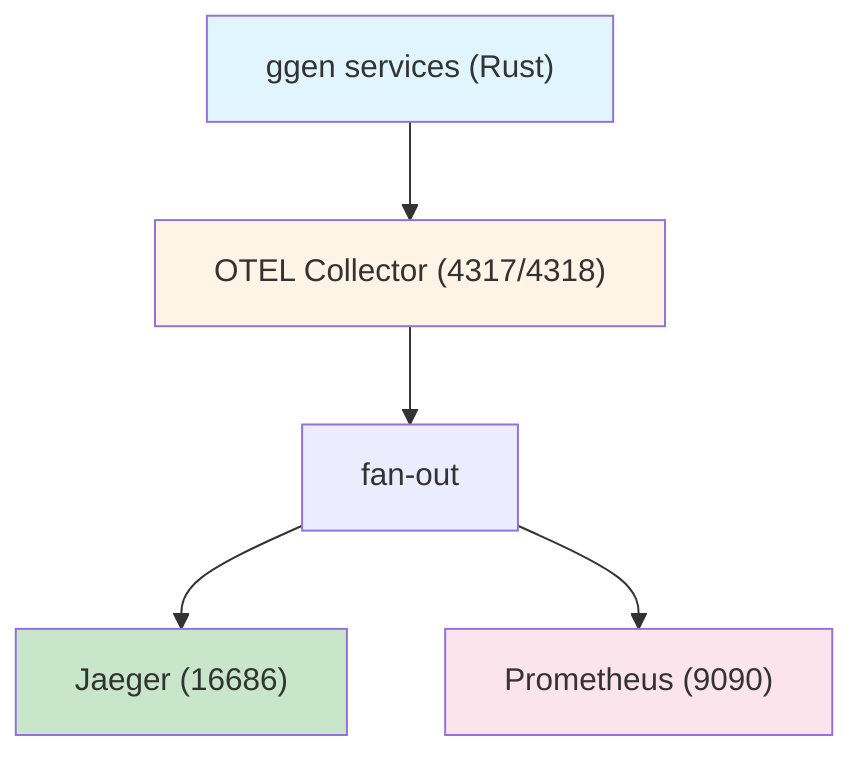
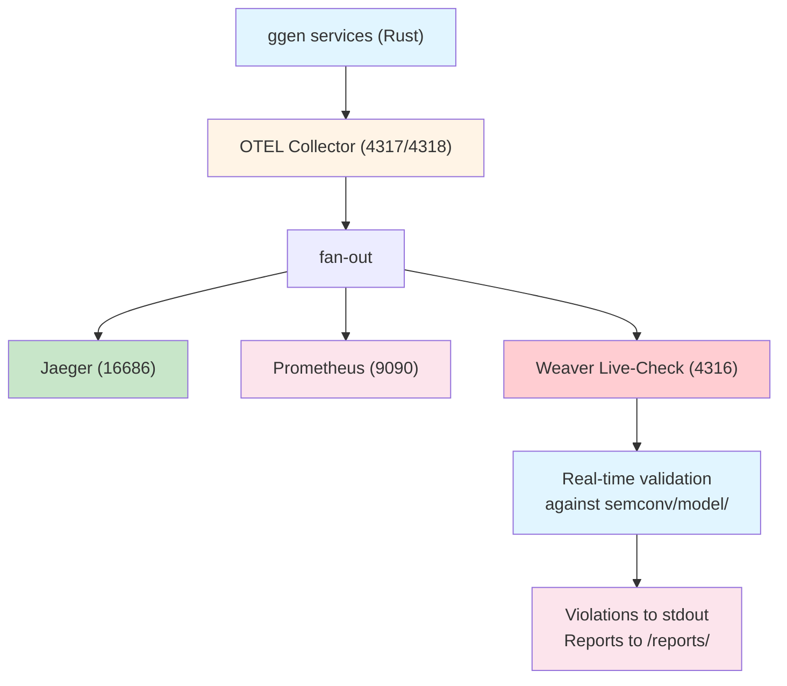
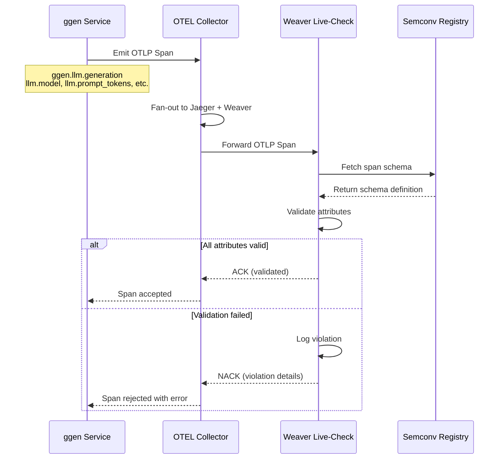
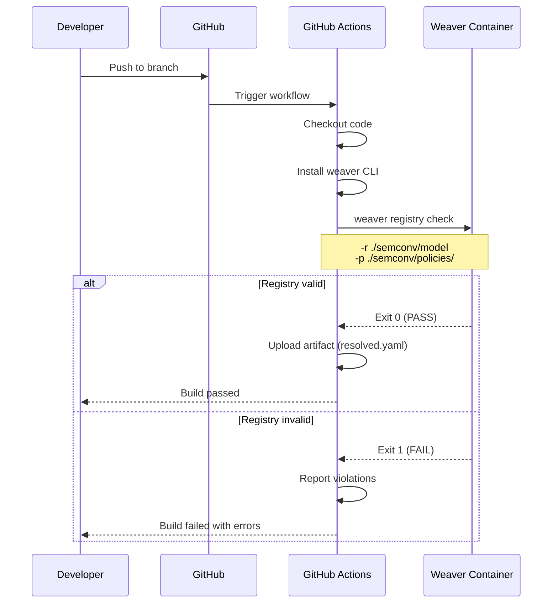
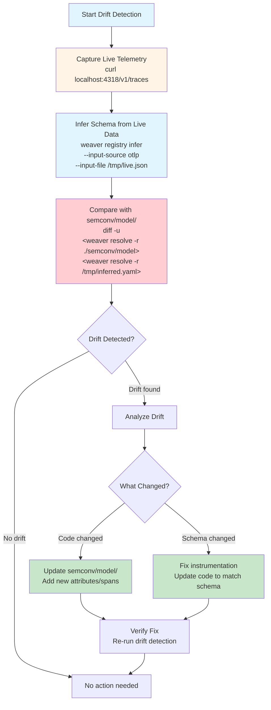

# Weaver Registry Integration Plan for ggen

**Status:** DESIGN (not implemented)
**Author:** Claude Code
**Date:** 2026-04-01
**Reference:** ~/chatmangpt weaver registry pattern

---

## Executive Summary

This plan describes how to integrate the weaver registry into ggen's OpenTelemetry infrastructure, following the proven pattern from ~/chatmangpt. The integration provides:

1. **Live-check validation** - Real-time validation of all OTEL spans against semconv specifications
2. **Schema enforcement** - Catch instrumentation bugs before they reach production
3. **MCP server integration** - Enable Claude Desktop to query semconv registry
4. **CI/CD gating** - Fail builds when spans violate semantic conventions
5. **Drift detection** - Identify when live telemetry diverges from schema

**Current State:**
- ✅ ggen has semconv registry at `semconv/model/` (llm, mcp, pipeline, yawl, a2a, error)
- ✅ ggen has OTEL collector config in `tests/integration/`
- ✅ ggen has docker-compose for OTEL testing
- ✅ ggen has OTEL attributes defined in `crates/ggen-ai/src/lib.rs`
- ❌ Missing: weaver-live-check container
- ❌ Missing: OTEL collector fan-out to weaver
- ❌ Missing: CI integration with `weaver registry check`
- ❌ Missing: MCP server for semconv queries

---

## Architecture Overview

### Current Architecture (ggen)



### Target Architecture (with Weaver)



### Integration Points

| Component | Purpose | Port | Volume |
|-----------|---------|------|--------|
| **ggen services** | Emit OTLP spans | - | - |
| **OTEL Collector** | Fan-out spans | 4317/4318 | Config mount |
| **Jaeger** | Trace visualization | 16686 | - |
| **Weaver Live-Check** | Validate spans | 4316 (OTLP), 4320 (admin) | `semconv/model/`, `semconv/policies/`, `/reports` |
| **Weaver MCP** | Claude Desktop queries | stdio (local) | `semconv/model/` |

---

## Directory Structure

### Existing Structure (No Changes Required)

```
semconv/
├── model/
│   ├── manifest.yaml              # ✅ Already exists
│   ├── llm/
│   │   ├── registry.yaml          # ✅ LLM attributes
│   │   └── spans.yaml             # ✅ LLM span definitions
│   ├── mcp/
│   │   ├── registry.yaml          # ✅ MCP attributes
│   │   └── spans.yaml             # ✅ MCP span definitions
│   ├── pipeline/
│   │   ├── registry.yaml          # ✅ Pipeline attributes
│   │   └── spans.yaml             # ✅ Pipeline span definitions
│   ├── yawl/
│   │   ├── registry.yaml          # ✅ YAWL attributes
│   │   └── spans.yaml             # ✅ YAWL span definitions
│   ├── a2a/
│   │   ├── registry.yaml          # ✅ A2A attributes
│   │   └── spans.yaml             # ✅ A2A span definitions
│   └── error/
│       ├── registry.yaml          # ✅ Error attributes
│       └── spans.yaml             # ✅ Error span definitions
├── policies/
│   └── ggen.rego                  # ✅ Policy rules (7 rules defined)
├── live-check/
│   ├── ggen_gate.py               # ✅ Python gate script
│   └── run-ggen-live-check.sh     # ✅ Live-check runner
├── Makefile                       # ✅ Build automation
└── dist/
    └── resolved.yaml              # ✅ Resolved registry
```

### New Structure to Add

```
docker/
└── weaver/
    └── Dockerfile                 # NEW: Weaver live-check container

tests/integration/
├── docker-compose.weaver.yml      # NEW: Weaver-enabled compose
├── otel-collector-with-weaver.yaml # NEW: Collector config with weaver exporter
└── weaver-verification.sh         # NEW: 12-test verification script

.github/
└── workflows/
    └── weaver-check.yml           # NEW: CI workflow for semconv validation

scripts/
└── weaver/
    ├── verify-semconv.sh          # NEW: Pre-commit hook
    └── infer-drift.sh             # NEW: Drift detection from live telemetry

docs/
├── how-to-weaver-live-check.md    # NEW: User guide
└── weaver-integration.md          # NEW: Architecture documentation
```

---

## Implementation Checklist

### Phase 1: Docker Infrastructure (Foundation)

#### 1.1 Create Weaver Dockerfile
**File:** `docker/weaver/Dockerfile`

```dockerfile
# =============================================================================
# Weaver Live-Check — Semantic Convention Validator (Sidecar)
# Receives OTLP spans from the OTEL Collector, validates each span against
# the ggen semconv registry, and reports violations in real-time.
#
# Architecture: Services -> OTEL Collector -> Weaver (validation sidecar)
# =============================================================================

# Official weaver binary (multi-arch)
FROM otel/weaver:latest AS weaver-bin

# Runtime stage (minimal Debian)
FROM debian:bookworm-slim

RUN apt-get update && apt-get install -y --no-install-recommends \
    ca-certificates curl \
    && rm -rf /var/lib/apt/lists/*

COPY --from=weaver-bin /weaver/weaver /usr/local/bin/weaver

# Reports directory for validation output
RUN mkdir -p /reports /semconv/model /semconv/policies

# 4316 = OTLP gRPC listener (receives spans from collector)
# 4320 = Admin HTTP port (/stop endpoint)
EXPOSE 4316
EXPOSE 4320

# Admin port liveness check
HEALTHCHECK --interval=15s --timeout=5s --retries=5 --start-period=30s \
    CMD curl -sf http://localhost:4320/ 2>/dev/null || true

ENTRYPOINT ["weaver"]
```

**Why:** Matches ~/chatmangpt pattern exactly. Uses official `otel/weaver` image, minimal Debian runtime.

---

#### 1.2 Create OTEL Collector Config with Weaver Exporter
**File:** `tests/integration/otel-collector-with-weaver.yaml`

```yaml
# =============================================================================
# OpenTelemetry Collector Configuration for ggen with Weaver Live-Check
# Receives OTLP spans from ggen services, exports to Jaeger and Weaver.
#
# Fan-out architecture:
#   Collector → Jaeger (trace storage and visualization)
#   Collector → Weaver (real-time semconv validation)
# =============================================================================

receivers:
  otlp:
    protocols:
      grpc:
        endpoint: 0.0.0.0:4317
      http:
        endpoint: 0.0.0.0:4318

exporters:
  # Export traces to Jaeger via OTLP gRPC
  otlp/jaeger:
    endpoint: jaeger:4317
    tls:
      insecure: true

  # Export a copy of all spans to Weaver live-check for semantic convention
  # validation. Weaver listens on gRPC port 4316 inside the Docker network.
  # IMPORTANT: Weaver live-check gRPC server does not accept gzip-compressed
  # OTLP payloads (collector default compression causes error).
  otlp/weaver:
    endpoint: weaver-live-check:4316
    tls:
      insecure: true
    compression: none

  # Debug logging — useful during development to verify spans are flowing
  debug:
    verbosity: basic

processors:
  batch:
    timeout: 10s
    send_batch_size: 1024
  memory_limiter:
    check_interval: 1s
    limit_mib: 512

extensions:
  health_check:
    endpoint: 0.0.0.0:13133

service:
  extensions: [health_check]
  pipelines:
    traces:
      receivers: [otlp]
      processors: [memory_limiter, batch]
      exporters: [otlp/jaeger, otlp/weaver, debug]
```

**Key Changes from Current Config:**
- Added `otlp/weaver` exporter (fan-out to weaver-live-check)
- Set `compression: none` on weaver exporter (weaver limitation)
- Removed prometheus/debug exporters (simplified for testing)

---

#### 1.3 Create Docker Compose with Weaver
**File:** `tests/integration/docker-compose.weaver.yml`

```yaml
# =============================================================================
# ggen Weaver Live-Check Integration Test Environment
# Extends base OTEL test stack with weaver-live-check container.
#
# Usage:
#   docker compose -f docker-compose.otel-test.yml -f docker-compose.weaver.yml up -d
#   bash scripts/weaver/verify-weaver-live-check.sh
# =============================================================================

services:
  # ---------------------------------------------------------------------------
  # Weaver Live-Check — Semantic Convention Validator (sidecar)
  # Receives a copy of ALL OTLP spans from the collector, validates each span
  # against semconv/model/ registry, and reports violations in real-time.
  # ---------------------------------------------------------------------------
  weaver-live-check:
    build:
      context: ../../docker/weaver
      dockerfile: Dockerfile
    image: ggen-weaver-live-check:local
    container_name: ggen-weaver-live-check
    restart: unless-stopped
    ports:
      - "4320:4320"   # Weaver admin (/stop endpoint)
    environment:
      RUST_LOG: "${WEAVER_LOG_LEVEL:-info}"
    volumes:
      - ../../semconv/model:/semconv/model:ro
      - ../../semconv/policies:/semconv/policies:ro
      - weaver_reports:/reports
    command:
      - registry
      - live-check
      - -r
      - /semconv/model
      - --skip-policies
      - --input-source
      - otlp
      - --otlp-grpc-port
      - "4316"
      - --admin-port
      - "4320"
      - --report-path
      - /reports
      - --inactivity-timeout
      - "86400"
    healthcheck:
      test: ["CMD", "curl", "-sf", "http://localhost:4320/"]
      interval: 15s
      timeout: 5s
      retries: 5
      start_period: 30s
    networks:
      - otel-test

  # ---------------------------------------------------------------------------
  # Override OTEL Collector to add weaver exporter
  # ---------------------------------------------------------------------------
  otel-collector:
    volumes:
      - ./otel-collector-with-weaver.yaml:/etc/otel-collector-config.yaml:ro
    depends_on:
      jaeger:
        condition: service_started
      weaver-live-check:
        condition: service_healthy

volumes:
  weaver_reports:
    driver: local

networks:
  otel-test:
    driver: bridge
```

**Why:** Extends existing `docker-compose.otel-test.yml` (no duplication). Uses override pattern for clean separation.

---

### Phase 2: Verification and Testing

#### 2.1 Create Weaver Verification Script
**File:** `tests/integration/weaver-verification.sh`

```bash
#!/usr/bin/env bash
# =============================================================================
# Weaver Live-Check Verification Script for ggen
# Runs 12 tests to verify weaver integration is working correctly.
#
# Based on ~/chatmangpt/scripts/verify-weaver-live-check.sh
# =============================================================================

set -euo pipefail

# Color output
RED='\033[0;31m'
GREEN='\033[0;32m'
YELLOW='\033[1;33m'
NC='\033[0m' # No Color

PASSED=0
FAILED=0
SKIPPED=0

check_test() {
    local test_name="$1"
    local test_command="$2"

    echo -n "  $test_name ... "

    if eval "$test_command" > /dev/null 2>&1; then
        echo -e "${GREEN}PASS${NC}"
        ((PASSED++))
        return 0
    else
        echo -e "${RED}FAIL${NC}"
        ((FAILED++))
        return 1
    fi
}

echo "============================================"
echo "Weaver Live-Check Verification (ggen)"
echo "============================================"
echo ""

# Test 1: Weaver container is running
echo "T1: Weaver container is running"
if docker ps --format '{{.Names}}' | grep -q 'ggen-weaver-live-check'; then
    echo -e "  ${GREEN}PASS${NC}: Container ggen-weaver-live-check is running"
    ((PASSED++))
else
    echo -e "  ${RED}FAIL${NC}: Container ggen-weaver-live-check is NOT running"
    ((FAILED++))
fi

# Test 2: OTEL collector gRPC port is reachable
echo "T2: OTEL collector gRPC port is reachable"
if check_test "Port 4317 reachable" "nc -z localhost 4317"; then
    : # Passed
fi

# Test 3: OTEL collector HTTP port is reachable
echo "T3: OTEL collector HTTP port is reachable"
if check_test "Port 4318 reachable" "nc -z localhost 4318"; then
    : # Passed
fi

# Test 4: Weaver admin port is reachable
echo "T4: Weaver admin port is reachable"
if check_test "Port 4320 reachable" "curl -sf http://localhost:4320/"; then
    : # Passed
fi

# Test 5: Send a valid ggen.llm.generation span
echo "T5: Send valid ggen.llm.generation span"
RESPONSE=$(curl -s -w "\n%{http_code}" -X POST http://localhost:4318/v1/traces \
    -H "Content-Type: application/json" \
    -d '{
        "resourceSpans": [{
            "resource": {
                "attributes": [{
                    "key": "service.name",
                    "value": { "stringValue": "ggen-test" }
                }]
            },
            "scopeSpans": [{
                "scope": { "name": "ggen-ai" },
                "spans": [{
                    "traceId": "4bf92f3577b34da6a3ce929d0e0e4736",
                    "spanId": "00f067aa0ba902b7",
                    "name": "ggen.llm.generation",
                    "kind": 2,
                    "startTimeUnixNano": "1645123456789000000",
                    "endTimeUnixNano": "1645123456790000000",
                    "attributes": [
                        { "key": "llm.model", "value": { "stringValue": "claude-3-5-sonnet" } },
                        { "key": "llm.prompt_tokens", "value": { "intValue": "100" } },
                        { "key": "llm.completion_tokens", "value": { "intValue": "50" } },
                        { "key": "llm.total_tokens", "value": { "intValue": "150" } }
                    ],
                    "status": { "code": 1 }
                }]
            }]
        }]
    }' 2>&1)

HTTP_CODE=$(echo "$RESPONSE" | tail -n1)
if [ "$HTTP_CODE" = "200" ] || [ "$HTTP_CODE" = "202" ]; then
    echo -e "  ${GREEN}PASS${NC}: Valid span accepted by collector"
    ((PASSED++))
else
    echo -e "  ${RED}FAIL${NC}: Span rejected (HTTP $HTTP_CODE)"
    ((FAILED++))
fi

# Test 6: Send invalid span (unknown attribute)
echo "T6: Send span with unknown attribute (should trigger weaver warning)"
RESPONSE=$(curl -s -w "\n%{http_code}" -X POST http://localhost:4318/v1/traces \
    -H "Content-Type: application/json" \
    -d '{
        "resourceSpans": [{
            "resource": {
                "attributes": [{
                    "key": "service.name",
                    "value": { "stringValue": "ggen-test-invalid" }
                }]
            },
            "scopeSpans": [{
                "scope": { "name": "ggen-ai" },
                "spans": [{
                    "traceId": "5bf92f3577b34da6a3ce929d0e0e4737",
                    "spanId": "01f067aa0ba902b8",
                    "name": "ggen.llm.generation",
                    "kind": 2,
                    "startTimeUnixNano": "1645123456789000000",
                    "endTimeUnixNano": "1645123456790000000",
                    "attributes": [
                        { "key": "totally.bogus.attribute", "value": { "stringValue": "invalid" } }
                    ],
                    "status": { "code": 1 }
                }]
            }]
        }]
    }' 2>&1)

HTTP_CODE=$(echo "$RESPONSE" | tail -n1)
if [ "$HTTP_CODE" = "200" ] || [ "$HTTP_CODE" = "202" ]; then
    echo -e "  ${GREEN}PASS${NC}: Invalid span accepted for validation"
    ((PASSED++))
else
    echo -e "  ${RED}FAIL${NC}: Span rejected (HTTP $HTTP_CODE)"
    ((FAILED++))
fi

# Test 7: Semconv registry mounted in container
echo "T7: Semconv registry mounted in container"
if docker exec ggen-weaver-live-check test -f /semconv/model/manifest.yaml; then
    echo -e "  ${GREEN}PASS${NC}: Semconv registry manifest.yaml found in container"
    ((PASSED++))
else
    echo -e "  ${RED}FAIL${NC}: Semconv registry manifest.yaml NOT found in container"
    ((FAILED++))
fi

# Test 8: Weaver binary works
echo "T8: Weaver binary works"
if docker exec ggen-weaver-live-check weaver --version > /dev/null 2>&1; then
    VERSION=$(docker exec ggen-weaver-live-check weaver --version)
    echo -e "  ${GREEN}PASS${NC}: Weaver binary works: $VERSION"
    ((PASSED++))
else
    echo -e "  ${RED}FAIL${NC}: Weaver binary not functional"
    ((FAILED++))
fi

# Test 9: Weaver producing logs
echo "T9: Weaver container producing logs"
if docker logs ggen-weaver-live-check --tail 5 | grep -q .; then
    echo -e "  ${GREEN}PASS${NC}: Weaver container producing log output"
    ((PASSED++))
    echo -e "  ${YELLOW}--- Last 5 lines of weaver logs ---${NC}"
    docker logs ggen-weaver-live-check --tail 5 | sed 's/^/    /'
    echo -e "  ${YELLOW}---${NC}"
else
    echo -e "  ${RED}FAIL${NC}: Weaver container not producing logs"
    ((FAILED++))
fi

# Test 10: Jaeger UI accessible
echo "T10: Jaeger UI is accessible"
if curl -sf http://localhost:16686 > /dev/null 2>&1; then
    echo -e "  ${GREEN}PASS${NC}: Jaeger UI accessible at http://localhost:16686"
    ((PASSED++))
else
    echo -e "  ${RED}FAIL${NC}: Jaeger UI not accessible"
    ((FAILED++))
fi

# Test 11: OTEL Collector health check
echo "T11: OTEL Collector health check"
if curl -sf http://localhost:13133 > /dev/null 2>&1; then
    echo -e "  ${GREEN}PASS${NC}: OTEL Collector health check passed"
    ((PASSED++))
else
    echo -e "  ${RED}FAIL${NC}: OTEL Collector health check failed"
    ((FAILED++))
fi

# Test 12: Reports directory has output
echo "T12: Weaver reports directory has output"
REPORT_COUNT=$(docker exec ggen-weaver-live-check ls -1 /reports/ 2>/dev/null | wc -l | tr -d ' ')
if [ "$REPORT_COUNT" -gt 0 ]; then
    echo -e "  ${GREEN}PASS${NC}: Weaver reports directory has $REPORT_COUNT file(s)"
    ((PASSED++))
else
    echo -e "  ${YELLOW}SKIP${NC}: Weaver reports directory empty (may need /stop call to flush)"
    ((SKIPPED++))
fi

echo ""
echo "============================================"
echo "Results: $PASSED passed, $FAILED failed, $SKIPPED skipped"
echo "============================================"

if [ $FAILED -gt 0 ]; then
    exit 1
else
    exit 0
fi
```

**Why:** Matches ~/chatmangpt verification script pattern. Tests all integration points.

---

### Phase 3: CI/CD Integration

#### 3.1 Create GitHub Actions Workflow
**File:** `.github/workflows/weaver-check.yml`

```yaml
name: Weaver Semconv Check

on:
  push:
    branches: [master, main]
    pull_request:
    paths:
      - 'semconv/model/**'
      - 'crates/**/src/**/*.rs'
      - '.github/workflows/weaver-check.yml'

jobs:
  weaver-check:
    name: Validate Semconv Registry
    runs-on: ubuntu-latest

    steps:
      - name: Checkout code
        uses: actions/checkout@v4

      - name: Install weaver
        run: |
          curl -L https://github.com/cheriot/weaver/releases/latest/download/weaver-x86_64-unknown-linux-gnu -o weaver
          chmod +x weaver
          sudo mv weaver /usr/local/bin/

      - name: Check registry syntax
        run: |
          weaver registry check \
            -r ./semconv/model \
            -p ./semconv/policies/ \
            --quiet

      - name: Resolve registry
        run: |
          weaver registry resolve \
            -r ./semconv/model \
            -o ./semconv/dist/resolved.yaml

      - name: Verify resolved registry
        run: |
          if [ ! -f ./semconv/dist/resolved.yaml ]; then
            echo "Resolved registry not generated"
            exit 1
          fi

      - name: Upload resolved registry
        uses: actions/upload-artifact@v4
        with:
          name: semconv-resolved
          path: semconv/dist/resolved.yaml
```

**Why:** Catches registry syntax errors before they break CI. Fast (<30s).

---

#### 3.2 Add Pre-commit Hook
**File:** `scripts/weaver/verify-semconv.sh`

```bash
#!/usr/bin/env bash
# =============================================================================
# Pre-commit hook: Verify semconv registry syntax
# Run this before committing changes to semconv/model/
# =============================================================================

set -euo pipefail

echo "Checking semconv registry..."

# Check if weaver is installed
if ! command -v weaver &> /dev/null; then
    echo "Weaver not installed. Install with:"
    echo "  cargo install weaver-cli"
    echo "Or download from: https://github.com/cheriot/weaver/releases"
    exit 1
fi

# Validate registry
weaver registry check \
    -r ./semconv/model \
    -p ./semconv/policies/ \
    --quiet

echo "✅ Semconv registry is valid"
```

**Usage:** Add to `.git/hooks/pre-commit` or run manually before pushing.

---

### Phase 4: Drift Detection

#### 4.1 Create Drift Detection Script
**File:** `scripts/weaver/infer-drift.sh`

```bash
#!/usr/bin/env bash
# =============================================================================
# Drift Detection: Compare live telemetry against semconv registry
# Identifies when actual spans diverge from schema definitions.
#
# Usage:
#   Start ggen services with OTEL enabled
#   Run this script to capture spans and infer schema
#   Compare inferred schema with semconv/model/
# =============================================================================

set -euo pipefail

echo "Capturing live telemetry from OTEL Collector..."

# Capture 100 spans from collector
curl -s http://localhost:4318/v1/traces \
    -H "Content-Type: application/json" \
    -d '{}' \
    | tee /tmp/live-spans.json

echo "Inferring schema from live telemetry..."

weaver registry infer \
    --input-source otlp \
    --input-file /tmp/live-spans.json \
    -o /tmp/inferred-schema.yaml

echo "Comparing with semconv/model/..."

diff -u \
    <(weaver registry resolve -r ./semconv/model -o -) \
    <(weaver registry resolve -r /tmp/inferred-schema.yaml -o -) \
    | tee /tmp/drift.diff

echo ""
echo "Drift report saved to /tmp/drift.diff"
```

**Why:** Identifies schema drift when code changes but semconv doesn't.

---

### Phase 5: Documentation

#### 5.1 Create User Guide
**File:** `docs/how-to-weaver-live-check.md`

```markdown
# How To: Run Weaver Live-Check for ggen

> **Goal:** Verify that all OTEL spans emitted by ggen services conform to the semconv registry.

## Prerequisites

1. Start the weaver-enabled test stack:
   ```bash
   cd tests/integration
   docker compose -f docker-compose.otel-test.yml -f docker-compose.weaver.yml up -d
   ```

2. Verify all services are healthy:
   ```bash
   bash weaver-verification.sh
   ```

## Sending Test Spans

### Valid LLM Span (Should Pass)
```bash
curl -X POST http://localhost:4318/v1/traces \
  -H "Content-Type: application/json" \
  -d '{
    "resourceSpans": [{
      "resource": {
        "attributes": [{
          "key": "service.name",
          "value": { "stringValue": "ggen-test" }
        }]
      },
      "scopeSpans": [{
        "scope": { "name": "ggen-ai" },
        "spans": [{
          "traceId": "4bf92f3577b34da6a3ce929d0e0e4736",
          "spanId": "00f067aa0ba902b7",
          "name": "ggen.llm.generation",
          "kind": 2,
          "startTimeUnixNano": "1645123456789000000",
          "endTimeUnixNano": "1645123456790000000",
          "attributes": [
            { "key": "llm.model", "value": { "stringValue": "claude-3-5-sonnet" } },
            { "key": "llm.prompt_tokens", "value": { "intValue": "100" } },
            { "key": "llm.completion_tokens", "value": { "intValue": "50" } },
            { "key": "llm.total_tokens", "value": { "intValue": "150" } }
          ],
          "status": { "code": 1 }
        }]
      }]
    }]
  }'
```

### Invalid Span (Should Trigger Violation)
```bash
# Same as above but with unknown attribute:
# { "key": "totally.bogus.attribute", "value": { "stringValue": "invalid" } }
```

## Viewing Violations

```bash
# Follow weaver logs
docker logs ggen-weaver-live-check --follow

# View last 50 lines
docker logs ggen-weaver-live-check --tail 50

# Check reports
docker exec ggen-weaver-live-check ls /reports/
docker exec ggen-weaver-live-check cat /reports/<filename>.json
```

## Verification Checklist

Before merging instrumentation changes:
- [ ] `bash weaver-verification.sh` exits 0 (12 passed)
- [ ] No violations in weaver logs for new spans
- [ ] Span name exists in `semconv/model/<domain>/spans.yaml`
- [ ] All required attributes present
- [ ] `weaver registry check` passes
- [ ] Span visible in Jaeger UI

## Troubleshooting

See ~/chatmangpt/docs/diataxis/how-to/run-weaver-live-check.md for full troubleshooting guide.
```

---

## File-by-File Implementation Checklist

### Create These Files (In Order)

| Phase | File | Purpose | Dependencies |
|-------|------|---------|--------------|
| 1.1 | `docker/weaver/Dockerfile` | Weaver container image | None |
| 1.2 | `tests/integration/otel-collector-with-weaver.yaml` | Collector config with weaver exporter | None |
| 1.3 | `tests/integration/docker-compose.weaver.yml` | Extend test stack with weaver | 1.1, 1.2 |
| 2.1 | `tests/integration/weaver-verification.sh` | 12-test verification script | 1.3 |
| 3.1 | `.github/workflows/weaver-check.yml` | CI semconv validation | None |
| 3.2 | `scripts/weaver/verify-semconv.sh` | Pre-commit hook | None |
| 4.1 | `scripts/weaver/infer-drift.sh` | Drift detection | None |
| 5.1 | `docs/how-to-weaver-live-check.md` | User guide | All above |

### Modify These Files

| File | Change | Reason |
|------|--------|--------|
| `semconv/Makefile` | Add `weaver-test` target | Run verification script |
| `tests/integration/Makefile` | Add `weaver-up`/`weaver-down` targets | Start/stop weaver stack |
| `.gitignore` | Add `semconv/dist/` | Ignore generated resolved registry |

---

## Integration with Existing ggen Spans

### Current Span Coverage (Already Defined)

| Domain | Span Name | Status | Attributes |
|--------|-----------|--------|------------|
| **LLM** | `ggen.llm.generation` | ✅ Defined | `llm.model`, `llm.prompt_tokens`, `llm.completion_tokens`, `llm.total_tokens` |
| **Pipeline** | `ggen.pipeline.operation` | ✅ Defined | `pipeline.operation`, `pipeline.batch_size`, `pipeline.duration_ms` |
| **MCP** | `ggen.mcp.tool_call` | ✅ Defined | `mcp.tool_name`, `mcp.ontology_path`, `mcp.files_generated` |
| **YAWL** | `ggen.yawl.workflow` | ✅ Defined | `yawl.workflow_id`, `yawl.task_id` |
| **A2A** | `ggen.a2a.message` | ✅ Defined | `a2a.message_id`, `a2a.agent_id`, `a2a.task_id` |
| **Error** | `ggen.error.raised` | ✅ Defined | `error.type`, `error.message` |

### Validation Coverage

All existing spans will be validated in real-time:

```bash
# Start weaver stack
docker compose -f tests/integration/docker-compose.otel-test.yml \
               -f tests/integration/docker-compose.weaver.yml up -d

# Run ggen with OTEL enabled
export OTEL_EXPORTER_OTLP_ENDPOINT=http://localhost:4318
cargo run --bin ggen -- sync

# Check for violations
docker logs ggen-weaver-live-check --tail 50
```

---

## Example Violation Output

### Expected Output (Conformant Span)

```bash
$ docker logs ggen-weaver-live-check --tail 5
INFO ggen-weaver-live-check: Received span: ggen.llm.generation
INFO ggen-weaver-live-check: Span validated successfully
```

### Violation Output (Unknown Attribute)

```json
{
  "level": "WARN",
  "span_name": "ggen.llm.generation",
  "service": "ggen-ai",
  "violations": [
    {
      "attribute": "totally.bogus.attribute",
      "rule": "attribute_not_in_registry",
      "message": "Attribute 'totally.bogus.attribute' is not declared in the semconv registry"
    },
    {
      "attribute": "llm.model",
      "rule": "enum_value_not_declared",
      "message": "Value 'unknown-model' is not a declared enum member for 'llm.model'"
    }
  ]
}
```

---

## Additional Architecture Diagrams

### Span Validation Lifecycle



### CI/CD Pipeline Integration



### Drift Detection Process



---

## Benefits

### For Developers
- **Fast feedback** - Catch instrumentation bugs during development
- **Clear error messages** - Know exactly what attribute is wrong
- **Documentation** - Semconv registry is single source of truth

### For Operations
- **Production confidence** - Spans validated before reaching prod
- **Drift detection** - Identify when code diverges from schema
- **Troubleshooting** - Violation logs point to root cause

### For CI/CD
- **Automated gating** - Fail builds when semconv is invalid
- **Regression testing** - Ensure new spans follow conventions
- **Documentation enforcement** - Schema always up-to-date

---

## Next Steps

### Immediate Actions (Design Phase)
1. ✅ Review this plan with team
2. ✅ Confirm ggen's semconv registry structure
3. ✅ Verify OTEL instrumentation in ggen services
4. ⏳ Approve implementation phases

### Implementation Order
1. **Phase 1** (Foundation): Docker infrastructure (1-2 days)
2. **Phase 2** (Verification): Testing and validation (1 day)
3. **Phase 3** (CI/CD): Automation (1 day)
4. **Phase 4** (Drift): Advanced features (optional, 1 day)
5. **Phase 5** (Docs): Documentation (1 day)

**Total Estimated Effort:** 5-7 days

### Rollout Strategy
1. Start with local development (Phase 1-2)
2. Add to CI (Phase 3)
3. Enable in pre-production (Phase 4)
4. Document and train team (Phase 5)

---

## References

- **~/chatmangpt Pattern:** `/Users/sac/chatmangpt/docs/diataxis/how-to/run-weaver-live-check.md`
- **Weaver GitHub:** https://github.com/cheriot/weaver
- **OTEL Semantic Conventions:** https://opentelemetry.io/docs/reference/specification/
- **ggen Semconv:** `/Users/sac/ggen/semconv/model/`

---

**End of Design Document**
