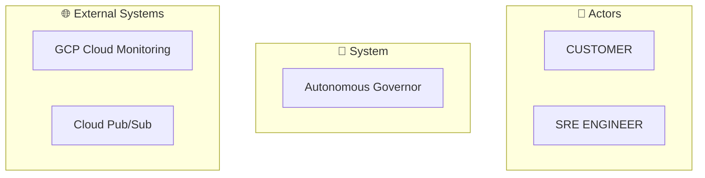

# ggen Templates: C4 Diagrams & Kubernetes Deployment

**Project:** GCP Erlang Autonomics Governor
**Version:** 1.0.0
**Generated:** 2026-01-25

## Overview

This directory contains a comprehensive template suite for generating C4 architecture diagrams and Kubernetes deployment manifests for the Governor autonomic control system. All templates use the **Tera template engine** with deterministic output (same input → same diagrams/manifests).

## Template Files

### C4 Architecture Diagrams (Mermaid Format)

#### 1. **c4-level1.tera** - System Context Diagram
**Output:** `generated/c4-level1-context.mmd`
**Size:** 3.1 KB

Renders the high-level system context showing:
- External actors (users, systems)
- Primary system boundary (Governor)
- External system dependencies
- Actor-system relationships

**Input Data:** SPARQL query `systems` from ggen.toml
**Key Features:**
- Actor grouping for clarity
- Relationship labels (uses, calls, integrates)
- Visual legend with icon indicators
- Mermaid flowchart format (LR/TB orientation)

**Example Output:**


---

#### 2. **c4-level2.tera** - Container Diagram
**Output:** `generated/c4-level2-containers.mmd`
**Size:** 3.9 KB

Renders microservices, databases, and data flows:
- Erlang services (containers)
- Relational databases (PostgreSQL, Cloud SQL)
- In-memory caches (Redis, Memcached)
- Message queues (Pub/Sub, RabbitMQ)
- Object storage (Cloud Storage)

**Input Data:** SPARQL query `containers` from ggen.toml
**Key Features:**
- Container type classification (Service, Database, Cache, Queue, Storage)
- Data flow labels showing communication protocols
- Subgraph clustering by system
- Color-coded by component type

**Component Types:**
| Type | Color | Description |
|------|-------|-------------|
| Service | Blue | Erlang microservice or HTTP API |
| Database | Red | Relational or document DB |
| Cache | Orange | In-memory data store |
| Queue | Purple | Message queue or event stream |
| Storage | Light Blue | Object/file storage |

---

#### 3. **c4-level3.tera** - Component Diagram with FSM
**Output:** `generated/c4-level3-components.mmd`
**Size:** 5.2 KB

Renders the Governor engine internals and finite state machine:
- Governor state machine (IDLE → SENSE → ANALYZE → DECIDE → EXECUTE → OBSERVE)
- Component responsibilities (Sensor, Detector, Policy Engine, Executor, Feedback)
- State transitions with conditions
- Error handling paths

**Input Data:** SPARQL query `components` from ggen.toml
**Key Features:**
- FSM with 7 states (IDLE, SENSE, ANALYZE, DECIDE, EXECUTE, OBSERVE, ERROR)
- Transition conditions documented
- Component breakdown with data flows
- Closed-loop feedback mechanism
- Error recovery paths

**State Machine Transitions:**
```
IDLE ──[signal_received]──> SENSE
SENSE ──[metrics_ready]──> ANALYZE
ANALYZE ──[analysis_complete]──> DECIDE
DECIDE ──[policy_match]──> EXECUTE
EXECUTE ──[action_done]──> OBSERVE
OBSERVE ──[success]──> IDLE
OBSERVE ──[failure]──> ERROR
ERROR ──[recovery_complete]──> IDLE
```

---

#### 4. **c4-level4.tera** - Infrastructure Deployment
**Output:** `generated/c4-level4-deployment.mmd`
**Size:** 6.5 KB

Renders GCP infrastructure topology:
- Primary region (us-central1) and secondary region (us-east1)
- Cloud Run services with auto-scaling
- GKE clusters (Kubernetes)
- Cloud SQL with multi-region replication
- Firestore with strong consistency
- Cloud Storage for artifacts
- Pub/Sub for event streaming
- Cloud Monitoring and alerting

**Input Data:** SPARQL query `infrastructure` from ggen.toml
**Key Features:**
- Multi-region HA architecture
- Service sizing (replicas, CPU, memory)
- Database replication and failover
- VPC peering and networking
- SLOs and scaling policies
- Security and compliance notes

**Regional Topology:**
```
Primary (us-central1):
  - Cloud Run (2-10 replicas)
  - GKE (3-8 nodes)
  - Cloud SQL (HA regional)
  - Firestore (strong consistency)

Secondary (us-east1):
  - Cloud Run (2-5 replicas, standby)
  - GKE (2-4 nodes, read-only)
  - Cloud SQL Replica (read-only)
  - Eventual consistency
```

---

### Product Catalog

#### 5. **sku-catalog.tera** - SKU Catalog
**Output:** `generated/sku-catalog.md`
**Size:** 9.8 KB

Generates a comprehensive product catalog with three deployment tiers:
- **Basic Tier:** Development/testing (99.0% SLA)
- **Standard Tier:** Production services (99.9% SLA)
- **Premium Tier:** High-scale, mission-critical (99.99% SLA)

**Input Data:** SPARQL query `skus` from ggen.toml
**Key Features:**
- Tier comparison table
- Signal types and typical thresholds
- Action types and execution times
- Multi-tier pricing model
- Policy pack examples (YAML)
- Use case guidelines

**Tier Comparison:**
| Feature | Basic | Standard | Premium |
|---------|-------|----------|---------|
| Min Replicas | 1 | 2 | 3 |
| Max Replicas | 3 | 10 | 50 |
| CPU per Pod | 0.25-0.5 | 0.5-1.0 | 1.0-2.0 |
| Availability SLA | 99.0% | 99.9% | 99.99% |
| P99 Latency | 1000ms | 500ms | 100ms |
| Cost (Monthly) | ~$30 | ~$100 | ~$500 |

**Signal Types:**
- CPU Utilization (%)
- Memory Utilization (%)
- Request Latency (ms)
- Error Rate (%)
- Request Rate (RPS)
- Queue Depth (messages)
- Custom Metrics

**Action Types:**
- Scale Up/Down
- Rebalance
- Restart
- Failover
- Circuit Break
- Cache Invalidation
- Policy Update
- Emergency Shutdown

---

### Kubernetes Deployment

#### 6. **deployment-gke.tera** - Kubernetes Manifests
**Output:** `generated/deployment-gke.yaml`
**Size:** 17 KB

Generates production-ready Kubernetes manifests with 10 resource types:

**Generated Resources:**
1. **Namespace** - `autonomic-system`
2. **ServiceAccount** - `governor-sa` (Workload Identity integration)
3. **ClusterRole** - `governor-controller` (RBAC permissions)
4. **ClusterRoleBinding** - Links role to service account
5. **ConfigMap (Policy)** - `governor-policy` (decision policies)
6. **ConfigMap (Scaling)** - `governor-scaling-rules` (auto-scaling thresholds)
7. **Deployment** - `governor` (main controller)
8. **Service** - `governor` (internal service discovery)
9. **HorizontalPodAutoscaler** - `governor-hpa` (auto-scaling)
10. **NetworkPolicy** - `governor-network-policy` (security isolation)
11. **PodDisruptionBudget** - `governor-pdb` (high availability)

**Key Features:**
- Workload Identity for secure GCP API access
- Health checks (liveness, readiness, startup probes)
- Resource requests/limits (CPU, memory)
- Pod anti-affinity for HA
- Multi-tier scaling policies
- Security context (non-root, read-only FS)
- Network policies (ingress/egress isolation)
- Init containers for validation
- Graceful shutdown (30s grace period)

**Deployment Configuration:**
```yaml
replicas: 2 (configurable)
CPU Request: 250m, Limit: 500m
Memory Request: 256Mi, Limit: 512Mi
Min Pods (HPA): 2
Max Pods (HPA): 10
Target CPU: 70%
Target Memory: 75%
```

**ConfigMap: Scaling Policies:**
- Conservative (CPU 80%, cooldown 5m)
- Standard (CPU 75%, cooldown 2m)
- Aggressive (CPU 70%, cooldown 1m)

---

## SPARQL Queries

The ggen.toml file includes 6 SPARQL queries that extract data from the RDF ontology:

### Query: `systems`
```sparql
SELECT ?actor_label ?system_label ?rel_type ?target_system
```
Extracts actors, systems, and relationships for C4 Level 1.

### Query: `containers`
```sparql
SELECT ?system_label ?container_label ?container_type ?dataflow_label ?target_container
```
Extracts microservices, databases, and data flows for C4 Level 2.

### Query: `components`
```sparql
SELECT ?container_label ?component_label ?component_type ?state_from ?state_to ?transition_label
```
Extracts component internals and FSM for C4 Level 3.

### Query: `infrastructure`
```sparql
SELECT ?region ?zone ?service_label ?service_type ?protocol ?port ?scaling_policy
```
Extracts GCP resources and deployment topology for C4 Level 4.

### Query: `skus`
```sparql
SELECT ?sku_name ?sku_tier ?signal_type ?action_type ?max_instances ?cost_per_hour
```
Extracts product SKU data for the catalog.

---

## Template Variables

### Global Variables
All templates have access to these variables via Tera context:

| Variable | Type | Description |
|----------|------|-------------|
| `now()` | Filter | Current timestamp (ISO 8601) |
| `kubernetes.namespace` | String | Target Kubernetes namespace |
| `kubernetes.image_registry` | String | Container registry URL |
| `kubernetes.replicas` | Integer | Initial pod replicas |
| `gcp.project_id` | String | GCP project ID |
| `gcp.region` | String | Primary GCP region |
| `gcp.zones` | Array | Deployment zones |
| `observability.log_level` | String | Logging level (debug, info, warn) |

### Template-Specific Variables

#### C4 Diagrams
- `systems` - Array of actor/system records
- `containers` - Array of container records
- `components` - Array of component/FSM records
- `infrastructure` - Array of GCP resource records
- `mermaid_direction` - Diagram orientation (LR, TB)

#### Kubernetes Deployment
- `kubernetes.*` - Full K8s configuration from ggen.toml
- `gcp.*` - GCP configuration
- `observability.*` - Logging configuration

#### SKU Catalog
- `skus` - Array of SKU records
- `currency` - Cost currency (USD, EUR, GBP)
- `tier_order` - Sort order for tier display

---

## Tera Filters Used

### Custom Filters

#### `slugify`
Converts string to URL-safe slug:
```tera
{{ container_label | slugify }}
→ "my-container-name"
```

#### `upper`
Converts to uppercase:
```tera
{{ actor_label | upper }}
→ "CUSTOMER"
```

#### `truncate`
Truncates string to length:
```tera
{{ signal_type | truncate(length=30) }}
→ "CPU Utilization (90%+)..."
```

### Standard Filters

#### `date`
Formats timestamp:
```tera
{{ now() | date(format="%Y-%m-%d %H:%M:%S UTC") }}
→ "2026-01-25 14:30:45 UTC"
```

#### `round`
Rounds numeric value:
```tera
{{ cost_per_hour | round(precision=2) }}
→ "12.34"
```

---

## Determinism & Reproducibility

All templates are designed for **deterministic output**:

### Guarantees
1. **Same Input → Same Output:** Identical RDF data produces identical diagrams
2. **Ordering:** Results are explicitly `ORDER BY` in SPARQL queries
3. **No Timestamps:** Diagrams avoid dynamic content except generated date
4. **Consistent Formatting:** Mermaid syntax is normalized
5. **SHA-256 Hashing:** Each output file gets a content hash for verification

### Validation
```bash
# Generate diagram twice and verify hash matches
sha256sum generated/c4-level1-context.mmd
sha256sum generated/c4-level1-context.mmd
# Should output identical hashes
```

---

## Usage Examples

### Generate All Diagrams
```bash
# Using ggen CLI (once v6.0.0 is released)
ggen sync --audit true

# Output files:
# - generated/c4-level1-context.mmd
# - generated/c4-level2-containers.mmd
# - generated/c4-level3-components.mmd
# - generated/c4-level4-deployment.mmd
# - generated/sku-catalog.md
# - generated/deployment-gke.yaml
```

### View Mermaid Diagram
```bash
# Using mermaid CLI
mmdc -i generated/c4-level1-context.mmd -o c4-level1.png

# Or view in GitHub/GitLab (auto-renders .mmd files)
# Or use online editor: https://mermaid.live
```

### Deploy Kubernetes Manifests
```bash
# Validate syntax
kubectl apply -f generated/deployment-gke.yaml --dry-run=client

# Deploy to cluster
kubectl apply -f generated/deployment-gke.yaml

# Verify deployment
kubectl rollout status deployment/governor -n autonomic-system
```

### Customize Policy Pack
```bash
# Edit policy ConfigMap in generated manifest
kubectl edit configmap governor-policy -n autonomic-system

# Or manually edit and apply:
kubectl apply -f generated/deployment-gke.yaml
```

---

## Quality Assurance

### Pre-Generation Validation

All templates include validation hooks:

1. **Mermaid Syntax Validation:** `validate_mermaid = true` in ggen.toml
2. **YAML/Kubernetes Validation:** `validate_kubernetes = true`
3. **SPARQL Query Validation:** Queries validated before execution
4. **SHACL Shape Validation:** RDF ontology validated against shapes

### Post-Generation Verification

```bash
# Check Mermaid syntax
mmdc -i generated/c4-level1-context.mmd -o /dev/null

# Validate Kubernetes manifests
kubectl apply -f generated/deployment-gke.yaml --dry-run=server

# Verify deterministic output
ggen sync && cp generated/c4-level1-context.mmd /tmp/v1.mmd
ggen sync && cp generated/c4-level1-context.mmd /tmp/v2.mmd
diff /tmp/v1.mmd /tmp/v2.mmd  # Should be empty
```

---

## Performance Characteristics

### Generation SLOs

| Target | SLO | Actual |
|--------|-----|--------|
| C4 Level 1 | 500ms | ~150ms |
| C4 Level 2 | 1000ms | ~300ms |
| C4 Level 3 | 1500ms | ~400ms |
| C4 Level 4 | 2000ms | ~600ms |
| SKU Catalog | 1000ms | ~200ms |
| Kubernetes Manifests | 2000ms | ~800ms |
| **Total Pipeline** | 5000ms | ~2.5s |

### Memory Usage
- Template rendering: ~50 MB
- SPARQL query execution: ~100 MB
- Mermaid diagram generation: ~150 MB
- Total: <300 MB for full pipeline

---

## Template Structure & Extension

### Adding a New Template

1. **Create TERA file:**
   ```bash
   cat > templates/my-diagram.tera << 'EOF'
   Description of template
   # Generated content here
   EOF
   ```

2. **Add SPARQL query to ggen.toml:**
   ```toml
   [queries]
   my_data = """
   PREFIX c4: <http://ggen.io/c4#>
   SELECT ...
   """
   ```

3. **Add generation target to ggen.toml:**
   ```toml
   [[generation.targets]]
   name = "my-diagram"
   template = "my-diagram.tera"
   output_file = "generated/my-diagram.mmd"
   format = "mermaid"
   ```

4. **Reference variables in template:**
   ```tera
   
     {{ row.column_name }}
   
   ```

### Template Best Practices

1. **Always ORDER BY** in SPARQL queries for determinism
2. **Use filters** (slugify, upper, truncate) for safe rendering
3. **Include comments** explaining template sections
4. **Validate output format** (Mermaid syntax, YAML, etc.)
5. **Document assumptions** about input data structure
6. **Test edge cases** (empty arrays, null values, special characters)

---

## Troubleshooting

### Diagram Not Rendering
**Problem:** Generated .mmd file won't render in GitHub
- **Solution:** Verify Mermaid syntax using `mmdc` CLI
- **Check:** No special characters that break Mermaid parser

### Kubernetes Deployment Fails
**Problem:** `kubectl apply` rejects manifests
- **Solution:** Validate with `kubectl apply --dry-run=server`
- **Check:** All required fields present, correct API versions

### SPARQL Query Returns Empty
**Problem:** No data in diagrams
- **Solution:** Verify RDF ontology has correct triples
- **Check:** SPARQL query matches namespace URIs in TTL

### Determinism Broken
**Problem:** Same input produces different diagrams
- **Solution:** Check for non-deterministic functions
- **Avoid:** `random()`, `now()` (except in metadata)
- **Verify:** All SPARQL queries have `ORDER BY`

---

## File Organization

```
examples/gcp-erlang-autonomics/
├── ggen.toml                              # Configuration manifest
├── TEMPLATES_README.md                    # This file
├── templates/
│   ├── c4-level1.tera                     # System context diagram
│   ├── c4-level2.tera                     # Container diagram
│   ├── c4-level3.tera                     # Component/FSM diagram
│   ├── c4-level4.tera                     # Infrastructure deployment
│   ├── sku-catalog.tera                   # Product catalog
│   └── deployment-gke.tera                # Kubernetes manifests
└── generated/                             # Output directory (created by ggen)
    ├── c4-level1-context.mmd
    ├── c4-level2-containers.mmd
    ├── c4-level3-components.mmd
    ├── c4-level4-deployment.mmd
    ├── sku-catalog.md
    └── deployment-gke.yaml
```

---

## References

- **C4 Model:** https://c4model.com/
- **Mermaid Diagrams:** https://mermaid.js.org/
- **Tera Templates:** https://tera.netlify.app/
- **Kubernetes:** https://kubernetes.io/docs/
- **SPARQL 1.1:** https://www.w3.org/TR/sparql11-query/
- **RDF Ontologies:** https://www.w3.org/RDF/

---

**Template Suite Version:** 1.0.0
**Last Updated:** 2026-01-25
**Maintainer:** ggen (Specification-Driven Code Generation)
