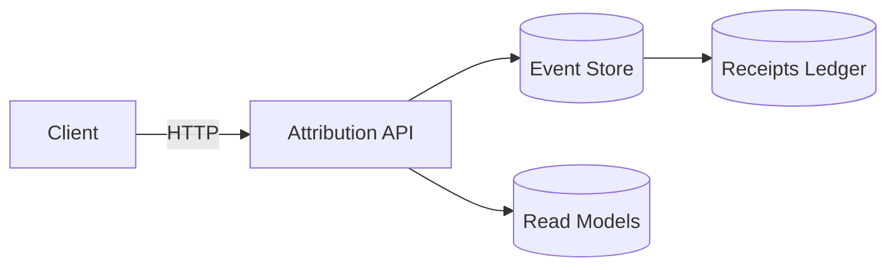

# Rust Attribution Context - TCPS Reference Implementation

**Domain**: Click/Revenue Attribution System
**Paradigm**: Toyota Code Production System (TCPS)
**Language**: Rust
**Architecture**: DDD + CQRS + Event Sourcing

---

## 🎯 What This Demonstrates

This example is the **canonical reference** for:

✅ **Ontology as Truth**: One `attribution.ttl` defines the entire system
✅ **Sealed Source**: Humans cannot edit `world/` (generated code)
✅ **Full DDD Loop**: Commands → Aggregates → Events → Projections
✅ **World Closure**: `./world/run/up` brings the system alive
✅ **Receipts Ledger**: Every click/attribution/payout is a receipt
✅ **Stop-the-Line Gates**: Invalid ontology = build fails
✅ **TOGAF Outputs**: Catalogs + Matrices auto-generated
✅ **C4 Diagrams**: Architecture diagrams from truth

---

## 🏭 The Production Line

```
ontology/attribution.ttl  (TRUTH - editable by humans)
         ↓
    ggen sync             (COMPILER - deterministic)
         ↓
    world/                (GENERATED - sealed, no human edits)
         ├─ src/          (Rust domain model + handlers)
         ├─ infra/        (Terraform)
         ├─ docs/         (C4 + TOGAF)
         ├─ run/          (World closure scripts)
         └─ Cargo.toml    (Generated manifest)
         ↓
    ./world/run/up        (DEPLOY + BOOT)
         ↓
   Running System         (RUNTIME - observable via receipts)
```

---

## 🚀 Quick Start

```bash
# Generate the complete world
ggen sync

# Boot the system
./world/run/up

# Verify it's alive
./world/run/verify

# Shut it down
./world/run/down
```

**That's it.** No manual configuration. No editing generated code.

---

## 📊 Domain Model

### Entities
- **Publisher**: Content creator earning revenue
- **Offer**: Advertiser offer with payout
- **Click**: User interaction event

### Commands
- `RecordClick`: Track a click event
- `ComputeAttribution`: Calculate which publisher gets credit
- `ProcessPayout`: Calculate payment

### Events
- `ClickRecorded`: Click captured
- `AttributionComputed`: Credit assigned
- `PayoutCalculated`: Payment determined

### Policies
- **Attribution Window**: 30 days
- **Attribution Model**: Last-click wins
- **Minimum Payout**: $10.00

---

## 🔬 Testing

```bash
# Run all tests
cargo make test --manifest-path world/Cargo.toml

# Run property-based tests
cargo make test-property --manifest-path world/Cargo.toml

# Verify receipts integrity
cargo make verify-receipts --manifest-path world/Cargo.toml
```

### Key Properties Tested
- Total attributed clicks ≤ total clicks
- Sum of payouts = sum of attributed revenue
- No negative payouts
- Attribution is deterministic (same events → same result)

---

## 🛞 The TCPS Paradigm

### What You Edit
- `ontology/*.ttl` - Domain truth
- `templates/*.tera` - Rendering logic (rarely)
- `queries/*.sparql` - Data extraction (rarely)

### What You DON'T Edit
- `world/src/**` - Generated Rust code
- `world/infra/**` - Generated Terraform
- `world/docs/**` - Generated diagrams
- `world/run/**` - Generated scripts

**Sealed source = zero drift.**

### How to Make Changes

```bash
# 1. Edit ontology
vim ontology/attribution.ttl

# 2. Regenerate world
ggen sync

# 3. Redeploy
./world/run/up
```

**No manual code edits. Ever.**

---

## 📈 Receipts

Every action produces a receipt:

```json
{
  "id": "550e8400-e29b-41d4-a716-446655440000",
  "type": "ClickRecorded",
  "timestamp": "2026-01-24T12:34:56Z",
  "publisher_id": "pub-123",
  "offer_id": "off-456",
  "amount": "1.50"
}
```

Receipts are:
- **Append-only** (immutable audit trail)
- **Cryptographically signed** (tamper-proof)
- **Queryable** (SPARQL over receipt graph)

---

## 🏗️ Architecture

### C4 Container Diagram

See: `world/docs/c4/c2-containers.mmd`



### TOGAF Building Blocks

See: `world/docs/togaf/building-blocks.md`

| ABB | SBB | Technology |
|-----|-----|------------|
| Attribution Logic | attribution-context | Rust + Axum |
| Event Store | PostgreSQL EventStore | PostgreSQL |
| Receipts Ledger | Receipt Service | Rust + RDF |

---

## 🔧 Extending the System

### Add a New Command

1. **Edit ontology**:
```turtle
# ontology/commands.ttl
attr:AdjustPayout a ddd:Command ;
  ddd:name "AdjustPayout" ;
  ddd:hasField "publisher_id" ;
  ddd:hasField "amount" ;
  ddd:hasField "reason" .
```

2. **Regenerate**:
```bash
ggen sync
```

3. **Done**:
- Command struct generated
- Handler template generated
- Route registered
- Tests scaffolded

### Add a New Policy

1. **Edit ontology**:
```turtle
# ontology/policies.ttl
attr:FraudDetectionPolicy a ddd:Policy ;
  ddd:name "FraudDetection" ;
  ddd:rule "clicks_per_hour < 100" .
```

2. **Regenerate**:
```bash
ggen sync
```

Policy enforcement auto-generated in handlers.

---

## 📚 Learning Path

### Week 1: Understand the Paradigm
1. Read this README
2. Run `ggen sync`
3. Explore `world/` (read-only)
4. Read `ontology/attribution.ttl`

### Week 2: Make Changes
1. Add a field to `Publisher`
2. Run `ggen sync`
3. See changes propagate everywhere
4. Run tests

### Week 3: Add Features
1. Add `RefundPayout` command
2. Add `PayoutRefunded` event
3. Implement refund policy
4. Generate receipts

### Week 4: Production
1. Review TOGAF outputs
2. Review C4 diagrams
3. Deploy to OCI Free Tier
4. Monitor receipts

---

## 🎓 Why This Works

### Traditional DDD
- Write entities (manual)
- Write commands (manual)
- Write handlers (manual)
- Write tests (manual)
- Write docs (manual)
- **Result**: 5 things drift

### TCPS DDD
- Write ontology (once)
- Run `ggen sync`
- **Result**: Everything synchronized, always

### The Key Insight

> **Code is not truth.**
> **The ontology is truth.**
> **Code is just a projection.**

Once you accept that, drift becomes structurally impossible.

---

## 🔒 Security Model

### Sealed Source Benefits
- No injection vulnerabilities from manual edits
- No backdoors from "temporary fixes"
- No privilege escalation from code patches
- Complete audit trail in receipts

### Override Mechanism
Emergency changes via:
```turtle
work:Override_001 a work:EmergencyOverride ;
  work:scope "attribution_window" ;
  work:change "extend to 60 days" ;
  work:expiresAt "2026-01-25T00:00:00Z" .
```

Override is:
- Graph object (not code edit)
- Time-limited (auto-expires)
- Auditable (in receipts)
- Compiled (part of generation)

---

## 📞 Support

**This is a reference implementation.**

If something doesn't work:
1. Check receipts: `./world/run/receipts`
2. Check gates: `ggen sync` output
3. Verify ontology: `cargo make validate-ontology`

**Do not edit `world/` directly.**
**Edit `ontology/` and regenerate.**

---

## 🏆 Success Criteria

You've crossed the event horizon when:

✅ You instinctively edit ontology, not code
✅ `ggen sync` feels like `cargo build`
✅ Receipts are your debugging interface
✅ You trust regeneration over manual fixes
✅ Drift feels impossible, not unlikely

**Welcome to the other side.** 🌌

---

**Version**: 1.0.0
**Last Updated**: 2026-01-24
**Status**: Production-Ready Reference Implementation
