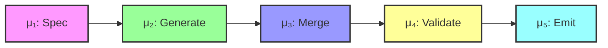
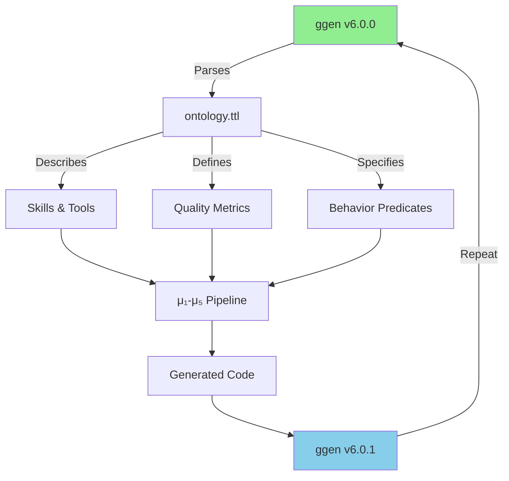

# ggen Self-Play Demo

## Overview

This demonstration showcases **ggen generating itself** - a recursive self-generation loop where ggen reads an ontology describing its own capabilities and generates a new version of itself.

### The Self-Play Loop

```
ggen v6.0.0 → Reads Ontology → Generates ggen v6.0.1 → Reads Ontology → Generates ggen v6.0.2 → ...
```

This demonstrates:
- **Self-hosting capability**: ggen can generate itself
- **Specification-driven development**: Code derives from formal ontologies
- **Quality preservation**: Generated code maintains high standards
- **Recursive improvement**: Potential for bootstrapping and optimization

## Architecture

### Five-Stage Pipeline (μ₁-μ₅)



### Self-Play Flow



## Files

| File | Purpose |
|------|---------|
| `ontology.ttl` | RDF ontology describing ggen's capabilities, quality metrics, and behavior predicates |
| `ggen.toml` | Demo manifest configuring self-play parameters |
| `run-demo.sh` | Automated demo script running 3 iterations |
| `README.md` | This file - documentation and guide |

## Quick Start

### Prerequisites

1. **ggen v6.0.0+ installed**
   ```bash
   cd /Users/sac/ggen
   cargo build --release
   export PATH="/Users/sac/ggen/target/release:$PATH"
   ```

2. **Required tools**
   - Rust 1.91.1+
   - cargo
   - oxigraph (included in ggen)
   - bash (for demo script)

### Running the Demo

#### Option 1: Automated Script (Recommended)

```bash
cd /Users/sac/ggen/examples/self-play
./run-demo.sh
```

This will:
1. Check prerequisites
2. Validate the ontology
3. Run 3 iterations of self-play
4. Collect metrics per iteration
5. Generate a visual report

#### Option 2: Manual Execution

```bash
# Step 1: Validate ontology
ggen validate ontology.ttl

# Step 2: Run single iteration
ggen sync \
  --ontology ontology.ttl \
  --output-dir /tmp/self-play-iteration-1 \
  --audit true

# Step 3: Check generated code
cd /tmp/self-play-iteration-1
cargo check

# Step 4: Repeat for more iterations
```

## Expected Output

### Per Iteration

Each iteration produces:

1. **Generated Code** (`/tmp/self-play-reports/iteration-N/src/`)
   - Rust source files
   - Cargo.toml
   - Project structure

2. **Compilation Log** (`compilation.log`)
   - Output from `cargo check`
   - Success/failure status

3. **Metrics** (`metrics.json`)
   ```json
   {
     "iteration": 1,
     "timestamp": "2026-03-30T12:00:00Z",
     "metrics": {
       "compilation_success": true,
       "generated_files": 42,
       "lines_of_code": 3847,
       "sync_errors": 0,
       "sync_warnings": 2
     }
   }
   ```

### Final Report

The demo generates `/tmp/self-play-reports/self-play-report.md` containing:

- Iteration results
- Metrics summary
- Convergence analysis
- Visual diagrams

## Understanding the Ontology

### Skills and Tools

The ontology describes ggen's capabilities:

```turtle
selfplay:RustCodeGeneration a ggen:Skill ;
    rdfs:label "Rust Code Generation" ;
    ggen:toolName "cargo" ;
    ggen:capability "Generate idiomatic Rust code" .
```

### Quality Metrics (TPS)

**T**ests, **P**erformance, **S**afety metrics:

- **Test Coverage**: ≥87%
- **Compilation Success**: Must pass
- **Performance SLO**: ≤15s first build
- **Mutation Score**: ≥60%
- **Memory Efficiency**: ≤100MB
- **Code Quality**: No clippy warnings

### Behavior Predicates

Patterns describing expected LLM behavior:

```turtle
selfplay:UsesResultType a ggen:BehaviorPredicate ;
    rdfs:label "Uses Result Type" ;
    ggen:behaviorDescription "All fallible operations return Result<T, E>" ;
    ggen:verificationPattern "fn.*->\\s*Result<.*>" .
```

## Interpreting Results

### Success Indicators

✅ **Compilation Success**: Generated code compiles without errors
✅ **Quality Preservation**: Metrics meet or exceed thresholds
✅ **Iteration Stability**: Quality converges over iterations
✅ **No Regression**: Metrics don't decrease

### Warning Signs

⚠️ **Compilation Failures**: Generated code has syntax/type errors
⚠️ **Quality Degradation**: Metrics decrease between iterations
⚠️ **Divergence**: Quality metrics oscillate wildly
⚠️ **Missing Features**: Not all skills/tools generated

### Convergence Criteria

The demo tracks convergence across 3 iterations:

1. **Quality Stability**: Metrics stabilize within ±5%
2. **Feature Completeness**: All required features present
3. **No Regression**: Quality doesn't decrease

## Troubleshooting

### Issue: "ggen binary not found"

**Solution**:
```bash
cd /Users/sac/ggen
cargo build --release
```

### Issue: "Ontology validation failed"

**Solution**:
- Check ontology.ttl syntax
- Verify RDF prefixes are correct
- Ensure all entities are properly defined

### Issue: "Generated code doesn't compile"

**Solution**:
- Check sync.log for generation errors
- Verify template engine output
- Review behavior predicates
- Check for missing dependencies in Cargo.toml

### Issue: "Metrics show degradation"

**Solution**:
- Review iteration logs for errors
- Check if quality predicates are satisfied
- Verify convergence criteria
- Analyze specific metric failures

### Issue: "Demo script hangs"

**Solution**:
```bash
# Check if ggen sync is running
ps aux | grep ggen

# Kill hanging process
pkill -9 ggen

# Re-run with timeout
timeout 600 ./run-demo.sh
```

## Advanced Usage

### Custom Iteration Count

Edit `run-demo.sh`:
```bash
ITERATIONS=5  # Change from 3 to 5
```

### Custom Quality Thresholds

Edit `ggen.toml`:
```toml
[quality]
test_coverage_threshold = 90  # Increase from 87
first_build_threshold = 10    # Decrease from 15
```

### Custom Output Directory

```bash
export REPORT_DIR="/tmp/my-self-play"
./run-demo.sh
```

### Adding Behavior Predicates

Edit `ontology.ttl`:
```turtle
selfplay:CustomPredicate a ggen:BehaviorPredicate ;
    rdfs:label "Custom Predicate" ;
    ggen:behaviorDescription "Your description" ;
    ggen:verificationPattern "your_pattern" .
```

## Integration with CI/CD

### GitHub Actions Example

```yaml
name: Self-Play Demo

on: [push, pull_request]

jobs:
  self-play:
    runs-on: ubuntu-latest
    steps:
      - uses: actions/checkout@v3
      - uses: actions-rs/toolchain@v1
        with:
          toolchain: stable

      - name: Install ggen
        run: cargo build --release

      - name: Run self-play demo
        run: |
          cd examples/self-play
          ./run-demo.sh

      - name: Upload reports
        uses: actions/upload-artifact@v3
        with:
          name: self-play-reports
          path: /tmp/self-play-reports/
```

## Performance Expectations

| Metric | Expected | Acceptable |
|--------|----------|------------|
| First build | ≤15s | ≤30s |
| Incremental build | ≤2s | ≤5s |
    | RDF processing (1k triples) | ≤5s | ≤10s |
| Memory usage | ≤100MB | ≤200MB |
| Demo runtime (3 iterations) | ≤5min | ≤10min |

## Research Questions

This demo helps answer:

1. **Self-Hosting**: Can ggen generate itself effectively?
2. **Quality Preservation**: Does generated code maintain quality?
3. **Convergence**: Do metrics stabilize over iterations?
4. **Bootstrapping**: Can ggen bootstrap from minimal specs?
5. **Optimization**: Can self-play lead to improvements?

## Future Enhancements

Potential improvements to the demo:

- [ ] Automatic convergence detection
- [ ] Differential analysis between iterations
- [ ] Performance benchmarking
- [ ] Mutation testing integration
- [ ] Visual trend graphs
- [ ] Comparison with manual code generation
- [ ] Integration with formal verification tools

## References

- **ggen Documentation**: https://github.com/seanchatmangpt/ggen
- **RDF/OWL**: https://www.w3.org/RDF/
- **SHACL**: https://www.w3.org/TR/shacl/
- **Tera Templates**: https://tera.netlify.app/
- **Chicago TDD**: https://www.chicagottd.com/

## License

This demo is part of ggen and follows the same license.

## Support

For issues or questions:
- GitHub: https://github.com/seanchatmangpt/ggen/issues
- Documentation: /Users/sac/ggen/docs/

---

**Version**: 1.0.0
**Last Updated**: 2026-03-30
**Demo Version**: ggen v6.0.0
