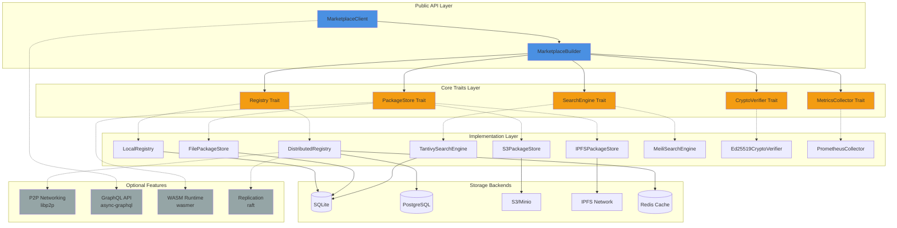
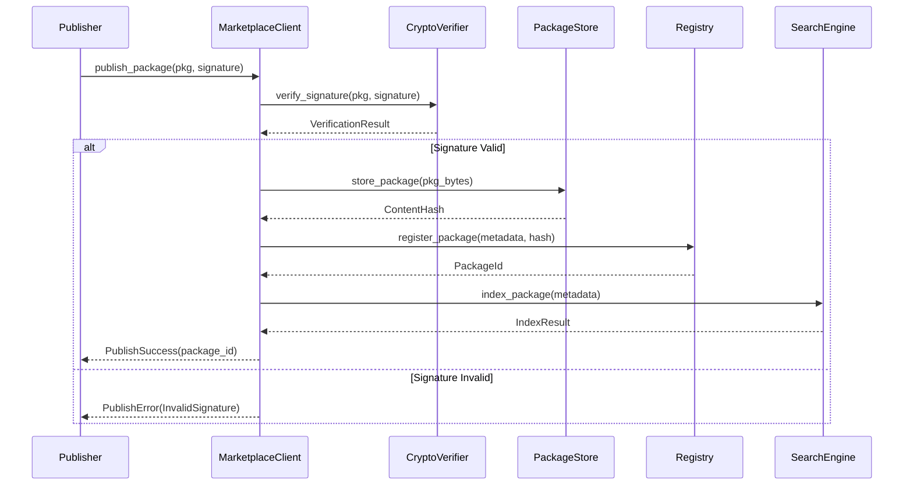
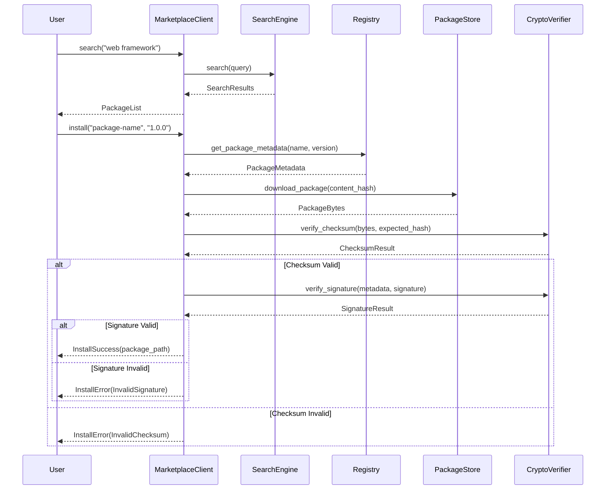

# Ggen-Marketplace Architecture

## Overview

Ggen-marketplace is a standalone, production-ready Rust library for decentralized package management. It provides a trait-based, extensible architecture that can be integrated into any Rust project requiring package discovery, distribution, and verification.

## Design Principles

1. **Trait-Based Extensibility**: Core functionality defined through traits, allowing custom implementations
2. **Async-First**: Built on tokio for high-performance concurrent operations
3. **Zero-Copy Optimization**: Minimize allocations through careful use of borrows and `Cow<str>`
4. **Type Safety**: Leverage Rust's type system to prevent errors at compile time
5. **Error Transparency**: Rich error types with context using `anyhow` and `thiserror`
6. **Plugin Architecture**: Feature flags and dynamic loading for optional components
7. **Backend Agnostic**: Generic over storage, network, and cryptographic implementations

## Architecture Diagram



## Module Structure

```
ggen-marketplace/
├── Cargo.toml
├── src/
│   ├── lib.rs                    # Public API exports
│   ├── error.rs                  # Error types
│   ├── types.rs                  # Core types (Package, Version, etc.)
│   ├── client.rs                 # MarketplaceClient
│   ├── builder.rs                # MarketplaceBuilder
│   │
│   ├── traits/
│   │   ├── mod.rs
│   │   ├── registry.rs           # Registry trait
│   │   ├── package_store.rs      # PackageStore trait
│   │   ├── search_engine.rs      # SearchEngine trait
│   │   ├── crypto_verifier.rs    # CryptoVerifier trait
│   │   ├── metrics_collector.rs  # MetricsCollector trait
│   │   └── replication.rs        # Replication trait (optional)
│   │
│   ├── registry/
│   │   ├── mod.rs
│   │   ├── local.rs              # LocalRegistry implementation
│   │   ├── distributed.rs        # DistributedRegistry implementation
│   │   └── cache.rs              # Caching layer
│   │
│   ├── storage/
│   │   ├── mod.rs
│   │   ├── file.rs               # File-based storage
│   │   ├── s3.rs                 # S3-compatible storage
│   │   ├── ipfs.rs               # IPFS storage (feature: ipfs)
│   │   └── memory.rs             # In-memory storage (testing)
│   │
│   ├── search/
│   │   ├── mod.rs
│   │   ├── tantivy.rs            # Tantivy full-text search
│   │   ├── meilisearch.rs        # MeiliSearch client (feature: meilisearch)
│   │   └── index.rs              # Index management
│   │
│   ├── crypto/
│   │   ├── mod.rs
│   │   ├── ed25519.rs            # Ed25519 signatures
│   │   ├── checksums.rs          # SHA-256, BLAKE3
│   │   └── keyring.rs            # Key management
│   │
│   ├── metrics/
│   │   ├── mod.rs
│   │   ├── prometheus.rs         # Prometheus metrics
│   │   └── tracing.rs            # Tracing integration
│   │
│   ├── p2p/                      # (feature: p2p)
│   │   ├── mod.rs
│   │   ├── network.rs            # libp2p networking
│   │   ├── discovery.rs          # Peer discovery
│   │   └── gossip.rs             # Gossip protocol
│   │
│   ├── api/                      # (feature: graphql)
│   │   ├── mod.rs
│   │   ├── graphql.rs            # GraphQL schema
│   │   └── rest.rs               # REST endpoints
│   │
│   ├── wasm/                     # (feature: wasm)
│   │   ├── mod.rs
│   │   ├── runtime.rs            # WASM runtime
│   │   └── plugins.rs            # Plugin system
│   │
│   └── replication/              # (feature: replication)
│       ├── mod.rs
│       ├── raft.rs               # Raft consensus
│       └── sync.rs               # State synchronization
│
├── examples/
│   ├── basic_usage.rs
│   ├── custom_backend.rs
│   ├── distributed_setup.rs
│   └── plugin_integration.rs
│
├── tests/
│   ├── integration/
│   │   ├── registry_tests.rs
│   │   ├── storage_tests.rs
│   │   └── search_tests.rs
│   └── common/
│       └── mod.rs
│
└── docs/
    ├── ARCHITECTURE.md           # This file
    ├── TRAITS.md                 # Trait documentation
    ├── INTEGRATION.md            # Integration guide
    ├── PERFORMANCE.md            # Performance considerations
    └── EXAMPLES.md               # Usage examples
```

## Core Components

### 1. MarketplaceClient

The main entry point for library users. Provides a high-level API for all marketplace operations.

**Key Features**:
- Builder pattern initialization
- Type-safe configuration
- Async-first API
- Automatic connection pooling
- Built-in retry logic

**Example**:
```rust
let marketplace = MarketplaceBuilder::new()
    .registry(LocalRegistry::new("./registry"))
    .storage(FilePackageStore::new("./packages"))
    .search(TantivySearchEngine::new("./search"))
    .crypto(Ed25519CryptoVerifier::new())
    .build()
    .await?;
```

### 2. Registry Trait

Manages package metadata and version information.

**Responsibilities**:
- Package registration and updates
- Version management
- Dependency resolution
- Metadata queries

**Design Pattern**: Abstract repository pattern with async/await

### 3. PackageStore Trait

Handles binary package storage and retrieval.

**Responsibilities**:
- Package upload/download
- Content addressing (SHA-256 hashes)
- Storage backend abstraction
- Streaming large files

**Design Pattern**: Strategy pattern for different storage backends

### 4. SearchEngine Trait

Provides fast package discovery and search.

**Responsibilities**:
- Full-text search across package metadata
- Faceted search (by category, tags, author)
- Ranking and relevance scoring
- Real-time index updates

**Design Pattern**: Adapter pattern for different search backends

### 5. CryptoVerifier Trait

Ensures package authenticity and integrity.

**Responsibilities**:
- Digital signature verification
- Checksum validation
- Trust chain verification
- Key management

**Design Pattern**: Strategy pattern for different crypto schemes

### 6. MetricsCollector Trait

Collects operational metrics and telemetry.

**Responsibilities**:
- Performance metrics (latency, throughput)
- Usage statistics
- Error tracking
- Custom metric collection

**Design Pattern**: Observer pattern for metric collection

## Data Flow

### Package Publication Flow



### Package Installation Flow



## Type System Design

### Core Types

```rust
// Package identifier with semantic versioning
pub struct PackageId {
    pub name: String,
    pub version: Version,  // semver::Version
    pub namespace: Option<String>,
}

// Package metadata
pub struct PackageMetadata {
    pub id: PackageId,
    pub description: String,
    pub authors: Vec<String>,
    pub license: String,
    pub repository: Option<Url>,
    pub homepage: Option<Url>,
    pub keywords: Vec<String>,
    pub categories: Vec<String>,
    pub dependencies: HashMap<String, VersionReq>,
    pub checksums: Checksums,
    pub signature: Signature,
    pub published_at: DateTime<Utc>,
}

// Content addressing
pub struct ContentHash {
    pub algorithm: HashAlgorithm,  // SHA256, BLAKE3
    pub digest: Vec<u8>,
}

// Cryptographic signature
pub struct Signature {
    pub algorithm: SignatureAlgorithm,  // Ed25519, RSA
    pub public_key: PublicKey,
    pub signature_bytes: Vec<u8>,
}

// Search query with filters
pub struct SearchQuery {
    pub text: String,
    pub categories: Vec<String>,
    pub tags: Vec<String>,
    pub min_downloads: Option<u64>,
    pub limit: usize,
    pub offset: usize,
}

// Search result with ranking
pub struct SearchResult {
    pub package: PackageMetadata,
    pub score: f32,
    pub highlights: Vec<String>,
}
```

## Error Handling Strategy

### Error Type Hierarchy

```rust
use thiserror::Error;

#[derive(Error, Debug)]
pub enum MarketplaceError {
    #[error("Registry error: {0}")]
    Registry(#[from] RegistryError),

    #[error("Storage error: {0}")]
    Storage(#[from] StorageError),

    #[error("Search error: {0}")]
    Search(#[from] SearchError),

    #[error("Crypto error: {0}")]
    Crypto(#[from] CryptoError),

    #[error("Network error: {0}")]
    Network(#[from] NetworkError),

    #[error("Validation error: {0}")]
    Validation(String),

    #[error("Not found: {0}")]
    NotFound(String),

    #[error("Conflict: {0}")]
    Conflict(String),
}

// Rich context with anyhow
pub type Result<T> = std::result::Result<T, anyhow::Error>;
```

### Error Context Pattern

```rust
use anyhow::Context;

async fn publish_package(&self, pkg: Package) -> Result<PackageId> {
    let signature = self.crypto
        .verify_signature(&pkg)
        .await
        .context("Failed to verify package signature")?;

    let hash = self.storage
        .store(&pkg.bytes)
        .await
        .context("Failed to store package bytes")?;

    let id = self.registry
        .register(&pkg.metadata, hash)
        .await
        .context("Failed to register package in registry")?;

    Ok(id)
}
```

## Performance Considerations

### 1. Async/Await Best Practices

- Use `tokio::spawn` for CPU-intensive operations
- Implement `Stream` for large result sets
- Use `tokio::select!` for cancellation
- Avoid blocking operations in async contexts

### 2. Zero-Copy Optimizations

```rust
// Use Cow<str> for flexible string handling
pub struct PackageMetadata {
    pub name: Cow<'static, str>,
    pub description: Cow<'static, str>,
    // ...
}

// Use Bytes for efficient byte buffer handling
use bytes::Bytes;

async fn download_package(&self, hash: &ContentHash) -> Result<Bytes> {
    // Bytes allows zero-copy cloning
    self.storage.get(hash).await
}
```

### 3. Connection Pooling

```rust
// Built-in connection pooling for databases
pub struct LocalRegistry {
    pool: sqlx::PgPool,  // Or SqlitePool
}

impl LocalRegistry {
    pub async fn new(database_url: &str) -> Result<Self> {
        let pool = sqlx::postgres::PgPoolOptions::new()
            .max_connections(20)
            .connect(database_url)
            .await?;

        Ok(Self { pool })
    }
}
```

### 4. Caching Strategy

```rust
use moka::future::Cache;

pub struct CachedRegistry<R: Registry> {
    inner: R,
    metadata_cache: Cache<PackageId, PackageMetadata>,
    search_cache: Cache<String, Vec<SearchResult>>,
}

impl<R: Registry> CachedRegistry<R> {
    pub fn new(inner: R) -> Self {
        Self {
            inner,
            metadata_cache: Cache::builder()
                .max_capacity(10_000)
                .time_to_live(Duration::from_secs(300))
                .build(),
            search_cache: Cache::builder()
                .max_capacity(1_000)
                .time_to_live(Duration::from_secs(60))
                .build(),
        }
    }
}
```

### 5. Streaming Large Files

```rust
use tokio::io::{AsyncRead, AsyncWrite};
use futures::stream::Stream;

#[async_trait]
pub trait PackageStore {
    /// Stream package download without loading entire file into memory
    async fn download_stream(
        &self,
        hash: &ContentHash,
    ) -> Result<impl AsyncRead + Unpin>;

    /// Stream package upload
    async fn upload_stream(
        &self,
        reader: impl AsyncRead + Unpin,
    ) -> Result<ContentHash>;
}
```

## Feature Flags

```toml
[features]
default = ["local-registry", "file-storage", "tantivy-search"]

# Core implementations
local-registry = ["sqlx/sqlite"]
distributed-registry = ["sqlx/postgres", "redis"]
file-storage = ["tokio/fs"]
s3-storage = ["aws-sdk-s3"]
ipfs-storage = ["ipfs-api"]
tantivy-search = ["tantivy"]
meilisearch = ["meilisearch-sdk"]

# Advanced features
p2p = ["libp2p", "libp2p-kad", "libp2p-gossipsub"]
graphql = ["async-graphql", "async-graphql-axum"]
wasm = ["wasmer", "wasmer-compiler-cranelift"]
replication = ["raft", "serde_json"]

# All features for development
full = [
    "distributed-registry",
    "s3-storage",
    "ipfs-storage",
    "meilisearch",
    "p2p",
    "graphql",
    "wasm",
    "replication",
]
```

## Plugin System Architecture

### Plugin Trait

```rust
#[async_trait]
pub trait MarketplacePlugin: Send + Sync {
    /// Plugin metadata
    fn metadata(&self) -> PluginMetadata;

    /// Initialize plugin with marketplace context
    async fn initialize(&mut self, ctx: PluginContext) -> Result<()>;

    /// Hook: Before package publication
    async fn on_pre_publish(&self, pkg: &Package) -> Result<()> {
        Ok(())
    }

    /// Hook: After package publication
    async fn on_post_publish(&self, pkg: &Package) -> Result<()> {
        Ok(())
    }

    /// Hook: Before package download
    async fn on_pre_download(&self, id: &PackageId) -> Result<()> {
        Ok(())
    }

    /// Hook: After package download
    async fn on_post_download(&self, id: &PackageId, bytes: &[u8]) -> Result<()> {
        Ok(())
    }

    /// Custom command handler
    async fn handle_command(&self, cmd: &str, args: &[String]) -> Result<String> {
        Err(anyhow::anyhow!("Command not supported"))
    }
}
```

### Plugin Loading

```rust
pub struct PluginManager {
    plugins: Vec<Box<dyn MarketplacePlugin>>,
}

impl PluginManager {
    pub fn new() -> Self {
        Self {
            plugins: Vec::new(),
        }
    }

    /// Register a compiled plugin
    pub fn register(&mut self, plugin: Box<dyn MarketplacePlugin>) {
        self.plugins.push(plugin);
    }

    #[cfg(feature = "wasm")]
    /// Load a WASM plugin
    pub async fn load_wasm(&mut self, path: &Path) -> Result<()> {
        let plugin = WasmPlugin::load(path).await?;
        self.plugins.push(Box::new(plugin));
        Ok(())
    }
}
```

## Testing Strategy

### Unit Tests

```rust
#[cfg(test)]
mod tests {
    use super::*;

    #[tokio::test]
    async fn test_package_registration() {
        let registry = LocalRegistry::new(":memory:").await.unwrap();
        let pkg = create_test_package();

        let id = registry.register(&pkg).await.unwrap();
        assert_eq!(id.name, "test-package");

        let retrieved = registry.get(&id).await.unwrap();
        assert_eq!(retrieved.description, pkg.description);
    }
}
```

### Integration Tests

```rust
#[tokio::test]
async fn test_end_to_end_workflow() {
    let marketplace = MarketplaceBuilder::new()
        .registry(LocalRegistry::new(":memory:").await.unwrap())
        .storage(MemoryPackageStore::new())
        .search(MemorySearchEngine::new())
        .crypto(Ed25519CryptoVerifier::new())
        .build()
        .await
        .unwrap();

    // Publish
    let pkg = create_test_package();
    let id = marketplace.publish(pkg).await.unwrap();

    // Search
    let results = marketplace.search("test").await.unwrap();
    assert_eq!(results.len(), 1);

    // Download
    let downloaded = marketplace.download(&id).await.unwrap();
    assert_eq!(downloaded.id, id);
}
```

### Property-Based Tests

```rust
use proptest::prelude::*;

proptest! {
    #[test]
    fn test_version_ordering(
        major in 0u64..100,
        minor in 0u64..100,
        patch in 0u64..100,
    ) {
        let v1 = Version::new(major, minor, patch);
        let v2 = Version::new(major, minor, patch + 1);
        assert!(v2 > v1);
    }
}
```

## Logging and Tracing

```rust
use tracing::{info, warn, error, instrument};

#[instrument(skip(self))]
pub async fn publish_package(&self, pkg: Package) -> Result<PackageId> {
    info!(
        package_name = %pkg.metadata.name,
        version = %pkg.metadata.version,
        "Publishing package"
    );

    match self.verify_signature(&pkg).await {
        Ok(_) => info!("Signature verified successfully"),
        Err(e) => {
            error!(error = %e, "Signature verification failed");
            return Err(e);
        }
    }

    // ... rest of implementation
}
```

## Security Considerations

1. **Input Validation**: Validate all user inputs (package names, versions, queries)
2. **Rate Limiting**: Implement rate limiting for API endpoints
3. **Signature Verification**: Always verify signatures before package installation
4. **Checksum Validation**: Verify content integrity using cryptographic hashes
5. **Sandboxing**: Run WASM plugins in isolated environments
6. **Access Control**: Implement fine-grained permissions for registry operations
7. **Audit Logging**: Log all security-relevant operations

## Scalability Considerations

1. **Horizontal Scaling**: Stateless design allows multiple instances
2. **Read Replicas**: Use read replicas for registry database
3. **CDN Integration**: Serve packages through CDN for global distribution
4. **Sharding**: Shard storage by content hash prefix
5. **Caching**: Multi-level caching (local, distributed, CDN)
6. **Async Everything**: Non-blocking I/O throughout the stack

## Monitoring and Observability

```rust
use prometheus::{Counter, Histogram, Registry};

pub struct Metrics {
    registry: Registry,
    publish_counter: Counter,
    download_counter: Counter,
    search_latency: Histogram,
}

impl Metrics {
    pub fn new() -> Self {
        let registry = Registry::new();

        let publish_counter = Counter::new(
            "marketplace_publishes_total",
            "Total number of package publications"
        ).unwrap();

        let download_counter = Counter::new(
            "marketplace_downloads_total",
            "Total number of package downloads"
        ).unwrap();

        let search_latency = Histogram::new(
            "marketplace_search_latency_seconds",
            "Search query latency in seconds"
        ).unwrap();

        registry.register(Box::new(publish_counter.clone())).unwrap();
        registry.register(Box::new(download_counter.clone())).unwrap();
        registry.register(Box::new(search_latency.clone())).unwrap();

        Self {
            registry,
            publish_counter,
            download_counter,
            search_latency,
        }
    }
}
```

## Future Enhancements

1. **Content Deduplication**: Store packages using content-addressed storage
2. **Differential Updates**: Delta patches for package updates
3. **Blockchain Integration**: Immutable package registry using blockchain
4. **Machine Learning**: AI-powered package recommendations
5. **Supply Chain Security**: Software bill of materials (SBOM) generation
6. **Multi-Tenancy**: Support for private registries within shared infrastructure
7. **WebAssembly Components**: Package WebAssembly components using WASI
8. **GraphQL Subscriptions**: Real-time updates for package changes

## Conclusion

This architecture provides a solid foundation for a production-ready, extensible package marketplace. The trait-based design allows for flexibility while maintaining type safety and performance. The async-first approach ensures scalability, and the comprehensive error handling provides a robust user experience.

The modular design makes it easy to integrate into existing projects (like ggen and clnrm) while also allowing for future enhancements and customizations.
