```mermaid
graph TB
    subgraph "Gen 3 Distributed Execution Architecture"
        subgraph "Local Orchestrator"
            L1[Developer Commit] --> L2[Test Selector]
            L2 --> L3[Partition Tests]
            L3 --> L4[Cloud Dispatcher]
        end

        subgraph "Cloud Execution Cluster"
            L4 --> C1[AWS Lambda 1<br/>25 tests]
            L4 --> C2[AWS Lambda 2<br/>25 tests]
            L4 --> C3[AWS Lambda 3<br/>25 tests]
            L4 --> C4[AWS Lambda 4<br/>25 tests]
            L4 --> C5[AWS Lambda 5-8<br/>100 tests]

            C1 --> C6[Result Aggregator]
            C2 --> C6
            C3 --> C6
            C4 --> C6
            C5 --> C6
        end

        subgraph "Result Processing"
            C6 --> R1[Cache Results]
            R1 --> R2{All Passed?}
            R2 -->|Yes| R3[✅ Notify Developer<br/>Total time: 4.2s]
            R2 -->|No| R4[❌ Report Failures<br/>Total time: 2.8s fail-fast]
        end

        style C6 fill:#87CEEB
        style R3 fill:#32CD32
        style R4 fill:#FF6347
    end
```

# Multi-Generational Product Plan (MGPP) - Test Quality Audit and Performance Optimization

**Feature**: 004-optimize-test-concurrency
**Created**: 2025-12-11
**Status**: Active
**Methodology**: DfLSS DMEDI with MGPP

---

## Executive Summary

This MGPP defines a **three-generation evolution** from broken test suite (ggen.toml passes with broken functionality) to **AI-driven, distributed, self-optimizing test infrastructure**. Each generation delivers measurable value while building foundation for next evolution.

### Generation Overview

| Generation | Timeline | Key Capability | Performance Target | Automation Level |
|-----------|----------|----------------|-------------------|-----------------|
| **Gen 1** | Weeks 1-4 | Fix false positives + basic parallelization | ≤11s (91% improvement) | 40% manual |
| **Gen 2** | Months 2-3 | Intelligent selection + adaptive optimization | ≤8s (27% improvement) | 95% automated |
| **Gen 3** | Months 4-6 | Distributed execution + AI-driven optimization | ≤5s (40% improvement) | 100% self-optimizing |

### Value Progression

```
Gen 1: TRUST (tests detect real bugs) + SPEED (11s from 2-5min)
Gen 2: INTELLIGENCE (AI selects tests) + ADAPTIVITY (learns from failures)
Gen 3: DISTRIBUTION (cloud scale) + PREDICTION (pre-failure detection)
```

---

## Generation 1: Test Quality Audit and Basic Optimization (MVP)

**Timeline**: Weeks 1-4 (23 days)
**Status**: Current project scope
**Investment**: 8 specialized agents, 4 weeks development time
**ROI**: 91% speed improvement + zero false positives

### Business Value

**P0 - Trust Restoration**:
- **Problem**: ggen.toml completely broken, all tests pass (critical false positive)
- **Solution**: Audit all ~1240 tests, fix false positives, ensure behavior validation
- **Value**: Developers can trust test results, production defects caught in development

**P1 - Speed Improvement**:
- **Problem**: 2-5 minute test execution breaks flow state
- **Solution**: Reduce to 200 high-value tests, parallel execution, strict budgets
- **Value**: 82%+ reduction in wait time (120-300s → ≤11s)

**P2 - Quality Baseline**:
- **Problem**: Unknown which tests validate behavior vs code execution
- **Solution**: Mutation testing, assertion strength analysis, coverage gaps identification
- **Value**: Data-driven understanding of test suite effectiveness

### Detailed Capabilities

#### 1.1 Test Quality Audit

**Objective**: Understand what we're testing and why

**Components**:

1. **Assertion Strength Analyzer**
   - **Input**: All test files (122 identified)
   - **Process**: Parse tests, extract assertions, classify strength
   - **Output**: Test quality report with scores (0-100)

   **Classification Schema**:
   ```
   Strength 0-20: Execution-only (no meaningful assertions)
     Example: test_loads_config() { config.load(); } // ❌ FALSE POSITIVE

   Strength 21-50: Weak validation (basic type checks)
     Example: assert!(config.is_some()); // ⚠️ WEAK

   Strength 51-80: Behavior validation (state changes)
     Example: assert_eq!(config.timeout, 30); // ✅ GOOD

   Strength 81-100: Comprehensive validation (edge cases + invariants)
     Example:
       assert_eq!(config.timeout, 30);
       assert_eq!(config.retries, 3);
       assert!(config.validate().is_ok()); // ✅ EXCELLENT
   ```

2. **Critical Path Coverage Auditor**
   - **Critical Paths**: RDF parsing, ontology projection, code generation, ggen.toml
   - **Process**: Map code paths → tests, identify gaps
   - **Output**: Coverage gap report with risk ratings

   **Gap Analysis Matrix**:
   ```
   | Critical Path | Test Coverage | Assertion Strength | Gap Risk |
   |---------------|--------------|-------------------|---------|
   | ggen.toml     | 80%          | 15 (exec-only)    | 🔴 CRITICAL |
   | RDF parsing   | 95%          | 75 (behavior)     | 🟢 LOW |
   | Ontology      | 70%          | 60 (weak)         | 🟡 MEDIUM |
   | Code gen      | 85%          | 65 (weak)         | 🟡 MEDIUM |
   ```

3. **False Positive Detector**
   - **Method**: Intentionally break functionality, verify tests fail
   - **Process**:
     1. Identify critical features (ggen.toml, RDF parsing, etc.)
     2. Create "defect injection" scenarios (break each feature)
     3. Run tests, record pass/fail
     4. Flag tests that pass with broken functionality
   - **Output**: False positive inventory with fix priorities

4. **Mutation Testing Engine**
   - **Tool**: `cargo-mutants` (Rust mutation testing)
   - **Scope**: Critical paths only (Gen 1), expand in Gen 2
   - **Mutations**:
     - Value changes (30 → 31, true → false)
     - Operator changes (== → !=, + → -)
     - Return early (return Ok(()) before logic)
     - Boundary conditions (>= → >)
   - **Target**: 80%+ mutation kill rate on critical paths

   **Sample Mutation Report**:
   ```
   File: ggen_core/src/config.rs
   Line 42: timeout: u32 = 30
   Mutation: timeout: u32 = 31
   Result: ✅ KILLED (test_config_timeout_default failed)

   File: ggen_core/src/config.rs
   Line 57: if path.exists() { ... }
   Mutation: if true { ... }
   Result: ❌ SURVIVED (NO TEST FAILED) 🔴 CRITICAL GAP
   ```

**Deliverables**:
- `docs/test_quality_audit_report.md` - Comprehensive test analysis
- `docs/critical_path_coverage.md` - Gap analysis with risk ratings
- `docs/false_positives_inventory.md` - All false positives + fix priorities
- `docs/mutation_testing_baseline.md` - Gen 1 mutation kill rates

**Success Metrics**:
- ✅ 100% of tests classified (behavior vs execution)
- ✅ All critical paths mapped to tests
- ✅ ggen.toml false positive identified and fixed
- ✅ 80%+ mutation kill rate on critical paths

#### 1.2 Performance Baseline Measurement

**Objective**: Establish quantitative baseline for optimization

**Components**:

1. **Test Execution Profiler**
   - **Tool**: Custom cargo-nextest integration with timing instrumentation
   - **Metrics**:
     - Per-test execution time (ms resolution)
     - Per-crate execution time
     - CPU core utilization (current: ~25%, single-core)
     - Memory consumption during test runs
   - **Output**: `baseline_performance.json`

   **Sample Output**:
   ```json
   {
     "total_tests": 1240,
     "total_time_ms": 180000,
     "avg_time_per_test_ms": 145,
     "median_time_ms": 50,
     "p95_time_ms": 450,
     "p99_time_ms": 1200,
     "slowest_tests": [
       {"name": "marketplace_integration", "time_ms": 3500},
       {"name": "end_to_end_flow", "time_ms": 2800}
     ],
     "cpu_utilization": 0.25,
     "peak_memory_mb": 450
   }
   ```

2. **Test Classification Engine**
   - **Criteria**:
     - **Unit test**: No I/O, no filesystem, pure logic, <100ms target
     - **Integration test**: I/O allowed, filesystem, external dependencies, <1000ms target
   - **Process**:
     1. Static analysis (detect I/O operations)
     2. Timing analysis (execution time distribution)
     3. Dependency graph (external service calls)
   - **Output**: Test classification matrix

   **Classification Matrix**:
   ```
   | Test Name                    | Type        | Time (ms) | I/O | Dependencies |
   |------------------------------|-------------|-----------|-----|--------------|
   | lockfile_upsert              | Unit        | 15        | No  | None         |
   | marketplace_local            | Integration | 450       | Yes | Filesystem   |
   | testcontainers_readiness     | Integration | 3500      | Yes | Docker       |
   | rdf_parsing_basic            | Unit        | 8         | No  | None         |
   ```

3. **Flakiness Detector**
   - **Method**: Run all tests 100+ times, track consistency
   - **Metrics**:
     - Pass rate (100% = deterministic, <100% = flaky)
     - Failure patterns (random vs consistent)
     - Environmental dependencies (time, network, filesystem)
   - **Output**: Flaky test inventory

   **Flakiness Report**:
   ```
   Total runs: 100 per test

   🟢 STABLE (100% pass rate): 1180 tests (95%)
   🟡 INTERMITTENT (80-99% pass): 45 tests (4%)
   🔴 FLAKY (<80% pass): 15 tests (1%)

   Critical Flaky Tests:
   - testcontainers_readiness (75% pass) - Docker availability issue
   - marketplace_network_timeout (65% pass) - Network timing race condition
   ```

**Deliverables**:
- `baseline_performance.json` - Quantitative execution metrics
- `test_classification_matrix.csv` - All tests categorized
- `flaky_tests_report.md` - Determinism analysis

**Success Metrics**:
- ✅ Baseline execution time measured (2-5 minute range quantified)
- ✅ 100% of tests classified as unit or integration
- ✅ Flakiness identified for all tests
- ✅ CPU utilization baseline established (~25%)

#### 1.3 80/20 Test Selection

**Objective**: Reduce from 1240 tests to 200 high-value tests (16% retention)

**Selection Criteria** (weighted scoring):

```
Test Value Score = (0.4 × Bug Detection) + (0.3 × Coverage) + (0.2 × Speed) + (0.1 × Stability)

Where:
- Bug Detection: Historical defects caught by this test (0-100)
- Coverage: Unique code paths covered (0-100)
- Speed: Inverse of execution time (fast = higher score)
- Stability: Determinism (flaky = penalty)
```

**Components**:

1. **Historical Defect Tracker**
   - **Method**: Analyze git history, identify commits that fixed bugs
   - **Process**:
     1. Parse git log for bug-fix commits (keywords: "fix", "bug", "defect")
     2. Identify which tests caught the bugs (test failures in CI)
     3. Score tests by defect detection frequency
   - **Output**: Test defect history matrix

2. **Coverage Uniqueness Analyzer**
   - **Tool**: `cargo-tarpaulin` with line coverage + branch coverage
   - **Method**: Compute **unique** coverage per test (not just total coverage)
   - **Process**:
     1. Run coverage for each test individually
     2. Compute coverage overlap matrix
     3. Identify tests with unique coverage (high value)
     4. Identify redundant tests (low value)
   - **Output**: Coverage uniqueness scores

3. **Value Score Calculator**
   - **Input**:
     - Defect history
     - Coverage uniqueness
     - Execution time baseline
     - Flakiness report
   - **Process**: Apply weighted formula, rank all 1240 tests
   - **Output**: Ranked test list with value scores

   **Sample Ranking**:
   ```
   | Rank | Test Name                  | Value Score | Bug Detection | Coverage | Speed | Stability |
   |------|----------------------------|-------------|---------------|----------|-------|-----------|
   | 1    | lockfile_comprehensive     | 95          | 100           | 85       | 95    | 100       |
   | 2    | rdf_parsing_edge_cases     | 92          | 90            | 90       | 100   | 100       |
   | 3    | ontology_projection_full   | 88          | 85            | 95       | 80    | 100       |
   | ...  | ...                        | ...         | ...           | ...      | ...   | ...       |
   | 1240 | integration_build          | 12          | 0             | 10       | 20    | 100       |
   ```

4. **Test Suite Optimizer**
   - **Selection Strategy**:
     1. **Top 150 tests** by value score (75% of optimized suite)
     2. **50 critical path tests** (ggen.toml, RDF, ontology, codegen) - MANDATORY even if low value
     3. **Remove duplicates**: If multiple tests cover same functionality, keep highest-value one
   - **Validation**: Ensure optimized suite still has 80%+ bug detection vs full suite
   - **Output**: `optimized_test_suite.txt` (200 tests)

**Deliverables**:
- `test_value_scores.csv` - All 1240 tests ranked
- `optimized_test_suite.txt` - Final 200 tests selected
- `selection_validation_report.md` - Proves 80%+ bug detection maintained

**Success Metrics**:
- ✅ Reduced from 1240 → 200 tests (84% reduction)
- ✅ Optimized suite detects 80%+ of bugs vs full suite
- ✅ All critical paths represented in optimized suite
- ✅ Zero flaky tests in optimized suite

#### 1.4 Parallel Execution Architecture

**Objective**: Maximize CPU utilization (25% → 80%+) via parallelization

**Architecture**:


**Components**:

1. **cargo-nextest Integration**
   - **Tool**: `cargo-nextest` (production-grade parallel test runner)
   - **Configuration**: `Makefile.toml` integration
   - **Features**:
     - Automatic test partitioning across CPU cores
     - Retry logic for flaky tests (Gen 1: disabled, Gen 2: enabled)
     - JUnit XML output for CI integration
     - Test filtering by pattern

   **Makefile.toml Configuration**:
   ```toml
   [tasks.test-unit]
   description = "Run unit tests with parallel execution"
   command = "cargo"
   args = ["nextest", "run", "--profile", "ci", "--test-threads", "8"]
   env = { "NEXTEST_FAILURE_OUTPUT" = "immediate" }

   [tasks.test-integration]
   description = "Run integration tests (sequential for Gen 1)"
   command = "cargo"
   args = ["nextest", "run", "--profile", "ci", "--test-threads", "1", "--features", "integration"]
   ```

2. **Performance Budget Enforcer**
   - **Mechanism**: Custom test timeout wrapper
   - **Budgets**:
     - Unit tests: 1000ms total (≤5ms per test average for 200 tests)
     - Integration tests: 10000ms total (initially 0 tests, expand in Gen 2)
   - **Enforcement**: Tests exceeding budget trigger RED Andon signal

   **Budget Validation**:
   ```rust
   // Example budget check in Makefile.toml
   [tasks.budget-check]
   script = '''
   #!/bin/bash
   UNIT_TIME=$(cargo nextest run --no-fail-fast --profile ci | grep "Finished" | awk '{print $2}')
   if [ "$UNIT_TIME" -gt 1000 ]; then
     echo "❌ BUDGET VIOLATION: Unit tests took ${UNIT_TIME}ms (budget: 1000ms)"
     exit 1
   fi
   echo "✅ Budget met: ${UNIT_TIME}ms / 1000ms"
   '''
   ```

3. **Dependency Isolation Validator**
   - **Problem**: Parallel tests may have hidden dependencies (shared state, filesystem conflicts)
   - **Solution**: Dependency analysis + isolation validation
   - **Process**:
     1. Static analysis: Detect shared resources (files, environment variables)
     2. Runtime validation: Run tests in randomized order 10+ times
     3. Identify failures caused by execution order
   - **Output**: Test dependency graph

   **Dependency Graph Example**:
   ```
   Test: marketplace_local
   Dependencies:
   - Filesystem: /tmp/ggen-test-* (isolated via unique temp dirs) ✅
   - Environment: GGEN_HOME (shared) ⚠️ POTENTIAL CONFLICT

   Mitigation: Use test-specific env var overrides
   ```

4. **Real-Time Monitoring Dashboard** (Minimal for Gen 1)
   - **Metrics**: CPU utilization, test progress, failures
   - **Format**: Terminal output (no GUI for Gen 1)
   - **Output**:
     ```
     Running 200 tests across 8 cores...
     CPU: ████████ 85% | Progress: ████████░░ 80% (160/200) | Failures: 0
     ETA: 3s
     ```

**Deliverables**:
- `Makefile.toml` updates - cargo-nextest integration
- `docs/parallel_execution_guide.md` - Usage instructions
- `scripts/budget_check.sh` - Automated budget validation

**Success Metrics**:
- ✅ CPU utilization 80%+ during test execution (from 25% baseline)
- ✅ Unit tests complete in ≤1 second total
- ✅ Integration tests complete in ≤10 seconds total (Gen 1: 0 tests)
- ✅ Zero test failures due to parallelization (isolation validated)

#### 1.5 Continuous Validation

**Objective**: Ensure optimized suite maintains quality over time

**Components**:

1. **Defect Detection Tracker**
   - **Method**: Compare optimized suite vs full suite defect detection
   - **Process**:
     1. Run both suites on all commits for 90 days
     2. Track defects caught by each suite
     3. Calculate detection rate: (optimized defects) / (full suite defects)
   - **Target**: 80%+ detection rate
   - **Output**: Weekly defect detection reports

2. **Mutation Testing Regression**
   - **Frequency**: Weekly on critical paths
   - **Process**: Re-run mutation testing, compare kill rates vs baseline
   - **Alert**: If kill rate drops below 80%, trigger investigation
   - **Output**: Mutation kill rate trend graph

3. **Performance Budget CI Integration**
   - **Integration**: GitHub Actions workflow
   - **Process**: Run budget check on every commit
   - **Enforcement**: Block merge if budget violated
   - **Output**: Budget compliance dashboard

**Deliverables**:
- `.github/workflows/test_quality_monitoring.yml` - CI monitoring
- `scripts/defect_tracking.sh` - Defect detection comparison
- `docs/validation_process.md` - Continuous validation procedures

**Success Metrics**:
- ✅ Automated defect tracking running in CI
- ✅ Weekly mutation testing reports generated
- ✅ Budget enforcement blocking failing commits

### Technology Stack - Gen 1

| Component | Technology | Rationale |
|-----------|-----------|-----------|
| **Test Runner** | cargo-nextest | Production-grade parallel execution, JUnit output |
| **Mutation Testing** | cargo-mutants | Rust-native, integrates with cargo |
| **Coverage Analysis** | cargo-tarpaulin | Line + branch coverage, JSON output |
| **Static Analysis** | Custom Rust scripts | Parse test files, extract assertions |
| **CI Integration** | GitHub Actions | Existing infrastructure, YAML workflows |
| **Profiling** | cargo-nextest timing | Built-in per-test timing |
| **Reporting** | Markdown + JSON | Human-readable + machine-parseable |

### Architecture Diagram - Gen 1


### Migration Path to Gen 2

**Triggers for Gen 2 Migration**:
1. ✅ Gen 1 deployed and stable for 4+ weeks
2. ✅ 80%+ defect detection validated over 90-day rolling window
3. ✅ Developer adoption >90% (using optimized suite by default)
4. ✅ Performance budgets consistently met (<5% violations)

**Gen 1 → Gen 2 Transition Plan**:
- **Week 5-6**: Gen 2 design and prototyping (parallel to Gen 1 stabilization)
- **Week 7**: Gen 2 alpha release (opt-in for early adopters)
- **Week 8-9**: Gen 2 beta (wider testing, feedback collection)
- **Week 10**: Gen 2 GA (default for all developers)

---

## Generation 2: Intelligent Test Selection and Advanced Optimization (Enhanced)

**Timeline**: Months 2-3 (Weeks 5-12)
**Investment**: 6 specialized agents, 8 weeks development time
**ROI**: 27% additional speed improvement + 95% automation

### Business Value

**Enhanced Intelligence**:
- **Problem**: Manual test selection requires human judgment, cannot adapt to code changes
- **Solution**: ML-driven test selection learns which tests matter most
- **Value**: Zero manual intervention, always optimal test suite

**Adaptive Optimization**:
- **Problem**: Static test suite doesn't adapt to changing codebase
- **Solution**: Dynamic test selection based on code changes, failure history
- **Value**: Smarter test execution (run high-risk tests first)

**Advanced Parallelization**:
- **Problem**: Gen 1 uses simple thread pooling, doesn't consider dependencies
- **Solution**: Dependency-aware scheduling, critical path parallelization
- **Value**: Further 27% speed improvement (11s → 8s)

### Detailed Capabilities

#### 2.1 Automated Test Value Scoring

**Objective**: Eliminate manual test selection via ML models

**Components**:

1. **Machine Learning Value Model**
   - **Algorithm**: Gradient Boosted Decision Trees (LightGBM)
   - **Features** (20+ features):
     - **Historical**: Defect detection frequency (past 180 days)
     - **Coverage**: Unique lines covered, branch coverage
     - **Temporal**: Test age, last modification date
     - **Execution**: Average runtime, runtime variance (flakiness proxy)
     - **Dependency**: Number of dependent tests, depth in dependency graph
     - **Code churn**: LOC changed in covered code (past 30 days)
     - **Failure rate**: Test failure frequency (instability indicator)
   - **Training Data**: Gen 1 defect tracking (90+ days of data)
   - **Output**: Value score 0-100 for each test

   **Model Training Pipeline**:
   ```python
   # Pseudocode
   features = extract_features(test_files, git_history, coverage_db)
   labels = defect_detection_scores(test_files, defect_tracker)

   model = LightGBM(objective='regression', metric='rmse')
   model.fit(features, labels, validation_split=0.2)

   # Validate: Predicted high-value tests should catch 80%+ bugs
   test_scores = model.predict(test_features)
   top_200 = select_top_k(test_scores, k=200)
   validate_detection_rate(top_200, historical_defects) # Must be 80%+
   ```

2. **Continuous Learning System**
   - **Frequency**: Retrain model weekly with new data
   - **Feedback Loop**:
     1. New bugs discovered → update defect detection scores
     2. Code changes → update coverage/churn features
     3. Test execution times change → update runtime features
     4. Retrain model with updated features
   - **Validation**: A/B test new model vs current model (90/10 split)
   - **Rollout**: Deploy new model if validation shows ≥1% improvement

3. **Feature Importance Dashboard**
   - **Purpose**: Understand which features drive test value
   - **Output**: SHAP (SHapley Additive exPlanations) values
   - **Use Case**: Identify patterns (e.g., "tests covering recently-changed code are 3x more valuable")

   **Sample Feature Importance**:
   ```
   Top 5 Features Predicting Test Value:
   1. Defect Detection Frequency (past 180d): 35% importance
   2. Unique Coverage (lines): 22% importance
   3. Code Churn (past 30d): 18% importance
   4. Test Age: 12% importance
   5. Failure Rate: 8% importance
   ```

**Deliverables**:
- `models/test_value_model.pkl` - Trained ML model
- `scripts/train_value_model.py` - Model training pipeline
- `docs/model_documentation.md` - Feature descriptions, validation results

**Success Metrics**:
- ✅ Model predicts test value with R² ≥ 0.85
- ✅ Top 200 predicted tests catch 90%+ bugs (improved from 80%)
- ✅ Model retraining automated (weekly updates)

#### 2.2 Intelligent Test Prioritization

**Objective**: Run high-value tests first for faster feedback

**Components**:

1. **Risk-Based Prioritization Engine**
   - **Strategy**: Run tests most likely to fail FIRST
   - **Risk Score** = P(failure) × Impact(failure)
   - **P(failure) Calculation**:
     - Code churn in covered files (higher churn = higher risk)
     - Historical failure rate for this test
     - Dependency failures (if dependencies failed, higher risk)
   - **Impact Calculation**:
     - Critical path coverage (ggen.toml = highest impact)
     - Unique coverage (tests with unique coverage = higher impact)

   **Example Prioritization**:
   ```
   Test Execution Order (sorted by risk score):
   1. ggen_toml_parsing (risk: 95) - high churn, critical path
   2. rdf_validation (risk: 88) - recent failure, high coverage
   3. lockfile_comprehensive (risk: 75) - moderate churn, high value
   ...
   200. build_integration (risk: 10) - low churn, low failure rate
   ```

2. **Adaptive Execution Strategy**
   - **Fast Fail Mode**: Stop execution on first failure (developer mode)
   - **Complete Mode**: Run all tests even if failures (CI mode)
   - **Smart Mode**: Run high-risk tests, stop if >5% fail (hybrid)
   - **Configuration**: `Makefile.toml` task variants

   **Makefile.toml Configuration**:
   ```toml
   [tasks.test-fast-fail]
   description = "Run tests, stop on first failure (developer mode)"
   command = "cargo"
   args = ["nextest", "run", "--profile", "fast-fail", "--fail-fast"]

   [tasks.test-smart]
   description = "Adaptive execution (stop if >5% fail)"
   script = '''
   cargo nextest run --profile ci --no-fail-fast | \
     python scripts/smart_executor.py --threshold 0.05
   '''
   ```

3. **Change-Based Test Selection**
   - **Input**: Git diff (changed files since last commit)
   - **Process**:
     1. Identify changed files
     2. Map files → tests (via coverage data)
     3. Select tests covering changed code
     4. Add critical path tests (always run)
   - **Output**: Minimal test subset for quick validation

   **Use Case**: Pre-commit hook runs only affected tests (~20-50 tests, ≤3s)

   **Change-Based Selection Example**:
   ```bash
   # Developer changes src/config.rs
   git diff --name-only HEAD^ HEAD
   # Output: src/config.rs

   # System selects tests:
   # - lockfile_comprehensive (covers config.rs)
   # - ggen_toml_parsing (covers config.rs)
   # - integration_build (covers config.rs)
   # + ALL critical path tests

   # Result: Run 25 tests instead of 200 (5x faster pre-commit)
   ```

**Deliverables**:
- `scripts/risk_prioritizer.py` - Risk score calculator
- `scripts/change_based_selector.py` - Diff-based test selection
- `.github/workflows/smart_test_execution.yml` - CI integration

**Success Metrics**:
- ✅ High-risk tests run first (95%+ of failures detected in first 25% of tests)
- ✅ Change-based selection reduces pre-commit time by 5x (11s → ~2s)
- ✅ Zero regressions missed by change-based selection (over 90 days)

#### 2.3 Advanced Parallel Execution Strategies

**Objective**: Dependency-aware scheduling for optimal parallelization

**Components**:

1. **Test Dependency Graph Builder**
   - **Method**: Static analysis + runtime validation
   - **Dependencies Detected**:
     - Shared filesystem resources
     - Environment variables
     - Database connections (future)
     - Network ports
   - **Output**: Directed acyclic graph (DAG) of test dependencies

   **Dependency Graph Example**:
   ```
   Test: marketplace_local
   ├── Reads: /tmp/marketplace-cache (shared)
   ├── Writes: /tmp/marketplace-output (unique)
   └── Env: MARKETPLACE_URL (shared)

   Conflicts with:
   - marketplace_search (reads /tmp/marketplace-cache)
   - marketplace_install (writes /tmp/marketplace-cache)

   Resolution: Sequential execution for conflicting tests
   ```

2. **Critical Path Parallelization**
   - **Algorithm**: Longest path first (DAG scheduling)
   - **Process**:
     1. Compute critical path (longest dependency chain)
     2. Schedule critical path tests to start immediately
     3. Schedule independent tests in parallel on remaining cores
   - **Result**: Minimize total execution time (critical path determines lower bound)

   **Scheduling Visualization**:
   ```
   Time (ms)  Core 1       Core 2       Core 3       Core 4
   0-100      Test A       Test B       Test C       Test D
   100-200    Test E       Test B       Test F       Test D
   200-300    Test G       (idle)       Test F       (idle)
   300-400    Test H       Test I       Test J       Test K

   Critical path: Test D (200ms) → determines minimum time
   Total time: 400ms (vs 500ms with naive scheduling)
   ```

3. **Dynamic Load Balancing**
   - **Problem**: Some tests take longer than expected, leaving cores idle
   - **Solution**: Work-stealing scheduler
   - **Process**:
     1. Initially partition tests evenly across cores
     2. When core finishes early, steal work from slowest core
     3. Repeat until all tests complete
   - **Result**: Minimize idle time, maximize CPU utilization

   **Load Balancing Example**:
   ```
   Initial partition: [Core 1: 50 tests, Core 2: 50 tests, ..., Core 8: 50 tests]

   Execution:
   - Core 1 finishes 50 tests in 800ms
   - Core 2 still has 20 tests remaining (slow tests)
   - Core 1 steals 10 tests from Core 2
   - Both finish in 950ms (vs 1200ms without load balancing)
   ```

**Deliverables**:
- `scripts/dependency_graph_builder.py` - DAG construction
- `scripts/critical_path_scheduler.py` - Optimal scheduling algorithm
- `docs/advanced_parallelization.md` - Architecture documentation

**Success Metrics**:
- ✅ Test execution time reduced to ≤8 seconds (27% improvement from Gen 1)
- ✅ CPU utilization maintained at 85%+ (improved from 80%)
- ✅ Zero dependency-related test failures

#### 2.4 Comprehensive Mutation Testing

**Objective**: Expand mutation testing from critical paths to full suite

**Components**:

1. **Full-Suite Mutation Coverage**
   - **Scope**: All production code (not just critical paths)
   - **Mutations**: 1000+ mutants generated
   - **Target**: 90%+ mutation kill rate (improved from 80%)
   - **Process**:
     1. Generate mutants for all code
     2. Run optimized test suite against each mutant
     3. Identify unkilled mutants (coverage gaps)
     4. Add tests for unkilled mutants

   **Mutation Report Example**:
   ```
   Total mutants: 1247
   Killed: 1122 (90%)
   Survived: 89 (7%)
   Timeout: 36 (3%)

   Critical gaps:
   - src/ontology.rs:145 (boundary condition not tested)
   - src/codegen.rs:89 (error handling not tested)
   ```

2. **Automated Gap Remediation**
   - **Process**:
     1. Identify unkilled mutants
     2. Generate test suggestions (using LLM for Gen 3)
     3. Human reviews and adds tests
   - **Output**: Gap remediation backlog

   **Gap Remediation Workflow**:
   ```
   Unkilled mutant: src/config.rs:42
   Code: if timeout > 30 { ... }
   Mutant: if timeout >= 30 { ... } (boundary condition)

   Suggested test:
   #[test]
   fn test_timeout_boundary() {
       assert!(config_with_timeout(30).is_ok());
       assert!(config_with_timeout(31).is_err());
   }
   ```

**Deliverables**:
- `docs/mutation_testing_full_report.md` - Comprehensive mutation results
- `docs/gap_remediation_backlog.md` - Unkilled mutants + test suggestions

**Success Metrics**:
- ✅ 90%+ mutation kill rate on all code (improved from 80% on critical paths)
- ✅ All unkilled mutants documented with remediation plan

#### 2.5 Self-Optimizing Test Suite

**Objective**: Continuous improvement without human intervention

**Components**:

1. **Automated Suite Rebalancing**
   - **Frequency**: Weekly
   - **Process**:
     1. Retrain ML value model with latest data
     2. Re-score all tests
     3. Replace bottom 10% of optimized suite with higher-value candidates
     4. Validate new suite maintains 90%+ detection rate
   - **Safeguard**: Human approval required for major changes (>20% suite change)

2. **Performance Regression Detection**
   - **Baseline**: Gen 2 target (≤8 seconds)
   - **Monitoring**: Track execution time on every commit
   - **Alert**: If time exceeds 9 seconds (12.5% regression), trigger investigation
   - **Automated Response**: Identify slowest new tests, remove if low value

**Deliverables**:
- `scripts/auto_rebalance.py` - Automated suite optimization
- `.github/workflows/performance_regression.yml` - Regression monitoring

**Success Metrics**:
- ✅ Suite rebalancing runs weekly without human intervention
- ✅ Performance regression detected within 1 commit
- ✅ 95%+ automation (human intervention only for exceptions)

### Technology Stack - Gen 2

| Component | Technology | Rationale |
|-----------|-----------|-----------|
| **ML Model** | LightGBM | Fast gradient boosting, feature importance |
| **Feature Engineering** | Python (pandas) | Data wrangling, git log parsing |
| **Scheduler** | Custom Rust (topological sort) | DAG-based scheduling, zero-cost |
| **Mutation Testing** | cargo-mutants (expanded) | Full codebase coverage |
| **CI/CD** | GitHub Actions (expanded) | Automated retraining, monitoring |
| **Monitoring** | Prometheus + Grafana (optional) | Real-time metrics (future) |

### Architecture Diagram - Gen 2


### Migration Path to Gen 3

**Triggers for Gen 3 Migration**:
1. ✅ Gen 2 deployed and stable for 8+ weeks
2. ✅ 90%+ defect detection validated
3. ✅ 95%+ automation achieved
4. ✅ ML model consistently predicts high-value tests (R² ≥ 0.85)

**Gen 2 → Gen 3 Transition Plan**:
- **Month 4**: Gen 3 design (distributed execution, fuzzing, property-based testing)
- **Month 5**: Gen 3 alpha (cloud-based execution pilot)
- **Month 6**: Gen 3 GA (full rollout with self-healing)

---

## Generation 3: Distributed Testing and AI-Driven Optimization (Advanced)

**Timeline**: Months 4-6 (Weeks 13-24)
**Investment**: 8 specialized agents + cloud infrastructure, 12 weeks development
**ROI**: 40% additional speed improvement + 100% automation + self-healing

### Business Value

**Revolutionary Capabilities**:
- **Distributed Execution**: Leverage cloud for massive parallelism (8 cores → 100+ cores)
- **Predictive Testing**: AI predicts which code changes will break which tests
- **Generative Testing**: Automatically create tests for new code
- **Self-Healing**: Automatically fix flaky tests, update tests when code changes

**Strategic Value**:
- **Developer Velocity**: Near-instant test feedback (≤5 seconds)
- **Quality Assurance**: 95%+ bug detection (near parity with full suite)
- **Operational Excellence**: Zero manual test maintenance
- **Competitive Advantage**: Industry-leading test infrastructure

### Detailed Capabilities

#### 3.1 Distributed Test Execution

**Objective**: Cloud-scale parallelization for sub-5-second execution

**Architecture**:



**Components**:

1. **Cloud Execution Backend**
   - **Platform**: AWS Lambda (serverless, auto-scaling)
   - **Partitioning Strategy**:
     - Each Lambda instance runs 25 tests (200 tests / 8 instances)
     - Instances provisioned on-demand (zero cost when idle)
   - **Execution Time**:
     - Provisioning: ~500ms (cold start)
     - Test execution: ~3000ms (parallel)
     - Aggregation: ~200ms
     - **Total**: ≤5 seconds (including overhead)

   **Cost Analysis**:
   ```
   AWS Lambda Pricing (us-east-1):
   - Memory: 1024 MB (sufficient for Rust tests)
   - Duration: 3 seconds per invocation
   - Invocations: 8 per test run
   - Cost per test run: ~$0.0002 (negligible)

   Monthly cost (1000 developers, 10 runs/day):
   - Total runs: 1000 × 10 × 30 = 300,000 runs
   - Total cost: 300,000 × $0.0002 = $60/month
   ```

2. **Local Fallback Mode**
   - **Use Case**: No internet, cloud unavailable, developer preference
   - **Mechanism**: Detect cloud unavailability, fallback to Gen 2 local execution
   - **Performance**: ≤8 seconds (Gen 2 performance maintained)

3. **Result Caching Layer**
   - **Strategy**: Cache test results by code hash
   - **Process**:
     1. Compute hash of all code files
     2. Check cache for previous test run with same hash
     3. If cache hit, return cached results (≤100ms)
     4. If cache miss, execute tests, cache results
   - **Cache Invalidation**: TTL 7 days (stale results purged)

   **Cache Performance**:
   ```
   Cache hit rate (after 30 days): ~40%
   Average response time with cache:
   - Cache hit: 100ms (40% of runs)
   - Cache miss: 5000ms (60% of runs)
   - Weighted average: 3040ms (39% faster than no cache)
   ```

**Deliverables**:
- `scripts/cloud_dispatcher.py` - AWS Lambda integration
- `scripts/result_cache.py` - Redis-based result caching
- `docs/distributed_execution_guide.md` - Setup and usage

**Success Metrics**:
- ✅ Test execution ≤5 seconds (40% improvement from Gen 2)
- ✅ Cloud cost ≤$100/month (1000 developers)
- ✅ Cache hit rate ≥40% after 30 days

#### 3.2 Predictive Test Selection

**Objective**: AI predicts which tests will fail BEFORE running them

**Components**:

1. **Failure Prediction Model**
   - **Algorithm**: Deep Neural Network (LSTM for temporal patterns)
   - **Features** (50+ features):
     - Code change patterns (AST diff, not just line diff)
     - Historical co-failures (tests that fail together)
     - Author history (certain developers introduce more bugs in certain modules)
     - Time-of-day (more bugs at EOD vs morning)
     - Code complexity metrics (cyclomatic complexity of changed code)
   - **Training Data**: 6+ months of Gen 1/2 data
   - **Output**: Probability of failure for each test

   **Prediction Accuracy**:
   ```
   Training Results (after 6 months data):
   - Precision: 85% (when model predicts failure, 85% actually fail)
   - Recall: 78% (model catches 78% of failures)
   - F1 Score: 81%

   Practical Impact:
   - Run top 50 predicted-to-fail tests first
   - Catch 78% of failures in first 2 seconds (50 tests × 40ms)
   - Developer gets instant feedback on likely issues
   ```

2. **Explainable AI Dashboard**
   - **Purpose**: Explain WHY model predicts failure
   - **Technology**: SHAP values, attention visualization
   - **Output**: "Test X likely to fail because you changed ontology.rs and this test historically fails when ontology.rs changes"

   **Example Explanation**:
   ```
   Test: ggen_toml_parsing
   Predicted Failure Probability: 92%

   Contributing Factors:
   1. Code change in src/config.rs (+45 LOC) - 40% contribution
   2. Historical co-failure with rdf_parsing_test - 25%
   3. High complexity change (cyclomatic complexity +8) - 20%
   4. Time of commit (23:45 UTC, EOD) - 10%
   5. Author history (3 recent bugs in config module) - 5%
   ```

**Deliverables**:
- `models/failure_prediction_model.h5` - Trained neural network
- `scripts/explainable_ai.py` - SHAP-based explanations
- `docs/prediction_model_documentation.md` - Model architecture

**Success Metrics**:
- ✅ Failure prediction F1 score ≥ 0.80
- ✅ 75%+ of failures detected in first 25% of tests
- ✅ Developers trust predictions (>80% satisfaction in survey)

#### 3.3 Generative Testing (Fuzzing + Property-Based)

**Objective**: Automatically create tests for new code

**Components**:

1. **Fuzzing Integration**
   - **Tool**: `cargo-fuzz` (libFuzzer for Rust)
   - **Scope**: All public APIs
   - **Process**:
     1. Developer adds new function
     2. System generates fuzz harness automatically
     3. Fuzz testing runs overnight (1M+ inputs)
     4. Crashes reported, reproducers added to test suite

   **Fuzzing Example**:
   ```rust
   // New function added:
   pub fn parse_version(s: &str) -> Result<Version, Error> { ... }

   // System generates fuzz harness:
   #[fuzz_target]
   fn fuzz_parse_version(data: &[u8]) {
       if let Ok(s) = std::str::from_utf8(data) {
           let _ = parse_version(s); // Should not panic
       }
   }

   // Fuzzer discovers crash:
   Input: "\u{0000}1.0.0"
   Crash: thread panicked at 'null byte in version string'

   // System adds regression test:
   #[test]
   fn test_parse_version_null_byte() {
       assert!(parse_version("\u{0000}1.0.0").is_err());
   }
   ```

2. **Property-Based Testing**
   - **Tool**: `proptest` (QuickCheck for Rust)
   - **Scope**: Critical invariants (lockfile consistency, RDF well-formedness)
   - **Process**:
     1. Developer specifies properties (invariants)
     2. System generates 1000+ random inputs
     3. Verify properties hold for all inputs

   **Property-Based Example**:
   ```rust
   // Property: Lockfile round-trip (write → read → write) produces same output
   proptest! {
       #[test]
       fn lockfile_roundtrip(entries: Vec<LockfileEntry>) {
           let lockfile = Lockfile::from_entries(entries.clone());
           let serialized = lockfile.to_string();
           let deserialized = Lockfile::from_str(&serialized).unwrap();
           let reserialized = deserialized.to_string();

           assert_eq!(serialized, reserialized); // Idempotency property
       }
   }
   ```

3. **LLM-Assisted Test Generation** (Future)
   - **Technology**: GPT-4 or Claude (code generation)
   - **Process**:
     1. Developer adds new function
     2. LLM analyzes function, generates test cases
     3. Human reviews, approves tests
   - **Use Case**: Generate edge case tests that humans might miss

**Deliverables**:
- `fuzz/` - Fuzzing harnesses for all public APIs
- `scripts/property_test_generator.py` - Automated property test generation
- `docs/generative_testing_guide.md` - Usage and best practices

**Success Metrics**:
- ✅ Fuzzing discovers ≥5 real bugs in first month
- ✅ 100% of new public APIs have fuzz harnesses (automated)
- ✅ Property-based tests cover all critical invariants

#### 3.4 Self-Healing Test Suite

**Objective**: Automatically fix flaky tests and update tests when code changes

**Components**:

1. **Flaky Test Auto-Remediation**
   - **Detection**: Run tests 100+ times, identify flaky tests
   - **Diagnosis**: Analyze failure patterns (timing issues, race conditions, environmental)
   - **Remediation Strategies**:
     - **Timing issues**: Add retry logic with exponential backoff
     - **Race conditions**: Add synchronization (mutexes, barriers)
     - **Environmental**: Mock external dependencies
   - **Process**:
     1. Detect flaky test (pass rate <95%)
     2. Analyze failure logs (pattern matching)
     3. Apply remediation strategy
     4. Validate fix (run 100+ times, verify pass rate ≥99%)

   **Auto-Remediation Example**:
   ```rust
   // Original flaky test (race condition):
   #[test]
   fn test_concurrent_writes() {
       let cache = Cache::new();
       thread::spawn(|| cache.insert("key", "value1"));
       thread::spawn(|| cache.insert("key", "value2"));
       // ❌ FLAKY: Sometimes value1, sometimes value2
   }

   // System detects pattern: "race condition on shared state"
   // Applies fix: Add synchronization
   #[test]
   fn test_concurrent_writes() {
       let cache = Arc::new(Mutex::new(Cache::new()));
       let cache1 = cache.clone();
       let cache2 = cache.clone();

       let h1 = thread::spawn(move || cache1.lock().unwrap().insert("key", "value1"));
       let h2 = thread::spawn(move || cache2.lock().unwrap().insert("key", "value2"));

       h1.join().unwrap();
       h2.join().unwrap();

       // ✅ FIXED: Deterministic behavior (last write wins)
   }
   ```

2. **Test Maintenance Bot**
   - **Trigger**: Code refactoring (function renamed, signature changed)
   - **Process**:
     1. Detect code changes (AST diff)
     2. Identify affected tests (coverage mapping)
     3. Automatically update test calls (function names, parameters)
     4. Validate updated tests still pass
   - **Approval**: Human reviews auto-updates before merge

   **Maintenance Bot Example**:
   ```rust
   // Code change: Function renamed
   - pub fn load_config(path: &str) -> Config { ... }
   + pub fn load_configuration(path: &Path) -> Config { ... }

   // Bot detects change, updates tests:
   #[test]
   fn test_config_loading() {
       - let config = load_config("/tmp/test.toml");
       + let config = load_configuration(Path::new("/tmp/test.toml"));
       assert_eq!(config.timeout, 30);
   }

   // Pull request created: "Auto-update tests for config refactor"
   ```

3. **Test Decay Monitor**
   - **Problem**: Tests become obsolete as code evolves
   - **Detection**: Tests that haven't failed in 180+ days
   - **Action**: Flag for review (may be redundant or obsolete)
   - **Process**: Human decides whether to keep, update, or remove

**Deliverables**:
- `scripts/flaky_test_remediator.py` - Auto-fix flaky tests
- `scripts/test_maintenance_bot.py` - Auto-update tests
- `.github/workflows/self_healing.yml` - Automated workflows

**Success Metrics**:
- ✅ 90%+ of flaky tests auto-fixed (without human intervention)
- ✅ 80%+ of test updates automated (refactoring-related)
- ✅ Zero test decay (all tests exercised within 180 days)

#### 3.5 Continuous Quality Assurance

**Objective**: Maintain 95%+ bug detection with zero manual effort

**Components**:

1. **Automated Defect Analysis**
   - **Process**:
     1. Production bug discovered
     2. System identifies which test should have caught it
     3. If no test exists, generate test automatically (LLM-assisted)
     4. Add test to optimized suite
   - **Feedback Loop**: Every production bug improves test suite

2. **Benchmark Regression Detection**
   - **Baseline**: Gen 3 target (≤5 seconds)
   - **Monitoring**: Track on every commit
   - **Alert**: If time exceeds 6 seconds (20% regression)
   - **Automated Response**: Bisect to identify offending commit, notify developer

3. **Quality Metrics Dashboard**
   - **Metrics**:
     - Bug detection rate (optimized vs full suite)
     - Test execution time (trend over time)
     - Mutation kill rate
     - Flakiness rate
     - Automation percentage
   - **Visualization**: Real-time Grafana dashboard

**Deliverables**:
- `scripts/defect_feedback_loop.py` - Automated test generation from bugs
- `dashboards/quality_metrics.json` - Grafana dashboard configuration
- `docs/continuous_qa_process.md` - Quality assurance procedures

**Success Metrics**:
- ✅ 95%+ bug detection rate (optimized vs full suite)
- ✅ Performance regression detected within 1 commit
- ✅ 100% automation (zero manual test maintenance)

### Technology Stack - Gen 3

| Component | Technology | Rationale |
|-----------|-----------|-----------|
| **Cloud Execution** | AWS Lambda | Serverless, auto-scaling, cost-effective |
| **Result Caching** | Redis | Fast in-memory cache, TTL support |
| **Failure Prediction** | TensorFlow/PyTorch (LSTM) | Temporal pattern learning |
| **Fuzzing** | cargo-fuzz (libFuzzer) | Industry-standard fuzzer for Rust |
| **Property Testing** | proptest | QuickCheck for Rust, property-based |
| **LLM Integration** | OpenAI API / Claude API | Code generation, test synthesis |
| **Monitoring** | Prometheus + Grafana | Real-time metrics, alerting |
| **CI/CD** | GitHub Actions + Argo Workflows | Cloud-native orchestration |

### Architecture Diagram - Gen 3


---

## Technology Roadmap

### Gen 1 Technology Foundation (Weeks 1-4)

**Objective**: Establish core infrastructure for quality and performance

| Technology | Purpose | Adoption Timeline | Maturity |
|-----------|---------|------------------|----------|
| **cargo-nextest** | Parallel test execution | Week 1 | Production-ready |
| **cargo-mutants** | Mutation testing | Week 2 | Stable |
| **cargo-tarpaulin** | Coverage analysis | Week 1 | Stable |
| **Custom Rust scripts** | Test auditing, classification | Week 2-3 | Custom development |
| **GitHub Actions** | CI/CD integration | Week 1 | Production-ready |
| **Makefile.toml** | Build automation | Week 1 | Production-ready |

**Integration Architecture**:
```
Makefile.toml → cargo-nextest → [8 CPU cores] → Budget Enforcer → GitHub Actions
     ↓
cargo-mutants (critical paths) → Mutation Report → Gap Analysis
     ↓
cargo-tarpaulin → Coverage DB → Test Value Scoring
```

### Gen 2 Technology Evolution (Weeks 5-12)

**Objective**: Introduce ML intelligence and advanced optimization

| Technology | Purpose | Adoption Timeline | Maturity |
|-----------|---------|------------------|----------|
| **LightGBM** | ML-driven test value scoring | Week 6 | Production-ready |
| **Python (pandas)** | Feature engineering, data wrangling | Week 5 | Production-ready |
| **Custom Rust scheduler** | Dependency-aware parallelization | Week 7-8 | Custom development |
| **SHAP** | Explainable AI (feature importance) | Week 9 | Stable |
| **Prometheus (optional)** | Metrics collection | Week 10 | Production-ready |
| **Grafana (optional)** | Visualization dashboard | Week 10 | Production-ready |

**Integration Architecture**:
```
Git History + Coverage DB → Feature Extractor (Python) → LightGBM Model
     ↓
Value Scores → Risk Prioritizer → Dependency Graph (Rust)
     ↓
Critical Path Scheduler (Rust) → cargo-nextest (8 cores) → Result Aggregator
     ↓
Prometheus → Grafana Dashboard (optional)
```

**Technology Decisions**:
- **Why LightGBM?** Fast training, feature importance, production-ready
- **Why Python for ML?** Rich ecosystem (scikit-learn, pandas), fast prototyping
- **Why Rust for scheduler?** Zero-cost abstractions, optimal performance

### Gen 3 Technology Expansion (Weeks 13-24)

**Objective**: Cloud scale, AI-driven, self-healing infrastructure

| Technology | Purpose | Adoption Timeline | Maturity |
|-----------|---------|------------------|----------|
| **AWS Lambda** | Distributed test execution | Week 14 | Production-ready |
| **Redis** | Result caching | Week 15 | Production-ready |
| **TensorFlow/PyTorch** | Failure prediction (LSTM) | Week 16-18 | Production-ready |
| **cargo-fuzz** | Fuzzing (libFuzzer) | Week 19 | Stable |
| **proptest** | Property-based testing | Week 19 | Stable |
| **OpenAI/Claude API** | LLM-assisted test generation | Week 20 | Commercial API |
| **Argo Workflows** | Cloud-native orchestration | Week 21 | Production-ready |

**Integration Architecture**:
```
Code Change → Failure Prediction Model (TensorFlow) → High-Risk Tests
     ↓
Cloud Dispatcher → AWS Lambda (100+ workers) → Result Aggregator
     ↓
Redis Cache (40% hit rate) → Fast Response (100ms)
     ↓
Fuzzing (cargo-fuzz) + Property Testing (proptest) → New Test Cases
     ↓
LLM Test Synthesis (OpenAI/Claude) → Human Review → Test Suite
     ↓
Flaky Test Detector → Auto-Remediation → Validation → Merge
```

**Technology Decisions**:
- **Why AWS Lambda?** Serverless, auto-scaling, cost-effective ($60/month for 1000 devs)
- **Why Redis?** Fast caching, TTL support, production-ready
- **Why TensorFlow?** Mature LSTM support, production deployment
- **Why LLM APIs?** Code generation quality (GPT-4/Claude exceed open-source)

### Technology Evolution Timeline


---

## Migration Strategy

### Decision Criteria for Gen 1 → Gen 2 Transition

**Mandatory Prerequisites** (ALL must be met):
1. ✅ **Stability**: Gen 1 deployed for ≥4 weeks with zero critical issues
2. ✅ **Quality**: 80%+ bug detection validated over 90-day rolling window
3. ✅ **Adoption**: >90% developers using optimized suite by default
4. ✅ **Performance**: Budget compliance ≥95% (≤5% violations)

**Optional Accelerators** (any ONE triggers early transition):
- Developer demand for faster feedback (survey shows >80% want Gen 2)
- Gen 1 defect detection exceeds 90% (better than target)
- Mutation kill rate exceeds 85% (better than target)

**Go/No-Go Decision Process**:
```
Week 4 Review:
├── ALL prerequisites met? ────────────► GO to Gen 2
│   └── Begin Gen 2 design (Week 5)
│
└── ANY prerequisite missed? ──────────► NO-GO
    └── Extend Gen 1 stabilization
        └── Re-evaluate Week 6
```

### Decision Criteria for Gen 2 → Gen 3 Transition

**Mandatory Prerequisites** (ALL must be met):
1. ✅ **Stability**: Gen 2 deployed for ≥8 weeks with zero critical issues
2. ✅ **Quality**: 90%+ bug detection validated
3. ✅ **Automation**: 95%+ automation achieved (minimal manual intervention)
4. ✅ **ML Performance**: Model R² ≥ 0.85 (reliable predictions)

**Optional Accelerators**:
- Cloud infrastructure approval (budget allocated)
- Developer demand for distributed execution
- Gen 2 performance exceeds target (≤7 seconds)

**Go/No-Go Decision Process**:
```
Week 12 Review:
├── ALL prerequisites met? ────────────► GO to Gen 3
│   ├── Cloud infrastructure available? ──► Begin Gen 3 (Month 4)
│   └── Cloud infrastructure pending? ────► Delay Gen 3, optimize Gen 2
│
└── ANY prerequisite missed? ──────────► NO-GO
    └── Extend Gen 2 stabilization
        └── Re-evaluate Month 3
```

### Rollout Strategy

#### Gen 1 Rollout (Weeks 1-4)

**Phase 1: Development** (Weeks 1-3)
- Audit tools development
- Test classification
- 80/20 selection
- Parallel execution setup

**Phase 2: Validation** (Week 4)
- Run optimized suite 100+ times (flakiness detection)
- Validate 80%+ bug detection vs full suite
- Performance benchmarking (confirm ≤11s)

**Phase 3: Deployment** (Week 4)
- Update `Makefile.toml` (optimized suite as default)
- Update CI/CD workflows
- Developer documentation
- Announcement and training

**Rollback Plan**:
- If optimized suite fails: Revert to full suite (zero downtime)
- Trigger: >5% test failures not in full suite (false positives)

#### Gen 2 Rollout (Weeks 5-12)

**Phase 1: Alpha** (Week 7)
- ML model training (on Gen 1 data)
- Dependency-aware scheduler prototype
- Internal testing (5 early adopters)

**Phase 2: Beta** (Weeks 8-10)
- Opt-in for all developers (`cargo make test-gen2`)
- Feedback collection
- Model refinement

**Phase 3: GA** (Week 11-12)
- Gen 2 becomes default
- Gen 1 still available (`cargo make test-gen1`)
- Gradual cutover (10% → 50% → 100% traffic)

**Rollback Plan**:
- If ML model underperforms: Revert to Gen 1 selection (manual 80/20)
- Trigger: Bug detection drops below 85%

#### Gen 3 Rollout (Weeks 13-24)

**Phase 1: Design** (Month 4)
- Cloud architecture design
- Cost analysis and approval
- Predictive model development

**Phase 2: Alpha** (Month 5)
- Cloud execution pilot (10 developers)
- Fuzzing integration
- Self-healing prototypes

**Phase 3: Beta** (Month 6, Weeks 1-2)
- Opt-in for all developers
- Monitoring and optimization
- Cost validation

**Phase 4: GA** (Month 6, Weeks 3-4)
- Gen 3 becomes default
- Gen 2 still available (local fallback)
- Full self-healing deployment

**Rollback Plan**:
- If cloud costs exceed budget: Disable cloud, revert to Gen 2 local
- If predictive model fails: Revert to Gen 2 ML selection
- Trigger: Cost >$150/month OR bug detection <90%

### Backward Compatibility Strategy

**Principle**: Never break existing workflows

**Gen 1 Compatibility**:
- Full test suite always available via `cargo make test-full`
- Developers can opt out of optimized suite
- CI/CD runs full suite (safety net)

**Gen 2 Compatibility**:
- Gen 1 manual selection available via `cargo make test-gen1`
- ML model optional (can disable via config)
- Local-only execution (no cloud dependency)

**Gen 3 Compatibility**:
- Gen 2 local execution available (no cloud required)
- Cloud execution opt-in (developer preference)
- Self-healing optional (can disable auto-fixes)

**Configuration Example**:
```toml
# .ggen/test-config.toml
[test-suite]
generation = "gen3"  # Options: "gen1", "gen2", "gen3", "full"
cloud_execution = true  # Gen 3 only
ml_selection = true  # Gen 2+ only
auto_healing = true  # Gen 3 only

[fallback]
on_cloud_failure = "gen2"  # Fallback to local execution
on_ml_failure = "gen1"  # Fallback to manual selection
```

---

## Risk Management Across Generations

### Gen 1 Risks

| Risk | Probability | Impact | Mitigation | Contingency |
|------|------------|--------|-----------|-------------|
| **Audit reveals >80% false positives** | High | High | Phase approach (critical paths first) | Accept lower coverage, iterate |
| **Mutation testing low kill rate** | Medium | High | Start with small sample | Accept <80% initially, backlog improvements |
| **Parallel execution flakiness** | Medium | Medium | Comprehensive dependency analysis | Fallback to serial execution |
| **80/20 selection misses critical tests** | Low | Critical | Full suite in CI/CD (safety net) | Add missed tests to optimized suite |

### Gen 2 Risks

| Risk | Probability | Impact | Mitigation | Contingency |
|------|------------|--------|-----------|-------------|
| **ML model underperforms (R² <0.85)** | Medium | High | 6+ months training data | Revert to Gen 1 manual selection |
| **Dependency graph too complex** | Low | Medium | Incremental rollout | Fallback to simple thread pooling |
| **Developer resistance to AI selection** | Low | Low | Explainable AI (SHAP values) | Provide manual override option |

### Gen 3 Risks

| Risk | Probability | Impact | Mitigation | Contingency |
|------|------------|--------|-----------|-------------|
| **Cloud costs exceed budget** | Medium | High | Cost monitoring, alerting | Disable cloud, revert to Gen 2 |
| **Predictive model false positives** | Medium | Medium | Confidence thresholds | Require >80% confidence to skip tests |
| **Self-healing breaks tests** | Low | High | Human approval for auto-fixes | Disable auto-healing, manual review |
| **LLM-generated tests low quality** | Medium | Medium | Human review required | Disable LLM generation |

---

## Success Metrics by Generation

### Gen 1 Success Metrics

| Metric | Baseline | Gen 1 Target | Measurement |
|--------|----------|--------------|-------------|
| **Test execution time** | 2-5 minutes (120-300s) | ≤11 seconds | `time cargo make test` |
| **Bug detection rate** | 100% (full suite) | 80%+ (optimized suite) | 90-day defect tracking |
| **Mutation kill rate** | Unknown | 80%+ (critical paths) | cargo-mutants report |
| **False positives** | ≥1 known (ggen.toml) | Zero (critical paths) | Manual defect injection |
| **CPU utilization** | ~25% (single-core) | 80%+ (multi-core) | System monitor |
| **Flakiness rate** | Unknown | 0% (optimized suite) | 100+ run consistency |

### Gen 2 Success Metrics

| Metric | Gen 1 Baseline | Gen 2 Target | Improvement |
|--------|---------------|--------------|-------------|
| **Test execution time** | ≤11 seconds | ≤8 seconds | 27% faster |
| **Bug detection rate** | 80%+ | 90%+ | +10 percentage points |
| **Mutation kill rate** | 80% (critical) | 90% (full codebase) | +10 percentage points |
| **Automation level** | 40% manual | 95% automated | +55 percentage points |
| **ML model R²** | N/A | ≥0.85 | Predictive accuracy |

### Gen 3 Success Metrics

| Metric | Gen 2 Baseline | Gen 3 Target | Improvement |
|--------|---------------|--------------|-------------|
| **Test execution time** | ≤8 seconds | ≤5 seconds | 40% faster |
| **Bug detection rate** | 90%+ | 95%+ | +5 percentage points |
| **Automation level** | 95% | 100% (self-optimizing) | +5 percentage points |
| **Cloud cost** | $0 (local) | ≤$100/month | Cost-effective scale |
| **Failure prediction F1** | N/A | ≥0.80 | Predictive quality |
| **Self-healing success** | N/A | 90%+ flaky tests fixed | Reliability |

---

## Conclusion

This Multi-Generational Product Plan delivers **measurable value at each stage** while building toward a revolutionary AI-driven test infrastructure:

- **Gen 1** (Weeks 1-4): Fix critical false positives, achieve 91% speed improvement (2-5min → 11s)
- **Gen 2** (Months 2-3): ML-driven intelligence, 27% additional improvement (11s → 8s), 95% automation
- **Gen 3** (Months 4-6): Cloud-scale distribution, 40% additional improvement (8s → 5s), 100% self-optimizing

**Total Impact**:
- **Speed**: 96% improvement (120-300s → 5s)
- **Quality**: 95% bug detection with 200 tests (vs 1240)
- **Automation**: 100% self-optimizing (zero maintenance)
- **Cost**: <$100/month for 1000 developers

**Strategic Positioning**: Industry-leading test infrastructure enabling **flow state development** (instant feedback, trusted results, zero maintenance).

---

**Document Control**:
- **Version**: 1.0
- **Created**: 2025-12-11
- **Owner**: System Architect
- **Status**: Draft (DfLSS Define Phase)
- **Next Review**: Week 4 (Gen 1 → Gen 2 transition evaluation)

---

**End of MGPP Roadmap**
