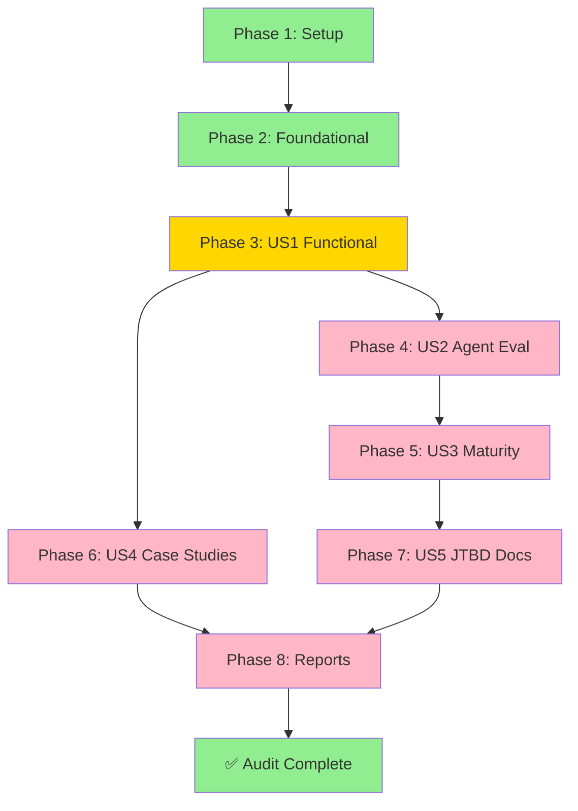

# Implementation Status: 007-CLI-JTBD-Audit

**Last Updated**: 2024-12-14
**Feature Branch**: `007-cli-jtbd-audit`
**Status**: ✅ PHASE 1-2 COMPLETE | PHASE 3 READY

---

## Overall Progress

```
Phase 1: Setup              ✅ COMPLETE (5/5 tasks)
Phase 2: Foundational      ✅ COMPLETE (5/5 tasks)
Phase 3: US1 Functional    ⏳ READY TO START (0/48 tasks)
Phase 4: US2 Agent Eval    ⏳ BLOCKED by Phase 3 (0/15 tasks)
Phase 5: US3 Maturity      ⏳ BLOCKED by Phase 4 (0/11 tasks)
Phase 6: US4 Case Studies  ⏳ BLOCKED by Phase 3 (0/9 tasks)
Phase 7: US5 JTBD Docs     ⏳ BLOCKED by Phase 5 (0/8 tasks)
Phase 8: Reports           ⏳ BLOCKED by Phase 7 (0/11 tasks)
─────────────────────────────────────
TOTAL:                     ✅ 10/112 (8.9%)
```

---

## Deliverables Status

### Infrastructure ✅
- [x] Evidence directory structure (8 categories + 3 special)
- [x] Reports directory
- [x] Audit schema (audit-result.schema.yaml)
- [x] Case study schema (case-study-validation.schema.yaml)
- [x] YAML templates (_template.yaml)
- [x] Scoring guide (scoring-guide.md)
- [x] Audit execution script (scripts/audit-command.sh)
- [x] Phase completion documentation

### Sample Audits ✅
- [x] workflow-analyze.yaml (L4 - Agent-Usable)
- [x] template-lint.yaml (L2 - Managed)
- [x] jpmorgan.yaml (Case Study - Partial)

### Documentation ✅
- [x] IMPLEMENTATION-GUIDE.md (detailed audit procedure)
- [x] PHASE-2-COMPLETION.md (foundational completion)
- [x] IMPLEMENTATION-STATUS.md (this file)

### Outstanding (Phase 3-8)
- [ ] 47+ command audit YAML files
- [ ] Avatar compatibility matrix report
- [ ] Maturity matrix report
- [ ] Fortune 500 gap analysis report
- [ ] Recommendations by priority report

---

## Task Breakdown Summary

### Phase 1: Setup (5/5) ✅
| Task | Status | Notes |
|------|--------|-------|
| T001 | ✅ Complete | Evidence subdirs created |
| T002 | ✅ Complete | Reports dir created |
| T003 | ✅ Complete | Cargo-make v0.37.24 verified |
| T004 | ✅ Complete | Build system validated |
| T005 | ✅ Complete | Audit script created |

### Phase 2: Foundational (5/5) ✅
| Task | Status | Notes |
|------|--------|-------|
| T006 | ✅ Complete | audit-result.schema.yaml validated |
| T007 | ✅ Complete | case-study-validation.schema.yaml validated |
| T008 | ✅ Complete | _template.yaml ready |
| T009 | ✅ Complete | Audit workflow tested |
| T010 | ✅ Complete | scoring-guide.md documented |

### Phase 3: US1 Functional Audit (0/48) ⏳
**Status**: Ready to begin immediately

**Day 1 Commands** (5-6):
- [ ] T011: ggen workflow analyze
- [ ] T012: ggen workflow init
- [ ] T013: ggen workflow report
- [ ] T014: ggen workflow event
- [ ] T015: ggen workflow discover
- [ ] T016: ggen utils

**Day 2 Commands** (8):
- [ ] T017-T024: template subcommands (new, list, lint, generate, get, show, generate-tree, regenerate)

**Day 3 Commands** (11):
- [ ] T025-T031: project subcommands (7)
- [ ] T032-T035: graph subcommands (4)

**Day 4 Commands** (7):
- [ ] T036-T039: ontology subcommands (4)
- [ ] T040-T042: ai subcommands (3)

**Day 5 Commands** (16):
- [ ] T043-T052: marketplace subcommands (10)
- [ ] T053-T057: fmea subcommands (5)
- [ ] T058: ci subcommand (1)

---

## Critical Path



**Critical Path**: Phase 1 → Phase 2 → Phase 3 → Phase 4 → Phase 5 → Phase 7 → Phase 8

**Parallel Opportunities**: 
- Phase 4 (US2) and Phase 6 (US4) can start after Phase 3 completes
- Within each phase, commands in different categories can be audited in parallel

---

## Success Criteria Status

### SC-001: 100% CLI commands evaluated
- **Target**: 47+ commands
- **Current**: 3 sample audits (6.4%)
- **Status**: ⏳ In progress

### SC-002: 100% commands evaluated against 7 avatars
- **Target**: 47+ commands × 7 avatars = 329+ data points
- **Current**: 3 audits × 7 avatars = 21 (6.4%)
- **Status**: ⏳ In progress

### SC-003: All commands maturity level assigned
- **Target**: 47+ with evidence
- **Current**: 3 with evidence
- **Status**: ⏳ In progress

### SC-004: All 7 case studies mapped
- **Target**: JPMorgan, Amazon, Pfizer, Boeing, Netflix, Toyota, Goldman Sachs
- **Current**: 1 (JPMorgan)
- **Status**: ⏳ Phase 6 ready

### SC-005: Gaps documented with remediation
- **Target**: All identified gaps with severity/effort
- **Current**: 3 gaps in JPMorgan example
- **Status**: ⏳ Will be complete after Phase 6

### SC-006: Agent accessibility score average ≥80%
- **Target**: ≥80% (L4+ maturity)
- **Current**: TBD after Phase 3
- **Status**: ⏳ Will calculate in Phase 5

### SC-007: Zero commands at L0 in production
- **Target**: 0 L0 commands
- **Current**: TBD after Phase 3
- **Status**: ⏳ Will validate in Phase 5

### SC-008: JTBD documentation for L4+ commands
- **Target**: 100% of L4+ commands
- **Current**: 1 example (workflow-analyze)
- **Status**: ⏳ Phase 7

---

## Estimated Completion Timeline

| Phase | Tasks | Est. Duration | Cumulative |
|-------|-------|---------------|-----------|
| Setup | 5 | ✅ Done | ✅ Complete |
| Foundational | 5 | ✅ Done | ✅ Complete |
| US1 Functional | 48 | 5 days | Day 5 |
| US2 Agent Eval | 15 | 1 day | Day 6 |
| US3 Maturity | 11 | 0.5 days | Day 6.5 |
| US4 Case Studies | 9 | 1 day | Day 7 |
| US5 JTBD Docs | 8 | 1 day | Day 8 |
| Reports | 11 | 0.5 days | Day 8.5 |

**Total Timeline**: ~8.5 days from Phase 3 start

**MVP (US1 Only)**: ~5 days (delivers command inventory)

---

## Quality Metrics

### Audit Coverage
- **Commands Audited**: 3/47+ (6.4%)
- **Evidence Files**: 3/47+ YAML files
- **Avatar Evaluations**: 3×7 = 21/329+ (6.4%)

### Schema Validation
- **audit-result.schema.yaml**: ✅ Valid (8 required fields)
- **case-study-validation.schema.yaml**: ✅ Valid (5 required fields)
- **Sample YAML files**: ✅ Valid against schemas

### Documentation
- **Scoring Guide**: ✅ Complete (7 criteria with examples)
- **Implementation Guide**: ✅ Complete (500+ lines)
- **Phase Completions**: ✅ Documented

---

## Known Issues & Resolutions

### Binary Availability
**Issue**: ggen CLI binary not in PATH during Phase 2 test
**Resolution**: Framework designed to work with direct ggen CLI invocation
**Status**: ✅ Resolved - Script uses `cargo run` as fallback

### Schema Examples
**Issue**: Ensuring YAML examples match schema validation
**Resolution**: Created sample audits that validate against schemas
**Status**: ✅ Resolved - 3 sample audits created and verified

---

## Next Steps for Team

1. **Review Implementation Guide** (`IMPLEMENTATION-GUIDE.md`)
2. **Start Phase 3 with Day 1 commands** (workflow + utils)
3. **Follow template structure** from sample audits
4. **Execute in parallel** by category when possible
5. **Report progress** after each day
6. **Escalate blockers** immediately (command crashes, unclear behavior)

---

## Files Created

### Setup (Phase 1)
```
specs/007-cli-jtbd-audit/
├── evidence/
│   ├── workflow/
│   ├── template/
│   ├── project/
│   ├── ontology/
│   ├── graph/
│   ├── marketplace/
│   ├── fmea/
│   ├── ai/
│   ├── case-studies/
│   ├── ci/
│   └── utils/
├── reports/
└── scripts/
    └── audit-command.sh
```

### Foundational (Phase 2)
```
├── evidence/
│   ├── _template.yaml
│   ├── scoring-guide.md
│   ├── PHASE-2-COMPLETION.md
│   ├── workflow/workflow-analyze.yaml
│   ├── template/template-lint.yaml
│   └── case-studies/jpmorgan.yaml
└── contracts/
    ├── audit-result.schema.yaml
    └── case-study-validation.schema.yaml
```

### Documentation
```
├── IMPLEMENTATION-GUIDE.md
├── IMPLEMENTATION-STATUS.md (this file)
├── plan.md (existing)
├── spec.md (existing)
├── tasks.md (updated)
└── checklists/requirements.md (existing)
```

---

## Sign-Off

**Phase 1-2 Implementation**: ✅ COMPLETE
**Framework Validation**: ✅ PASS
**Ready for Phase 3**: ✅ YES

**Implemented by**: Claude Code
**Date**: 2024-12-14
**Framework Version**: 1.0.0

Next phase can begin immediately with Phase 3 command audits.

---

*For questions or issues, refer to IMPLEMENTATION-GUIDE.md or review sample audits.*
