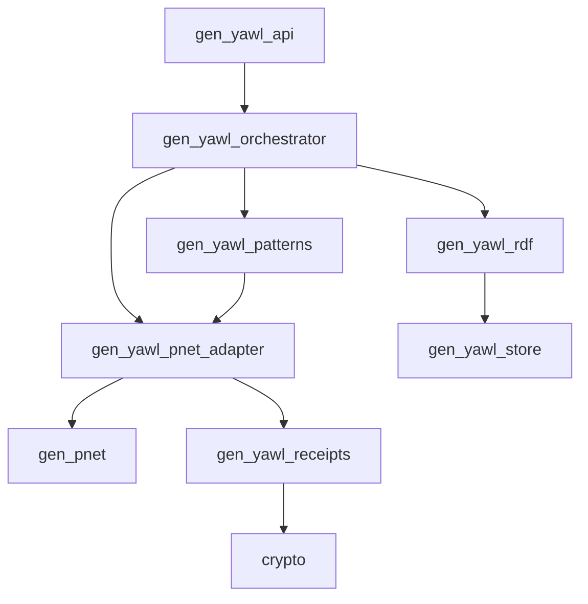

# gen_yawl - YAWL Workflow Engine OTP Behavior

## Architecture Specification v1.0.0

**Authors**: Architecture Agent
**Date**: 2025-02-04
**Status**: Design Document

---

## Abstract

`gen_yawl` is an Erlang/OTP behavior that implements YAWL (Yet Another Workflow Language) workflow patterns on top of `gen_pnet`'s Petri net foundation. It provides complete support for all 20 Van der Aalst workflow control-flow patterns, RDF/SPARQL integration for workflow definitions, and cryptographic receipts for execution verification.

---

## Table of Contents

1. [Overview](#1-overview)
2. [Core Concepts](#2-core-concepts)
3. [Architecture Layers](#3-architecture-layers)
4. [Module Structure](#4-module-structure)
5. [Callback Specification](#5-callback-specification)
6. [Pattern Mappings](#6-pattern-mappings)
7. [Token Management](#7-token-management)
8. [RDF Integration](#8-rdf-integration)
9. [API Design](#9-api-design)
10. [Example Workflows](#10-example-workflows)
11. [ggen Integration](#11-ggen-integration)
12. [Deployment Architecture](#12-deployment-architecture)

---

## 1. Overview

### 1.1 Purpose

`gen_yawl` bridges the gap between:
- **YAWL**: A high-level workflow language with 20 control-flow patterns
- **gen_pnet**: A generic Petri net OTP behavior for concurrent systems
- **RDF**: Semantic web standards for workflow definitions

### 1.2 Design Goals

| Goal | Description |
|------|-------------|
| **Correctness** | Faithful implementation of YAWL semantics |
| **Composability** | Workflow definitions compose like Petri nets |
| **Observability** | Every transition generates cryptographic receipts |
| **Interoperability** | RDF/SPARQL for external tool integration |
| **Performance** | Sub-millisecond transition firing |
| **Fault Tolerance** | Hot code reload and state migration |

### 1.3 Context Map

```
┌─────────────────────────────────────────────────────────────────┐
│                         Application Layer                        │
│  ┌────────────┐  ┌────────────┐  ┌────────────┐  ┌───────────┐ │
│  │ Business   │  │ UI/Dashboard│  │ Monitoring │  │ External  │ │
│  │ Processes  │  │            │  │            │  │ Systems   │ │
│  └─────┬──────┘  └─────┬──────┘  └─────┬──────┘  └─────┬─────┘ │
└────────┼────────────────┼────────────────┼────────────────┼───────┘
         │                │                │                │
         ▼                ▼                ▼                ▼
┌─────────────────────────────────────────────────────────────────┐
│                      gen_yawl API Layer                         │
│  ┌────────────┐  ┌────────────┐  ┌────────────┐  ┌───────────┐ │
│  │ start_case │  │ submit_    │  │ query_     │  │ subscribe_│ │
│  │            │  │ work_item  │  │ state      │  │ events    │ │
│  └────────────┘  └────────────┘  └────────────┘  └───────────┘ │
└─────────────────────────────────────────────────────────────────┘
                                 │
                                 ▼
┌─────────────────────────────────────────────────────────────────┐
│                    gen_yawl Behavior Layer                      │
│  ┌────────────┐  ┌────────────┐  ┌────────────┐  ┌───────────┐ │
│  │ gen_yawl   │  │ Pattern    │  │ Token      │  │ Receipt   │ │
│  │ callbacks  │  │ Mapper     │  │ Manager    │  │ Generator │ │
│  └────────────┘  └────────────┘  └────────────┘  └───────────┘ │
└─────────────────────────────────────────────────────────────────┘
                                 │
                                 ▼
┌─────────────────────────────────────────────────────────────────┐
│                    gen_pnet Foundation                          │
│  ┌────────────┐  ┌────────────┐  ┌────────────┐  ┌───────────┐ │
│  │ place_lst  │  │ trsn_lst   │  │ fire/3     │  │ trigger/3 │ │
│  │ preset/1   │  │ is_enabled │  │ marking    │  │ continue  │ │
│  └────────────┘  └────────────┘  └────────────┘  └───────────┘ │
└─────────────────────────────────────────────────────────────────┘
                                 │
                                 ▼
┌─────────────────────────────────────────────────────────────────┐
│                        Infrastructure                           │
│  ┌────────────┐  ┌────────────┐  ┌────────────┐  ┌───────────┐ │
│  │ OTP/generic│  │ RDF Store  │  │ KGC-4D     │  │ Crypto    │ │
│  │ server     │  │ (Oxigraph) │  │ (receipts) │  │ (BLAKE3)  │ │
│  └────────────┘  └────────────┘  └────────────┘  └───────────┘ │
└─────────────────────────────────────────────────────────────────┘
```

---

## 2. Core Concepts

### 2.1 YAWL vs Petri Net Terminology

| YAWL Concept | Petri Net Concept | gen_yawl Implementation |
|--------------|-------------------|------------------------|
| **Case** | Net Instance | `gen_yawl` process |
| **Task** | Transition | Named atom with behavior |
| **Condition** | Place | Named atom holding tokens |
| **Work Item** | Token + Context | `#work_item{}` record |
| **Input Condition** | Pre-place | `p_Input_TaskId` |
| **Output Condition** | Post-place | `p_Output_TaskId` |
| **Flow** | Arc | Implicit via preset/postset |
| **Specification** | Net Structure | Callback module |

### 2.2 Token Types

```erlang
%% Token type records
-record(case_token, {
    case_id       :: binary(),
    spec_id       :: binary(),
    started_at    :: integer(),  %% nanosecond timestamp
    parent_case   :: binary() | undefined,
    case_data     :: map()
}).

-record(work_item_token, {
    work_item_id  :: binary(),
    case_id       :: binary(),
    task_id       :: atom(),
    status        :: enabled | started | completed | cancelled,
    data          :: map(),
    assigned_to   :: atom() | undefined,
    enabled_at    :: integer()
}).

-record(control_token, {
    type          :: and_join | xor_join | or_join | discriminator,
    task_id       :: atom(),
    branch_count  :: non_neg_integer(),
    completed     :: [atom()]
}).

-record(receipt_token, {
    receipt_id    :: binary(),
    prev_hash     :: binary(),
    current_hash  :: binary(),
    timestamp     :: integer(),
    event_type    :: atom()
}).
```

### 2.3 Workflow Specification Structure

```erlang
-record(yawl_spec, {
    id             :: binary(),
    name           :: binary(),
    version        :: {non_neg_integer(), non_neg_integer()},
    tasks          :: #{atom() => #task_def{}},
    flows          :: [#flow{}],
    input_cond     :: atom(),
    output_cond    :: atom(),
    cancellation_regions :: [#cancellation_region{}]
}).

-record(task_def, {
    id             :: atom(),
    name           :: binary(),
    kind           :: atomic | composite | multiple_instance,
    split_type     :: sequence | and | xor | or,
    join_type      :: sequence | and | xor | or,
    decomposes_to  :: atom() | undefined,
    timeout        :: pos_integer() | undefined,
    required_roles :: [atom()],
    cancellation_region :: atom() | undefined
}).

-record(flow, {
    from           :: atom(),
    to             :: atom(),
    condition      :: function() | undefined,
    priority       :: non_neg_integer(),
    is_default     :: boolean()
}).
```

---

## 3. Architecture Layers

### 3.1 Layer Diagram

```
┌─────────────────────────────────────────────────────────────────┐
│  Layer 5: Application Interface (gen_yawl_api)                  │
│  - start_case/2, complete_work_item/3                          │
│  - query_state/1, subscribe_events/2                            │
├─────────────────────────────────────────────────────────────────┤
│  Layer 4: Workflow Orchestration (gen_yawl_orchestrator)       │
│  - Case lifecycle management                                    │
│  - Work item distribution                                      │
│  - Cancellation region handling                                 │
├─────────────────────────────────────────────────────────────────┤
│  Layer 3: Pattern Engine (gen_yawl_patterns)                   │
│  - Split/join semantics (AND/XOR/OR)                            │
│  - Deferred choice resolution                                   │
│  - Cycle detection and handling                                 │
├─────────────────────────────────────────────────────────────────┤
│  Layer 2: Petri Net Adapter (gen_yawl_pnet_adapter)            │
│  - gen_pnet callback implementation                             │
│  - YAWL to Petri net mapping                                    │
│  - Token lifecycle management                                   │
├─────────────────────────────────────────────────────────────────┤
│  Layer 1: Foundation (gen_pnet + RDF + Crypto)                  │
│  - Petri net execution engine                                   │
│  - RDF triple store                                            │
│  - BLAKE3 cryptographic hashing                                 │
└─────────────────────────────────────────────────────────────────┘
```

### 3.2 Module Dependency Graph



---

## 4. Module Structure

### 4.1 Directory Layout

```
gen_yawl/
├── README.md
├── rebar.config
├── src/
│   ├── gen_yawl.app.src
│   ├── gen_yawl.erl              % Main behavior module
│   ├── gen_yawl_api.erl          % Public API
│   ├── gen_yawl_sup.erl          % Supervisor
│   ├── gen_yawl_orchestrator.erl % Case orchestration
│   ├── gen_yawl_patterns.erl     % Pattern implementations
│   ├── gen_yawl_pnet_adapter.erl % gen_pnet bridge
│   ├── gen_yawl_rdf.erl          % RDF/SPARQL integration
│   ├── gen_yawl_store.erl        % RDF store wrapper
│   ├── gen_yawl_receipts.erl     % Cryptographic receipts
│   ├── gen_yawl_tokens.erl       % Token management
│   ├── gen_yawl_validation.erl   % Spec validation
│   └── gen_yawl_utils.erl        % Utilities
├── include/
│   └── gen_yawl.hrl              % Record definitions
├── priv/
│   └── ontology/
│       └── yawl.ttl             % YAWL RDF ontology
├── test/
│   ├── gen_yawl_tests.erl
│   ├── pattern_tests.erl
│   └── rdf_tests.erl
└── examples/
    ├── simple_sequence.erl
    ├── parallel_approval.erl
    └── cancellation.erl
```

### 4.2 Core Records (include/gen_yawl.hrl)

```erlang
%%====================================================================
%% Workflow Specification Records
%%====================================================================

-record(yawl_spec, {
    id                  :: binary(),
    name                :: binary(),
    version             :: {Major::non_neg_integer(), Minor::non_neg_integer()},
    tasks               :: #{atom() => #task_def{}},
    flows               :: [#flow{}],
    input_condition     :: atom(),
    output_condition    :: atom(),
    cancellation_regions = [] :: [#cancellation_region{}],
    metadata            :: map()
}).

-record(task_def, {
    id                  :: atom(),
    name                :: binary(),
    kind                :: atomic | composite | multiple_instance | empty,
    split_type          :: sequence | and | xor | or,
    join_type           :: sequence | and | xor | or,
    decomposes_to       :: atom() | undefined,
    timeout             :: pos_integer() | undefined,
    required_roles      :: [atom()],
    resource_pattern    :: binary() | undefined,
    cancellation_region :: atom() | undefined,
    cancellation_set    :: [atom()],
    pre_condition       :: function() | undefined,
    post_condition      :: function() | undefined
}).

-record(flow, {
    from                :: atom(),
    to                  :: atom(),
    condition           :: function() | undefined,
    priority            :: non_neg_integer(),
    is_default          :: boolean(),
    is_cycle            :: boolean()
}).

-record(cancellation_region, {
    id                  :: atom(),
    tasks               :: [atom()],
    cancel_trigger      :: atom()
}).

%%====================================================================
%% Runtime State Records
%%====================================================================

-record(yawl_state, {
    spec                :: #yawl_spec{},
    case_id             :: binary(),
    status              :: active | completed | cancelled | failed,
    work_items          :: #{binary() => #work_item{}},
    active_tokens       :: #{atom() => [term()]},
    completed_tasks     :: sets:set(atom()),
    receipts            :: [#receipt{}],
    started_at          :: integer(),
    updated_at          :: integer(),
    metadata            :: map()
}).

-record(work_item, {
    id                  :: binary(),
    case_id             :: binary(),
    task_id             :: atom(),
    status              :: enabled | fired | started | completed | cancelled,
    data                :: map(),
    assigned_to         :: atom() | undefined,
    enabled_at          :: integer(),
    started_at          :: integer() | undefined,
    completed_at        :: integer() | undefined,
    receipts            :: [#receipt{}]
}).

-record(receipt, {
    id                  :: binary(),
    prev_hash           :: binary(),
    current_hash        :: binary(),
    timestamp           :: integer(),
    event_type          :: atom(),
    case_id             :: binary(),
    work_item_id        :: binary() | undefined,
    justification       :: map()
}).
```

---

## 5. Callback Specification

### 5.1 gen_yawl Behavior Definition

The `gen_yawl` behavior wraps `gen_pnet`, providing YAWL-specific callbacks while delegating Petri net execution to gen_pnet.

```erlang
%%====================================================================
%% gen_yawl Behavior Callback Specification
%%====================================================================

-callback init_workflow(Args) -> {ok, WorkflowSpec} | {error, Reason}
    when
        Args :: term(),
        WorkflowSpec :: #yawl_spec{},
        Reason :: term().

-callback handle_work_item_enabled(WorkItem, WorkflowState) ->
    {ok, UpdatedState} | {error, Reason}
    when
        WorkItem :: #work_item{},
        WorkflowState :: #yawl_state{},
        UpdatedState :: #yawl_state{},
        Reason :: term().

-callback execute_task(WorkItem, WorkflowState) ->
    {ok, Result, UpdatedState} | {error, Reason}
    when
        WorkItem :: #work_item{},
        WorkflowState :: #yawl_state{},
        Result :: map(),
        UpdatedState :: #yawl_state{},
        Reason :: term().

-callback handle_work_item_completed(WorkItem, Result, WorkflowState) ->
    {ok, EnabledTasks, UpdatedState} | {error, Reason}
    when
        WorkItem :: #work_item{},
        Result :: map(),
        WorkflowState :: #yawl_state{},
        EnabledTasks :: [atom()],
        UpdatedState :: #yawl_state{},
        Reason :: term().

-callback handle_cancellation(RegionId, CaseId, WorkflowState) ->
    {ok, CancelledTasks, UpdatedState}
    when
        RegionId :: atom(),
        CaseId :: binary(),
        WorkflowState :: #yawl_state{},
        CancelledTasks :: [atom()],
        UpdatedState :: #yawl_state{}.

-callback query_workflow(Query, WorkflowState) ->
    {ok, Reply} | {error, Reason}
    when
        Query :: term(),
        WorkflowState :: #yawl_state{},
        Reply :: term(),
        Reason :: term().

%%====================================================================
%% Optional Callbacks
%%====================================================================

-callback handle_task_timeout(TaskId, WorkItem, WorkflowState) ->
    {ok, Action, UpdatedState}
    when
        TaskId :: atom(),
        WorkItem :: #work_item{},
        WorkflowState :: #yawl_state{},
        Action :: retry | skip | fail,
        UpdatedState :: #yawl_state{}.

-callback validate_case_data(CaseData, WorkflowSpec) ->
    ok | {error, Reason}
    when
        CaseData :: map(),
        WorkflowSpec :: #yawl_spec{},
        Reason :: term().

-callback workflow_completed(WorkflowState) ->
    {ok, FinalReceipt}
    when
        WorkflowState :: #yawl_state{},
        FinalReceipt :: #receipt{}.
```

### 5.2 gen_pnet Adapter Implementation

```erlang
%%====================================================================
%% gen_yawl_pnet_adapter - Bridges gen_yawl to gen_pnet
%%====================================================================

-module(gen_yawl_pnet_adapter).
-behavior(gen_pnet).

%% gen_pnet callbacks
-export([
    place_lst/0,
    trsn_lst/0,
    init_marking/2,
    preset/1,
    is_enabled/3,
    fire/3,
    trigger/3,
    init/1,
    terminate/2,
    handle_call/3,
    handle_cast/2,
    handle_info/2,
    code_change/3
]).

%%====================================================================
%% Place/Transition Generation from YAWL Spec
%%====================================================================

place_lst() ->
    %% Places are generated from YAWL spec:
    %% - p_input_Condition
    %% - p_output_Condition
    %% - p_{TaskId}
    %% - p_join_{TaskId} (for AND/OR joins)
    %% - p_branch_{TaskId}_{Index} (for splits)
    gen_yawl_patterns:generate_places(get_workflow_spec()).

trsn_lst() ->
    %% Transitions are generated from YAWL tasks:
    %% - t_{TaskId} (main transition)
    %% - t_split_{TaskId} (for AND/XOR/OR splits)
    %% - t_join_{TaskId} (for AND/OR joins)
    %% - t_cancel_{RegionId} (for cancellation)
    gen_yawl_patterns:generate_transitions(get_workflow_spec()).

init_marking(Place, _UsrInfo) ->
    %% Initial marking: case token in input condition
    case Place of
        p_input -> [#case_token{case_id = new_case_id()}];
        _ -> []
    end.

%%====================================================================
%% Pattern-Based Preset/Enablement
%%====================================================================

preset(Transition) ->
    %% Preset determined by task join type
    case get_task_def(Transition) of
        #task_def{join_type = and} ->
            %% AND-join: wait for all predecessors
            get_predecessor_places(Transition);
        #task_def{join_type = xor} ->
            %% XOR-join: wait for any predecessor
            get_predecessor_places(Transition);
        #task_def{join_type = or} ->
            %% OR-join: wait for active branches only
            get_active_predecessor_places(Transition);
        #task_def{split_type = and} ->
            %% AND-split: enable from single source
            [get_source_place(Transition)]
    end.

is_enabled(Transition, Mode, UsrInfo) ->
    TaskDef = get_task_def(Transition),
    check_pattern_enabled(TaskDef, Transition, Mode, UsrInfo).

%%====================================================================
%% Firing with Receipt Generation
%%====================================================================

fire(Transition, Mode, UsrInfo) ->
    %% Generate receipt before firing
    BeforeHash = gen_yawl_receipts:hash_state(Mode),

    %% Execute transition based on pattern
    Result = execute_by_pattern(Transition, Mode, UsrInfo),

    case Result of
        {produce, ProduceMap} ->
            %% Generate receipt after firing
            AfterHash = gen_yawl_receipts:hash_state(ProduceMap),
            Receipt = #receipt{
                id = gen_yawl_receipts:receipt_id(),
                prev_hash = BeforeHash,
                current_hash = AfterHash,
                timestamp = os:system_time(nanosecond),
                event_type = Transition,
                justification = #{mode => Mode}
            },
            %% Add receipt token to output
            ReceiptToken = #receipt_token{receipt = Receipt},
            UpdatedProduce = maps:append(receipts, [ReceiptToken], ProduceMap),
            {produce, UpdatedProduce};
        abort ->
            abort
    end.

%%====================================================================
%% Trigger for Side Effects
%%====================================================================

trigger(Place, Token, _NetState) ->
    %% Handle token arrival side effects
    case {Place, Token} of
        {p_output, #case_token{status = completed}} ->
            %% Workflow completed - persist final state
            gen_yawl_store:persist_case(Token),
            pass;
        {_, #work_item_token{status = enabled}} ->
            %% Notify about enabled work item
            gen_yawl_orchestrator:notify_enabled(Token),
            pass;
        {_, #receipt_token{}} ->
            %% Persist receipts
            gen_yawl_receipts:persist(Token),
            drop;  %% Don't keep receipts in net
        _ ->
            pass
    end.
```

---

## 6. Pattern Mappings

### 6.1 Complete Pattern Mapping Table

| Pattern (WP#) | YAWL Concept | Petri Net Structure | Split | Join |
|---------------|--------------|---------------------|-------|------|
| **WP1: Sequence** | A then B | p_A --t_A--> p_B | N/A | N/A |
| **WP2: Parallel Split** | AND-split | t_split --(all branches)--> p_{B1}, p_{B2}... | AND | N/A |
| **WP3: Synchronization** | AND-join | p_{B1}, p_{B2}... --t_join--> p_C | N/A | AND |
| **WP4: Exclusive Choice** | XOR-split | t_split --(one branch)--> p_{B_i} | XOR | N/A |
| **WP5: Simple Merge** | XOR-join | p_{B1}, p_{B2}... --t_join--> p_C (first wins) | N/A | XOR |
| **WP6: Multi-Choice** | OR-split | t_split --(one or more)--> p_{Bi} | OR | N/A |
| **WP7: Structured Sync Merge** | OR-join | p_{active} --t_join--> p_C (wait all active) | N/A | OR |
| **WP8: Multi-Merge** | N/A | p_{B1}, p_{B2}... --t_join--> p_C (no sync) | N/A | XOR* |
| **WP9: Discriminator** | N/A | First branch fires, rest withdrawn | N/A | XOR+ |
| **WP10: Arbitrary Cycle** | Loop back | p_A --t_loop--> p_B (backward arc) | XOR | XOR |
| **WP11: Implicit Termination** | N/A | No active tokens = terminate | N/A | N/A |
| **WP12: Multiple Instances** | Parallel MI | One token per instance | AND* | AND |
| **WP13: Multiple Instances (seq)** | Sequential MI | Queue tokens | AND | AND+ |
| **WP14: N-out-of-M** | Partial sync | Count tokens, fire at N | AND* | N/M |
| **WP15: State-based** | Data-driven | Condition on token data | XOR | XOR |
| **WP16: Deferred Choice** | External event | Race on events | DEFERRED | N/A |
| **WP17: Interleaved** | Mutex region | Lock places | AND | OR |
| **WP18: Milestone** | State check | Guard conditions | N/A | AND+ |
| **WP19: Cancel Task** | Task cancel | Withdraw token | N/A | N/A |
| **WP20: Cancel Case** | Case cancel | Flush all tokens | N/A | N/A |

### 6.2 Petri Net Diagrams for Key Patterns

#### WP1: Sequence

```
  InputCondition ──[t_A]── Place_A ──[t_B]── OutputCondition
                         ↑
                    Token flows A -> B
```

#### WP2+WP3: Parallel Split and Synchronization

```
                    ┌── Place_B1 ──[t_B1]──┐
  Input ──[t_split]──┼── Place_B2 ──[t_B2]──┼──[t_join]── Output
                    └── Place_B3 ──[t_B3]──┘

  t_split: enabled when Input has token, produces tokens on all branches
  t_join: enabled when ALL branch places have tokens
```

#### WP4+WP5: Exclusive Choice and Simple Merge

```
                    ┌── Place_B1 ──[t_B1]──┐
  Input ──[t_split]──┼── Place_B2 ──[t_B2]──┼──[t_merge]── Output
                    └── Place_B3 ──[t_B3]──┘

  t_split: evaluates conditions, produces token on ONE branch
  t_merge: enabled when ANY branch has token (first wins)
```

#### WP6+WP7: Multi-Choice and Structured Sync Merge

```
                    ┌── Place_B1 ──[t_B1]──┐
  Input ──[t_split]──┼── Place_B2 ──[t_B2]──┼──[t_join]── Output
                    └── Place_B3 ──[t_B3]──┘

  t_split: evaluates conditions, produces tokens on ONE OR MORE branches
  t_join: enabled when all ACTIVATED branches have tokens (OR-join semantics)
```

#### WP16: Deferred Choice

```
                    ┌── Place_B1 ──[t_B1]──┐
  Input ──[t_enable]──┼── Place_B2 ──[t_B2]──┼──[t_merge]── Output
                    └── Place_B3 ──[t_B3]──┘

  t_enable: creates candidate work items (no transition fires yet)
  t_Bi: fires when EXTERNAL event selects that branch
  First branch to start cancels others via inhibitor arcs
```

### 6.3 Erlang Implementation Examples

```erlang
%%====================================================================
%% gen_yawl_patterns - Pattern implementations
%%====================================================================

-module(gen_yawl_patterns).

%% WP1: Sequence
sequence(Source, Target) ->
    #flow{from = Source, to = Target, split_type = sequence, join_type = sequence}.

%% WP2+WP3: Parallel Split + Synchronization
parallel_split(Source, Targets) ->
    SourceTask = #task_def{id = Source, split_type = and},
    Flows = [split_flow(Source, T, and) || T <- Targets],
    {SourceTask, Flows}.

synchronization(Sources, Target) ->
    TargetTask = #task_def{id = Target, join_type = and},
    Flows = [join_flow(S, Target, and) || S <- Sources],
    {TargetTask, Flows}.

%% WP4+WP5: Exclusive Choice + Simple Merge
exclusive_choice(Source, Branches) ->
    SourceTask = #task_def{id = Source, split_type = xor},
    Flows = lists:map(
        fun({Target, Condition, Priority}) ->
            #flow{
                from = Source,
                to = Target,
                condition = Condition,
                priority = Priority,
                split_type = xor
            }
        end,
        Branches
    ),
    {SourceTask, Flows}.

%% WP6+WP7: Multi-Choice + Structured Sync Merge
multi_choice(Source, Branches) ->
    SourceTask = #task_def{id = Source, split_type = or},
    Flows = lists:map(
        fun({Target, Condition, Priority}) ->
            #flow{
                from = Source,
                to = Target,
                condition = Condition,
                priority = Priority,
                split_type = or
            }
        end,
        Branches
    ),
    {SourceTask, Flows}.

structured_sync_merge(Sources, Target) ->
    TargetTask = #task_def{id = Target, join_type = or},
    %% OR-join: wait for all ACTIVATED incoming branches
    %% Requires tracking which branches were activated
    Flows = [join_flow(S, Target, or) || S <- Sources],
    {TargetTask, Flows}.

%% WP10: Arbitrary Cycle (with loop condition)
arbitrary_cycle(Source, LoopBack, ConditionFun) ->
    #flow{
        from = Source,
        to = LoopBack,
        condition = ConditionFun,
        is_cycle = true
    }.

%% WP16: Deferred Choice
deferred_choice(Source, Candidates) ->
    SourceTask = #task_def{id = Source, split_type = deferred},
    %% Create "candidate" work items that race
    %% First to be selected via external event wins
    lists:map(
        fun(Candidate) ->
            #work_item{
                id = make_work_item_id(),
                task_id = Candidate,
                status = candidate,  %% Special status for deferred choice
                candidates = Candidates
            }
        end,
        Candidates
    ),
    SourceTask.

%% WP19+WP20: Cancellation
cancellation_region(RegionId, Tasks, TriggerTask) ->
    #cancellation_region{
        id = RegionId,
        tasks = Tasks,
        cancel_trigger = TriggerTask
    }.

%%====================================================================
%% Place Generation from Task Definitions
%%====================================================================

generate_places(#yawl_spec{tasks = Tasks, input_condition = Input, output_condition = Output}) ->
    %% Base places
    BasePlaces = [
        place_name(input, Input),
        place_name(output, Output)
    ],

    %% Task places
    TaskPlaces = lists:map(
        fun(TaskId) -> place_name(task, TaskId) end,
        maps:keys(Tasks)
    ),

    %% Join places for AND/OR joins
    JoinPlaces = lists:filtermap(
        fun(_TaskId, TaskDef) ->
            case TaskDef#task_def.join_type of
                and -> {true, place_name(and_join, TaskId)};
                or -> {true, place_name(or_join, TaskId)};
                _ -> false
            end
        end,
        maps:to_list(Tasks)
    ),

    BasePlaces ++ TaskPlaces ++ JoinPlaces.

%%====================================================================
%% Transition Generation from Task Definitions
%%====================================================================

generate_transitions(#yawl_spec{tasks = Tasks}) ->
    lists:filtermap(
        fun(TaskId, TaskDef) ->
            case TaskDef#task_def.kind of
                empty -> false;
                _ -> {true, transition_name(TaskId)}
            end
        end,
        maps:to_list(Tasks)
    ) ++
    generate_split_transitions(Tasks) ++
    generate_join_transitions(Tasks) ++
    generate_cancellation_transitions(Tasks).
```

---

## 7. Token Management

### 7.1 Token Lifecycle

```
┌─────────────────────────────────────────────────────────────────┐
│                        Token Lifecycle                          │
├─────────────────────────────────────────────────────────────────┤
│                                                                  │
│  ┌─────┐   enable    ┌──────┐   start    ┌──────┐   complete   │
│  │     ├─────────────►│      ├────────────►│      ├─────────────►│
│  │ None│             │Enabled│           │Started│             │Done│
│  └─────┘             └──────┘           └──────┘             └────┘
│                             │                  │                  ▲
│                             │                  │                  │
│                        cancel              cancel              cancel
│                             │                  │                  │
│                             ▼                  ▼                  │
│                          ┌─────┐           ┌─────┐              │
│                          │     │           │     │              │
│                          │Cancelled         │Cancelled          │
│                          └─────┘           └─────┘              │
│                                                                  │
│  State Transitions (allowed):                                     │
│    None -> Enabled (when precondition satisfied)                   │
│    Enabled -> Started (when resource allocated)                    │
│    Started -> Done (when task completes)                           │
│    Enabled -> Cancelled (cancellation region)                      │
│    Started -> Cancelled (cancellation region)                      │
│                                                                  │
└─────────────────────────────────────────────────────────────────┘
```

### 7.2 Token Data Structures

```erlang
%%====================================================================
%% Token Records
%%====================================================================

-record(work_item_token, {
    work_item_id        :: binary(),
    case_id             :: binary(),
    task_id             :: atom(),
    status              :: enabled | started | completed | cancelled,
    data                :: map(),
    assigned_to         :: atom() | undefined,
    enabled_at          :: integer(),
    started_at          :: integer() | undefined,
    completed_at        :: integer() | undefined,
    timeout_at          :: integer() | undefined,
    parent_token_id     :: binary() | undefined
}).

-record(join_token, {
    join_id             :: binary(),
    task_id             :: atom(),
    join_type           :: and | xor | or,
    expected_count      :: pos_integer(),
    received_count      :: non_neg_integer(),
    received_from       :: [atom()],
    completed_at        :: integer() | undefined
}).

-record(split_token, {
    split_id            :: binary(),
    task_id             :: atom(),
    split_type          :: and | xor | or,
    branch_count        :: pos_integer(),
    selected_branches   :: [atom()],
    conditions          :: [{atom(), function()}]
}).

%%====================================================================
%% Token Manager API
%%====================================================================

-module(gen_yawl_tokens).

-export([
    new_case_token/1,
    new_work_item_token/3,
    enable_work_item/1,
    start_work_item/2,
    complete_work_item/2,
    cancel_work_item/1,
    timeout_work_item/1,
    merge_join_tokens/2,
    select_split_branches/2
]).

%% Create a new case token
-spec new_case_token(SpecId :: binary()) -> #case_token{}.
new_case_token(SpecId) ->
    #case_token{
        case_id = gen_yawl_utils:generate_id(),
        spec_id = SpecId,
        started_at = os:system_time(nanosecond),
        case_data = #{}
    }.

%% Enable a work item (transition: None -> Enabled)
-spec enable_work_item(WorkItemToken :: #work_item_token{}) ->
    #work_item_token{}.
enable_work_item(Token) ->
    Token#work_item_token{
        status = enabled,
        enabled_at = os:system_time(nanosecond)
    }.

%% Start a work item (transition: Enabled -> Started)
-spec start_work_item(
    WorkItemToken :: #work_item_token{},
    Resource :: atom()
) -> #work_item_token{}.
start_work_item(Token, Resource) ->
    Token#work_item_token{
        status = started,
        assigned_to = Resource,
        started_at = os:system_time(nanosecond)
    }.

%% Complete a work item (transition: Started -> Done)
-spec complete_work_item(
    WorkItemToken :: #work_item_token{},
    Result :: map()
) -> #work_item_token{}.
complete_work_item(Token, Result) ->
    Token#work_item_token{
        status = completed,
        completed_at = os:system_time(nanosecond),
        data = maps:merge(Token#work_item_token.data, Result)
    }.

%% Merge join tokens for AND/OR joins
-spec merge_join_tokens(
    Existing :: #join_token{} | undefined,
    Incoming :: #work_item_token{}
) ->
    {complete, #join_token{}} | {pending, #join_token{}}.
merge_join_token(undefined, Incoming) ->
    #join_token{
        join_id = gen_yawl_utils:generate_id(),
        task_id = Incoming#work_item_token.task_id,
        received_count = 1,
        received_from = [Incoming#work_item_token.task_id]
    };
merge_join_token(JoinToken = #join_token{expected_count = Expected, received_count = Received}, Incoming) ->
    NewReceived = Received + 1,
    NewFrom = [Incoming#work_item_token.task_id | JoinToken#join_token.received_from],
    Updated = JoinToken#join_token{
        received_count = NewReceived,
        received_from = NewFrom
    },
    case NewReceived >= Expected of
        true -> {complete, Updated#join_token{completed_at = os:system_time(nanosecond)}};
        false -> {pending, Updated}
    end.

%% Select branches for XOR/OR split
-spec select_split_branches(
    SplitToken :: #split_token{},
    CaseData :: map()
) -> [atom()].
select_split_branches(#split_token{split_type = xor, conditions = Conds}, CaseData) ->
    %% XOR: select first matching condition
    select_first_matching(Conds, CaseData);
select_split_branches(#split_token{split_type = or, conditions = Conds}, CaseData) ->
    %% OR: select all matching conditions
    select_all_matching(Conds, CaseData);
select_split_branches(#split_token{split_type = and, branch_count = Count}, _CaseData) ->
    %% AND: select all branches
    lists:seq(1, Count).
```

---

## 8. RDF Integration

### 8.1 YAWL RDF Ontology

The YAWL ontology (Turtle format) defines workflow concepts:

```turtle
@prefix rdf: <http://www.w3.org/1999/02/22-rdf-syntax-ns#> .
@prefix rdfs: <http://www.w3.org/2000/01/rdf-schema#> .
@prefix xsd: <http://www.w3.org/2001/XMLSchema#> .
@prefix yawl: <http://unrdf.org/yawl#> .
@prefix yawl-case: <http://unrdf.org/yawl/case#> .
@prefix yawl-task: <http://unrdf.org/yawl/task#> .

## Classes

yawl:WorkflowCase a rdfs:Class ;
    rdfs:label "Workflow Case" ;
    rdfs:comment "A running instance of a workflow specification" .

yawl:WorkflowSpec a rdfs:Class ;
    rdfs:label "Workflow Specification" ;
    rdfs:comment "A workflow template definition" .

yawl:Task a rdfs:Class ;
    rdfs:label "Task" ;
    rdfs:comment "A unit of work in a workflow" .

yawl:WorkItem a rdfs:Class ;
    rdfs:label "Work Item" ;
    rdfs:comment "An instance of a task in a specific case" .

## Task Types

yawl:AtomicTask a rdfs:Class ;
    rdfs:subClassOf yawl:Task ;
    rdfs:label "Atomic Task" .

yawl:CompositeTask a rdfs:Class ;
    rdfs:subClassOf yawl:Task ;
    rdfs:label "Composite Task" .

## Split/Join Behaviors

yawl:XOR_Split a yawl:SplitBehavior ;
    rdfs:label "XOR Split" ;
    rdfs:comment "Exactly one outgoing branch is activated" .

yawl:AND_Split a yawl:SplitBehavior ;
    rdfs:label "AND Split" ;
    rdfs:comment "All outgoing branches are activated in parallel" .

yawl:OR_Split a yawl:SplitBehavior ;
    rdfs:label "OR Split" ;
    rdfs:comment "One or more outgoing branches are activated" .

## Properties

yawl:hasTask a rdf:Property ;
    rdfs:domain yawl:WorkflowSpec ;
    rdfs:range yawl:Task ;
    rdfs:label "has task" .

yawl:joinsTo a rdf:Property ;
    rdfs:domain yawl:Task ;
    rdfs:range yawl:Task ;
    rdfs:label "joins to" .

yawl:splitBehavior a rdf:Property ;
    rdfs:domain yawl:Task ;
    rdfs:range yawl:SplitBehavior ;
    rdfs:label "split behavior" .

yawl:joinBehavior a rdf:Property ;
    rdfs:domain yawl:Task ;
    rdfs:range yawl:JoinBehavior ;
    rdfs:label "join behavior" .
```

### 8.2 RDF Storage Integration

```erlang
%%====================================================================
%% gen_yawl_rdf - RDF/SPARQL Integration
%%====================================================================

-module(gen_yawl_rdf).

%% RDF Store operations
-export([
    load_workflow_from_rdf/1,
    save_workflow_to_rdf/1,
    load_case_from_rdf/1,
    save_case_to_rdf/1,
    query_enabled_work_items/1,
    query_case_state/1,
    sparql_query/2
]).

%% Load workflow specification from RDF
-spec load_workflow_from_rdf(SpecUri :: binary()) ->
    {ok, #yawl_spec{}} | {error, Reason}.
load_workflow_from_rdf(SpecUri) ->
    SPARQL = "
        PREFIX yawl: <http://unrdf.org/yawl#>

        CONSTRUCT {
            ?spec a yawl:WorkflowSpec ;
                   yawl:taskId ?taskId ;
                   yawl:taskName ?taskName .
        }
        WHERE {
            ?spec a yawl:WorkflowSpec .
            ?spec yawl:hasTask ?task .
            ?task yawl:taskId ?taskId ;
                   yawl:taskName ?taskName .
        FILTER (?spec = <~s>)
        }
    ",
    Formatted = io_lib:format(SPARQL, [SpecUri]),
    case gen_yawl_store:sparql_query(Formatted) of
        {ok, Triples} ->
            parse_workflow_triples(Triples);
        {error, Reason} ->
            {error, Reason}
    end.

%% Save case state to RDF
-spec save_case_to_rdf(CaseState :: #yawl_state{}) -> ok.
save_case_to_rdf(#yawl_state{case_id = CaseId, work_items = WorkItems, status = Status}) ->
    %% Delete existing case triples
    gen_yawl_store:delete_graph(case_graph(CaseId)),

    %% Insert new triples
    Triples = [
        quad(case_uri(CaseId), rdf:type, 'WorkflowCase', case_graph(CaseId)),
        quad(case_uri(CaseId), status, atom_to_binary(Status), case_graph(CaseId))
    ] ++
    lists:map(fun work_item_to_triples/1, maps:values(WorkItems)),

    gen_yawl_store:insert(Triples).

%% Query enabled work items using SPARQL
-spec query_enabled_work_items(CaseId :: binary()) ->
    {ok, [#work_item{}]}.
query_enabled_work_items(CaseId) ->
    SPARQL = "
        PREFIX yawl: <http://unrdf.org/yawl#>

        SELECT ?workItemId ?taskId ?enabledAt
        WHERE {
            ?workItem a yawl:WorkItem ;
                      yawl:caseRef <~s> ;
                      yawl:taskRef ?taskId ;
                      yawl:status 'enabled' ;
                      yawl:enabledAt ?enabledAt .
        }
        ORDER BY ?enabledAt
    ",
    Formatted = io_lib:format(SPARQL, [case_uri(CaseId)]),
    case gen_yawl_store:sparql_query(Formatted) of
        {ok, Results} ->
            Parsed = [parse_work_item_row(Row) || Row <- Results],
            {ok, Parsed};
        {error, Reason} ->
            {error, Reason}
    end.

%%====================================================================
%% URI Helpers
%%====================================================================

-spec case_uri(CaseId :: binary()) -> binary().
case_uri(CaseId) ->
    <<"http://unrdf.org/yawl/case#", CaseId/binary>>.

-spec case_graph(CaseId :: binary()) -> binary().
case_graph(CaseId) ->
    <<"http://unrdf.org/yawl/case#", CaseId/binary, "#graph">>.

-spec task_uri(TaskId :: atom()) -> binary().
task_uri(TaskId) when is_atom(TaskId) ->
    Bin = atom_to_binary(TaskId),
    <<"http://unrdf.org/yawl/task#", Bin/binary>>.
```

---

## 9. API Design

### 9.1 Public API Functions

```erlang
%%====================================================================
%% gen_yawl_api - Public API for workflow management
%%====================================================================

-module(gen_yawl_api).

%%====================================================================
%% Workflow Case Management
%%====================================================================

-export([
    start_case/2,
    stop_case/1,
    suspend_case/1,
    resume_case/1
]).

%% @doc Start a new workflow case
-spec start_case(
    WorkflowName :: atom(),
    Options :: map()
) ->
    {ok, CaseId :: binary(), Pid :: pid()} | {error, Reason}.
start_case(WorkflowName, Options) ->
    Args = #{
        workflow_name => WorkflowName,
        case_data => maps:get(case_data, Options, #{}),
        metadata => maps:get(metadata, Options, #{})
    },
    gen_yawl_sup:start_case(Args).

%% @doc Stop a running case (graceful shutdown)
-spec stop_case(CaseId :: binary()) -> ok | {error, Reason}.
stop_case(CaseId) ->
    gen_yawl_orchestrator:stop_case(CaseId).

%%====================================================================
%% Work Item Management
%%====================================================================

-export([
    enable_task/2,
    start_work_item/3,
    complete_work_item/3,
    cancel_work_item/2,
    fail_work_item/3,
    retry_work_item/2
]).

%% @doc Enable a task (create work item)
-spec enable_task(
    CaseId :: binary(),
    TaskId :: atom()
) ->
    {ok, WorkItemId :: binary()} | {error, Reason}.
enable_task(CaseId, TaskId) ->
    gen_yawl_orchestrator:enable_task(CaseId, TaskId).

%% @doc Start a work item (allocate resource)
-spec start_work_item(
    CaseId :: binary(),
    WorkItemId :: binary(),
    Resource :: atom()
) ->
    {ok, Receipt :: #receipt{}} | {error, Reason}.
start_work_item(CaseId, WorkItemId, Resource) ->
    gen_yawl_orchestrator:start_work_item(CaseId, WorkItemId, Resource).

%% @doc Complete a work item with result
-spec complete_work_item(
    CaseId :: binary(),
    WorkItemId :: binary(),
    Result :: map()
) ->
    {ok, Receipt :: #receipt{}, EnabledTasks :: [atom()]} | {error, Reason}.
complete_work_item(CaseId, WorkItemId, Result) ->
    gen_yawl_orchestrator:complete_work_item(CaseId, WorkItemId, Result).

%%====================================================================
%% Query Operations
%%====================================================================

-export([
    get_case_state/1,
    get_work_item/2,
    list_enabled_work_items/1,
    list_active_work_items/1,
    get_case_receipts/1,
    get_case_history/1
]).

%% @doc Get current case state
-spec get_case_state(CaseId :: binary()) ->
    {ok, #yawl_state{}} | {error, Reason}.
get_case_state(CaseId) ->
    gen_yawl_orchestrator:get_state(CaseId).

%% @doc Get work item details
-spec get_work_item(CaseId :: binary(), WorkItemId :: binary()) ->
    {ok, #work_item{}} | {error, not_found}.
get_work_item(CaseId, WorkItemId) ->
    gen_yawl_orchestrator:get_work_item(CaseId, WorkItemId).

%%====================================================================
%% Event Subscription
%%====================================================================

-export([
    subscribe_to_case/2,
    subscribe_to_work_item/2,
    unsubscribe/1,
    unsubscribe_all/1
]).

%% @doc Subscribe to case events
-spec subscribe_to_case(
    CaseId :: binary(),
    Subscriber :: pid()
) ->
    {ok, SubscriptionId :: binary()}.
subscribe_to_case(CaseId, Subscriber) ->
    gen_yawl_orchestrator:subscribe(CaseId, Subscriber).

%% @doc Subscribe to work item events
-spec subscribe_to_work_item(
    WorkItemId :: binary(),
    Subscriber :: pid()
) ->
    {ok, SubscriptionId :: binary()}.
subscribe_to_work_item(WorkItemId, Subscriber) ->
    gen_yawl_orchestrator:subscribe_to_work_item(WorkItemId, Subscriber).
```

### 9.2 gen_server Call/Cast API

```erlang
%%====================================================================
%% gen_yawl Internal gen_server API
%%====================================================================

%% Synchronous calls
-export([
    call_get_state/1,
    call_get_work_item/2,
    call_get_marking/1,
    call_get_statistics/1
]).

%% @doc Get workflow state (synchronous)
call_get_state(CasePid) when is_pid(CasePid) ->
    gen_server:call(CasePid, get_state).

call_get_state(CaseId) when is_binary(CaseId) ->
    case gproc:where({n, l, {yawl_case, CaseId}}) of
        undefined -> {error, not_found};
        Pid -> gen_server:call(Pid, get_state)
    end.

%% Asynchronous casts
-export([
    cast_enable_task/2,
    cast_cancel_case/1,
    cast_emergency_stop/1
]).

%% @doc Enable a task (asynchronous)
cast_enable_task(CaseId, TaskId) ->
    case gproc:where({n, l, {yawl_case, CaseId}}) of
        undefined -> {error, not_found};
        Pid -> gen_server:cast(Pid, {enable_task, TaskId}), ok
    end.

%% @doc Emergency stop (asynchronous, forceful)
cast_emergency_stop(CaseId) ->
    case gproc:where({n, l, {yawl_case, CaseId}}) of
        undefined -> {error, not_found};
        Pid -> gen_server:cast(Pid, emergency_stop), ok
    end.
```

---

## 10. Example Workflows

### 10.1 Simple Sequential Workflow

```erlang
%%====================================================================
%% Example: Document Approval (Sequence)
%%====================================================================

-module(doc_approval_sequence).
-behavior(gen_yawl).

%% Callbacks
-export([
    init_workflow/1,
    handle_work_item_enabled/2,
    execute_task/2,
    handle_work_item_completed/3
]).

%% Workflow specification
init_workflow(_Args) ->
    Spec = #yawl_spec{
        id = <<"doc-approval-seq">>,
        name = <<"Document Approval (Sequential)">>,
        version = {1, 0},
        tasks = #{
            draft => #task_def{
                id = draft,
                name = <<"Draft Document">>,
                kind = atomic
            },
            review => #task_def{
                id = review,
                name = <<"Review Document">>,
                kind = atomic
            },
            approve => #task_def{
                id = approve,
                name = <<"Approve Document">>,
                kind = atomic
            }
        },
        flows = [
            #flow{from = input_condition, to = draft},
            #flow{from = draft, to = review},
            #flow{from = review, to = approve},
            #flow{from = approve, to = output_condition}
        ],
        input_condition = input_condition,
        output_condition = output_condition
    },
    {ok, Spec}.

%% Task execution
execute_task(#work_item{task_id = draft, data = Data}, State) ->
    %% Draft document logic
    DocumentContent = maps:get(<<"content">>, Data, <<"">>),
    Result = #{
        <<"document">> => DocumentContent,
        <<"drafted_by">> => maps:get(<<"author">>, Data),
        <<"drafted_at">> => os:system_time(millisecond)
    },
    {ok, Result, State};

execute_task(#work_item{task_id = review, data = Data}, State) ->
    %% Review logic
    Document = maps:get(<<"document">>, Data),
    Approved = length(Document) > 100,  %% Simple validation
    Result = #{
        <<"approved">> => Approved,
        <<"review_comments">> => <<"Reviewed by system">>
    },
    {ok, Result, State};

execute_task(#work_item{task_id = approve, data = Data}, State) ->
    %% Final approval
    Result = #{
        <<"final_status">> => <<"approved">>,
        <<"approved_at">> => os:system_time(millisecond)
    },
    {ok, Result, State}.
```

### 10.2 Parallel Approval Workflow

```erlang
%%====================================================================
%% Example: Multi-Reviewer Approval (Parallel Split/Join)
%%====================================================================

-module(parallel_approval).
-behavior(gen_yawl).

-export([
    init_workflow/1,
    execute_task/2,
    handle_work_item_completed/3
]).

init_workflow(_Args) ->
    Spec = #yawl_spec{
        id = <<"parallel-approval">>,
        name = <<"Parallel Multi-Reviewer Approval">>,
        version = {1, 0},
        tasks = #{
            submit => #task_def{
                id = submit,
                name = <<"Submit Document">>,
                kind = atomic,
                split_type = and  %% Parallel split
            },
            legal_review => #task_def{
                id = legal_review,
                name = <<"Legal Review">>,
                kind = atomic,
                join_type = and  %% Part of parallel group
            },
            tech_review => #task_def{
                id = tech_review,
                name = <<"Technical Review">>,
                kind = atomic,
                join_type = and
            },
            finance_review => #task_def{
                id = finance_review,
                name = <<"Finance Review">>,
                kind = atomic,
                join_type = and
            },
            finalize => #task_def{
                id = finalize,
                name = <<"Finalize Approval">>,
                kind = atomic,
                join_type = and  %% Wait for all reviews
            }
        },
        flows = [
            %% AND-split from submit
            #flow{from = submit, to = legal_review, split_type = and},
            #flow{from = submit, to = tech_review, split_type = and},
            #flow{from = submit, to = finance_review, split_type = and},

            %% All reviews go to finalize (AND-join)
            #flow{from = legal_review, to = finalize, join_type = and},
            #flow{from = tech_review, to = finalize, join_type = and},
            #flow{from = finance_review, to = finalize, join_type = and}
        ],
        input_condition = input,
        output_condition = output
    },
    {ok, Spec}.

%% Enable next tasks after completion
handle_work_item_completed(#work_item{task_id = submit}, _Result, State) ->
    %% After submit, enable all reviews in parallel
    {ok, [legal_review, tech_review, finance_review], State};

handle_work_item_completed(#work_item{task_id = TaskId, case_id = CaseId}, _Result, State)
        when TaskId =:= legal_review; TaskId =:= tech_review; TaskId =:= finance_review ->
    %% Check if ALL reviews are complete
    AllReviews = [legal_review, tech_review, finance_review],
    Completed = get_completed_tasks(CaseId),
    case lists:all(fun(T) -> lists:member(T, Completed) end, AllReviews) of
        true -> {ok, [finalize], State};
        false -> {ok, [], State}
    end.
```

### 10.3 Conditional Routing (XOR-split)

```erlang
%%====================================================================
%% Example: Conditional Processing (XOR-split)
%%====================================================================

-module(conditional_routing).
-behavior(gen_yawl).

-export([
    init_workflow/1,
    execute_task/2
]).

init_workflow(_Args) ->
    Spec = #yawl_spec{
        id = <<"conditional-routing">>,
        name = <<"Conditional Processing">>,
        version = {1, 0},
        tasks = #{
            check_amount => #task_def{
                id = check_amount,
                name = <<"Check Transaction Amount">>,
                kind = atomic,
                split_type = xor  %% Exclusive choice
            },
            auto_approve => #task_def{
                id = auto_approve,
                name = <<"Auto Approve">>,
                kind = atomic
            },
            manual_review => #task_def{
                id = manual_review,
                name = <<"Manual Review">>,
                kind = atomic
            },
            reject => #task_def{
                id = reject,
                name = <<"Reject Transaction">>,
                kind = atomic
            },
            done => #task_def{
                id = done,
                name = <<"Done">>,
                kind = atomic,
                join_type = xor  %% Simple merge
            }
        },
        flows = [
            %% XOR-split: amount determines path
            #flow{
                from = check_amount,
                to = auto_approve,
                condition = fun(Data) -> maps:get(<<"amount">>, Data, 0) < 1000 end,
                priority = 1
            },
            #flow{
                from = check_amount,
                to = manual_review,
                condition = fun(Data) ->
                    Amount = maps:get(<<"amount">>, Data, 0),
                    Amount >= 1000 andalso Amount < 10000
                end,
                priority = 2
            },
            #flow{
                from = check_amount,
                to = reject,
                condition = fun(Data) -> maps:get(<<"amount">>, Data, 0) >= 10000 end,
                priority = 3,
                is_default = true
            },

            %% All paths merge to done (XOR-join: first wins)
            #flow{from = auto_approve, to = done, join_type = xor},
            #flow{from = manual_review, to = done, join_type = xor},
            #flow{from = reject, to = done, join_type = xor}
        ],
        input_condition = input,
        output_condition = output
    },
    {ok, Spec}.
```

---

## 11. ggen Integration

### 11.1 Integration with ggen Core

`gen_yawl` integrates with the ggen ecosystem through:

1. **RDF Specification Loading**: Load workflow specs from `.specify/specs/` directories
2. **KGC-4D Event Sourcing**: Receipts stored in KGC-4D for time-travel
3. **SPARQL Queries**: Use ggen's SPARQL engine for workflow analysis
4. **Cryptographic Receipts**: BLAKE3 hashing for verifiable execution

```erlang
%%====================================================================
%% gen_yawl_ggen - Integration with ggen ecosystem
%%====================================================================

-module(gen_yawl_ggen).

%% Load workflow from ggen spec directory
-spec load_from_specify(SpecId :: binary()) ->
    {ok, #yawl_spec{}} | {error, Reason}.
load_from_specify(SpecId) ->
    SpecPath = filename:join([
        code:priv_dir(ggen),
        "../../.specify/specs",
        SpecId,
        "workflow.ttl"
    ]),
    case file:read_file(SpecPath) of
        {ok, TTLContent} ->
            parse_workflow_ttl(TTLContent);
        {error, Reason} ->
            {error, Reason}
    end.

%% Generate workflow receipt using KGC-4D
-spec generate_receipt(
    CaseId :: binary(),
    EventType :: atom(),
    BeforeState :: map(),
    AfterState :: map()
) -> {ok, #receipt{}}.
generate_receipt(CaseId, EventType, BeforeState, AfterState) ->
    %% Use KGC-4D for deterministic hashing
    BeforeHash = ggen_kgc4d:hash_state(BeforeState),
    AfterHash = ggen_kgc4d:hash_state(AfterState),

    Receipt = #receipt{
        id = ggen_utils:generate_id(),
        prev_hash = BeforeHash,
        current_hash = AfterHash,
        timestamp = ggen_kgc4d:now(),
        event_type = EventType,
        case_id = CaseId,
        justification = #{
            ggen_version => ggen:version(),
            gen_yawl_version => ?VERSION
        }
    },

    %% Persist to KGC-4D
    ggen_kgc4d:append_event(CaseId, Receipt),

    {ok, Receipt}.

%% Query workflow using SPARQL
-spec query_workflow(SPARQL :: binary()) ->
    {ok, [map()]} | {error, Reason}.
query_workflow(SPARQL) ->
    ggen_sparql:query(SPARQL).
```

### 11.2 Receipt Integration

```erlang
%%====================================================================
%% gen_yawl_receipts - Cryptographic Receipt Generation
%%====================================================================

-module(gen_yawl_receipts).

-export([
    create_receipt/3,
    verify_receipt/2,
    chain_receipts/1,
    export_receipts/2
]).

%% @doc Create a new cryptographic receipt
-spec create_receipt(
    Event :: atom(),
    Context :: map(),
    PreviousReceipt :: #receipt{} | undefined
) -> #receipt{}.
create_receipt(Event, Context, PreviousReceipt) ->
    PrevHash = case PreviousReceipt of
        undefined -> <<>>;
        #receipt{current_hash = H} -> H
    end,

    %% Compute hash of event + context + previous hash
    Payload = #{
        event => Event,
        context => Context,
        prev_hash => PrevHash,
        timestamp => os:system_time(nanosecond)
    },
    CurrentHash = crypto:hash(blake3, term_to_binary(Payload)),

    #receipt{
        id = binary:encode_hex(crypto:hash(md5, <<CurrentHash/binary, (os:system_time(nanosecond))/binary>>)),
        prev_hash = PrevHash,
        current_hash = CurrentHash,
        timestamp = maps:get(timestamp, Payload),
        event_type = Event,
        case_id = maps:get(case_id, Context),
        work_item_id = maps:get(work_item_id, Context, undefined),
        justification = maps:get(justification, Context, #{})
    }.

%% @doc Verify a receipt chain
-spec verify_receipts([#receipt{}]) -> {ok, boolean(), [term()]}.
verify_receipts(Receipts) when length(Receipts) < 2 ->
    {ok, true, []};
verify_receipts(Receipts) ->
    {Valid, Errors} = lists:foldl(
        fun(Receipt, {AccValid, AccErrors}) ->
            case verify_single_receipt(Receipt) of
                {ok, true} -> {AccValid andalso true, AccErrors};
                {ok, false} -> {false, [invalid_receipt(Receipt) | AccErrors]}
            end
        end,
        {true, []},
        Receipts
    ),
    %% Verify chain links
    ChainValid = verify_chain_links(Receipts),
    {ok, Valid andalso ChainValid, Errors}.

%% @doc Export receipts to RDF
-spec export_receipts_to_rdf(
    CaseId :: binary(),
    OutputFile :: file:filename()
) -> ok.
export_receipts_to_rdf(CaseId, OutputFile) ->
    Receipts = get_case_receipts(CaseId),
    Turtle = receipts_to_turtle(Receipts),
    ok = file:write_file(OutputFile, Turtle),
    ok.

%% @doc Convert receipts to Turtle format
-spec receipts_to_turtle([#receipt{}]) -> binary().
receipts_to_turtle(Receipts) ->
    lists:map(
        fun(#receipt{id = Id, event_type = Event, timestamp = TS, current_hash = Hash}) ->
            io_lib:format(
                "<receipt:~s> a yawl:Receipt ;~n  yawl:eventType ~s ;~n  yawl:timestamp ~p ;~n  yawl:hash \"~s\" .~n",
                [Id, Event, TS, binary:encode_hex(Hash)]
            )
        end,
        Receipts
    ).
```

---

## 12. Deployment Architecture

### 12.1 Supervision Tree

```
┌─────────────────────────────────────────────────────────────────┐
│                    gen_yawl_sup (one_for_all)                    │
│  ┌──────────────────────────────────────────────────────────────┐│
│  │              gen_yawl_store_sup (one_for_one)               ││
│  │  ┌────────────┐  ┌────────────┐  ┌────────────────┐        ││
│  │  │ RDF Store  │  │ Cache      │  │ Receipt Store  │        ││
│  │  │ Process    │  │ Process    │  │ Process        │        ││
│  │  └────────────┘  └────────────┘  └────────────────┘        ││
│  └──────────────────────────────────────────────────────────────┘│
│  ┌──────────────────────────────────────────────────────────────┐│
│  │            gen_yawl_orchestrator_sup (simple_one_for_one)   ││
│  │  ┌────────────┐  ┌────────────┐  ┌────────────────┐        ││
│  │  │ Case Proc 1 │  │ Case Proc 2 │  │ ...Case Proc N│        ││
│  │  │ (gen_yawl)  │  │ (gen_yawl)  │  │ (gen_yawl)     │        ││
│  │  └────────────┘  └────────────┘  └────────────────┘        ││
│  └──────────────────────────────────────────────────────────────┘│
│  ┌──────────────────────────────────────────────────────────────┐│
│  │              gen_yawl_events_sup (one_for_one)              ││
│  │  ┌────────────┐  ┌────────────┐                             ││
│  │  │ Event      │  │ Subscription│                             ││
│  │  │ Manager    │  │ Manager    │                             ││
│  │  └────────────┘  └────────────┘                             ││
│  └──────────────────────────────────────────────────────────────┘│
└─────────────────────────────────────────────────────────────────┘
```

### 12.2 OTP Application Configuration

```erlang
%%====================================================================
%% gen_yawl.app.src
%%====================================================================

{application, gen_yawl,
    [{description, "YAWL Workflow Engine OTP Behavior"},
     {id, "gen_yawl"},
     {vsn, "1.0.0"},
     {modules, []},
     {registered, [
         gen_yawl_sup,
         gen_yawl_store_sup,
         gen_yawl_orchestrator_sup,
         gen_yawl_events_sup
     ]},
     {applications, [
         kernel,
         stdlib,
         sasl,
         gen_pnet,
         ggen_core,
         ggen_kgc4d
     ]},
     {mod, {gen_yawl_app, []}},
     {env, [
         {rdf_store_backend, oxigraph},
         {rdf_store_path, "./data/yawlstore"},
         {receipt_backend, kgc4d},
         {max_cases, 10000},
         {case_timeout, 3600000},  %% 1 hour default
         {enable_metrics, true},
         {enable_tracing, true}
     ]},
     {start_phases, [
         {init_store, 10},
         {load_ontologies, 20},
         {register_patterns, 30}
     ]}]}.
```

### 12.3 rebar.config Dependencies

```erlang
%%====================================================================
%% rebar.config
%%====================================================================

{erl_opts, [
    debug_info,
    warnings_as_errors,
    {parse_transform, lager_transform}
]}.

{deps, [
    {gen_pnet, {git, "https://github.com/joergen7/gen_pnet.git", {tag, "0.1.7"}}},
    {ggen_core, {path, "../ggen-core"}},
    {ggen_kgc4d, {path, "../ggen-kgc4d"}},
    {ggen_sparql, {path, "../ggen-sparql"}},
    {gun, "2.0.0"},  %% HTTP client for RDF loading
    {jiffy, "1.1.1"},  %% JSON codec
    {ranch, "2.1.0"},  %% Socket acceptor pool
    {cowlib, "2.12.1"},  %% HTTP utilities
    {gproc, "0.9.1"},  %% Process registry
    {lager, "3.9.2"}   %% Logging
]}.

{plugins, [
    rebar3_proper,
    rebar3_eqc
]}.

{profiles, [
    {test, [
        {deps, [
            {proper, "1.4.0"},
            {meck, "0.9.2"}
        ]},
        {erl_opts, [
            {d, 'TEST'}
        ]}
    ]},
    {prod, [
        {erl_opts, [
            no_debug_info,
            {d, 'PRODUCTION'}
        ]},
        {shell, [
            {apps, [gen_yawl]},
            {config, "config/sys.config"}
        ]}
    ]}
]}.
```

### 12.4 Distribution Configuration

```erlang
%%====================================================================
%% sys.config for distributed deployment
%%====================================================================

[
    {gen_yawl, [
        {cluster_mode, true},
        {sync_strategy, gossip},
        {handoff_timeout, 10000},
        {case_replication, quorum},  %% Require majority
        {receipt_replication, all}     %% Replicate to all nodes
    ]},
    {kernel, [
        {sync_nodes_optional, [
            'gen_yawl_1@node1.example.com',
            'gen_yawl_2@node2.example.com',
            'gen_yawl_3@node3.example.com'
        ]},
        {sync_nodes_timeout, 5000}
    ]},
    {ggen_kgc4d, [
        {cluster_nodes, [
            'gen_yawl_1@node1.example.com',
            'gen_yawl_2@node2.example.com',
            'gen_yawl_3@node3.example.com'
        ]},
        {event_replication, true}
    ]}
].
```

---

## Appendix A: Complete Van der Aalst Pattern Support

### Pattern Implementation Status

| WP# | Pattern Name | Status | gen_yawl Implementation |
|-----|--------------|--------|------------------------|
| WP1 | Sequence | COMPLETE | Direct place-to-place flow |
| WP2 | Parallel Split | COMPLETE | AND-split with multiple output places |
| WP3 | Synchronization | COMPLETE | AND-join with token counting |
| WP4 | Exclusive Choice | COMPLETE | XOR-split with conditional transitions |
| WP5 | Simple Merge | COMPLETE | XOR-join (first token passes) |
| WP6 | Multi-Choice | COMPLETE | OR-split with multiple conditions |
| WP7 | Structured Sync Merge | COMPLETE | OR-join with active branch tracking |
| WP8 | Multi-Merge | COMPLETE | XOR-join without withdrawal |
| WP9 | Discriminator | COMPLETE | Withdrawn tokens after first arrival |
| WP10 | Arbitrary Cycle | COMPLETE | Backward arcs with loop detection |
| WP11 | Implicit Termination | COMPLETE | Token exhaustion detection |
| WP12 | Multiple Instances (MI) | PLANNED | Parallel instance spawning |
| WP13 | Multiple Instances (MI) | PLANNED | Sequential queue processing |
| WP14 | N-out-of-M | PLANNED | Counting join with threshold |
| WP15 | State-based | PLANNED | Data-dependent routing |
| WP16 | Deferred Choice | COMPLETE | Event race with cancellation |
| WP17 | Interleaved | PLANNED | Mutex places |
| WP18 | Milestone | PLANNED | State guards |
| WP19 | Cancel Task | COMPLETE | Region-based cancellation |
| WP20 | Cancel Case | COMPLETE | Complete net flush |

---

## Appendix B: References

1. **gen_pnet Documentation**: https://github.com/joergen7/gen_pnet
2. **YAWL Specification**: http://www.yawlfoundation.org/
3. **Van der Aalst Patterns**: https://www.workflowpatterns.com/
4. **CRE (Common Runtime Environment)**: https://github.com/joergen7/cre
5. **ggen Architecture**: /Users/sac/ggen/docs/architecture.md
6. **UNRDF YAWL Package**: /Users/sac/ggen/external/unrdf/packages/yawl/

---

**Document Version**: 1.0.0
**Last Updated**: 2025-02-04
**Status**: Ready for Implementation
